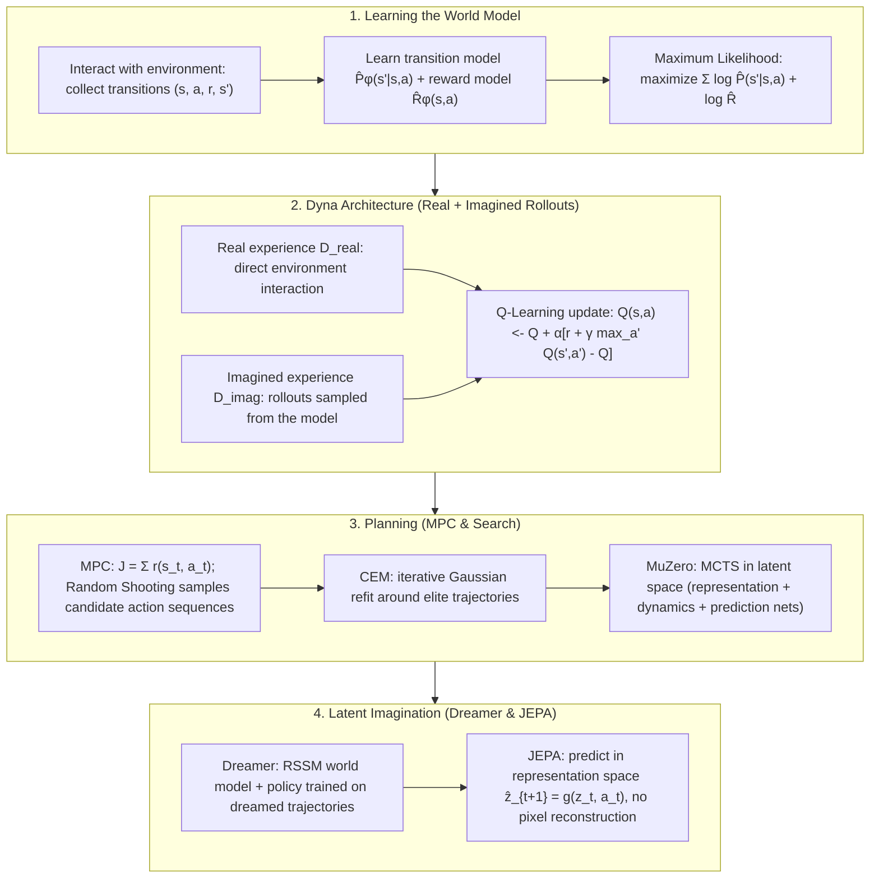

# 🧠 Model-Based RL & Planning: World Models, Dyna, MPC, MuZero & Dreamer

> **Core Executive Summary**: Model-based reinforcement learning (MBRL) equips the agent with an internal world model — a learned approximation of the transition dynamics $\hat{P}_\phi(s' \mid s, a)$ and reward function $\hat{R}_\phi(s, a)$ — and uses it for planning or imagination. This guide covers learning world models, the Dyna architecture, MPC (Random Shooting, CEM), MuZero's latent-dynamics MCTS, Dreamer's latent imagination, JEPA-style representation-space prediction, and MBRL's central failure mode: model bias and compounding error.

---

## 💡 Interactive Mermaid Architecture Flowchart



---

## 💡 Classic Interview Followups & Core Cheatsheet

* **Key Topic 1**: Compare model-based and model-free RL along sample efficiency, model bias, and computational cost.
  * *Standard Answer*: Model-free RL (DQN, PPO) learns by trial and error: every gradient update consumes fresh interactions — complex tasks need millions of steps. Model-based RL learns an approximate dynamics model and reuses it to synthesize unlimited rollouts, gaining huge sample efficiency. The cost is model bias: imperfect dynamics pollute value estimates and imagined rollouts drift from reality. Per-update compute is higher, but wall-clock is dominated by environment collection — MBRL wins when the real environment is slow (robotics) and loses when the simulator is free (games).

> 💡 **Intuition**: Model-free RL studies on real exam questions — every gradient step needs fresh environment feedback. Model-based RL first learns a mock exam (the world model) and drills on it — if the mock exam is wrong, the scores are wrong too.
>
> 🎤 **Interview answer**: Conclusion: model-based RL gains an order of magnitude in sample efficiency at the cost of model bias; model-free needs no model but is data-hungry. Why: the model amplifies one real transition into countless synthetic rollouts, but errors propagate along imagined chains. Example: a real robot costs 1 second per step and model-free needs a million steps; Dyna with $n=50$ planning steps reuses each real sample 50 times — but rollouts longer than a few steps drift out of control.
* **Key Topic 2**: Explain the Dyna architecture: how does mixing real and imagined experience accelerate learning, and what risks do hallucinated transitions introduce?
  * *Standard Answer*: Dyna interleaves two loops: a direct RL loop updating $Q$ from real transitions $(s, a, r, s')$, and a planning loop that samples past states, queries the model for imagined transitions, and applies the same update. Each real sample is amplified $n$ times per step (e.g. 50), propagating rewards backward in value space without touching the environment. The risk: if an imagined next state is wrong, the agent plans confidently against a fictitious future — so the model must be continuously refit.

> 💡 **Intuition**: Dyna writes every road you have seen once into a map, then mentally re-walks the map $n$ times each visit — value information spreads backward in time. The risk: a wrong map means confident planning toward a fictional future.
>
> 🎤 **Interview answer**: Conclusion: Dyna = real Q-learning + $n$ model-based planning steps; each real sample is amplified $n$ times. Why: imagined transitions receive the exact same Q update, making the model a "data amplifier" for value backups. Example: with $n=50$, one real transition triggers 50 Q-updates; if the model misremembers $s'$, the agent confidently plans a fictional future — so the model must keep being refit as data grows.
* **Key Topic 3**: Derive the MPC planning objective and contrast Random Shooting with CEM.
  * *Standard Answer*: MPC optimizes a finite-horizon action sequence:
  $$a^*_{t:t+H} = \arg\max_{a_{t:t+H}} \sum_{k=0}^{H-1} \gamma^k r(s_{t+k}, a_{t+k})$$
  Random Shooting samples $N$ candidate sequences, simulates each through the model, and executes the best first action under a receding horizon. CEM iterates instead: sample from a Gaussian, keep the top $K$ elites by simulated return, refit mean and variance — a derivative-free optimizer needing fewer samples in continuous control.

> 💡 **Intuition**: MPC plays only a few moves ahead: within a finite horizon it picks the action sequence with the highest predicted return, but executes just the first action and replans. Like driving by looking 50 meters ahead — every 10 meters you look again, always correcting with the freshest information.
>
> 🎤 **Interview answer**: Conclusion: MPC maximizes a finite-horizon return $J$ and executes only the first action (receding horizon). Why: Random Shooting uniformly samples $N$ sequences and takes the best — wasteful in high dimensions; CEM iteratively refits a Gaussian around elites, converging with far fewer samples. Example: balancing an inverted pendulum with $H=10$, $N=500$: Random Shooting needs 500 model forward passes; CEM needs about half that in 3–5 rounds of 100 samples.
* **Key Topic 4**: Why does MuZero avoid modeling observations and rewards explicitly?
  * *Standard Answer*: MuZero's insight: planning needs only task-relevant latent dynamics, not a generative world model. A representation network $h_\theta$ maps observations to a latent state; a dynamics network $g_\theta$ predicts the next latent state plus a latent reward; a prediction network $f_\theta$ outputs the policy and value for MCTS. It never reconstructs pixels or receives the game rules; these are learned implicitly. The networks train jointly on reward, value, and policy losses:
  $$\mathcal{L} = \sum_{t} \left( l^r_t + l^v_t + l^p_t \right)$$

> 💡 **Intuition**: Planning needs only a "sufficient internal world," not a "4K documentary." MuZero learns only latent transitions and rewards — it never reconstructs pixels and never reads the game rules; rules are learned implicitly as latent dynamics.
>
> 🎤 **Interview answer**: Conclusion: MuZero uses representation/dynamics/prediction networks for MCTS in latent space, without modeling observations or rewards explicitly. Why: reward is predicted only in latent space, and everything planning needs is learned end-to-end. Example: on a $19\times19$ Go board, AlphaZero needs the rules and a score function; MuZero receives only board states and win/loss — and matches AlphaZero, because it learns the rules as latent dynamics.

* **Key Topic 5**: What is the compounding-error problem in learned world models, and how is it mitigated?
  * *Standard Answer*: If the one-step model error is bounded by $\epsilon$, the worst-case $H$-step rollout error grows quadratically, $e^{(H)} = \mathcal{O}(H^2 \epsilon)$: each step starts from a hallucinated state, so trajectories drift off-distribution. Mitigations: short rollouts off real states (MBPO); a model-free policy inside the latent model (Dreamer); receding-horizon MPC; and dynamics ensembles (PETS).

> 💡 **Intuition**: An imagined chain is a game of telephone: each step starts from a previously guessed state, so a small one-step error snowballs until the whole trajectory leaves the training distribution and the model starts "making things up."
>
> 🎤 **Interview answer**: Conclusion: compounding error grows as $O(H^2\epsilon)$, the top failure mode of model-based RL. Why: a per-step error $\epsilon$ multiplies with the number of "wrong starting states" — exposure bias. Example: with $\epsilon=1\%$, $H=10$ gives error ≈0.1 but $H=100$ gives ≈1 (100%) — which is why industrial practice locks imagination length to 1–5 steps.

---

## 📚 Section 1: Learning the World Model

### 1.1 The Model-Based RL Framework

An MBRL system learns three components: a transition model $\hat{P}_\phi(s' \mid s, a)$, a reward model $\hat{R}_\phi(s, a)$, and a policy $\pi_\theta(a \mid s)$. The model may be explicit or latent; training alternates between collecting real experience, refitting the model, and improving the policy via simulated rollouts.

| Component | Role | Typical Parameterization |
| :--- | :--- | :--- |
| **Transition model** $\hat{P}_\phi(s' \mid s, a)$ | Predicts the next state (or its distribution) | Tabular counts, Gaussian MLP, RSSM latent dynamics |
| **Reward model** $\hat{R}_\phi(s, a)$ | Predicts the immediate reward | Regression head (MSE) or categorical distribution |
| **Policy / Planner** $\pi_\theta$ | Chooses actions using the model | Greedy over value iteration, MPC, or an actor network |

> 💡 **Intuition**: MBRL runs a "collect → learn model → practice policy inside the model → collect again" loop. The inner simulation loop is the source of sample efficiency — the model turns data into an infinitely queryable simulator.
>
> 🎤 **Interview answer**: Conclusion: MBRL = model + planning/imagination + policy, three components. Why: the model learns transitions and rewards from real data, and the policy drills inside it, cutting real interaction. Example: a quadruped learning to drift gets 20 real steps per hour, but 2000 simulated steps per minute in the model — provided the model is trustworthy for those 2000 steps.

### 1.2 Maximum Likelihood Learning of Dynamics and Rewards

From a dataset $\mathcal{D} = \{(s_i, a_i, r_i, s'_i)\}$, the model is fit by maximum likelihood:

$$\hat{P}_\phi, \hat{R}_\phi = \arg\max_{\phi} \sum_{i=1}^{N} \left[ \log \hat{P}_\phi(s'_i \mid s_i, a_i) + \log \hat{R}_\phi(r_i \mid s_i, a_i) \right]$$

Tabular environments reduce to empirical frequency counting; continuous control uses a Gaussian transition head, i.e. MSE plus variance regularization. Since the model only sees observed states, it is accurate where data is dense and unreliable elsewhere — the seed of model bias.

> 💡 **Intuition**: Maximum likelihood asks "which model makes the observed data most probable." For a Gaussian transition head in continuous control, MLE equals minimizing MSE — and the variance head doubles as a statement of how unsure the model is here.
>
> 🎤 **Interview answer**: Conclusion: world models are fit by maximum likelihood on transitions and rewards. Why: tabular environments reduce to empirical frequency counts; continuous ones use a Gaussian head — training is MSE plus variance regularization. Example: 1000 $(s,a,s')$ transitions train a Gaussian head; variance is small where data is dense and large where unseen — "accurate only where visited" is the seed of model bias.

### 1.3 Model-Based vs Model-Free at a Glance

> 💡 **Intuition**: Model-based is "buying a simulator," model-free is "renting the real machine": the simulator is costly to maintain (learn the model) but cheap to use (one learning, unlimited replays); the real machine charges for every step.
>
> 🎤 **Interview answer**: Conclusion: sample efficiency and model bias are one trade. Why: synthetic rollouts reuse data, while every model-free gradient needs real interaction. Example: with 1,000 real robot steps, model-free cannot learn, but Dyna's 50× imagination can — provided the model does not err too much.

> 📖 **How to read this table**: The core tradeoff is in rows 2–3 — model-based trades sample efficiency for model bias; row 5 ("Long-horizon accuracy") is the watershed: when a simulator is free, model-free is simpler and more reliable.

| Dimension | Model-Based RL | Model-Free RL |
| :--- | :--- | :--- |
| **Sample efficiency** | High — synthetic rollouts reuse data | Low — each update needs real experience |
| **Model bias** | High — model error propagates into planning | None — learns from true dynamics |
| **Compute per update** | Higher — model forward passes + planning | Lower — one gradient step |
| **Data reuse** | Excellent — model is a queryable data amplifier | Limited (decays with replay) |
| **Long-horizon accuracy** | Degrades with horizon | Stable but data-hungry |
| **Best suited for** | Robotics, real-world, scarce data | Games with fast simulators | 

---

## 📚 Section 2: Dyna Architecture — Real + Imagined Rollouts

### 2.1 The Dyna-Q Algorithm

Dyna-Q (Sutton & Barto) is the canonical example. After each real transition it (1) updates $Q$ from real experience, (2) memorizes $(s, a) \rightarrow (s', r)$ in a tabular model, and (3) repeats $n$ planning steps that sample a visited $(s, a)$, generate an imagined transition from the model, and apply the identical update:

$$Q(s, a) \leftarrow Q(s, a) + \alpha \left[ r + \gamma \max_{a'} Q(s', a') - Q(s, a) \right]$$

> 💡 **Intuition**: One real transition teaches Q one lesson; then the model replays that lesson $n$ times in the head — the same value information is chewed over and over, so values propagate fast. The tabular model is simply a "transition diary."
>
> 🎤 **Interview answer**: Conclusion: Dyna-Q = update Q from real experience + memorize the transition + $n$ planning steps inside the model. Why: imagined transitions receive the exact same Q-learning update as real ones. Example: on a 4×4 gridworld with $n_{\text{plan}}=50$, 200 episodes converge from 50+ steps to near the shortest path; with $n_{\text{plan}}=0$ it degrades to plain Q-learning and converges an order of magnitude slower.

### 2.2 Real vs Imagined Experience

> 💡 **Intuition**: Real experience is an "original part," imagined experience is a "3D-printed copy": cheap and plentiful, but usable only if the print parameters (the model) are accurate.
>
> 🎤 **Interview answer**: Conclusion: the value of imagined experience depends on model fidelity. Why: the bigger the amplifier's gain, the more the error is amplified too. Example: at 95% per-step model accuracy, a 5-step imagined chain is ≈77% and a 20-step chain ≈36% — which is why MBPO rolls out only 1–5 steps.

> 📖 **How to read this table**: One sentence — real experience is expensive but faithful (the ground-truth anchor), imagined experience is nearly free but approximate (the amplifier). The "Fidelity" row caps how long you dare to roll out, which is why "short rollouts" is an MBRL engineering rule.

| Property | Real Experience $\mathcal{D}_{\text{real}}$ | Imagined Experience $\mathcal{D}_{\text{imag}}$ |
| :--- | :--- | :--- |
| **Source** | Direct environment interaction | Rollouts through the learned model |
| **Cost** | Expensive (time, risk) | Nearly free |
| **Fidelity** | Ground truth | Approximate (near training data) |
| **Role** | Ground truth anchor, model fitting | Value backup, experience amplification |

Imagination is an amplifier: one real transition seeds dozens of planning updates, propagating reward backward in value space without touching the environment.

---

## 📚 Section 3: Model Predictive Control (MPC)

### 3.1 The Planning Objective

Given the learned model, planning selects the action sequence maximizing the discounted sum of predicted rewards over horizon $H$:

$$a^*_{t:t+H} = \arg\max_{a_{t:t+H}} \sum_{k=0}^{H-1} \gamma^k r(s_{t+k}, a_{t+k})$$

MPC executes only the first action $a^*_t$ and re-plans from the new state — a receding horizon robust to model error.

> 💡 **Intuition**: Rehearse inside the model: run the $H$-step action sequence, count the predicted rewards, pick the best one — but perform only the first action, then rehearse again from the new state.
>
> 🎤 **Interview answer**: Conclusion: MPC maximizes the discounted sum of predicted rewards over horizon $H$ and executes only the first action, replanning each step. Why: the receding horizon means model error only affects the current step. Example: with $H=10$ and $\gamma=0.95$, the 5th step's reward is weighted $\gamma^5 \approx 0.77$ — distant rewards are discounted, so an unreliable model far in the future is harmless.

### 3.2 Random Shooting

Sample $N$ candidate sequences uniformly, simulate each through the model, score by $J$, execute the best first action. Simple and parallel, but quality scales with $N$.

> 💡 **Intuition**: Blindly throw darts: toss $N$ candidate sequences, see which lands closest to the bullseye, and take its first step. Simple and parallelizable, but in high-dimensional action spaces "blind throws" rarely hit.
>
> 🎤 **Interview answer**: Conclusion: Random Shooting samples $N$ sequences uniformly, simulates each through the model, scores by $J$, and executes the best first action. Why: quality depends entirely on $N$ and degrades exponentially with the action dimension. Example: with a 2-D action and $H=10$, 500 samples work fine; on a 20-D robot arm, uniform sampling's hit rate collapses — switch to CEM.

### 3.3 Cross-Entropy Method (CEM)

CEM replaces blind sampling with iterative distribution fitting — sample from $\mathcal{N}(\mu, \sigma)$, keep the top $K$ elites by simulated return, refit:

$$\mu \leftarrow \frac{1}{K} \sum_{i \in \mathcal{E}} a^{(i)}_{t:t+H}, \qquad \sigma \leftarrow \sqrt{\frac{1}{K} \sum_{i \in \mathcal{E}} \left( a^{(i)}_{t:t+H} - \mu \right)^2}$$

> 💡 **Intuition**: CEM is "survivor-bias learning": cast a wide net (Gaussian sampling), keep the top $K$ "elites," then recast the net from their mean and variance — the mesh gets steadily more precise.
>
> 🎤 **Interview answer**: Conclusion: CEM iteratively fits a Gaussian to elite trajectories — a derivative-free trajectory optimizer. Why: $\mu$ drifts toward the elite mean and $\sigma$ shrinks, concentrating samples on high-return regions. Example: in continuous control with $N=100$ samples and $K=10$ elites per round, 3–5 rounds usually converge — about 1/10 the samples of Random Shooting.

> 📖 **How to read this table**: Check "Search Strategy" and "Action Space": discrete large spaces call for MCTS (sequential tree search), continuous spaces for CEM (iterative refitting); Random Shooting suits cheap, fast prototyping.

| Method | Search Strategy | Iterative Optimization | Action Space | Cost Profile |
| :--- | :--- | :--- | :--- | :--- |
| **Random Shooting** | Uniform sampling | None | Discrete/Continuous | $\mathcal{O}(N)$ parallel rollouts |
| **CEM** | Gaussian resampling | Elite selection + refit | Continuous | $\mathcal{O}(I \times N)$ |
| **MCTS** | Tree search with UCB | Node expansion + backup | Discrete (large) | Sequential search |

---

## 📚 Section 4: Latent World Models — MuZero & Dreamer

### 4.1 MuZero: Planning without an Explicit Model

MuZero (Schrittwieser et al., 2020) abandons explicit environment modeling and learns dynamics in a latent space sufficient for planning. Three networks — representation $h_\theta$ (observations $\rightarrow$ latent state), dynamics $g_\theta$ (latent state + action $\rightarrow$ next latent state and reward), and prediction $f_\theta$ (latent state $\rightarrow$ policy and value for MCTS) — are trained end-to-end on the sum of reward, value, and policy losses:

$$\mathcal{L} = \sum_{t} \left( l^r_t + l^v_t + l^p_t \right)$$

The reward is predicted only in latent space — why MuZero beat AlphaZero in Go, chess, and shogi and excels on Atari without rules or score.

> 💡 **Intuition**: Compress the world to "the minimal dynamics needed for decisions": you don't need to paint a photo of the board, only to know how the position (latent state) changes after a move and what it is worth.
>
> 🎤 **Interview answer**: Conclusion: MuZero's three networks (representation/dynamics/prediction) learn latent dynamics and rewards for MCTS planning, without modeling observations or rewards explicitly. Why: everything is trained end-to-end on reward/value/policy losses, with the rules encoded implicitly. Example: given only (board, win/loss), MuZero reaches AlphaZero's level in Go without the rules; EfficientZero adds self-supervised consistency and pushes Atari sample efficiency up another order of magnitude.

### 4.2 Dreamer: Learning Behaviors by Latent Imagination

Dreamer (Hafner et al., 2019) learns a Recurrent State-Space Model (RSSM): an encoder compresses observations into a latent state $z_t$, a sequence model predicts latent dynamics, and a decoder reconstructs observations. Policy learning happens entirely through dreamed trajectories — actor and critic train on imagined rollouts without touching the real environment, reaching human-level Atari performance with a fraction of the data:

$$J(\theta) = \mathbb{E}_{(z, a, \hat{r}, z') \sim \text{imagination}} \left[ \sum_{k} \gamma^k \hat{r}_k \right]$$

> 💡 **Intuition**: Dreamer lets the agent "learn while asleep": collect a little experience during the day (real environment), train millions of steps in dreams (RSSM latent space), and wake up proficient.
>
> 🎤 **Interview answer**: Conclusion: Dreamer trains actor-critic on RSSM latent imagination; the policy learns entirely in dreamed trajectories. Why: an encoder compresses observations, a sequence model predicts latent dynamics, and a decoder supports representation learning. Example: playing Atari from pixels, Dreamer reaches human level with roughly 1/10 of the data model-free needs — imagined rollouts never touch the real environment.

> 📖 **How to read this table**: The last column is a timeline: Dyna's tabular model (1990) → generative latent worlds (2018) → MBPO/Dreamer short rollouts and latent imagination (2019) → MuZero with implicit rules (2020) — the main line of how world models are learned.

| Algorithm | Key Idea | Learning Paradigm | Reference |
| :--- | :--- | :--- | :--- |
| **Dyna-Q** | Tabular model + $n$ planning steps | Value-based, real + imagined | Sutton & Barto (1990) |
| **World Models** | VAE + MDN-RNN + controller | Unsupervised latent world | Ha & Schmidhuber (2018) |
| **MBPO** | Short model rollouts + off-policy RL | Hybrid real + simulated data | Janner et al. (2019) |
| **Dreamer** | Latent imagination with RSSM | Recurrent state-space model | Hafner et al. (2019) |
| **MuZero** | Latent dynamics for MCTS | Model-based with implicit rules | Schrittwieser et al. (2020) |

### 4.3 World Models and JEPA

JEPA (Joint-Embedding Predictive Architecture) is the self-supervised cousin of latent world models: instead of reconstructing pixels, it predicts in representation space:

$$\mathcal{L}_{\text{JEPA}} = \left\| g_\phi(z_t, a_t) - f_{\bar{\theta}}(z_{t+1}) \right\|_2^2$$

where $z$ come from an EMA target encoder. Dreamer and MuZero already embody this philosophy; V-JEPA-2 extends it with action-conditioned post-training for MPC in robot manipulation. Lesson: predict structure, not pixels.

> 💡 **Intuition**: JEPA is the self-supervised cousin of Dreamer/MuZero: same philosophy of latent-space prediction, no pixel reconstruction. The difference is JEPA uses an EMA target network for self-supervision and need not be action-conditioned.
>
> 🎤 **Interview answer**: Conclusion: JEPA predicts in representation space, $\hat z_{t+1} = g(z_t, a_t)$, aligned against EMA target-encoder features, with no decoder. Why: predict structure rather than pixels, keeping compute off irrelevant high-frequency noise. Example: V-JEPA-2 action-conditioned post-training turns video-pretrained representations into a planable world model used directly for robot MPC — zero pixel reconstructions, planning as usual.

---

## 📚 Section 5: Model Bias & Compounding Error

### 5.1 Compounding Error

With one-step model error bounded by $\epsilon$, the worst-case error over $H$ simulated steps grows quadratically:

$$e^{(H)} = \mathcal{O}(H^2 \epsilon)$$

Each imagined step begins from a predicted state, so the trajectory drifts off-distribution — the exposure-bias reason long imagination fails.

> 💡 **Intuition**: An imagined chain is a game of telephone: each step starts from a guessed state, small one-step errors amplify, and the whole trajectory eventually leaves the training-data region where the model starts "making things up."
>
> 🎤 **Interview answer**: Conclusion: long-rollout error grows quadratically, $e^{(H)} = O(H^2 \epsilon)$ — the top failure mode of MBRL. Why: per-step error $\epsilon$ multiplies with the number of "wrong starting states," i.e., exposure bias. Example: with $\epsilon = 1\%$: $H=10$ → error ≈0.1, but $H=100$ → ≈1 (100%) — hence the industrial rule of keeping imagination at 1–5 steps.

### 5.2 Mitigation Strategies

1. **Short rollouts from real states** — MBPO branches 1–5 imaginary steps off real transitions, never long chains:
$$J(\theta) = \mathbb{E}_{(s,a,r,s') \sim \mathcal{D}_{\text{real}} \cup \mathcal{D}_{\text{model}}} \left[ r + \gamma V_{\pi_\theta}(s') \right]$$
2. **Latent imagination with model-free critics** — Dreamer trains a model-free policy inside the latent model instead of via long rollouts.
3. **Receding-horizon MPC** — only the first action is executed, so errors beyond the horizon never affect control.
4. **Ensembles and uncertainty** — PETS plans against an ensemble of dynamics models.
5. **Continual refitting** — update the model as the data distribution shifts with the improving policy.

> 💡 **Intuition**: Every remedy is about "not letting errors snowball": roll short (imagine only 1–5 steps from real states), practice in dreams (differentiable latent model), look one step ahead (MPC), or let several models correct each other (ensembles).
>
> 🎤 **Interview answer**: Conclusion: five mitigations — short rollouts (MBPO), latent imagination with a model-free critic (Dreamer), receding-horizon MPC, dynamics ensembles (PETS), and continual refitting. Why: they all reduce the number of rollouts that start from a wrong state. Example: MBPO branches just 5 steps off real replay transitions with SAC and beats model-free sample efficiency by 10× without degrading performance.

---

## 🐍 Pure Numpy Implementation: Tabular Dyna-Q on a Gridworld

```python
import numpy as np

class GridWorld:
    """4x4 gridworld. Actions: 0=up, 1=down, 2=left, 3=right. Goal: bottom-right cell."""
    def __init__(self, size: int = 4):
        self.size = size
        self.goal = (size - 1) * size + (size - 1)

    def reset(self) -> int:
        self.state = 0
        return self.state

    def step(self, action: int):
        x, y = divmod(self.state, self.size)
        moves = {0: (-1, 0), 1: (1, 0), 2: (0, -1), 3: (0, 1)}
        dx, dy = moves[action]
        nx, ny = x + dx, y + dy
        if 0 <= nx < self.size and 0 <= ny < self.size:
            self.state = nx * self.size + ny
        reward = 1.0 if self.state == self.goal else 0.0
        done = self.state == self.goal
        return self.state, reward, done


class DynaQAgent:
    """Pure Numpy Dyna-Q: Q-learning on real transitions + n planning steps
    through a tabular model that replays memorized (s, a) -> (s', r)."""
    def __init__(self, num_states: int, num_actions: int,
                 alpha: float = 0.2, gamma: float = 0.95, n_plan: int = 50):
        self.q = np.zeros((num_states, num_actions))
        self.model = {}          # (s, a) -> list of observed (s_next, r)
        self.visited = []        # all (s, a) pairs seen so far (planning source)
        self.alpha = alpha
        self.gamma = gamma
        self.n_plan = n_plan

    def act(self, s: int, epsilon: float = 0.3) -> int:
        if np.random.rand() < epsilon:
            return np.random.randint(self.q.shape[1])
        return int(np.argmax(self.q[s]))

    def update_and_plan(self, s: int, a: int, r: float, s_next: int, done: bool):
        # 1) Direct RL: Q-Learning update on REAL experience
        target = r if done else r + self.gamma * np.max(self.q[s_next])
        self.q[s, a] += self.alpha * (target - self.q[s, a])

        # 2) Memorize the transition in the world model
        if (s, a) not in self.model:
            self.model[(s, a)] = []
            self.visited.append((s, a))
        self.model[(s, a)].append((s_next, r))

        # 3) Planning loop: n imagined rollouts from the model
        for _ in range(self.n_plan):
            s_p, a_p = self.visited[np.random.randint(len(self.visited))]
            s_m, r_m = self.model[(s_p, a_p)][np.random.randint(len(self.model[(s_p, a_p)]))]
            target = r_m + self.gamma * np.max(self.q[s_m])
            self.q[s_p, a_p] += self.alpha * (target - self.q[s_p, a_p])


if __name__ == "__main__":
    np.random.seed(42)
    env = GridWorld(size=4)
    agent = DynaQAgent(num_states=16, num_actions=4, n_plan=50)
    episodes, steps_per_episode = 200, []
    for _ in range(episodes):
        s, done, steps = env.reset(), False, 0
        while not done and steps < 100:
            a = agent.act(s, epsilon=0.3)
            s_next, r, done = env.step(a)
            agent.update_and_plan(s, a, r, s_next, done)
            s, steps = s_next, steps + 1
        steps_per_episode.append(steps)
    print("✅ Dyna-Q trained for 200 episodes.")
    print("First 10 episodes steps-to-goal:", steps_per_episode[:10])
    print("Last 10 episodes steps-to-goal:", steps_per_episode[-10:])
```

> 💡 **Intuition**: `update_and_plan` lays Dyna bare: one Q-update on the real transition, the transition $(s,a) \to (s',r)$ memorized in the `model` dict, then 50 imagined replays sampled from visited $(s,a)$ pairs — one real, fifty imagined.
>
> 🎤 **Interview answer**: Conclusion: $n_{\text{plan}}=50$ means each real sample is amplified 50 times. Why: the model dict stores multiple observed outcomes per $(s,a)$ and samples one at random — a stochastic transition model in table form. Example: on a 4×4 gridworld trained for 200 episodes, the first 10 episodes typically take far more steps to reach the goal than the last 10 — converging from tens of steps toward the shortest path, the payoff of 50 planning steps.

---

## 📝 Takeaways & Engineering Best Practices

1. **Choose the paradigm by data cost** — model-based when the environment is slow, risky, or expensive; model-free when a simulator is free.
2. **Keep imagination short** — branch 1–5 steps off real states (MBPO) to tame compounding error.
3. **Predict in latent space, not pixel space** — planning needs task-relevant dynamics, not reconstruction (MuZero, Dreamer, JEPA).
4. **Use receding-horizon MPC for continuous control** — execute the first action, replan each step, and prefer CEM as the action dimension grows.
5. **Refit the model continuously and consider ensembles** — it must track the policy's shifting data distribution.