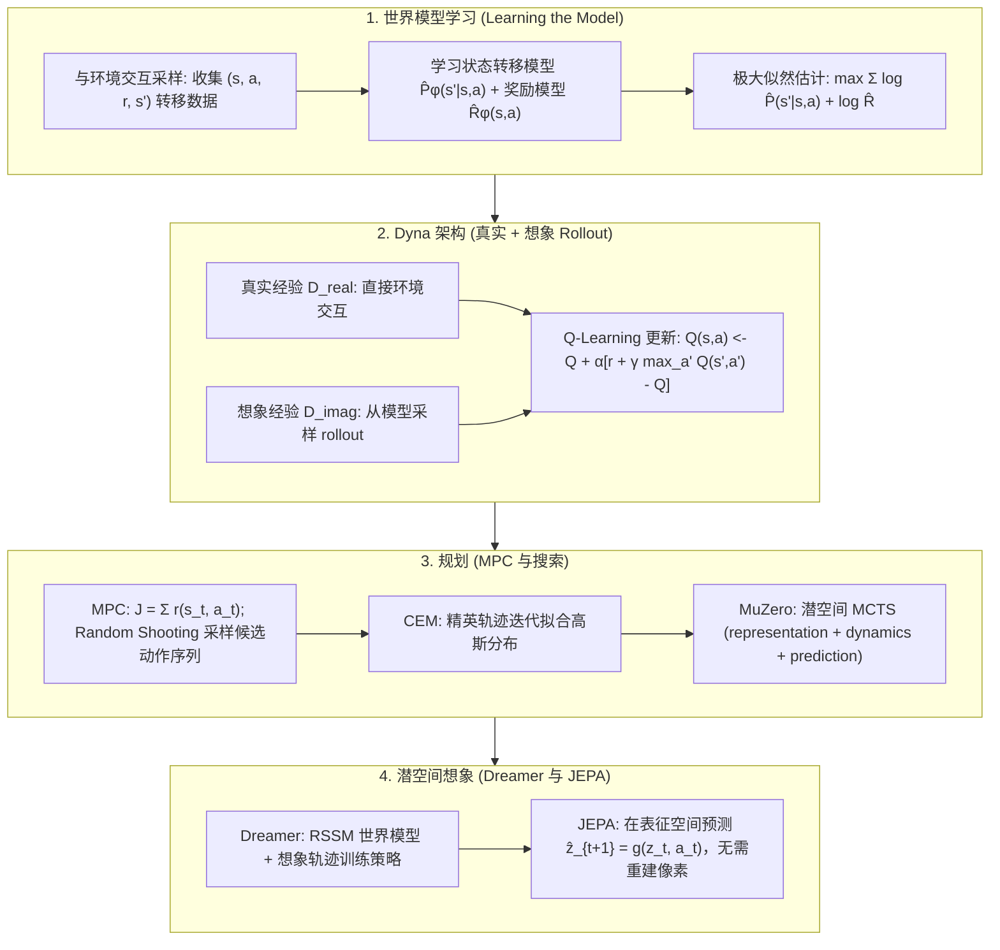

# 🧠 基于模型的强化学习与规划：世界模型、Dyna、MPC、MuZero 与 Dreamer 全景

> **核心摘要**：基于模型的强化学习 (Model-Based RL, MBRL) 为智能体配备一个内部**世界模型**——对环境的动态转移 $\hat{P}_\phi(s' \mid s, a)$ 与奖励函数 $\hat{R}_\phi(s, a)$ 的近似学习——并利用该模型进行**规划 (Planning)** 或生成**想象经验 (Imagined Experience)**。本指南系统解构世界模型的极大似然学习、Dyna 架构真实与想象 rollout 的混合、MPC 模型预测控制 (Random Shooting 与 CEM)、MuZero 潜空间动态模型 + MCTS、Dreamer 潜空间想象训练、世界模型与 JEPA 表征空间预测的内在联系，以及 MBRL 的核心失败模式——模型偏差与复合误差问题。

---

## 💡 交互式 Mermaid 架构流程图



---

## 💡 经典面试追问与考点速查

* **考点 1**：对比 Model-Based 与 Model-Free 强化学习在样本效率、模型偏差与计算成本三个维度上的差异？
  * *标准回答*：Model-Free RL（DQN、PPO 等）纯粹依靠试错学习，每次梯度更新都要消耗真实环境交互，在复杂环境中往往需要数百万步；而 Model-Based RL 先学习近似动力学模型，再利用该模型生成无限量的合成 rollout 数据，可将样本效率提升一个数量级以上。代价是：学习到的模型永远存在误差，其**偏差会传导进价值估计**——想象 rollout 越长越偏离真实（复合误差）。计算上，Model-Based 单次更新更昂贵（模型前向 + 规划），但总时间通常由环境采集主导，因此真实环境昂贵时（机器人）MBRL 胜出，完美模拟器免费时（游戏引擎）Model-Free 更简洁可靠。

> 💡 **直观理解**：Model-Free 是"在真题里刷题"，每一步都要真实环境给反馈；Model-Based 是"先学一本模拟卷（世界模型），再用模拟卷刷题"——试卷错了，分数也会失真。
>
> 🎤 **面试速答**：结论：Model-Based 样本效率高一个数量级，代价是模型偏差；Model-Free 无需模型但极耗数据。原理：模型把一条真实转移放大成无数合成 rollout；误差沿想象链传播产生复合误差。例子：机器人真机 1 步 1 秒，Model-Free 要百万步；Dyna 用 $n=50$ 步想象，同样的真实数据可当 50 条用，但 rollout 超过几步误差就失控。
* **考点 2**：解释 Dyna 架构：真实经验与想象经验混合为什么能加速学习？幻觉数据带来什么风险？
  * *标准回答*：Dyna 交织两个循环：**直接 RL 循环**用真实转移 $(s, a, r, s')$ 执行 Q-Learning 更新；**规划循环**从历史状态 $s$ 出发，调用模型 $\hat{P}_\phi, \hat{R}_\phi$ 生成想象转移 $(s, a, \hat{r}, \hat{s}')$ 并施加完全相同的 Q-Learning 更新。每个真实样本每步被放大 $n$ 次（如 $n=50$ 步规划），价值信息得以在不接触环境的情况下向过去多步回传。风险：**模型偏差**——若模型想象的 $\hat{s}'$ 是错的，智能体将自信地规划一个虚构的未来；极端时模型误差被策略主动利用，形成"模型幻觉 (Model Delusion)"，因此模型必须随数据增长持续重拟合。

> 💡 **直观理解**：Dyna 像把"见过一次的路"写进地图，之后每次经过都在脑子里把地图重走 $n$ 遍，价值信息因此向过去扩散。风险：地图可能画错，越自信的规划越是幻觉。
>
> 🎤 **面试速答**：结论：Dyna = 真实 Q-Learning + $n$ 步模型内规划，每个真实样本被放大 $n$ 倍。原理：想象经验施加完全相同的 Q 更新，等价于价值回传的"数据放大器"。例子：$n=50$ 时一条真实转移触发 50 次 Q 更新；若模型记错 $s'$，智能体会自信地"规划"一个虚构的未来，因此模型必须随数据持续重拟合。
* **考点 3**：推导 MPC 的规划目标，并对比 Random Shooting 与 CEM 的优化机制？
  * *标准回答*：MPC 在有限时域 $H$ 内优化动作序列：
  $$a^*_{t:t+H} = \arg\max_{a_{t:t+H}} \sum_{k=0}^{H-1} \gamma^k r(s_{t+k}, a_{t+k})$$
  **Random Shooting**：从均匀（或先验）分布 i.i.d. 采样 $N$ 条候选动作序列，经模型逐一模拟后按累计回报 $J$ 选出最优，只执行第一个动作（滚动时域）。**CEM**：迭代优化——每次从高斯分布 $\mathcal{N}(\mu, \sigma)$ 采样 $N$ 条序列，按模拟回报保留前 $K$ 条精英轨迹，再用精英重拟合 $\mu, \sigma$。CEM 是免梯度的轨迹优化器，在连续控制中通常以远少于 Random Shooting 的样本收敛。

> 💡 **直观理解**：MPC 是"只看三步棋"：在有限时域里挑累计回报最高的动作序列，但只执行第一步，然后重新看。像开车只看前方 50 米，开过 10 米再看一次——永远用最新信息纠偏。
>
> 🎤 **面试速答**：结论：MPC 优化有限时域回报 $J$，只执行首动作（滚动时域）。原理：Random Shooting 均匀采样 $N$ 条序列取最优，浪费多；CEM 用"精英重拟合高斯"迭代收敛，样本效率高。例子：控制倒立摆，$H=10$、$N=500$，Random Shooting 需 500 次模型前向；CEM 3~5 轮、每轮 100 条，约一半样本即可找到同等质量轨迹。
* **考点 4**：为什么 MuZero 不显式建模观测与奖励？三个网络各承担什么角色？
  * *标准回答*：MuZero 的核心洞察是：规划只需要**任务相关的潜空间动态**，而无需完整的生成式世界模型。**representation 网络** $h_\theta(o_{1:t})$ 将观测映射为潜状态 $z_t$；**dynamics 网络** $g_\theta(z_t, a_t)$ 预测下一潜状态与潜空间奖励；**prediction 网络** $f_\theta(z_t)$ 输出供 MCTS 使用的策略与价值。它从不重建像素，也不依赖环境规则——在围棋中规则被隐式学进潜动态。三个网络端到端联合训练，损失为奖励、价值、策略损失之和：
  $$\mathcal{L} = \sum_{t} \left( l^r_t + l^v_t + l^p_t \right)$$

> 💡 **直观理解**：规划只需要"够用的内心世界"，不需要"高清纪录片"。MuZero 只学潜空间里的转移 + 奖励，从不重建像素、不读游戏规则——规则被隐式学进了潜动态。
>
> 🎤 **面试速答**：结论：MuZero 用 representation/dynamics/prediction 三网络在潜空间做 MCTS，不建模观测与奖励。原理：奖励只在潜空间被预测，规划所需信息全部由三网络端到端学出。例子：围棋棋盘 $19\times19$，AlphaZero 需要规则与奖励函数；MuZero 只给棋盘状态与胜负信号，就在围棋/象棋/Atari 上追平甚至超越——因为它把"规则"学成了潜动态。

* **考点 5**：什么是复合误差 (Compounding Error) 问题？主流方法如何缓解？
  * *标准回答*：若单步模型误差上界为 $\epsilon$，则 $H$ 步 rollout 的最坏累计误差按**二次方**增长：$e^{(H)} = \mathcal{O}(H^2 \epsilon)$（Ross & Bagnell）。每一步规划都从"上一轮被预测出的状态"出发，误差逐级累积使轨迹偏离训练分布，模型被迫外推到从未见过的区域。缓解手段：(1) **短 rollout**——MBPO 只从真实状态分支 1-5 步想象；(2) **潜空间想象 + Model-Free 评论家**——Dreamer 把世界模型当作可微模拟器训练策略，而非长时域 rollout；(3) **滚动时域 MPC**——只执行首动作，时域以外的误差不影响控制；(4) **模型集成 (PETS)** 与持续重拟合对冲单模型失准。

> 💡 **直观理解**：想象链每一步都从"上一轮猜出的状态"出发，误差像滚雪球：猜错一点，下一步在错误位置上再猜，越滚越歪，最终漂出训练数据覆盖区。
>
> 🎤 **面试速答**：结论：复合误差最坏 $O(H^2\epsilon)$，$H$ 步想象越长越失真。原理：单步误差 $\epsilon$ 沿 rollout 二次累积，即曝光偏差。例子：$\epsilon=0.01$ 时，$H=10$ 步误差 ≈1，$H=50$ 步 ≈25——所以 MBPO 只从真实状态想象 1~5 步，Dreamer 在潜空间短展开，MPC 只执行首动作。

---

## 📚 第一章：世界模型学习 (Learning the World Model)

### 1.1 基于模型的 RL 框架

MBRL 系统学习三个组件：转移模型 $\hat{P}_\phi(s' \mid s, a)$、奖励模型 $\hat{R}_\phi(s, a)$ 与策略 $\pi_\theta(a \mid s)$。模型既可以是显式的（预测下一状态），也可以是潜空间的（预测紧凑的内部表征）。训练在"采集真实经验 → 重拟合模型 → 在模型内模拟 rollout 改进策略"之间交替——**内部模拟环**正是样本效率的来源。

| 组件 | 角色 | 典型参数化 |
| :--- | :--- | :--- |
| **转移模型** $\hat{P}_\phi(s' \mid s, a)$ | 预测下一状态（或其分布） | 表格频率计数、高斯 MLP、RSSM 潜动态 |
| **奖励模型** $\hat{R}_\phi(s, a)$ | 预测即时奖励 | 回归头 (MSE) 或分类分布 |
| **策略 / 规划器** $\pi_\theta$ | 依据模型选择动作 | 值迭代贪心、MPC、Actor 网络 |

> 💡 **直观理解**：MBRL 的循环是"采集 → 学模型 → 在模型里练策略 → 再采集"：内部模拟环正是样本效率的来源——模型把数据变成可无限查询的模拟器。
>
> 🎤 **面试速答**：结论：MBRL = 模型 + 规划/想象 + 策略三件套。原理：模型从真实数据学转移与奖励，策略在模型内演练，减少真实交互。例子：四轮车机器人学漂移，真车 1 小时只能跑 20 步；模型里 1 分钟模拟 2000 步——前提是模型对这 2000 步都靠谱。

### 1.2 动态与奖励的极大似然学习

从任意探索策略收集的数据集 $\mathcal{D} = \{(s_i, a_i, r_i, s'_i)\}$ 出发，模型以极大似然准则拟合：

$$\hat{P}_\phi, \hat{R}_\phi = \arg\max_{\phi} \sum_{i=1}^{N} \left[ \log \hat{P}_\phi(s'_i \mid s_i, a_i) + \log \hat{R}_\phi(r_i \mid s_i, a_i) \right]$$

表格环境退化为经验频率计数；连续控制中转移头输出高斯分布 $\mathcal{N}(\mu_\phi(s,a), \sigma^2_\phi)$，训练等价于均方误差最小化加方差正则。由于模型只在观测过的状态上训练，**数据密集处准确、未见区域不可靠**——这正是模型偏差的种子。

> 💡 **直观理解**：极大似然就是在问"什么样的模型让已观测数据最可能发生"。连续控制里高斯转移头的 MLE 等价于最小化 MSE，方差项还顺带表达"模型在这里多没把握"。
>
> 🎤 **面试速答**：结论：世界模型以极大似然拟合转移与奖励。原理：离散表格退化为频率计数；连续用高斯头，训练 = MSE + 方差正则。例子：1000 条 $(s,a,s')$ 转移训练高斯头，数据密集区域预测方差小、未见过区域方差大——"只在见过的地方准"就是模型偏差的种子。

### 1.3 Model-Based vs Model-Free 全景对比

> 💡 **直观理解**：Model-Based 是"买模拟器"，Model-Free 是"租真机"：模拟器贵在维护（学模型）但便宜使用（一次学习、无限次回放）；真机每一步都贵。
>
> 🎤 **面试速答**：结论：样本效率与模型偏差是一笔交易。原理：合成 rollout 复用数据 vs 每次梯度都要真实交互。例子：机器人 1000 步真实数据，Model-Free 学不动，Dyna 想象放大 50 倍后能学会——前提是模型别错太多。

> 📖 **怎么读这张表**：核心矛盾在第二、三行——Model-Based 换来了样本效率，却背上了模型偏差；第五行"长时域精度"是两者的分水岭：模拟器免费时 Model-Free 反而更省心。

| 维度 | Model-Based RL | Model-Free RL |
| :--- | :--- | :--- |
| **样本效率** | 高——合成 rollout 复用数据，环境交互少一个数量级 | 低——每次更新都需要新的真实经验 |
| **模型偏差** | 高——模型误差传导进规划（复合误差） | 无——直接学习真实动态 |
| **单次更新计算成本** | 较高——模型前向 + 规划/搜索开销 | 较低——一步策略/价值梯度 |
| **数据复用** | 极佳——模型是可查询的数据放大器 | 有限（off-policy 回放有衰减） |
| **长时域精度** | 随时域退化（最坏 $\mathcal{O}(H^2 \epsilon)$） | 稳定但极耗数据 |
| **最适合场景** | 机器人、真实世界、稀疏昂贵数据 | 快速模拟器游戏、大规模 HF | 

---

## 📚 第二章：Dyna 架构——真实与想象 Rollout 的混合

### 2.1 Dyna-Q 算法

Dyna-Q（Sutton & Barto）是最经典的实现。每个真实转移之后依次执行三步：(1) 用真实经验更新 $Q$；(2) 把 $(s, a) \rightarrow (s', r)$ 记入表格模型；(3) 重复 $n$ 步规划——随机抽取一个历史 $(s, a)$，让模型生成想象转移，施加完全相同的 Q-Learning 更新：

$$Q(s, a) \leftarrow Q(s, a) + \alpha \left[ r + \gamma \max_{a'} Q(s', a') - Q(s, a) \right]$$

> 💡 **直观理解**：一次真实转移教给 Q 一条经验，然后模型在脑子里把这条经验重播 $n$ 次——同样的价值信息被反复咀嚼，价值自然学得快。表格模型就是一本"转移日记"。
>
> 🎤 **面试速答**：结论：Dyna-Q 三步：真实更新 Q、记忆转移、$n$ 步模型内规划。原理：想象转移施加与真实完全相同的 Q-Learning 更新。例子：4×4 网格世界，$n_{\text{plan}}=50$，200 个 episode 就从 50+ 步收敛到接近最短路径；若 $n_{\text{plan}}=0$ 则退化为纯 Q-Learning，收敛慢一个数量级。

### 2.2 真实经验 vs 想象经验

> 💡 **直观理解**：真实经验是"原装零件"，想象经验是"3D 打印件"：便宜、量大，但只有打印参数准（模型准）才可用。
>
> 🎤 **面试速答**：结论：想象经验的价值取决于模型保真度。原理：放大器的倍数越大，误差被放得也越大。例子：模型单步准确率 95% 时，5 步想象链 ≈77%、20 步 ≈36%——所以 MBPO 只滚 1~5 步。

> 📖 **怎么读这张表**：一句话——真实经验贵但保真（真理锚点），想象经验几乎免费但近似（放大器）。"保真度"一列决定了规划步数的上限，所以"短 rollout"是 MBRL 的工程铁律。

| 属性 | 真实经验 $\mathcal{D}_{\text{real}}$ | 想象经验 $\mathcal{D}_{\text{imag}}$ |
| :--- | :--- | :--- |
| **来源** | 直接与环境交互 | 穿过学习模型的 rollout |
| **成本** | 昂贵（时间、硬件、风险） | 几乎免费——纯计算 |
| **保真度** | 地面真值 | 近似；仅在训练数据附近准确 |
| **作用** | 真理锚点、模型拟合数据 | 大规模价值回传、经验放大 |

想象是一种**放大器**：一条真实转移可以播种数十次规划更新，在不触碰环境的情况下将奖励信息在价值空间向历史多步回传。

---

## 📚 第三章：MPC 模型预测控制 (Model Predictive Control)

### 3.1 规划目标

给定学习模型，规划在时域 $H$ 内选择使预测奖励折扣和最大的动作序列：

$$a^*_{t:t+H} = \arg\max_{a_{t:t+H}} \sum_{k=0}^{H-1} \gamma^k r(s_{t+k}, a_{t+k})$$

MPC 只执行首动作 $a^*_t$，然后从新观测状态重新规划——**滚动时域 (Receding Horizon)** 性质使其对模型误差天然鲁棒。

> 💡 **直观理解**：在模型里"彩排"：把 $H$ 步的动作序列过一遍，数一数能拿多少预期奖励，选最多的那条——但只演第一步，之后重新彩排。
>
> 🎤 **面试速答**：结论：MPC 在时域 $H$ 内最大化折扣奖励和，只执行首动作并重规划。原理：滚动时域让误差只影响当前步，对模型失准天然鲁棒。例子：$H=10$、$\gamma=0.95$，第 5 步奖励权重 $\gamma^5 \approx 0.77$，越远的奖励越打折扣——模型在远端不可靠也不怕。

### 3.2 Random Shooting

从 $\mathcal{U}(\mathcal{A})$（或任意提议分布）i.i.d. 采样 $N$ 条候选动作序列 $a^{(i)}_{t:t+H}$，用模型逐一模拟并按 $J$ 打分，执行最优序列的首动作。实现简单、可并行、优化过程免模型——但质量依赖 $N$，高维动作空间下浪费严重。

> 💡 **直观理解**：盲投飞镖：扔 $N$ 根，看哪根离靶心最近，就照它走一步。实现简单、可并行，但高维动作空间里"盲投命中"越来越难。
>
> 🎤 **面试速答**：结论：Random Shooting 均匀采样 $N$ 条序列、模拟打分、执行最优首动作。原理：质量完全依赖 $N$，与维度呈指数级的低效。例子：2 维动作、$H=10$ 时采样 500 条已不错；20 维机械臂，均匀采样命中好轨迹的概率指数下降，必须换 CEM。

### 3.3 交叉熵方法 (CEM)

CEM 用迭代分布拟合替代盲目采样。每轮：从 $\mathcal{N}(\mu, \sigma)$ 采样 $N$ 条序列；按模拟回报保留前 $K$ 条精英轨迹；用精英重拟合参数：

$$\mu \leftarrow \frac{1}{K} \sum_{i \in \mathcal{E}} a^{(i)}_{t:t+H}, \qquad \sigma \leftarrow \sqrt{\frac{1}{K} \sum_{i \in \mathcal{E}} \left( a^{(i)}_{t:t+H} - \mu \right)^2}$$

> 💡 **直观理解**：CEM 是"幸存者偏差学习"：每次先广撒网（高斯采样），留下表现最好的 $K$ 条"精英"，再用精英的平均与方差重新撒网——网眼越撒越准。
>
> 🎤 **面试速答**：结论：CEM 迭代式拟合精英轨迹的高斯分布，免梯度优化动作序列。原理：$\mu$ 向精英均值靠拢、$\sigma$ 收缩，采样逐步集中到高回报区。例子：连续控制中每轮 $N=100$、取前 $K=10$ 精英，通常 3~5 轮即收敛，样本量约为 Random Shooting 的 1/10。

> 📖 **怎么读这张表**：看"搜索策略"与"动作空间"两列——离散大空间用 MCTS（串行树搜索），连续空间用 CEM（迭代重拟合），Random Shooting 适合低成本快速原型。

| 方法 | 搜索策略 | 迭代优化 | 动作空间 | 成本画像 |
| :--- | :--- | :--- | :--- | :--- |
| **Random Shooting** | 均匀采样 | 无 | 离散/连续 | $\mathcal{O}(N)$ 并行 rollout |
| **CEM** | 高斯重采样 | 精英选择 + 重拟合 | 连续 | $\mathcal{O}(I \times N)$，收敛快 |
| **MCTS** | UCB 树搜索 | 节点扩展 + 回传 | 离散（大规模） | 串行搜索 |

---

## 📚 第四章：潜空间世界模型——MuZero 与 Dreamer

### 4.1 MuZero：不建模环境的规划

MuZero（Schrittwieser et al., 2020）完全放弃显式环境建模，改在**足以支撑规划的潜空间**中学习动态。三大网络：representation $h_\theta$（观测 → 潜状态）、dynamics $g_\theta$（潜状态 + 动作 → 下一潜状态与奖励）、prediction $f_\theta$（潜状态 → MCTS 所需的策略与价值），端到端联合训练最小化奖励、价值、策略损失之和：

$$\mathcal{L} = \sum_{t} \left( l^r_t + l^v_t + l^p_t \right)$$

奖励**仅在潜空间内被预测**，从不从观测推导——这正是 MuZero 在围棋/国际象棋/将棋上追平 AlphaZero、在 Atari 上称雄却**不需要规则或得分函数**的原因。其后继 EfficientZero 加入自监督一致性，进一步刷新样本效率。

> 💡 **直观理解**：把"世界"压缩成"决策所需的最小动态"：不需要会画棋盘照片，只需要知道"这步棋之后局面（潜状态）怎么变、值多少"。
>
> 🎤 **面试速答**：结论：MuZero 三网络（representation/dynamics/prediction）在潜空间学动态与奖励，供 MCTS 规划。原理：端到端联合训练奖励/价值/策略损失，规则被隐式编码。例子：训练时只给（棋局，胜负），MuZero 在 Go 上达到 AlphaZero 水平且无需规则；EfficientZero 加自监督一致性后 Atari 样本效率再升一个量级。

### 4.2 Dreamer：潜空间想象训练策略

Dreamer（Hafner et al., 2019）学习**递归状态空间模型 (RSSM)**：编码器将观测压缩为紧凑潜状态 $z_t$，序列模型预测潜动态，解码器重建观测以支撑表征学习。策略学习完全发生在"梦"中——Actor 与 Critic 在潜空间想象轨迹上训练，无需触碰真实环境，即可用远少于 Model-Free 的数据从像素达到 Atari 人类水平：

$$J(\theta) = \mathbb{E}_{(z, a, \hat{r}, z') \sim \text{imagination}} \left[ \sum_{k} \gamma^k \hat{r}_k \right]$$

> 💡 **直观理解**：Dreamer 让智能体"睡觉学本领"：白天（真实环境）只采集少量经验，梦里（RSSM 潜空间）练上百万步，醒来就全会了。
>
> 🎤 **面试速答**：结论：Dreamer 用 RSSM 潜空间想象训练 Actor-Critic，策略在梦中学习。原理：编码器压缩观测、序列模型预测潜动态、解码器重建辅助表征。例子：从像素玩 Atari，Dreamer 用约 1/10 于 Model-Free 的数据达到人类水平——想象轨迹不碰真实环境，样本效率是核心卖点。

> 📖 **怎么读这张表**：最后一列是演进时间线：1990 年 Dyna 表格模型 → 2018 年生成式潜世界 → 2019 年 MBPO/Dreamer 短 rollout + 潜空间 → 2020 年 MuZero 隐式规则，体现"世界模型怎么学"的主线。

| 算法 | 核心思想 | 学习范式 | 代表作 |
| :--- | :--- | :--- | :--- |
| **Dyna-Q** | 表格模型 + $n$ 步规划 | 基于价值，真实 + 想象 | Sutton & Barto (1990) |
| **World Models** | VAE + MDN-RNN + Controller | 无监督生成式潜世界 | Ha & Schmidhuber (2018) |
| **MBPO** | 短模型 rollout + off-policy RL | 真实 + 模拟数据混合 | Janner et al. (2019) |
| **Dreamer** | RSSM 潜空间想象 | 递归状态空间模型 | Hafner et al. (2019) |
| **MuZero** | 潜动态 + MCTS | 隐式规则的模型化方法 | Schrittwieser et al. (2020) |

### 4.3 世界模型与 JEPA 的联系

JEPA（联合嵌入预测架构）是潜空间世界模型的自监督近亲：不重建像素（生成式），而是在**表征空间**中做预测：

$$\mathcal{L}_{\text{JEPA}} = \left\| g_\phi(z_t, a_t) - f_{\bar{\theta}}(z_{t+1}) \right\|_2^2$$

其中 $z$ 来自 EMA 目标编码器。Dreamer / MuZero 已内禀这一哲学——潜空间预测、不做观测级重建；V-JEPA-2 更进一步：用动作条件后训练把视频预训练的表征空间变成可规划的世界模型，直接用于机器人操作的 MPC。统一启示：**预测结构（状态、动态、结果），而非像素**。

> 💡 **直观理解**：JEPA 与 Dreamer/MuZero 是同一哲学的表亲：都做潜空间预测，都不重建像素。区别只是 JEPA 用 EMA 目标网络做自监督，不一定要动作条件。
>
> 🎤 **面试速答**：结论：JEPA 在表征空间预测 $\hat z_{t+1} = g(z_t, a_t)$，与 EMA 目标编码的特征对齐，无解码器。原理：预测结构而非像素，避免把算力浪费在高频噪声上。例子：V-JEPA-2 用动作条件后训练把视频预训练表征变成可规划世界模型，机器人抓取直接用它做 MPC——像素重建 0 次，规划照常。

---

## 📚 第五章：模型偏差与复合误差 (Model Bias & Compounding Error)

### 5.1 复合误差问题

若单步模型误差上界为 $\epsilon$，则 $H$ 步模拟的最坏累计误差呈**二次方**增长：

$$e^{(H)} = \mathcal{O}(H^2 \epsilon)$$

直觉上，想象 rollout 的每一步都从一个"被预测出来"的状态出发，轨迹逐渐漂出训练分布，模型被迫外推到从未见过数据的区域。这种"曝光偏差 (Exposure Bias)"是长想象失败的主因，也是朴素 Model-Based 规划在复杂环境劣于 Model-Free 的根本原因。

> 💡 **直观理解**：想象链像"传话游戏"：每一步都从被猜出的状态出发，单步小错一路放大，最终整条轨迹离开训练数据覆盖区，模型开始"编故事"。
>
> 🎤 **面试速答**：结论：长 rollout 误差按 $O(H^2\epsilon)$ 二次累积，是 MBRL 头号失败模式。原理：单步误差 $\epsilon$ 乘上 $H$ 步的"错误状态"基数，即曝光偏差。例子：$\epsilon=1\%$、$H=10$ → 误差 ≈0.1；$H=100$ → ≈1（100%）——所以工业实践把想象长度锁死在 1~5 步。

### 5.2 缓解策略

1. **从真实状态短分支**——MBPO 只从回放缓冲区采样的真实转移上分支 1–5 步想象，绝不构成长链：
$$J(\theta) = \mathbb{E}_{(s,a,r,s') \sim \mathcal{D}_{\text{real}} \cup \mathcal{D}_{\text{model}}} \left[ r + \gamma V_{\pi_\theta}(s') \right]$$
2. **潜空间想象 + Model-Free 评论家**——Dreamer 把世界模型当作策略训练的可微模拟器，而非长时域 rollout 引擎。
3. **滚动时域 MPC**——每次只执行首动作，时域之外的误差永不进入控制。
4. **集成与不确定性**——PETS 使用动态模型集成，并对悲观（或分布）回报做规划。
5. **持续重拟合模型**——随策略改进，数据分布不断漂移，模型必须同步更新。

> 💡 **直观理解**：对策全是"别让错误滚雪球"：要么短滚（只从真实状态想象 1~5 步）、要么在梦里练策略（潜空间可微）、要么只看一步（MPC）、要么多个模型互相纠错（集成）。
>
> 🎤 **面试速答**：结论：五大缓解手段：短 rollout（MBPO）、潜空间想象 + Model-Free 评论家（Dreamer）、滚动时域 MPC、模型集成（PETS）、持续重拟合。原理：共同点是压缩"从错误状态出发"的次数。例子：MBPO 只在回放缓冲的真实转移上分支 5 步，配合 SAC，样本效率比 Model-Free 高 10 倍以上且不掉点。

---

## 🐍 Pure Numpy 实现：手写 Dyna-Q 网格世界智能体

```python
import numpy as np

class GridWorld:
    """4x4 网格世界。动作: 0=上, 1=下, 2=左, 3=右。目标: 右下角格子。"""
    def __init__(self, size: int = 4):
        self.size = size
        self.goal = (size - 1) * size + (size - 1)

    def reset(self) -> int:
        self.state = 0
        return self.state

    def step(self, action: int):
        x, y = divmod(self.state, self.size)
        moves = {0: (-1, 0), 1: (1, 0), 2: (0, -1), 3: (0, 1)}
        dx, dy = moves[action]
        nx, ny = x + dx, y + dy
        if 0 <= nx < self.size and 0 <= ny < self.size:
            self.state = nx * self.size + ny
        reward = 1.0 if self.state == self.goal else 0.0
        done = self.state == self.goal
        return self.state, reward, done


class DynaQAgent:
    """Pure Numpy Dyna-Q：真实转移上做 Q-Learning，
    再通过表格模型（记忆 (s, a) -> (s', r)）执行 n 步规划。"""
    def __init__(self, num_states: int, num_actions: int,
                 alpha: float = 0.2, gamma: float = 0.95, n_plan: int = 50):
        self.q = np.zeros((num_states, num_actions))
        self.model = {}          # (s, a) -> 观测到的 (s_next, r) 列表
        self.visited = []        # 所有见过的 (s, a) 对（规划的采样源）
        self.alpha = alpha
        self.gamma = gamma
        self.n_plan = n_plan

    def act(self, s: int, epsilon: float = 0.3) -> int:
        if np.random.rand() < epsilon:
            return np.random.randint(self.q.shape[1])
        return int(np.argmax(self.q[s]))

    def update_and_plan(self, s: int, a: int, r: float, s_next: int, done: bool):
        # 1) 直接 RL：对真实经验做 Q-Learning 更新
        target = r if done else r + self.gamma * np.max(self.q[s_next])
        self.q[s, a] += self.alpha * (target - self.q[s, a])

        # 2) 把转移记忆进世界模型
        if (s, a) not in self.model:
            self.model[(s, a)] = []
            self.visited.append((s, a))
        self.model[(s, a)].append((s_next, r))

        # 3) 规划循环：n 次想象 rollout 均施加 Q-Learning 更新
        for _ in range(self.n_plan):
            s_p, a_p = self.visited[np.random.randint(len(self.visited))]
            s_m, r_m = self.model[(s_p, a_p)][np.random.randint(len(self.model[(s_p, a_p)]))]
            target = r_m + self.gamma * np.max(self.q[s_m])
            self.q[s_p, a_p] += self.alpha * (target - self.q[s_p, a_p])


if __name__ == "__main__":
    np.random.seed(42)
    env = GridWorld(size=4)
    agent = DynaQAgent(num_states=16, num_actions=4, n_plan=50)
    episodes, steps_per_episode = 200, []
    for _ in range(episodes):
        s, done, steps = env.reset(), False, 0
        while not done and steps < 100:
            a = agent.act(s, epsilon=0.3)
            s_next, r, done = env.step(a)
            agent.update_and_plan(s, a, r, s_next, done)
            s, steps = s_next, steps + 1
        steps_per_episode.append(steps)
    print("✅ Dyna-Q 完成 200 个回合训练。")
    print("前 10 回合到达目标步数:", steps_per_episode[:10])
    print("最后 10 回合到达目标步数:", steps_per_episode[-10:])
```

> 💡 **直观理解**：`update_and_plan` 把 Dyna 讲清楚了：先对真实转移做一次 Q 更新，再把 $(s,a) \to (s',r)$ 记进 `model` 字典，最后 50 次从"见过的状态"里抽 $(s,a)$ 想象重放——一次真实、五十次想象。
>
> 🎤 **面试速答**：结论：$n_{\text{plan}}=50$ 即每条真实经验被放大 50 倍。原理：模型字典按 $(s,a)$ 存多个观测结果，采样时随机挑一个，等价于随机转移建模。例子：4×4 网格、200 episode 训练后，前 10 回合的步数通常明显高于最后 10 回合——从数十步收敛到接近最短路径，这就是 50 步想象的收益。

---

## 📝 总结与学习路线

1. **按数据成本选范式**：真实环境慢、贵、有风险时优先 Model-Based（Dyna、MBPO、Dreamer）；完美模拟器免费时 Model-Free 更简单可靠。
2. **想象要保持短**：绝不要构建长想象链——从**真实状态**分支 1–5 步（MBPO），驯服复合误差。
3. **在潜空间而非像素空间预测**：MuZero 与 Dreamer 证明规划只需要任务相关动态，不需要重建；JEPA 式表征空间预测是规模化构建此类模型的现代路线。
4. **连续控制用滚动时域 MPC**：每次只执行首动作并重规划；动作维度升高时用 CEM 替代 Random Shooting。
5. **持续重拟合模型并考虑集成**：世界模型是随策略改进而漂移的移动靶，必须同步更新。