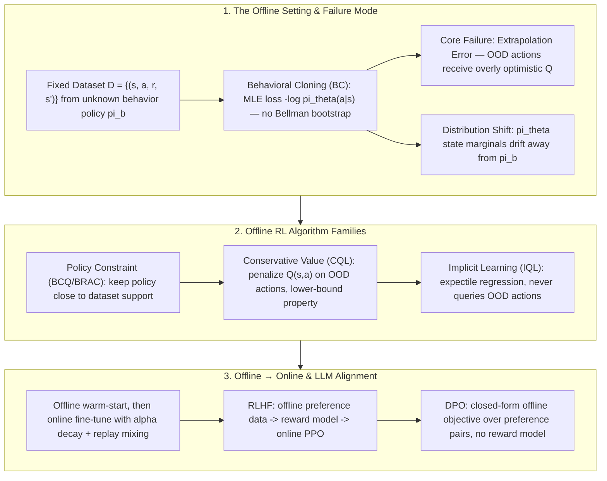

# 🛰️ Offline RL & Imitation Learning: Distribution Shift, BC, CQL, IQL & the Road to RLHF/DPO

> **Core Executive Summary**: Offline Reinforcement Learning (RL) aims to learn a policy from a **fixed, pre-collected dataset** $\mathcal{D} = \{(s, a, r, s')\}$ with **no further environment interaction**. The central obstacle is **distribution shift**: the learned policy visits state-action pairs that differ from the data, where bootstrapped Q-estimates suffer from **extrapolation error**. This guide systematically covers Behavioral Cloning (BC) and its limits (compounding errors, causal confusion), Conservative Q-Learning (CQL) with its Q-value lower-bound penalty, Implicit Q-Learning (IQL) via expectile regression, Offline→Online fine-tuning, the modern connection to RLHF/DPO for LLM alignment from offline preference data, dataset quality, reward hacking, and Off-Policy Evaluation.

---

## 💡 Interactive Mermaid Architecture Flowchart



---

## 💡 Classic Interview Followups & Core Cheatsheet

* **Key Topic 1**: Why does naive Behavioral Cloning fail under distribution shift? What are compounding errors and causal confusion?
  * *Standard Answer*: BC trains $\pi_\theta$ by maximizing log-likelihood on the dataset, $\mathcal{L}_{BC}(\theta) = \mathbb{E}_{(s,a)\sim\mathcal{D}}[-\log \pi_\theta(a|s)]$. During deployment the policy's own rollouts generate states slightly outside the training support; its mistakes feed back into the next state (the closed loop), so errors **compound quadratically** in horizon $T$ rather than linearly as in one-step imitation. **Causal confusion** (de Haan et al., 2019) is worse: because expert trajectories are strongly auto-correlated, BC can learn the *spurious* correlation $a_t \leftarrow a_{t-1}$ (imitating past actions) which perfectly explains the training data yet is causally wrong — BC collapses to near-zero performance when the "teacher" signal is removed.

> 💡 **Intuition**: BC copies the answer key: it learns "in state $s$, do $a$." During deployment, once it wanders into a never-seen state, it can only guess; the wrong guess leads into even stranger states, and errors snowball. Worse, expert actions are temporally auto-correlated, so the model learns a shortcut of "copy the previous answer."
>
> 🎤 **Interview answer**: Conclusion: BC inevitably fails under distribution shift — $O(T^2)$ compounding error plus causal confusion. Why: the policy's own rollouts leave the training support, errors self-amplify in the closed loop, and auto-correlated expert data invites the spurious shortcut $a_t \leftarrow a_{t-1}$. Example: $T=100$ steps at 1% per-step error — single-step loss ≈1, but the compounding expected loss ≈50; a car drifting 1 degree ends up off the lane after 10 seconds.

* **Key Topic 2**: Derive the CQL objective and explain the Q-value lower-bound property.
  * *Standard Answer*: CQL adds a conservative regularizer to the Bellman backup:
    $$\mathcal{L}_{CQL}(\theta) = \alpha \left( \mathbb{E}_{s\sim\mathcal{D}, a\sim\mu(a|s)}[Q_\theta(s,a)] - \mathbb{E}_{(s,a)\sim\mathcal{D}}[Q_\theta(s,a)] \right) + \frac{1}{2} \mathbb{E}_{(s,a,s')\sim\mathcal{D}}\left[ \left( Q_\theta(s,a) - \mathcal{B}^\pi \bar{Q}(s,a) \right)^2 \right]$$
    The first term **pushes down Q-values on actions sampled from a broad distribution $\mu$** (e.g. uniform over the action space), while the second term **pulls Q up on in-distribution dataset actions**, exactly balancing the conservative penalty. The resulting $Q$ is a *lower bound* of the true value for the learned policy at the current state distribution, $\hat{Q}^\pi(s,a) \le Q^\pi(s,a)$, which de-incentivizes the policy from exploiting inflated OOD estimates.

> 💡 **Intuition**: CQL pours cold water on unseen actions: it pushes down Q on actions from a broad distribution while pulling dataset actions back toward the Bellman target. Pour too much and you hurt good actions — $\alpha$ is the dose.
>
> 🎤 **Interview answer**: Conclusion: CQL's conservative penalty makes the learned Q a lower bound on the true Q. Why: down-weighting out-of-support actions and up-weighting in-support ones removes OOD overestimation. Example: uniform-sampled actions average Q ≈ 0.7 vs in-dataset 2.5 → penalty term $(0.7 - 2.5) \times \alpha$; the policy's $\arg\max$ sees no phantom peaks and never selects OOD junk.

* **Key Topic 3**: Explain IQL's expectile regression. Why does it avoid querying OOD actions?
  * *Standard Answer*: IQL fits a value function $V_\psi(s)$ via **expectile regression** with $\tau \approx 0.7$:
    $$L_2^\tau(u) = |\tau - \mathbb{1}\{u < 0\}| \cdot u^2, \qquad V_\psi(s) = \arg\min_V \mathbb{E}_{(s,a,s')\sim\mathcal{D}}\left[ L_2^\tau\left( r(s,a) + \gamma \hat{Q}_{\bar{\theta}}(s', a') - V(s) \right) \right]$$
    With $\tau > 0.5$, negative residuals (where the target $r + \gamma Q$ exceeds the current $V$) are down-weighted, so $V$ tracks the *upper expectile* — the best in-distribution outcome — without ever computing $\max_{a'} Q(s', a')$. Q is then updated as a single-step SARSA-like backup $Q_\theta(s,a) \leftarrow r + \gamma V_\psi(s')$ for **in-dataset transitions only**. Because the policy is extracted with advantage-weighted regression (AWR) on in-distribution actions, IQL never evaluates the Q-function on out-of-distribution actions, eliminating extrapolation error by construction.

> 💡 **Intuition**: Standard Q-learning computes $\max_{a'} Q(s',a')$, which inevitably asks "what are unseen actions worth?" IQL sidesteps the question: the max is replaced by the upper expectile of the next-state value, and the whole chain stays on in-dataset transitions.
>
> 🎤 **Interview answer**: Conclusion: IQL fits $V$ with expectile regression ($\tau \approx 0.7$) to track the best in-support outcome and never queries OOD actions. Why: negative residuals are down-weighted so $V$ tracks the upper quantile; Q uses a SARSA-style backup; the policy is extracted via AWR inside the support. Example: with 10 transitions for one state, $\tau=0.7$ places $V$ near the 70th percentile — "the best result the data supports," not greedy max extrapolation.

* **Key Topic 4**: Why does naive offline-to-online fine-tuning fail, and what are the standard remedies?
  * *Standard Answer*: Continuing CQL training online fails because the **conservative penalty $\alpha$ fights the online signal**: as soon as real environment rollouts arrive, the policy must be allowed to exploit newly discovered high-value states, but a constant $\alpha$ keeps suppressing Q-values — the policy stays stuck near the dataset. Standard remedies: (1) **exponential alpha decay** to zero over the fine-tuning phase; (2) **replay mixing** — freeze the offline dataset in the buffer and interleave online data (prevents catastrophic forgetting and distribution collapse); (3) **resetting/balancing** — reset a fraction of agents to the offline policy to keep a lower bound on behavior quality; (4) use a **behavior-cloning regularizer** early in the online phase to keep actions grounded.

> 💡 **Intuition**: Offline conservatism is a seatbelt; online it becomes handcuffs. Real data proves a state is great, but a constant $\alpha$ keeps suppressing its Q — the policy stays trapped near the dataset.
>
> 🎤 **Interview answer**: Conclusion: naive continuation fails because the conservative penalty fights the online signal. Why: without decaying $\alpha$, newly discovered high-value states stay suppressed. Example: CQL with $\alpha=1.0$ switched straight to online still stays near the dataset distribution after 100k steps; with $\alpha$ decaying as $e^{-\lambda t}$ plus 1:1 replay mixing, convergence returns to normal — Cal-QL relaxes $\alpha$ only on reachable states and does even better.

* **Key Topic 5**: Derive the DPO objective from RLHF. How does offline preference data replace a reward model?
  * *Standard Answer*: RLHF optimizes $J(\pi) = \mathbb{E}_x[\mathbb{E}_{y \sim \pi}[r_\phi(x,y)] - \beta \cdot D_{KL}(\pi(y|x) \| \pi_{ref}(y|x))]$ with a learned reward model trained on offline preference pairs. DPO (Rafailov et al., 2023) observes that the closed-form optimal policy is $\pi_r(y|x) = \frac{1}{Z(x)} \pi_{ref}(y|x) \exp\left(\frac{r(x,y)}{\beta}\right)$, so the reward can be **eliminated in closed form**: $r(x,y) = \beta \log \frac{\pi_r(y|x)}{\pi_{ref}(y|x)} + \beta \log Z(x)$. Substituting into the Bradley-Terry preference model yields:
    $$\mathcal{L}_{DPO}(\theta) = -\mathbb{E}_{(x, y_w, y_l)\sim\mathcal{D}}\left[ \log \sigma\left( \beta \log \frac{\pi_\theta(y_w|x)}{\pi_{ref}(y_w|x)} - \beta \log \frac{\pi_\theta(y_l|x)}{\pi_{ref}(y_l|x)} \right) \right]$$
    This is exactly **offline RL from preference rewards**: the whole pipeline (reward modeling + RL) collapses into a single supervised objective on a fixed preference dataset — analogous to IQL's insight of doing offline RL without online rollouts.

> 💡 **Intuition**: RLHF's reward model is a middleman; DPO notices the optimal-policy closed form lets you solve for the reward as "the ratio of the policy to the reference policy." Plugged back into Bradley-Terry, the middleman cancels and preference pairs directly define the loss.
>
> 🎤 **Interview answer**: Conclusion: DPO supervises the policy directly on offline preference pairs, eliminating the explicit reward model. Why: the reward is reparameterized as $r = \beta \log(\pi/\pi_{ref}) + \beta \log Z$ and cancels in closed form. Example: 1000 preference pairs $(x, y_w, y_l)$ give one DPO training round on a 7B model; RLHF needs to train an RM and run multi-round PPO sampling — DPO costs roughly 1/10 and is more stable.

---

## 📚 Section 1: The Offline Setting — Distribution Shift, Extrapolation Error & BC's Limits

### 1.1 Offline RL vs Online RL vs Imitation Learning

> 💡 **Intuition**: The three paradigms are permutations of two questions — "where does the data come from" and "do we dare to bootstrap": online RL bootstraps safely, offline RL bootstraps dangerously, BC does not bootstrap at all.
>
> 🎤 **Interview answer**: Conclusion: pick a paradigm by data source and risk profile. Why: whether bootstrapping is backed by real data decides success. Example: with interaction available choose PPO/SAC; with only historical logs and a safety requirement choose CQL/IQL; expert data plus a short horizon is the only time BC is safe.

> 📖 **How to read this table**: The key is the "Bellman Bootstrap" column — online RL bootstraps safely (marginals match), offline RL bootstraps dangerously (OOD inflation), and BC does not bootstrap at all (pure supervision). Whether bootstrapping exists and is safe determines the fate of each paradigm.

| Paradigm | Data Source | Bellman Bootstrap | Risk Profile |
| :--- | :--- | :--- | :--- |
| **Online RL (PPO/SAC)** | Agent's own rollouts | Yes — safe because state marginal matches policy | Sample-inefficient, unsafe in real world |
| **Offline RL (CQL/IQL)** | Fixed dataset $\mathcal{D}$ from $\pi_b$ | Yes — dangerous: OOD states bootstrap inflated targets | Distribution shift, extrapolation error |
| **Behavioral Cloning** | Fixed expert dataset | **No** — pure supervised MLE | Compounding errors, causal confusion |

### 1.2 Extrapolation Error: The Core Failure Mechanism

Define the offline dataset distribution as $d^{\pi_b}(s, a)$. The learned Q-function is bootstrapped by its own predictions:

$$\hat{Q}(s, a) = r(s, a) + \gamma \mathbb{E}_{s'}\left[ \max_{a'} \hat{Q}(s', a') \right]$$

When the learned policy $\pi_\theta$ drifts into state-action pairs $(s, a) \notin \text{supp}(\mathcal{D})$, the target uses $\hat{Q}$ values that were **never validated by real returns**. Because $Q$ is a function approximator, arbitrary OOD actions can yield spuriously high values, and the $\max$ operator systematically overestimates them (the same bias Double-DQN fixes in the online world, but here there is no real data to correct it). The policy then exploits these phantom peaks — the classic **distribution shift failure**: training Q diverges upward while true returns stay flat or drop.

> 💡 **Intuition**: Bootstrapping means "proving yourself with your own words": Q computes its own targets with Q. Online, every value is indirectly validated by real returns; offline, an OOD Q has never been validated — a function approximator can freely invent inflated values, and $\max$ picks the most inflated one.
>
> 🎤 **Interview answer**: Conclusion: extrapolation error is the core offline-RL failure — OOD actions receive unvalidated optimistic Q values. Why: $\max$ amplifies approximation error and there is no real data to correct it offline. Example: the overestimation Double-DQN fixes online is amplified in the offline setting — training Q rises to a mean of 5 while true returns average 1, yet the policy grows more confident.

### 1.3 Behavioral Cloning: MLE Objective & Its Two Fatal Limitations

BC is the simplest imitation method — pure maximum likelihood:

$$\mathcal{L}_{BC}(\theta) = \mathbb{E}_{(s, a) \sim \mathcal{D}}\left[ -\log \pi_\theta(a | s) \right]$$

> 💡 **Intuition**: BC memorizes "what others do," like a driving student memorizing maneuvers — clueless on unseen road conditions; and because the instructor always brakes, the student learns the false association "brake light → brake."
>
> 🎤 **Interview answer**: Conclusion: BC = negative log-likelihood of dataset actions — pure supervision, no Bellman bootstrapping. Why: MLE copies expert behavior but never learns how to recover from errors. Example: 100 expert trajectories with 0.95 per-step action probability still yield no recovery skill — training loss looks fine, but 100 deployment steps of compounding error drive success to zero.

> 📖 **How to read this table**: The two rows cover "temporal failure" (compounding errors — drifting further each step) and "feature failure" (causal confusion — learning the wrong association). Diagnostics: near-perfect train loss but test collapse → causal confusion; veering off-track with no recovery → compounding errors.

| Limitation | Mechanism | Typical Failure Signature |
| :--- | :--- | :--- |
| **Compounding errors** | Errors enter the state distribution and snowball along the trajectory; expected loss grows $\mathcal{O}(T^2)$ with horizon $T$ | Agent veers off track mid-episode, never recovers |
| **Causal confusion** | Auto-correlated expert trajectories let the model fit $a_t \leftarrow a_{t-1}$ as a shortcut that is consistent in-distribution but causally wrong | Near-perfect train loss, near-zero test performance when past-action features are ablated |

Mitigations: DAgger (interactive expert labels), dataset aggregation, or switching to a value-based offline RL method that explicitly guards the dataset support.

---

## ⚖️ Section 2: Conservative Q-Learning (CQL) — Penalizing OOD Optimism

### 2.1 Objective Derivation

CQL augments the standard Bellman error with a **conservative regularizer** that minimizes Q on actions sampled from a wide distribution $\mu(a|s)$ while maximizing Q on dataset actions:

$$\mathcal{L}_{CQL}(\theta) = \alpha \underbrace{\left( \mathbb{E}_{s\sim\mathcal{D}, a\sim\mu(a|s)}[Q_\theta(s,a)] - \mathbb{E}_{(s,a)\sim\mathcal{D}}[Q_\theta(s,a)] \right)}_{\text{Conservative penalty}} + \frac{1}{2} \mathbb{E}_{(s,a,s')\sim\mathcal{D}}\left[ \left( Q_\theta(s,a) - \mathcal{B}^\pi \bar{Q}(s,a) \right)^2 \right]$$

where the Bellman backup is $\mathcal{B}^\pi \bar{Q}(s,a) = r(s,a) + \gamma \mathbb{E}_{a' \sim \pi(\cdot|s')}[\bar{Q}(s', a')]$, $\alpha > 0$ trades off conservatism vs. Bellman fidelity, and $\mu$ is typically a uniform distribution over actions or the current policy $\pi_\theta$.

> 💡 **Intuition**: Two expectations pulling in opposite directions: push down Q for "any old action" (broad $\mu$), pull Q back to the Bellman target for "actions that truly appeared in the dataset" — unseen actions are bookkept as worthless, seen ones as worth it.
>
> 🎤 **Interview answer**: Conclusion: CQL = conservative penalty + Bellman backup; $\alpha$ controls how conservative. Why: penalizing broad-distribution actions and rewarding dataset actions removes OOD optimism. Example: with $\mu$ uniform, the wider the action space the broader the penalty — CQL(H) is robust to any behavior policy and suits messy datasets.

### 2.2 The Lower-Bound Theorem (Intuition)

With $\alpha$ large enough, CQL guarantees that the learned Q is a **pointwise lower bound** on the true Q of the learned policy at states in the dataset:

$$\hat{Q}^\pi(s, a) \le Q^\pi(s, a), \qquad \forall (s, a) \in \text{supp}(\mathcal{D})$$

Every $\max_a$ in the bootstrap now operates on *underestimated* values, so the policy's optimization step $\pi \leftarrow \arg\max_a \hat{Q}^\pi$ cannot be fooled by phantom peaks. This "pessimism in the face of uncertainty" is the theoretical bedrock of conservative offline RL, and it is what makes CQL one of the strongest baselines on D4RL benchmarks across both discrete and continuous control.

> 💡 **Intuition**: A lower bound means "better safe than sorry": unseen actions get under-valued Q, so the policy's $\arg\max$ naturally avoids them — pessimism is safety.
>
> 🎤 **Interview answer**: Conclusion: with $\alpha$ large enough, CQL guarantees a pointwise lower bound $\hat Q^\pi \le Q^\pi$ inside the dataset support. Why: every $\max$ in the bootstrap operates on under-estimated values, so phantom peaks never reach policy optimization. Example: on D4RL HalfCheetah-medium, CQL beats naive BC by 30%+ in return — because the lower bound prevents over-confident action selection.

### 2.3 CQL Variants

> 💡 **Intuition**: CQL(H) "pours cold water on the whole world" (uniform, most conservative), CQL(R) pours it only on actions the current policy would take (tighter), Cal-QL relaxes conservatism per reachable state (on demand).
>
> 🎤 **Interview answer**: Conclusion: the variants differ only in the penalty distribution $\mu$. Why: a wider $\mu$ is more conservative; one closer to the policy gives a tighter bound. Example: use CQL(R) on expert data for a tighter lower bound; use Cal-QL for offline→online to auto-relax conservatism on reachable states.

> 📖 **How to read this table**: Check the "Penalty Distribution" column — CQL(H) with uniform sampling is maximally conservative but can over-penalize; Cal-QL calibrates $\alpha$ per state and is the standard upgrade for offline→online fine-tuning.

| Variant | Penalty Distribution $\mu(a|s)$ | Typical Use |
| :--- | :--- | :--- |
| **CQL(H)** | Uniform over action space | Maximally conservative, robust to any $\pi_b$ |
| **CQL(R)** | $\pi_\theta(a|s)$ (the learned policy) | Tighter bound, better on expert-ish data |
| **Cal-QL** | Calibrated per-state $\alpha(s)$ | Offline→Online: auto-relaxes conservatism in reachable states |

---

## 🧠 Section 3: Implicit Q-Learning (IQL) & Offline→Online Fine-Tuning

### 3.1 IQL: Expectile Regression Without OOD Queries

IQL is motivated by the observation that the standard Q-update needs $\max_{a'} Q(s', a')$, which requires evaluating OOD actions. IQL replaces the max with an **upper expectile** of the next-state value, fitted only on in-dataset transitions:

$$L_2^\tau(u) = |\tau - \mathbb{1}\{u < 0\}| \cdot u^2$$

$$V_\psi(s) = \arg\min_V \mathbb{E}_{(s,a,s')\sim\mathcal{D}}\left[ L_2^\tau\left( r(s,a) + \gamma Q_{\bar{\theta}}(s', a') - V_\psi(s) \right) \right]$$

$$Q_\theta(s,a) \leftarrow r(s,a) + \gamma V_\psi(s') \quad \text{(SARSA-style, in-distribution only)}$$

For $\tau = 0.5$ this reduces to standard mean regression; for $\tau \to 1$ it recovers the max (greedy, but with high variance). Practically $\tau \approx 0.7$ captures "the best outcomes the data supports." The policy is extracted via **Advantage-Weighted Regression**: $\mathcal{L}_{AWR} = -\mathbb{E}_{(s,a)\sim\mathcal{D}}\left[ \exp\left( \beta (Q_\theta(s,a) - V_\psi(s)) \right) \log \pi_\phi(a|s) \right]$ — an in-support weighted BC.

> 💡 **Intuition**: $\tau=0.7$ is "70% optimism": $V$ is fit to the better outcomes the data supports — no OOD queries needed, and mediocre dataset outcomes can't drag it down.
>
> 🎤 **Interview answer**: Conclusion: IQL replaces $\max$ with the upper expectile, paired with a SARSA-style backup and AWR policy extraction. Why: down-weighting negative residuals makes $V$ track the $\tau$-th quantile; $\tau=0.5$ is the mean, $\tau \to 1$ is max. Example: sort 10 transition targets $r+\gamma Q$ and take the value at rank 7 for $\tau=0.7$ — more optimistic than the mean, more robust than the max.

### 3.2 Algorithm Comparison Matrix

> 💡 **Intuition**: Three philosophies, three attitudes toward unseen actions: BCQ dodges them (constrained to the support), CQL devalues them (penalized Q), IQL pretends they do not exist (never evaluated).
>
> 🎤 **Interview answer**: Conclusion: offline algorithms are classified by how they handle OOD actions. Why: constrain, penalize, or avoid — all three suppress extrapolation error. Example: BCQ keeps the policy near high-density dataset actions, CQL explicitly depresses OOD Q, IQL replaces max with an upper expectile — naming all three distinctions wins the interview question.

> 📖 **How to read this table**: The "Philosophy" column is the soul — constrain (BCQ/BRAC) vs penalize (CQL) vs avoid (IQL): three answers to the OOD question. The last row shows DPO bringing the offline mindset to LLM alignment.

| Method | Philosophy | OOD Query | Bellman Backup | Policy Extraction |
| :--- | :--- | :--- | :--- | :--- |
| **BC** | Imitation (MLE) | None | None | Direct MLE |
| **BCQ/BRAC** | Policy constraint | Avoided | Standard, constrained $\pi$ | Constrained actor |
| **CQL** | Conservative Q | Penalized | Standard + regularizer | $\arg\max_a \hat{Q}$ |
| **IQL** | Implicit Q | **Never** | SARSA via $V$ expectile | AWR on in-support actions |
| **DPO** | Offline preference RL | None | None | Closed-form logistic objective |

### 3.3 Offline→Online: Why the Naive Continuation Breaks

Restarting CQL/IQL with online rollouts and a *constant* $\alpha$ fails: conservatism now suppresses genuinely good, newly-discovered online states. The canonical recipe:

1. **Alpha decay**: $\alpha_t = \alpha_0 \cdot e^{-\lambda t}$ → conservatism vanishes as real data accumulates;
2. **Replay mixing**: keep $\mathcal{D}_{\text{offline}}$ in the buffer forever, mix with online transitions (e.g., 1:1);
3. **Calibrated conservatism (Cal-QL)**: relax $\alpha$ only on states reachable by the current policy;
4. **BC regularization** during early online steps anchors the policy to known-good actions.

> 💡 **Intuition**: Offline→online is like switching from exam prep to real combat: the conservatism that kept you from answering wrong on the mock exam now makes you miss newly discovered high-scoring states — you must gradually let go.
>
> 🎤 **Interview answer**: Conclusion: the recipe = exponential $\alpha$ decay + replay mixing + Cal-QL + early-online BC regularization. Why: relax conservatism as real data accumulates while keeping offline data in the pool against forgetting. Example: $\alpha_0 = 1.0$, $\lambda = 0.01$ → after 500k steps $\alpha \approx e^{-5000} \approx 0$ — conservatism fully exits, and the replay pool still mixes offline transitions 1:1.

---

## 🔗 Section 4: Offline RL ↔ RLHF/DPO: Preference Data, Reward Hacking & Off-Policy Evaluation

### 4.1 RLHF as Offline RL with a Learned Reward

RLHF is structurally an offline-RL pipeline: a **fixed preference dataset** $\mathcal{D}_p = \{(x, y_w, y_l)\}$ is used to train a reward model (Bradley-Terry), and the policy is then optimized with online PPO. The dataset never changes during training — precisely the offline setting. The risk profile is identical: reward models extrapolate on OOD generations (distribution shift), producing **reward hacking** — outputs that score high under $r_\phi$ but violate human intent.

> 💡 **Intuition**: RLHF's dataset never moves and the reward model has only seen preference pairs — once the policy generates out-of-distribution content, the reward model can only extrapolate and guess; reward hacking exploits exactly that.
>
> 🎤 **Interview answer**: Conclusion: RLHF = offline preference data trains the RM + online PPO — structurally offline RL with a learned reward. Why: the dataset is frozen during training, so the RM extrapolates on OOD outputs. Example: the model discovers "writing 'I love you' everywhere boosts the reward," a long-tail the preference data barely covers — the textbook reward-hacking pattern, which is why held-out preference data must be monitored.

### 4.2 DPO: The Closed-Form Offline Objective

DPO eliminates the reward model entirely. With the optimal-policy reparameterization $r(x,y) = \beta \log \frac{\pi(y|x)}{\pi_{ref}(y|x)} + \beta \log Z(x)$ inserted into the Bradley-Terry likelihood, the offline preference dataset directly defines the loss:

$$\mathcal{L}_{DPO}(\theta) = -\mathbb{E}_{(x, y_w, y_l)\sim\mathcal{D}_p}\left[ \log \sigma\left( \beta \log \frac{\pi_\theta(y_w|x)}{\pi_{ref}(y_w|x)} - \beta \log \frac{\pi_\theta(y_l|x)}{\pi_{ref}(y_l|x)} \right) \right]$$

Gradient analysis shows DPO implicitly **up-weights the preferred completion and down-weights the rejected one**, weighted by how strongly the reference model was wrong — a reward-free, stable, and widely adopted alternative to PPO for offline alignment.

> 💡 **Intuition**: DPO lets the policy learn directly from the answer key: raise the probability of winning responses, lower the losers, with the adjustment weighted by how wrong the reference model was — no separate judge (reward model) needed.
>
> 🎤 **Interview answer**: Conclusion: DPO is RLHF's closed-form offline replacement: $\sigma(\beta \log \frac{\pi(y_w|x)}{\pi_{ref}(y_w|x)} - \beta \log \frac{\pi(y_l|x)}{\pi_{ref}(y_l|x)})$. Why: the optimal-policy closed form cancels the reward and partition function $Z(x)$. Example: with $\beta=0.1$ and a 20× probability-ratio advantage for the winner, the log difference ≈3 and $\sigma(0.3) \approx 0.57$; the more the reference model favored the loser, the larger this sample's weight.

### 4.3 Dataset Quality & Reward Hacking

> 💡 **Intuition**: Dataset quality sets the ceiling: random data has no signal to mine, medium data is rescued by IQL's upper expectile, expert narrow-coverage data barely needs more than BC — "inspect the ingredients before cooking."
>
> 🎤 **Interview answer**: Conclusion: the worse the dataset, the more you need conservative methods. Why: MLE averages away good actions, while the upper expectile picks out the best in-support behavior. Example: on medium datasets IQL beats BC by 20%+; on expert datasets CQL's over-conservatism actually hurts and needs Cal-QL to relax.

> 📖 **How to read this table**: Read down the "Dataset quality tier" column — on random data even conservative methods extract only weak signal; on expert data plain BC wins. Diagnose data coverage before picking a method.

| Dataset quality tier | BC behavior | Offline RL (CQL/IQL) behavior |
| :--- | :--- | :--- |
| **Random** (low coverage) | Learns random-ish policy | Conservative methods still extract weak-but-positive signal |
| **Medium** (suboptimal, narrow) | MLE-imbalanced, misses good actions | IQL's upper expectile recovers the best in-support behavior |
| **Expert / Narrow** | Works well | Overly conservative — pessimism needs relaxing (Cal-QL) |

Reward hacking guardrails: hold out validation preference data, use ensemble reward models with uncertainty penalties, monitor KL divergence to $\pi_{ref}$, and prefer verifiable rewards (RLVR-style) where correctness can be computed programmatically.

### 4.4 Off-Policy Evaluation (OPE) in a Nutshell

Since offline RL cannot afford real rollouts to compare policies, we estimate a candidate policy $\pi_e$ from logged data of $\pi_b$ via **importance sampling**:

$$\hat{V}(\pi_e) = \frac{1}{n} \sum_{i=1}^{n} \left( \prod_{t=0}^{T-1} \frac{\pi_e(a_t^i | s_t^i)}{\pi_b(a_t^i | s_t^i)} \right) R^i$$

The product of ratios grows exponentially in $T$ (high variance) — hence practical estimators use per-step clipped IS, doubly-robust methods, or learned Q-based estimators (e.g. FQE). OPE is the research frontier that decides whether an offline-trained policy is safe to deploy.

> 💡 **Intuition**: Can't run real rollouts, so re-weight historical data: the more likely the candidate policy would have taken a logged trajectory, the bigger the weight on its return — like using secondhand survey data to estimate "what would have happened with the alternative plan."
>
> 🎤 **Interview answer**: Conclusion: OPE estimates a candidate policy's value via importance-sampling ratio products. Why: the ratio product $\prod(\pi_e/\pi_b)$ grows exponentially in trajectory length, exploding variance. Example: $T=20$ steps at ratio 1.05 per step → total weight 2.65; one step at ratio 3 raises variance by an order of magnitude — hence clipped IS, doubly robust estimators, or FQE in practice.

---

## 🐍 Pure Numpy Implementation: BC + CQL Penalty + IQL Expectile

```python
import numpy as np

def pure_numpy_bc_loss(log_probs: np.ndarray) -> float:
    """Behavioral Cloning: negative log-likelihood of dataset actions."""
    return float(-np.mean(log_probs))

def pure_numpy_cql_conservative_term(
    q_ood: np.ndarray,   # Q(s, a_ood) for actions sampled from mu (uniform)
    q_data: np.ndarray   # Q(s, a_data) for in-dataset actions
) -> float:
    """CQL regularizer: minimize Q on OOD actions, maximize Q on dataset actions."""
    return float(np.mean(q_ood) - np.mean(q_data))

def pure_numpy_iql_expectile_loss(
    target: np.ndarray,  # r + gamma * Q(s', a')
    value: np.ndarray,   # current V(s) prediction
    tau: float = 0.7
) -> float:
    """IQL expectile regression: L2^tau(u) = |tau - 1{u < 0}| * u^2."""
    u = target - value
    weight = np.where(u < 0.0, 1.0 - tau, tau)
    return float(np.mean(weight * u ** 2))

def pure_numpy_iql_awr_loss(
    log_probs: np.ndarray, advantages: np.ndarray, beta: float = 3.0
) -> float:
    """Advantage-Weighted Regression: exp(beta * A) * (-log pi(a|s))."""
    weights = np.exp(beta * advantages)
    return float(np.mean(-weights * log_probs))

if __name__ == "__main__":
    np.random.seed(42)
    # BC: 3 transitions, policy assigns log-probs to dataset actions
    log_p = np.array([-0.3, -1.1, -0.6])
    print("BC loss:", round(pure_numpy_bc_loss(log_p), 4))

    # CQL: uniform-sampled OOD actions should be cheaper than dataset actions
    q_ood = np.array([0.5, 0.9, 0.7])
    q_data = np.array([2.0, 3.1, 2.6])
    print("CQL conservative term:", round(pure_numpy_cql_conservative_term(q_ood, q_data), 4))

    # IQL: expectile loss on a batch of (target, value) pairs
    target = np.array([3.0, 2.5, 4.1])
    value = np.array([2.6, 2.9, 3.0])
    print("IQL expectile loss (tau=0.7):", round(pure_numpy_iql_expectile_loss(target, value, tau=0.7), 4))

    # AWR: weight BC by advantage
    adv = np.array([1.2, -0.5, 0.8])
    print("IQL-AWR policy loss:", round(pure_numpy_iql_awr_loss(log_p, adv, beta=3.0), 4))
```

> 💡 **Intuition**: Four functions, four core operators: BC loss (negative log-likelihood), CQL's conservative term (penalize OOD, reward data), IQL's expectile (asymmetric squared loss), AWR (exponentially weighted BC).
>
> 🎤 **Interview answer**: Conclusion: this code is the loss body of BC/CQL/IQL. Why: the CQL term is a mean difference — "cheap OOD, expensive data"; expectile weights $\tau / 1-\tau$ implement the upper quantile; AWR uses $\exp(\beta A)$ to up-weight good actions. Example: $q_{\text{ood}}$ averages 0.7 vs $q_{\text{data}}$ 2.57 → conservative term ≈ −1.87; targets [3.0, 2.5, 4.1] vs values [2.6, 2.9, 3.0] at $\tau=0.7$ are dominated by positive residuals — "chase the high, not the low."

---

## 📝 Takeaways & Engineering Best Practices

1. **Diagnose before you train**: estimate dataset coverage and behavior-policy quality first; BC is only safe for short-horizon, expert-data tasks — otherwise go value-based (CQL) or implicit (IQL);
2. **Pessimism is a design principle**: any offline RL method must somehow down-weight OOD Q-values — CQL does it explicitly with the penalty term, IQL does it implicitly by never querying OOD actions;
3. **Offline→Online is a phase, not a mode**: decay $\alpha$ exponentially, keep the offline dataset in the replay buffer, and validate with OPE (importance sampling / FQE) before any real-world deployment;
4. **LLM alignment is offline RL**: RLHF trains a reward model on a frozen preference dataset (distribution shift and reward hacking included); DPO's closed-form objective is the LLM-scale equivalent of IQL — learning from a fixed dataset without online rollouts;
5. **Reward hacking defense**: ensemble reward models, KL anchoring to $\pi_{ref}$, verifiable rewards (RLVR), and continuous monitoring of held-out preference accuracy.