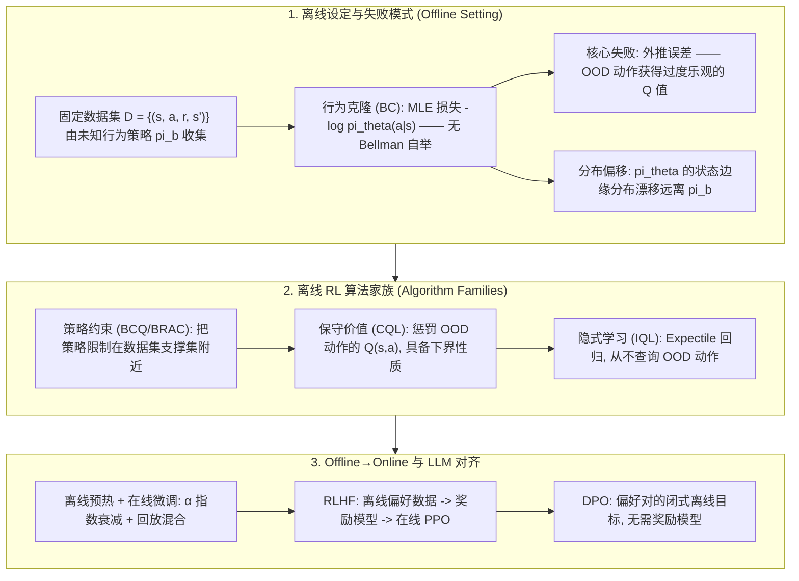

# 🛰️ 离线强化学习与模仿学习：分布偏移、行为克隆、CQL、IQL 与 RLHF/DPO 全景全解

> **核心摘要**：离线强化学习 (Offline RL) 旨在从**固定、预收集的数据集** $\mathcal{D} = \{(s, a, r, s')\}$ 中学习策略，且**不再与环境交互**。其核心障碍是**分布偏移 (Distribution Shift)**：学到的策略会访问与数据分布不一致的状态-动作对，此时自举 (Bootstrapping) 的 Q 估计会产生**外推误差 (Extrapolation Error)**。本指南系统覆盖行为克隆 (BC) 及其两大局限 (复合误差、因果混淆)、保守 Q 学习 (CQL) 的 Q 值下界惩罚、隐式 Q 学习 (IQL) 的 Expectile 回归、Offline→Online 微调、与 LLM 对齐 RLHF/DPO 的联系、数据集质量与 Reward Hacking，以及 Off-Policy Evaluation 的重要性采样估计。

---

## 💡 交互式 Mermaid 架构流程图



---

## 💡 经典面试追问与考点速查

* **考点 1**：为什么朴素的行为克隆 (BC) 在分布偏移下必然失败？复合误差与因果混淆的机制是什么？
  * *标准回答*：BC 通过在数据集上最大化对数似然训练 $\pi_\theta$，损失为 $\mathcal{L}_{BC}(\theta) = \mathbb{E}_{(s,a)\sim\mathcal{D}}[-\log \pi_\theta(a|s)]$。部署时策略自身的轨迹会进入训练支撑集之外的少量状态；其错误会反馈进下一个状态（闭环系统），因此误差在时域 $T$ 上以**二次方**速率累积（$\mathcal{O}(T^2)$），而非单步模仿的线性累积——这就是**复合误差**。**因果混淆** (de Haan et al., 2019) 更严重：专家轨迹强自相关，BC 会学到用 $a_{t-1}$ 预测 $a_t$ 的**伪相关捷径**，这在训练数据上完美解释一切，却在因果上完全错误；当"教师"信号被移除时性能直接崩盘。

> 💡 **直观理解**：BC 是"抄答案"：学的是"见到 $s$ 就做 $a$"。考试时（部署）一旦走进没见过的新状态，只能瞎猜，猜错进入更陌生的状态，错误像雪球越滚越大；更糟的是专家动作前后自相关，模型学会了"抄上一题答案"的捷径。
>
> 🎤 **面试速答**：结论：BC 在分布偏移下必然失败，误差 $O(T^2)$ 复合累积 + 因果混淆。原理：策略自身的 rollout 会离开训练支撑集，闭环下错误自我放大；自相关专家数据诱导伪相关捷径 $a_t \leftarrow a_{t-1}$。例子：$T=100$ 步、每步 1% 错率，单步线性误差 ≈1，复合后期望损失 ≈50——开车偏移 1 度，10 秒后就偏出车道。

* **考点 2**：推导 CQL 的目标函数，并论证 Q 值下界性质。
  * *标准回答*：CQL 在标准 Bellman 备份上叠加保守正则项：
    $$\mathcal{L}_{CQL}(\theta) = \alpha \left( \mathbb{E}_{s\sim\mathcal{D}, a\sim\mu(a|s)}[Q_\theta(s,a)] - \mathbb{E}_{(s,a)\sim\mathcal{D}}[Q_\theta(s,a)] \right) + \frac{1}{2} \mathbb{E}_{(s,a,s')\sim\mathcal{D}}\left[ \left( Q_\theta(s,a) - \mathcal{B}^\pi \bar{Q}(s,a) \right)^2 \right]$$
    第一项**压低广泛分布 $\mu$（如动作空间均匀分布）采样动作的 Q 值**，第二项**把数据集内动作的 Q 值拉回 Bellman 目标**，两者精确平衡。由此学到的 $Q$ 是当前策略在数据集状态分布下的**真实 Q 值下界**，即 $\hat{Q}^\pi(s,a) \le Q^\pi(s,a)$，从而让策略优化无法利用被虚高的 OOD 估计。

> 💡 **直观理解**：CQL 对"没见过的动作"一律先泼冷水：把宽分布采样动作的 Q 压下去，同时把数据集内动作的 Q 拉回 Bellman 目标。泼太多会把好动作误伤，$\alpha$ 就是泼冷水的分寸。
>
> 🎤 **面试速答**：结论：CQL 的保守惩罚项使学到的 Q 成为真实 Q 的下界。原理：压低数据集外、拉高数据集内，两项平衡后 OOD 高估被消除。例子：均匀采样动作的 Q 均值 0.7、数据集内 2.5，惩罚项 = $(0.7 - 2.5) \times \alpha$；策略 $\arg\max$ 时幻影峰值不再存在，于是不会选出 OOD 垃圾动作。

* **考点 3**：解释 IQL 的 Expectile 回归。为什么它从不查询 OOD 动作？与 CQL 的本质区别？
  * *标准回答*：IQL 用**期望分位回归 (Expectile Regression)** 拟合价值函数 $V_\psi(s)$，取 $\tau \approx 0.7$：
    $$L_2^\tau(u) = |\tau - \mathbb{1}\{u < 0\}| \cdot u^2, \qquad V_\psi(s) = \arg\min_V \mathbb{E}_{(s,a,s')\sim\mathcal{D}}\left[ L_2^\tau\left( r(s,a) + \gamma \hat{Q}_{\bar{\theta}}(s', a') - V(s) \right) \right]$$
    当 $\tau > 0.5$ 时，负残差（目标 $r + \gamma Q$ 高于当前 $V$）被压低权重，$V$ 因此追踪**上期望分位**——即数据支撑下的最优结果——且全程**不需要计算 $\max_{a'} Q(s', a')$**。Q 以单步 SARSA 式备份更新：$Q_\theta(s,a) \leftarrow r + \gamma V_\psi(s')$，仅作用于**数据集内转移**。策略再用 Advantage-Weighted Regression (AWR) 在数据集内动作上提取，因此 IQL 从构造上就杜绝了 OOD 动作的 Q 值查询——这是它与 CQL（显式惩罚 OOD）最本质的区别。

> 💡 **直观理解**：标准 Q 学习要算 $\max_{a'} Q(s', a')$，这必然问"没见过的动作值多少"；IQL 狡猾地绕开：用下一状态价值的上期望分位替代 max，整条链路只发生在数据集内的转移上。
>
> 🎤 **面试速答**：结论：IQL 用 Expectile 回归拟合 $V$，$\tau \approx 0.7$ 追踪支撑内最优结果，从不查询 OOD 动作。原理：负残差低权重使 $V$ 偏向上分位；Q 用 SARSA 式单步备份；策略用 AWR 在数据集内提取。例子：同一状态 10 条转移，$\tau=0.7$ 时 $V$ 落在第 70 分位附近——"数据支持范围内的最好结果"，而非 max 的贪婪外推。

* **考点 4**：为什么朴素地继续 Offline→Online 微调会失败？标准补救手段是什么？
  * *标准回答*：直接沿用固定 $\alpha$ 的 CQL 在线微调必然失败：**保守惩罚与在线信号相互对抗**——真实环境回滚一旦到来，策略必须被允许开发新发现的高价值状态，但恒定 $\alpha$ 持续压制 Q 值，策略被"钉死"在数据集附近。标准补救：(1) **α 指数衰减**，随在线数据积累逐渐归零；(2) **回放混合 (Replay Mixing)**——离线数据集永久保留在经验池中并与在线数据交叉采样，防止灾难性遗忘与分布坍缩；(3) 部分智能体**重置回离线策略**，维持行为质量下界；(4) 在线早期加入 **BC 正则项**，把动作锚定在已知良好区域。

> 💡 **直观理解**：离线阶段的"保守"是安全带，在线阶段它变成了手铐：真实数据证明了某状态很好，但恒定 $\alpha$ 仍把它的 Q 往下压，策略只能困在数据集附近。
>
> 🎤 **面试速答**：结论：朴素续训失败，因保守惩罚与在线信号对抗。原理：$\alpha$ 不衰减，新发现的高价值状态被持续压制。例子：$\alpha=1.0$ 的 CQL 直接转在线，10 万步后策略仍不离开数据集分布；$\alpha$ 按 $e^{-\lambda t}$ 衰减并混合 1:1 回放后收敛恢复正常——Cal-QL 只对可达状态放松 $\alpha$，效果更好。

* **考点 5**：从 RLHF 推导 DPO 目标函数。离线偏好数据如何取代奖励模型？
  * *标准回答*：RLHF 优化 $J(\pi) = \mathbb{E}_x[\mathbb{E}_{y \sim \pi}[r_\phi(x,y)] - \beta \cdot D_{KL}(\pi(y|x) \| \pi_{ref}(y|x))]$，奖励模型在固定偏好数据上训练。DPO (Rafailov et al., 2023) 的关键洞察是：最优策略有闭式解 $\pi_r(y|x) = \frac{1}{Z(x)} \pi_{ref}(y|x) \exp\left(\frac{r(x,y)}{\beta}\right)$，反解得 $r(x,y) = \beta \log \frac{\pi_r(y|x)}{\pi_{ref}(y|x)} + \beta \log Z(x)$；代入 Bradley-Terry 偏好模型后奖励被**闭式消去**：
    $$\mathcal{L}_{DPO}(\theta) = -\mathbb{E}_{(x, y_w, y_l)\sim\mathcal{D}_p}\left[ \log \sigma\left( \beta \log \frac{\pi_\theta(y_w|x)}{\pi_{ref}(y_w|x)} - \beta \log \frac{\pi_\theta(y_l|x)}{\pi_{ref}(y_l|x)} \right) \right]$$
    整个"奖励建模 + 策略优化"流程坍缩为单一监督目标——这正是**从离线偏好数据做离线 RL**，与 IQL"不与环境交互也能对齐"的思路一脉相承。

> 💡 **直观理解**：RLHF 的奖励模型是个"中间商"；DPO 发现：最优策略的解析解把奖励反解成"策略与参考模型的比值"，代回 Bradley-Terry 后中间商被约掉，偏好数据直接定义损失。
>
> 🎤 **面试速答**：结论：DPO 用离线偏好对直接监督策略，消除显式奖励模型。原理：奖励被最优策略重参数化 $r = \beta \log(\pi/\pi_{ref}) + \beta \log Z$ 后闭式消去。例子：1000 对 $(x, y_w, y_l)$ 即可对 7B 模型做一轮 DPO 训练；RLHF 要训 RM + 跑 PPO 多轮采样，DPO 训练成本约为其 1/10 且更稳定。

---

## 📚 第一章：离线设定——分布偏移、外推误差与 BC 的边界

### 1.1 离线 RL vs 在线 RL vs 模仿学习对比矩阵

> 💡 **直观理解**：三种范式本质是"数据从哪来 + 敢不敢自举"两个问题的排列组合：在线 RL 自举且安全，离线 RL 自举但危险，BC 干脆不自举。
>
> 🎤 **面试速答**：结论：选范式先看数据来源与风险画像。原理：自举是否被真实数据兜底决定成败。例子：能交互就选 PPO/SAC；只有历史日志且要求安全选 CQL/IQL；专家数据 + 短时域才放心用 BC。

> 📖 **怎么读这张表**：关键在第二列"Bellman 自举"——在线 RL 自举安全（分布一致），离线 RL 自举危险（OOD 被虚高），BC 完全不自举（纯监督）。"是否自举、自举是否安全"决定了三类范式的命运。

| 范式 | 数据来源 | Bellman 自举 | 风险画像 |
| :--- | :--- | :--- | :--- |
| **在线 RL (PPO/SAC)** | 智能体自身回滚 | 有——安全，因为状态边缘分布与策略一致 | 样本低效，真实世界不安全 |
| **离线 RL (CQL/IQL)** | $\pi_b$ 收集的固定数据集 $\mathcal{D}$ | 有——危险：OOD 状态自举被虚高的目标 | 分布偏移、外推误差 |
| **行为克隆 (BC)** | 固定专家数据集 | **无**——纯监督 MLE | 复合误差、因果混淆 |

### 1.2 外推误差：核心失败机制

定义数据集分布 $d^{\pi_b}(s, a)$。学到的 Q 函数被自身预测自举：

$$\hat{Q}(s, a) = r(s, a) + \gamma \mathbb{E}_{s'}\left[ \max_{a'} \hat{Q}(s', a') \right]$$

当策略 $\pi_\theta$ 漂移到 $(s, a) \notin \text{supp}(\mathcal{D})$ 时，目标使用了**从未被真实回报验证过**的 $\hat{Q}$ 值。由于 $Q$ 是函数近似器，任意 OOD 动作都可能获得虚假的高值，而 $\max$ 算子系统性放大这种高估（与在线世界中 Double-DQN 修复的偏差同类，但离线设定没有真实数据来纠偏）。策略随即**利用这些幻影峰值**——这就是经典的分布偏移失败：训练 Q 向上发散，真实回报却纹丝不动甚至下降。

> 💡 **直观理解**：自举 = "用自己的话证明自己"：Q 用 Q 自己算目标。在线时每个值都被真实回报间接验证过；离线时 OOD 的 Q 从没被验证过，函数近似器随手就能编出虚高值，$\max$ 还专门挑那个最大的虚高值。
>
> 🎤 **面试速答**：结论：外推误差是离线 RL 的核心失败：OOD 动作获得未经验证的乐观 Q。原理：$\max$ 放大近似误差，且离线没有真实数据纠偏。例子：Double-DQN 在线修复的高估问题在离线设定下被放大——训练时 Q 均值涨到 5，真实回报均值只有 1，策略却越来越自信。

### 1.3 行为克隆：MLE 目标与两大致命局限

BC 是最朴素的模仿方法——纯极大似然：

$$\mathcal{L}_{BC}(\theta) = \mathbb{E}_{(s, a) \sim \mathcal{D}}\left[ -\log \pi_\theta(a | s) \right]$$

> 💡 **直观理解**：BC 是把"别人怎么做"背下来，像驾校学员背动作要领——没见过的路况就不知所措；而且教练总在踩刹车，学员就会学会"看到刹车灯就踩刹车"的错误关联。
>
> 🎤 **面试速答**：结论：BC = 数据集动作的负对数似然，纯监督、无 Bellman 自举。原理：MLE 让策略复制专家行为，但不学"错误如何恢复"。例子：专家 100 条轨迹、每步动作概率 0.95 也学不到纠错能力——训练损失 0.3 很低，上路 100 步后复合误差让成功率归零。

> 📖 **怎么读这张表**：两行分别对应"时间维度的失败"（复合误差，越走越偏）与"特征维度的失败"（因果混淆，学错关联）；诊断信号：训练损失很低但测试崩盘 → 因果混淆；中途出轨无法恢复 → 复合误差。

| 局限 | 机制 | 典型失败特征 |
| :--- | :--- | :--- |
| **复合误差 (Compounding Errors)** | 错误进入状态分布并沿轨迹滚雪球，期望损失随时域 $T$ 以 $\mathcal{O}(T^2)$ 增长 | 中途偏离轨迹后无法恢复，直接"出轨" |
| **因果混淆 (Causal Confusion)** | 自相关专家轨迹让模型拟合出 $a_t \leftarrow a_{t-1}$ 捷径：分布内一致、因果上错误 | 训练损失接近 0，剔除过去动作特征后测试性能崩盘 |

**缓解手段**：DAgger（交互式专家标注）、数据集聚合；或改用显式守护数据集支撑的价值类离线 RL 方法。

---

## ⚖️ 第二章：保守 Q 学习 (CQL)——惩罚 OOD 乐观主义

### 2.1 目标函数推导

CQL 在标准 Bellman 误差上叠加**保守正则项**：压低宽分布 $\mu(a|s)$ 采样动作的 Q 值，同时拉高数据集动作的 Q 值：

$$\mathcal{L}_{CQL}(\theta) = \alpha \underbrace{\left( \mathbb{E}_{s\sim\mathcal{D}, a\sim\mu(a|s)}[Q_\theta(s,a)] - \mathbb{E}_{(s,a)\sim\mathcal{D}}[Q_\theta(s,a)] \right)}_{\text{保守惩罚}} + \frac{1}{2} \mathbb{E}_{(s,a,s')\sim\mathcal{D}}\left[ \left( Q_\theta(s,a) - \mathcal{B}^\pi \bar{Q}(s,a) \right)^2 \right]$$

其中 Bellman 备份为 $\mathcal{B}^\pi \bar{Q}(s,a) = r(s,a) + \gamma \mathbb{E}_{a' \sim \pi(\cdot|s')}[\bar{Q}(s', a')]$，$\alpha > 0$ 权衡保守程度与 Bellman 保真度，$\mu$ 通常取动作空间上的均匀分布或当前策略 $\pi_\theta$。

> 💡 **直观理解**：两个期望一压一拉：把"随便一个动作"（宽分布 $\mu$）的 Q 压下去，把"数据集里真出现过的动作"的 Q 拉回 Bellman 目标——没见过的动作被记账为"不值钱"，见过了才值钱。
>
> 🎤 **面试速答**：结论：CQL = 保守惩罚 + Bellman 备份，$\alpha$ 控制保守强度。原理：惩罚宽分布动作的 Q、提升数据集动作的 Q，净效果是 OOD 高估被移除。例子：$\mu$ 取均匀分布时动作空间越大惩罚面越宽——CQL(H) 对任意行为策略鲁棒，适合杂散数据集。

### 2.2 下界定理（直觉层）

当 $\alpha$ 足够大时，CQL 保证对数据集状态分布内的所有状态动作对，学到的 Q 是真实 Q 的**逐点下界**：

$$\hat{Q}^\pi(s, a) \le Q^\pi(s, a), \qquad \forall (s, a) \in \text{supp}(\mathcal{D})$$

自举中的每个 $\max_a$ 都作用在**被低估**的值上，策略更新 $\pi \leftarrow \arg\max_a \hat{Q}^\pi$ 因而不会被幻影峰值欺骗。这种"面对不确定性时的悲观主义"是保守离线 RL 的理论基石，也是 CQL 在 D4RL 各类离散/连续控制基准上稳居最强基线之一的原因。

> 💡 **直观理解**：下界 = "宁可信其无，不可信其有"：把没见过的动作的 Q 一律低估，策略 $\arg\max$ 时天然避开它们——悲观即安全。
>
> 🎤 **面试速答**：结论：$\alpha$ 足够大时 CQL 保证支撑集内 $\hat Q^\pi \le Q^\pi$，逐点下界。原理：每个 $\max$ 都作用在被低估的值上，幻影峰值无法进入策略优化。例子：D4RL 的 HalfCheetah-medium 上 CQL 常比朴素 BC 回报高 30%+——因为保守下界防止了"过度自信的动作选择"。

### 2.3 CQL 变体一览

> 💡 **直观理解**：CQL(H) 是"对全世界泼冷水"（均匀分布，最保守），CQL(R) 是"只对新策略会看的动作泼冷水"（更紧），Cal-QL 是"只对离线数据外的状态放松"（按需）。
>
> 🎤 **面试速答**：结论：变体差异只在惩罚分布 $\mu$ 的选择。原理：$\mu$ 越宽越保守、越贴近当前策略下界越紧。例子：专家数据用 CQL(R) 得到更紧的下界；Offline→Online 微调用 Cal-QL 自动放松可达状态的保守性。

> 📖 **怎么读这张表**：看"惩罚分布"一列——CQL(H) 均匀采样最保守但可能过度；Cal-QL 逐状态校准 $\alpha$，是 Offline→Online 微调的标配升级。

| 变体 | 惩罚分布 $\mu(a|s)$ | 典型用途 |
| :--- | :--- | :--- |
| **CQL(H)** | 动作空间均匀分布 | 最大保守，对任意 $\pi_b$ 鲁棒 |
| **CQL(R)** | 学习策略 $\pi_\theta(a|s)$ | 更紧的下界，适合偏专家数据 |
| **Cal-QL** | 逐状态校准的 $\alpha(s)$ | Offline→Online：对可达状态自动放松保守性 |

---

## 🧠 第三章：隐式 Q 学习 (IQL) 与 Offline→Online 微调

### 3.1 IQL：不做 OOD 查询的 Expectile 回归

IQL 的动机：标准 Q 更新需要 $\max_{a'} Q(s', a')$，这必然评估 OOD 动作。IQL 用下一状态的**上期望分位**替换 max，且只在数据集内转移上拟合：

$$L_2^\tau(u) = |\tau - \mathbb{1}\{u < 0\}| \cdot u^2$$

$$V_\psi(s) = \arg\min_V \mathbb{E}_{(s,a,s')\sim\mathcal{D}}\left[ L_2^\tau\left( r(s,a) + \gamma Q_{\bar{\theta}}(s', a') - V_\psi(s) \right) \right]$$

$$Q_\theta(s,a) \leftarrow r(s,a) + \gamma V_\psi(s') \quad \text{(SARSA 式, 仅限数据集内)}$$

$\tau = 0.5$ 时退化为普通均值回归；$\tau \to 1$ 时恢复 max（贪心但方差大）。实践中 $\tau \approx 0.7$ 恰好捕捉"数据支撑下的最优结果"。策略用 **Advantage-Weighted Regression** 提取：$\mathcal{L}_{AWR} = -\mathbb{E}_{(s,a)\sim\mathcal{D}}\left[ \exp\left( \beta (Q_\theta(s,a) - V_\psi(s)) \right) \log \pi_\phi(a|s) \right]$——一种仅在数据支撑内加权的 BC。

> 💡 **直观理解**：$\tau=0.7$ 像"七成乐观"：把 $V$ 拟合到数据支撑内偏好的结果，既不用问 OOD 动作，也不会被数据集里的差结果拖低。
>
> 🎤 **面试速答**：结论：IQL 用上期望分位替代 $\max$，配 SARSA 备份与 AWR 提取。原理：负残差降权 → $V$ 追踪第 $\tau$ 分位；$\tau=0.5$ 是均值、$\tau \to 1$ 是 max。例子：10 条转移的 $r+\gamma Q$ 目标排序后，$\tau=0.7$ 取第 7 位的值——比均值乐观、比 max 稳健，方差可控。

### 3.2 算法对比矩阵

> 💡 **直观理解**：三种哲学 = 三种"面对没见过动作"的态度：BCQ 躲开它（约束在支撑集内），CQL 贬低它（惩罚 OOD Q），IQL 装作它不存在（从不评估）。
>
> 🎤 **面试速答**：结论：离线算法可按"OOD 处理方式"分类。原理：约束/惩罚/回避三条路都能抑制外推误差。例子：BCQ 把策略限制在数据集密度高的动作附近，CQL 显式压低 OOD 的 Q，IQL 用上期望分位绕开 max——说出三者区别就赢了。

> 📖 **怎么读这张表**：第二列"哲学"是灵魂——约束（BCQ/BRAC）vs 惩罚（CQL）vs 回避（IQL），是三种回答 OOD 问题的思路；最后一行 DPO 把"离线"思想带进了 LLM 对齐。

| 方法 | 哲学 | OOD 查询 | Bellman 备份 | 策略提取 |
| :--- | :--- | :--- | :--- | :--- |
| **BC** | 模仿 (MLE) | 无 | 无 | 直接 MLE |
| **BCQ/BRAC** | 策略约束 | 回避 | 标准、受约束的 $\pi$ | 约束 Actor |
| **CQL** | 保守 Q | 惩罚 | 标准 + 正则项 | $\arg\max_a \hat{Q}$ |
| **IQL** | 隐式 Q | **从不** | 经 $V$ 期望分位的 SARSA | 数据集内 AWR |
| **DPO** | 离线偏好 RL | 无 | 无 | 闭式逻辑回归目标 |

### 3.3 Offline→Online：为什么朴素续训会失败

以**恒定 $\alpha$** 直接续训 CQL/IQL 会失败：保守主义此时开始压制在线阶段新发现的高价值状态。标准配方：

1. **α 指数衰减**：$\alpha_t = \alpha_0 \cdot e^{-\lambda t}$——真实数据积累后保守性自然消失；
2. **回放混合**：离线数据集 $\mathcal{D}_{\text{offline}}$ 永久留在经验池，与在线转移交叉采样（如 1:1）；
3. **校准式保守 (Cal-QL)**：只对当前策略可达的状态放松 $\alpha$；
4. **在线早期 BC 正则**：把策略锚定在已知良好动作上。

> 💡 **直观理解**：离线→在线像"从备考切换成实战"：备考时的保守（押题不出错）在实战中会错过新发现的高分动作，必须逐步放开。
>
> 🎤 **面试速答**：结论：补救 = $\alpha$ 指数衰减 + 回放混合 + Cal-QL + 在线早期 BC 正则。原理：随真实数据积累放松保守，并用离线数据防遗忘。例子：$\alpha_0=1.0$、$\lambda=0.01$，50 万步后 $\alpha \approx e^{-5000} \approx 0$——保守完全退出，回放池仍按 1:1 混入离线转移。

---

## 🔗 第四章：Offline RL ↔ RLHF/DPO——偏好数据、Reward Hacking 与离线评估

### 4.1 RLHF 本质上是带学习奖励的离线 RL

RLHF 结构上就是一条离线 RL 流水线：用**固定偏好数据集** $\mathcal{D}_p = \{(x, y_w, y_l)\}$ 训练奖励模型（Bradley-Terry），再用在线 PPO 优化策略；训练期间数据集永不变化——这正是离线设定。风险画像也完全相同：奖励模型对 OOD 生成内容外推（分布偏移），催生 **Reward Hacking**——输出在 $r_\phi$ 下得分高却违背人类意图。

> 💡 **直观理解**：RLHF 的数据集冻结不动、奖励模型只见过偏好对——策略一旦生成分布外的内容，奖励模型只能外推瞎猜，reward hacking 就是钻这个空子。
>
> 🎤 **面试速答**：结论：RLHF = 离线偏好数据训练 RM + 在线 PPO，本质是带学习奖励的离线 RL。原理：数据集训练期间不变，奖励模型对 OOD 输出外推。例子：模型发现"多写'I love you'奖励暴涨"，而偏好数据里几乎没有这类长尾——reward hacking 的典型表现，需留出验证偏好数据监控。

### 4.2 DPO：闭式离线目标

DPO 完全消除奖励模型。利用最优策略重参数化 $r(x,y) = \beta \log \frac{\pi(y|x)}{\pi_{ref}(y|x)} + \beta \log Z(x)$ 代入 Bradley-Terry 似然，离线偏好数据集直接定义损失：

$$\mathcal{L}_{DPO}(\theta) = -\mathbb{E}_{(x, y_w, y_l)\sim\mathcal{D}_p}\left[ \log \sigma\left( \beta \log \frac{\pi_\theta(y_w|x)}{\pi_{ref}(y_w|x)} - \beta \log \frac{\pi_\theta(y_l|x)}{\pi_{ref}(y_l|x)} \right) \right]$$

梯度分析表明：DPO 隐式地**抬升偏好完成的概率、压低被拒完成的概率**，权重由参考模型犯错的程度决定——这是对齐任务中无奖励、稳定且被广泛采用的 PPO 替代方案。

> 💡 **直观理解**：DPO 让策略直接"看答案学"：赢了就提高该回答的概率、输了就降低，调整幅度由参考模型犯错程度加权——不需要再雇一个裁判（奖励模型）。
>
> 🎤 **面试速答**：结论：DPO 是 RLHF 的闭式离线替代：$\sigma(\beta \log \frac{\pi(y_w|x)}{\pi_{ref}(y_w|x)} - \beta \log \frac{\pi(y_l|x)}{\pi_{ref}(y_l|x)})$。原理：最优策略解析解消去奖励与配分函数 $Z(x)$。例子：$\beta=0.1$，策略对赢回答的概率比高 20 倍 → log 差 ≈3，$\sigma(0.3) \approx 0.57$ 的梯度；参考模型越倾向错误答案，该样本权重越大。

### 4.3 数据集质量与 Reward Hacking

> 💡 **直观理解**：数据质量决定方法上限：随机数据无信号可挖，中等数据靠 IQL 上分位恢复，专家窄覆盖数据 BC 就够——"先看菜，再吃饭"。
>
> 🎤 **面试速答**：结论：数据集越差，越需要保守方法兜底。原理：MLE 会把好动作平均掉，上期望分位能挑出支撑内最优。例子：medium 数据集上 IQL 比 BC 高 20%+；expert 数据集 CQL 过度保守反而掉点，需要 Cal-QL 放松。

> 📖 **怎么读这张表**：纵向看"数据集质量"三档——随机数据连保守方法也只能提取微弱信号；专家数据 BC 反而更好。选方法前先诊断数据覆盖度。

| 数据集质量档位 | BC 表现 | 离线 RL (CQL/IQL) 表现 |
| :--- | :--- | :--- |
| **随机 (Random)** | 学到随机策略 | 保守方法仍能提取微弱但为正的信号 |
| **中等 (Medium)** | MLE 失衡，错过好动作 | IQL 上期望分位恢复支撑内的最优行为 |
| **专家/窄覆盖** | 效果良好 | 过度保守——悲观需放松 (Cal-QL) |

**Reward Hacking 防线**：保留验证偏好数据、集成奖励模型并加不确定性惩罚、监控与 $\pi_{ref}$ 的 KL 距离、优先采用可验证奖励 (RLVR 式)，凡能程序化判定正确性的任务一律用确定性校验。

### 4.4 Off-Policy Evaluation (OPE) 简述

离线 RL 无法用真实回滚比较策略，故用**重要性采样 (Importance Sampling)** 从 $\pi_b$ 的日志数据估计候选策略 $\pi_e$ 的价值：

$$\hat{V}(\pi_e) = \frac{1}{n} \sum_{i=1}^{n} \left( \prod_{t=0}^{T-1} \frac{\pi_e(a_t^i | s_t^i)}{\pi_b(a_t^i | s_t^i)} \right) R^i$$

比率乘积随时域 $T$ 指数增长（方差爆炸），因此实用估计器采用逐步裁剪 IS、双重稳健 (Doubly Robust) 或基于学习的 Q 估计器（如 FQE）。OPE 是决定"离线训练的策略能否安全上线"的前沿研究方向。

> 💡 **直观理解**：无法真机试跑，就用"权重比"重估历史数据：候选策略对某条轨迹越可能采用，这条轨迹的回报被乘的权重越大——像用二手问卷推算"如果当时换方案会怎样"。
>
> 🎤 **面试速答**：结论：OPE 用重要性采样比率乘积估计候选策略价值。原理：比率 $\prod(\pi_e/\pi_b)$ 随轨迹长度指数增长，方差爆炸。例子：$T=20$ 步、每步比率 1.05，总权重 2.65；若某步比率 3，整体方差上升一个量级——因此实用中必须裁剪 IS 或用 FQE。

---

## 🐍 Pure Numpy 实现：BC + CQL 惩罚项 + IQL Expectile 回归

```python
import numpy as np

def pure_numpy_bc_loss(log_probs: np.ndarray) -> float:
    """行为克隆: 数据集动作的负对数似然 (MLE 目标)。"""
    return float(-np.mean(log_probs))

def pure_numpy_cql_conservative_term(
    q_ood: np.ndarray,   # mu 分布采样的 OOD 动作的 Q(s, a_ood)
    q_data: np.ndarray   # 数据集内动作的 Q(s, a_data)
) -> float:
    """CQL 正则项: 压低 OOD 动作 Q, 拉高数据集动作 Q。"""
    return float(np.mean(q_ood) - np.mean(q_data))

def pure_numpy_iql_expectile_loss(
    target: np.ndarray,  # r + gamma * Q(s', a')
    value: np.ndarray,   # 当前 V(s) 预测
    tau: float = 0.7
) -> float:
    """IQL 期望分位回归: L2^tau(u) = |tau - 1{u < 0}| * u^2。"""
    u = target - value
    weight = np.where(u < 0.0, 1.0 - tau, tau)
    return float(np.mean(weight * u ** 2))

def pure_numpy_iql_awr_loss(
    log_probs: np.ndarray, advantages: np.ndarray, beta: float = 3.0
) -> float:
    """Advantage-Weighted Regression: exp(beta * A) * (-log pi(a|s))。"""
    weights = np.exp(beta * advantages)
    return float(np.mean(-weights * log_probs))

if __name__ == "__main__":
    np.random.seed(42)
    # BC: 3 条转移, 策略对数据集动作给出对数概率
    log_p = np.array([-0.3, -1.1, -0.6])
    print("BC 损失:", round(pure_numpy_bc_loss(log_p), 4))

    # CQL: 均匀采样 OOD 动作应比数据集动作更"便宜"
    q_ood = np.array([0.5, 0.9, 0.7])
    q_data = np.array([2.0, 3.1, 2.6])
    print("CQL 保守项:", round(pure_numpy_cql_conservative_term(q_ood, q_data), 4))

    # IQL: 一批 (target, value) 对的期望分位损失
    target = np.array([3.0, 2.5, 4.1])
    value = np.array([2.6, 2.9, 3.0])
    print("IQL 期望分位损失 (tau=0.7):", round(pure_numpy_iql_expectile_loss(target, value, tau=0.7), 4))

    # AWR: 用优势加权 BC
    adv = np.array([1.2, -0.5, 0.8])
    print("IQL-AWR 策略损失:", round(pure_numpy_iql_awr_loss(log_p, adv, beta=3.0), 4))
```

> 💡 **直观理解**：四个函数对应四个核心算子：BC 损失（负对数似然）、CQL 保守项（压 OOD 拉数据）、IQL 期望分位（非对称平方损失）、AWR 优势加权（exp 权重化 BC）。
>
> 🎤 **面试速答**：结论：这套代码 = BC/CQL/IQL 的损失本体。原理：CQL 项是均值差即"便宜 OOD、昂贵数据"；expectile 权重 $\tau/1-\tau$ 实现上分位；AWR 用 $\exp(\beta A)$ 放大好动作。例子：$q_{\text{ood}}$ 均值 0.7、$q_{\text{data}}$ 均值 2.57，保守项 ≈ −1.87；target=[3.0, 2.5, 4.1] 对 value=[2.6, 2.9, 3.0] 的 $\tau=0.7$ 损失由正残差主导，即"追高不追低"。

---

## 📝 总结与学习路线

1. **先诊断再训练**：开工前评估数据集覆盖度与行为策略质量；只有短时域 + 专家数据的任务才可放心用 BC，否则选价值类 (CQL) 或隐式 (IQL) 方法；
2. **悲观主义是设计原则**：任何离线 RL 方法都必须以某种方式压制 OOD 的 Q 值——CQL 用惩罚项显式完成，IQL 靠"从不查询 OOD 动作"隐式完成；
3. **Offline→Online 是阶段而非模式**：α 指数衰减、离线数据永久保留在回放池，上线前务必用 OPE（重要性采样 / FQE）验证；
4. **LLM 对齐就是离线 RL**：RLHF 在冻结偏好数据集上训练奖励模型（分布偏移与 Reward Hacking 一个不少）；DPO 的闭式目标正是 LLM 尺度上的 IQL——固定数据集、无需在线回滚；
5. **Reward Hacking 防御**：奖励模型集成、KL 锚定 $\pi_{ref}$、可验证奖励 (RLVR)、持续监控留出偏好准确率。