# 🌐 Industry System Case Studies: Pinterest Visual Search & Netflix Recommendation

> **Core Executive Summary**: Real-world system design mastery comes from studying architectures that actually run at scale. This guide dissects **Pinterest** (image embeddings, PinSage-style graph embeddings, HNSW ANN retrieval, multimodal representations) and **Netflix** (signals, two-stage candidate generation → ranking, dedup & diversity, A/B experimentation culture), then distills a transferable template — *candidate generation → ranking → diversity → experimentation* — and a 5-phase interview framework (requirements → scale → data flow → components → tradeoffs).

---

## 💡 Interactive Mermaid Architecture Flowchart

```mermaid
graph TD
    subgraph A["1. Pinterest: Visual Search & Recommendation"]
        A1["Raw Pins: images, text, boards<br/>CNN vision encoder -> image embedding"]
        A2["Multimodal representation: visual + text + graph<br/>(PinSage-style) -> user & pin embeddings"]
        A3["Candidate Generation: ANN retrieval<br/>HNSW / LSH / inverted index (Manas)"]
        A4["Ranking + Hybrid filters: light scorer + heavy scorer<br/>price / rating / geo constraints"]
        A5["Dedup & Freshness: compact image hashing<br/>Hamming distance + freshness boost"]
        A1 --> A2 --> A3 --> A4 --> A5
    end

    subgraph B["2. Netflix: Streaming Recommendation"]
        B1["Signals: explicit ratings + implicit plays/pauses/browses<br/>session watch time"]
        B2["Candidate Generation (recall): CF + content-based + embeddings<br/>millions -> top ~1000"]
        B3["Ranking (precision): LR / DNN on dense + sparse features<br/>P(watch) = sigmoid"]
        B4["Diversity / Re-ranking: repetition penalty, freshness<br/>filter-bubble prevention"]
        B5["A/B Experimentation: temporal split -> holdout buckets<br/>Slow Cooker, p-value, guardrails"]
        B1 --> B2 --> B3 --> B4 --> B5
    end

    subgraph C["3. Transferable Template: Any RecSys Funnel"]
        C1["Stage 1: Candidate Generation (high recall, cheap)"]
        C2["Stage 2: Ranking (high precision, expensive)"]
        C3["Stage 3: Diversity & Dedup (experience)"]
        C4["Stage 4: Experimentation (confidence)"]
        C1 --> C2 --> C3 --> C4
    end

    A --> C
    B --> C
```



---

## 💡 Classic Interview Followups & Core Cheatsheet

* **Key Topic 1**: How does Pinterest perform billion-scale visual similarity search?
  * *Standard Answer*: Each pin is encoded by a CNN backbone into a dense embedding (e.g. 512-d). At billions of pins brute force is impossible, so Pinterest serves ANN indexes — HNSW small-world graphs: $\mathcal{O}(\log N)$ greedy search, ~1–10 ms at 90%+ recall. PQ shrinks each vector from ~2 KB to tens of bytes; inverted (Manas) + forward (Scorpion KV) indexes enable hybrid search with structured filters (price, rating, shipping).

* **Key Topic 2**: Why must large-scale recommendation split into candidate generation and ranking?
  * *Standard Answer*: The corpus is $10^8$–$10^9$ items; a full personalized model cannot score it all under the latency budget (tens of ms). We build a funnel: stage 1 **candidate generation** (cheap, high recall — CF, content-based, embeddings/ANN) reduces millions → thousands; stage 2 **ranking** (expensive, high precision — LR/DNN) scores hundreds → top-N. Recall lost in stage 1 is unrecoverable, so fit the funnel to the budget: $T_{\text{cand}} + T_{\text{rank}} \le \text{budget}$.

* **Key Topic 3**: How does Netflix's A/B experimentation culture decide whether to ship a model?
  * *Standard Answer*: Netflix treats every change as a testable hypothesis: (1) train candidates offline; (2) validate on held-out **temporal splits** (never random — behavior has time structure) with mAP/NDCG; (3) online A/B: randomly split a holdout population (1% ≈ 5M users) into control vs. treatment, measuring **session watch time** plus guardrails; (4) deploy only if the gain is *statistically significant* and *worth the complexity*. "Slow Cooker" tests run for weeks since retention surfaces slowly; SPS config ships parameter-only changes.

* **Key Topic 4**: How do you deduplicate and diversify a recommendation list?
  * *Standard Answer*: Pure relevance maximization creates filter bubbles. Two standard tools: (1) **repetition penalty** — $\hat{s}_i = s_i - \alpha \cdot \mathbb{I}(\text{repeat})$ for repeated author/genre, or demote the item N slots; (2) **MMR** — pick items relevant *and* dissimilar to selected ones: $\text{MMR} = \arg\max_{d \in C \setminus S} \left[ \lambda \cdot \text{sim}(d, q) - (1 - \lambda) \max_{s \in S} \text{sim}(d, s) \right]$. Pinterest also detects near-duplicate images (hashing + Hamming); Netflix boosts fresh content.

* **Key Topic 5**: Derive mAP@N and explain why session watch time beats CTR for Netflix.
  * *Standard Answer*: For a list of $N$ recommendations, precision at cutoff $k$: $P(k) = \frac{\#\text{relevant in top-}k}{k}$. AP@N rewards early placement: $\text{AP@N} = \frac{1}{R} \sum_{k=1}^{N} P(k) \cdot \text{rel}(k)$; mAP averages over users. Online, CTR only measures clicks — an abandoned movie still counts; "videos watched" ignores depth. **Session watch time** captures the real goal — did the user find something meaningful? — so it (plus retention) is Netflix's primary metric.

---

## 📚 Section 1: Pinterest — Visual Search & Recommendation at Scale

### 1.1 Multimodal Representations: From Pixels to Embeddings

Pinterest is a visual discovery engine: users pin images, videos, and products to boards; the core query is "show me more like this." At ~5 billion pins and millions of DAU, every pin must be retrieved in milliseconds. A CNN encoder maps each image to a dense embedding $\mathbf{e} \in \mathbb{R}^d$ ($d \approx 256$–$512$) so visually similar pins are close under cosine similarity:

$$\text{sim}(\mathbf{e}_u, \mathbf{e}_v) = \frac{\mathbf{e}_u \cdot \mathbf{e}_v}{\|\mathbf{e}_u\| \cdot \|\mathbf{e}_v\|}$$

Pure visuals under-specify taste, so Pinterest fuses **multimodal signals** — text annotations, image signatures, interest "coteries" — plus PinSage-style **graph embeddings** over the pin–board–user graph. The user embedding aggregates engaged pins; relevance is a dot product in shared space.

> 💡 **Intuition**: "Turning images into vectors" makes "similar" become "close in space": two red dresses have a small vector angle, a mechanical keyboard has a large one. Pure vision is not enough — text annotations and graph structure (PinSage: pins you engage with "infect" similar users) must be fused in. That is why "multimodal" is not a buzzword but the source of retrieval quality.
>
> 🎤 **Interview Answer**: "Conclusion: Pinterest fuses CNN visual encoding, text, and PinSage graph embeddings into multimodal representations; the user vector is a learned aggregate of engaged pins. Why: pure visual vectors under-specify taste, and graph embeddings let engagement behavior participate in representation learning. Example: a user pinned 50 'Scandinavian living room' images; PinSage aggregates that preference vector, and retrieval ranks new pins close to it higher — drop any one of the visual/text/graph signals and 'similar recommendations' drift off target."

### 1.2 Retrieval: ANN Indexes, Hybrid Search & Dedup

The serving stack is a compact funnel:

| Stage | Pinterest Technology | Purpose |
| :--- | :--- | :--- |
| **Candidate generation** | ANN index — HNSW / LSH / inverted index (Manas) | Millions → thousands of neighbors in ~ms |
| **Hybrid filter** | Forward index (Scorpion KV) on metadata | Price < $100, rating, shipping constraints |
| **Ranking** | Light scorer + heavy full scorer | Combine similarity, engagement, freshness |
| **Dedup & freshness** | Compact image hashing + Hamming distance | Suppress near-duplicates, surface new content |

Memory math dominates: $5 \times 10^9$ embeddings of 512 float32s cost $\approx 10 \text{ TB}$; PQ compresses each vector to ~16–64 bytes (30–100× memory cut) — the canonical *memory vs. accuracy* tradeoff. Hamming distance on compact hashes ($\mathrm{d_H} \le \tau$) flags near-duplicate images.

> 💡 **How to read this table**: The four rows run candidate generation → structured filtering → ranking → dedup — and the order matters: at billion scale you retrieve vectors first and filter metadata second; reversing it (filter then similarity) scans too few vectors when the filter is selective. The memory arithmetic below is a must-memorize: 5B × 512 float32 ≈ 10TB, compressed by PQ to ~500GB.
>
> 🎤 **Interview Answer**: "Conclusion: the retrieval funnel is ANN candidates (millions → thousands) → structured filters (price/rating) → light + heavy scoring → near-duplicate dedup. Why: brute force over 5B pins is impossible; PQ cuts memory from 10TB to ~500GB at a small recall cost. Example: for 'red dress', HNSW returns 1,000 visual neighbors in milliseconds, filtering on price < $100 and rating ≥ 4 stars leaves 200, heavy scoring re-ranks, and compact-hash Hamming distance drops ~30 visually identical pins to surface 10 — that is Pinterest's actual funnel."

### 1.3 Indexing Infrastructure: Real-Time Incremental + Batch ("Caffeine-style")

Index freshness determines served relevance, so Pinterest rebuilt indexing as a hybrid of real-time incremental + batch pipelines (Google Caffeine-inspired), reaching seconds-level latency on 100M+ documents:

| Pipeline | Components | SLA / Cadence |
| :--- | :--- | :--- |
| **Real-time incremental** | Gateway (Kafka Streams) → Updater → Storage Repo (Omid + HBase, column-level notifications) → Argus (handlers build servable documents) | Control data update-to-serve p90 < 60 s; high/medium priority |
| **Batch** | Base index builders every few hours; refresh / sync / GC workflows | Bounded staleness; eventual consistency; low priority |

Serving uses a **delta architecture**: base index to S3, real-time updates over Kafka, fallback to the base index if the real-time lane clogs. Lesson: separate *freshness-critical control data* from *quality-critical content data*.

> 💡 **How to read this table**: The two rows are the real-time incremental and batch lanes — freshness-critical control data flows through the real-time lane (seconds), quality-critical content data through the batch lane (hourly). Interview takeaway: any large index system must answer 'how do you balance freshness and cost', and this table is the standard-answer template.
>
> 🎤 **Interview Answer**: "Conclusion: indexing uses dual pipelines — real-time incremental plus batch (a delta architecture), with control data servable in p90 < 60 s and content data processed hourly. Why: all-real-time explodes cost, all-batch collapses freshness — split by data type. Example: a newly listed product (control data) becomes searchable within 30 seconds; recomputing historical item features (quality data) runs as a 6-hourly batch; if the real-time lane congests, serving falls back to the base index without interruption."

---

## 📚 Section 2: Netflix — Streaming Recommendation & the A/B Experimentation Culture

### 2.1 Signals: Explicit + Implicit Feedback

Netflix's catalog is ~$10^4$–$10^5$ titles — small enough for deep ranking — but member engagement defines success. Signals split into **explicit feedback** (ratings, thumbs) and **implicit feedback** (play, pause, resume, rewind, browse, search, intensity-weighted). Implicit signals are dense and cheap, so the system optimizes for watch time/completion, reserving RMSE for explicit rating prediction:

$$\text{RMSE} = \sqrt{\frac{1}{N} \sum_{i=1}^{N} \left( \hat{y}_i - y_i \right)^2}$$

> 💡 **Intuition**: Explicit feedback is "what users say" (ratings); implicit feedback is "what users do" (play, pause, fast-forward) — behavior is far more honest than speech. RMSE is reserved for explicit rating prediction, while implicit signals directly optimize watch time, because 'clicked and abandoned' carries more information than 'rated five stars'.
>
> 🎤 **Interview Answer**: "Conclusion: Netflix relies primarily on implicit feedback (play/pause/fast-forward/watch time); RMSE is reserved for explicit rating prediction. Why: implicit signals are dense and cheap while explicit ratings are sparse, and behavior reveals true preference. Example: a user rates 'Interstellar' 4 stars but quits after 10 minutes, while never rating 'Friends' yet finishing 5 episodes in a row — the system should learn from the latter; ratings lie, behavior doesn't."

### 2.2 The Two-Stage Funnel: Features, Candidate Generation, Ranking

The catalog is too large to score end-to-end with a heavy model, so Netflix uses the canonical two-stage funnel (same skeleton as YouTube, Instagram, Pinterest). Features fall into four families:

| Feature family | Examples |
| :--- | :--- |
| **User-based** | age, language, country, average session time, actor/genre/language histograms |
| **Context-based** | time of day, day of week, device (TV vs mobile), upcoming holiday, season |
| **Media-based** | public rating (IMDb/RT), revenue, watch history, genre, duration, content tags |
| **Cross (user × media)** | user–genre interaction (3 months vs 1 year), user–actor match, embedding similarity |

Stage 1 **candidate generation** targets recall: CF, content-based, and embedding-similarity pools are unioned (top ~1,000 from millions). Stage 2 **ranking** targets precision: an LR/DNN assigns a watch probability:

$$P(\text{watch} \mid \mathbf{x}) = \sigma(\mathbf{w}^\top \mathbf{x}) = \frac{1}{1 + e^{-\mathbf{w}^\top \mathbf{x}}}$$

Training uses ~70M rows/week with a **temporal split** (train weeks 1–2, validate week 3) — random splits leak time structure; ~2% of impressions are watched, so negative down-sampling keeps the dataset tractable.

> 💡 **How to read this table**: Features are organized into user / context / media / cross families, and the cross family (user × media) carries the strongest signal. Note the closing paragraph on the *temporal split* — train weeks 1–2, validate week 3; random splits leak time structure and inflate offline scores. This is the classic interview trap: behavioral data validation must always split by time.
>
> 🎤 **Interview Answer**: "Conclusion: Netflix uses the two-stage funnel — candidate generation (recall, millions → ~1,000) and ranking (precision, P(watch) = sigmoid) — with temporal-split training. Why: even a 10^4–10^5-title catalog exceeds the latency budget when fully scored with a heavy model, and behavioral data has strong temporal structure — random splits are cheating. Example: 70M rows/week; train on weeks 1–2, validate on week 3; only ~2% of impressions are watched, so negatives are downsampled to ~10:1 to keep training tractable."

### 2.3 Dedup, Diversity & Re-ranking

Relevance-maximizing rankers drift into filter bubbles. Netflix's re-ranker guards the experience and breaks repetitive patterns via a **repetition penalty**:

$$\hat{s}_i = s_i - \alpha \cdot \mathbb{I}(\text{author/genre repeated})$$

or demoting the repeated item N slots; freshness is boosted so new titles propagate — the exploitation–exploration balance is why diversity is not optional.

> 💡 **Intuition**: Pure relevance ranking creates filter bubbles: watch one revenge drama and the whole page becomes revenge dramas. Repetition penalty subtracts points when a genre/author repeats; MMR greedily picks items that are relevant *and* dissimilar to what is already selected — relevance weighted by $\lambda$, dissimilarity-to-selected weighted by $(1-\lambda)$. Diversity is fundamentally the exploration–exploitation balance.
>
> 🎤 **Interview Answer**: "Conclusion: diversity re-ranking uses the repetition penalty $\hat{s}_i = s_i - \alpha \cdot \mathbb{I}(\text{repeat})$ or MMR's greedy pick of 'relevant and dissimilar'. Why: list-level utility ≠ sum of item-level utilities — a homogeneous list reads as 'nothing to watch'. Example: if 5 of the Top-10 are sci-fi, the penalty leaves 2 and swaps the rest for comedy/documentary; MMR at $\lambda$=0.6 prioritizes relevance, at $\lambda$=0.3 favors diversity — the parameter is the exploration dial the product tunes."

### 2.4 The Experimentation Culture: A/B as a First-Class Citizen

Netflix institutionalizes experimentation: train candidates → offline validation on temporal holdouts → online A/B on a random holdout population (millions of users, control vs. treatment) measuring *session watch time* plus guardrails → deploy only if statistically significant and worth the complexity. Trademarks: **Slow Cooker** tests run for weeks; the **SPS config system** ships parameter-only changes; even artwork selection is A/B tested with multi-armed bandits.

> 💡 **Intuition**: A/B testing is the product's immune system: every change is a testable hypothesis, shipped only when statistically significant *and* worth the complexity. Slow Cooker tests run for weeks because retention effects surface slowly; SPS configs let engineers experiment by changing parameters without touching models — even artwork gets multi-armed bandits, which is how you know experimentation is a culture, not a tool.
>
> 🎤 **Interview Answer**: "Conclusion: the shipping process is offline candidates → temporal-split validation → online A/B (control vs. treatment) → deploy only if statistically significant and complexity-worthy. Why: offline metrics decouple from online experience, so real-traffic validation is required; retention effects are slow, so short experiments cannot measure them. Example: 1% of users (~5M) split into two groups; the new ranking model lifts session watch time by 1.2% with p = 0.03 and no guardrail regression (latency/error) — but it needs 3 extra services, so the team defers and ships an SPS parameter version to capture the gain first."

---

## 📚 Section 3: The Transferable Template & an Interview Framework for Industry Cases

### 3.1 The Universal RecSys Funnel Template

Pinterest and Netflix converge on one skeleton — *candidate generation → ranking → diversity & dedup → experimentation* — applicable to any feed. The funnel targets recall at stage 1, precision at stage 2, experience at stage 3, confidence at stage 4:

$$\underbrace{\text{Recall}}_{\text{candidates}} \rightarrow \underbrace{\text{Precision}}_{\text{ranking}} \rightarrow \underbrace{\text{Diversity}}_{\text{re-rank}} \rightarrow \underbrace{\text{Confidence}}_{\text{A/B}}$$

> 💡 **Intuition**: Two companies, two businesses, one four-stage skeleton — candidate generation (recall), ranking (precision), diversity (experience), experimentation (confidence). In an interview, stating this template first and then unfolding it is the hallmark of an industrial-grade answer for any feed-based system.
>
> 🎤 **Interview Answer**: "Conclusion: the universal template is candidate generation → ranking → diversity & dedup → A/B experimentation, whose goals are recall / precision / experience / confidence respectively. Why: the funnel is the exchange structure between latency and quality — every feed escapes it. Example: for the interview question 'design a short-video recommender' — apply it directly: two-tower recall millions→thousands, heavy ranking →hundreds, MMR dedup →10, then the A/B ramp-up and guardrails; that structure carries a full 45-minute answer."

### 3.2 Pinterest vs. Netflix: Architecture Comparison

| Dimension | Pinterest | Netflix |
| :--- | :--- | :--- |
| **Primary interaction** | Visual discovery ("find more like this") | Watch a title in a session |
| **Catalog size** | ~10⁹ pins | ~10⁴–10⁵ titles |
| **Representation** | Multimodal (vision + text + graph); ANN essential | Features + embeddings; no ANN needed |
| **Candidate generation** | HNSW / LSH / inverted index over embeddings | Union of CF + content + embedding pools |
| **Ranking** | Light + heavy scorer, structured filters | LR/DNN watch-probability |
| **Dedup / diversity** | Near-duplicate image hashing (Hamming) | Repetition penalty, freshness boost |
| **Experimentation** | A/B + Spark experiment framework | Slow Cooker A/B, SPS configs, bandits |

> 💡 **How to read this table**: The pivotal row is "Catalog size" — Pinterest at 10^9 pins *must* use ANN, while Netflix at 10^4–10^5 titles can rank very deeply. Interview takeaway: scale is the first driver of architecture — the same business logic grows into completely different systems at different magnitudes.
>
> 🎤 **Interview Answer**: "Conclusion: scale decides architecture — 10^9 pins run on ANN indexes, 10^5 titles on deep ranking. Why: candidate generation exists because full scoring exceeds the latency budget; the smaller the corpus, the less funnel you need. Example: Netflix could score its whole catalog in a few hundred milliseconds, yet still uses two stages for personalization depth; Pinterest without ANN cannot even render the first feed — when an interviewer asks 'why is it designed this way', lead with scale."

### 3.3 A 5-Phase Answer Framework for Industry-Case Questions

1. **Requirements clarification (5 min)** — functional requirements plus NFRs: DAU, QPS, latency budget (p99 < 200 ms), data size, read/write ratio.
2. **Scale estimation (5 min)** — derive numbers first: QPS from DAU × requests-per-user-per-day, storage for $N$ embeddings, KV cache sizing:

$$\text{QPS} = \frac{5 \times 10^6 \text{ DAU} \times 20 \text{ req/user/day}}{86400} \approx 1157$$

3. **Data flow (5 min)** — users → events → Kafka → feature pipeline (Spark) → training; serving: request → candidates → ranking → re-ranking → feed.
4. **Component design (20 min)** — index, ranker, dedup/diversity layer, caching (pre-generated feeds, LRU), experiment infra.
5. **Tradeoffs (10 min)** — recall vs. latency, memory vs. accuracy (PQ), freshness vs. correctness, personalization vs. diversity (MMR), exploration vs. exploitation, complexity vs. gain.

> 💡 **Intuition**: A 45–50-minute industry-case interview allocates five phases: requirements (5') → scale estimation (5') → data flow (5') → component design (20') → tradeoffs (10'). The key is numbers before design — QPS and storage volume decide every architectural choice downstream.
>
> 🎤 **Interview Answer**: "Conclusion: the industry-case framework is requirements → scale → data flow → components → tradeoffs, timed roughly 5/5/5/20/10. Why: numbers first — scale determines architecture — and tradeoffs close the answer with engineering judgment. Example: 5M DAU × 20 requests/day gives QPS ≈ 1,157, and 5B pins × 512 float32 dims gives ~10TB, which forces PQ compression — once those two numbers are computed, ANN + PQ falls out naturally."

---

## 🐍 Pure Numpy Implementation

A miniature, runnable Pinterest/Netflix-style pipeline: embeddings → ANN candidates → logistic ranking → MMR diversity → mAP@N.

```python
import numpy as np

# --- Miniature two-stage RecSys in pure numpy (Pinterest/Netflix style) ---
# Pipeline: embeddings -> ANN candidate gen -> logistic ranking -> MMR diversity -> mAP@N

rng = np.random.default_rng(42)
N_ITEMS, DIM = 5000, 64

def sigmoid(z: np.ndarray) -> np.ndarray:
    return 1.0 / (1.0 + np.exp(-z))

def cosine_topk(query: np.ndarray, items: np.ndarray, k: int) -> np.ndarray:
    """Stage 1 candidate generation: brute-force ANN via cosine -> top-k ids."""
    scores = items @ query / (np.linalg.norm(items, axis=1) * np.linalg.norm(query) + 1e-9)
    return np.argsort(scores)[::-1][:k]

def logistic_rank(candidate_ids: np.ndarray, item_embs: np.ndarray,
                  user_emb: np.ndarray, w: float, b: float) -> np.ndarray:
    """Stage 2 ranking: P(watch) = sigmoid(w * <user, item> + b), re-sort candidates."""
    scores = sigmoid(w * (item_embs[candidate_ids] @ user_emb) + b)
    return candidate_ids[np.argsort(scores)[::-1]]

def mmr_rerank(candidate_ids: np.ndarray, item_embs: np.ndarray,
               query: np.ndarray, lam: float = 0.6, top_k: int = 10) -> np.ndarray:
    """Stage 3 diversity: MMR = argmax[lambda*rel - (1-lambda)*max_sim_to_selected]."""
    rel = item_embs[candidate_ids] @ query
    selected, ranked = [], []
    for _ in range(top_k):
        if not selected:
            chosen = candidate_ids[int(np.argmax(rel))]
        else:
            max_sim = np.max(np.abs(item_embs[selected] @ item_embs[candidate_ids].T), axis=0)
            mmr = lam * rel - (1 - lam) * max_sim
            chosen = candidate_ids[int(np.argmax(mmr))]
        ranked.append(chosen)
        selected.append(chosen)
        keep = candidate_ids != chosen
        candidate_ids, rel = candidate_ids[keep], rel[keep]
    return np.array(ranked)

def average_precision_at_n(ranked_ids: np.ndarray, relevant: set) -> float:
    """mAP@N building block: AP@N = (1/R) * sum_{k=1..N} P(k) * rel(k)."""
    hits = ap = 0.0
    for k, idx in enumerate(ranked_ids, start=1):
        if idx in relevant:
            hits += 1
            ap += hits / k
    return ap / len(relevant)

if __name__ == "__main__":
    item_embs = rng.normal(size=(N_ITEMS, DIM)).astype(np.float32)
    user_emb = rng.normal(size=DIM).astype(np.float32)
    relevant = set(np.argsort(item_embs @ user_emb)[::-1][:20].tolist())  # ground-truth likes

    cands = cosine_topk(user_emb, item_embs, k=200)                        # 5000 -> 200
    ranked = logistic_rank(cands, item_embs, user_emb, w=1.5, b=0.0)       # re-rank
    diverse = mmr_rerank(ranked, item_embs, user_emb, lam=0.6, top_k=10)   # 200 -> 10

    print("Candidates:", cands.shape, "-> Ranked:", ranked.shape, "-> Diverse top-10:", diverse.shape)
    print("mAP@10 of the diverse list: %.4f" % average_precision_at_n(diverse, relevant))
    print("mAP@10 of relevance-only list: %.4f" % average_precision_at_n(ranked[:10], relevant))
```

---

## 📝 Takeaways & Engineering Best Practices

1. **Embeddings + ANN is the default for "more like this" at scale** — quality flows from representation (multimodal, graph-aware) and retrieval quality (HNSW/PQ tuning, recall@k).
2. **Always build the two-stage funnel** — candidates optimize recall under the latency budget; ranking optimizes precision; funnel width is a core knob.
3. **Never ship relevance-only lists** — dedup and MMR-style diversity re-ranking are production requirements.
4. **Experimentation is the product's immune system** — temporal splits, randomized holdouts, guardrails, and significance gate every change.
5. **Separate freshness-critical from quality-critical data paths** — a real-time lane plus a batch base-index lane.
6. **In interviews, front-load the funnel and the numbers** — template first, then scale, then tradeoffs.
