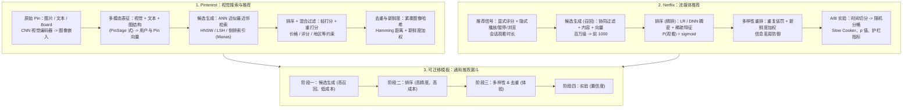

# 🌐 业界经典 System Case Studies：Pinterest 视觉搜索与 Netflix 推荐系统

> **核心摘要**：学习 System Design 的最高境界是研读业界顶级科技巨头的真实架构。本指南全量解构两个经典工业案例——**Pinterest**（视觉搜索与推荐：图像嵌入、PinSage 式图神经网络表征、HNSW 近似最近邻检索、混合检索、多模态表征）与 **Netflix**（流媒体推荐：显式 + 隐式推荐信号、双阶段候选生成-排序、去重与多样性重排、以及闻名业界的 A/B 实验文化）。在此基础上提炼出一套可迁移的系统设计模板——**候选生成 → 排序 → 多样性 → 实验**，并给出工业案例类题目的五阶段面试答题框架（需求澄清 → 规模估算 → 数据流 → 组件 → 权衡）。

---

## 💡 交互式 Mermaid 架构流程图



---

## 💡 经典面试追问与考点速查

* **考点 1**：Pinterest 如何在亿级 Pin 上做视觉相似检索？图嵌入 + ANN 的完整链路是什么？
  * *标准回答*：每个 Pin 先经 CNN 视觉骨干网络编码为稠密向量（如 512 维），视觉相似的图片在向量空间中距离相近；亿级规模下全量暴力比对不可行，因此采用 ANN（近似最近邻）索引——以 HNSW（分层可导航小世界图）为主，贪心搜索期望复杂度仅 $\mathcal{O}(\log N)$，单次查询 ~1–10 ms、召回率 90%+。内存侧两大杠杆：(1) **乘积量化 PQ** 把每个向量从 ~2 KB（512 × float32）压到几十字节——50 亿 Pin 从 10 TB 降到 ~500 GB；(2) 倒排索引（Manas，稠密/分裂 posting list）+ 正排索引（Scorpion KV）支撑混合检索：向量相似度打底，再叠加价格 < $100、评分 ≥ 4 星、可送达地区等结构化过滤。

* **考点 2**：为什么大型推荐系统必须拆成候选生成与排序两阶段？
  * *标准回答*：语料规模达 $10^8$–$10^9$，复杂个性化模型不可能在延迟预算内打满全量（Netflix 级要求几十毫秒，YouTube 级要求 < 200 ms），因此设计漏斗：**阶段一候选生成**（廉价、高召回——协同过滤、内容匹配、向量/ANN、倒排索引）把百万级压到千级；**阶段二排序**（昂贵、高精度——LR/DNN 打满稠密 + 稀疏特征）把数百个候选排成 Top-N。不可逆的权衡：阶段一丢掉的召回永远无法找回，所以必须监控阶段一 recall@k，并用延迟预算约束漏斗宽度：$T_{\text{候选}} + T_{\text{排序}} \le \text{预算}$。

* **考点 3**：Netflix 的 A/B 实验文化：如何决定是否上线一个新排序模型？
  * *标准回答*：Netflix 把每次变更都当作可检验的假设，流程四步：(1) 离线训练多个候选模型；(2) 在**时间切分**的留出集上验证（绝不能用随机切分——行为数据有强时间结构），指标用 mAP/NDCG；(3) 线上 A/B：随机抽取留出人群（如 1% ≈ 500 万用户）分对照组/实验组，核心指标用**会话观看时长**，同时监控护栏指标（延迟、错误率、冷启动覆盖）；(4) 只有当增益**统计显著**（p 值）且**值得新增的复杂度**时才部署。Netflix 的 "Slow Cooker" 实验会长跑数周，因为留存与长期满意度效应浮现很慢；SPS 配置系统则允许不改模型、只改参数即可灰度上线。

* **考点 4**：如何在推荐列表中做去重与多样性重排？
  * *标准回答*：纯相关性最大化必然产生"信息茧房"——同质化、近重复的内容刷屏。两个标准重排工具：(1) **重复惩罚**——对重复出现作者/题材的条目扣分 $\hat{s}_i = s_i - \alpha \cdot \mathbb{I}(\text{重复})$，或把该条目顺位下移 N 位；(2) **MMR（最大边际相关）**——贪心挑选"既相关又与已选条目不相似"的项：$\text{MMR} = \arg\max_{d \in C \setminus S} \left[ \lambda \cdot \text{sim}(d, q) - (1 - \lambda) \cdot \max_{s \in S} \text{sim}(d, s) \right]$。Pinterest 还会用紧凑图像哈希 + Hamming 距离做近重复图片检测，避免视觉相同的商品同时上屏；Netflix 则给新内容加新鲜度加权，让新片获得传播机会。

* **考点 5**：推导 mAP@N 公式，并解释为什么 Netflix 用会话观看时长而非 CTR 作为核心指标？
  * *标准回答*：对长度为 $N$ 的推荐列表，第 $k$ 位截断精度为 $P(k) = \frac{\text{前 } k \text{ 个中的相关数}}{k}$。AP@N 奖励"相关项靠前"：$\text{AP@N} = \frac{1}{R} \sum_{k=1}^{N} P(k) \cdot \text{rel}(k)$，其中 $R$ 为相关项总数、$\text{rel}(k) \in \{0,1\}$；mAP 再对全部用户求平均。线上侧，CTR 只衡量"点了没点"——点开一部 2 分钟就弃看的电影是失败；"观看视频数"又忽略满意度深度。**会话观看时长**直接对应产品目标"用户是否找到了值得看的内容"：完整看完一部 90 分钟电影的用户，远胜于连点五个 2 分钟预告片的用户——所以 Netflix 把会话观看时长与留存作为核心成功指标。

---

## 📚 第一章：Pinterest — 亿级视觉搜索与推荐系统

### 1.1 多模态表征：从像素到向量

Pinterest 是视觉发现引擎：用户把图片、视频、商品链接 Pin 到 Board 上，核心查询是"帮我找更多类似的"。在约 50 亿 Pin、数百万 DAU 的规模下，每个 Pin 都必须在毫秒级被理解并被检索到。第一根支柱是**表征**：CNN 视觉骨干网络把每张图片编码为稠密向量 $\mathbf{e} \in \mathbb{R}^d$（$d \approx 256$–$512$），使视觉相似的图片在余弦相似度下彼此接近：

$$\text{sim}(\mathbf{e}_u, \mathbf{e}_v) = \frac{\mathbf{e}_u \cdot \mathbf{e}_v}{\|\mathbf{e}_u\| \cdot \|\mathbf{e}_v\|}$$

纯视觉向量无法完整刻画品味，因此 Pinterest 融合**多模态信号**：文本标注、图像签名（感知哈希）、兴趣圈层（Coteries），以及 PinSage 一脉的**图嵌入**——在 Pin–Board–User 二部图上用图卷积网络学习节点表征。用户向量是其互动 Pin 向量的学习聚合；物品-用户相关性退化为共享空间中的一个点积。

> 💡 **直观理解**："把图变成向量"是为了让"相似"变成"距离近"：一条红裙子和另一条红裙子的向量夹角小，和机械键盘的夹角大。纯视觉不够，还要融合文本（标注）和图结构（PinSage：你收藏的 Pin 会"传染"给相似用户）——这就是为什么"多模态"不是噱头而是召回质量的来源。
>
> 🎤 **面试速答**："结论：Pinterest 用 CNN 视觉编码 + 文本 + PinSage 图嵌入融合成多模态表征，用户向量是其互动 Pin 的聚合。原理：纯视觉向量无法刻画品味，图嵌入让收藏行为参与表征学习。举个例子：用户收藏了 50 张'北欧风客厅'的 Pin，PinSage 聚合出他的偏好向量，检索时和他收藏的 Pin 向量相似的新 Pin 排名靠前——视觉、文本、图结构三路信号缺一路，'相似推荐'都会跑偏。"

### 1.2 检索层：ANN 索引、混合检索与近重复去重

第二根支柱是**规模化检索**。服务侧是一个紧凑漏斗：

| 阶段 | Pinterest 技术 | 作用 |
| :--- | :--- | :--- |
| **候选生成** | ANN 索引——HNSW 图 / LSH / 倒排索引（Manas） | 百万级 Pin → 毫秒级取回千级向量近邻 |
| **混合结构化过滤** | 元数据后过滤 / 正排索引（Scorpion KV） | 执行价格 < $100、评分 ≥ 4 星、可送达地区等约束 |
| **排序** | posting 轻打分 + 全量重打分 | 融合嵌入相似度、互动特征与新鲜度 |
| **去重 & 新鲜度** | 紧凑图像哈希 + Hamming 距离；新鲜度加权 | 压制近重复 Pin，让新内容浮出水面 |

规模下的内存数学：$5 \times 10^9$ 个 512 维 float32 向量需要 $5 \times 10^9 \times 2048 \text{ B} \approx 10 \text{ TB}$。乘积量化（PQ）把每个向量压到 16–64 字节，索引内存下降 30–100×，代价是少量召回损失——这是经典的**内存 vs 精度**权衡。紧凑哈希的 Hamming 距离 $\mathrm{d_H}(\mathbf{h}_a, \mathbf{h}_b) \le \tau$ 可快速标记近重复图片，避免同一商品刷屏。

> 💡 **怎么读这张表**: 漏斗四列从"取回近邻"到"结构化过滤"到"打分"到"去重"——注意顺序:亿级规模下必须先向量召回再过滤元数据，顺序反了（先过滤再算相似度）会因为过滤条件太稀疏而扫不到向量。表下的内存算术是面试必背:50 亿 × 512 维 float32 ≈ 10TB，PQ 压到 500GB。
>
> 🎤 **面试速答**: "结论：检索漏斗 = ANN 候选（百万→千）→ 结构化过滤（价格/评分）→ 轻打分 + 重打分 → 近重复去重。原理：50 亿 Pin 全量暴力比对不可行，PQ 压缩把 10TB 降到约 500GB，代价是少量召回损失。举个例子：用户搜'红色连衣裙'，HNSW 毫秒级返回 1000 个视觉近邻，再过滤价格<100 元、评分≥4 星，剩 200 个重打分，最后用紧凑哈希 Hamming 距离去掉 30 张视觉相同的图，出 10 个——这就是 Pinterest 的实际漏斗。"

### 1.3 索引基建：实时增量 + 批处理双流水线（Caffeine 风格）

索引质量与新鲜度直接决定服务相关性，因此 Pinterest 把广告/Pin 索引重建成**实时增量 + 批处理混合双流水线**（灵感来自 Google Caffeine），在 1 亿+ 文档规模上实现秒级端到端延迟：

| 流水线 | 组件 | SLA / 节奏 | 一致性 |
| :--- | :--- | :--- | :--- |
| **实时增量** | Gateway（Kafka Streams 无状态）→ Updater（数据摄入）→ Storage Repo（Apache Omid + HBase，事务化，列级变更通知）→ Argus（事件处理器生成可服务文档） | 控制数据更新到可服务 p90 < 60 s | 推送式，高/中优先级 |
| **批处理** | 基准索引构建（每数小时）；刷新 / 同步 / GC 工作流 | 基准索引滞留有界 | 最终一致，低优先级 |

服务侧采用**增量架构（Delta Architecture）**：基准索引发布到 S3，实时逐文档更新走 Kafka，服务端合并两者——实时通道拥堵时自动回退到基准索引。可推广的经验：把"新鲜度敏感的控制数据"与"质量敏感的内容数据"分开，各自拥有独立流水线。

> 💡 **怎么读这张表**: 两行分别是"实时增量"和"批量"两条流水线——新鲜度敏感的控制数据走实时（秒级），质量敏感的内容数据走批量（小时级）。面试启示：任何大索引系统都要回答'怎么在新鲜度和成本之间平衡'，这张表就是标准答案模板。
>
> 🎤 **面试速答**: "结论：索引用实时增量 + 批处理双流水线（Delta 架构），控制数据更新到可服务 p90 < 60 秒，内容数据小时级批处理。原理：全实时成本爆炸、全批量新鲜度崩，分而治之。举个例子：新上架的商品（控制数据）30 秒内可被搜到；历史商品的特征重算（质量数据）每 6 小时跑批；实时通道拥堵时自动回退基准索引，服务不中断。"

---

## 📚 第二章：Netflix — 推荐信号、双阶段排序与 A/B 实验文化

### 2.1 推荐信号：显式 + 隐式反馈

Netflix 片库约 $10^4$–$10^5$ 部，量级足够小使得排序可以做到很深，但决定成败的是会员的参与度。推荐信号分两大类：**显式反馈**（星级评分、顶/踩）与**隐式反馈**（播放、暂停、续播、回退、快进、浏览、搜索——按强度与时长加权）。隐式信号稠密且廉价，因此 Netflix 式系统通常直接优化隐式成功（观看时长、完播率），RMSE 只用于显式评分预测：

$$\text{RMSE} = \sqrt{\frac{1}{N} \sum_{i=1}^{N} \left( \hat{y}_i - y_i \right)^2}$$

> 💡 **直观理解**: 显式反馈是"用户说的话"（评分），隐式反馈是"用户做的事"（播放、暂停、快进）——行为比语言诚实得多。RMSE 只用于显式评分预测，隐式信号直接优化观看时长，因为"点开又关掉"比"打了 5 星"信息量大。
>
> 🎤 **面试速答**: "结论：Netflix 主要靠隐式反馈（播放/暂停/快进/观看时长），RMSE 只用于显式评分预测。原理：隐式信号稠密且廉价，显式评分稀疏；行为反映真实偏好。举个例子：用户给'星际穿越'打了 4 星但看 10 分钟就退出，给'老友记'没评分却连续看完 5 集——系统应该学到的信号是后者，前者是'评分说谎、行为诚实'。"

### 2.2 双阶段漏斗：特征工程、候选生成与排序

片库大到无法用重型模型端到端打分，Netflix 采用与 YouTube、Instagram、Pinterest 同构的经典双阶段漏斗。特征工程按四大家族组织：

| 特征家族 | 示例 |
| :--- | :--- |
| **用户侧** | 年龄、语言、国家、平均会话时长、演员/题材/语言直方图 |
| **上下文侧** | 时段、星期几、设备（TV vs 手机）、临近节假日、季节 |
| **内容侧** | 公开评分（IMDb/烂番茄）、票房、上架时长、观看历史（12h/24h）、题材、时长、人工标注内容标签、分级 |
| **交叉（用户 × 内容）** | 近 3 个月 vs 近 1 年用户-题材互动占比、用户-演员/导演匹配度、用户-内容嵌入相似度 |

**阶段一候选生成**以召回为目标：协同过滤、内容匹配、向量相似度各自产出一个候选池再取并集（百万级 → 前 ~1000）。**阶段二排序**以精度为目标：逻辑回归或 DNN 为每个候选估计观看概率并排序：

$$P(\text{观看} \mid \mathbf{x}) = \sigma(\mathbf{w}^\top \mathbf{x}) = \frac{1}{1 + e^{-\mathbf{w}^\top \mathbf{x}}}$$

训练数据取自一周互动（约 7000 万行），采用**时间切分**（第 1–2 周训练、第 3 周验证）——随机切分会泄露时间结构，给出误导性的离线分数。由于曝光中仅 ~2% 被观看，训练集类别严重不均衡，需负样本降采样保持数据集可处理。

> 💡 **怎么读这张表**: 特征按"用户/上下文/内容/交叉"四族组织，交叉族（用户 × 内容）信号最强。注意最后一段的"时间切分"——第 1–2 周训练、第 3 周验证，随机切分会泄露时间结构给出虚高的离线分数。这是面试常考陷阱：任何行为数据的验证集都必须按时间切。
>
> 🎤 **面试速答**: "结论：Netflix 用候选生成（召回，百万→1000）+ 排序（精度，P(观看)=sigmoid）双阶段，训练用时间切分。原理：片库虽只有 10^4–10^5 但全量特征打分仍超延迟预算；行为数据有强时间结构，随机切分是作弊。举个例子：7000 万行/周训练数据，第 1–2 周训练、第 3 周验证；只有约 2% 的曝光被观看，负样本降采样到 10:1 保持训练可处理。"

### 2.3 去重、多样性与重排

相关性最大化的排序器必然滑向信息茧房。Netflix 的多样性/重排模块处理四类问题——守护观看体验（屏蔽垃圾与不当内容）、打断重复模式、作者多样性、内容多样性——核心机制是**重复惩罚**：

$$\hat{s}_i = s_i - \alpha \cdot \mathbb{I}(\text{作者/题材重复})$$

或者等效地把重复条目在列表中顺位下移 N 位。新内容加新鲜度加权以获取传播机会；"利用-探索"（Exploitation–Exploration）的平衡正是多样性不是锦上添花的原因。

> 💡 **直观理解**: 纯相关性排序会"信息茧房"：用户看了一个复仇题材，整页都是复仇题材。重复惩罚是"同题材再出现就扣分"，MMR 是"既相关又和已选的不像"——贪心挑选时相关度乘以 $\lambda$、与已选最大相似度乘以 $(1-\lambda)$ 作为惩罚。多样性的本质是探索-利用平衡。
>
> 🎤 **面试速答**: "结论：多样性重排用重复惩罚 $\hat{s}_i = s_i - \alpha \cdot \mathbb{I}(\text{重复})$ 或 MMR 贪心选'相关且不相似'。原理：列表级效用 ≠ 单条效用之和，同质化列表让用户觉得'没什么可看'。举个例子：Top-10 里 5 部都是科幻，惩罚后只留 2 部，其余换成喜剧/纪录片；MMR 的 $\lambda$=0.6 时优先保证相关，$\lambda$=0.3 时更偏多样性——参数就是产品要调的探索力度。"

### 2.4 实验文化：A/B 是一等公民

Netflix 把实验制度化为产品基因：(1) 离线训练多个候选模型；(2) 在时间切分留出集上离线验证；(3) 线上 A/B：随机留出人群分对照组/实验组，各数百万用户，核心指标用**会话观看时长**并监控护栏指标；(4) 仅当增益统计显著且复杂度值得时才部署。两大招牌：**Slow Cooker 实验**长跑数周——留存与长期满意度效应浮现极慢；**SPS 配置系统**（Subject/Parameter/Setting）让工程师不动模型、只改参数即可上线。连海报封面图选择都做 A/B（多臂老虎机）——足见实验文化覆盖产品的每一寸表面。

> 💡 **直观理解**: A/B 是产品的免疫系统：每个变更都是待检验的假设，统计显著 + 复杂度值得才上线。Slow Cooker 实验跑数周是因为留存效应浮现慢；SPS 配置让工程师不动模型只调参数就能实验——连海报封面都做多臂老虎机实验，说明实验不是工具而是文化。
>
> 🎤 **面试速答**: "结论：上线流程 = 离线候选 → 时间切分验证 → 线上 A/B（对照组/实验组）→ 统计显著 + 复杂度值得才部署。原理：离线指标与在线体验脱节，必须用真实流量验证；留存效应慢，短实验测不出来。举个例子：1% 用户（约 500 万）分两组，新排序模型提升会话观看时长 1.2%、p=0.03 且护栏指标（延迟/错误率）无恶化——但要额外 3 个服务，团队权衡后暂缓，先上 SPS 参数版拿到收益。"

---

## 📚 第三章：可迁移模板与工业案例面试答题框架

### 3.1 通用推荐漏斗模板

Pinterest 与 Netflix 收敛到同一个骨架——**候选生成 → 排序 → 多样性 & 去重 → 实验**。它适用于任何 Feed：信息流、电商、视频、广告。漏斗各阶段的设计目标分别是召回、精度、体验、置信度：

$$\underbrace{\text{召回}}_{\text{候选生成}} \rightarrow \underbrace{\text{精度}}_{\text{排序}} \rightarrow \underbrace{\text{多样性}}_{\text{重排}} \rightarrow \underbrace{\text{置信度}}_{\text{A/B 实验}}$$

> 💡 **直观理解**: 两个公司、两种业务，收敛到同一个四段骨架——候选生成（召回）、排序（精度）、多样性（体验）、实验（置信度）。面试答任何 Feed 类系统设计题，先背出这个模板再展开，是"工业级回答"的标志。
>
> 🎤 **面试速答**: "结论：通用模板 = 候选生成 → 排序 → 多样性&去重 → A/B 实验，四阶段目标分别是召回/精度/体验/置信度。原理：漏斗是延迟与质量的交换结构，任何 Feed 都逃不出这个骨架。举个例子：面试题'设计一个短视频推荐系统'——直接套：双塔召回百万→千，精排千→百，MMR 去重百→10，再讲 A/B 放量与护栏指标，45 分钟就撑起来了。"

### 3.2 Pinterest vs Netflix：架构对比表

| 维度 | Pinterest | Netflix |
| :--- | :--- | :--- |
| **核心交互** | 视觉发现（"找更多类似的"） | 在会话中观看一部片 |
| **语料规模** | ~10⁹ Pin（图 / 视频 / 商品） | ~10⁴–10⁵ 部片 |
| **表征方式** | 多模态（视觉 + 文本 + 图）；ANN 索引是必需品 | 稠密/稀疏特征 + 嵌入；候选无需 ANN |
| **候选生成** | 嵌入之上的 HNSW / LSH / 倒排索引 | 协同过滤 + 内容 + 向量池取并集 |
| **排序** | 轻打分 + 重打分 + 结构化混合过滤 | LR / DNN 观看概率 + 丰富特征 |
| **去重 / 多样性** | 近重复图像哈希（Hamming） | 重复惩罚、新鲜度加权、重排器 |
| **实验** | A/B + Spark 实验框架、实时分组校验 | Slow Cooker A/B、SPS 配置、封面图多臂老虎机 |

> 💡 **怎么读这张表**: 核心差异在"语料规模"行——Pinterest 10 亿级必须 ANN，Netflix 10 万级排序可以做得很深。面试启示:架构选择的第一驱动力是规模，同样的业务逻辑在不同的量级下长成完全不同的系统。
>
> 🎤 **面试速答**: "结论：规模决定架构——10 亿 Pin 靠 ANN 索引，10 万部片靠深度排序。原理：候选生成的必要性来自'全量打分超预算'；规模越小越不需要召回漏斗。举个例子：Netflix 10^5 部片全量打分几百毫秒勉强可行，但为了个性化深度仍用双阶段；Pinterest 50 亿 Pin 没有 ANN 连第一屏都出不来——面试答'为什么这么设计'时先讲规模。"

### 3.3 工业案例题的五阶段答题框架

1. **需求澄清（5 分钟）**——功能需求（"相似""推荐"到底指什么？）+ 非功能需求：DAU（如 500 万）、QPS、延迟预算（p99 < 200 ms）、数据量、读写比。
2. **规模估算（5 分钟）**——先算数再设计：由 DAU 与人均请求数推 QPS、$N$ 个向量的存储量、热候选的 KV 缓存容量：

$$\text{QPS} = \frac{5 \times 10^6 \text{ DAU} \times 20 \text{ 次/人/天}}{86400} \approx 1157$$

3. **数据流（5 分钟）**——端到端画管线：用户 → 事件 → Kafka → 特征管线（Spark）→ 训练；服务侧：请求 → 候选生成 → 排序 → 重排 → Feed。
4. **组件设计（20 分钟）**——索引（ANN / 倒排）、排序器（模型 + 特征）、去重/多样性层、缓存（预生成 Feed + LRU）、实验基础设施。
5. **权衡（10 分钟）**——召回 vs 延迟（漏斗宽度）、内存 vs 精度（PQ）、新鲜度 vs 正确性（实时 + 批处理混合）、个性化 vs 多样性（MMR）、探索 vs 利用（多臂老虎机）、复杂度 vs 收益（A/B 显著性）。

> 💡 **直观理解**: 45–50 分钟的工业案例题按 5 个阶段分配时间：澄清需求（5'）→ 规模估算（5'）→ 数据流（5'）→ 组件设计（20'）→ 权衡（10'）。关键：先算数再设计——QPS 和存储量决定一切架构选择。
>
> 🎤 **面试速答**: "结论：工业案例题 = 需求澄清 → 规模估算 → 数据流 → 组件 → 权衡，时间按 5/5/5/20/10 分配。原理：数字先行，规模决定架构；权衡收尾展示工程判断。举个例子：500 万 DAU × 20 次/人/天 → QPS≈1157；50 亿 Pin × 512 维 float32 → 10TB，必须 PQ 压缩——这两个数字一算出来，ANN + PQ 的架构就顺理成章了。"

---

## 🐍 Pure Numpy 实现

一个可运行的迷你 Pinterest/Netflix 式管线：向量嵌入 → ANN 候选生成 → 逻辑回归排序 → MMR 多样性重排 → mAP@N 评测。

```python
import numpy as np

# --- 纯 numpy 迷你双阶段推荐系统（Pinterest/Netflix 风格） ---
# 管线：向量嵌入 -> ANN 候选生成 -> 逻辑回归排序 -> MMR 多样性重排 -> mAP@N 评测

rng = np.random.default_rng(42)
N_ITEMS, DIM = 5000, 64

def sigmoid(z: np.ndarray) -> np.ndarray:
    return 1.0 / (1.0 + np.exp(-z))

def cosine_topk(query: np.ndarray, items: np.ndarray, k: int) -> np.ndarray:
    """阶段一候选生成：余弦暴力 ANN -> 返回 top-k id 数组"""
    scores = items @ query / (np.linalg.norm(items, axis=1) * np.linalg.norm(query) + 1e-9)
    return np.argsort(scores)[::-1][:k]

def logistic_rank(candidate_ids: np.ndarray, item_embs: np.ndarray,
                  user_emb: np.ndarray, w: float, b: float) -> np.ndarray:
    """阶段二排序：P(观看) = sigmoid(w * <用户, 物品> + b)，重排候选"""
    scores = sigmoid(w * (item_embs[candidate_ids] @ user_emb) + b)
    return candidate_ids[np.argsort(scores)[::-1]]

def mmr_rerank(candidate_ids: np.ndarray, item_embs: np.ndarray,
               query: np.ndarray, lam: float = 0.6, top_k: int = 10) -> np.ndarray:
    """阶段三多样性重排：MMR = argmax[lambda*相关度 - (1-lambda)*与已选最大相似度]"""
    rel = item_embs[candidate_ids] @ query
    selected, ranked = [], []
    for _ in range(top_k):
        if not selected:
            chosen = candidate_ids[int(np.argmax(rel))]
        else:
            max_sim = np.max(np.abs(item_embs[selected] @ item_embs[candidate_ids].T), axis=0)
            mmr = lam * rel - (1 - lam) * max_sim
            chosen = candidate_ids[int(np.argmax(mmr))]
        ranked.append(chosen)
        selected.append(chosen)
        keep = candidate_ids != chosen
        candidate_ids, rel = candidate_ids[keep], rel[keep]
    return np.array(ranked)

def average_precision_at_n(ranked_ids: np.ndarray, relevant: set) -> float:
    """mAP@N 基础件：AP@N = (1/R) * sum_{k=1..N} P(k) * rel(k)"""
    hits = ap = 0.0
    for k, idx in enumerate(ranked_ids, start=1):
        if idx in relevant:
            hits += 1
            ap += hits / k
    return ap / len(relevant)

if __name__ == "__main__":
    item_embs = rng.normal(size=(N_ITEMS, DIM)).astype(np.float32)
    user_emb = rng.normal(size=DIM).astype(np.float32)
    relevant = set(np.argsort(item_embs @ user_emb)[::-1][:20].tolist())  # 模拟用户真实喜欢的 20 个

    cands = cosine_topk(user_emb, item_embs, k=200)                        # 5000 -> 200
    ranked = logistic_rank(cands, item_embs, user_emb, w=1.5, b=0.0)       # 重排序
    diverse = mmr_rerank(ranked, item_embs, user_emb, lam=0.6, top_k=10)   # 200 -> 10

    print("候选:", cands.shape, "-> 排序:", ranked.shape, "-> 多样性 Top-10:", diverse.shape)
    print("多样性列表 mAP@10: %.4f" % average_precision_at_n(diverse, relevant))
    print("纯相关排序列表 mAP@10: %.4f" % average_precision_at_n(ranked[:10], relevant))
```

---

## 📝 总结与学习路线

1. **掌握"向量 + ANN"范式的规模化检索**：能讲清 HNSW 贪心搜索的 $\mathcal{O}(\log N)$ 期望复杂度、PQ 压缩的内存-精度权衡，以及倒排/正排双索引如何支撑混合检索。
2. **吃透双阶段漏斗**：能解释为什么候选生成优化召回、排序优化精度，以及漏斗宽度与延迟预算的约束关系——这是所有 Feed 类系统的通用骨架。
3. **会算离线与在线指标**：能推导 mAP@N / RMSE，理解时间切分的重要性，并能论证会话观看时长优于 CTR 的原因。
4. **把实验写进设计**：面试中主动提出 A/B 实验方案（分桶、护栏指标、p 值、Slow Cooker）是工业级回答的标志。
5. **熟练五阶段框架**：需求澄清 → 规模估算 → 数据流 → 组件 → 权衡，任何工业案例题都能按此结构在 45–50 分钟内完整展开。
