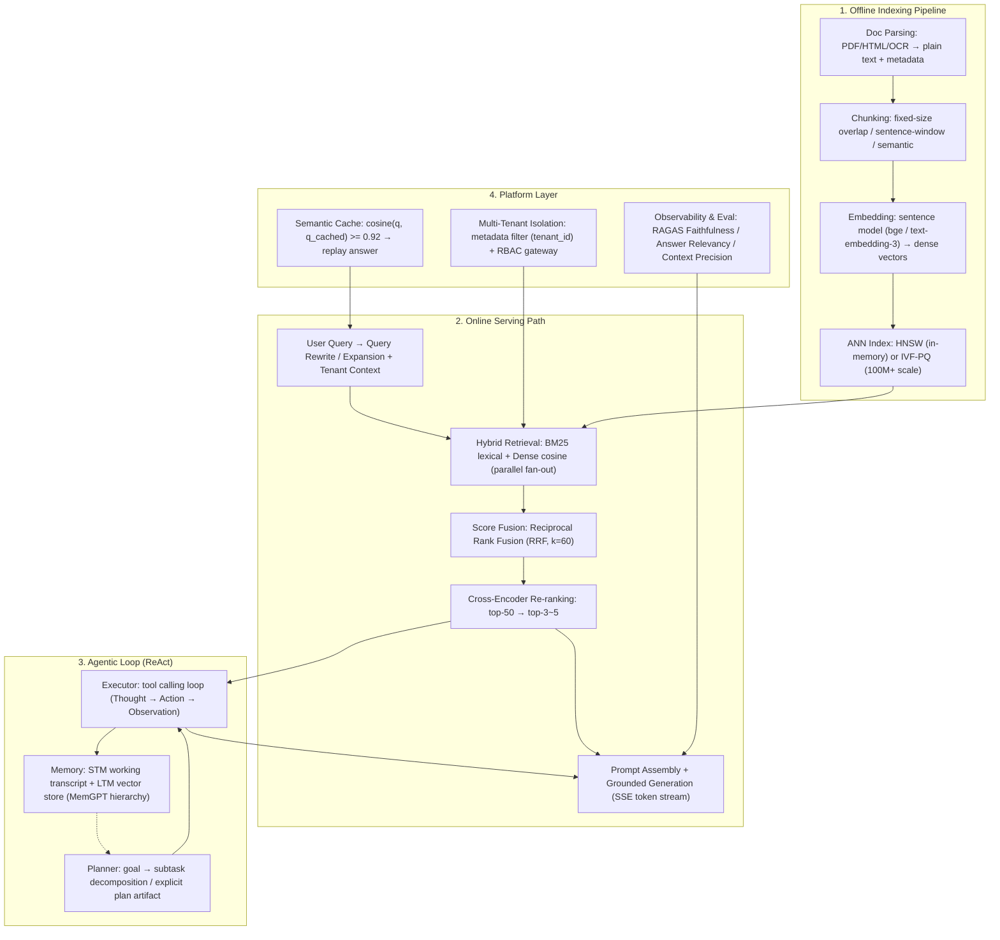

# 🌐 Production LLM RAG & Agent System Design: Multi-Tenancy, SSE & High Availability

> **Core Executive Summary**: Moving RAG knowledge bases and agentic systems from demo to enterprise production is a distributed-systems problem as much as an ML problem. This guide decomposes the full stack: the offline indexing pipeline (parse → chunk → embed → ANN index), the online serving path (query rewrite → hybrid retrieval → cross-encoder re-rank → grounded generation with SSE streaming), the agentic layer (Planner / Executor / Memory loops in the ReAct style), and the platform concerns that decide real deployments — multi-tenant isolation, semantic caching, latency/cost budgets, and RAGAS-based evaluation.

---

## 💡 Interactive Mermaid Architecture Flowchart



---

## 💡 Classic Interview Followups & Core Cheatsheet

* **Key Topic 1**: Walk through the offline indexing pipeline and the online serving path of a production RAG system. Where do failures actually happen?
  * *Standard Answer*: Offline: parse documents (PDF/HTML/OCR → clean text with metadata) → chunk (fixed-size 300–800 tokens with 10–15% overlap, recursive separator splits, sentence-window, or semantic chunking) → embed with a sentence-level model → build an ANN index (HNSW below ~100M vectors, IVF-PQ above). Online: query rewrite → hybrid retrieval (BM25 + dense, fused via Reciprocal Rank Fusion) → cross-encoder re-rank top-50 → top-3~5 → grounded generation. Dominant failure points: (1) chunk boundaries cutting a fact mid-sentence, (2) embedding/domain mismatch, (3) index staleness, (4) "lost in the middle" ordering of chunks, (5) hallucination amplified by retrieval noise — hence re-ranking, metadata filters, and grounded prompting are mandatory.

* **Key Topic 2**: Explain ReAct and how Planner, Executor, and Memory coordinate in an agent tool-calling loop.
  * *Standard Answer*: ReAct (Yao et al., 2022) interleaves **Thought → Action (tool call) → Observation** in a single loop; the reasoning trace itself is the policy that decides the next action. The Planner decomposes the goal into ordered subtasks, materialized as an explicit plan artifact (inspectable, and failed branches can be re-run in isolation); the Executor resolves each subtask into tool calls against a registry with JSON-schema validation; Memory supplies persistence — short-term working memory (recent steps, tool outputs) and long-term memory (a vector store of distilled facts and episodes, retrieved by relevance $M_t = \operatorname{TopK}_{m \in M} s(m, c_t)$). The loop exits on a final answer, max-step budget, or token budget.

* **Key Topic 3**: Compare RAG vs. fine-tuning vs. long-context injection. When is each the right choice?
  * *Standard Answer*: RAG wins on freshness (update the index, no retraining), grounding with citations, and access control; its ceiling is bounded by retrieval quality. Fine-tuning changes style/tone/behavior and injects facts into weights, but is expensive to update and still hallucinates on rare facts. Long-context injection is simplest, but attention cost grows as $\mathcal{O}(n^2)$, per-query cost rises with length, and "lost in the middle" plus distractor noise degrade accuracy. Rule of thumb: start with RAG; add fine-tuning for style and format; treat long-context as a stopgap for small, stable corpora.

* **Key Topic 4**: How do you evaluate a RAG system with RAGAS?
  * *Standard Answer*: RAGAS splits metrics into retrieval-side and generation-side. **Faithfulness** measures how many claims in the answer are supported by the retrieved context (hallucination check); **Answer Relevancy** measures how on-target the answer is for the question; **Context Precision** measures whether gold chunks appear early in the ranking. Interpretation: low Faithfulness → retrieval precision/re-ranking problem; low Answer Relevancy → generator prompting problem; low Context Precision → ranker/fusion problem. (Formulas in Section 3.3.)

* **Key Topic 5**: Design a high-concurrency, low-latency RAG service. How do you control cost/latency and isolate tenants?
  * *Standard Answer*: (1) **Semantic cache** in front of the generator: if $\cos(\mathbf{e}(q), \mathbf{e}(q_{cache})) \ge \tau$ (e.g. 0.92), replay the cached answer and skip LLM inference; (2) **parallel fan-out** retrieval across index shards, then merge ranks with RRF; (3) **SSE streaming**: emit tokens as they arrive so time-to-first-token (TTFT) decouples from generation time, and reuse the connection; (4) batch embedding calls and cache long-prompt prefixes (KV) to cut prefill cost; (5) **multi-tenancy**: a mandatory `tenant_id` metadata filter on every ANN query plus RBAC at the gateway — isolation is structural, never prompt-based. Track p50/p99 TTFT and total latency.

---

## 📚 Section 1: RAG Architecture — Offline Indexing & Online Retrieve-Rerank-Generate

### 1.1 Offline Indexing Pipeline: Chunking, Embedding, Indexing

RAG (Lewis et al., 2020) combines a parametric generator with a non-parametric retriever: retrieve relevant passages from an external corpus and condition the LLM on them instead of relying on frozen weights. The offline pipeline is a versioned batch job: **parse → chunk → embed → index**.

| Chunking Strategy | Granularity | Pros | Cons |
| :--- | :--- | :--- | :--- |
| **Fixed-size + overlap** | 300–800 tokens, 10–15% overlap | Simple, deterministic, fast | May split a fact mid-sentence |
| **Recursive separator split** | paragraphs → sentences → words | Respects document structure | Tuning per document type |
| **Sentence-window** | sentence ± k neighbor sentences | Precise match + local context | More index entries, redundant chunks |
| **Semantic chunking** | embedding-coherence boundaries | Best topical coherence | Expensive, model-dependent |

The embedding function $e(\cdot)$ maps each chunk to a dense vector, and retrieval relevance is cosine similarity:

$$\text{sim}(q, d) = \frac{\mathbf{e}(q)^\top \mathbf{e}(d)}{\|\mathbf{e}(q)\| \cdot \|\mathbf{e}(d)\|}$$

For the index, HNSW (graph-based ANN) is the default below ~100M vectors — high recall, low query latency, memory-hungry. Beyond that scale, use IVF-PQ (inverted-file + product quantization), compressing a 768-dim float vector (3 KB) to tens of bytes via $m$ sub-codebooks:

$$\text{cost}_{\text{PQ}} \approx m \times \log_2 k \ \text{bits per vector}, \quad \text{vs.} \quad 32 \times d \ \text{bits raw}$$

> 💡 **How to read this table**: Chunking is the "fragment vs. completeness" trade-off — fixed-size is simplest but can split one fact mid-sentence; semantic chunking is the most expensive but gives the best topical coherence. Interview point: chunking and embedding choice dominate retrieval quality more than any online tuning — chunking is RAG's first quality lever.
>
> 🎤 **Interview Answer**: "Conclusion: the offline pipeline is a versioned batch job — parse → chunk → embed → index — and the chunking/embedding choices set the retrieval quality ceiling. Why: chunks too small lose context, too large lose precision, and a domain-mismatched embedding model breaks vector retrieval entirely. Example: fixed-size 300–800 tokens with 10–15% overlap is the default starting point; slicing legal documents by clause and code by function beats generic fixed-size splitting by 10–20% retrieval relevance."

### 1.2 Online Retrieval: Hybrid Search, Score Fusion & Re-ranking

Lexical retrieval (BM25/TF-IDF) matches exact terms, IDs, and rare tokens; dense retrieval captures paraphrase-level semantics. Production systems almost never rely on one alone — the dominant pattern is **hybrid recall + fused ranking + cross-encoder precision**:

1. **Hybrid recall**: run BM25 and dense search in parallel (fan-out), each returning top-100 candidates.
2. **Fusion**: merge the two ranked lists with Reciprocal Rank Fusion — parameter-light and robust to score distributions:

$$\text{RRF}(d) = \sum_{r \in \{ \text{BM25}, \text{Dense} \}} \frac{1}{k + \text{rank}_r(d)}, \quad k = 60$$

3. **Re-ranking**: a cross-encoder jointly encodes query and chunk: $s(q, d) = \text{CE}([q; d]) \in [0,1]$, re-ranking the fused top-50 to a final top-3~5. Cross-encoders are too slow for full-corpus search but are the cheapest big quality win at the top of the funnel.

> 💡 **Intuition**: BM25 and dense retrieval are two complementary kinds of memory: lexical rote-memorizes (exact matches of proper nouns, IDs, rare tokens), dense understands paraphrases. RRF needs no weight tuning — it sums ranks directly: rank 1 contributes 1/61, rank 60 contributes 1/120 — earlier positions matter more, and it is robust to score-distribution differences. The cross-encoder is the expensive "final judge" that jointly encodes query and chunk — but it only reviews the top-50, making it the highest-value-per-cost step in the stack.
>
> 🎤 **Interview Answer**: "Conclusion: production RAG runs BM25 + dense retrieval in parallel, fuses with RRF, and re-ranks the fused top-50 to top-3~5 with a cross-encoder. Why: lexical captures exact matches, dense captures semantics — either alone misses things; cross-encoders have the best quality but can only afford a few candidates. Example: for 'iPhone 15 price' the lexical lane hits docs containing 'iPhone 15', the dense lane hits 'how much is Apple's newest flagship', RRF merges both rankings, and the cross-encoder picks the 3–5 most relevant chunks to feed the LLM."

### 1.3 Multi-Tenancy & Grounding Safeguards

Every request carries a tenant id. Isolation is enforced **at the index layer** — a mandatory metadata filter (`tenant_id == X`) is compiled into every ANN query before any scoring, so no prompt can leak across tenants — plus **at the gateway** via RBAC on the model/endpoint. On the generation side, retrieved chunks are wrapped in explicit delimiters with an instruction that context is *evidence, not instructions*, mitigating prompt injection embedded in documents.

> 💡 **Intuition**: Prompts are a "software-level promise" — isolation cannot rest on promises. Tenant A's documents can be retrieved into context no matter what the prompt says; the tenant_id filter must be compiled into the ANN query itself, like row-level database permissions rather than application-layer politeness.
>
> 🎤 **Interview Answer**: "Conclusion: multi-tenant isolation is enforced at the index (mandatory tenant_id metadata filter) plus RBAC at the gateway — never at the prompt. Why: retrieval is the main data-leak channel, and malicious documents can prompt-inject past system instructions. Example: 100 tenants share one HNSW index; every ANN query filters tenant_id == X before scoring, and a unit test asserts that tenant A's tokens querying tenant B's documents return empty results."

---

## 📚 Section 2: Agentic Layer — Planner, Executor, Memory & the Tool Loop

### 2.1 ReAct: Interleaved Reasoning and Acting

ReAct formalizes the loop behind modern agents: each iteration appends **Thought** (internal reasoning), **Action** (a tool call, e.g. `search`, `code_exec`, `sql_query`), and **Observation** (the tool result) to the transcript. The transcript is re-fed to the model, so the reasoning trace acts simultaneously as policy, working memory, and audit log. Termination is explicit: a final-answer token, max-step budget, or token budget.

> 💡 **Intuition**: ReAct writes the "think → act → observe" loop into the context: Thought is reasoning, Action is the tool call, Observation is the tool's result. The trace plays three roles at once — policy (deciding the next step), working memory (what has been done), and audit log (every step is replayable) — and requires no extra training.
>
> 🎤 **Interview Answer**: "Conclusion: ReAct interleaves Thought → Action → Observation in one loop until a final answer, max-step, or token budget is hit. Why: tool outputs return to the context as Observations, so the model decides on the full trace. Example: 'check the weather and plan my day' — Thought: I need the destination's weather → Action: search('Beijing weather') → Observation: sunny 32°C → Thought: good for outdoor → Action: calendar.add(...), looping until the final plan is emitted."

### 2.2 Planner / Executor / Memory Decomposition

* **Planner**: decomposes the goal into ordered, typed subtasks and emits an explicit plan artifact — subtasks can then be reordered, deduplicated, pruned, and failed branches re-run in isolation.
* **Executor**: maps each subtask to a tool call, validates arguments against JSON schemas, and applies error handling (retry, tool fallback).
* **Memory**: three tiers — working memory (recent steps/tool outputs, cleared aggressively), long-term vector memory (distilled facts, decisions, session summaries, retrieved by similarity), and episodic memory (outcome logs for reflection loops such as Reflexion).

> 💡 **Intuition**: Three roles split the agent into "the planner, the intern who executes, and the note-taker": the Planner only decomposes the goal into an inspectable plan artifact, the Executor only makes tool calls (schema validation, retries), and Memory sediments important facts from short-term into long-term storage. The payoff of separation: any component can be swapped, debugged, or rolled back on its own.
>
> 🎤 **Interview Answer**: "Conclusion: Planner decomposes, Executor calls tools, Memory persists — decoupling makes agents engineering-manageable. Why: an explicit plan artifact is inspectable and its failed branches can be re-run in isolation without polluting the global state; memory tiers prevent context explosion. Example: a 10-step task fails at step 7 — the Planner's plan artifact lets you re-run only steps 7–10 instead of restarting the whole task."

### 2.3 Memory Hierarchy & Long-Horizon Management

Context is a finite, position-sensitive resource: self-attention cost grows as $\mathcal{O}(n^2)$, and "Lost in the Middle" (Liu et al., 2024) shows models attend best to the head and tail of the window. Production agents therefore manage a **memory hierarchy** (MemGPT-style): active working set → **compaction** (keep the goal, open questions, durable decisions, reloadable references; drop raw tool exhaust) → long-term store. Sub-agents isolate context: explore deeply inside a narrow window, return a compact summary to the coordinator. Bigger context windows alone never fix long-horizon agents.

> 💡 **Intuition**: $O(n^2)$ attention makes context an expensive resource, and "Lost in the Middle" shows the model attends best to the head and tail — so blindly growing the window treats the symptom, not the cause. The memory hierarchy mirrors the human brain: working memory (what's in front of us) → compaction (solidify what matters, drop raw tool exhaust) → long-term store (vector DB).
>
> 🎤 **Interview Answer**: "Conclusion: long-horizon agents need a MemGPT-style memory hierarchy, not ever-larger context windows. Why: self-attention is $O(n^2)$ and middle-window content is attended worst. Example: an agent that ran 50 tool-call rounds would need ~100K tokens of raw transcript, making every inference an order of magnitude more expensive; compaction reduces it to 'goal + decisions + open items + references' in ~500 tokens, with the long-term vector store retrieved on demand."

---

## 📚 Section 3: Context Engineering, Evaluation & Production Optimization

### 3.1 Context Engineering & Long-Context Management

Prompt engineering asks "what should I say to the model"; context engineering asks "what should the model know, see, remember, and ignore right now". Core tactics: the **smallest high-signal token set** (context quality $\propto$ signal minus noise under a token budget); **progressive disclosure** (surface metadata/filenames first, load full documents on demand); **just-in-time retrieval** over pre-loading; and **compaction vs. summarization** — summarization optimizes readability, compaction optimizes future-task utility. Debug the four long-context failure modes: **poisoning** (early errors persist into state), **distraction** (history pulls attention off-task), **confusion** (too many overlapping tools/instructions), and **clash** (conflicting sources — define explicit precedence rules).

> 💡 **Intuition**: Prompt engineering asks "what should I say"; context engineering asks "what should the model see" — context is a finite budget where quality ∝ signal − noise. Progressive disclosure is like a resume first, details on request; just-in-time retrieval beats pre-loading; and summarization optimizes readability while compaction optimizes future-task utility.
>
> 🎤 **Interview Answer**: "Conclusion: context engineering = smallest high-signal token set + progressive disclosure + just-in-time retrieval + compaction, and you must debug the four failure modes: poisoning, distraction, confusion, clash. Why: under a token budget, noise dilutes signal; stale history distracts, early errors persist, and contradictory sources need precedence rules. Example: for 'summarize this 100-page report', first show only the table of contents and chapter metadata, then load chapters the user actually opens — rather than dumping 100K tokens the model cannot attend to in the middle."

### 3.2 RAG vs. Fine-tuning vs. Long-Context

| Dimension | RAG | Fine-tuning | Long-context injection |
| :--- | :--- | :--- | :--- |
| **Knowledge freshness** | Live — update the index | Static — retrain to refresh | Depends on what is in context |
| **Training cost** | None | High (data curation + GPU) | None |
| **Grounding / citations** | Excellent | Weak (opaque weights) | Good but verbose |
| **Per-query latency & cost** | Retrieval + generation | Same as base model | Rises with length ($\mathcal{O}(n^2)$ attention) |
| **Style / format control** | Limited | Strong | Limited |
| **Typical failure** | Bad retrieval quality | Hallucination on rare facts | Lost in the middle, distraction |

> 💡 **How to read this table**: Compare across three dimensions — freshness (RAG live, fine-tuning static), training cost (RAG zero), and controllability (fine-tuning strongest). The interview rule of thumb: RAG first for knowledge, fine-tuning for style, long-context only as a stopgap for small stable corpora.
>
> 🎤 **Interview Answer**: "Conclusion: RAG for knowledge, fine-tuning for style, long-context as a transition stopgap. Why: facts change fast and need citations — put them in an index you can swap without retraining; style/format cannot live in an index, so it goes into weights. Example: a customer-support bot — policy terms change 100 times with no retraining (RAG re-indexes), while 'reply warmly with emoji' is baked in by fine-tuning; a one-off 200-page internal doc temporarily uses long-context injection."

### 3.3 Evaluation: RAGAS Metrics

RAGAS (Es et al., 2023) turns RAG quality into measurable components. Given an LLM-judged decomposition of the answer into atomic claims $C$ and retrieved context $C_{\text{ctx}}$:

**Faithfulness** (hallucination guard): fraction of claims supported by the retrieved context.

$$\text{Faithfulness} = \frac{| \{ c \in C : c \text{ supported by } C_{\text{ctx}} \} |}{|C|}$$

**Answer Relevancy**: the model generates $N$ questions $q_1^*, \dots, q_N^*$ from the answer; relevancy is the mean cosine similarity between the original question embedding and each generated question embedding.

$$\text{AnswerRelevancy} = \frac{1}{N} \sum_{i=1}^{N} \cos\left( \mathbf{e}(q), \mathbf{e}(q_i^*) \right)$$

**Context Precision**: rewards rankings where relevant chunks appear early.

$$\text{Context Precision@k} = \frac{\sum_{k'=1}^{k} \left( \text{precision@}k' \times \mathbf{1}[\text{chunk at } k' \text{ relevant}] \right)}{\text{total relevant chunks in top-}k}$$

> 💡 **Intuition**: The three metrics map to three stages of the RAG pipeline: Faithfulness audits generation (are the answer's claims supported — the hallucination guard), Answer Relevancy audits how on-target the answer is for the question, and Context Precision audits retrieval ordering (do gold chunks rank early). Diagnostic mnemonic: low Faithfulness → retrieval/re-ranking problem; low Answer Relevancy → prompting problem; low Context Precision → ranker/fusion problem.
>
> 🎤 **Interview Answer**: "Conclusion: RAGAS localizes problems with Faithfulness / Answer Relevancy / Context Precision on the retrieval and generation sides respectively. Why: decompose the answer into atomic claims and measure what fraction the context supports; regenerate questions from the answer to test relevancy; check where gold chunks sit in the top-k. Example: an answer with 5 claims of which only 3 are in the retrieved context gives F = 0.6 → investigate re-ranking; if F is fine but the answer is off-topic → fix the generation prompt; if gold chunks rank below 30 → check RRF fusion or embedding quality."

### 3.4 Latency & Cost Optimization

* **Semantic cache**: before any LLM call, hit-test the query embedding against cached query embeddings; if $\cos(\mathbf{e}(q), \mathbf{e}(q_{cache})) \geq \tau$ (0.90–0.95), replay the cached answer. FAQ-like intents reach 50–90% hit rates, eliminating the dominant generation cost.
* **Parallel retrieval fan-out**: shard the index by tenant/date/topic, query shards concurrently, merge with RRF — latency drops from the sum to the max of shard times.
* **SSE streaming**: the gateway holds the connection and forwards tokens as they arrive; TTFT becomes the p99 metric users actually feel, and long generations no longer tie up client connections.
* **Cost levers**: batch embedding calls, cache long system-prompt prefixes (KV), route easy queries to small models, and monitor tokens per query with p50/p99 budgets.

> 💡 **Intuition**: Semantic caching is "don't recompute the same question": FAQ-like intents hit 50–90%, and since generation is the dominant cost, the cache removes it outright. Parallel fan-out turns retrieval latency from the sum of shard times into the max; SSE streaming turns the user-perceived metric from total generation time into time-to-first-token.
>
> 🎤 **Interview Answer**: "Conclusion: the three optimization levers are semantic caching, parallel retrieval, and SSE streaming, monitored via p50/p99 TTFT. Why: LLM generation dominates latency and cost, so skip it whenever possible; streaming decouples TTFT from total duration. Example: a 1,000 QPS support RAG with a 70% FAQ cache hit rate means 700 QPS never touch the LLM — monthly cost drops by roughly two-thirds and TTFT falls from 2s to 50ms; sharding the index by tenant and querying shards concurrently cuts retrieval from 300ms to 80ms."

---

## 🐍 Pure Numpy Implementation

A runnable end-to-end mini RAG: chunking with overlap, hashing-trick dense embeddings, hybrid retrieval (lexical + dense) fused with RRF, cross-encoder-style re-ranking, semantic cache, and a Faithfulness proxy — numpy only.

```python
import numpy as np

DOCUMENTS = [
    "Retrieval augmented generation grounds the answer in retrieved documents.",
    "Embedding models map text chunks into dense vectors for similarity search.",
    "An ANN index such as HNSW accelerates nearest neighbor search over millions of vectors.",
    "Semantic cache reuses previous answers when the query embedding is similar.",
    "ReAct agents interleave thought, tool calls, and observations in a loop.",
    "Cross encoder re-ranking scores query document pairs to fix bi encoder ranking.",
]

def tokenize(text: str):
    return [t for t in text.lower().replace(".", "").split()]

def poly_hash(word: str, p=31, m=10007):          # deterministic (builtin hash is salted)
    h = 0
    for ch in word:
        h = (h * p + ord(ch)) % m
    return h

def embed(tokens, dim=32):                        # hashing trick -> L2-normalized dense vector
    v = np.zeros(dim)
    for tok in tokens:
        v[poly_hash(tok) % dim] += 1.0
    n = np.linalg.norm(v)
    return v / n if n > 0 else v

# ---- 1. Offline: chunk (fixed-size with overlap) + embed + index ----
CHUNK_SIZE, OVERLAP = 8, 3
chunks, index = [], []
for doc in DOCUMENTS:
    toks = tokenize(doc)
    for i in range(0, max(1, len(toks) - OVERLAP), CHUNK_SIZE - OVERLAP):
        c = toks[i:i + CHUNK_SIZE]
        if c:
            chunks.append(c)
            index.append(embed(c))
INDEX = np.stack(index)

# ---- 2. Online: hybrid retrieval (lexical + dense) fused via RRF ----
def retrieve(query: str, k: int = 2):
    qt, qv = tokenize(query), embed(tokenize(query))
    dense = INDEX @ qv                                       # cosine on normalized vectors
    dense_ranks = {d: i + 1 for i, d in enumerate(np.argsort(-dense))}
    lex = {d: len(set(chunks[d]) & set(qt)) for d in range(len(chunks))}
    lex_ranks = {d: r + 1 for r, d in enumerate(sorted(lex, key=lex.get, reverse=True))}
    fused = {d: 1.0 / (60 + lex_ranks[d]) + 1.0 / (60 + dense_ranks[d]) for d in range(len(chunks))}
    return sorted(fused, key=fused.get, reverse=True)[:k]

# ---- 3. Semantic cache ----
cache = []
def semantic_cache(query: str, threshold: float = 0.90):
    qv = embed(tokenize(query))
    for q_cached, answer in cache:
        if float(qv @ q_cached) >= threshold:
            return answer
    return None

# ---- 4. RAGAS Faithfulness proxy: answer claims supported by retrieved context ----
def faithfulness(answer: str, top_chunks) -> float:
    claims, ctx = set(tokenize(answer)), set()
    for c in top_chunks:
        ctx |= set(chunks[c])
    return len(claims & ctx) / len(claims) if claims else 1.0

if __name__ == "__main__":
    q = "how does semantic cache reduce cost"
    top = retrieve(q)
    print("top chunks:", [" ".join(chunks[i]) for i in top])
    print("cache miss ->", semantic_cache(q))
    cache.append((embed(tokenize(q)), "Replayed cached answer"))
    print("cache hit  ->", semantic_cache(q))
    print("faithfulness =", faithfulness("semantic cache reuses answers", top))
```

---

## 📝 Takeaways & Engineering Best Practices

1. **Build the offline pipeline as a versioned batch job** (parse → chunk → embed → index); chunking and embedding choice dominate retrieval quality more than any online tweak.
2. **Never skip re-ranking**: bi-encoder recall + cross-encoder precision is the cheapest quality win in the stack.
3. **Enforce multi-tenancy at the index** (mandatory metadata filter + RBAC gateway), never at the prompt.
4. **Treat context as a finite budget**: compaction, progressive disclosure, and memory hierarchies beat blindly growing context windows.
5. **Evaluate continuously with RAGAS**, sliced by tenant and query type; optimize latency with semantic cache + parallel retrieval + SSE streaming, and gate releases on p50/p99 TTFT.
