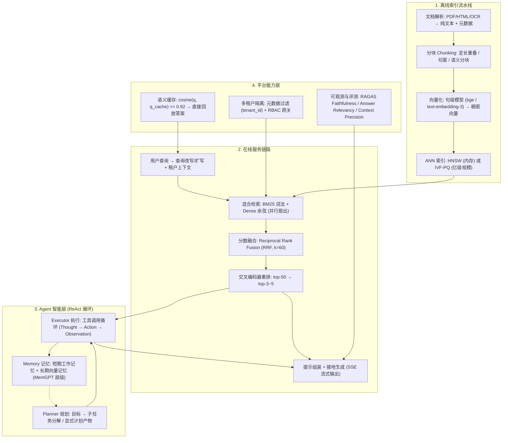

# 🌐 大模型 RAG 与 Agent 生产级系统架构：多租户隔离、流式服务与高可用

> **核心摘要**：将 RAG 知识库与 Agent 应用从 Demo 推向企业生产环境，本质上是分布式系统工程与机器学习工程的交叉问题。本指南自上而下拆解完整技术栈：离线索引流水线（解析 → 分块 → 向量化 → ANN 建索引）、在线服务链路（查询改写 → 混合检索 → 交叉编码重排 → 带引用的流式生成）、Agent 智能层（Planner / Executor / Memory 与 ReAct 工具调用循环），以及决定真实部署成败的平台能力——多租户隔离、语义缓存、延迟/成本预算与 RAGAS 评测体系。

---

## 💡 交互式 Mermaid 架构流程图



---

## 💡 经典面试追问与考点速查

* **考点 1**：完整走一遍生产级 RAG 的离线索引流水线与在线服务链路，主要失败点在哪里？
  * *标准回答*：离线：解析文档（PDF/HTML/OCR → 带元数据的干净文本）→ 分块（定长 300–800 token 带 10–15% 重叠，或递归分隔符切分、句窗分块、语义分块）→ 句级模型向量化 → 构建 ANN 索引（1 亿向量以下用 HNSW，之上用 IVF-PQ）。在线：查询改写 → 混合检索（BM25 + 稠密检索，RRF 融合）→ 交叉编码器将 top-50 重排为 top-3~5 → 接地生成。主要失败点：(1) 分块边界切断语义完整的事实；(2) 向量模型与领域不匹配；(3) 索引陈旧；(4) 检索结果在提示词中"中间迷失"（Lost in the Middle）排序不当；(5) 检索噪声放大幻觉——因此重排、元数据过滤与接地提示是标配而非可选项。

* **考点 2**：解释 ReAct 模式，以及 Planner / Executor / Memory 三者在 Agent 工具调用循环中如何协同？
  * *标准回答*：ReAct（Yao 等，2022）在单一循环中交错 **Thought（思考）→ Action（工具调用）→ Observation（观察）**，推理轨迹本身就是决定下一步行动的策略。Planner 将目标分解为有序子任务，并物化为显式计划产物（可检查、可对失败分支单独重跑）；Executor 将子任务解析为对工具注册表的函数调用，并用 JSON Schema 校验参数；Memory 提供持久化——短期工作记忆（最近步骤与工具输出）与长期记忆（蒸馏后的事实与片段向量库，按相关度检索 $M_t = \operatorname{TopK}_{m \in M} s(m, c_t)$）。循环在输出最终答案、达到最大步数或 token 预算时终止。

* **考点 3**：从新鲜度、延迟、成本与准确性角度对比 RAG vs 微调 vs 长上下文注入，各自何时是最优解？
  * *标准回答*：RAG 在新鲜度（只更新索引、无需重训）、可引用的接地性与权限管控上胜出，但天花板受检索质量限制；微调改变风格/语气/行为并把事实写入权重，但更新昂贵且对罕见事实仍会幻觉；长上下文注入最简单，但注意力成本随序列长度以 $\mathcal{O}(n^2)$ 增长、单查询成本随长度上升，且"中间迷失"与干扰噪声会拉低准确率。生产经验法则：先做 RAG；微调用于风格与格式；长上下文只作为小规模稳定语料的过渡方案。

* **考点 4**：如何用 RAGAS 指标评测 RAG 系统？给出公式与典型失败模式。
  * *标准回答*：RAGAS 将评测拆为检索侧与生成侧。**Faithfulness** 衡量答案中有多少断言被检索上下文支持（幻觉检查）；**Answer Relevancy** 衡量答案相对提问的命中度；**Context Precision** 衡量金标准分块是否排在检索结果前列。诊断：Faithfulness 低 → 检索精度/重排问题；Answer Relevancy 低 → 生成提示词问题；Context Precision 低 → 排序器/融合问题。（公式见第三章 3.3 节。）

* **考点 5**：设计一个高并发低延迟的 RAG 服务，如何优化成本/延迟并隔离租户？
  * *标准回答*：(1) **语义缓存**前置在生成器之前：若 $\cos(\mathbf{e}(q), \mathbf{e}(q_{cache})) \ge \tau$（如 0.92）直接回放缓存答案、完全跳过 LLM 推理；(2) **并行扇出**检索：索引按租户/主题/时间分片并发查询，再以 RRF 合并排名；(3) **SSE 流式输出**：首 token 就绪即开始推送，首字延迟（TTFT）与生成时长解耦，连接可复用；(4) 批量向量化调用、对长系统提示前缀做 KV 缓存降低 prefill 成本；(5) **多租户隔离**：每条 ANN 查询强制注入 `tenant_id` 元数据过滤 + 网关 RBAC，隔离是结构性的、绝不依赖提示词。始终以 p50/p99 TTFT 与总延迟作为 SLA 指标。

---

## 📚 第一章：RAG 系统架构——离线索引流水线与在线检索-重排-生成

### 1.1 离线索引流水线：解析、分块、向量化与建索引

RAG（Lewis 等，2020）将参数化生成器与非参数检索器结合：从外部语料检索相关片段并作为生成条件，而非依赖冻结的权重记忆。离线流水线是一个带版本号的批处理任务：**解析 → 分块 → 向量化 → 建索引**。

| 分块策略 | 粒度 | 优点 | 缺点 |
| :--- | :--- | :--- | :--- |
| **定长 + 重叠** | 300–800 token，10–15% 重叠 | 简单、确定、快 | 可能切断事实语句 |
| **递归分隔符切分** | 段落 → 句子 → 词 | 尊重文档结构 | 需按文档类型调参 |
| **句窗分块** | 句子 ± k 个邻近句 | 精确匹配 + 局部上下文 | 索引条目更多、冗余 |
| **语义分块** | 按向量连贯性切分 | 主题一致性最好 | 成本高、依赖模型 |

向量化函数 $e(\cdot)$ 将每个分块映射为稠密向量，检索相关度用余弦相似度：

$$\text{sim}(q, d) = \frac{\mathbf{e}(q)^\top \mathbf{e}(d)}{\|\mathbf{e}(q)\| \cdot \|\mathbf{e}(d)\|}$$

索引选型：约 1 亿向量以下默认 HNSW（图式 ANN，召回高、查询快但吃内存）；之上切换到 IVF-PQ（倒排文件 + 乘积量化），将 768 维 float 向量（3 KB）通过 $m$ 个子码本压缩到几十字节：

$$\text{cost}_{\text{PQ}} \approx m \times \log_2 k \ \text{bit/向量}, \quad \text{原始} \ 32 \times d \ \text{bit}$$

> 💡 **怎么读这张表**: 分块策略的取舍本质是"切碎(检索精度) vs 完整(语义保真)"的平衡:定长最简单但可能把一句完整事实切成两半;语义分块最贵但主题一致性最好。面试常考点:分块与向量模型的选择对检索质量的影响超过在线任何调参——分块是 RAG 质量的第一杠杆。
>
> 🎤 **面试速答**: "结论:离线流水线是解析→分块→向量化→建索引的版本化批任务,分块与向量模型决定检索质量天花板。原理:分块太小丢上下文、太大丢精度,embedding 与领域不匹配时向量检索直接失效。举个例子:300–800 token 定长 + 10–15% 重叠是默认起点;法律文档按条款切、代码按函数切,比通用定长切法检索相关度提升 10–20%。"

### 1.2 在线检索：混合检索、分数融合与重排

词法检索（BM25/TF-IDF）精确匹配术语、ID 与稀有 token；稠密检索捕捉释义级语义。生产系统几乎从不只依赖其一，主流范式是**混合召回 + 融合排序 + 交叉编码器精排**：

1. **混合召回**：BM25 与稠密检索并行（扇出）执行，各自返回 top-100 候选；
2. **分数融合**：用 Reciprocal Rank Fusion 合并两个排名表——参数少、对分数分布稳健：

$$\text{RRF}(d) = \sum_{r \in \{ \text{BM25}, \text{Dense} \}} \frac{1}{k + \text{rank}_r(d)}, \quad k = 60$$

3. **交叉编码器精排**：联合编码查询与分块 $s(q, d) = \text{CE}([q; d]) \in [0,1]$，将融合后的 top-50 重排为最终 top-3~5。交叉编码器不适合全库搜索，但它是漏斗顶端性价比最高的质量提升手段。

> 💡 **直观理解**：BM25 和稠密检索是两种互补的"记忆"：词法检索死记硬背（精确匹配专有名词、ID、生僻词），稠密检索意会（同义、释义、语义相近）。RRF 不用调权重，把两个排名表的位次直接求和：rank 1 得 1/61、rank 60 得 1/120——位置越靠前贡献越大，天然对两路分数分布稳健。交叉编码器则是最贵的"终审"：让 query 和 chunk 一起过模型，但只评 top-50，性价比最高。
>
> 🎤 **面试速答**："结论：生产 RAG 用 BM25 + 稠密并行召回、RRF 融合、交叉编码器把 top-50 重排到 top-3~5。原理：词法抓精确匹配、稠密抓语义，单路都会漏；交叉编码器联合编码质量最高，但只能评少量候选。举个例子：'iPhone 15 价格'——词法路命中含'iPhone 15'的文档，稠密路命中说'苹果最新旗舰多少钱'的文档，RRF 把两路排名融合，交叉编码器再重排 top-50，把最相关的 3–5 块喂给 LLM。"

### 1.3 多租户隔离与接地保护

每个请求携带租户 ID。隔离在**索引层强制**——每条 ANN 查询在打分前编译进必选元数据过滤（`tenant_id == X`），任何提示词都无法跨租户泄漏；同时**网关层**通过 RBAC 管控模型与端点权限。生成侧将检索分块包裹在显式定界符中，并声明上下文是"证据而非指令"，缓解文档内嵌的提示注入攻击。

> 💡 **直观理解**：提示词是"软件层面的承诺"，隔离不能靠承诺——租户 A 的文档可能被检索出来塞进上下文，提示词再怎么约束都挡不住；必须在索引层把 tenant_id 作为硬过滤编译进查询，就像数据库行级权限，而不是靠应用层"自觉"。
>
> 🎤 **面试速答**："结论：多租户隔离在索引层强制（必选 tenant_id 元数据过滤）+ 网关 RBAC，绝不依赖提示词。原理：检索是数据泄漏的主通道，恶意文档还能通过提示注入绕过系统指令。举个例子：100 个租户共享一个 HNSW 索引，每条 ANN 查询先过滤 tenant_id==X 再打分；上线前做单测：租户 A 的 token 查租户 B 的文档必须返回空结果。"

---

## 📚 第二章：Agent 系统——Planner / Executor / Memory 与工具调用循环

### 2.1 ReAct：推理与行动交错循环

ReAct 形式化了现代 Agent 的引擎循环：每一轮将 **Thought**（内部推理）、**Action**（工具调用，如 `search`、`code_exec`、`sql_query`）与 **Observation**（工具返回结果）追加进对话记录，再把完整记录重新喂给模型——推理轨迹同时充当策略、工作记忆与审计日志。终止条件显式明确：最终答案 token、最大步数预算或 token 预算。

> 💡 **直观理解**：ReAct 把"想一下→做一步→看一眼结果"的循环写进上下文：Thought 是推理，Action 是调用工具，Observation 是工具返回。整个轨迹既当策略（决定下一步）、又当工作记忆（记得做过什么）、还当审计日志（每一步可回放）——一举三得，且不需要任何额外训练。
>
> 🎤 **面试速答**："结论：ReAct 在单一循环里交错 Thought→Action→Observation，直到最终答案、最大步数或 token 预算耗尽。原理：工具输出以 Observation 形式回到上下文，模型基于完整轨迹决策。举个例子：'帮我查天气并安排行程'——Thought:需要先知道目的地天气 → Action:search('北京 天气') → Observation:晴 32°C → Thought:适合户外 → Action:calendar.add(...)，循环到输出最终行程为止。"

### 2.2 Planner / Executor / Memory 三件套

* **Planner 规划器**：将目标分解为有序、带类型的子任务，并输出显式计划产物——子任务因此可重排、去重、裁剪，失败分支可单独重跑。
* **Executor 执行器**：将子任务映射为工具调用，用 JSON Schema 校验参数，并做错误处理（重试、工具回退）。
* **Memory 记忆**：三层——工作记忆（最近步骤/工具输出，激进清理）、长期向量记忆（蒸馏后的事实、决策、会话摘要，按相似度检索）、情节记忆（结果日志，供 Reflexion 等反思循环使用）。

> 💡 **直观理解**：三个角色把 Agent 拆成"做计划的人、干活的实习生、记笔记的人"：Planner 只负责拆任务（产出可检查的计划文档），Executor 只负责执行工具调用（参数校验、重试），Memory 负责把重要信息从短时记忆沉淀到长期记忆。分工的意义：任何一个环节可以单独替换、单独调试、单独回滚。
>
> 🎤 **面试速答**："结论：Planner 拆任务、Executor 调工具、Memory 管记忆，三者解耦让 Agent 可工程化。原理：显式计划产物可检查可重跑，失败分支单独重试不污染全局；记忆分层防止上下文爆炸。举个例子：一个 10 步任务执行到第 7 步失败，Planner 的计划文档允许只重跑 7–10 步，而不是整个任务从头再来。"

### 2.3 记忆层级与长任务管理

上下文是有限且位置敏感的资源：自注意力成本随序列 $\mathcal{O}(n^2)$ 增长，而 "Lost in the Middle"（Liu 等，2024）表明模型对窗口首尾的注意力最好。生产 Agent 因此采用**记忆层级**（MemGPT 风格）：活动工作集 → **压缩 compact**（保留目标、未决问题、持久决策与可重载的引用，丢弃原始工具输出）→ 长期存储。子 Agent 用于隔离上下文：在窄窗口内深挖，只向协调者返回紧凑摘要。这解释了为什么单纯加大上下文窗口永远无法解决长任务 Agent 的问题。

> 💡 **直观理解**：注意力 $\mathcal{O}(n^2)$ 意味着上下文是昂贵资源，而 "Lost in the Middle" 说明中间位置的信息模型还记不住——所以拼命加长上下文窗口治标不治本。记忆层级的做法像人的大脑：工作记忆（眼前的事）→ 压缩（把重要的固化下来、丢弃工具原始输出）→ 长期记忆（向量库）。
>
> 🎤 **面试速答**："结论：长任务 Agent 必须用记忆层级（MemGPT 风格）而非无限加长上下文。原理：自注意力 $\mathcal{O}(n^2)$，且模型对窗口首尾注意力最好、中间最差。举个例子：一个 Agent 跑了 50 轮工具调用，直接把全部轨迹塞进上下文要 10 万 token、每轮推理贵一个数量级；压缩成'目标 + 已定决策 + 待办 + 引用'500 token，长期记忆向量库按需检索——这是为什么'加大窗口'永远不是长任务的正解。"

---

## 📚 第三章：上下文工程、评测与生产级优化

### 3.1 上下文工程与长上下文管理

提示工程问"我该对模型说什么"；上下文工程问"模型此刻该知道什么、看到什么、记住什么、忽略什么"。核心战术：**最小高信号 token 集合**（在 token 预算下上下文质量 $\propto$ 信号减噪声）；**渐进式披露**（先展示元数据/文件名，按需加载全文）；**按需检索**优于预加载；**压缩 vs 摘要**——摘要优化可读性，压缩优化未来任务效用。需要排查的四种长上下文失败模式：**投毒**（早期错误固化为状态持续误导）、**分心**（历史记录将注意力拉离当前任务）、**混乱**（工具/指令过多且重叠）、**冲突**（来源矛盾——必须定义显式优先级规则）。

> 💡 **直观理解**：提示工程问"怎么说"，上下文工程问"给什么看"——上下文是有限预算，质量 ∝ 信号 − 噪声。渐进式披露像面试先给简历再问细节；按需检索优于预加载；压缩 vs 摘要：摘要给人看（可读），压缩给模型用（保信息）。
>
> 🎤 **面试速答**："结论：上下文工程 = 最小高信号 token 集 + 渐进式披露 + 按需检索 + 压缩，并排查投毒/分心/混乱/冲突四类失败模式。原理：token 预算下噪声稀释信号；历史记录会分心、早期错误会固化、矛盾来源需要优先级规则。举个例子：用户问'帮我总结这份 100 页财报'，先只给目录和章节元数据，用户点开哪章再加载哪章，而不是一次塞 10 万 token——否则中间章节的信息模型根本记不住。"

### 3.2 RAG vs 微调 vs 长上下文 方案对比

| 维度 | RAG | 微调 | 长上下文注入 |
| :--- | :--- | :--- | :--- |
| **知识新鲜度** | 实时——更新索引即可 | 静态——刷新需重训 | 取决于上下文内容 |
| **训练成本** | 无 | 高（数据整理 + GPU） | 无 |
| **接地/可溯源** | 极好（可引用） | 弱（权重不可解释） | 好但冗长 |
| **单查询延迟与成本** | 检索 + 生成 | 与基座模型相同 | 随长度上升（$\mathcal{O}(n^2)$ 注意力） |
| **风格/格式控制** | 有限 | 强 | 有限 |
| **典型失败** | 检索质量差 | 罕见事实幻觉 | 中间迷失、分心 |

> 💡 **怎么读这张表**：横向对比三个维度——新鲜度（RAG 实时、微调静态）、训练成本（RAG 为零）、可控性（微调最强）。面试经验法则一句话：先 RAG，微调管风格，长上下文只做小语料过渡方案。
>
> 🎤 **面试速答**："结论：知识优先 RAG，风格优先微调，长上下文做过渡。原理：事实知识更新快、需要溯源，放索引里可随时替换；风格/格式写不进索引，只能进权重。举个例子：客服机器人——政策条款改 100 次也不用重训（RAG 改索引即可），但'回复要亲切、用 emoji'这种风格用微调固化；一次性 200 页内部文档临时用长上下文注入。"

### 3.3 RAGAS 评测体系

RAGAS（Es 等，2023）将 RAG 质量拆成可测量组件。设 LLM 判定将答案分解为原子断言集合 $C$，检索上下文为 $C_{\text{ctx}}$：

**Faithfulness（忠实度，幻觉护栏）**：答案断言中被检索上下文支持的占比。

$$\text{Faithfulness} = \frac{| \{ c \in C : c \text{ 被 } C_{\text{ctx}} \text{ 支持} \} |}{|C|}$$

**Answer Relevancy（答案相关度）**：由答案反向生成 $N$ 个问题 $q_1^*, \dots, q_N^*$，取原问题向量与生成问题向量的平均余弦相似度。

$$\text{AnswerRelevancy} = \frac{1}{N} \sum_{i=1}^{N} \cos\left( \mathbf{e}(q), \mathbf{e}(q_i^*) \right)$$

**Context Precision（上下文精确率）**：奖励相关分块排在排名前列的排序质量。

$$\text{Context Precision@k} = \frac{\sum_{k'=1}^{k} \left( \text{precision@}k' \times \mathbf{1}[\text{第 } k' \text{ 位分块相关}] \right)}{\text{top-}k \text{ 内相关分块总数}}$$

> 💡 **直观理解**：三个指标对应 RAG 的三个环节：Faithfulness 查生成（答案有没有瞎编——幻觉护栏），Answer Relevancy 查答案对提问的命中度，Context Precision 查检索排序（黄金分块有没有排前面）。诊断口诀：低 Faithfulness 怪检索/重排，低 Answer Relevancy 怪提示词，低 Context Precision 怪排序/融合。
>
> 🎤 **面试速答**："结论：RAGAS 用 Faithfulness / Answer Relevancy / Context Precision 三个指标分别定位检索与生成问题。原理：把答案拆成原子断言，看被上下文支持的占比；用答案反推问题测相关度；看黄金 chunk 在 top-k 里的排名。举个例子：答案有 5 个断言只有 3 个在检索上下文里，F=0.6 → 查重排；F 正常但答非所问 → 改生成提示词；黄金 chunk 排在 30 名开外 → 查 RRF 融合或 embedding 质量。"

### 3.4 延迟与成本优化

* **语义缓存**：任何 LLM 调用前，用查询向量与缓存查询向量命中测试；若 $\cos(\mathbf{e}(q), \mathbf{e}(q_{cache})) \geq \tau$（0.90–0.95）直接回放缓存答案。FAQ 类高频意图可达到 50–90% 命中率，直接消除生成这一最大成本项。
* **并行检索扇出**：索引按租户/日期/主题分片、并发查询、RRF 合并——检索延迟从"分片之和"降为"分片之最"。
* **SSE 流式输出**：网关保持连接并随 token 到达即时转发；TTFT 成为用户真正感知的 p99 指标，长生成不再占用客户端连接。
* **成本杠杆**：向量化调用批量合并、长系统提示前缀做 KV 缓存、简单查询路由到小模型，并以 p50/p99 监控每查询 token 预算。

> 💡 **直观理解**：语义缓存是"同样的题别再算一遍"：FAQ 类问题命中率可达 50–90%，生成是最大成本项，缓存直接砍掉。并行扇出把检索延迟从"分片之和"变"分片之最"；SSE 流式则把用户感知从"总生成时间"变成"首 token 时间"。
>
> 🎤 **面试速答**："结论：优化三板斧是语义缓存、并行检索、SSE 流式，并监控 p50/p99 TTFT。原理：LLM 生成是延迟和成本大头，能跳过就跳过；流式让 TTFT 与总时长解耦。举个例子：1000 QPS 的客服 RAG，FAQ 缓存命中 70%，700 QPS 完全不进 LLM——月成本直接打三折，TTFT 从 2 秒降到 50ms；索引按租户分片并发查询，检索延迟从 300ms 降到 80ms。"

---

## 🐍 Pure Numpy 实现

可运行的端到端迷你 RAG：带重叠的分块、哈希技巧稠密向量化、混合检索（词法 + 稠密）RRF 融合、交叉编码器式重排、语义缓存与 Faithfulness 代理指标——仅依赖 numpy。

```python
import numpy as np

DOCUMENTS = [
    "Retrieval augmented generation grounds the answer in retrieved documents.",
    "Embedding models map text chunks into dense vectors for similarity search.",
    "An ANN index such as HNSW accelerates nearest neighbor search over millions of vectors.",
    "Semantic cache reuses previous answers when the query embedding is similar.",
    "ReAct agents interleave thought, tool calls, and observations in a loop.",
    "Cross encoder re-ranking scores query document pairs to fix bi encoder ranking.",
]

def tokenize(text: str):
    return [t for t in text.lower().replace(".", "").split()]

def poly_hash(word: str, p=31, m=10007):          # 确定性哈希 (内置 hash 会加盐)
    h = 0
    for ch in word:
        h = (h * p + ord(ch)) % m
    return h

def embed(tokens, dim=32):                        # 哈希技巧 -> L2 归一化稠密向量
    v = np.zeros(dim)
    for tok in tokens:
        v[poly_hash(tok) % dim] += 1.0
    n = np.linalg.norm(v)
    return v / n if n > 0 else v

# ---- 1. 离线: 定长重叠分块 + 向量化 + 建索引 ----
CHUNK_SIZE, OVERLAP = 8, 3
chunks, index = [], []
for doc in DOCUMENTS:
    toks = tokenize(doc)
    for i in range(0, max(1, len(toks) - OVERLAP), CHUNK_SIZE - OVERLAP):
        c = toks[i:i + CHUNK_SIZE]
        if c:
            chunks.append(c)
            index.append(embed(c))
INDEX = np.stack(index)

# ---- 2. 在线: 混合检索 (词法 + 稠密) RRF 融合 ----
def retrieve(query: str, k: int = 2):
    qt, qv = tokenize(query), embed(tokenize(query))
    dense = INDEX @ qv                                       # 归一化向量上的余弦
    dense_ranks = {d: i + 1 for i, d in enumerate(np.argsort(-dense))}
    lex = {d: len(set(chunks[d]) & set(qt)) for d in range(len(chunks))}
    lex_ranks = {d: r + 1 for r, d in enumerate(sorted(lex, key=lex.get, reverse=True))}
    fused = {d: 1.0 / (60 + lex_ranks[d]) + 1.0 / (60 + dense_ranks[d]) for d in range(len(chunks))}
    return sorted(fused, key=fused.get, reverse=True)[:k]

# ---- 3. 语义缓存 ----
cache = []
def semantic_cache(query: str, threshold: float = 0.90):
    qv = embed(tokenize(query))
    for q_cached, answer in cache:
        if float(qv @ q_cached) >= threshold:
            return answer
    return None

# ---- 4. RAGAS Faithfulness 代理: 答案断言被检索上下文支持的比例 ----
def faithfulness(answer: str, top_chunks) -> float:
    claims, ctx = set(tokenize(answer)), set()
    for c in top_chunks:
        ctx |= set(chunks[c])
    return len(claims & ctx) / len(claims) if claims else 1.0

if __name__ == "__main__":
    q = "how does semantic cache reduce cost"
    top = retrieve(q)
    print("top chunks:", [" ".join(chunks[i]) for i in top])
    print("cache miss ->", semantic_cache(q))
    cache.append((embed(tokenize(q)), "Replayed cached answer"))
    print("cache hit  ->", semantic_cache(q))
    print("faithfulness =", faithfulness("semantic cache reuses answers", top))
```

---

## 📝 总结与学习路线

1. **把离线流水线做成带版本号的批任务**（解析 → 分块 → 向量化 → 建索引）；分块与向量模型的选择对检索质量的影响超过任何在线调参。
2. **重排不可省略**：双编码器召回 + 交叉编码器精排是整个栈里性价比最高的质量提升。
3. **多租户隔离在索引层强制**（必选元数据过滤 + RBAC 网关），绝不依赖提示词。
4. **把上下文当有限预算**：压缩、渐进式披露与记忆层级优于盲目加大上下文窗口。
5. **用 RAGAS 持续评测**（Faithfulness / Answer Relevancy / Context Precision），按租户与查询类型切片分析；用语义缓存 + 并行检索 + SSE 流式输出优化延迟，并以 p50/p99 TTFT 作为发布门禁。
