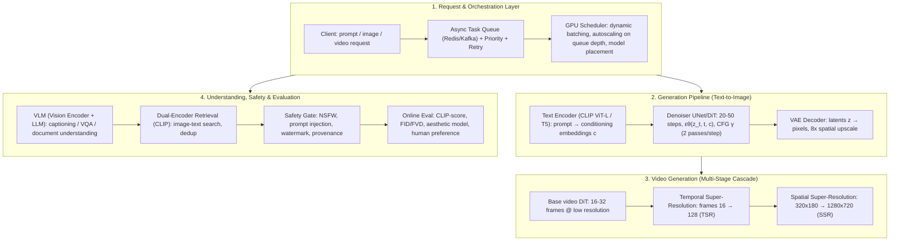

# 🌐 Multimodal Generative System Design: Image/Video Generation & GPU Scaling

> **Core Executive Summary**: Multimodal generative workloads — text-to-image, text-to-video, and vision-language understanding — are the most compute-hungry and latency-sensitive tasks in modern ML serving. They cannot be served like classic synchronous RPCs: a single SDXL image needs 25+ denoising steps on a multi-billion-parameter UNet/DiT backbone (2–4 s on one A100), and a 5-second 720p video demands millions of spatiotemporal tokens. Production systems therefore rest on four pillars: (1) **async task queues** decoupling clients from GPU workers; (2) **model slicing and pipeline placement** across text encoder / denoiser / VAE decoder; (3) **inference acceleration** via step distillation (SDXL-Turbo, LCM), dynamic batching, and INT8/FP8 kernels; and (4) **GPU auto-scaling** driven by queue depth. Around the generation path sit multimodal understanding models (vision encoder + LLM fusion), image-text retrieval, content-safety filters, and continuous online evaluation.

---

## 💡 Interactive Mermaid Architecture Flowchart



---

## 💡 Classic Interview Followups & Core Cheatsheet

* **Key Topic 1**: Walk through the end-to-end production text-to-image pipeline; why are async queues mandatory?
  * *Standard Answer*: The request flows through four stages. (1) **Text encoding**: the prompt is encoded by CLIP ViT-L (77 tokens in SD1.5/SDXL) or T5-XXL (up to 4096 tokens in DeepFloyd/Imagen) into conditioning embeddings $c$. (2) **Denoising**: a UNet (SD1.5, 0.86B) or DiT (SDXL 3.5B; Sora-class 10–20B) predicts noise for $T=20\text{–}50$ steps in latent space, with **Classifier-Free Guidance** doubling the forward passes: $\tilde{\epsilon}_\theta(z_t, c) = \epsilon_\theta(z_t, \varnothing) + \gamma(\epsilon_\theta(z_t, c) - \epsilon_\theta(z_t, \varnothing))$. (3) **VAE decode**: the $64 \times 64 \times 4$ latent is upsampled 8× to $512 \times 512$. (4) **Post-processing**: safety check, optional upscale. Total latency is 2–10 s — far beyond any HTTP budget, so sync serving would pin workers and GPUs for seconds and blow up tail latency under bursts. An **async queue** (Redis/Kafka + K8s worker) decouples submission from execution: the API returns a `task_id`, workers poll the queue, results land in object storage, and clients poll or receive webhooks. The queue also enables **dynamic batching** (SDXL with $B=8$ nearly triples GPU throughput), prioritization, retries, and — critically — serves as the **autoscaling signal** (replicas scale with queue depth).

* **Key Topic 2**: How do you cut per-image latency from ~20 s to under 1 s?
  * *Standard Answer*: Attack each term of $\text{latency} \approx \frac{\text{effective steps} \times \text{FLOPs/step}}{\text{GPU TFLOPS} \times \text{efficiency}}$. (1) **Fewer steps**: DDIM 50→20 (deterministic, ~2× speedup), DPM-Solver 10–15 steps. (2) **Distillation**: SDXL-Turbo uses adversarial + score distillation to generate in 1–4 steps; **LCM** (Latent Consistency Models) distills a consistency function $f_\theta(z_t, t, c) \approx z_0$ so any $t$ maps directly to the clean image — 1–8 steps, and CFG can be dropped to one pass/step (another 2×). (3) **Batching**: fuse many requests into one forward pass; SD1.5 with $B=8$ reaches ~2–3× throughput. (4) **Kernels**: TensorRT + INT8/FP8 quantization and fused attention, targeting >70% of peak TFLOPS. (5) **Caching**: prompt-embedding cache (text encoder runs once per prompt, reused across seeds), similarity-based latent caching, result caching for repeated prompts. In practice, LCM-SDXL + FP8 on an A100 reaches <1 s per image at 1024².

* **Key Topic 3**: Compare diffusion, GAN, and autoregressive models for image/video generation.
  * *Standard Answer*: **Diffusion** (SD, Imagen, Sora, Flux, Veo): best quality–diversity tradeoff, flexible conditioning (text, image, ControlNet), stable non-adversarial training with the likelihood objective $\mathcal{L}_{\text{simple}} = \mathbb{E}\left[\|\epsilon - \epsilon_\theta(z_t, t, c)\|^2\right]$; weakness is multi-step sampling → high latency and FLOPs. **GANs** (StyleGAN, Turbo's adversarial component): single-step sampling, sharpest images, lowest cost — but prone to mode collapse, unstable training, poor distribution coverage. **Autoregressive** (DALL·E 1, Parti, VAR, Chameleon): factorizes $p(x) = \prod p(\text{token}_i | \text{token}_{<i})$, scales smoothly with compute, reuses LLM infrastructure, and natively unifies understanding + generation — but token-by-token sampling is sequential and costly at high resolution (mitigated by latent/visual tokens in VAR and GPT-4o image gen). Rule of thumb: **photorealistic image/video → diffusion; real-time interactive → GAN; unified gen + understanding → autoregressive/DiT hybrid**.

* **Key Topic 4**: Estimate GPU cost per image and per second of video.
  * *Standard Answer*: Use $\text{cost} = \frac{\text{FLOPs}_{\text{total}}}{\text{GPU TFLOPS} \times \text{efficiency} \times 3600} \times \text{price/hr}$. For transformers, $\text{FLOPs} \approx 2 \times N_{\text{params}} \times N_{\text{tokens}} \times \text{steps}$: SDXL UNet (~3.5B params, latent $128 \times 128 \times 4 = 65536$ tokens, 25 steps × 2 CFG passes ≈ 50 effective steps) → $2 \times 3.5 \times 10^9 \times 65536 \times 50 \approx 2.3 \times 10^{16}$ FLOPs ≈ 23 PFLOPS. On an A100 (312 TFLOPS FP16 peak, ~35% achievable ≈ 110 TFLOPS) the theoretical bound is ~210 GPU-seconds — but the UNet is convolutional and far cheaper in practice, so use measured busy time: **SD1.5 512²: ~0.3–1 GPU-s → ~\$0.0001–0.0004**; **SDXL 1024²: ~1–3 GPU-s → ~\$0.0005–0.0012**; **5 s 720p video (Sora-class 10B DiT, ~60 effective steps): ~60–120 GPU-s → ~\$0.03–0.06 per clip** at \$3/GPU-hr. Video is 30–100× costlier because $F$ frames multiply every tensor — hence aggressive batching and distillation for profitable margins.

* **Key Topic 5**: Design the safety and evaluation stack for a generative service.
  * *Standard Answer*: **Evaluation**: FID/FVD for distributional fidelity ($\text{FID} = \|\mu_r - \mu_g\|^2 + \text{Tr}(\Sigma_r + \Sigma_g - 2(\Sigma_r\Sigma_g)^{1/2})$), **CLIP-score** for text–image alignment, LPIPS for perceptual distance, AVA-trained aesthetic-score models, optical-flow/temporal metrics for video consistency, and **human preference (Elo leaderboards)** as ground truth. **Safety**: input-side prompt filter (NSFW lexicon + classifier + prompt-injection detection) → in-loop moderation of intermediate steps (cheap "shadow safety model") → output-side NSFW classifier with blur/block policies → watermarking (C2PA provenance metadata + invisible frequency-domain watermarks) → audit logs and per-user rate limits. Safety models must be **offline regression-tested** before every generator deploy, since content policies change faster than generators.

---

## 📚 Section 1: End-to-End Generation Pipeline — Text Encoder → UNet/DiT → VAE

### 1.1 The Latent Diffusion Pipeline

Stable Diffusion and Sora operate in a compressed **latent space**: a pretrained VAE maps images to latents with spatial downscale factor $f=8$, cutting the pixel count $64\times$. Diffusion then runs on latents rather than pixels:

$$q(z_t | z_0) = \mathcal{N}\left(z_t; \sqrt{\bar{\alpha}_t}\, z_0,\, (1 - \bar{\alpha}_t) I\right), \qquad z_t = \sqrt{\bar{\alpha}_t}\, z_0 + \sqrt{1-\bar{\alpha}_t}\,\epsilon$$

The denoiser is trained with a simple noise-prediction MSE (a reweighted ELBO that is equivalent to denoising score matching):

$$\mathcal{L}_{\text{simple}}(\theta) = \mathbb{E}_{t, z_0, \epsilon, c}\left[ \left\| \epsilon - \epsilon_\theta(z_t, t, c) \right\|_2^2 \right]$$

| Pipeline Stage | Representative Models | Params | Role & Latency Share |
| :--- | :--- | :--- | :--- |
| **Text Encoder** | CLIP ViT-L (SD1.5/SDXL), T5-XXL (Imagen/DeepFloyd), Gemma-3 | 0.12–11B | Prompt → conditioning $c$; ~2–5% latency (cacheable per prompt) |
| **Denoiser (UNet/DiT)** | SD1.5 UNet, SDXL UNet, Flux DiT, Sora/Veo DiT | 0.86–20B | 20–50 iterative steps × CFG 2 passes; **85–95% latency** |
| **VAE Decoder** | SD-VAE, SDXL-VAE, Sora 3D decoder | 0.05–0.5B | Latents → pixels, $8\times$ spatial upscale; ~3–8% latency |

> 💡 **How to read this table**: Watch the "Latency Share" column — the denoiser takes 85–95% of latency while the text encoder takes only 2–5% and is cacheable. Interview takeaway: optimization time goes into the UNet/DiT steps; the text encoder is nearly free, so caching prompt embeddings is the first guaranteed win.
>
> 🎤 **Interview Answer**: "Conclusion: the text-to-image pipeline is text encoder (cheap, cacheable) + denoiser (85–95% of latency) + VAE decode (3–8%) — optimize the denoiser only. Why: latent diffusion compresses 512² pixels into a 64² latent, cutting compute 64×, but denoising still iterates 20–50 steps × 2 CFG passes. Example: an SDXL image takes 2–4 s, 90% of it in the UNet; the text encoder runs once in ~30ms and is reused across seeds — with caching, 1,000 images compute it once."

### 1.2 Text Conditioning & Classifier-Free Guidance

Conditioning enters the denoiser via **cross-attention** (UNet/DiT queries attend to text keys/values) and via timestep/prompt embeddings. To amplify prompt adherence, Classifier-Free Guidance interpolates between the conditional and unconditional noise estimates:

$$\tilde{\epsilon}_\theta(z_t, c) = \epsilon_\theta(z_t, \varnothing) + \gamma \left( \epsilon_\theta(z_t, c) - \epsilon_\theta(z_t, \varnothing) \right)$$

$\gamma \approx 5\text{–}8$ for SD1.5; higher $\gamma$ → better alignment but saturated colors and reduced diversity — and **doubles inference cost** (two passes per step), a prime target for distillation.

> 💡 **Intuition**: CFG is an "amplifier of the divergence between conditional and unconditional generation": the conditional output is 'the answer that listened to the prompt', the unconditional output is 'the model's own default aesthetic', and the difference is scaled by $\gamma$ and added back to better obey the prompt. The price: two forward passes per step — why CFG is the #1 latency enemy and the first target of distillation (Turbo/LCM).
>
> 🎤 **Interview Answer**: "Conclusion: CFG = unconditional output + γ × (conditional − unconditional); better alignment, but every step costs two forward passes. Why: a conditionally trained model alone obeys the prompt too weakly; CFG amplifies the conditional–unconditional divergence. Example: SD1.5 at γ=7 obeys prompts best, but 25 steps × 2 = 50 passes; dropping CFG halves latency immediately — which is why LCM distillation bakes the guidance strength into the weights and generates in 1–8 steps with one pass per step."

### 1.3 Video Generation: Multi-Stage Cascades & Spatiotemporal DiT

Video is a spatiotemporal tensor $x_0 \in \mathbb{R}^{F \times H \times W \times C}$, generated via **cascades** (Imagen Video, Sora, Veo): a base DiT creates 16–32 low-res frames, a temporal super-resolution model (TSR) interpolates frames, and a spatial super-resolution model (SSR) raises resolution to 720p+. Video DiTs tokenize spatiotemporal patches for joint space-time attention; high resolution favors **$v$-prediction** ($v = \sqrt{\bar{\alpha}_t}\,\epsilon - \sqrt{1-\bar{\alpha}_t}\,z_0$) over $\epsilon$-prediction. The defining constraint is **temporal coherence** — identity, geometry, and motion must stay consistent across frames — which blocks per-frame parallelism and pushes cost to 30–100× an image.

> 💡 **Intuition**: Video is "image × frames" as a spatiotemporal tensor; end-to-end generation at 720p × 128 frames is computationally explosive, so production cascades: a base DiT makes 16–32 low-res frames (motion and structure), a temporal super-resolution model fills in frames, and a spatial model raises resolution. Temporal coherence is the bottleneck: generating frames independently makes people "morph", so per-frame parallelism is out — the root of the 30–100× cost multiple.
>
> 🎤 **Interview Answer**: "Conclusion: video generation cascades base DiT → temporal SR → spatial SR; temporal coherence forbids per-frame parallelism, making cost 30–100× an image. Why: $F$ frames multiply every tensor, and identity, geometry, and motion must stay consistent across frames. Example: 5 s of 720p ≈ 128 frames — the compute of ~128 720p images plus coherence constraints, or 60–120 GPU-seconds per clip versus 1–3 seconds per image; that is why video products batch aggressively and cache."

---

## ⚡ Section 2: Inference Acceleration & GPU Cost Engineering

### 2.1 Step Reduction: DDIM, DPM-Solver, Distillation (Turbo/LCM)

Latency is proportional to effective steps. Four lever families:

| Technique | Mechanism | Steps | Quality Impact |
| :--- | :--- | :--- | :--- |
| **DDIM / DPM-Solver** | Deterministic ODE discretization of the reverse process | 50 → 10–20 | ~None (slight texture loss) |
| **SDXL-Turbo / SD-Turbo** | Adversarial + score-distillation training | 25 → 1–4 | Slight detail loss, artifacts at scale |
| **LCM (Consistency Models)** | Distill consistency mapping $f_\theta(z_t, t, c) \approx z_0$ | 25 → 1–8 | Good fidelity; CFG-free → 1 pass/step |
| **CFG-free inference** | Embed guidance into weights, drop second pass | 2× FLOPs/step saved | Small alignment loss |

The LCM objective makes any timestep map to the clean sample directly: $f_\theta(z_t, t, c) \approx z_0$, enabling 1–8 step sampling — the single biggest latency lever in production serving.

> 💡 **How to read this table**: Watch the "Steps" column — four techniques compress sampling from 50 steps down to 1–8. Interview ordering: DDIM/DPM-Solver are free and lossless (just swap the sampler), distillation (Turbo/LCM) touches training, and CFG-free inference is a free 2×. Why LCM is the most aggressive: a consistency model maps any timestep $t$ directly to the clean image instead of walking step by step — step count becomes a constant.
>
> 🎤 **Interview Answer**: "Conclusion: the latency levers in order are step distillation (LCM/Turbo: 25→1–8 steps) > CFG-free (another 2×) > dynamic batching > FP8/INT8 + TensorRT. Why: latency ∝ effective steps × FLOPs per step, so every lever multiplies straight into the formula. Example: SDXL starts at 50 effective steps and 2–4 s; LCM-SDXL with 4 CFG-free steps plus FP8 renders 1024² in under 1 s — 50→4 steps is 12.5×, CFG-free another 2×, roughly 25× total. That is the complete answer to 'how do you get from 20 s to under 1 s'."

### 2.2 Parallelism, Batching & Kernels

* **Dynamic batching**: merge $B$ requests of identical resolution into one forward pass; SDXL $B=8$ achieves ~2.5–3× throughput per GPU (utilization, not raw FLOPs, is the binding constraint).
* **Pipeline parallelism / model slicing**: text encoder, denoiser, and VAE decoder run on separate GPUs — the classic "model offloading" pattern of swapping UNet weights from HBM/CPU when VRAM is tight.
* **Kernel level**: TensorRT / Torch-TRT, FP8 (Hopper) or INT8 quantization, fused cross-attention; target >60–70% of peak TFLOPS.
* **Horizontal scaling**: shard across GPUs with **autoscaling on queue depth**; spot-instance pools for bursts; video clip batches across multiple requests.

> 💡 **Intuition**: Dynamic batching fuses 8 users' requests into one forward pass — GPUs are throughput machines and a single image under-feeds them; model slicing puts the encoder, denoiser, and decoder on separate GPUs; kernel work (TensorRT + FP8) makes floating-point math run faster. Together they are the three pillars of cost engineering.
>
> 🎤 **Interview Answer**: "Conclusion: dynamic batching at B=8 gives ~2.5–3× throughput, model slicing places the three stages on separate GPUs, and TensorRT + FP8 push utilization past 70%. Why: utilization, not raw FLOPs, is the binding constraint — batching amortizes small requests' idle time, and the VRAM-hungry denoiser slices to fit 80 GB. Example: 100 users request SDXL simultaneously; dynamic batching fuses them into ~13 batches of 8 so the GPU never idles — serial serving runs ~30 QPS, batched ~90 QPS, cutting the GPU bill to a third."

### 2.3 GPU Cost Estimation — Show the Arithmetic

$$\text{cost} = \frac{\text{effective steps} \times \text{FLOPs per step}}{\text{GPU TFLOPS} \times \text{efficiency}} \times \frac{\text{price per hour}}{3600}$$

| Workload | Backbone | Eff. Steps | Total FLOPs | A100 GPU-seconds | Cost @ \$3/hr |
| :--- | :--- | :--- | :--- | :--- | :--- |
| SD1.5, 512×512 | UNet 0.86B | 40 (CFG) | ~30 TFLOPs | 0.3–1 | ~\$0.0001–0.0004 |
| SDXL, 1024×1024 | UNet 3.5B | 50 (CFG) | ~250 TFLOPs | 1–3 | ~\$0.0005–0.0012 |
| LCM-SDXL, 1024² | 3.5B distilled | 4 (no CFG) | ~20 TFLOPs | 0.1–0.3 | ~\$0.00005–0.0001 |
| 5 s 720p video | DiT ~10B | 60 | ~20 PFLOPs | 60–120 | ~\$0.03–0.06 |

Video at scale is dominated by this 30–100× multiple — which is why video products batch aggressively, generate base + SR in separate queues, and cache "bursts" (scene-seed) reusable across renders.

> 💡 **How to read this table**: The two columns that matter are "Total FLOPs" and "A100 GPU-seconds" — cost = FLOPs / (TFLOPS × efficiency × 3600) × price per hour. Note the video row: 5 s of 720p costs 30–100× an image, the margin lifeline for any video business. Be ready to do the arithmetic live: SDXL = 2 × 3.5B × 65,536 × 50 ≈ 23 PFLOPS, then divide by effective GPU throughput.
>
> 🎤 **Interview Answer**: "Conclusion: cost = FLOPs/(GPU TFLOPS × efficiency × 3600) × price; SD1.5 ≈ $0.0001–0.0004/image, SDXL ≈ $0.0005–0.0012/image, 5 s 720p video ≈ $0.03–0.06/clip. Why: FLOPs ≈ 2 × params × tokens × effective steps. Example: SDXL with 3.5B params, 65,536 latent tokens, 50 effective steps → 2 × 3.5×10^9 × 65,536 × 50 ≈ 2.3×10^16 FLOPs ≈ 23 PFLOPS; at an A100's ~110 TFLOPS achievable (312 peak × ~35%), the theoretical bound is ~210 GPU-seconds — but a convolutional UNet is far cheaper in practice, so quote the measured 1–3 s."

---

## 🌀 Section 3: Model Selection & Multimodal Understanding Systems

### 3.1 Diffusion vs GAN vs Autoregressive

| Criterion | Diffusion (SD/Flux/Sora) | GAN (StyleGAN/Turbo) | Autoregressive (DALL·E 1/VAR/Chameleon) |
| :--- | :--- | :--- | :--- |
| Sample quality | ★★★ (photoreal) | ★★☆ (sharp but narrow) | ★★☆→★★★ (scales with compute) |
| Sampling cost | 20–50 steps, high FLOPs | 1 step, cheap | Sequential tokens; slow at high res |
| Diversity / mode coverage | ★★★ | ★ (mode collapse risk) | ★★★ |
| Controllability | ★★★ (text/ControlNet/CFG) | ★☆ (conditional GANs) | ★★ (prompt-as-prefix) |
| Training stability | ★★★ (likelihood objective) | ★ (minimax instability) | ★★★ (LM objective) |
| Unified gen+understand | ✗ (needs separate VLM) | ✗ | ✓ (native multimodal) |

Rule of thumb: **diffusion for photorealistic media; GAN for real-time/streaming; autoregressive or unified DiT for multimodal all-in-one models** (GPT-4o image, Gemini, Janus-Pro).

> 💡 **How to read this table**: Read horizontally along "Sampling cost" and "Diversity / mode coverage" — diffusion is expensive but stable, GANs are cheap but mode-collapse (only a few image archetypes), autoregressive scales with compute and natively unifies understanding + generation. The one-line rule: photorealistic → diffusion; real-time → GAN; unified understanding+generation → autoregressive/DiT.
>
> 🎤 **Interview Answer**: "Conclusion: diffusion wins on quality–diversity but pays multi-step sampling; GANs are the cheapest single-step option but mode-collapse; autoregressive scales with compute and unifies understanding and generation. Why: diffusion trains on a stable likelihood objective with flexible conditioning; GAN minimax training is unstable. Example: e-commerce product images (need diversity and controllability) → diffusion; in-game real-time avatars (must render in ~5ms) → GAN; a model like GPT-4o that must both understand and generate images → autoregressive/unified DiT."

### 3.2 Multimodal Understanding: Vision Encoder + LLM Fusion

The understanding path mirrors generation in reverse — a modular VLM is:

$$z_v = f_v(x_v) \xrightarrow{\text{projector}} z_t = f_t(x_t) \xrightarrow{\text{fusion}} y = g(z_m)$$

* **Vision encoder**: ViT/CLIP/SigLIP patch embeddings — $N_v = HW/P^2$ visual tokens (1024² → 256 tokens at $P=16$).
* **Projector**: MLP (LLaVA), Q-Former (BLIP-2), or resampler — compresses $N_v$ tokens to ~32–256 for the LLM.
* **Fusion**: cross-attention with queries from language, keys/values from vision: $\text{CrossAttn}(Q_t, K_v, V_v) = \text{softmax}(Q_t K_v^\top / \sqrt{d})\, V_v$.
* **Retrieval head**: dual-encoder (CLIP-style) cosine similarity $s(I,T) = \frac{g_v(I)^\top g_t(T)}{\|g_v(I)\|\,\|g_t(T)\|}$ with the InfoNCE contrastive loss — the workhorse for **image-text search, dedup, and RAG reranking**:
$$\mathcal{L} = -\frac{1}{2N}\sum_i \left( \log \frac{e^{s(I_i, T_i)/\tau}}{\sum_j e^{s(I_i, T_j)/\tau}} + \log \frac{e^{s(T_i, I_i)/\tau}}{\sum_j e^{s(T_i, I_j)/\tau}} \right)$$

> 💡 **Intuition**: A VLM is "eyes + interpreter + brain": the vision encoder cuts an image into patches and turns them into tokens (eyes), the projector compresses thousands of visual tokens into a few dozen (interpreter), and the LLM does the reasoning (brain). The retrieval head is a CLIP-style dual encoder: image and text encode separately and rank by cosine — the workhorse for image-text search, dedup, and RAG reranking. The InfoNCE loss is just the in-batch log-likelihood of matching pairs: pull matched image-text pairs together, push mismatched ones apart.
>
> 🎤 **Interview Answer**: "Conclusion: a VLM = vision encoder + projector + LLM, with retrieval via CLIP-style dual-encoder cosine similarity. Why: there are too many visual patches to feed the LLM directly, so the projector compresses; dual encoders make image-text search indexable. Example: a 1024² image at P=16 yields 256 visual tokens, which a Q-Former compresses to 32 before the LLM — 8× cheaper inference; for 'a cat on a sofa', CLIP encodes the query and 1B images once each and returns the cosine Top-100 in milliseconds."

### 3.3 Online Serving Architecture: Queue / Batch / Cache

| Concern | Design Choice | Why |
| :--- | :--- | :--- |
| Request entry | Async queue + `task_id` + webhook/poll | 2–10 s jobs can't hold HTTP connections |
| Scheduler | GPU worker pool with dynamic batching | Amortize FLOPs; SDXL $B=8$ ≈ 3× throughput |
| Autoscaling | Scale replicas on queue depth, not CPU | Generation is GPU-bound; cold-start 30–90 s |
| Model placement | Pipeline split: encoder/denoiser/decoder GPUs; weights in HBM/CPU tiered | Denoiser VRAM-heavy; slice to fit 80 GB |
| Caching | Prompt-embedding cache, result cache, similarity-reuse | Text encoder ~5% cost but 100% redundant across seeds |
| Priority | Tiered queues (free vs paid), preemption of long jobs | SLOs per tier; fair-share GPU scheduling |

> 💡 **How to read this table**: Every row is an answer to a "why" — why async (2–10 s jobs cannot hold HTTP connections), why scale on queue depth (generation is GPU-bound; CPU metrics carry no signal), why cache (text encoding is ~5% of cost but 100% redundant across seeds). Answering "design a generative image service" in an interview by unfolding this table is a complete answer.
>
> 🎤 **Interview Answer**: "Conclusion: generation services must use an async queue with task_id + webhook/poll, scaling workers on queue depth. Why: synchronous HTTP pins threads and GPUs on second-scale jobs, and tail latency explodes under bursts; a queue decouples submission from execution. Example: 1M users all request at midnight — a sync service with 1,000 threads saturates instantly and P99 blows from 2 s to 30 s; async queues the requests and the worker pool scales from 10 to 100 instances on queue depth, so users see 'submitted, image pending' — controlled experience, controlled cost."

---

## 📚 Section 4: Content Safety, Evaluation & Governance

### 4.1 Safety Pipeline

A production gate has four layers: **(1) input filter** — prompt toxicity/NSFW classifiers and prompt-injection detection before generation; **(2) in-loop moderation** — a cheap classifier on intermediate latents to abort dangerous generations early; **(3) output filter** — NSFW classifier on the decoded output with block/blur policies; **(4) provenance** — C2PA metadata + invisible watermarks, per-user rate limits, and audit logs. Safety models are versioned and offline regression-tested before every generator deploy.

> 💡 **Intuition**: The four-layer gate is "defense moved forward": input filtering intercepts before generation (cheapest), in-loop moderation aborts dangerous generations mid-steps (saves GPU money), output filtering is the backstop (blur/block), and provenance/watermarking owns accountability. Why safety models need offline regression before every deploy: content policy changes faster than generators — shipping a new generator untested against safety is like going naked.
>
> 🎤 **Interview Answer**: "Conclusion: the safety gate is input filter → in-loop moderation → output filter → watermark/provenance, with offline regression before every release. Why: the earlier you intercept, the cheaper it is — aborting mid-steps saves up to 90% of GPU cost, and provenance solves post-hoc accountability. Example: a user submits an NSFW prompt — the input classifier blocks it in 5ms before any GPU is spent; anything that slips through is aborted by a shadow safety model at step 5 of 25, saving 80% of compute; the decoded output passes an NSFW classifier for blur/block; finally C2PA metadata plus an invisible watermark make it traceable."

### 4.2 Evaluation Metrics

$$\text{FID} = \|\mu_r - \mu_g\|^2 + \text{Tr}\left(\Sigma_r + \Sigma_g - 2(\Sigma_r \Sigma_g)^{1/2}\right), \qquad \text{CLIP-Score} = \frac{\langle f_{\text{img}}(x), f_{\text{text}}(c) \rangle}{\|f_{\text{img}}(x)\|\,\|f_{\text{text}}(c)\|}$$

| Dimension | Metrics |
| :--- | :--- |
| Distributional fidelity | FID (images), FVD (video, I3D features) |
| Text–image alignment | CLIP-score, TIFA, compositional recall |
| Perceptual quality | LPIPS, aesthetic-score (AVA), MUSIQ |
| Temporal consistency (video) | Optical-flow error, frame-wise LPIPS, identity stability |
| Human preference | Elo leaderboards (e.g., ELO-MMD), pairwise A/B on prod traffic |

**Online**: continuously sample generated outputs → auto-metrics → human review queues; drift alerts when FID/CLIP-score shifts or moderation-violation rate rises.

> 💡 **How to read this table**: The five dimensions cover different facets of generation quality: distributional fidelity (FID — does the output look like real images as a set), text–image alignment (CLIP-score — does it obey the prompt), perceptual quality (LPIPS/aesthetics), temporal consistency (video only), and human preference (Elo — the final judge). Interview point: FID is blind to whether an individual image matches its prompt, so it must pair with CLIP-score.
>
> 🎤 **Interview Answer**: "Conclusion: evaluate with FID/FVD (distribution) + CLIP-score (alignment) + LPIPS/aesthetics (perception) + optical flow (consistency) + Elo (human preference). Why: each metric answers one facet — FID measures the set, not prompt adherence, so they must be combined. Example: a model that only produces high-quality cats while users ask for dogs scores low FID (good distribution) but collapses on CLIP-score (fails alignment); a prompt-following but blurry model pushes FID up — watch both, and let human-preference Elo break ties."

---

## 🐍 Pure Numpy Implementation

A runnable DDIM-style sampler over a 2D Gaussian mixture using the exact (analytic) score — no training needed:

```python
import numpy as np


def mixture_score(x, means, sigmas, weights):
    """Analytic score (gradient of log-density) of a Gaussian mixture."""
    logits = np.array([w * np.exp(-np.sum((x - m) ** 2, axis=-1) / (2 * s ** 2))
                       for m, s, w in zip(means, sigmas, weights)])  # [K, N]
    denom = logits.sum(axis=0, keepdims=True) + 1e-12
    score = np.zeros_like(x)
    for (m, s, w), l in zip(zip(means, sigmas, weights), logits):
        score += (l / denom).reshape(-1, 1) * (m - x) / s ** 2
    return score


def ddim_sample(n_samples, means, sigmas, weights, T=50, seed=42):
    """Deterministic DDIM reverse sampling from t=T down to t=1 (pure numpy)."""
    rng = np.random.default_rng(seed)
    x = rng.standard_normal((n_samples, 2)) * 3.0          # start: near-pure noise
    betas = np.linspace(0.0001, 0.02, T)                    # noise schedule
    alphas = 1.0 - betas
    alpha_bar = np.cumprod(alphas)                          # cumprod of (1-beta_t)
    for t in range(T - 1, 0, -1):                           # reverse loop
        sigma_t = np.sqrt((1 - alpha_bar[t - 1]) / (1 - alpha_bar[t]) * betas[t])
        s = mixture_score(x, means, sigmas, weights)        # predicted noise ~ score
        x = (1 / np.sqrt(alphas[t])) * (x - (betas[t] / np.sqrt(1 - alpha_bar[t])) * s)
        if t > 1:
            x = x + sigma_t * rng.standard_normal(x.shape)  # optional stochastic step
    return x


if __name__ == "__main__":
    means = [(-2.0, 0.0), (2.0, 0.0)]
    sigmas = [0.5, 0.5]
    weights = [0.5, 0.5]
    samples = ddim_sample(2000, means, sigmas, weights)
    # verify: samples should cluster around the two modes
    d0 = np.linalg.norm(samples - means[0], axis=1)
    d1 = np.linalg.norm(samples - means[1], axis=1)
    cluster0, cluster1 = (d0 < d1).sum(), (d0 >= d1).sum()
    print(f"✅ DDIM sampling complete. Cluster split: {cluster0} / {cluster1}")
    print(f"   Mean sample location: {samples.mean(axis=0).round(3)} "
          f"(expected ~0.0, 0.0 for symmetric mixture)")
```

Run it: `python3 ddim_sampler.py` → samples split cleanly across the two Gaussian modes, demonstrating the same reverse-process mechanics (noise prediction ↔ score estimation, $\mathcal{O}(T)$ sequential steps) used by production denoisers.

---

## 📝 Takeaways & Engineering Best Practices

1. **Async-first**: never serve 2–10 s generative jobs over sync HTTP; use queues with `task_id` + webhook/poll, scaling workers on queue depth.
2. **Latency levers, in order**: step distillation (LCM/Turbo: 25→1–8 steps, 2× via CFG-free) > dynamic batching > FP8/INT8 + TensorRT > resolution-tiered models.
3. **Cost arithmetic**: $\text{cost} = \frac{\text{FLOPs}}{\text{GPU TFLOPS} \times \eta \times 3600} \times \text{price}$; video is 30–100× images — batch and cache aggressively.
4. **Selection**: diffusion for photoreal generation, GAN for real-time, autoregressive/DiT hybrids when one model must understand *and* generate.
5. **Governance**: input filter → in-loop moderation → output filter → watermark/provenance, offline safety regression before every deploy, online FID/CLIP-score/human-preference monitoring.
