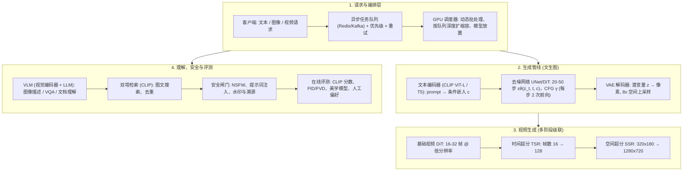

# 🌐 多模态生成系统架构设计：图像/视频生成服务、模型切片与 GPU 动态扩缩容

> **核心摘要**：多模态生成负载（文生图、文生视频、视觉语言理解）是当今 ML 服务中计算量最大、延迟最高的场景，绝不能沿用经典同步 RPC 架构。单张 SDXL 图像需要在数十亿参数的 UNet/DiT 主干上迭代 25+ 步去噪（单卡 A100 需 2–4 秒），而一段 5 秒 720p 视频需要处理数百万时空 token。生产级系统因此围绕四大支柱构建：(1) **异步任务队列**解耦客户端与 GPU Worker；(2) **模型切片与管线放置**，将文本编码器 / 去噪器 / VAE 解码器拆分到不同 GPU；(3) **推理加速**，通过步数蒸馏（SDXL-Turbo、LCM）、动态批处理与 INT8/FP8 算子把成本压低 10–50 倍；(4) **以队列深度为信号的 GPU 自动扩缩容**。在生成主链路之上，还叠加多模态理解模型（视觉编码器 + LLM 融合）、图文检索、内容安全闸门与持续在线评测。

---

## 💡 交互式 Mermaid 架构流程图



---

## 💡 经典面试追问与考点速查

* **考点 1**：画出 Stable Diffusion 图像生成服务的生产级架构图，为什么必须异步？
  * *标准回答*：请求经历四个阶段。(1) **文本编码**：prompt 经 CLIP ViT-L（SD1.5/SDXL 固定 77 token）或 T5-XXL（DeepFloyd/Imagen 最长 4096 token）编码为条件嵌入 $c$。(2) **去噪**：UNet（SD1.5，8.6 亿参数）或 DiT（SDXL 35 亿；Sora 级 100–200 亿）在潜空间迭代 $T=20\text{–}50$ 步预测噪声，且 **Classifier-Free Guidance** 使每步前向翻倍：$\tilde{\epsilon}_\theta(z_t, c) = \epsilon_\theta(z_t, \varnothing) + \gamma(\epsilon_\theta(z_t, c) - \epsilon_\theta(z_t, \varnothing))$。(3) **VAE 解码**：$64 \times 64 \times 4$ 潜变量 8× 上采样还原 $512 \times 512$ 图像。(4) **后处理**：安全审核与可选超分。全程 2–10 秒，远超 HTTP 请求预算——同步架构会长时间占用 Worker 线程与 GPU，突发流量下尾延迟失控。**异步队列**（Redis/Kafka + K8s Worker）将提交与执行解耦：API 立即返回 `task_id`，Worker 轮询队列，结果落对象存储，客户端轮询或收 Webhook。队列同时带来动态批处理（SDXL 在 $B=8$ 时吞吐提升约 3 倍）、付费优先级、重试，并作为 **HPA 自动扩缩容的信号源**。

* **考点 2**：如何把单张图延迟从约 20 秒压到 1 秒以内？
  * *标准回答*：逐项击破 $\text{延迟} \approx \frac{\text{有效步数} \times \text{每步 FLOPs}}{\text{GPU TFLOPS} \times \text{效率}}$。(1) **减少步数**：DDIM 50→20 步（确定性采样，约 2 倍加速），DPM-Solver 只需 10–15 步。(2) **蒸馏**：SDXL-Turbo 用对抗 + 分数蒸馏实现 1–4 步出图；**LCM（一致性模型）**蒸馏出一致性映射 $f_\theta(z_t, t, c) \approx z_0$，任意时刻 $t$ 直接映射回干净图像，1–8 步即可，且可去掉 CFG 的第二次前向（再省 2 倍）。(3) **批处理**：多请求合并为一次前向，A100 上 SD1.5 $B=8$ 吞吐提升 2–3 倍。(4) **算子与硬件**：TensorRT/ONNX Runtime + INT8/FP8 量化 + 融合注意力，把实际利用率提到峰值 TFLOPS 的 70% 以上。(5) **缓存**：同一 prompt 的文本嵌入缓存（跨种子复用）、相似提示的潜变量缓存、重复请求的结果缓存。工程上 LCM-SDXL + FP8 在 A100 上 1024² 出图可做到 <1 秒。

* **考点 3**：扩散 vs GAN vs 自回归做图像/视频生成如何选型？
  * *标准回答*：**扩散模型**（SD、Imagen、Sora、Flux、Veo）质量-多样性最优，条件注入灵活（文本、图像、ControlNet 结构控制），训练稳定（基于似然的 $\mathcal{L}_{\text{simple}} = \mathbb{E}\left[\|\epsilon - \epsilon_\theta(z_t, t, c)\|^2\right]$ 目标），缺点是必须多步采样、延迟与算力高。**GAN**（StyleGAN、Turbo 的对抗成分）单步出图、图像锐利、成本最低，但易模式坍塌、训练不稳定、分布覆盖差。**自回归**（DALL·E 1、Parti、VAR、Chameleon）把生成因式分解为 $p(x) = \prod p(\text{token}_i | \text{token}_{<i})$，随算力可平滑扩展，可复用 LLM 基建，且天然统一"理解 + 生成"；但逐 token 顺序采样在高分辨率下昂贵（靠 VAR 等潜空间 token 缓解）。**经验法则**：写实图像/视频 → 扩散；实时互动 → GAN；一个模型既要理解又要生成 → 自回归/DiT 混合。

* **考点 4**：估算文生图与文生视频的 GPU 成本。
  * *标准回答*：核心公式 $\text{成本} = \frac{\text{总 FLOPs}}{\text{GPU TFLOPS} \times \text{效率} \times 3600} \times \text{时价}$。Transformer 主干用 $\text{FLOPs} \approx 2 \times \text{参数量} \times \text{token 数} \times \text{步数}$ 估算：SDXL UNet 约 35 亿参数、潜空间 $128 \times 128 \times 4 = 65536$ token、25 步 × CFG 2 次 ≈ 50 有效步 → $\approx 2 \times 3.5 \times 10^9 \times 65536 \times 50 \approx 2.3 \times 10^{16}$ FLOPs ≈ 23 PFLOPS。A100 峰值 312 TFLOPS（FP16）、实际约 35% 效率，但 UNet 为卷积网络实际开销远低于该理论上限，应以实测繁忙时间为准：**SD1.5 512² 约 0.3–1 GPU 秒 → 约 \$0.0001–0.0004**；**SDXL 1024² 约 1–3 GPU 秒 → 约 \$0.0005–0.0012**；**5 秒 720p 视频（Sora 级 100 亿参数 DiT，约 60 有效步）约 60–120 GPU 秒 → 每段约 \$0.03–0.06**（按 \$3/GPU 小时）。视频因 $F$ 帧使每个张量同步放大，成本是图像的 30–100 倍——这决定了视频产品必须激进批处理、基础生成与超分分队列、并对可复用的场景种子做缓存。

* **考点 5**：设计大规模生成服务的安全审核与评测体系。
  * *标准回答*：**评测**：分布保真度用 FID/FVD（$\text{FID} = \|\mu_r - \mu_g\|^2 + \text{Tr}(\Sigma_r + \Sigma_g - 2(\Sigma_r\Sigma_g)^{1/2})$），图文对齐用 CLIP 分数，感知质量用 LPIPS 与美学分数（AVA 训练的美学模型），视频一致性用光流与逐帧 LPIPS，最终以**人工偏好（Elo 排行榜）**为基准。**安全**：输入侧提示词过滤器（NSFW 词表 + 分类器 + 提示词注入检测）→ 生成中"影子安全模型"对中间步做低成本审核、提前中止 → 输出侧 NSFW 分类器执行打码/替换策略 → C2PA 溯源元数据 + 频域隐形水印 → 审计日志与每用户限流。安全模型须在每次生成模型发布前**离线回归测试**——内容政策比生成器本身迭代得更快。

---

## 📚 第一章：端到端生成管线 —— Text Encoder → UNet/DiT → VAE

### 1.1 潜空间扩散管线

Stable Diffusion 与 Sora 都工作在压缩后的**潜空间**：预训练 VAE 将图像编码为潜变量，空间下采样因子 $f=8$，像素量直接减少 $64$ 倍。扩散过程在潜变量而非像素上进行：

$$q(z_t | z_0) = \mathcal{N}\left(z_t; \sqrt{\bar{\alpha}_t}\, z_0,\, (1 - \bar{\alpha}_t) I\right), \qquad z_t = \sqrt{\bar{\alpha}_t}\, z_0 + \sqrt{1-\bar{\alpha}_t}\,\epsilon$$

去噪网络以简单的噪声预测 MSE 训练（等价于去噪分数匹配的加权 ELBO）：

$$\mathcal{L}_{\text{simple}}(\theta) = \mathbb{E}_{t, z_0, \epsilon, c}\left[ \left\| \epsilon - \epsilon_\theta(z_t, t, c) \right\|_2^2 \right]$$

| 管线阶段 | 代表模型 | 参数量 | 职责与延迟占比 |
| :--- | :--- | :--- | :--- |
| **文本编码器** | CLIP ViT-L（SD1.5/SDXL）、T5-XXL（Imagen/DeepFloyd）、Gemma-3 | 0.12–11B | prompt → 条件 $c$；约 2–5% 延迟（按 prompt 可缓存） |
| **去噪网络** | SD1.5 UNet、SDXL UNet、Flux DiT、Sora/Veo DiT | 0.86–20B | 20–50 步迭代 × CFG 两次前向；**占 85–95% 延迟** |
| **VAE 解码器** | SD-VAE、SDXL-VAE、Sora 3D 解码器 | 0.05–0.5B | 潜变量 → 像素，8× 空间上采样；约 3–8% 延迟 |

> 💡 **怎么读这张表**: 看"职责与延迟占比"列——去噪网络占 85–95% 延迟，文本编码器只占 2–5% 但可缓存。面试启示:优化瓶颈 90% 的时间都花在 UNet/DiT 的步数上；文本编码器几乎免费，所以缓存 prompt 嵌入是第一笔稳赚不赔的钱。
>
> 🎤 **面试速答**: "结论:文生图管线 = 文本编码器(便宜可缓存) + 去噪器(85–95% 延迟) + VAE 解码(3–8%)，优化只盯去噪器。原理:潜空间扩散把 512² 像素压成 64² 潜变量，计算量省 64 倍；去噪要迭代 20–50 步 × CFG 两次前向。举个例子:SDXL 单图 2–4 秒，其中 UNet 占 90% 以上；文本编码一次只需约 30ms 且跨种子复用，缓存后生成 1000 张图只算 1 次。"

### 1.2 文本条件与 Classifier-Free Guidance (CFG)

条件通过 **Cross-Attention**（UNet/DiT 的 Query 与文本 Key/Value 做注意力）以及时间步/prompt 嵌入注入去噪网络。为强化提示词遵循度，CFG 在条件与无条件噪声估计间插值：

$$\tilde{\epsilon}_\theta(z_t, c) = \epsilon_\theta(z_t, \varnothing) + \gamma \left( \epsilon_\theta(z_t, c) - \epsilon_\theta(z_t, \varnothing) \right)$$

SD1.5 常用 $\gamma \approx 5\text{–}8$；$\gamma$ 越大对齐越强，但色彩易过饱和、多样性下降——且**推理成本翻倍**（每步两次前向），是蒸馏优化的头号靶点。

> 💡 **直观理解**: CFG 是"条件生成和无条件生成的分歧放大器":条件输出像'听了 prompt 的答案'，无条件输出像'模型自己的默认审美'，两者差值放大 $\gamma$ 倍加回去，让图像更贴 prompt。代价是每步要跑两次前向——这就是为什么 CFG 是延迟的头号敌人，也是蒸馏优化（Turbo/LCM 免 CFG）的第一靶点。
>
> 🎤 **面试速答**: "结论:CFG = 无条件输出 + γ×(条件 − 无条件)，对齐更强但每步前向翻倍。原理:单独训练的条件模型对 prompt 遵守不够，CFG 把'条件与无条件的分歧'放大。举个例子:SD1.5 的 γ=7 时 prompt 遵循度最好，但 25 步 × 2 = 50 次前向；去掉 CFG 立即省一半延迟——所以 LCM 蒸馏时干脆把引导强度烧进权重，免 CFG 一步出图，每步只跑一次。"

### 1.3 视频生成：多阶段级联与时空 DiT

视频是时空张量 $x_0 \in \mathbb{R}^{F \times H \times W \times C}$。生产系统（Imagen Video、Sora、Veo）不在全分辨率上端到端建模，而是采用**级联**：基础 DiT 先生成 16–32 帧低清视频，时间超分模型（TSR）插值帧数，空间超分模型（SSR）把分辨率抬到 720p+。视频 DiT 将时空 patch 切成 token 做联合时空注意力；高分辨率下为数值稳定常用 **$v$-预测**（$v = \sqrt{\bar{\alpha}_t}\,\epsilon - \sqrt{1-\bar{\alpha}_t}\,z_0$）替代 $\epsilon$-预测。视频最本质的约束是**时间一致性**——身份、几何、运动必须跨帧保持，这使得逐帧并行难以落地，成本被推高到图像的 30–100 倍。

> 💡 **直观理解**: 视频是"图像 × 帧数"的时空张量，直接端到端生成 720p × 128 帧算力爆炸，所以级联:先 16–32 帧低清（抓运动和结构），时间超分补帧、空间超分抬分辨率。时间一致性是命门:逐帧独立生成人物会"变形"，所以无法逐帧并行——这就是视频成本是图像 30–100 倍的根源。
>
> 🎤 **面试速答**: "结论:视频生成用基础 DiT + 时间超分 + 空间超分级联，时间一致性禁止逐帧并行，成本是图像的 30–100 倍。原理:F 帧让每个张量同步放大，且帧间身份、几何、运动必须一致。举个例子:5 秒 720p ≈ 128 帧，计算量近似 128 张 720p 图像再乘一致性约束——一段视频 60–120 GPU 秒，对比单图 1–3 秒，这就是为什么视频产品必须激进批处理和缓存。"

---

## ⚡ 第二章：推理加速与 GPU 成本工程

### 2.1 步数压缩：DDIM、DPM-Solver 与蒸馏（Turbo / LCM）

延迟与有效步数成正比，四类杠杆如下：

| 技术 | 机制 | 步数 | 质量影响 |
| :--- | :--- | :--- | :--- |
| **DDIM / DPM-Solver** | 逆过程的确定性 ODE 离散化 | 50 → 10–20 | 基本无损（轻微纹理损失） |
| **SDXL-Turbo / SD-Turbo** | 对抗 + 分数蒸馏训练 | 25 → 1–4 | 轻微细节损失，大幅缩放有伪影 |
| **LCM（一致性模型）** | 蒸馏一致性映射 $f_\theta(z_t, t, c) \approx z_0$ | 25 → 1–8 | 保真度良好；免 CFG → 每步仅一次前向 |
| **免 CFG 推理** | 把引导强度嵌入权重，去掉第二次前向 | 每步省 2 倍 FLOPs | 对齐略降 |

LCM 目标函数使任意时刻 $t$ 都能直接映射回干净样本 $f_\theta(z_t, t, c) \approx z_0$，实现 1–8 步采样——这是生产服务中**最重磅的延迟杠杆**。

> 💡 **怎么读这张表**: 看"步数"列，四种技术把采样步数从 50 一路压到 1–8。面试排序:DDIM/DPM-Solver 是无损免费的（只换采样器），蒸馏（Turbo/LCM）要动训练，免 CFG 是白赚 2 倍。LCM 为什么最狠:一致性模型让任意时刻 $t$ 直接映射回干净图像，不用从 $t$ 一步一步走——步数直接变成常数。
>
> 🎤 **面试速答**: "结论:延迟杠杆按序为步数蒸馏(LCM/Turbo:25→1–8 步) > 免 CFG(再省 2 倍) > 动态批处理 > FP8/INT8 + TensorRT。原理:延迟 ∝ 有效步数 × 每步 FLOPs，每项都直接乘进公式。举个例子:SDXL 原 50 有效步 2–4 秒；LCM-SDXL 免 CFG 4 步 + FP8，1024² 出图 <1 秒——50 步→4 步省 12.5 倍，免 CFG 再省 2 倍，共约 25 倍，这就是'从 20 秒压到 1 秒以内'的完整答案。"

### 2.2 并行、批处理与算子优化

* **动态批处理**：将 $B$ 个同分辨率请求合并为一次前向；SDXL 在 $B=8$ 时单卡吞吐提升约 2.5–3 倍（瓶颈是 GPU 利用率而非纯 FLOPs）。
* **管线并行 / 模型切片**：文本编码器、去噪器、VAE 解码器分别跑在不同 GPU 上（即经典"模型 offloading"——显存吃紧时按需把 UNet 权重从 HBM/CPU 换入）。
* **算子级**：TensorRT / Torch-TRT、Hopper FP8 或 INT8 量化、融合 Cross-Attention；目标实际利用率 >60–70% 峰值 TFLOPS。
* **水平扩缩**：多 GPU 分片 + **按队列深度自动扩缩容**；突发负载用抢占式 Spot 实例池；视频场景按多片段组合批处理。

> 💡 **直观理解**: 动态批处理是"把 8 个用户的请求拼成一批一起算"——GPU 是吞吐机器，单张图往往喂不饱；模型切片是"把三个模型放三张卡"（编码器/去噪器/解码器各司其职）；算子优化是"让浮点运算跑得更快"（TensorRT + FP8）。三者叠加是成本工程的三大支柱。
>
> 🎤 **面试速答**: "结论:动态批处理 B=8 提 2.5–3 倍吞吐、模型切片分卡部署、TensorRT+FP8 把利用率提到 70% 以上。原理:GPU 利用率而非 FLOPs 是瓶颈，批处理摊薄小请求的空闲；去噪器是显存大户，切片适配 80GB。举个例子:100 个用户同时请求 SDXL，动态批处理把请求合成 12–13 个 batch（8 个一批），GPU 忙个不停；串行只能跑约 30 QPS，批处理后约 90 QPS，GPU 账单直接砍到三分之一。"

### 2.3 GPU 成本估算 —— 算一笔账

$$\text{成本} = \frac{\text{有效步数} \times \text{每步 FLOPs}}{\text{GPU TFLOPS} \times \text{效率}} \times \frac{\text{时价}}{3600}$$

| 负载 | 主干 | 有效步数 | 总 FLOPs | A100 GPU 秒 | 成本 @ \$3/时 |
| :--- | :--- | :--- | :--- | :--- | :--- |
| SD1.5，512×512 | UNet 0.86B | 40（含 CFG） | 约 30 TFLOPs | 0.3–1 | 约 \$0.0001–0.0004 |
| SDXL，1024×1024 | UNet 3.5B | 50（含 CFG） | 约 250 TFLOPs | 1–3 | 约 \$0.0005–0.0012 |
| LCM-SDXL，1024² | 3.5B 蒸馏 | 4（免 CFG） | 约 20 TFLOPs | 0.1–0.3 | 约 \$0.00005–0.0001 |
| 5 秒 720p 视频 | DiT 约 10B | 60 | 约 20 PFLOPs | 60–120 | 约 \$0.03–0.06 |

视频规模化的命门就是这 30–100 倍的成本倍率——因此视频产品必须激进批处理、把基础生成与超分拆到独立队列，并对可跨渲染复用的"场景种子"做缓存。

> 💡 **怎么读这张表**: 核心是"总 FLOPs"和"A100 GPU 秒"两列——成本 = FLOPs / (TFLOPS × 效率 × 3600) × 时价。注意视频那行:5 秒 720p 是图像的 30–100 倍，这是视频业务盈利的生死线。面试要能现场手算:SDXL = 2 × 3.5B × 65536 × 50 ≈ 23 PFLOPS，再除以 GPU 有效算力。
>
> 🎤 **面试速答**: "结论:成本 = FLOPs/(GPU TFLOPS×效率×3600)×时价;SD1.5 约 $0.0001–0.0004/张，SDXL 约 $0.0005–0.0012/张，5 秒 720p 视频约 $0.03–0.06/段。原理:FLOPs ≈ 2 × 参数量 × token 数 × 有效步数。举个例子:SDXL 3.5B 参数、潜空间 65536 token、50 有效步 → 2×3.5×10^9×65536×50 ≈ 2.3×10^16 FLOPs ≈ 23 PFLOPS；A100 312 TFLOPS 按 35% 效率约 110 TFLOPS，理论 210 GPU 秒——但 UNet 是卷积网络实际便宜得多，所以要用实测繁忙时间 1–3 秒。"

---

## 🌀 第三章：模型选型与多模态理解系统

### 3.1 扩散 vs GAN vs 自回归

| 维度 | 扩散（SD/Flux/Sora） | GAN（StyleGAN/Turbo） | 自回归（DALL·E 1/VAR/Chameleon） |
| :--- | :--- | :--- | :--- |
| 生成质量 | ★★★（写实巅峰） | ★★☆（锐利但分布窄） | ★★☆→★★★（随算力扩展） |
| 采样成本 | 20–50 步、FLOPs 高 | 1 步、极便宜 | 逐 token 顺序采样，高分辨率慢 |
| 多样性/模式覆盖 | ★★★ | ★（易模式坍塌） | ★★★ |
| 可控性 | ★★★（文本/ControlNet/CFG） | ★☆（条件 GAN） | ★★（prompt 作前缀） |
| 训练稳定性 | ★★★（似然目标） | ★（minimax 不稳定） | ★★★（LM 目标） |
| 理解+生成统一 | ✗（需独立 VLM） | ✗ | ✓（原生多模态） |

经验法则：**写实媒体用扩散；实时/流式用 GAN；一体化多模态用自回归或统一 DiT**（GPT-4o 图像、Gemini、Janus-Pro）。

> 💡 **怎么读这张表**: 横着看"采样成本"和"模式覆盖"两行——扩散贵但稳，GAN 便宜但会模式坍塌（只生成少数几种图），自回归随算力扩展且天然统一理解+生成。面试经验法则一句话:写实用扩散、实时用 GAN、理解+生成统一用自回归/DiT。
>
> 🎤 **面试速答**: "结论:扩散质量-多样性最优但多步采样贵，GAN 单步最便宜但模式坍塌，自回归随算力扩展且统一理解生成。原理:扩散基于似然训练稳定、条件注入灵活；GAN 的 minimax 训练不稳定；自回归复用 LLM 基建。举个例子:电商产品图生成（要多样、要可控）→ 扩散;游戏内实时头像生成（要 5ms 内出图）→ GAN;GPT-4o 那种'看图+生成图'一体 → 自回归/统一 DiT。"

### 3.2 多模态理解：视觉编码器 + LLM 融合与图文检索

理解链路是生成链路的镜像。模块化 VLM 的形式化表达：

$$z_v = f_v(x_v) \xrightarrow{\text{投影器}} z_t = f_t(x_t) \xrightarrow{\text{融合}} y = g(z_m)$$

* **视觉编码器**：ViT/CLIP/SigLIP patch 嵌入——$N_v = HW/P^2$ 个视觉 token（1024² 在 $P=16$ 下产生 256 个 token）。
* **投影器/适配器**：MLP（LLaVA）、Q-Former（BLIP-2）或重采样器，把 $N_v$ 个视觉 token 压缩到约 32–256 个送入 LLM。
* **融合方式**：Cross-Attention（语言侧出 Query、视觉侧出 Key/Value）或共享序列的早期融合。$\text{CrossAttn}(Q_t, K_v, V_v) = \text{softmax}(Q_t K_v^\top / \sqrt{d})\, V_v$。
* **检索头**：双塔架构（CLIP 式）用余弦相似度 $s(I,T) = \frac{g_v(I)^\top g_t(T)}{\|g_v(I)\|\,\|g_t(T)\|}$ 加 InfoNCE 式对比损失——这是**图文搜索、去重、RAG 重排**的主力：
$$\mathcal{L} = -\frac{1}{2N}\sum_i \left( \log \frac{e^{s(I_i, T_i)/\tau}}{\sum_j e^{s(I_i, T_j)/\tau}} + \log \frac{e^{s(T_i, I_i)/\tau}}{\sum_j e^{s(T_i, I_j)/\tau}} \right)$$

> 💡 **直观理解**: VLM 是"眼睛 + 翻译 + 大脑":视觉编码器把图像切成 patch 变成 token（眼睛），投影器把上千个视觉 token 压缩成几十个（翻译官），LLM 做推理（大脑）。检索头则是 CLIP 式双塔:图文各自编码、余弦相似度排序——图文搜索、去重、RAG 重排都靠它。InfoNCE 损失就是"batch 内图文配对的对数似然"，把匹配的图文对拉近、不匹配的推远。
>
> 🎤 **面试速答**: "结论:VLM = 视觉编码器 + 投影器 + LLM，检索用 CLIP 式双塔余弦相似度。原理:视觉 patch 太多不能全塞 LLM，投影器压缩；双塔让图文可索引化检索。举个例子:1024² 图像 P=16 产生 256 个视觉 token，Q-Former 压缩到 32 个再进 LLM——推理成本降 8 倍；搜索'一只猫在沙发上'时，CLIP 双塔把 query 和 10 亿张图各编码一次，余弦 Top-100 毫秒级返回。"

### 3.3 在线服务架构：队列 / 批处理 / 缓存

| 关注点 | 设计选择 | 原因 |
| :--- | :--- | :--- |
| 请求入口 | 异步队列 + `task_id` + Webhook/轮询 | 2–10 秒任务不能占用 HTTP 连接 |
| 调度器 | GPU Worker 池 + 动态批处理 | 摊薄 FLOPs；SDXL $B=8$ ≈ 3 倍吞吐 |
| 自动扩缩容 | 按队列深度扩 Worker，而非 CPU | 生成是 GPU 密集；冷启动 30–90 秒 |
| 模型放置 | 编码器/去噪器/解码器管线拆分，HBM/CPU 分级存权重 | 去噪器显存大户，切片适配 80GB |
| 缓存 | prompt 嵌入缓存、结果缓存、相似性复用 | 文本编码仅约 5% 成本但跨种子 100% 冗余 |
| 优先级 | 免费/付费分级队列、长任务抢占 | 分级 SLO + 公平共享 GPU 调度 |

> 💡 **怎么读这张表**: 每一行都是一个"为什么"的答案——为什么异步(2–10 秒任务不能占 HTTP 连接)、为什么按队列深度扩缩容(生成是 GPU 密集，CPU 指标没有信号)、为什么缓存(文本编码成本虽小但跨种子 100% 冗余)。面试回答'设计一个生图服务'时按这张表展开就是满分结构。
>
> 🎤 **面试速答**: "结论:生成服务必须异步队列 + task_id + Webhook/轮询，按队列深度扩缩容。原理:同步 HTTP 会让线程和 GPU 被秒级任务占死，突发流量下尾延迟失控;队列解耦提交与执行。举个例子:100 万用户凌晨同时请求，同步服务 1000 线程瞬间打满、P99 从 2 秒飙到 30 秒;异步队列把请求排队，Worker 池按队列深度从 10 台扩到 100 台，用户看到的是'已提交，稍后出图'——体验可控、成本可控。"

---

## 📚 第四章：内容安全、评测与治理

### 4.1 安全审核管线

生产闸门分四层：**(1) 输入过滤**——生成前做毒性/NSFW 分类与提示词注入检测；(2) **生成中审核**——对中间潜变量/中间步用低成本分类器提前中止危险生成；(3) **输出过滤**——对解码后的图像/视频跑 NSFW 分类器，执行打码、模糊或替换策略；(4) **溯源**——C2PA 元数据 + 隐形水印 + 每用户限流 + 审计日志。安全模型须版本化，并在每次生成模型发布前离线回归测试。

> 💡 **直观理解**: 四层闸门是"防线前移":输入过滤在生成前拦截（最便宜），生成中审核在中间步早停（省 GPU 钱），输出过滤兜底（打码/替换），溯源水印管责任。安全模型为什么必须离线回归:内容政策比生成器迭代更快，发布新生成模型前不测安全 = 裸奔。
>
> 🎤 **面试速答**: "结论:安全闸门 = 输入过滤 → 生成中审核 → 输出过滤 → 水印溯源四层，发布前离线回归。原理:越早拦截越便宜，中间步早停省 90% GPU 成本;溯源解决事后追责。举个例子:用户输入 NSFW prompt，输入层分类器 5ms 拦截，不让 GPU 浪费一分钱;漏网的生成到 5/25 步被影子安全模型中止，省 80% 算力;解码输出再过 NSFW 分类器打码;最后打上 C2PA 元数据 + 隐形水印，出了问题可溯源。"

### 4.2 评测指标

$$\text{FID} = \|\mu_r - \mu_g\|^2 + \text{Tr}\left(\Sigma_r + \Sigma_g - 2(\Sigma_r \Sigma_g)^{1/2}\right), \qquad \text{CLIP 分数} = \frac{\langle f_{\text{img}}(x), f_{\text{text}}(c) \rangle}{\|f_{\text{img}}(x)\|\,\|f_{\text{text}}(c)\|}$$

| 维度 | 指标 |
| :--- | :--- |
| 分布保真度 | FID（图像）、FVD（视频，I3D 特征） |
| 图文对齐 | CLIP 分数、TIFA、组合召回 |
| 感知质量 | LPIPS、美学分数（AVA）、MUSIQ |
| 时间一致性（视频） | 光流误差、帧间 LPIPS、身份稳定性 |
| 人工偏好 | Elo 排行榜（如 ELO-MMD）、线上成对 A/B |

**在线运营**：持续对产出采样 → 自动指标 → 人工审核队列；当 FID/CLIP 分数漂移或审核违规率上升时触发告警。

> 💡 **怎么读这张表**: 五个维度对应生成质量的不同侧面:分布保真度(FID 看整体像不像真实图)、图文对齐(CLIP 分数看贴不贴 prompt)、感知质量(LPIPS/美学)、时间一致性(视频特有)、人工偏好(Elo，最终裁判)。面试要点:FID 越低越好，但 FID 对'单张是否贴 prompt'无感，所以必须和 CLIP 分数配合。
>
> 🎤 **面试速答**: "结论:评测 = FID/FVD(分布) + CLIP 分数(对齐) + LPIPS/美学(感知) + 光流(一致性) + Elo(人工偏好)。原理:每个指标只回答一个侧面，FID 测分布不能测 prompt 遵循，必须组合。举个例子:一个模型生成的图全是高质量猫，但用户 prompt 都是狗——FID 很低(分布好)但 CLIP 分数崩了(不贴 prompt);反之模型贴 prompt 但画质崩，FID 就会抬升——所以两个都要看，人工偏好 Elo 作为最终仲裁。"

---

## 🐍 Pure Numpy 实现

用解析分数（无需训练）实现 DDIM 风格采样器，对二维高斯混合分布采样：

```python
import numpy as np


def mixture_score(x, means, sigmas, weights):
    """高斯混合分布的解析分数（对数密度梯度）。"""
    logits = np.array([w * np.exp(-np.sum((x - m) ** 2, axis=-1) / (2 * s ** 2))
                       for m, s, w in zip(means, sigmas, weights)])  # [K, N]
    denom = logits.sum(axis=0, keepdims=True) + 1e-12
    score = np.zeros_like(x)
    for (m, s, w), l in zip(zip(means, sigmas, weights), logits):
        score += (l / denom).reshape(-1, 1) * (m - x) / s ** 2
    return score


def ddim_sample(n_samples, means, sigmas, weights, T=50, seed=42):
    """确定性 DDIM 逆过程采样：t=T 反向迭代到 t=1（纯 numpy）。"""
    rng = np.random.default_rng(seed)
    x = rng.standard_normal((n_samples, 2)) * 3.0          # 起点：近似纯噪声
    betas = np.linspace(0.0001, 0.02, T)                    # 噪声调度
    alphas = 1.0 - betas
    alpha_bar = np.cumprod(alphas)                          # ∏(1-β_t)
    for t in range(T - 1, 0, -1):                           # 逆过程主循环
        sigma_t = np.sqrt((1 - alpha_bar[t - 1]) / (1 - alpha_bar[t]) * betas[t])
        s = mixture_score(x, means, sigmas, weights)        # 预测噪声 ≈ 分数
        x = (1 / np.sqrt(alphas[t])) * (x - (betas[t] / np.sqrt(1 - alpha_bar[t])) * s)
        if t > 1:
            x = x + sigma_t * rng.standard_normal(x.shape)  # 可选随机项
    return x


if __name__ == "__main__":
    means = [(-2.0, 0.0), (2.0, 0.0)]
    sigmas = [0.5, 0.5]
    weights = [0.5, 0.5]
    samples = ddim_sample(2000, means, sigmas, weights)
    # 验证：样本应聚集在两个模式附近
    d0 = np.linalg.norm(samples - means[0], axis=1)
    d1 = np.linalg.norm(samples - means[1], axis=1)
    cluster0, cluster1 = (d0 < d1).sum(), (d0 >= d1).sum()
    print(f"✅ DDIM 采样完成。簇划分: {cluster0} / {cluster1}")
    print(f"   样本均值位置: {samples.mean(axis=0).round(3)} "
          f"(对称混合期望约 0.0, 0.0)")
```

执行 `python3 ddim_sampler.py`：样本会干净地分裂到两个高斯模式上，复现生产去噪器背后的同一套逆过程机制（噪声预测 ↔ 分数估计，$\mathcal{O}(T)$ 步顺序迭代）。

---

## 📝 总结与学习路线

1. **异步优先**：2–10 秒的生成任务绝不走同步 HTTP；用队列 + `task_id` + Webhook/轮询，并按队列深度扩缩容。
2. **延迟杠杆排序**：步数蒸馏（LCM/Turbo：25→1–8 步，免 CFG 再省 2 倍）> 动态批处理 > FP8/INT8 + TensorRT > 分辨率分级模型。
3. **成本算术**：吃透 $\text{成本} = \frac{\text{FLOPs}}{\text{GPU TFLOPS} \times \eta \times 3600} \times \text{时价}$；视频是图像的 30–100 倍，必须激进批处理与缓存。
4. **选型**：写实生成用扩散，实时用 GAN，理解+生成统一时用自回归/DiT 混合。
5. **治理**：输入过滤 → 生成中审核 → 输出过滤 → 水印溯源四层闸门，每次发布前离线安全回归，线上持续监控 FID/CLIP 分数与人工偏好。
