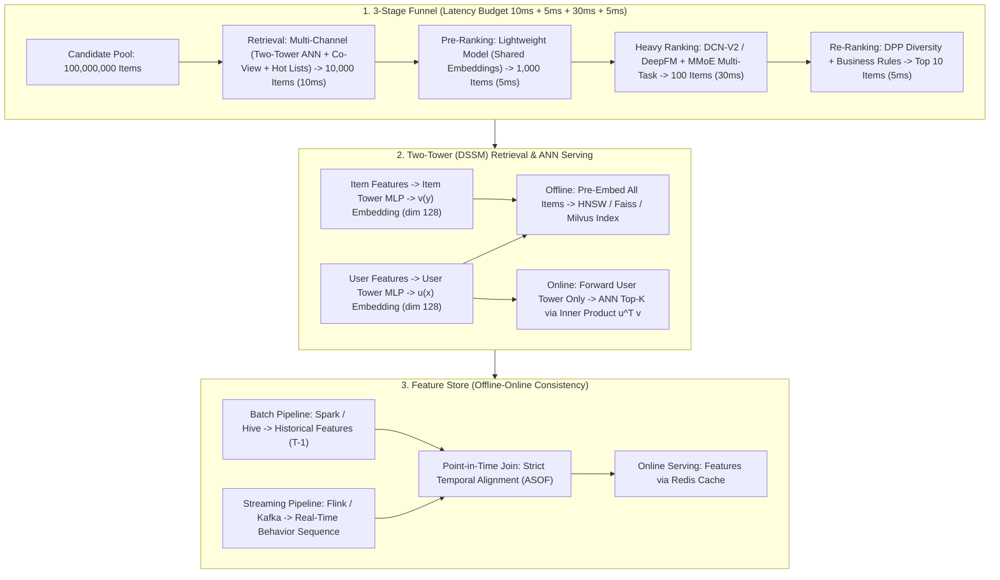

# 🌐 Industry Recommendation System Design: 3-Stage Pipeline, Two-Tower Models & Feature Store

> **Core Executive Summary**: No single model can score a hundred-million-item corpus within a ~50ms latency SLA. Production systems decompose inference into a **funnel — Retrieval → Pre-Ranking → Ranking → Re-Ranking** — trading model capacity for candidate volume at each stage. Retrieval runs on **DSSM Two-Tower** models with **ANN vector indexes (HNSW/IVF)**; ranking evolved from Wide&Deep to **DeepFM, DCN-V2, and MMoE multi-task networks**; the pipeline rests on a **Feature Store** preventing **Point-in-Time leakage**. Offline quality is validated with **AUC/GAUC/NDCG**, online behavior with **A/B experiments**.

---

## 💡 Interactive Mermaid Architecture Flowchart



---

## 💡 Classic Interview Followups & Core Cheatsheet

* **Q1**: Explain the funnel architecture: how do candidate volumes, model capacity, and latency budgets interact?
  * *A1*: Scoring all $10^8$ items cannot fit a 50ms SLA, so production cascades four stages shrinking candidates 2-3 orders of magnitude each: Retrieval ($10^7 \to 10^4$, 10ms), Pre-Ranking ($10^4 \to 10^3$, 5ms), Heavy Ranking ($10^3 \to 10^2$, deep model, 30ms), Re-Ranking ($10^2 \to 10$, diversity + rules, 5ms). Each stage runs a model just heavy enough for its volume — latency is the *sum* of stage costs, and recall loss at the top is non-recoverable.

* **Q2**: In DSSM Two-Tower serving, why is only the user tower computed online while item embeddings are pre-computed into an ANN index?
  * *A2*: The two-tower score factorizes into independent towers joined by a top-level inner product $s(x,y) = \langle \psi_u(x), \psi_i(y) \rangle$. Item parameters are quasi-static, so all item embeddings are pre-computed offline into an ANN index (HNSW). Online, one cheap user-tower forward pass obtains $u(x)$, then the index returns Top-K by inner product in roughly $O(\log N)$ — within the 10ms budget. Only factorized-score models can be served this way.

* **Q3**: How do you guarantee offline/online feature consistency and avoid Point-in-Time leakage?
  * *A3*: Two halves. (1) *PIT leakage*: a feature containing post-label information lets the model memorize the answer — offline AUC inflates while online GAUC collapses. The Feature Store enforces an **ASOF join**: features are temporal key-values and training snapshots each value as of the label's event time. (2) *Offline-online skew*: log serving-time features into training (request-level logging) and dual-run diff online Redis against offline recomputation; > ~0.5% divergence triggers investigation.

* **Q4**: Why do CTR/CVR joint models prefer MMoE/PLE over Shared-Bottom, and how do they address Sample Selection Bias?
  * *A4*: Shared-Bottom forces one representation on all tasks, but CTR (exposure-dominated) conflicts with CVR (conversion-dominated, sparse). MMoE replaces it with K experts and per-task softmax gates $f_k(x) = \sum_i g_{k,i}(x) \cdot e_i(x)$; PLE adds task-specific experts. CVR also suffers *Sample Selection Bias* — conversions exist only in the clicked subspace; the fix is joint modeling of $\text{pCTCVR} = \text{pCTR} \cdot \text{pCVR}$ on the full exposure space (ESMM).

* **Q5**: Why is GAUC preferred over AUC, and how should offline metrics pair with online A/B testing?
  * *A5*: AUC pools pairs across all users — global discrimination, not personalization: boosting high-CTR items for everyone yields high AUC while ranking badly inside each user's feed. GAUC computes per-user AUC over that user's impressions and averages, weighted by impressions — directly measuring within-feed ranking. NDCG adds graded relevance with a logarithmic position discount. Since offline-online correlation is low, shipping is decided by A/B: guardrails first, novelty holdouts, sequential monitoring, gradual ramping.

---

## 📚 Section 1: The 3-Stage Funnel: Retrieval → Pre-Ranking → Ranking → Re-Ranking

### 1.1 Why a Funnel?

Scoring $10^8$ items under a 50ms SLA is impossible: even a 1ms-per-item model costs $10^5$ seconds per request. The funnel caps per-stage volume so total compute is the *sum* of stage costs:

$$T_{\text{total}} = N_1 \cdot c_{\text{retrieve}} + N_2 \cdot c_{\text{pre-rank}} + N_3 \cdot c_{\text{rank}} + N_4 \cdot c_{\text{re-rank}}$$

with $N_1 = 10^7, N_2 = 10^4, N_3 = 10^3, N_4 = 10^2$: each stage can afford a ~1000x heavier model.

> 💡 **Intuition**: The funnel trades *candidate volume* for *model capacity*. Scoring all $10^8$ items with a full ranker — even 1ms each — takes $10^5$ seconds; but spending 10ms to cheaply filter to 1,000, then 30ms of deep ranking, costs only tens of milliseconds in total. Like sports tryouts: cheap preliminary judges for everyone, expensive final judges for the last 100.
>
> 🎤 **Interview Answer**: "Conclusion: recommendation systems need a retrieval → pre-rank → rank → re-rank funnel, otherwise 10^8 items × per-item scoring cost is impossible under a 50ms SLA. Why: each stage shrinks candidates 2–3 orders of magnitude, so total latency is the *sum* of stage costs, not the product of candidate counts. Example: retrieval 10ms (10^8 → 10^4), pre-rank 5ms (→ 10^3), rank 30ms on a deep model, re-rank 5ms → Top 10 — that fits 50ms; full scoring of 10^8 items would take 10^5 seconds."

| Stage | Items Out | Typical Model | Latency Budget | Optimization Goal |
| :--- | :--- | :--- | :--- | :--- |
| **Retrieval** | ~10,000 | Two-Tower + ANN (DSSM), co-view graph, hot lists | 10 ms | Recall: must not miss any potentially good item |
| **Pre-Ranking** | ~1,000 | Lightweight DNN, shared embeddings | 5 ms | Cheap precision filtering |
| **Heavy Ranking** | ~100 | DCN-V2 / DeepFM + MMoE multi-task | 30 ms | Precision: full features, accurate pCTR/pCVR |
| **Re-Ranking** | ~10 | DPP / MMR + business rules, ads insertion | 5 ms | List-wise utility: diversity, freshness, revenue |

> 💡 **How to read this table**: Watch the three columns together — "Items Out" shrinks 10× per stage while "Latency Budget" grows, and the "Optimization Goal" shifts from recall, to precision, to list-level experience. Classic interview contrast: retrieval and ranking optimize *different* objectives (Recall@K vs pCTR) — never measure one stage with the other's metric.
>
> 🎤 **Interview Answer**: "Conclusion: four stages — cast wide, filter fast, rank deep, tune the list. Why: the top needs Recall@K > 95% so no good item is lost; the bottom decides conversion and retention. Example: retrieval 10^8→10^4 (10ms), pre-rank →10^3 (5ms), rank →10^2 (30ms), re-rank →10 (5ms)."

### 1.2 Key Design Trade-offs

- **Recall at the top is non-recoverable**: retrieval targets Recall@K > 95%, accepting low precision that ranking recovers.
- **Multi-channel retrieval**: vector (DSSM), collaborative, social, and hot/trending channels merged with learned weights — one channel cannot cover fresh, long-tail, and exploration intents.
- **Pre-ranking exists for latency, not quality**: a feature subset with embeddings shared with the heavy ranker keeps ordering consistent.
- **Latency engineering**: the top touches $10^7$ items — stateless, vectorized, index-based; the bottom evaluates ~$10^2$ and can afford DPP.

> 💡 **Intuition**: Every stage is an explicit trade-off: retrieval would rather over-fetch (low precision is fine, ranking cleans it up); ranking can be slow because it scores only $10^3$ items. Pre-ranking is the "cost of latency" — it adds no information, its only job is to shrink the candidate pool to what the deep ranker can afford.
>
> 🎤 **Interview Answer**: "Conclusion: three funnel laws — top-stage recall loss is unrecoverable, multi-channel retrieval is mandatory, and only the bottom can afford expensive models. Why: items missed by retrieval can never be revived downstream, so retrieval optimizes recall not precision; one channel cannot cover new, long-tail, and exploration intents. Example: a two-tower ANN channel has almost no signal for a freshly launched item, so you must add a 'new/hot' channel or cold-start content never surfaces."

---

## 📚 Section 2: Two-Tower Retrieval (DSSM) & ANN Vector Search

### 2.1 Training: In-Batch Softmax with Negative Sampling

DSSM maps user features $x$ and item features $y$ into a shared embedding space with independent towers, scoring by inner product:

$$s(x, y) = \langle \psi_u(x), \psi_i(y) \rangle$$

Training is (sampled) softmax classification over the corpus — for user $i$ with positive item $v_i^+$:

$$L = -\log \frac{e^{s(x_i, v_i^+) / \tau}}{\sum_{j \in \mathcal{B}} e^{s(x_i, v_j) / \tau}}$$

The denominator reuses the mini-batch as negatives (in-batch negative sampling); temperature $\tau < 1$ sharpens the distribution. In-batch negatives are popularity-biased — corrected with a logit adjustment $\log q'(j)/q(j)$ or uniform negatives. This is the YouTube / Meta production recipe.

> 💡 **Intuition**: This loss treats retrieval as "find the right item among 100 million". Using other items in the batch as negatives is like having classmates be the losers: computing the softmax denominator over the full corpus is infeasible, but 256 batch items approximate it well. Temperature $\tau$ is a magnifier — smaller $\tau$ sharpens the distribution so the model works hard to separate the positive from the hardest negatives.
>
> 🎤 **Interview Answer**: "Conclusion: two-tower training is an in-batch softmax — the loss is the log-likelihood of the positive pair, negatives come from other items in the same batch. Why: full-corpus softmax denominators are infeasible at 10^8 items; in-batch negatives approximate, but they are popularity-biased and need a logit correction or uniform negatives mixed in. Example: batch 256 — the diagonal (user_i, item_i) is positive, the other 255 items are negatives, with τ = 0.05 the model learns to pull a user's vector close to items they engaged with."

### 2.2 Serving: Pre-Computed Index + ANN Search

At serving, the item tower runs offline over all items into a static embedding table served by an ANN engine:

| Index | Idea | Query Latency @10M items | Recall@100 vs Exhaustive |
| :--- | :--- | :--- | :--- |
| **Exhaustive** | Linear scan of all dim-128 vectors | 10-100 ms | 1.0 (gold standard) |
| **HNSW** | Hierarchical navigable small-world graph | <1 ms | ~0.95-0.99 |
| **IVF-PQ** | Inverted file clustering + product quantization | <1 ms | ~0.85-0.95 (compressed) |

HNSW gives sub-millisecond Top-K at 10M-100M scale (Faiss, Milvus); since only the user tower runs online, ANN searches *precomputed* vectors — a forward pass plus an index traversal fits the budget.

> 💡 **How to read this table**: Watch the recall column — HNSW loses only 1–5% recall versus exhaustive scan while dropping latency from 10–100ms to <1ms: a classic "tiny precision loss for 100× speed" swap. When asked why not brute force: reading 100M × 128-dim vectors is ~51GB of memory bandwidth per request — physically impossible in 10ms.
>
> 🎤 **Interview Answer**: "Conclusion: online we run only the user tower; item embeddings are precomputed offline into an HNSW index and served via ANN. Why: the score factorizes into $u(x)^\top v(y)$, and the item side changes slowly (hourly/daily), so offline pre-embedding works; online cost is one user-tower forward pass plus one index traversal. Example: 100M items × 128 dims — brute force reads ~51GB per request, HNSW visits a few hundred graph nodes and returns Top-100 in under 1ms."

### 2.3 Calibration: From Similarity to Probability

ANN returns scores, not calibrated probabilities. After negative down-sampling at rate $s$:

$$p' = \frac{p}{p + (1 - p) \cdot s}$$

so downstream stages can fuse calibrated probabilities across channels.

> 💡 **Intuition**: ANN returns similarity scores, not probabilities — during training, negatives were downsampled, so the positive density is artificially inflated. The formula re-inflates the denominator: like a raffle whose winner statistics only sampled some participants, you must restore the full population to get the true win rate.
>
> 🎤 **Interview Answer**: "Conclusion: retrieval-channel scores must be calibrated into probabilities before fusing across channels. Why: downsampling rate $s$ distorts the positive ratio; $p' = p / (p + (1-p)\cdot s)$ restores the true probability. Example: with downsampling $s$ = 0.01 and model output $p$ = 0.5, calibrated $p'$ = 0.5/(0.5+0.5×0.01) ≈ 0.99 — apparently inflated, but that *is* the true CTR once the 99% dropped negatives are counted back."

---

## 📚 Section 3: Ranking Model Evolution & Multi-Objective Optimization

### 3.1 Feature-Crossing Models: Wide&Deep → DeepFM → DCN-V2

Ranking quality is dominated by feature interactions (user × item × context):

| Model | Year | Interaction Mechanism | Strength | Limitation |
| :--- | :--- | :--- | :--- | :--- |
| **Wide&Deep** | 2016 | Manual crosses (wide) + MLP (deep) | Memorization + generalization | Manual feature engineering |
| **DeepFM** | 2017 | FM 2nd-order + deep MLP, shared embeddings | End-to-end, no manual crosses | Only 2nd-order explicit interactions |
| **DCN** | 2017 | Cross layers $x_{l+1} = x_0 \odot (W_l x_l + b_l) + x_l$ | Explicit high-order crosses | Parameter growth with depth |
| **DCN-V2** | 2020 | Low-rank $W_l \approx U_l V_l^T$ + MoE in cross layers | Expressive and scalable, $O(d \cdot r)$ cost | Architectural tuning required |

The DCN-V2 cross layer with low-rank factorization and MoE gating:

$$x_{l+1} = x_0 \odot \left( \sum_{i=1}^{K} g_i(x_l) \cdot E_i(x_l) \right) + x_l, \qquad W_l \approx U_l V_l^T$$

cuts per-layer cost from $O(d^2)$ to $O(d \cdot r)$, making high-order crosses affordable at web scale (Google reports gains over DCN on Criteo and production LTR).

> 💡 **How to read this table**: The evolution line is "stronger crossing with less manual work" — Wide&Deep needs hand-crafted crosses (the wide side), DeepFM makes FM do automatic 2nd-order crossing, and DCN-V2's low-rank $W \approx UV^\top$ makes *high-order* crossing affordable at web scale. The interview key: DCN-V2's contribution is dropping per-layer cost from $O(d^2)$ to $O(d \cdot r)$.
>
> 🎤 **Interview Answer**: "Conclusion: ranking model evolution is feature crossing going from manual to automatic and from low-order to high-order. Why: CTR's key information lives in user × item × context interactions; MLPs model high-order crosses of sparse features poorly, so explicit cross layers are needed. Example: 'programmer' × 'mechanical keyboard' — neither feature alone is significant, the cross is the strong signal; DeepFM captures 2nd-order, DCN-V2's cross layers learn these combinations automatically."

### 3.2 Multi-Task Ranking: MMoE & PLE

Feed ranking jointly optimizes pCTR, pCVR, watch time. A Shared-Bottom trunk suffers task conflict — CTR and CVR gradients fight over one representation. MMoE replaces the bottom with K experts and per-task softmax gates:

$$f_k(x) = \sum_{i=1}^{K} g_{k,i}(x) \cdot e_i(x), \qquad g_k(x) = \text{softmax}(W_k x), \qquad L = \sum_k \lambda_k L_k$$

*Sample Selection Bias* — CVR labels exist only in the clicked subspace — is removed by modeling $\text{pCTCVR} = \text{pCTR} \cdot \text{pCVR}$ on the full exposure space (ESMM); PLE adds task-specific expert groups. Serving blends them as $\text{score} = p^{\alpha}_{\text{CTR}} \cdot p^{\beta}_{\text{CTCVR}} \cdot \text{watch}^{\gamma}$ (exponents via A/B).

> 💡 **Intuition**: A Shared-Bottom trunk is two colleagues with conflicting goals sharing one desk — CTR's dense gradients drown CVR's sparse ones. MMoE gives each task an "expert committee" with its own softmax gate; ESMM fixes a different bug: training CVR only on clicked samples counts only "people who already walked in", systematically overestimating conversion.
>
> 🎤 **Interview Answer**: "Conclusion: CTR/CVR multi-task ranking uses MMoE/PLE experts, and ESMM models pCTCVR = pCTR × pCVR on the full exposure space to remove Sample Selection Bias. Why: shared representations let sparse CVR gradients get drowned; CVR labels exist only in the clicked subspace, so standalone training is distributionally skewed. Example: 100M exposures, 1M clicks, 10K conversions — training CVR on only 1M clicked samples never sees the other 99M, so online pCVR is systematically inflated and the auction overcharges advertisers."

---

## 📚 Section 4: Feature Store, Point-in-Time Leakage & Offline-Online Consistency

### 4.1 Batch vs Streaming Feature Pipelines

Three freshness tiers, orchestrated by the Feature Store:

1. **Batch (T-1 / hourly)** — Spark/Hive: profile, long-term CTR, category stats; warm-loaded into online Redis.
2. **Streaming (seconds)** — Flink/Kafka: real-time click/watch sequences, last-5-minute popularity, session context; Redis with TTL eviction.
3. **Request-time** — computed at serving: time-of-day, exposure context, candidate channel.

> 💡 **Intuition**: Feature freshness tiers are like grocery restocking — T-1 batch features (profiles, long-term CTR) are "daily restocked staples", second-level streaming features (last-5-min popularity) are "produce", and request-time features (hour of day) are "cooked to order". The Feature Store's job is to guarantee the exact same three tiers at training time and serving time.
>
> 🎤 **Interview Answer**: "Conclusion: features are organized in three tiers — T-1 batch, second-level streaming, request-time — orchestrated by the Feature Store. Why: freshness needs differ by ~5 orders of magnitude; everything on Flink is prohibitively expensive, everything batch is too stale. Example: gender is fine at T-1 granularity, but 'popularity in the last 5 minutes' must be second-level — it drives the hot-recall channel and would be outdated by the time a batch job finishes."

### 4.2 Point-in-Time Join: The Number-One Leakage Source

The classic bug: "day-T item CTR" joined at day T+1's aggregation while predicting day-T clicks — the feature peeks at the future. The Feature Store enforces **ASOF join**: each label is joined to the value *as of its event time*, never later. Verification:

1. **Dual-run diffing**: replay online logs against the offline warehouse; > ~0.5% mismatch signals skew.
2. **Leak tests**: train with shifted labels; offline AUC must not jump.
3. **Request-level feature logging**: log serving-time features into training so train/serve match.

PIT leakage symptom: offline AUC jumps while online GAUC flatlines.

> 💡 **Intuition**: Point-in-time leakage is like peeking at the answer key during an exam: if the model knows "day-T item CTR" while predicting day-T clicks, it is copying the answers — offline metrics soar to 0.9 and collapse on the real test. ASOF join enforces "only look at what existed before the label time"; dual-run diffing and leak tests are the proctoring.
>
> 🎤 **Interview Answer**: "Conclusion: training features must snapshot strictly at the label's event time (ASOF join), guarded by dual-run diffing, leak tests, and request-level feature logging. Why: any feature containing post-label information lets the model memorize the answer — offline inflates, online collapses. Example: predicting day-T clicks with 'day-T item CTR' but joining day-T+1 aggregates — offline AUC jumps from 0.75 to 0.9 while the online A/B shows no gain or worse; that is the classic PIT leakage signature."

---

## 📚 Section 5: Evaluation Metrics & Online A/B Testing

### 5.1 Offline: AUC, GAUC, NDCG

AUC measures $P(\text{score(pos)} > \text{score(neg)})$; GAUC restricts to within-user pairs weighted by impressions:

$$\text{GAUC} = \frac{\sum_u w_u \cdot \text{AUC}_u}{\sum_u w_u}, \qquad w_u = \#\text{impressions of user } u$$

NDCG handles graded relevance with a logarithmic position discount:

$$\text{DCG}_p = \sum_{i=1}^{p} \frac{2^{\text{rel}_i} - 1}{\log_2(i+1)}, \qquad \text{NDCG}_p = \frac{\text{DCG}_p}{\text{IDCG}_p}$$

| Metric | Question Answered | When It Misleads |
| :--- | :--- | :--- |
| **AUC** | Global discrimination power | High even when within-user ranking is poor |
| **GAUC** | Within-user ranking quality | Needs enough impressions per user |
| **NDCG** | Position-weighted graded relevance | Needs graded labels (ratings / dwell-time buckets) |

> 💡 **How to read this table**: Three metrics answer three different questions — AUC: "can it separate positive from negative globally?", GAUC: "does it rank well *inside each user's feed*?", NDCG: "how close to the ideal order?". Watch the "When It Misleads" column: AUC stays high even when within-user ranking is poor — the classic recommendation interview trap.
>
> 🎤 **Interview Answer**: "Conclusion: evaluate recommendations with GAUC/NDCG, never AUC alone. Why: AUC pools positive–negative pairs across all users, so a model that boosts hot items for everyone scores high AUC while ranking badly inside each user's feed; GAUC computes per-user AUC weighted by impressions, directly measuring within-feed ranking. Example: two models both at global AUC 0.80, but model A's within-user ranking is poor (GAUC 0.55) while model B reaches GAUC 0.65 — ship B even though their AUCs are identical."

### 5.2 Online: A/B Testing Essentials

- **Guardrails first**: latency, novelty drift, ecosystem metrics — a CTR win that destroys diversity or revenue fails.
- **Novelty effects**: a new model changes behavior; keep *permanent holdout* cohorts serving the old model.
- **Sequential testing**: mSPRT-style continuous monitoring with early stopping.
- **Ramping**: 1% → 5% → 25% → 50% → 100%, re-evaluating at each step; the A/B decides.

> 💡 **Intuition**: Offline–online correlation is often low (feedback loops, novelty effects, selection bias all intervene), so "the offline leaderboard shortlists; the A/B decides". Guardrails are side-effect monitoring — a model that lifts CTR but makes users churn must fail, just as a drug with good efficacy but bad toxicity is rejected.
>
> 🎤 **Interview Answer**: "Conclusion: shipping is decided by A/B — guardrails first, permanent holdout cohorts, sequential testing, then gradual ramping. Why: a new model changes user behavior (novelty effect) and feedback loops decouple offline from online; you cannot wait for a fixed sample size, so monitor continuously. Example: ramp 1% → 5% → 25% → 50% → 100%, re-evaluating at each step for CTR gain alongside latency and churn; use mSPRT-style sequential monitoring to scale up early on significance and roll back immediately on degradation."

---

## 🐍 Pure Numpy Implementation

```python
import numpy as np


def log_softmax(x: np.ndarray, axis: int = 1) -> np.ndarray:
    """Numerically stable log-softmax (subtract max before exp)."""
    x = x - np.max(x, axis=axis, keepdims=True)
    return x - np.log(np.sum(np.exp(x), axis=axis, keepdims=True))


def two_tower_inbatch_softmax_loss(
    user_emb: np.ndarray, item_emb: np.ndarray, temperature: float = 0.05
) -> float:
    """DSSM two-tower training loss: temperature-scaled in-batch softmax.

    user_emb: (B, D) - user tower outputs for the mini-batch
    item_emb: (B, D) - item tower outputs; items j != i act as negatives
    The diagonal (user_i, item_i) pairs are the true positive pairs.
    """
    logits = user_emb @ item_emb.T / temperature       # (B, B) similarity matrix
    labels = np.arange(user_emb.shape[0])              # positive index = diagonal
    log_probs = log_softmax(logits, axis=1)
    return -float(np.mean(log_probs[np.arange(len(labels)), labels]))


def ann_top_k(user_emb: np.ndarray, item_embs: np.ndarray, top_k: int = 10):
    """Online serving: brute-force ANN over precomputed item embeddings.

    Production replaces the linear scan with an HNSW / IVF-PQ index
    (Faiss, Milvus); the math is identical - inner-product top-K.
    """
    scores = item_embs @ user_emb                      # (N_items,)
    top_idx = np.argsort(scores)[::-1][:top_k]
    return top_idx, scores[top_idx]


def ndcg_at_k(relevance: np.ndarray, k: int = 5) -> float:
    """NDCG@k with graded relevance and logarithmic position discount."""
    rel = relevance[:k].astype(np.float64)
    dcg = np.sum((2.0 ** rel - 1.0) / np.log2(np.arange(2, len(rel) + 2)))
    ideal = np.sort(rel)[::-1]                         # best possible ordering
    idcg = np.sum((2.0 ** ideal - 1.0) / np.log2(np.arange(2, len(ideal) + 2)))
    return float(dcg / idcg) if idcg > 0 else 0.0


if __name__ == "__main__":
    np.random.seed(42)
    B, D = 32, 64                                      # batch 32 user/item pairs, dim 64
    user_emb = np.random.randn(B, D).astype(np.float32)
    item_emb = np.random.randn(B, D).astype(np.float32)

    loss = two_tower_inbatch_softmax_loss(user_emb, item_emb)
    print(f"Two-Tower in-batch softmax loss: {loss:.4f}")

    top_idx, top_scores = ann_top_k(user_emb[0], item_emb, top_k=5)
    print(f"Top-5 item IDs for user 0: {top_idx}, scores: {np.round(top_scores, 4)}")

    rel = np.array([3, 2, 1, 0, 2])                    # graded relevance of top-5
    print(f"NDCG@5 of the predicted list: {ndcg_at_k(rel):.4f}")
```

---

## 📝 Takeaways & Engineering Best Practices

1. **Always funnel**: stage so latency is the sum of stage costs; guarantee recall at the top, precision at the bottom.
2. **Two-tower for retrieval**: factorized scores $\langle \psi_u(x), \psi_i(y) \rangle$ allow pre-computed embeddings + ANN serving — why DSSM dominates.
3. **Fix sampling bias first**: logit correction in training, probability calibration at serving.
4. **Treat PIT leakage as a correctness bug**: ASOF joins, verbatim feature logging, continuous online-offline diffing.
5. **Evaluate where you optimize**: GAUC/NDCG for within-feed ranking; A/B with guardrails and ramping decides what ships.
