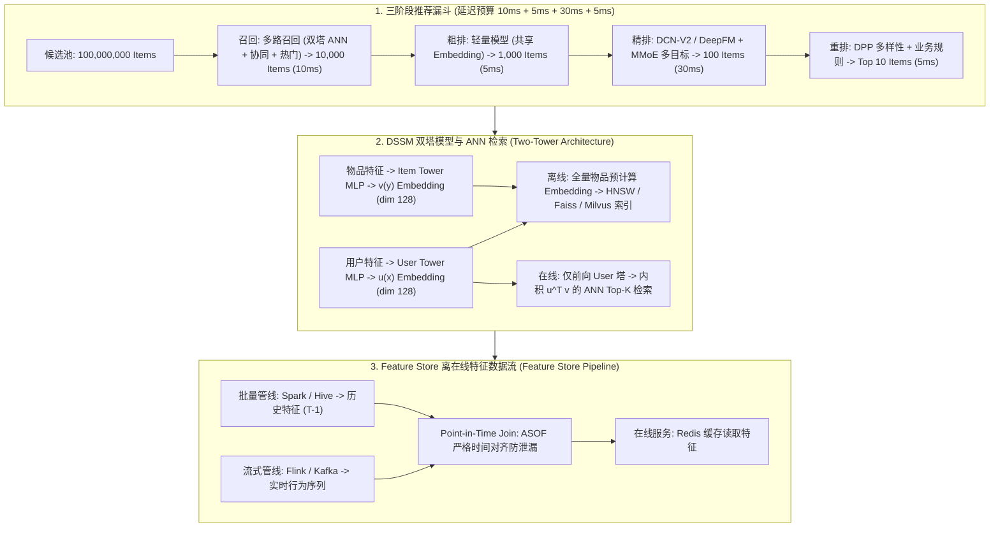

# 推荐系统工业级架构设计：召回-精排-重排三阶段、双塔模型与离在线一致性 Feature Store

> **核心摘要**：推荐系统是电商（淘宝/Amazon）、短视频（抖音/TikTok）以及信息流（小红书/Pinterest）的核心商业引擎。面对千万级 Item 与亿级 User，任何单一模型都无法在 **50ms 延迟 SLA** 内对全量候选打分，因此工业界采用**漏斗式多阶段架构：召回 (Retrieval) → 粗排 (Pre-Ranking) → 精排 (Heavy Ranking) → 重排 (Re-Ranking)**，每一阶段用模型容量换取候选规模；召回层由 **DSSM 双塔模型 + ANN 向量索引 (HNSW/IVF)** 主导，精排层经历了 Wide&Deep → **DeepFM → DCN-V2 → MMoE/PLE 多目标**的演进；全链路依赖 **Feature Store** 保证批流特征离在线一致性，防止 **Point-in-Time 特征穿越**；离线用 **AUC / GAUC / NDCG** 评估，在线用 **A/B 实验**决策。本指南以生产级数字与推导逐层拆解。

---

## 💡 交互式 Mermaid 架构流程图



---

## 💡 经典面试追问与考点速查

* **考点 1**：详细画出推荐系统的三阶段/四阶段漏斗架构，并说明各阶段的 QPS 与 Latency 预算？
  * *标准回答*：全量对 $10^8$ 个 Item 打分无法满足 50ms SLA，工业界将候选规模逐级压缩：**召回** ($10^7 \to 10^4$，10ms，以召回率 Recall@K>95% 为目标，多路并跑——双塔 ANN + 协同 + 社交 + 热门)、**粗排** ($10^4 \to 10^3$，5ms，轻量模型只做廉价精度过滤)、**精排** ($10^3 \to 10^2$，30ms，全特征深度模型，DCN-V2/MMoE 输出 pCTR/pCVR)、**重排** ($10^2 \to 10$，5ms，DPP 多样性 + 业务规则与广告插入)。总延迟是各阶段代价的**和**而非全量候选的**积**。关键点：漏斗顶部的召回损失不可逆——精排只能对召回结果重新排序，绝无可能"复活"被漏掉的 Item。
* **考点 2**：剖析 DSSM 双塔模型的训练与在线 Serving 机制？为什么在线只计算 User 塔？
  * *标准回答*：双塔将评分分解为独立塔结构、仅在最顶层通过内积 $\langle \psi_u(x), \psi_i(y) \rangle$ 交互。由于 Item 侧参数与特征近似静态（小时/天级更新），可以**离线把全量 Item 送入 Item 塔生成 Embedding**，写入 HNSW/IVF 向量索引；在线请求到来时只需执行一次廉价的 User 塔前向得到 $u(x)$，再到索引中做 ANN 检索（$O(\log N)$ 级别）取 Top-K。这种"离线预索引 + 在线单塔"的 Serving 模式**只有评分可因子化的模型才成立**——交叉注意力或 FM 类模型在线必须逐候选重算，无法支撑 10ms 召回预算。
* **考点 3**：如何保证 Feature Store 离在线特征一致性？如何解决 Point-in-Time 特征穿越？
  * *标准回答*：一致性分两半。(1) **PIT 泄漏**：若训练特征包含标签事件时刻之后的信息（如用"第 T 天 Item CTR"预测 T 天的点击），模型直接记忆答案，离线 AUC 虚高而在线 GAUC 崩塌。Feature Store 强制 **ASOF (Point-in-Time) Join**：每条特征都是 $(key, value, timestamp)$ 时间序键值，训练时严格快照"标签事件时刻"的特征值。(2) **离在线偏差**：必须在服务时把**请求级特征日志**原样回灌训练集，并对线上 Redis 值做与离线数仓的**双跑对账 (Dual-Run Diff)**，偏差率超过 0.1%~0.5% 即告警排查。
* **考点 4**：MMoE / PLE 如何解决多目标冲突与 CTR/CVR 样本选择偏差？
  * *标准回答*：Shared-Bottom 强制所有任务共享一个底座表征，而 CTR（曝光主导、正样本稠密）与 CVR（转化主导、正样本稀疏）梯度互相拉扯。MMoE 用 K 个 Expert 网络 + 每任务独立的 Softmax 门控 $f_k(x) = \sum_i g_{k,i}(x) \cdot e_i(x)$ 替代单底座；PLE 进一步为每任务划分专属 Expert 组。此外 CVR 存在**样本选择偏差 (SSB)**：转化只存在于点击子空间中，仅用点击样本训练 CVR 会学到扭曲分布；标准解法是在全曝光空间联合建模 $\text{pCTCVR} = \text{pCTR} \cdot \text{pCVR}$（ESMM），让两个塔在所有曝光样本上共同训练。
* **考点 5**：为什么 GAUC 比 AUC 更适合推荐评估？离线指标与在线 A/B 如何配合？
  * *标准回答*：AUC 把所有用户的正负样本对混在一起，度量的是**全局区分度**而非个性化——一个对所有用户都偏好高 CTR Item 的模型 AUC 可以很高，但在每个用户自己的信息流内排序糟糕。GAUC 按用户分组计算 AUC 再按曝光数加权平均，直接回答"在单个用户的信息流里，模型是否把用户点过的排在划过没点的前面"。NDCG 则引入分级相关性与对数位置折扣，匹配头部暴露分布。由于离在线相关性往往很低（反馈回路、新异性效应、选择偏差），是否上线由 A/B 决定：先守守卫指标、用永久留出组控制新异性、序贯检验 (mSPRT) 连续监控、逐级放量——**永远不要只看离线榜单上线**。

---

## 📚 第一章：三阶段漏斗：召回 → 粗排 → 精排 → 重排

### 1.1 为什么需要漏斗：延迟核算

对 $10^8$ 个 Item 逐个打分在 50ms SLA 下不可能成立：即便模型每 Item 仅耗时 1ms，单请求也需要 $10^5$ 秒。漏斗通过逐级压缩候选量，使总耗时受控于各阶段代价的**和**：

$$T_{\text{total}} = N_1 \cdot c_{\text{召回}} + N_2 \cdot c_{\text{粗排}} + N_3 \cdot c_{\text{精排}} + N_4 \cdot c_{\text{重排}}$$

典型生产量级 $N_1 = 10^7, N_2 = 10^4, N_3 = 10^3, N_4 = 10^2$：候选每经过一级缩 2-3 个数量级，精排阶段就可以用比召回贵 1000 倍的模型而总延迟仍然达标。

> 💡 **直观理解**：漏斗的本质是用"候选规模"换"模型容量"。1 亿个 Item 每个都做完整精排，就算单个只要 1ms 也要 10 万秒；但先花 10ms 用便宜方法筛到 1000 个，再用 30ms 的贵模型精排，总耗时就是各阶段相加的几十毫秒。就像体育比赛先海选再决赛——海选评委便宜、决赛评委昂贵，但决赛只需要评最后 100 人。
>
> 🎤 **面试速答**："结论：推荐系统必须用召回→粗排→精排→重排漏斗，否则 1 亿 Item × 单条打分成本在 50ms SLA 内不可能。原理：每级把候选量压缩 2–3 个数量级，总延迟是各阶段代价之和，不是候选数之积。举个例子：召回 10ms 把 1 亿筛到 1 万，粗排 5ms 筛到 1000，精排 30ms 对 1000 个跑深度模型，重排 5ms 出 Top 10——正好 50ms；若对 1 亿个直接跑精排，单个 1ms 也要 10^5 秒。"

### 1.2 各阶段职责对比

| 阶段 | 输出量级 | 典型模型 | 延迟预算 | 优化目标 |
| :--- | :--- | :--- | :--- | :--- |
| **召回** | ~10,000 | 双塔 + ANN (DSSM)、协同图、热门榜 | 10 ms | 召回率：绝不漏掉潜在好 Item |
| **粗排** | ~1,000 | 轻量 DNN、与精排共享 Embedding | 5 ms | 廉价精度过滤 |
| **精排** | ~100 | DCN-V2 / DeepFM + MMoE 多目标 | 30 ms | 精度：全特征、pCTR/pCVR 精确 |
| **重排** | ~10 | DPP / MMR + 业务规则、广告插入 | 5 ms | 列表级效用：多样性、新鲜度、收入 |

> 💡 **怎么读这张表**：注意三列的对应关系——"输出量级"逐级缩 10 倍、"延迟预算"逐级升、"优化目标"从召回率切换到精度再切换到列表级体验。面试常考对比点：召回与精排的优化目标完全不同（Recall@K vs pCTR），不能用同一个指标衡量两个阶段；重排已经不关心单条是否最相关，而是整列表的多样性。
>
> 🎤 **面试速答**："结论：四阶段分别负责多取、快筛、精排、调体验。原理：顶部要 Recall@K>95% 不丢潜在好 Item，底部精度和列表级体验决定转化与留存。举个例子：召回 1 亿→1 万（10ms）、粗排 1 万→1000（5ms）、精排 1000→100（30ms）、重排 100→10（5ms）。"

### 1.3 关键设计权衡

- **顶部召回损失不可恢复**：召回漏掉的 Item 下游无法复活，故召回以 Recall@K > 95% 为目标、容忍低精度，精度由精排回收。
- **多路召回是标配**：向量 (DSSM)、协同 (Item2Item 共现)、社交 (关注者互动)、热门/趋势多路合并（权重可学习），单一通道无法覆盖新品、长尾、探索等全部意图模式。
- **粗排为延迟而生**：只用特征子集并与精排共享 Embedding（Meta 的 MIMO 两阶段蒸馏），保证粗排顺序与精排一致。
- **延迟工程**：漏斗顶部每请求 1 次但要扫 $10^7$ 个 Item，必须无状态、可向量化、索引化；漏斗底部只评 $10^2$ 个 Item，可以承担注意力、DPP 乃至生成式步骤。

> 💡 **直观理解**：每一级都是 trade-off 的显式化：召回宁可多取（容忍低精度，反正后面会筛掉），精排宁可慢（只评 $10^3$ 个，贵 1000 倍也扛得住）。粗排是"延迟的代价"——它不增加任何信息，唯一职责是把候选量减到精排可承受的范围。
>
> 🎤 **面试速答**："结论：漏斗三条铁律是顶部召回不可恢复、多路召回是标配、底部才能用贵模型。原理：召回漏掉的 Item 下游无法复活，所以召回求全不求准；单路召回覆盖不了新品、长尾和探索意图。举个例子：双塔 ANN 召回对刚上架的新品没有行为数据、几乎必然失效，所以必须并一路'新品/热门'召回兜底，否则冷启动内容永远出不来。"

---

## 📚 第二章：DSSM 双塔召回与 ANN 向量检索

### 2.1 双塔训练：In-Batch Softmax 与负采样

双塔模型用独立塔结构把用户特征 $x$ 与物品特征 $y$ 映射到共享嵌入空间，以点积打分：

$$s(x, y) = \langle \psi_u(x), \psi_i(y) \rangle$$

训练把召回建模为（采样式）Softmax 分类：对正样本 $v_i^+$，最小化温度缩放的负对数似然：

$$L = -\log \frac{e^{s(x_i, v_i^+) / \tau}}{\sum_{j \in \mathcal{B}} e^{s(x_i, v_j) / \tau}}$$

分母以 mini-batch 内其他 Item 作为负样本（**in-batch 负采样**），温度 $\tau < 1$ 使分布更尖锐。注意 in-batch 负样本按流行度成比例出现，会产生对热门 Item 的系统性偏置——标准修正是在训练中对 logit 加上采样概率校正 $\log \frac{q'(j)}{q(j)}$，或混入均匀负样本。这正是 YouTube 候选生成与 Meta 广告召回的生产配方。

> 💡 **直观理解**：这个损失就是把召回当成"从 1 亿 Item 里找出正确那个"的分类题。分母用 batch 内其他 Item 当负样本，等于"全班同学当陪跑"：全量 softmax 分母要扫 1 亿个 Item，算不起；batch 里 256 个就够近似了。温度 $\tau$ 是"放大镜"：$\tau$ 越小分布越尖锐，模型越专注把正样本和最难分的负样本拉开。
>
> 🎤 **面试速答**："结论：双塔用 in-batch softmax 训练，损失是正样本的对数似然，负样本来自同 batch 其他 Item。原理：全量 softmax 分母要扫 1 亿 Item，用 batch 内负采样近似；但热门 Item 被采到的概率高，造成流行度偏差，需 logit 校正或混入均匀负样本。举个例子：batch=256 时，对角线 (user_i, item_i) 是正样本，其余 255 个当负样本，配合 $\tau$=0.05 训练，模型学会把用户和它点过的 Item 的向量拉近。"

### 2.2 在线 Serving：离线预索引 + ANN

| 索引方案 | 原理 | 千万级查询延迟 | Recall@100 (相对暴力扫描) |
| :--- | :--- | :--- | :--- |
| **暴力扫描** | 线性扫描全部 dim-128 向量 | 10-100 ms | 1.0（金标准） |
| **HNSW** | 分层可导航小世界图，贪心下降 | <1 ms | ~0.95-0.99 |
| **IVF-PQ** | 倒排文件聚类 + 乘积量化压缩 | <1 ms | ~0.85-0.95（压缩码） |

HNSW 在 1000 万-1 亿规模下可做到亚毫秒 Top-K 检索（Faiss、Milvus、Elasticsearch 默认方案）。正确性关键在于：在线只跑 User 塔，ANN 检索的是**预计算好的静态向量**——在线代价 = 一次 User 塔前向 + 一次索引遍历，这正是 10ms 召回预算能成立的唯一原因。

> 💡 **怎么读这张表**：关键看"召回率"列——HNSW 相对暴力扫描只损失 1–5% 召回，但延迟从 10–100ms 降到 <1ms，这就是"用一点精度换 100 倍速度"的经典交换。面试常问为什么不用暴力扫描：1 亿个 128 维向量一次请求要读完约 51GB 内存带宽，10ms 内物理上读不完。
>
> 🎤 **面试速答**："结论：双塔在线只跑 User 塔，Item 向量离线预计算好放进 HNSW 索引，在线做 ANN 检索。原理：评分可分解为 $u(x)^\top v(y)$，Item 侧变化慢（小时/天级），所以离线把全量 Item 嵌入算好；在线一次 User 塔前向 + 一次索引查找，10ms 预算才成立。举个例子：1 亿 Item × 128 维，暴力扫描一次请求要读 51GB 数据，HNSW 只访问几百个图节点就返回 Top-100，延迟从 100ms 级别降到 1ms 以下。"

### 2.3 概率校准：从相似度到概率

ANN 输出的是相似度分数而非校准概率。负样本下采样率为 $s$ 时，用下式把 logits 校准为 pCTR：

$$p' = \frac{p}{p + (1 - p) \cdot s}$$

保证下游拍卖、排序阶段可以对不同召回通道的校准概率做加权融合。

> 💡 **直观理解**：ANN 输出的相似度是"相对分数"不是概率——召回训练时负样本被下采样，正样本密度被人为放大，分数整体虚高。这个公式就是把被抽稀的人群"还原"回去：像抽奖中奖率统计只抽样了部分参与者，要把分母补回来才是真实中奖率。
>
> 🎤 **面试速答**："结论：召回通道的分数必须校准成概率，才能和别的通道融合排序。原理：负采样率 $s$ 扭曲了正样本比例，用 $p' = p / (p + (1-p)\cdot s)$ 还原真实概率。举个例子：下采样率 $s$=0.01 时模型输出 $p$=0.5，校准后 $p'$ = 0.5/(0.5+0.5×0.01) ≈ 0.99——分数看似虚高，但这就是把被抽掉的 99% 负样本加回去后的真实点击率。"

---

## 📚 第三章：排序模型演进与多目标优化

### 3.1 特征交叉模型：Wide&Deep → DeepFM → DCN-V2

排序质量由特征交叉（用户 × 物品 × 上下文）主导，模型演进如下：

| 模型 | 年份 | 交叉机制 | 优势 | 局限 |
| :--- | :--- | :--- | :--- | :--- |
| **Wide&Deep** | 2016 | 手工交叉 (wide) + MLP (deep) | 记忆 + 泛化 | 手工特征工程 |
| **DeepFM** | 2017 | FM 二阶交叉 + deep MLP，共享 Embedding | 端到端，免手工交叉 | 仅显式二阶交叉 |
| **DCN** | 2017 | Cross 层 $x_{l+1} = x_0 \odot (W_l x_l + b_l) + x_l$ | 显式高阶交叉 | 随深度参数爆炸 |
| **DCN-V2** | 2020 | 低秩 $W_l \approx U_l V_l^T$ + Cross 层内 MoE | 表达力 + 可扩展，$O(d \cdot r)$ 代价 | 需要结构调参 |

DCN-V2 的低秩分解 + Mixture-of-Experts 交叉层：

$$x_{l+1} = x_0 \odot \left( \sum_{i=1}^{K} g_i(x_l) \cdot E_i(x_l) \right) + x_l, \qquad W_l \approx U_l V_l^T$$

每层代价从 $O(d^2)$ 降到 $O(d \cdot r)$（$r \ll d$），使高阶交叉在 Web 规模可负担——Google 在 Criteo/MovieLens 与生产 LTR 系统中均报告了对 DCN 的显著离在线增益。

> 💡 **怎么读这张表**：演进主线是"交叉能力越来越强、人工介入越来越少"——Wide&Deep 靠人肉交叉（wide 侧），DeepFM 让 FM 自动做二阶交叉，到 DCN-V2 用低秩分解 $W \approx UV^\top$ 让高阶交叉在 Web 规模跑得起。面试对比点：DCN-V2 的核心贡献是把每层代价从 $O(d^2)$ 降到 $O(d\cdot r)$。
>
> 🎤 **面试速答**："结论：排序模型演进的本质是特征交叉从手工走向自动、从二阶走向高阶。原理：CTR 的关键信息藏在'用户×物品×上下文'交叉里，MLP 对稀疏离散特征的高阶交叉建模弱，Cross 层显式建模、低秩分解降开销。举个例子：'程序员'×'机械键盘'的单特征都不显著，交叉才是强信号——DeepFM 抓二阶、DCN-V2 的 Cross 层自动学出这类高阶组合。"

### 3.2 多目标精排：MMoE 与 PLE

信息流精排需联合优化 pCTR、pCVR、观看时长、点赞等多个目标。Shared-Bottom 的瓶颈是**任务冲突**：CTR 与 CVR 的梯度在单一底座表征上互相拉扯。MMoE 用 K 个 Expert 网络 + 每任务 Softmax 门控：

$$f_k(x) = \sum_{i=1}^{K} g_{k,i}(x) \cdot e_i(x), \qquad g_k(x) = \text{softmax}(W_k x), \qquad L = \sum_k \lambda_k L_k$$

**样本选择偏差 (SSB)**：CVR 标签只存在于点击子空间，因此要在全曝光空间建模 $\text{pCTCVR} = \text{pCTR} \cdot \text{pCVR}$（ESMM）消除偏差；PLE 进一步为每个任务划分专属 Expert 组。服务阶段按业务权重融合各任务概率，如 $\text{score} = p^{\alpha}_{\text{CTR}} \cdot p^{\beta}_{\text{CTCVR}} \cdot \text{watch}^{\gamma}$，指数通过 A/B 调参。

> 💡 **直观理解**：Shared-Bottom 让 CTR 和 CVR 共用一张底座，就像两个目标冲突的同事抢一张办公桌——CTR 样本稠密、梯度凶猛，CVR 样本稀疏、梯度弱小，后者被淹没。MMoE 给每个任务配一个"专家委员会"，各自用门控（softmax）从委员会里挑自己偏好的专家。ESMM 修的是另一个 bug：只用点击样本训练 CVR，等于只统计"已经进门的人"，会系统性高估转化率。
>
> 🎤 **面试速答**："结论：CTR/CVR 多目标用 MMoE/PLE 分专家，并用 ESMM 在全曝光空间联合建模 pCTCVR = pCTR×pCVR 消除样本选择偏差。原理：共享底座让稀疏 CVR 梯度被稠密 CTR 淹没；CVR 标签只存在于点击子空间，单独训练分布扭曲。举个例子：全量曝光 1 亿、点击 100 万、转化 1 万——只用 100 万点击样本训 CVR 的话，模型没见过 9900 万未点击曝光，上线后 pCVR 系统性偏高，按 eCPM 竞价会多扣广告主的钱。"

---

## 📚 第四章：Feature Store 离在线一致性

### 4.1 批流特征流水线

特征按新鲜度分为三层，全部由 Feature Store 编排：

1. **批量 (T-1 / 小时级)** — Spark/Hive：用户画像、长期 CTR、物品类目统计。写入离线存储并热加载进线上 Redis。
2. **流式 (秒级)** — Flink/Kafka：实时点击/观看序列、最近 5 分钟物品热度、会话上下文。Redis 带 TTL 更新。
3. **请求时** — 服务端即时计算：时段、曝光上下文、候选通道。

> 💡 **直观理解**：特征按新鲜度分层就像超市补货——T-1 批量特征（用户画像、长期 CTR）是"按天进货的常规商品"，秒级流式特征（最近 5 分钟热度）是"生鲜"，请求时特征（当前时段）是"当场现做"。Feature Store 的职责就是保证这三类货在训练时和线上是同一批，谁也不能偷换。
>
> 🎤 **面试速答**："结论：特征按 T-1 批量、秒级流式、请求时三层组织，由 Feature Store 统一编排。原理：不同特征的新鲜度需求差 5 个数量级，全走 Flink 实时算成本爆炸，全走批量又太旧，必须分层。举个例子：用户性别用 T-1 批量就够，但'最近 5 分钟某物品热度'必须秒级——它直接决定热门召回通道的时效性，等小时级批处理结果出来，热度早就过气了。"

### 4.2 Point-in-Time Join：最大的泄漏源

经典 Bug：用"第 T 天 Item CTR"预测 T 天的点击，却连接了 T+1 聚合结果——特征偷看了未来。Feature Store 强制 **ASOF Join**：每条特征都是带时间戳的时序键值，训练时严格取"标签事件时刻"的特征快照。生产验证手段：

1. **双跑对账 (Dual-Run Diff)**：把在线特征日志回放离线数仓逐值比对，偏差率 > 0.1%~0.5% 即告警。
2. **泄漏测试**：刻意把标签时间错位，断言离线 AUC 不应剧烈跳升。
3. **请求级特征日志**：把服务时真实使用的特征原样写入训练集，保证训练/服务同分布。

PIT 泄漏的典型症状正是离在线落差：离线 AUC 大幅提升，而在线 GAUC 原地踏步甚至恶化。

> 💡 **直观理解**：特征穿越就像考试偷看答案：模型如果知道"第 T 天的点击率"再预测第 T 天点不点，等于直接抄答案——离线指标飙到 0.9，真考场上立刻现形。ASOF Join 强制"考试只看当前时刻之前的内容"，双跑对账和泄漏测试就是考前的监考手段。
>
> 🎤 **面试速答**："结论：训练特征必须用标签时刻的严格快照（ASOF Join），并配双跑对账、泄漏测试、请求级特征日志三层防护。原理：只要特征含标签事件之后的信息，模型就记忆答案，离线虚高、在线崩盘。举个例子：用'第 T 天 Item CTR'预测 T 天点击，却 join 了 T+1 的聚合结果——离线 AUC 从 0.75 跳到 0.9，线上 A/B 毫无提升甚至下降，这就是 PIT 泄漏的典型症状。"

---

## 📚 第五章：评估指标与在线 A/B 实验

### 5.1 离线：AUC / GAUC / NDCG

AUC 度量 $P(\text{正样本分数} > \text{负样本分数})$；GAUC 限制在单用户内部并按曝光加权：

$$\text{GAUC} = \frac{\sum_u w_u \cdot \text{AUC}_u}{\sum_u w_u}, \qquad w_u = \text{用户 } u \text{ 的曝光数}$$

NDCG 处理分级相关性并对位置做对数折扣：

$$\text{DCG}_p = \sum_{i=1}^{p} \frac{2^{\text{rel}_i} - 1}{\log_2(i+1)}, \qquad \text{NDCG}_p = \frac{\text{DCG}_p}{\text{IDCG}_p}$$

| 指标 | 回答的问题 | 何时会误导 |
| :--- | :--- | :--- |
| **AUC** | 全局区分能力 | 用户内排序差时依然很高 |
| **GAUC** | 用户内排序质量 | 需要每用户足够曝光 |
| **NDCG** | 位置加权的分级相关性 | 需要分级标签（评分/时长分桶） |

> 💡 **怎么读这张表**：三个指标回答三个不同的问题——AUC 问"全局能不能分开正负样本"，GAUC 问"每个用户自己的信息流里排得怎么样"，NDCG 问"排得离理想有多近"。注意"何时会误导"列：AUC 在用户内排序很差时依然虚高，这正是推荐面试最经典的坑——用 AUC 评估个性化。
>
> 🎤 **面试速答**："结论：评估推荐要用 GAUC/NDCG，不能只看 AUC。原理：AUC 把所有用户的正负样本对混在一起，一个'对所有人都推热门'的模型 AUC 很高，但每个用户信息流内排序很差；GAUC 按用户分组算 AUC 再按曝光加权，直接度量用户内排序。举个例子：两个模型全局 AUC 都是 0.80，但模型 A 用户内排序差、GAUC 只有 0.55，模型 B 的 GAUC 是 0.65——上线应该选 B，尽管它俩 AUC 一样。"

### 5.2 在线：A/B 实验要点

- **先守守卫指标**：延迟、新颖度/流行度漂移、生态指标（商家收入、创作者留存）——提升 CTR 却摧毁多样性与收入的实验必须失败。
- **新异性/首因效应**：新模型本身会改变用户行为；设置**永久留出组**（持续对老模型放量）同时观察曝光与互动。
- **序贯检验**：用 mSPRT 类连续监控 + 提前终止，不必等固定样本量——这是 TikTok/Meta 高速迭代的做法。
- **逐级放量**：1% → 5% → 25% → 50% → 100%，每步复评。离在线相关度往往很低，**决策权在 A/B，离线榜单只负责海选**。

> 💡 **直观理解**：离线指标和在线效果的相关性往往很低（反馈回路、新异性效应、选择偏差都在中间作梗），所以"离线榜单只负责海选，A/B 定生死"。守卫指标是"副作用监测"——一个提升 CTR 却让用户卸载的模型必须判负，就像药效再好也不能接受毒性。
>
> 🎤 **面试速答**："结论：上线决策靠 A/B，流程是守卫指标 → 永久留出组 → 序贯检验 → 逐级放量。原理：新模型会改变用户行为产生新异性效应，反馈回路让离在线脱节；决策不能等固定样本量，要连续监控。举个例子：1%→5%→25%→50%→100% 逐级放量，每步复评 CTR 提升是否伴随延迟、卸载率上升；用 mSPRT 连续监控，显著就提前放量、恶化立即回滚。"

---

## 🐍 Pure Numpy 实现

```python
import numpy as np


def log_softmax(x: np.ndarray, axis: int = 1) -> np.ndarray:
    """数值稳定的 log-softmax（先减去最大值再求 exp）。"""
    x = x - np.max(x, axis=axis, keepdims=True)
    return x - np.log(np.sum(np.exp(x), axis=axis, keepdims=True))


def two_tower_inbatch_softmax_loss(
    user_emb: np.ndarray, item_emb: np.ndarray, temperature: float = 0.05
) -> float:
    """DSSM 双塔训练损失：温度缩放 in-batch Softmax。

    user_emb: (B, D) - 用户塔输出
    item_emb: (B, D) - 物品塔输出，j != i 的样本作为批内负样本
    对角线 (user_i, item_i) 即正样本对。
    """
    logits = user_emb @ item_emb.T / temperature       # (B, B) 相似度矩阵
    labels = np.arange(user_emb.shape[0])              # 正样本索引 = 对角线
    log_probs = log_softmax(logits, axis=1)
    return -float(np.mean(log_probs[np.arange(len(labels)), labels]))


def ann_top_k(user_emb: np.ndarray, item_embs: np.ndarray, top_k: int = 10):
    """在线 Serving：对预计算物品 Embedding 做暴力 ANN 检索。

    生产环境会用 HNSW / IVF-PQ 索引（Faiss、Milvus）替代线性扫描，
    数学本质相同：内积 Top-K。
    """
    scores = item_embs @ user_emb                      # (N_items,)
    top_idx = np.argsort(scores)[::-1][:top_k]
    return top_idx, scores[top_idx]


def ndcg_at_k(relevance: np.ndarray, k: int = 5) -> float:
    """NDCG@k：分级相关性 + 对数位置折扣。"""
    rel = relevance[:k].astype(np.float64)
    dcg = np.sum((2.0 ** rel - 1.0) / np.log2(np.arange(2, len(rel) + 2)))
    ideal = np.sort(rel)[::-1]                         # 理想排序（相关性降序）
    idcg = np.sum((2.0 ** ideal - 1.0) / np.log2(np.arange(2, len(ideal) + 2)))
    return float(dcg / idcg) if idcg > 0 else 0.0


if __name__ == "__main__":
    np.random.seed(42)
    B, D = 32, 64                                      # 批大小 32，嵌入维度 64
    user_emb = np.random.randn(B, D).astype(np.float32)
    item_emb = np.random.randn(B, D).astype(np.float32)

    loss = two_tower_inbatch_softmax_loss(user_emb, item_emb)
    print(f"双塔 in-batch Softmax 损失: {loss:.4f}")

    top_idx, top_scores = ann_top_k(user_emb[0], item_emb, top_k=5)
    print(f"用户 0 的 Top-5 物品 ID: {top_idx}, 分数: {np.round(top_scores, 4)}")

    rel = np.array([3, 2, 1, 0, 2])                    # Top-5 的分级相关性
    print(f"预测列表的 NDCG@5: {ndcg_at_k(rel):.4f}")
```

---

## 📝 总结与学习路线

1. **架构必答**：画出召回-粗排-精排-重排漏斗，讲清每级候选量级、延迟预算与"顶部召回不可恢复"的权衡；重排阶段能答出 DPP/MMR 的多样性与业务规则融合。
2. **召回必答**：能推导双塔 in-batch Softmax 损失、讲清"离线预索引 + 在线只跑 User 塔"的 Serving 原理与 ANN (HNSW/IVF) 的 Recall-QPS 取舍，并指出负采样流行度偏差及其校准。
3. **精排必答**：能对比 Wide&Deep/DeepFM/DCN-V2 的交叉机制（写出 Cross 层公式与低秩分解），能讲清 MMoE/PLE 门控公式与 ESMM 对样本选择偏差的消除。
4. **特征必答**：能画出 Kafka + Flink 实时特征与 Hive/Spark 批量特征的 Feature Store 数据流，说出 ASOF Join、双跑对账、请求级特征日志三层防泄漏手段。
5. **评估必答**：会手算 GAUC 与 NDCG，能解释 AUC 的"全局区分度"盲区，并能说出守卫指标、永久留出组、序贯检验、逐级放量的 A/B 实验流程——离线榜单只海选，A/B 定生死。
