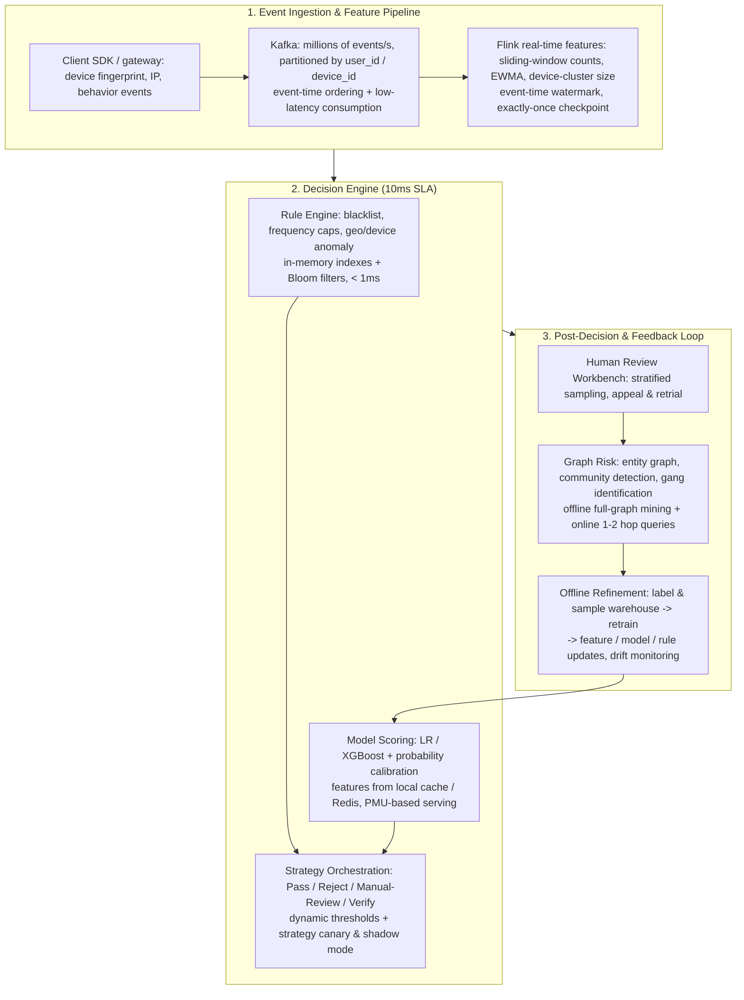

# 🌐 Real-time Risk Control & Fraud Detection System Design: Streaming & Graph Risk

> **Core Executive Summary**: A financial-grade risk control system must return a **Pass / Reject / Manual-Review** decision within a **10ms SLA** while scanning millions of events per second, on a distribution where fraud can be **0.1% or rarer**. This guide dissects the real-time pipeline — event ingestion, real-time features, rule engine, model scoring, strategy, and human review — then covers anomaly detection, imbalanced and cost-sensitive learning, risk metrics, adversarial fraud, graph-based collusion detection, and latency budgets with degradation.

---

## 💡 Interactive Mermaid Architecture Flowchart



---

## 💡 Classic Interview Followups & Core Cheatsheet

* **Key Topic 1**: Walk through the real-time pipeline. Where exactly does the 10ms budget go?
  * *Standard Answer*: Roughly: network + gateway **1–2ms**, Kafka ingestion **~1ms**, Flink features **~2ms** (incrementally maintained, no batch scans), rules **<1ms** (in-memory indexes + Bloom filters), model **1–2ms** over cached features (a 500-feature linear model is sub-millisecond), strategy **<0.5ms** — total P99 < 10ms. Degradation is mandatory: on feature-cache miss, serve **stale features** flagged as degraded; on model timeout, fall back to **rule-only mode** and shadow-score offline.

* **Key Topic 2**: When do you use a rule engine versus an ML model, and how do you combine them?
  * *Standard Answer*: Rules are deterministic, auditable, and changeable in minutes — ideal for blacklists and frequency caps, but blind to zero-day patterns. ML generalizes and self-updates with labels, but needs calibration and drift monitoring. Production layers them: **hard rules block**, a **calibrated model scores**, and the **strategy layer fuses** both (reject when score > 0.9 or rule hit; manual review when 0.6–0.9), with thresholds tuned against business cost.

* **Key Topic 3**: Which metrics matter at a 1:10,000 fraud rate? How do you trade off false-kill rate against recall?
  * *Standard Answer*: Accuracy is meaningless (always-pass already scores 99.99%). Use **Recall** (fraud captured), **Precision**, **False-Kill Rate** $\text{FPR} = \frac{FP}{FP+TN}$ (good users hurt), **Coverage** (share of transactions actually decided), PR-AUC (over ROC-AUC under heavy imbalance), and MCC. The operating point follows a cost matrix: total cost = $C_{FN} \cdot FN + C_{FP} \cdot FP$, where $C_{FN}$ is fraud loss (e.g., ¥500/order) and $C_{FP}$ is the cost of killing a good user (refund + churn). Classic target: maximize recall subject to FPR ≤ 0.01%.

* **Key Topic 4**: How do you train a model when the fraud label rate is below 0.1%?
  * *Standard Answer*: Four levels: **data** — SMOTE/ADASYN oversampling, random undersampling, or balanced mini-batches; **loss** — class weights $w_c = N/n_c$, or **Focal Loss** $FL = -\alpha (1-p_t)^\gamma \log(p_t)$ to down-weight easy negatives; **model** — XGBoost `scale_pos_weight`, cost-sensitive ensembles; **evaluation** — stratified splits, PR-AUC and MCC instead of accuracy, plus **probability calibration** (Platt/isotonic) since scores drive thresholds.

* **Key Topic 5**: Fraudsters spoof fingerprints and rotate IPs. How do graph methods catch gangs?
  * *Standard Answer*: Single-event features are easily faked; gang behavior is structural. Build an **entity graph** — nodes: user, device, phone, IP, card; edges: co-login, device sharing, fund transfer, same registration batch — then run **community detection** (label propagation, Louvain) offline and **1–2 hop neighbor queries** online ("this device logged into 40 accounts today"), feeding a gang-risk feature into the model. Combine with **disguise detection** (root/emulator checks, device-consistency validation, IP-reputation tiers) so spoofed attributes are down-weighted.

---

## 📚 Section 1: The Real-Time Risk Decision Pipeline

### 1.1 Event Ingestion & Feature Engineering

Three feature families dominate risk models:

| Feature Family | Examples | Evasion Resistance |
| :--- | :--- | :--- |
| **Identity & Device** | fingerprint hash, root/emulator flag, UA entropy, IMEI | Medium — fingerprints are spoofable, cross-check consistency |
| **Network & Geo** | IP reputation tier, ASN, proxy/VPN flags, IP-rotation frequency | Medium — IP pools are cheap, combine with device |
| **Behavior & Temporal** | order frequency in 60s/1h/24h, IP-change velocity, amount distribution, refund rate | Low — behaviors are the hardest to fake at scale |

Temporal features are maintained incrementally in Flink with **event time** (watermarks), so sliding/session windows need no recomputation. Staleness and missing values are modeled explicitly: a stale IP feature is a different feature than a fresh one.

> 💡 **How to read this table**: Watch the "Evasion Resistance" column — it gets harder to fake from top to bottom: fingerprints can be spoofed and IP pools are cheap, but scaling up an entire fake behavioral distribution is nearly impossible. Interview takeaway: weight features by attack cost, trust behavior-temporal features the most, and note the closing line — staleness itself should be a modeled feature.
>
> 🎤 **Interview Answer**: "Conclusion: risk features are organized into three families — identity/device, network/geo, behavior/temporal — with increasing evasion resistance. Why: spoofing a fingerprint is cheap and IP pools are cheaper, but faking '200 orders a day at 3 AM' as a consistent behavioral distribution is nearly impossible. Example: one IP placing 300 orders in 24 hours, a low-entropy (emulator) fingerprint, script-like behavior — each is defensible alone; together it is almost certainly fraud."

### 1.2 The Layered Decision Engine

Five stages, each with bounded latency: **(1) event access** — SDK validates payload, extracts fingerprint, publishes to Kafka partitioned by user_id; **(2) rule engine** — deterministic in-memory checks: blacklists, frequency caps, velocity triggers, versioned and canary-deployed; **(3) model scoring** — calibrated fraud probability $p = \sigma(w^T x) = \frac{1}{1 + e^{-w^T x}}$ over cached features; **(4) strategy orchestration** — fuses rules and score into **Pass / Reject / Manual-Review / Enhanced-Verify**; **(5) human review** — review labels feed back as training labels, closing the loop.

> 💡 **Intuition**: The layered engine is designed for "controllable failure": every layer has bounded latency and a fallback. Rules are the floor (blacklists must block), the model is judgment (scores unknown risk), strategy is arbitration (fuses score and rules into the final decision), and human review is the last line (edge cases). Single-purpose layers can each be optimized, degraded, and audited independently.
>
> 🎤 **Interview Answer**: "Conclusion: the decision engine has five layers — event access → rules → model → strategy → human — each latency-bounded. Why: hard rules provide deterministic coverage, the model covers unknown patterns, and the strategy layer fuses both into Pass / Reject / Manual-Review / Enhanced-Verify. Example: a blacklist hit is rejected directly (rules), a score of 0.6–0.9 triggers SMS verification (strategy), above 0.9 is rejected outright — three layers, each doing one job, so no single layer failure breaks the system."

### 1.3 Latency Budgets & Degradation

| Stage | Budget | Failure Mode | Fallback |
| :--- | :--- | :--- | :--- |
| Network + gateway | 1–2 ms | timeout | retry, then degrade |
| Kafka ingestion | ~1 ms | backlog | read secondary topic |
| Flink features | ~2 ms | watermark gap | stale features + flag |
| Rule engine | < 1 ms | store miss | memory-sharded replica |
| Model scoring | 1–2 ms | cache miss | degraded stale-score mode |
| Strategy | < 0.5 ms | — | default to manual review |

The decision budget is $\sum_i T_i \le 10\text{ms}$ (P99); every stage is individually time-boxed so no single failure blows the SLA. In degraded mode, hard rules still block, everything else is shadow-scored and reconciled offline.

> 💡 **How to read this table**: Every row carries both a "Failure Mode" and a "Fallback" — the 10ms SLA is not an optimistic assumption; each stage pre-negotiates its failure plan. Interview point: graceful degradation is a first-class design goal, not a last resort — in degraded mode rules still block, the model shadow-scores, and offline reconciliation finds the gap.
>
> 🎤 **Interview Answer**: "Conclusion: the 10ms decision budget is allocated line by line (gateway 1–2ms, Kafka ~1ms, Flink ~2ms, rules <1ms, model 1–2ms, strategy <0.5ms), with per-stage time-boxing and graceful degradation. Why: stale flagged features on cache miss, rule-only fallback on model timeout — no single point of failure may break the SLA. Example: when the model service dies, requests go through pure rule mode (blacklist + frequency caps) and return in ~3ms, while offline shadow-scoring runs in parallel — the system never goes naked, it just plays in bad weather."

---

## 📚 Section 2: Rule Engine vs. Machine Learning Models

### 2.1 Systematic Comparison

| Dimension | Rule Engine | Machine Learning |
| :--- | :--- | :--- |
| Interpretability | Fully auditable, regulator-friendly | Needs SHAP / LIME |
| Change cycle | Minutes (config release) | Days (retrain, validate, rollout) |
| Generalization | Only what is written | Catches zero-day patterns |
| Maintenance | Combinatorial rule conflicts | Label quality + drift ownership |
| Latency | < 1ms, deterministic | 1–2ms, feature-serving dependent |
| Failure mode | Silent under-coverage | Over-rejection, score drift |

The question is never "which one" but "how to layer": rules catch the known cheaply and deterministically, the model scores the rest, the strategy layer arbitrates. Many teams **extract rules from model explanations** (top SHAP paths) to cover obvious cases at zero latency, and use models to **tune rule thresholds**.

> 💡 **How to read this table**: Watch the "Change cycle" and "Generalization" rows: rules deploy in minutes but only cover what is written; ML catches zero-day patterns but retraining takes days. The interview conclusion: it is never either/or — it is layering — rules for deterministic known risk, models for generalized unknown risk, with SHAP-extracted rules flowing back into the rule layer.
>
> 🎤 **Interview Answer**: "Conclusion: rules handle the known, models handle the unknown, the strategy layer arbitrates, and SHAP extracts rules to backfill the rule layer. Why: rules are explainable and auditable but cannot generalize; models generalize but need labels and calibration. Example: when a new scam appears, humans write rules in minutes, while the model needs ~10K labeled samples and days of retraining — so rules intercept today, the model takes over most of it in two weeks, and every new rule runs in shadow mode for a week before activation."

### 2.2 The Model Zoo

* **Logistic Regression** — fast, calibratable, interpretable; ideal when scores must be explainable to an auditor.
* **XGBoost / LightGBM** — SOTA on tabular risk features: handles missing values, interactions, and skewed labels via `scale_pos_weight`.
* **Sequence models** (LSTM/Transformer) — capture ordering patterns such as register-then-bind-then-order, typically offline or second-stage.
* **Graph models** (GNN / label propagation) — capture collusion signals no per-event feature sees.

> 💡 **Intuition**: Model selection is ordered by explainability need: LR when an auditor demands to know why an order was rejected; XGBoost for SOTA on tabular risk features with missing values and skewed labels; sequence models for behavioral ordering; graph models for gang structure. Complexity increases — don't start with the most expensive.
>
> 🎤 **Interview Answer**: "Conclusion: the workhorses are LR (explainable) and XGBoost (accurate), with sequence and graph models on demand. Why: risk scoring must face audit explanation, and LR weights are directly readable; XGBoost is the best tabular model. Example: an $8,000 order was declined and a regulator asks why — LR answers directly: 'amount feature +16 points, device freshness +30, total above threshold 0.8'; a GNN cannot explain itself, so for audit-facing scores LR is irreplaceable."

### 2.3 Probability Calibration

Tree scores are poorly calibrated: random-forest averaging biases predictions away from 0/1, and XGBoost scores are not probabilities. Since thresholds and strategy tiers live on $p(\text{fraud})$, calibration is not optional: apply **Platt scaling** or **isotonic regression** on a held-out set, validated with the **Brier score** $\frac{1}{N}\sum_i (f_i - y_i)^2$ and reliability diagrams. Uncalibrated scores cause silent under-rejection or a manual-review explosion.

> 💡 **Intuition**: Tree scores are not probabilities — XGBoost outputs can land anywhere in [-5, 5], but thresholds live on $p(\text{fraud})$, so calibration is mandatory. Platt scaling pushes scores through a sigmoid; isotonic regression buckets scores and counts empirical frequencies. Calibration failure has two faces: scores systematically low → silent under-rejection; systematically high → manual-review explosion.
>
> 🎤 **Interview Answer**: "Conclusion: tree-model scores must be calibrated into probabilities via Platt/isotonic regression, validated with the Brier score. Why: thresholds and strategy tiers are defined on p(fraud); uncalibrated scores are detached from true probability. Example: XGBoost outputs 3.2 and 0.4 — 3.2 is certainly riskier than 0.4, but 3.2 might correspond to a true probability of 0.03 rather than 0.8; without calibration the 0.7 threshold tier is meaningless — the cases that should be rejected slip through, or review volume explodes."

---

## 📚 Section 3: Anomaly Detection, Imbalanced Data & Risk Metrics

### 3.1 Unsupervised Anomaly Detection

Labels are scarce, so flag *unusual* behavior first:

* **Statistical** — z-score/IQR per key, or **EWMA/CUSUM** change detection: $z = \frac{x - \mu}{\sigma}$; the EWMA mean $\hat{\mu}_t = \beta x_t + (1-\beta)\hat{\mu}_{t-1}$ catches velocity jumps in one pass.
* **Isolation Forest** — random-feature splits; anomaly score $s(x, n) = 2^{-\frac{\mathbb{E}[h(x)]}{c(n)}}$, where $h(x)$ is the average path length to isolate $x$. Linear time, no distance metric; suits high-dimensional device/IP features.
* **LOF** — density-based: compares local reachability density with k-nearest neighbors, $\text{LOF}_k(p) = \frac{\sum_{o \in N_k(p)} \frac{lrd_k(o)}{lrd_k(p)}}{|N_k(p)|}$, flagging points in low-density regions — better for cluster-like fraud.

Anomaly scores enter the model as features and trigger "new-type fraud" alerts for the review workbench.

> 💡 **Intuition**: When labels are scarce, flag *unusual* behavior first: statistical methods (z-score/EWMA) catch per-feature velocity jumps — a user averaging 3 orders/day suddenly placing 50 in 10 minutes; isolation forest randomly splits high-dimensional features, isolating anomalies in few cuts (short path = more anomalous); LOF catches points in low-density regions — cluster-like gang fraud that isolation forest cannot chop apart.
>
> 🎤 **Interview Answer**: "Conclusion: pick the unsupervised tool by feature shape — statistics/EWMA for velocity jumps, isolation forest for high-dimensional outliers, LOF for cluster outliers. Why: fraud leaves traces in the statistical distribution without needing labels. Example: a user averaged 3 orders/day with std 1 over 30 days, then places 40 orders in 60 minutes — z = (40−3)/1 = 37, EWMA change detection fires within a second and sends it to manual review; meanwhile a flash-sale gang's cluster-like distribution is better caught by LOF."

### 3.2 Imbalanced & Cost-Sensitive Learning

At a 0.1% fraud rate a naive learner collapses to always-pass:

| Level | Techniques |
| :--- | :--- |
| Data | SMOTE/ADASYN oversampling, random undersampling, SMOTE + Tomek/ENN, stratified splits |
| Loss | Class weights $w_c = N/n_c$; **Focal Loss** $FL = -\alpha (1-p_t)^\gamma \log(p_t)$ |
| Model | XGBoost `scale_pos_weight`, cost-sensitive ensembles |
| Eval | PR-AUC, MCC, per-class Precision/Recall — never raw accuracy |

Cost-sensitive learning makes the objective risk-aware: minimize $\text{Cost} = C_{FN} \cdot FN + C_{FP} \cdot FP$, so the classifier directly trades killing a good user against missing a fraudster.

> 💡 **How to read this table**: The four rows are a ladder — data, loss, model, evaluation — and they stack. Interview comparison: SMOTE synthesizes samples that can be invalid in feature space; class weighting is the simplest and is equivalent to duplicating minority samples; Focal Loss specifically down-weights gradients of easily-classified negatives. All three answer the same question: stop the model from ignoring the 0.1% minority class.
>
> 🎤 **Interview Answer**: "Conclusion: SMOTE for data, class weighting for the loss, Focal Loss for hard-example focus, PR-AUC/MCC for evaluation. Why: at a 0.1% positive rate a naive learner collapses to always-pass, and false-kill ($C_{FP}$) and miss ($C_{FN}$) costs are asymmetric, so the objective must be risk-aware. Example: with 1M samples and only 1,000 fraud cases, class weighting sets the fraud loss weight to N/n_c ≈ 1,000; Focal Loss with γ=2 drives gradients of confidently-correct negatives toward zero, spending model effort on the samples that *look* fraudulent."

### 3.3 Risk Evaluation Metrics

| Metric | Formula | Role in Risk |
| :--- | :--- | :--- |
| Recall (capture) | $\frac{TP}{TP+FN}$ | Share of fraud blocked |
| Precision | $\frac{TP}{TP+FP}$ | Share of blocks that were real fraud |
| False-Kill Rate | $\frac{FP}{FP+TN}$ | Good users hurt per 100k |
| Coverage | $\frac{TP+FP}{N}$ | Share of transactions actually decided |
| MCC | $\frac{TP \cdot TN - FP \cdot FN}{\sqrt{(TP+FP)(TP+FN)(TN+FP)(TN+FN)}}$ | Balanced single-number summary |

The operating point is chosen on a **PR curve at fixed budget** — e.g., maximize recall subject to FPR ≤ 0.01% — because every false kill is a real refund and churn risk. Coverage guards the system guarantee that no transaction bypasses scoring (offline funnel + sampling audit).

> 💡 **How to read this table**: Focus on the False-Kill Rate row — 0.01% FPR means 1,000 good users hurt per 10M transactions, each one a refund plus churn risk. Interview conclusion: at a 1:10,000 fraud rate, accuracy is meaningless (always-pass scores 99.99%); choose the operating point on the PR curve under a cost matrix, and guard "coverage" — every transaction must be scored.
>
> 🎤 **Interview Answer**: "Conclusion: risk systems use Recall, False-Kill Rate (FPR), Coverage, PR-AUC and MCC, selecting the operating point via a cost matrix. Why: the costs of false-kill (good user) and miss (fraudster) are asymmetric — the objective is $C_{FN} \cdot FN + C_{FP} \cdot FP$, not accuracy. Example: a fraud order costs $500 and killing a good customer costs $200 (refund + churn); under the constraint FPR ≤ 0.01%, maximize recall — 10M transactions may hurt at most 1,000 good users, which is the false-kill budget the business accepts."

---

## 📚 Section 4: Adversarial Fraud & Graph-Based Collusion Detection

### 4.1 The Adversarial Game

Fraud is an arms race: attackers probe thresholds with cheap trial orders, rotate IP pools, and spoof fingerprints. Defense principles:

1. **Raise the attack cost** — escalate to SMS/facial verification precisely when signals conflict (fresh device + good reputation IP + large amount).
2. **Detect the disguise** — root/emulator checks, fingerprint entropy, device-consistency validation, IP-reputation tiers instead of bare IP features.
3. **Assume feature pollution** — down-weight attacker-controlled features; keep rule and model layers redundant so one compromised feature cannot zero the score.
4. **Monitor the adversarial signal** — a dropping fraud-close-rate per rule means attackers learned it.

> 💡 **Intuition**: Fraud is an arms race; the core principle is "raise the attacker's cost" — push them from 'change an IP and you're through' to 'you must rebuild your entire infrastructure'. Verification escalation fires exactly when signals conflict (fresh device + high-reputation IP + large amount), like a bank's second confirmation on large transfers. Monitoring a rule's close-rate decline is monitoring that attackers learned it — rules expire and must rotate.
>
> 🎤 **Interview Answer**: "Conclusion: four adversarial-defense principles — raise attack cost, detect the disguise, assume feature pollution, monitor the adversarial signal. Why: attackers probe thresholds, rotate IP pools, and spoof fingerprints; defense must make every bypass more expensive. Example: one device associating with 5 new accounts in 10 minutes triggers facial verification; when the 'late-night large order' rule's close rate drops from 3% to 0.5%, attackers have learned it — rotate the rule and wire its close-rate itself into alerting."

### 4.2 Graph-Based Collusion Detection

Gangs share devices, phones, IPs, and money flows — a structure no per-event feature sees. Build an **entity graph**: nodes are user, device, phone, IP, card, merchant; edges are co-login, device sharing, fund transfer, same registration batch. Then:

* **Community detection** (label propagation, Louvain) finds dense components offline; gang-size and gang-fraud-ratio features feed the online model.
* **Online 1–2 hop queries** ("how many accounts has this device logged into in 24h?") run sub-millisecond via adjacency lists + bitmap indexes, producing a **graph risk score**.
* **Graph embeddings** (Node2Vec/GNN) capture structural roles offline; **seed-and-expand** labels likely collaborators of known fraudsters.

Graph features are high precision — structure is hard to fake at scale — and are fused with event features, not a replacement: $\hat{p} = \sigma(w_{event}^T x_{event} + w_{graph} \cdot g)$.

> 💡 **Intuition**: Single-event features can be faked, but "gang relationships" are structural: 50 accounts sharing 3 devices and 2 phone numbers form a web that no single event feature can see. Graph risk is "look at the relationships, not the person": community detection finds the webs; 1–2 hop queries ask "who else has this device touched".
>
> 🎤 **Interview Answer**: "Conclusion: graph risk uses an entity graph with community detection and online 1–2 hop queries to catch gangs; graph features are fused with event features, not a replacement. Why: gangs share devices, phones, IPs, and money flows — faking the structure at scale requires splitting the whole infrastructure, which is expensive. Example: the query 'how many accounts did this device log into in 24h?' returns 1–2 for normal users and 40 for fraudster devices; that device-account-count feature is far harder to fake than any single event feature, and fused with event features it lifts precision while avoiding false kills."

### 4.3 Defense-in-Depth Summary

| Layer | Primary Weapon | Catch Rate | Evasion Cost to Attacker |
| :--- | :--- | :--- | :--- |
| Rules | Blacklist, frequency caps | Known patterns | Low — rotation bypasses |
| Model | Calibrated, cost-sensitive score | Zero-day per-event fraud | Medium — needs feature laundering |
| Graph | Community + 1–2 hop | Gang collusion | High — requires splitting infrastructure |
| Review | Workbench + labels | Edge cases | Consumes human budget |

> 💡 **How to read this table**: Watch the "Evasion Cost to Attacker" column, rising from rules (low) to graph (high) — every defense layer pushes the attacker's cost upward, while "Catch Rate" tells you what each layer catches. When asked to design risk control in an interview, unfolding this four-layer table is the complete answer structure.
>
> 🎤 **Interview Answer**: "Conclusion: defense-in-depth layers rules, models, graphs, and human review, with catch capability and evasion cost rising per layer. Why: a single line of defense gets breached; stacking layers forces attackers to bypass four systems simultaneously. Example: a flash-sale fraud gang — rules catch the high frequency (bypassable by rotating IPs), the model catches behavioral anomalies (needs feature laundering), the graph finds 30 accounts on one device (requires splitting infrastructure), and human review confirms (costs labor). Only passing all four counts as escaped."

---

## 🐍 Pure Numpy Implementation

A minimal but runnable engine: LR score + frequency rule + fused decision + confusion-matrix metrics, all in pure NumPy.

```python
import numpy as np


def sigmoid(z: np.ndarray) -> np.ndarray:
    return 1.0 / (1.0 + np.exp(-np.clip(z, -30, 30)))


class NumpyRiskEngine:
    """Demo: LR score + frequency rule + fused decision + confusion-matrix metrics."""

    def __init__(self, weights, intercept, model_threshold=0.80, freq_cap=10):
        self.w = np.asarray(weights, dtype=np.float64)
        self.b = float(intercept)
        self.model_threshold = model_threshold
        self.freq_cap = freq_cap
        self.log = []  # (score, rule_hit, true_label, decision)

    def decide(self, x, freq, rule_hit, true_label):
        p = float(sigmoid(self.w @ np.asarray(x, dtype=np.float64) + self.b))
        if rule_hit or freq > self.freq_cap or p >= self.model_threshold:
            decision = "REJECT"
        else:
            decision = "PASS"
        self.log.append((p, rule_hit, true_label, decision))
        return decision, p

    def metrics(self):
        pred = np.array([d == "REJECT" for *_, d in self.log])
        y = np.array([t for _, _, t, _ in self.log])
        tp = int(np.sum(pred & y)); fp = int(np.sum(pred & ~y))
        fn = int(np.sum(~pred & y)); tn = int(np.sum(~pred & ~y))
        n = len(y)
        return {
            "tp": tp, "fp": fp, "fn": fn, "tn": tn,
            "precision": tp / (tp + fp) if tp + fp else 0.0,
            "recall":    tp / (tp + fn) if tp + fn else 0.0,
            "false_kill_rate": fp / (fp + tn) if fp + tn else 0.0,
            "coverage":  (tp + fp) / n,
        }


if __name__ == "__main__":
    rng = np.random.default_rng(42)
    engine = NumpyRiskEngine(weights=[0.8, -1.2, 0.5], intercept=-0.1)
    for _ in range(100_000):
        is_fraud = rng.random() < 0.002            # 0.2% fraud rate
        x = [
            1.0 if is_fraud else 0.0,               # device-freshness signal
            rng.normal(0.0, 1.0),                   # behavioral score (noisy)
            rng.normal(0.0, 1.0),
        ]
        freq = rng.poisson(3 if is_fraud else 0.5)  # fraudsters burst
        rule_hit = is_fraud and rng.random() < 0.6  # blacklist hit
        engine.decide(x, freq, rule_hit, is_fraud)
    for k, v in engine.metrics().items():
        print(f"{k:>15s}: {v}")
```

Run it: at a 0.2% fraud rate the engine reports recall ~0.7 with a false-kill rate in the low teens — a concrete demonstration of the precision/recall trade-off.

---

## 📝 Takeaways & Engineering Best Practices

1. **Pipeline first, models second**: the 10ms decision is an architecture property — time-box every stage, degrade gracefully (stale features, rule-only mode), reconcile offline.
2. **Layer rules + models + strategy**: hard rules block, calibrated ML scores, strategy tiers tuned by a cost matrix.
3. **Design for the 0.1% class**: SMOTE/class weights/Focal Loss for training, PR-AUC + MCC + false-kill rate for evaluation, calibration for threshold decisions — never raw accuracy.
4. **Think in graphs**: entity graphs with community detection and 1–2 hop queries produce high-precision features attackers cannot easily fake.
5. **Treat fraud as an arms race**: monitor rule close rates, raise attack costs (verification escalation), down-weight spoofable features — retune in days, not quarters.
