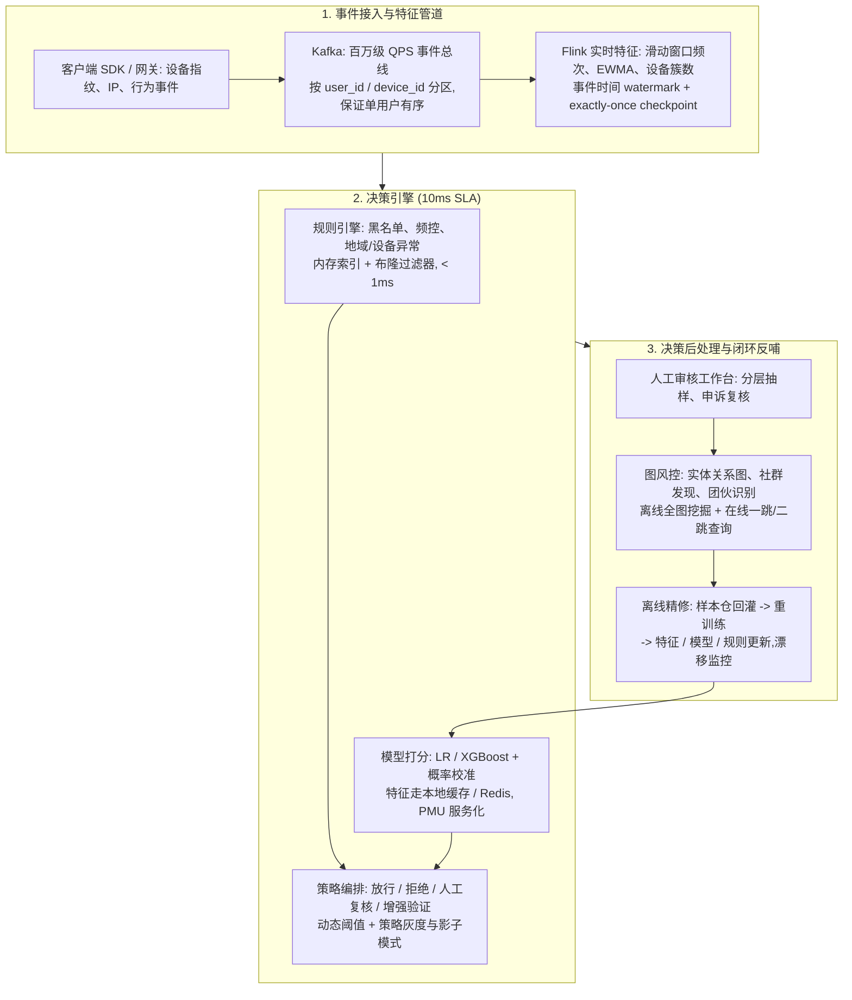

# 🌐 实时风控与欺诈检测系统架构：流批一体、图风控与实时特征工程

> **核心摘要**：金融级风控系统必须在 **10ms 决策 SLA** 内对每秒数百万级事件给出 **放行 / 拒绝 / 人工复核** 三种决策,而欺诈率往往低于 **0.1%**。本指南全量拆解实时风控链路——事件接入、实时特征工程、规则引擎、模型打分、策略决策与人工审核——并深入异常检测、样本不平衡与代价敏感学习、风控评估指标、反欺诈对抗、图风控团伙识别,以及延迟预算与优雅降级策略。

---

## 💡 交互式 Mermaid 架构流程图



---

## 💡 经典面试追问与考点速查

* **考点 1**：画出实时风控全链路,10ms 决策预算如何分配?
  * *标准回答*：预算大致为:网关接入 **1–2ms**,Kafka 入队 **约 1ms**,Flink 特征计算 **约 2ms**(增量维护,不做全量扫描),规则引擎 **< 1ms**(内存黑名单 + 布隆过滤器),模型打分 **1–2ms**(基于特征缓存的 LR/XGBoost,500 维线性模型亚毫秒级),策略编排 **< 0.5ms**,合计 P99 < 10ms。降级是必选项:特征缓存未命中时使用 **陈旧特征并打标**;模型超时则回退 **纯规则模式**,离线影子打分。
* **考点 2**：规则引擎与机器学习模型如何分工、如何组合?
  * *标准回答*：规则确定性、可审计、可解释、分钟级生效,适合黑名单、监管拦截与频控,但无法泛化到未知攻击;ML 能泛化、可随标注自动更新,但依赖样本质量、概率校准与漂移监控。线上采用**分层组合**:硬规则负责强制拦截,**校准模型产出风险分**,**策略层融合二者**(如分数 > 0.9 或命中规则直接拒绝,0.6–0.9 走人工复核),阈值随业务成本动态调整。
* **考点 3**：欺诈率 1/10000 下用什么指标?误杀率与召回如何权衡?
  * *标准回答*：准确率毫无意义(永远放行就有 99.99%)。应使用 **召回率**(欺诈拦截比例)、**精确率**、**误杀率** $\text{FPR} = \frac{FP}{FP+TN}$(被误伤的好用户)、**覆盖率**(被真正打分的交易占比)、PR-AUC(比 ROC-AUC 更适合极度不平衡)与 MCC。最终工作点由**代价矩阵**决定:总成本 = $C_{FN} \cdot FN + C_{FP} \cdot FP$,其中 $C_{FN}$ 是单笔欺诈损失,$C_{FP}$ 是误杀一个好用户的成本(退款 + 流失)。经典目标形如"在 FPR ≤ 0.01% 约束下最大化召回"。
* **考点 4**：欺诈标注率低于 0.1% 时如何训练?
  * *标准回答*：四个层面:**数据层**——SMOTE/ADASYN 合成过采样、随机欠采样或每批均衡采样;**损失层**——类别权重 $w_c = N/n_c$,或 **Focal Loss** $FL = -\alpha (1-p_t)^\gamma \log(p_t)$ 压低易分负样本权重;**模型层**——XGBoost `scale_pos_weight`、代价敏感集成;**评估层**——分层划分、PR-AUC 与 MCC 替代准确率,并对概率做**校准**(Platt/Isotonic),因为分数直接驱动阈值与策略。
* **考点 5**：黑产能伪装设备指纹、轮换 IP,图方法如何抓团伙?
  * *标准回答*：单事件特征易被伪造,而**团伙行为是结构性的**。构建**实体关系图**——节点:用户、设备、手机号、IP、银行卡;边:同设备登录、转账、同批次注册、同 IMEI。离线用**社群发现**(标签传播、Louvain)找连通团,在线做**一跳/二跳邻居查询**(如"该设备 24h 内登录过多少个账号"),产出"团伙风险"特征注入模型。同时叠加**特征伪装检测**(root/模拟器检测、设备一致性校验、IP 信誉分层),对被污染的特征降权而非信任。

---

## 📚 第一章：实时风控决策链路

### 1.1 事件接入与特征工程

每笔交易都会产生携带身份、设备、网络与行为字段的事件。风控模型的特征可归为三大族:

| 特征族 | 典型特征 | 抗伪装能力 |
| :--- | :--- | :--- |
| **身份与设备** | 设备指纹哈希、root/模拟器标志、UA 熵、IMEI、应用安装时长 | 中——黑产可刷指纹,需交叉一致性校验 |
| **网络与地理** | IP 信誉分级、ASN、城市/国家、RTT、IP 轮换频率、代理/VPN 标志 | 中——IP 池廉价,须与设备特征组合 |
| **行为与时序** | 60s/1h/24h 下单频次、IP 变更速度、会话时长、金额分布、历史退款率 | 低——规模化伪装行为成本最高 |

时序特征在 Flink 上用**事件时间**(watermark 机制)增量计算,以状态形式维护,滑动/会话窗口无需重算;特征**陈旧度与缺失**被显式建模——陈旧的 IP 特征与新鲜的特征是两回事。

> 💡 **怎么读这张表**: 看"抗伪装能力"列,从上到下越来越难伪造——设备指纹可以刷、IP 池很便宜,但"规模化伪装行为"成本最高。面试启示:特征设计要按攻击成本分配权重,行为时序特征最可靠,表下面的结论——"陈旧的 IP 特征与新鲜的特征是两回事"——是特征工程的关键细节,陈旧度本身就要做成特征。
>
> 🎤 **面试速答**: "结论:风控特征按身份设备、网络地理、行为时序三大族组织,抗伪装能力递增。原理:黑产刷指纹便宜、租 IP 池更便宜,但伪造'每天 200 单、凌晨 3 点高频下单'的整个行为分布几乎不可能。举个例子:一个 IP 24 小时内下 300 单、设备指纹熵极低(模拟器)、行为像脚本——单看每项都能辩解,组合起来必是黑产。"

### 1.2 分层决策引擎

决策引擎刻意分层,每层延迟有界且有兜底:

1. **事件接入**——SDK/网关校验报文、提取设备指纹、标记风险上下文,发布到 Kafka(按 user_id 分区保证单用户有序)。
2. **规则引擎**——内存索引下的确定性检查:用户/设备/IP/卡黑名单、频次上限、金额与地域异常、速度型触发。规则版本化、灰度发布、全程可审计。
3. **模型打分**——校准模型输出 $p(\text{欺诈})$,特征从特征仓库按 PMU 预算取用,缓存未命中降级为陈旧值。
4. **策略编排**——融合规则命中与模型分数,输出 **放行 / 拒绝 / 人工复核 / 增强验证**(边界样本走短信/人脸核验)。
5. **人工审核**——被拒或边界交易进入工作台,审核标签回流为训练样本,形成闭环。

> 💡 **直观理解**: 决策引擎分层是为了"可控的失败":每层延迟有界、每层有兜底。规则层是"底线"(黑名单必须拦住),模型层是"判断力"(未知风险打分),策略层是"仲裁"(分数+规则融合出最终决策),人工审核是"最后防线"(边界样本)。每层职责单一,才能各自优化、各自降级、各自审计。
>
> 🎤 **面试速答**: "结论:决策引擎分事件接入→规则→模型→策略→人工五层,每层延迟有界。原理:分层让硬规则以确定性兜底,模型覆盖未知模式,策略融合二者输出放行/拒绝/复核/验证四档。举个例子:命中黑名单直接拒绝(规则),分数 0.6–0.9 走短信验证(策略),0.9 以上直接拒绝——三层各司其职,单层故障不击穿整体。"

### 1.3 延迟预算、超时与降级策略

| 环节 | 典型预算 | 故障形态 | 兜底方案 |
| :--- | :--- | :--- | :--- |
| 网络 + 网关 | 1–2 ms | 超时 | 重试一次后降级 |
| Kafka 接入 | 约 1 ms | 积压 | 读备用主题 |
| Flink 特征 | 约 2 ms | watermark 落后 | 陈旧特征 + 打标 |
| 规则引擎 | < 1 ms | 规则仓未命中 | 内存分片副本 |
| 模型打分 | 1–2 ms | 特征缓存未命中 | 降级陈旧分数模式 |
| 策略编排 | < 0.5 ms | — | 默认转人工复核 |

总决策预算满足 $\sum_i T_i \le 10\text{ms}$(P99),每个环节单独限时,任何单点故障都不能击穿 SLA。**优雅降级**是一等设计目标:降级模式下硬规则仍强制拦截,其余请求影子打分、离线对账。

> 💡 **怎么读这张表**: 注意每行都有"故障形态"和"兜底方案"两列——10ms SLA 不是乐观假设,而是每个环节都准备好了失败预案。面试常考:降级是设计目标,不是最后手段;降级模式下规则层仍强制拦截,模型侧只做影子打分,事后离线对账找差距。
>
> 🎤 **面试速答**: "结论:10ms 决策预算逐项分配(网关 1–2ms、Kafka 1ms、Flink 2ms、规则 <1ms、模型 1–2ms、策略 <0.5ms),每环节限时 + 优雅降级。原理:特征超时用陈旧值打标、模型超时回退纯规则、任何单点故障不能击穿 SLA。举个例子:模型服务挂了,请求走纯规则模式(黑名单+频控),3ms 内返回拒绝或放行,同时离线影子打分——线上永远不裸奔,坏天气也照常营业。"

---

## 📚 第二章：规则引擎 vs 机器学习模型

### 2.1 系统性对比

| 维度 | 规则引擎 | 机器学习 |
| :--- | :--- | :--- |
| 可解释性 | 完全可审计,监管友好 | 需 SHAP / LIME 解释 |
| 变更周期 | 分钟级(配置发布) | 天级(重训、验证、灰度) |
| 泛化能力 | 只覆盖已写逻辑 | 可发现零日攻击 |
| 维护成本 | 规则组合爆炸、冲突管理 | 样本质量 + 标注 + 漂移 |
| 延迟 | < 1ms、确定性 | 1–2ms,取决于特征服务 |
| 失败模式 | 静默欠覆盖 | 静默过度拦截、分数漂移 |

实践中问题从来不是"二选一"而是"如何分层":规则以确定性低成本拦截已知风险,模型为其余请求打分,策略层仲裁。许多团队还会从模型解释中**抽取规则**(如 TOP SHAP 路径覆盖明显场景,零模型延迟),并用模型帮助**校准规则阈值**。

> 💡 **怎么读这张表**: 核心看"变更周期"和"泛化能力"两行:规则分钟级生效但只覆盖已写逻辑,ML 能抓零日但重训要天级。面试结论:不是二选一,而是分层组合——规则管确定性的已知风险,模型管泛化的未知风险,并从模型解释里抽规则回填到规则层。
>
> 🎤 **面试速答**: "结论:规则管已知、模型管未知,策略层仲裁,并用 SHAP 从模型抽规则回填规则层。原理:规则可解释可审计但不能泛化,模型能泛化但需要样本与校准。举个例子:新出现一种骗局,规则侧要人肉写逻辑(快但慢),模型侧标注 1 万样本重训(天级但自动)——所以规则当天拦截,模型两周后自动接管大部分;新规则上线前先在影子模式跑一周验证命中率。"

### 2.2 风控模型选型

* **逻辑回归**——主力模型:快、可校准、可解释,适合对审计解释分数的场景,$p = \sigma(w^T x) = \frac{1}{1 + e^{-w^T x}}$。
* **XGBoost / LightGBM**——表格型风险特征的 SOTA:天然处理缺失值、特征交叉与倾斜标签(`scale_pos_weight`),适合欺诈类型多样的分布。
* **时序/序列模型**——LSTM/Transformer 建模行为序列(如"先注册后绑卡再下单"的模式),通常作为二阶或离线模型。
* **图模型(GNN / 标签传播)**——捕捉单事件特征无法表达的团伙与串联信号。

> 💡 **直观理解**: 模型选型按"解释性需求"排序:要跟监管解释为什么拒了这笔交易 → LR;追求表格特征 SOTA、能处理缺失和倾斜 → XGBoost;要抓行为序列模式 → 序列模型;要抓团伙结构 → 图模型。复杂度递增,别一上来就上最贵的。
>
> 🎤 **面试速答**: "结论:主力是 LR(可解释)+ XGBoost(精度),序列和图模型按需补充。原理:风控评分要面向审计解释,LR 权重直接可读;XGBoost 在表格风险特征上精度最高。举个例子:拒付一笔 8000 元的订单,监管问为什么——LR 可以直接答'金额特征 +16 分、设备新鲜度 +30 分,总分超过阈值 0.8';换成 GNN 就解释不清了,所以解释场景 LR 不可替代。"

### 2.3 概率校准

树模型的原始分数校准极差(RF 因平均导致分数偏向 0/1 之间,XGBoost 分数不是概率)。由于阈值与策略档位定义在 $p(\text{欺诈})$ 上,校准不是可选项:在留出集上做 **Platt 缩放**(逻辑映射)或 **Isotonic 回归**,并用 **Brier 分数** $\frac{1}{N}\sum_i (f_i - y_i)^2$ 与可靠性图验证。未校准的分数要么静默漏拒,要么人工复核量爆炸。

> 💡 **直观理解**: 树模型输出的原始分数不是概率:XGBoost 分数可能落在 [-5, 5] 任意区间,而阈值定义在 $p(\text{欺诈})$ 上,所以必须校准。Platt 就是"把分数塞进 sigmoid 映射成概率",Isotonic 是"按分数分桶统计真实频率"。校准失败的下场:分数整体偏低 → 静默漏拒;整体虚高 → 人工复核量爆炸。
>
> 🎤 **面试速答**: "结论:树模型分数必须经 Platt/Isotonic 校准成概率,用 Brier 分数验证。原理:阈值和策略档位定义在 p(欺诈) 上,未校准分数与真实概率脱节。举个例子:XGBoost 输出 3.2 和 0.4 两个分数,3.2 一定比 0.4 风险高,但 3.2 对应的真实概率可能只有 0.03 而不是 0.8——不校准,0.7 的阈值档位就是摆设,要么该拒的没拒、要么复核量爆炸。"

---

## 📚 第三章：异常检测、样本不平衡与风控评估指标

### 3.1 无监督异常检测

欺诈标注稀缺,先用无监督方法标记"异常":

* **统计方法**——对按键特征做 z-score / IQR,或用 **EWMA/CUSUM** 做变点检测:$z = \frac{x - \mu}{\sigma}$;EWMA 均值 $\hat{\mu}_t = \beta x_t + (1-\beta)\hat{\mu}_{t-1}$ 单遍即可捕捉速度跳变,实时成本极低。
* **孤立森林**——随机特征切分孤立样本,异常分 $s(x, n) = 2^{-\frac{\mathbb{E}[h(x)]}{c(n)}}$,其中 $h(x)$ 为孤立 $x$ 的平均路径长度,$c(n)$ 为样本量归一化因子。线性复杂度、无需距离度量,适合高维设备/IP 特征。
* **LOF(局部离群因子)**——密度法:比较点与其 k 近邻的局部可达密度,$\text{LOF}_k(p) = \frac{\sum_{o \in N_k(p)} \frac{lrd_k(o)}{lrd_k(p)}}{|N_k(p)|}$,低密度区判异常。对"孤立森林易切碎的团簇型欺诈"更有效。

异常分数既作为模型特征,也独立触发"新型欺诈"告警送入人工审核工作台。

> 💡 **直观理解**: 标注稀缺时先用无监督"圈异常":统计方法(z-score/EWMA)抓单特征速度跳变——一个用户平时每天 3 单,今天 10 分钟 50 单;孤立森林在高维特征上随机切分,异常样本用很少的切分就能孤立出来(路径短 = 更异常);LOF 抓"密度低的地方"——团伙的簇状分布孤立森林切不碎,LOF 比邻居密度低的点就是异常。
>
> 🎤 **面试速答**: "结论:无监督异常检测三种武器按特征形态选:统计/EWMA 抓速度跳变、孤立森林抓高维离群、LOF 抓团簇外离群。原理:欺诈行为在统计分布上留下痕迹,无需标签。举个例子:用户历史 30 天日均 3 单、标准差 1,今天 60 分钟内下单 40 笔,z = (40−3)/1 = 37,EWMA 变点检测秒级触发——直接送人工复核;而团购刷单团伙的簇状分布用 LOF 更有效。"

### 3.2 样本不平衡与代价敏感学习

0.1% 欺诈率下,朴素学习器会坍缩成"永远放行"。标准工具箱:

| 层级 | 技术 |
| :--- | :--- |
| 数据层 | SMOTE/ADASYN 合成过采样、随机欠采样、SMOTE + Tomek/ENN 混合、分层划分 |
| 损失层 | 类别权重 $w_c = N/n_c$;**Focal Loss** $FL = -\alpha (1-p_t)^\gamma \log(p_t)$ 聚焦难例 |
| 模型层 | XGBoost `scale_pos_weight`、代价敏感集成、均衡小批量采样 |
| 评估层 | PR-AUC、MCC、逐类 Precision/Recall——绝不用裸准确率 |

代价敏感学习让目标函数本身感知风险:给定代价矩阵 $C$,最小化 $\text{Cost} = C_{FN} \cdot FN + C_{FP} \cdot FP$,分类器直接权衡"误杀一个好用户"与"漏过一个欺诈者",而不是优化准确率。

> 💡 **怎么读这张表**: 四个层级是从"改数据"到"改损失"到"改模型"到"改评估"的递进,可叠加使用。面试对比点:SMOTE 合成样本可能在特征空间造出无效样本;类别加权最简单但等价于把少数类样本复制;Focal Loss 专门压低"容易分对的负样本"的梯度——三类方法本质都在回答同一个问题:让模型不再无视 0.1% 的少数类。
>
> 🎤 **面试速答**: "结论:SMOTE 管数据、类别加权管损失、Focal Loss 管难例聚焦、评估用 PR-AUC/MCC。原理:0.1% 正样本下朴素训练器学到'永远放行';误杀一个好用户的代价($C_{FP}$)和漏过欺诈的代价($C_{FN}$)不对称,目标函数必须感知代价。举个例子:100 万样本只有 1000 个欺诈,类别加权把欺诈类损失权重设为 N/n_c ≈ 1000;Focal Loss 用 γ=2 让被正确分类的高置信负样本梯度趋近 0,把模型精力留给那些'像欺诈'的样本。"

### 3.3 风控评估指标体系

| 指标 | 公式 | 在风控中的角色 |
| :--- | :--- | :--- |
| 召回率(欺诈捕获) | $\frac{TP}{TP+FN}$ | 欺诈被拦截的比例 |
| 精确率 | $\frac{TP}{TP+FP}$ | 拦截样本中真实欺诈占比 |
| 误杀率(FPR) | $\frac{FP}{FP+TN}$ | 每 10 万交易被误伤的好用户 |
| 覆盖率 | $\frac{TP+FP}{N}$ | 实际被打分决策的交易占比 |
| MCC | $\frac{TP \cdot TN - FP \cdot FN}{\sqrt{(TP+FP)(TP+FN)(TN+FP)(TN+FN)}}$ | 均衡的单值总指标 |

最终工作点在**固定预算下的 PR 曲线上**选取,如"在 FPR ≤ 0.01% 约束下最大化召回"——每次误杀都是一个真实用户、一笔退款与流失风险。覆盖率用于守卫系统级承诺:任何交易不得绕过打分(离线漏斗 + 抽样审计)。

> 💡 **怎么读这张表**: 核心是"误杀率(FPR)"那一行——FPR 0.01% 意味着每 1000 万交易误伤 1000 个真实用户,每人一个退款 + 流失风险;而"召回率"是欺诈被拦截的比例。面试结论:准确率在 1/10000 欺诈率下毫无意义(永远放行就有 99.99%),工作点在 PR 曲线上按代价矩阵选,并加"覆盖率"守卫——所有交易都必须被打分。
>
> 🎤 **面试速答**: "结论:风控用召回 + 误杀率(FPR) + 覆盖率 + PR-AUC/MCC,按代价矩阵选工作点。原理:FP(误杀好用户)和 FN(漏过欺诈)的代价不对称,目标函数是 $C_{FN} \cdot FN + C_{FP} \cdot FP$,不是准确率。举个例子:单笔欺诈损失 500 元、误杀一个客户损失 200 元(退款+流失),预算约束 FPR ≤ 0.01% 下最大化召回——1000 万笔交易最多误伤 1000 个用户,这是业务能接受的'误杀预算'。"

---

## 📚 第四章：反欺诈对抗与图风控团伙识别

### 4.1 对抗博弈

欺诈是军备竞赛:攻击者用廉价"试单"探测阈值、轮换 IP 池、伪装设备指纹、随机化报文。防御原则:

1. **抬高攻击成本**:恰好在信号冲突时(新设备 + 高信誉 IP + 大额)升级短信/人脸验证。
2. **检测伪装本身**:root/模拟器检测、指纹熵、设备一致性校验(声明的 OS vs 真实传感器画像)、IP 信誉分层而非裸 IP 特征。
3. **假设特征被污染**:对攻击者可控的特征降权;模型与规则双通道冗余,单个特征被攻破不能清零分数。
4. **监控对抗信号**:每条规则/特征的"欺诈命中率"本身是监控指标——命中率下滑意味着黑产学会了该规则。

> 💡 **直观理解**: 风控是军备竞赛,核心原则是"抬高攻击成本":让黑产从'改个 IP 就能绕'变成'要换整套基础设施才能绕'。验证升级用在信号冲突时刻(新设备+高信誉 IP+大额),像银行大额转账的二次确认。监控'规则命中率下滑'等于监控黑产学会了你的规则——规则会过期,要定期轮换。
>
> 🎤 **面试速答**: "结论:对抗防御四原则——抬高攻击成本、检测伪装本身、假设特征被污染、监控对抗信号。原理:攻击者会探测阈值、轮换 IP、刷指纹,防御必须让每次绕过都更贵。举个例子:同一设备 10 分钟内关联 5 个新账号 → 直接升级人脸验证;规则'凌晨大额'命中率从 3% 掉到 0.5%,说明黑产摸清了规则——该换规则、并把这条规则的命中率本身接入监控告警。"

### 4.2 图风控：团伙识别

团伙共享设备、手机号、IP 与资金流——这是任何单事件特征都看不到的结构。图谱以**实体**(用户、设备、手机号、IP、卡、商户)为节点,以**关联**(同设备登录、转账、同批次注册、同 IMEI)为边构建:

* **社群发现**(标签传播、Louvain)离线找密集连通团,"团伙规模"与"团伙欺诈占比"特征注入在线模型。
* **在线一跳/二跳查询**:如"该设备 24h 登录过多少账号",用邻接表 + 位图索引亚毫秒完成,产出**图风险分**。
* **图嵌入**(Node2Vec/GNN)刻画结构角色供离线建模;**种子扩散**把已知欺诈者的疑似同伙揪出来。

图特征精确率高(规模化造假结构成本极高),与单事件特征**融合而非替代**:集成分数为 $\hat{p} = \sigma(w_{event}^T x_{event} + w_{graph} \cdot g + \dots)$。

> 💡 **直观理解**: 单事件特征可以被伪造,但"团伙关系"是结构性的:50 个账号共用 3 台设备、2 个手机号,这种共享关系在图上像"蜘蛛网",任何单条特征都看不见。图风控就是"看关系不看人":社群发现找网,一跳/二跳查询问'这个设备还连过谁'。
>
> 🎤 **面试速答**: "结论:图风控用实体关系图 + 社群发现 + 在线一跳/二跳查询抓团伙,图特征与事件特征融合而非替代。原理:团伙共享设备/手机号/IP/资金流,规模化造假要拆分基础设施,成本极高。举个例子:查询'该设备 24h 登录过多少账号'——正常值 1–2 个,黑产设备 40 个;这个'设备账号数'特征比任何单事件特征都难伪造,注入模型后精确率显著提升,同时保留单事件特征防误伤。"

### 4.3 纵深防御总览

| 层级 | 核心武器 | 拦截能力 | 攻击者规避成本 |
| :--- | :--- | :--- | :--- |
| 规则层 | 黑名单、频控 | 已知模式 | 低——轮换即可绕过 |
| 模型层 | 校准分数、代价敏感 | 零日单事件欺诈 | 中——需做特征清洗 |
| 图风控 | 社群 + 一跳/二跳 | 团伙串联 | 高——需拆分基础设施 |
| 人工层 | 工作台 + 回流标注 | 边界样本 | ——(消耗人力预算) |

> 💡 **怎么读这张表**: 看"攻击者规避成本"列,从规则层(低)到图风控(高)递进——防御的每一层都在把攻击者的成本往上推,而"拦截能力"列则说明每层能抓到什么类型的欺诈。面试回答'如何设计风控'时,按这个表的四层结构展开就是完整答案。
>
> 🎤 **面试速答**: "结论:纵深防御分规则、模型、图、人工四层,拦截能力与规避成本逐层上升。原理:单一防线会被击穿,多层叠加让攻击者需要同时绕过四套系统。举个例子:刷单团伙——规则层拦高频(换 IP 就能绕),模型层拦行为异常(要洗特征),图层发现 30 个账号共用 1 台设备(要拆分设备),人工复核确认(要消耗人力)——四层都过才算漏网,这正是'层层加码'的军备竞赛逻辑。"

---

## 🐍 Pure Numpy 实现

一个最小但可运行的引擎:模型分数 + 规则命中 + 融合决策 + 混淆矩阵指标,纯 NumPy 实现。

```python
import numpy as np


def sigmoid(z: np.ndarray) -> np.ndarray:
    return 1.0 / (1.0 + np.exp(-np.clip(z, -30, 30)))


class NumpyRiskEngine:
    """演示: LR 打分 + 频次规则 + 融合决策 + 混淆矩阵指标。"""

    def __init__(self, weights, intercept, model_threshold=0.80, freq_cap=10):
        self.w = np.asarray(weights, dtype=np.float64)
        self.b = float(intercept)
        self.model_threshold = model_threshold
        self.freq_cap = freq_cap
        self.log = []  # (score, rule_hit, true_label, decision)

    def decide(self, x, freq, rule_hit, true_label):
        p = float(sigmoid(self.w @ np.asarray(x, dtype=np.float64) + self.b))
        if rule_hit or freq > self.freq_cap or p >= self.model_threshold:
            decision = "REJECT"
        else:
            decision = "PASS"
        self.log.append((p, rule_hit, true_label, decision))
        return decision, p

    def metrics(self):
        pred = np.array([d == "REJECT" for *_, d in self.log])
        y = np.array([t for _, _, t, _ in self.log])
        tp = int(np.sum(pred & y)); fp = int(np.sum(pred & ~y))
        fn = int(np.sum(~pred & y)); tn = int(np.sum(~pred & ~y))
        n = len(y)
        return {
            "tp": tp, "fp": fp, "fn": fn, "tn": tn,
            "precision": tp / (tp + fp) if tp + fp else 0.0,
            "recall":    tp / (tp + fn) if tp + fn else 0.0,
            "false_kill_rate": fp / (fp + tn) if fp + tn else 0.0,
            "coverage":  (tp + fp) / n,
        }


if __name__ == "__main__":
    rng = np.random.default_rng(42)
    engine = NumpyRiskEngine(weights=[0.8, -1.2, 0.5], intercept=-0.1)
    for _ in range(100_000):
        is_fraud = rng.random() < 0.002            # 0.2% 欺诈率
        x = [
            1.0 if is_fraud else 0.0,               # 设备新鲜度信号
            rng.normal(0.0, 1.0),                   # 行为分(含噪)
            rng.normal(0.0, 1.0),
        ]
        freq = rng.poisson(3 if is_fraud else 0.5)  # 欺诈者高频突发
        rule_hit = is_fraud and rng.random() < 0.6  # 黑名单命中
        engine.decide(x, freq, rule_hit, is_fraud)
    for k, v in engine.metrics().items():
        print(f"{k:>15s}: {v}")
```

运行它:在 0.2% 欺诈率下,引擎通常给出召回约 0.6–0.7、误杀率低至个位数百分点——直观演示了精确率/召回权衡,以及为何 FPR 要被"预算化"而非盲目最小化。

---

## 📝 总结与学习路线

1. **先链路后模型**:10ms 决策是架构属性——每环节限时、优雅降级(陈旧特征、纯规则模式)、离线对账。
2. **规则 + 模型 + 策略分层**:硬规则做强制拦截,校准模型打分,策略分档(分数段 → 放行/复核/验证)用代价矩阵调阈值。
3. **为 0.1% 的类别而设计**:训练用 SMOTE/类别加权/Focal Loss,评估用 PR-AUC + MCC + 误杀率,阈值决策依赖概率校准——绝不用裸准确率。
4. **用图思考**:团伙欺诈是结构性的;实体图谱 + 社群发现 + 在线一跳/二跳查询产出攻击者难以伪造的高精度特征。
5. **把欺诈当军备竞赛**:监控规则命中率、抬高攻击成本(验证升级)、对可伪装特征降权——系统必须在"天"级可重调,而不是"季度"级。
