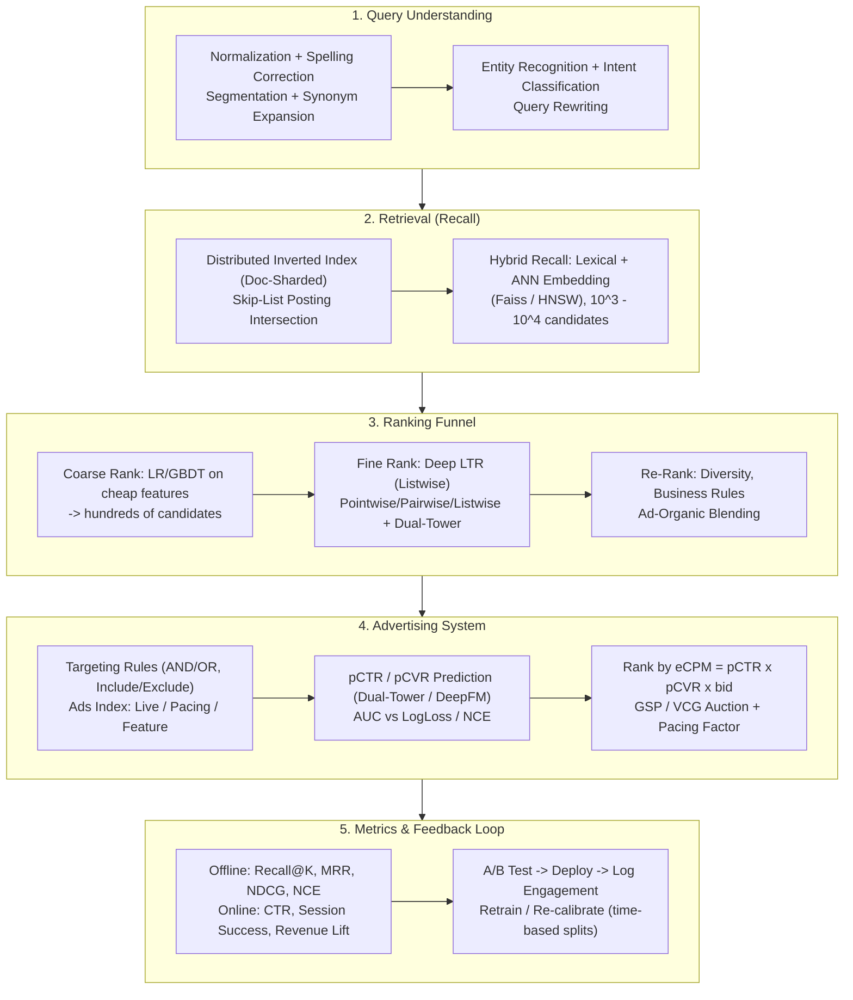

# 🌐 Search & Advertising System Design: Query Understanding, Inverted Index, RTB & pCTR Prediction

> **Core Executive Summary**: Search and advertising are two sides of the same funnel: understand the user's intent, retrieve a candidate pool at massive scale, rank it by relevance (and, for ads, by expected revenue), then blend and serve under strict latency budgets. On the search side, this guide covers query understanding, distributed inverted indexing, the Recall@K / MRR / NDCG metric family, and Pointwise/Pairwise/Listwise learning-to-rank with dual-tower architectures. On the ads side, it covers targeting, pCTR/pCVR prediction, the fundamental ranking equation $\text{eCPM} = \text{pCTR} \times \text{pCVR} \times \text{bid}$, the GSP vs VCG auction debate, ad-organic blending, budget pacing, and cold-start strategies — culminating in a runnable NumPy implementation of NDCG scoring and a GSP auction.

---

## 💡 Interactive Mermaid Architecture Flowchart



---

## 💡 Classic Interview Followups & Core Cheatsheet

* **Q1**: Walk through the full search pipeline from a raw query to the SERP — what does each stage do, and where does the latency go?
  * *A1*: (1) **Query understanding** — normalization (lowercase, Unicode folding), spelling correction, segmentation, synonym expansion, entity/intent recognition and rewriting (<20ms); (2) **Retrieval** — distributed inverted-index lookup with posting-list intersection, optionally merged with ANN embedding recall (Faiss/HNSW), yielding $10^3$–$10^4$ candidates (~50ms); (3) **Coarse ranking** — a cheap model (LR/GBDT on few features) cuts the pool to hundreds; (4) **Fine ranking** — a deep LTR model scores the top ~100–200 (tens of ms); (5) **Re-ranking** — diversity, freshness, business rules and ad blending; (6) **SERP assembly** — snippet generation and pagination. End-to-end P99 for web search is typically 200–300ms.
* **Q2**: Why do ad systems rank by eCPM rather than raw bid, and how does GSP charge the winner?
  * *A2*: Ranking by raw bid would surface irrelevant ads nobody clicks — destroying user experience and wasting advertiser budgets. The platform instead ranks by **expected revenue per 1000 impressions**: $\text{eCPM} = \text{pCTR} \times \text{pCVR} \times \text{bid}$. Under **GSP (Generalized Second Price)**, each winner pays the minimum that still wins the slot: the next-highest eCPM divided by its own pCTR (per-click charge), i.e. $\text{CPC}^* = \text{eCPM}_{(2)} / \text{pCTR}_{(1)}$. Bids are adjusted by a pacing factor for budget smoothness.
* **Q3**: Compare GSP and VCG auctions.
  * *A3*: **GSP** is non-truthful — a bidder can shade its bid to pay less while keeping the slot — but it is simple, fast and predictable (Google's classic choice for search ads). **VCG** charges each winner the externality it imposes on others (the sum of lost allocation value), making truthful bidding a dominant strategy, but it requires solving all pairwise allocation utilities (prohibitive with $10^5$ candidates) and can yield lower revenue than GSP in practice. Production systems use GSP with a floor price; VCG remains mostly theoretical.
* **Q4**: Compare Pointwise, Pairwise and Listwise LTR objectives — which aligns best with NDCG?
  * *A4*: **Pointwise** predicts a per-document relevance score (regression/classification), ignores relative order, and cannot directly optimize ranking metrics. **Pairwise** (RankNet, RankSVM) learns preferences $P(d_i \succ d_j)$ — better ordering, but pair sampling is expensive and ties are awkward. **Listwise** (ListNet, LambdaRank/LambdaMART) optimizes a list-level objective; LambdaRank re-weights gradients by $\Delta\text{NDCG}$, directly maximizing the metric. Production ranking is dominated by Listwise, while ads scoring keeps a well-calibrated Pointwise BCE head because the auction needs calibrated probabilities.
* **Q5**: How do you handle cold-start ads and budget pacing?
  * *A5*: **Cold start** — inherit priors from similar ads (content embedding, advertiser-level CTR), blend with the global CTR prior, spend a small exploration budget (Thompson sampling / ε-greedy), and calibrate online (isotonic regression). **Pacing** — a PID controller multiplies the effective bid so the daily budget is spent evenly: current state is the actual spend rate, desired state is the linear projection of budget over the day; if pacing lags, raise the multiplier. Frequency capping prevents ad fatigue and protects platform UX.

---

## 📚 Section 1: The Search Full Funnel — Query Understanding & Distributed Retrieval

### 1.1 Query Understanding Pipeline

| Stage | Function | Example |
| :--- | :--- | :--- |
| **Normalization** | Lowercase, Unicode folding, whitespace trimming | `"IPHONE 15 pro "` → `"iphone 15 pro"` |
| **Segmentation / Tokenization** | Chinese word segmentation, subword tokenization | `"机器学习"` → `"机器" / "学习"` |
| **Spelling Correction & Rewriting** | N-gram + edit-distance candidates, semantic rewrite | `"gogle"` → `"google"` |
| **Synonym Expansion** | Synonym dictionary + embedding neighbors | `"laptop"` ↔ `"notebook"` |
| **Entity Recognition / Intent** | NER + query taxonomy classification | `"iphone 15 price"` → Product + Price intent |

Query understanding is the highest-leverage stage: every downstream error is amplified by recall. Rewriting is typically logged with the serving version (query rewrite index) so offline metrics can attribute gains.

> 💡 **How to read this table**: The five stages progress from "cleaning" to "understanding" — normalization and segmentation are mechanical (rules suffice), correction/synonyms are dictionary work, and entity/intent recognition is where the real models live. Interview point: query understanding has the highest leverage because one upstream mistake gets amplified by every downstream stage.
>
> 🎤 **Interview Answer**: "Conclusion: the query understanding chain is normalize → segment → correct → synonyms → entity/intent. Why: raw queries are noisy ('IPHONE', 'gogle' must all converge to one retrieval target) and a misread query wastes everything downstream. Example: 'iphone 15 pro price' — segmentation yields brand + model, entity recognition yields 'product' + 'price intent', so retrieval knows to search the product catalog's price field rather than the news index."

### 1.2 Distributed Inverted Index & Skip-List Intersection

The inverted index maps each **term → posting list** of docIDs (sorted, delta-encoded, variable-byte compressed). Multi-term AND queries intersect posting lists; **skip lists** (every $k$-th docID stored as a skip pointer) allow jumping past non-matching docIDs, reducing worst-case intersection from $\mathcal{O}(|P_1| \times |P_2|)$ to roughly $\mathcal{O}(|P_1| + |P_2|)$:

$$\text{Intersect}(P_1, P_2) = \big\{ d \mid d \in P_1 \wedge d \in P_2 \big\}$$

At web scale the index is **doc-sharded** (each shard holds the full vocabulary for a subset of documents), enabling per-query parallelism with a merge phase; results are cached by query hash and query segment. Lexical recall is merged with **ANN embedding recall** (Faiss / HNSW) for hybrid retrieval — lexical captures exact terms, embeddings capture semantic match.

> 💡 **Intuition**: The inverted index is a "term → document list" dictionary: to find 'machine learning course', look up each term's posting list and intersect. Skip lists store a jump pointer every $k$-th docID — like flipping a book to the middle before scanning — avoiding per-document comparisons. Doc-sharding is splitting the book into volumes read by many machines in parallel.
>
> 🎤 **Interview Answer**: "Conclusion: search engines use inverted indexes with skip-list intersection, dropping worst-case cost from $O(|P_1| \times |P_2|)$ to roughly $O(|P_1| + |P_2|)$. Why: posting lists are sorted, so skip pointers jump past non-matching docIDs, and shards search in parallel. Example: two terms with 1M and 0.8M postings — brute-force intersection needs 8×10^12 comparisons; skip-list scanning needs ~1.8M, four orders of magnitude faster, and 20 shards in parallel bring a single query into the millisecond range."

### 1.3 Recall Metrics: Recall@K and MRR

A recall stage is judged by whether the true relevant docs survive the funnel:

$$\text{Recall}@K = \frac{\left| R_K \cap R_{\text{rel}} \right|}{\left| R_{\text{rel}} \right|}, \qquad \text{MRR} = \frac{1}{|Q|} \sum_{q \in Q} \frac{1}{\text{rank}_q}$$

**MRR** only rewards the first relevant hit; **Recall@K** is position-agnostic within $K$. Both are cheap proxies for funnel health — they must be tracked at every funnel stage, because a recall failure at stage 2 can never be repaired by a better ranker downstream.

> 💡 **Intuition**: Recall@K asks "what fraction of truly relevant docs made it into the top K of the funnel"; MRR asks "how early does the first relevant hit appear" — one cares about presence, the other about earliness. Both are cheap health checks, but they must be measured *per stage*: what stage 2 misses can never be rescued by a stronger stage 5.
>
> 🎤 **Interview Answer**: "Conclusion: retrieval stages are judged by Recall@K and MRR, tracked separately at every funnel stage. Why: the retrieval goal is 'don't lose' rather than 'rank well', and MRR rewards the first relevant hit's position. Example: with 100 relevant docs, if only 60 appear in the Top-100, Recall@100 = 0.6 — the retrieval channel dropped 40%, and no matter how good the ranker is, those 40% will never surface in the results."

---

## 📚 Section 2: Ranking Models & Evaluation Metrics

### 2.1 Learning to Rank: Three Paradigms

| Paradigm | Objective & Loss | Metric Alignment | Pros | Cons |
| :--- | :--- | :--- | :--- | :--- |
| **Pointwise** | Per-doc relevance: MSE / BCE | Weak (order-agnostic) | Simple, well-calibrated probability | Ignores relative order |
| **Pairwise** | Preference $P(d_i \succ d_j)$: RankNet cross-entropy | Good (order quality) | Captures ordering, AUC-friendly | Pair sampling cost, ties awkward |
| **Listwise** | List-level: ListNet / LambdaMART $\Delta\text{NDCG}$ | Best (direct metric lift) | Directly optimizes NDCG | More complex, ranker-only scores |

Production pattern: **Listwise for ranking quality** (LambdaMART or deep listwise models) and **Pointwise BCE for calibrated pCTR** used by the auction — the same system runs both heads.

> 💡 **How to read this table**: Watch the "Metric Alignment" column — going from point-level (Pointwise) to pair-level (Pairwise) to list-level (Listwise), the loss gets closer to NDCG. The interview distinction that matters: Pointwise treats ranking as regression/classification and naturally outputs calibrated probabilities; Listwise directly optimizes the ranking metric but outputs uncalibrated scores — so production runs both heads.
>
> 🎤 **Interview Answer**: "Conclusion: ranking quality uses Listwise (LambdaRank/LambdaMART), ad scoring uses Pointwise BCE, as two heads of one system. Why: NDCG is a list-level metric, so only a list-level loss optimizes it directly; but auctions need calibrated probabilities, and Pointwise BCE is naturally calibrated. Example: the same service runs two heads — the ranking head scores the SERP with LambdaRank re-weighting gradients by ΔNDCG, while the ad head outputs pCTR for the eCPM = pCTR × bid auction."

### 2.2 NDCG: Definition and Worked Example

Cumulative gain sums human-rated relevance, ignoring position. Discounted cumulative gain penalizes late placement of highly relevant documents:

$$\text{CG}_p = \sum_{i=1}^{p} \text{rel}_i, \qquad \text{DCG}_p = \sum_{i=1}^{p} \frac{\text{rel}_i}{\log_2(i+1)}$$

**Worked example** (human relevance ratings on a $0$–$3$ scale): engine ranks $D_1, D_2, D_3, D_4$ with ratings $[3, 2, 3, 0]$:
- $\text{CG}_4 = 3 + 2 + 3 + 0 = 8$
- $\text{DCG}_4 = 3 + 2/\log_2 3 + 3/\log_2 4 + 0 = 3 + 1.262 + 1.5 + 0 = 5.762$ — the relevant $D_3$ is discounted for appearing at position 3.
- Ideal ordering (by rating) gives $\text{IDCG}_4 = 3 + 3/\log_2 3 + 2/\log_2 4 + 0 = 5.898$.

Normalizing makes scores comparable across queries of different lengths:

$$\text{NDCG}@p = \frac{\text{DCG}_p}{\text{IDCG}_p} = \frac{5.762}{5.898} \approx 0.976$$

NDCG ignores irrelevant results (zero-relevance docs contribute nothing), so it is standard for ranking but unsuitable for ads where calibration matters.

> 💡 **Intuition**: NDCG is "how close your ordering is to the ideal". DCG discounts late placements via $1/\log_2(i+1)$ — position 1 gets 1.0, position 3 gets 0.63, position 5 gets 0.43 — then dividing by IDCG (the ideal ordering's DCG) normalizes so queries of different lengths are comparable. In the worked example, $D_3$ scored 3 but sat at position 3 — exactly the doc the discount punishes.
>
> 🎤 **Interview Answer**: "Conclusion: NDCG is the standard ranking metric; its core is positional discounting plus graded relevance. Why: without the log discount, 'best doc at position 10' and 'best doc at position 1' would score the same; IDCG normalization makes cross-query comparison possible. Example: ranking [3,2,3,0] gives DCG = 5.762, the ideal ordering gives IDCG = 5.898, so NDCG ≈ 0.976; if both 3-rated docs could sit at positions 1–2, NDCG would be 1.0 — the gap tells you a top-relevance doc was placed too late."

### 2.3 Dual-Tower (Two-Tower) Architecture

The **dual-tower model** maps user features $u$ and doc features $d$ into a shared low-dimensional space via two encoders; relevance is the inner product $\langle u, d \rangle$. Because the doc tower is precomputed and indexed for ANN, the user tower can be evaluated online, making dual-tower the canonical architecture for both embedding recall and ad retrieval. Its weakness is that the single inner-product interaction is weaker than full cross-feature models (DeepFM/GBDT) used in the fine-ranking stage.

> 💡 **Intuition**: Dual-tower splits "user × doc relevance" into two independent encoders plus a single top-level inner product — interaction happens too late and too shallowly, so it underperforms full-cross models; the payoff is that the doc tower can be precomputed offline into an ANN index while only the user tower runs online. That is a direct trade between interaction depth and latency — search and ads both use it because the retrieval budget is tens of milliseconds.
>
> 🎤 **Interview Answer**: "Conclusion: dual-tower serves retrieval/coarse-ranking, full-cross models serve fine-ranking — the division of labor is 'interaction depth vs. latency'. Why: factorized scoring enables offline pre-indexing + online single-tower; cross models must recompute per candidate. Example: with 100M docs, dual-tower completes a user-tower forward pass plus ANN search in 10ms; running a cross model over all 100M candidates would take 10^5 seconds even at 1ms each — so dual-tower casts the net and DeepFM/GBDT score only the final hundreds."

---

## 📚 Section 3: Advertising Core — Targeting, pCTR Prediction & eCPM Bidding

### 3.1 Ad Targeting and the Ads Index

Advertisers express delivery rules across four targeting dimensions: **query-based** (keyword match: exact / partial / expansion), **user-based** (region, demographics), **interest-based** (interest hierarchies), and **set-based** (retargeting + seed-audience expansion). Rules are AND/OR boolean expressions with INCLUDE/EXCLUDE conditions; the ad server flattens nested JSON and uses high-throughput boolean-expression matching (BE-tree, interval matching) so filtering stays under the latency budget.

The **ads index** precomputes three memory-resident indices offline (Spark/Dataflow pipelines) — **live index** (active ads and their creatives), **pacing index** (spend state), and **feature index** (ad features for rankers) — so the ad server never joins Campaign/AdSet/Ad/Creative tables per request. This is the canonical Pinterest-style index-publisher design.

> 💡 **Intuition**: The ads index pushes database joins offline: if the Campaign/AdSet/Ad/Creative multi-table join ran on every request, latency would blow up, so offline pipelines precompute three in-memory indices (Live/Pacing/Feature) and the ad server only looks things up. Like a kitchen that preps ingredients before the lunch rush and only cooks at peak time.
>
> 🎤 **Interview Answer**: "Conclusion: the ad server serves from three precomputed in-memory indices (Live/Pacing/Feature) instead of joining tables per request. Why: targeting rules are AND/OR boolean expressions; the index flattens the campaign→adset→ad→creative hierarchy and boolean matching (BE-tree) filters in sub-milliseconds. Example: with 1M active ads, live-joining advertiser, ad-group, and creative tables costs dozens of DB accesses per request; indexed, it is one memory lookup plus one boolean filter — latency drops from milliseconds to sub-millisecond and the ad retrieval budget survives."

### 3.2 pCTR / pCVR Prediction and Feature Taxonomy

| Feature Group | Examples |
| :--- | :--- |
| **User** | age, gender, region, language, search history, embedding of last-$k$ engaged ads, engagement day-of-week |
| **Ad** | ad_id embedding, raw content terms, engagement history (24h / 7d windows), negative engagement rate, ad age, bid |
| **Advertiser** | domain, historical engagement rate, region-wise engagement histograms |
| **Context** | current region, hour-of-day, device, screen size |
| **User×Ad cross** | embedding similarity, category/subcategory histograms, gender×ad and age×ad histograms |

CTR is only 1–2%, so training data is heavily imbalanced: downsample negatives in the training partition only, keep validation intact, and split by time to simulate production distribution shift. **AUC measures ranking but is calibration-insensitive** — multiply every score by 2 and AUC is unchanged while auction revenue collapses. Ad systems therefore track LogLoss and **Normalized Cross-Entropy**:

$$\text{NCE} = \frac{-\frac{1}{N}\sum_{i=1}^{N}\left[\frac{1+y_i}{2}\log p_i + \frac{1-y_i}{2}\log(1-p_i)\right]}{-\left[\bar{p}\log\bar{p} + (1-\bar{p})\log(1-\bar{p})\right]}$$

NCE divides LogLoss by the entropy of the background CTR, making it insensitive to the base CTR rate — the standard offline metric in RTB systems.

> 💡 **How to read this table**: Features are organized user → ad → context → cross. Watch the last group, "User×Ad cross" — it carries the strongest signal: neither user nor ad alone suffices; the interaction is what decides CTR. And the sentence right below — "AUC measures ranking but is calibration-insensitive" — is the golden line for ad interviews: multiply every score by 2 and AUC is unchanged while auction revenue collapses.
>
> 🎤 **Interview Answer**: "Conclusion: ad models need AUC for ranking plus LogLoss/NCE for calibration — both, not one. Why: NCE normalizes LogLoss by the background CTR's entropy, making it insensitive to the base rate and comparable across traffic segments; AUC is blind to score offsets. Example: two traffic segments with CTRs of 10% and 0.1% — the same model's LogLoss differs hugely but NCE is comparable; meanwhile multiplying every score by 2 leaves AUC untouched while pCTR becomes 200% and the auction charges advertisers double eCPM — which is why ads track NCE."

### 3.3 eCPM Ranking and GSP Payment

Ads are ranked by expected revenue per thousand impressions:

$$\text{eCPM} = \text{pCTR} \times \text{pCVR} \times \text{bid}$$

For a CPC objective, pCVR is dropped and the rank score is $\text{pCTR} \times \text{bid}$. The winner pays the next-highest eCPM normalized by its own pCTR — the minimal per-click price that still wins:

$$\text{CPC}^* = \frac{\text{eCPM}_{(2)}}{\text{pCTR}_{(1)}}$$

In practice the bid is pre-multiplied by a pacing factor (higher when the campaign is behind schedule), and a floor price guarantees the platform's minimum value per impression.

> 💡 **Intuition**: eCPM = pCTR × pCVR × bid converts "what an advertiser will pay per click" into "what the platform expects to earn per thousand impressions". Ranking by expected revenue instead of raw bid is because a low-CTR ad earns nothing even with a high bid — and it harms UX. The GSP charge (next-highest eCPM ÷ own pCTR) is literally "the minimum bid that still wins this slot".
>
> 🎤 **Interview Answer**: "Conclusion: ads rank by eCPM = pCTR × pCVR × bid, not raw bid, and the winner pays the next-highest eCPM divided by its own pCTR. Why: ranking by bid surfaces irrelevant ads nobody clicks; eCPM is expected revenue, so whoever maximizes per-impression earnings wins. Example: ad A has pCTR 0.05 and bid $1 → eCPM 50; ad B has pCTR 0.01 and bid $4 → eCPM 40. A wins and pays 40/0.05 = $0.80 per click — cheaper than its own $1 bid, which is the second-price benefit for advertisers."

---

## 📚 Section 4: Auction Mechanisms, Ad-Organic Blending, Pacing & Cold Start

### 4.1 Auction Mechanism Comparison

| Mechanism | Payment Rule | Truthful? | Revenue / Practicality |
| :--- | :--- | :--- | :--- |
| **First-Price** | Winner pays own bid | No (maximal shading pressure) | High variance; modern RTB trend (GDPR-era header bidding) |
| **Second-Price (single slot)** | Winner pays second-highest bid | Yes (single item) | Stable for one ad slot |
| **GSP (multi-slot)** | Each winner pays next eCPM / own pCTR | No — shading possible | Simple, predictable; the classic search-ads choice |
| **VCG** | Each winner pays externality imposed on others | Yes — truthful bidding is dominant | Computationally heavy; can yield lower revenue than GSP |

> 💡 **How to read this table**: Watch the "Truthful?" column — first-price vs. second-price is the single-slot comparison; GSP vs. VCG is the multi-slot one. The interview takeaway: VCG is theoretically elegant (truthful bidding is dominant) but computationally prohibitive and often lower-revenue in practice — so production picks GSP + floor price. Explaining *why not VCG* scores more than reciting definitions.
>
> 🎤 **Interview Answer**: "Conclusion: GSP plus a floor price is the pragmatic production choice; VCG is elegant in theory but infeasible in engineering. Why: VCG must compute 'the externality each winner imposes on others' — the full pairwise allocation-utility matrix, impossible with 10^5 candidates; GSP is one sort and a next-highest lookup. Example: 5 slots × 100K candidates — VCG needs ~5×10^5 allocation valuations, unacceptable latency; GSP sorts once and charges the winner next-eCPM/own-pCTR in milliseconds. That is why Google search ads have run GSP for years."

### 4.2 Ad-Organic Blending

Blending minimizes the harm ads cause to organic experience. Common designs: (1) **separated slots** — fixed ad positions above/below organic results; (2) **scored blending** — unified score $\text{score} = \alpha \cdot \text{organic\_relevance} + (1-\alpha) \cdot \text{normalized\_ad\_value}$ with floor-price and quality gates; (3) **interleaving experiments** to evaluate blended rankings on real traffic. Guardrail counter-metrics (session success rate, queries per session, zero-click search rate, "hide ad" feedback) are mandatory because CTR alone is blind to user harm.

> 💡 **Intuition**: Blending is the "platform revenue vs. user experience" conflict. Separated slots are the conservative option (ads fixed at top/bottom); scored blending puts ad value and organic relevance on one ruler; but whichever you pick, guardrail metrics are mandatory — CTR is *blind* to user harm: users may abandon search entirely while the CTR number still looks great.
>
> 🎤 **Interview Answer**: "Conclusion: blend via separated slots or a unified weighted score, and always monitor guardrail counter-metrics. Why: ad value and organic relevance have different units, needing layering or weighting; CTR gains can come at the cost of user churn. Example: ad CTR rises 20%, but the zero-click search rate (users who look and leave) jumps from 5% to 12% and session success drops — that experiment must fail, because short-term ad revenue bought long-term user attrition."

### 4.3 Budget Pacing and Cold Start

**Pacing** distributes a daily budget evenly over the day: current spend rate vs. desired linear spend projection, corrected by a PID controller whose output multiplies the bid. Without pacing, high-CTR ads exhaust their daily budget in the first morning hours at inflated CPCs. **Cold start** combines exploration (Thompson sampling / ε-greedy over a small traffic slice), prior borrowing from content-embedding neighbors, and online calibration so early pCTR estimates converge to reality before the auction trusts them.

> 💡 **Intuition**: Without pacing, an ad campaign is like spending your whole salary in the first week: high-CTR ads burn the daily budget in the early morning and sit idle all day at inflated CPCs. The PID controller compares actual spend against a linear projection and scales the bid factor accordingly. Cold start is "a new ad has no history" — borrow priors from similar ads and the global CTR, explore on a small traffic slice, and calibrate until the auction can trust the score.
>
> 🎤 **Interview Answer**: "Conclusion: budget pacing uses a PID controller on the bid factor to smooth daily spend; cold start combines prior borrowing, small-scale exploration, and online calibration. Why: if spend lags the linear projection, raise the bid multiplier; if ahead, lower it — and untrusted early pCTR estimates must not drive auctions. Example: with a $10K daily budget, noon should have spent $5K but only $3K is gone, so PID raises the bid factor from 1.0 to 1.15; meanwhile 100 new ads each get 1% traffic under Thompson sampling, and after a week their pCTR converges before full-scale launch."

---

## 🐍 Pure Numpy Implementation

```python
import numpy as np


def recall_at_k(pred_ids: np.ndarray, relevant: set, k: int = 5) -> float:
    """Fraction of relevant docs that survive the top-k funnel."""
    return len(set(pred_ids[:k].tolist()) & set(relevant)) / len(relevant)


def mrr(pred_ids: np.ndarray, relevant: set) -> float:
    """Reciprocal rank of the first relevant hit."""
    for pos, pid in enumerate(pred_ids, start=1):
        if pid in relevant:
            return 1.0 / pos
    return 0.0


def ndcg_at_k(scores: np.ndarray, labels: np.ndarray, k: int = 5) -> float:
    """NDCG@k: model ranking vs. ideal (human-rated) ranking."""
    order = np.argsort(-scores)[:k]
    dcg = np.sum((2.0 ** labels[order] - 1.0) / np.log2(np.arange(2, k + 2)))
    ideal = np.argsort(-labels)[:k]
    idcg = np.sum((2.0 ** labels[ideal] - 1.0) / np.log2(np.arange(2, k + 2)))
    return dcg / idcg if idcg > 0 else 0.0


def gsp_auction(pctr: np.ndarray, pctr_true: np.ndarray, bid: np.ndarray,
                floor_ecpm: float = 0.0):
    """GSP auction: rank by eCPM = pCTR x bid; winner pays next eCPM / own pCTR."""
    ecpm = pctr * bid
    order = np.argsort(-ecpm)                     # slots, best first
    cpc_payment = np.zeros_like(ecpm)
    for slot, ad in enumerate(order):
        if slot == len(order) - 1:                # last slot: floor price
            cpc_payment[ad] = floor_ecpm / pctr[ad]
        else:
            cpc_payment[ad] = ecpm[order[slot + 1]] / pctr[ad]   # GSP rule
    cpm_payment = cpc_payment * pctr              # actual eCPM charged
    revenue = float(np.sum(pctr_true * cpm_payment))
    return ecpm, order, cpc_payment, revenue


if __name__ == "__main__":
    np.random.seed(42)

    # --- Search ranking metrics ---
    scores = np.array([2.5, 0.1, 2.9, 2.0, 1.8, 0.3])   # model scores
    labels = np.array([3.0, 0.0, 2.0, 1.0, 2.0, 0.0])   # human ratings 0-3
    pred_order = np.argsort(-scores)
    print(f"Search metrics -> NDCG@5 = {ndcg_at_k(scores, labels, 5):.4f}, "
          f"MRR = {mrr(pred_order, {1, 3}):.4f}, "
          f"Recall@3 = {recall_at_k(pred_order, {1, 3}, 3):.2f}")

    # --- GSP auction ---
    pctr = np.array([0.03, 0.01, 0.05, 0.02, 0.04])     # predicted pCTR
    pctr_true = pctr * np.array([0.9, 1.1, 0.8, 1.2, 0.95])  # "true" pCTR
    bid = np.array([1.0, 2.0, 0.8, 3.0, 1.5])           # advertiser bids
    ecpm, order, cpc, revenue = gsp_auction(pctr, pctr_true, bid)
    print("\nGSP Auction (rank by eCPM = pCTR x bid):")
    for slot, ad in enumerate(order):
        print(f"  Slot {slot + 1}: ad #{ad}  eCPM = {ecpm[ad]:.4f}  "
              f"pays CPC = ${cpc[ad]:.4f}")
    print(f"Expected platform revenue per request: ${revenue:.4f}")
```

---

## 📝 Takeaways & Engineering Best Practices

1. **Design the funnel first**: recall stages are judged by Recall@K/MRR, ranking stages by NDCG — never conflate the two objectives, and track funnel health at every stage.
2. **Ads rank by expected value, not bid**: always $\text{eCPM} = \text{pCTR} \times \text{pCVR} \times \text{bid}$; keep pCTR/pCVR well calibrated (LogLoss/NCE) because AUC alone will mislead the auction.
3. **GSP + floor price is the pragmatic production choice**; VCG is theoretically elegant but expensive and historically lower-revenue — know when to justify each.
4. **Protect the platform**: track counter-metrics (session success, zero-click searches, ad fatigue / negative feedback) alongside CTR and revenue.
5. **Plan for distribution shift**: time-based train/validation splits, frequent retraining, online calibration, and a bounded exploration budget for cold start.

---

*Reference lineage: Aman's System Design notes (search funnel, NDCG worked example, ads end-to-end index publisher, GSP/VCG, pacing) distilled into this TalentMe Foundations guide.*
