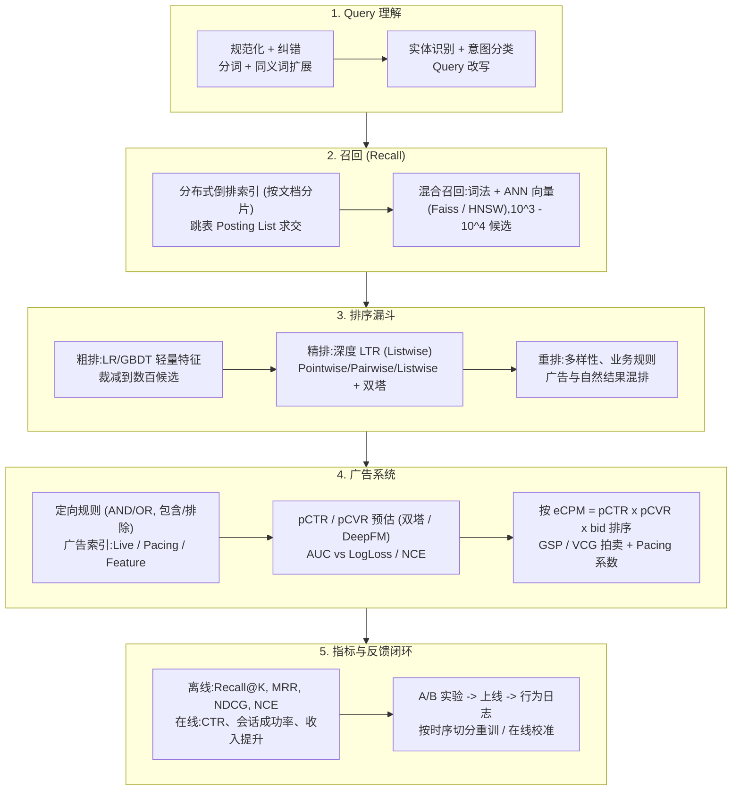

# 🌐 搜索与计算广告系统设计:Query 意图理解、分布式倒排索引、RTB 竞价与 pCTR 预估

> **核心摘要**:搜索与广告是同一漏斗的两面:理解用户意图 → 海量候选检索 → 按相关性(广告还需按期望收入)排序 → 在严格延迟预算内混排与投放。搜索侧,本指南覆盖 Query 理解、分布式倒排索引、Recall@K / MRR / NDCG 指标族与 Pointwise/Pairwise/Listwise 学习排序及双塔架构;广告侧,覆盖定向、pCTR/pCVR 预估、核心排序公式 $\text{eCPM} = \text{pCTR} \times \text{pCVR} \times \text{bid}$、GSP 与 VCG 拍卖之争、广告-自然结果混排、预算平滑与冷启动策略,并以一段可运行的 NumPy 实现收尾:NDCG 计算与 GSP 竞价模拟。

---

## 💡 交互式 Mermaid 架构流程图



---

## 💡 经典面试追问与考点速查

* **考点 1**:画出搜索引擎从原始 Query 到 SERP 的全链路,并说明每个阶段的职责与延迟预算?
  * *标准回答*:(1) **Query 理解**——规范化(小写、Unicode 折叠)、纠错、分词、同义词扩展、实体/意图识别与改写(<20ms);(2) **召回**——分布式倒排索引查询 + Posting List 求交,可选与 ANN 向量召回(Faiss/HNSW)融合,产出 $10^3$–$10^4$ 候选(~50ms);(3) **粗排**——LR/GBDT 轻量模型裁减到数百;(4) **精排**——深度 LTR 模型对前 100–200 打分(数十 ms);(5) **重排**——多样性、新鲜度、业务规则与广告混排;(6) **SERP 组装**——摘要生成与分页。端到端 P99 通常控制在 200–300ms。
* **考点 2**:为什么广告系统按 eCPM 排序而不是原始出价?推导 GSP 下胜者的扣费。
  * *标准回答*:按原始出价排序会投放大量无人点击的低质广告,破坏用户体验并浪费广告主预算。平台改按**每千次展示期望收入**排序:$\text{eCPM} = \text{pCTR} \times \text{pCVR} \times \text{bid}$。在**广义第二价格 (GSP)** 下,每位胜者支付恰好能赢下该坑位的最低价格——次高 eCPM 除以自身 pCTR(按点击计费),即 $\text{CPC}^* = \text{eCPM}_{(2)} / \text{pCTR}_{(1)}$,并叠加 pacing 系数平滑预算消耗。
* **考点 3**:对比 GSP 与 VCG 拍卖机制。
  * *标准回答*:**GSP** 非真话激励——出价方可压低报价以降低扣费而不丢失坑位——但实现简单、延迟低、行为可预测(Google 搜索广告的经典选择)。**VCG** 令每位胜者支付其对他人造成的外部性(被挤掉的分配价值之和),诚实报价成为占优策略,但需要求解全两两分配效用(在 $10^5$ 候选规模下不可行),且实际收入常低于 GSP。工业界采用 GSP + 底价(floor price);VCG 主要用于理论场景。
* **考点 4**:对比 Pointwise / Pairwise / Listwise 三种 LTR 目标,哪种与 NDCG 最契合?
  * *标准回答*:**Pointwise** 对每个文档独立预测相关性分数(回归/分类),不建模相对顺序,难以直接优化排序指标;**Pairwise**(RankNet、RankSVM)学习文档对偏好 $P(d_i \succ d_j)$,排序质量更好,但样本对采样代价高、平局处理棘手;**Listwise**(ListNet、LambdaRank/LambdaMART)优化列表级目标,LambdaRank 用 $\Delta\text{NDCG}$ 对梯度加权,直接最大化指标。生产排序以 Listwise 为主;广告打分则保留校准良好的 Pointwise BCE 输出,因为拍卖需要的是校准概率而非序。
* **考点 5**:如何解决新广告冷启动与预算平滑(pacing)问题?
  * *标准回答*:**冷启动**——从相似广告(内容向量、广告主级 CTR)继承先验并与全局 CTR 先验融合,投入小流量探索(汤普森采样 / ε-greedy),上线后做在线校准(等渗回归)。**预算平滑**——用 PID 控制器放大或缩小有效出价,使日预算在一天内均匀消耗:当前状态为实际消耗速率,期望状态为预算随时间的线性投影;进度落后则提高出价系数。配合频控防止广告疲劳、保护用户体验。

---

## 📚 第一章:搜索全链路——Query 理解与分布式检索

### 1.1 Query 理解流水线

| 阶段 | 功能 | 示例 |
| :--- | :--- | :--- |
| **规范化** | 小写化、Unicode 折叠、去空白 | `"IPHONE 15 pro "` → `"iphone 15 pro"` |
| **分词 / 切词** | 中文分词、子词切分 | `"机器学习"` → `"机器" / "学习"` |
| **纠错与改写** | N-gram + 编辑距离候选、语义改写 | `"gogle"` → `"google"` |
| **同义词扩展** | 同义词词典 + 向量近邻 | `"笔记本电脑"` ↔ `"laptop"` |
| **实体识别 / 意图** | NER + Query 分类体系 | `"iphone 15 价格"` → 商品 + 价格意图 |

Query 理解是全漏斗杠杆最高的一环:上游理解错误会被下游逐级放大。改写结果需连同服务版本(改写索引)一并落日志,离线指标才能归因收益。

> 💡 **怎么读这张表**: 五个阶段从"清洗"到"理解"递进——规范化和分词是体力活(规则可解),纠错/同义词是词典活,实体/意图识别才是真正的模型活。面试常考:为什么说 Query 理解杠杆最高——上游错一个字,下游每个阶段都在放大这个错误。
>
> 🎤 **面试速答**: "结论:Query 理解链路是规范化→分词→纠错→同义词→实体意图五步。原理:原始 query 噪声大('IPHONE'、'gogle' 都要归一到同一检索目标),理解错了下游全白做。举个例子:'iphone 15 pro 价格'——分词切出品牌+型号,实体识别出'商品'+'价格意图',召回才知道该去商品库查价格字段,而不是去新闻库。"

### 1.2 分布式倒排索引与跳表求交

倒排索引将每个**词项 → Posting List**(有序 docID 列表,delta 编码 + 变长字节压缩)。多词 AND 查询需要对 Posting List 求交;**跳表**(每第 $k$ 个 docID 存一个跳跃指针)允许跳过不匹配的 docID,把最坏求交复杂度从 $\mathcal{O}(|P_1| \times |P_2|)$ 降到约 $\mathcal{O}(|P_1| + |P_2|)$:

$$\text{Intersect}(P_1, P_2) = \big\{ d \mid d \in P_1 \wedge d \in P_2 \big\}$$

Web 规模下索引按**文档分片**(每个分片持有文档子集的完整词典),支持按 Query 并行检索再合并;结果按 Query 哈希与段位缓存。词法召回与 **ANN 向量召回**(Faiss / HNSW)融合成混合召回——词法捕捉精确词项,向量捕捉语义匹配。

> 💡 **直观理解**: 倒排索引就是"词→文档列表"的词典:查'机器学习'先找到这个词的 Posting List,再和'课程'的列表求交。跳表是在列表上每隔几个 docID 存一个"跳跃指针",像翻书先翻到中间再前后找,避免逐条比较。文档分片则是把书拆成多卷,多台机器同时翻,最后合并答案。
>
> 🎤 **面试速答**: "结论:搜索引擎用倒排索引 + 跳表求交,最坏复杂度从 $O(|P_1| \times |P_2|)$ 降到约 $O(|P_1| + |P_2|)$。原理:posting list 有序存储,跳表指针允许跳过不可能匹配的 docID,分片索引支持并行检索。举个例子:两个词各有 100 万和 80 万条 posting,暴力求交要 8×10^12 次比较;跳表线性扫描约 180 万次,快 4 个数量级,加上 20 个分片并行,单查询毫秒级返回。"

### 1.3 召回评价指标:Recall@K 与 MRR

召回阶段以"真实相关文档是否通过漏斗"为评价标准:

$$\text{Recall}@K = \frac{\left| R_K \cap R_{\text{rel}} \right|}{\left| R_{\text{rel}} \right|}, \qquad \text{MRR} = \frac{1}{|Q|} \sum_{q \in Q} \frac{1}{\text{rank}_q}$$

**MRR** 只奖励首个相关命中的位置;**Recall@K** 在 $K$ 内不关心位置。二者都是漏斗健康的廉价代理指标——必须**在每个漏斗阶段分别跟踪**,因为阶段 2 的召回漏检永远无法被下游更强的排序器修复。

> 💡 **直观理解**: Recall@K 问"真实相关的文档有百分之多少进了漏斗前 K",MRR 问"第一个相关结果排在第几位"——一个只看有没有、一个看有多早,都是漏斗健康的廉价体检,但要在每个阶段分别测:阶段 2 漏掉的东西,阶段 5 再强也救不回来。
>
> 🎤 **面试速答**: "结论:召回阶段用 Recall@K 和 MRR 评价,且必须分阶段跟踪。原理:召回目标是'不丢',不是'排得准',MRR 衡量首个命中的位置,Recall@K 只问是否进入 Top-K。举个例子:100 个相关文档,Top-100 里只回来 60 个,Recall@100 = 0.6,说明召回通道漏了 40%——精排模型再好,这 40% 也永远不会出现在结果里。"

---

## 📚 第二章:排序模型与评价指标

### 2.1 LTR 三范式对比

| 范式 | 目标与损失 | 指标契合度 | 优点 | 缺点 |
| :--- | :--- | :--- | :--- | :--- |
| **Pointwise** | 逐文档相关性:MSE / BCE | 弱(忽略顺序) | 简单,概率天然校准 | 不建模相对顺序 |
| **Pairwise** | 文档对偏好 $P(d_i \succ d_j)$:RankNet 交叉熵 | 较好(排序质量) | 捕捉顺序,契合 AUC | 样本对成本高,平局难处理 |
| **Listwise** | 列表级:ListNet / LambdaMART $\Delta\text{NDCG}$ | 最好(直接提指标) | 直接优化 NDCG | 复杂度高,输出为分数 |

生产范式:**Listwise 负责排序质量**(LambdaMART 或深度 listwise 模型),**Pointwise BCE 负责校准 pCTR**(供拍卖使用)——同一系统双头输出。

> 💡 **怎么读这张表**: 看"指标契合度"列——从点级(Pointwise)到对级(Pairwise)到列表级(Listwise),损失函数离 NDCG 越来越近。面试最常考的区分:Pointwise 把排序当回归/分类,天然输出校准概率;Listwise 直接优化排序指标,但输出的是分数不是概率——所以生产系统两头都要。
>
> 🎤 **面试速答**: "结论:排序质量用 Listwise(LambdaRank/LambdaMART),广告打分用 Pointwise BCE,同一系统双头输出。原理:NDCG 是列表级指标,只有列表级损失能直接优化它;但拍卖需要校准概率,Pointwise 的 BCE 输出天然校准。举个例子:同一个服务两个头——精排头输出分数排 SERP,LambdaRank 按 ΔNDCG 加权梯度;广告头输出 pCTR 供 eCPM = pCTR×bid 竞价。"

### 2.2 NDCG:定义与手算示例

累积增益 (CG) 直接求和人工评分、忽略位置;折损累积增益 (DCG) 对排在后面的高相关文档打折:

$$\text{CG}_p = \sum_{i=1}^{p} \text{rel}_i, \qquad \text{DCG}_p = \sum_{i=1}^{p} \frac{\text{rel}_i}{\log_2(i+1)}$$

**手算示例**(人工相关性 $0$–$3$ 分):引擎排序 $D_1, D_2, D_3, D_4$,评分 $[3, 2, 3, 0]$:
- $\text{CG}_4 = 3 + 2 + 3 + 0 = 8$
- $\text{DCG}_4 = 3 + 2/\log_2 3 + 3/\log_2 4 + 0 = 3 + 1.262 + 1.5 + 0 = 5.762$——高相关的 $D_3$ 因排在第 3 位被折损。
- 按评分重排的理想序给出 $\text{IDCG}_4 = 3 + 3/\log_2 3 + 2/\log_2 4 + 0 = 5.898$。

归一化后可在不同长度 Query 之间比较:

$$\text{NDCG}@p = \frac{\text{DCG}_p}{\text{IDCG}_p} = \frac{5.762}{5.898} \approx 0.976$$

NDCG 不惩罚零相关结果(对分母无贡献),是排序任务的标配,但不适用于广告——拍卖需要的是校准概率。

> 💡 **直观理解**: NDCG 是"你的排序离理想排序有多近"的达成率。DCG 用 $1/\log_2(i+1)$ 给排后面的文档打折——第 1 位折扣 1.0、第 3 位 0.63、第 5 位 0.43,越靠后折扣越大;再除以 IDCG(理想排序的 DCG)归一化,不同长度的查询才能互相比较。手算示例里 $D_3$ 评了 3 分却排第 3 位,正是被折扣惩罚的对象。
>
> 🎤 **面试速答**: "结论:NDCG 是排序标配指标,核心是位置折扣 + 分级相关性。原理:排后面的高相关文档要被 log 折扣,否则'最相关的放第 10 位'和'放第 1 位'得分一样;除以 IDCG 归一化后跨查询可比。举个例子:评分 [3,2,3,0] 的排序 DCG=5.762,理想排序 IDCG=5.898,NDCG≈0.976;如果两个 3 分文档能排到前两位,NDCG 就是 1.0——0.976 说明有一个 3 分文档被排晚了。"

### 2.3 双塔(Two-Tower)架构与粗排-精排-重排

**双塔模型**将用户特征 $u$ 与文档特征 $d$ 分别经两个编码器映射到共享低维空间,相关性为内积 $\langle u, d \rangle$。文档塔可离线预计算并建立 ANN 索引,线上只需推理用户塔,因此双塔是向量召回与广告检索的经典架构;其弱点是单一内积交互弱于精排阶段的完整交叉特征模型(DeepFM / GBDT)。工程上三者各司其职:双塔负责召回、浅层模型负责粗排、深度交叉模型负责精排、规则与多样性负责重排。

> 💡 **直观理解**: 双塔把"用户×文档相关性"拆成两个独立编码器 + 最顶层一个内积——交互发生得太晚太浅,表达力弱于精排的全交叉模型;回报是文档塔可以离线预计算、放进 ANN 索引,线上只算用户塔。这是"交互深度 vs 延迟"的直接交易:搜索和广告都用这个架构,因为召回预算只有几十毫秒。
>
> 🎤 **面试速答**: "结论:双塔用于召回/粗排,精排用全交叉模型,按'交互深度 vs 延迟'分工。原理:可因子化打分 = 离线预索引 + 在线单塔,交叉模型必须逐候选重算。举个例子:1 亿文档,双塔在线一次用户塔前向 + ANN 检索 10ms 内完成;若把精排的交叉模型直接扫 1 亿个候选,单个 1ms 也要 10^5 秒——所以双塔只负责海选,DeepFM/GBDT 只评最后几百个。"

---

## 📚 第三章:广告检索、定向与 pCTR 预估

### 3.1 广告定向与广告索引

广告主通过四个维度的定向规则表达投放约束:**Query 定向**(关键词匹配:精确 / 部分 / 扩展)、**用户定向**(地域、人口属性)、**兴趣定向**(兴趣层级体系)、**人群包定向**(重定向 + 种子人群扩量)。规则本质是 AND/OR 布尔表达式,含包含/排除条件;广告服务器将嵌套 JSON 拍平后,用高吞吐布尔表达式匹配(BE-tree、区间匹配)在延迟预算内完成过滤。

**广告索引**由离线流水线(Spark/Dataflow)预计算三份常驻内存索引——**Live 索引**(活跃广告与创意)、**Pacing 索引**(消耗状态)、**Feature 索引**(供排序器使用的广告特征)——使广告服务器免于每次请求 join Campaign/AdSet/Ad/Creative 多表,即经典的 Pinterest 式 Index Publisher 设计。

> 💡 **直观理解**: 广告索引是"把数据库 join 提前到离线做完":Campaign/AdSet/Ad/Creative 多表 join 如果每次请求都现场做,延迟受不了,于是离线预计算成三份内存索引(Live/Pacing/Feature),线上广告服务器只做查找。就像餐厅把配菜提前切好,高峰期只负责炒菜。
>
> 🎤 **面试速答**: "结论:广告服务器用离线预计算的 Live/Pacing/Feature 三索引,避免请求时 join 多表。原理:定向规则本质是 AND/OR 布尔表达式,索引把 campaign→adset→ad→creative 的层级关系拍平,布尔匹配(BE-tree)亚毫秒过滤。举个例子:100 万活跃广告,每次请求实时 join 广告主、广告组、创意三张表要几十次 DB 访问;索引化后一次内存查找 + 一次布尔过滤,延迟从毫秒级降到亚毫秒,广告检索预算才能保住。"

### 3.2 pCTR / pCVR 预估与特征体系

| 特征组 | 示例 |
| :--- | :--- |
| **用户** | 年龄、性别、地域、语言、搜索历史、最近 $k$ 个交互广告的 embedding、每周活跃日分布 |
| **广告** | ad_id embedding、原始内容词项、历史互动率(24h / 7d 窗口)、负反馈率、广告年龄、出价 |
| **广告主** | 域名、历史互动率、分地域互动直方图 |
| **上下文** | 当前地域、时段、设备、屏幕尺寸 |
| **用户×广告交叉** | embedding 相似度、品类/子品类直方图、性别×广告、年龄×广告 |

点击率仅 1%–2%,训练数据严重不平衡:只在训练分区下采样负样本、验证集保持原分布,并按时间切分以模拟线上分布漂移。**AUC 衡量排序但无视校准**——把所有分数乘 2,AUC 不变而拍卖收入崩盘。广告系统因此同时跟踪 LogLoss 与**归一化交叉熵 (NCE)**:

$$\text{NCE} = \frac{-\frac{1}{N}\sum_{i=1}^{N}\left[\frac{1+y_i}{2}\log p_i + \frac{1-y_i}{2}\log(1-p_i)\right]}{-\left[\bar{p}\log\bar{p} + (1-\bar{p})\log(1-\bar{p})\right]}$$

NCE 用背景 CTR 的熵对 LogLoss 归一化,对基础点击率不敏感,是 RTB 系统的事实离线指标。

> 💡 **怎么读这张表**: 特征组按"从用户、到广告、到上下文、再到交叉"组织——注意最后一组"用户×广告交叉"信号最强:单独看用户和广告都不够,交互才是 CTR 的决定性特征。表下那句"AUC 衡量排序但无视校准"是广告面试的金句:把分数全部乘 2,AUC 不变,但拍卖收入崩盘。
>
> 🎤 **面试速答**: "结论:广告模型用 AUC 排序 + LogLoss/NCE 校准,缺一不可。原理:NCE 是 LogLoss 除以背景 CTR 的熵,对基础点击率不敏感,跨流量段可比;AUC 只测排序,对分数整体偏移无感。举个例子:两个流量段 CTR 分别为 10% 和 0.1%,同一模型在两段的 LogLoss 完全不同但 NCE 可比;而把分数全乘 2,AUC 纹丝不动,但 pCTR 变成 200%,拍卖按两倍 eCPM 扣广告主的钱——所以广告必须盯 NCE。"

### 3.3 eCPM 竞价公式与 GSP 扣费

广告按每千次展示期望收入排序:

$$\text{eCPM} = \text{pCTR} \times \text{pCVR} \times \text{bid}$$

CPC 目标下可去掉 pCVR,排序分为 $\text{pCTR} \times \text{bid}$。胜者支付次高 eCPM 除以自身 pCTR——恰好能赢下坑位的最低点击价:

$$\text{CPC}^* = \frac{\text{eCPM}_{(2)}}{\text{pCTR}_{(1)}}$$

实践中出价会先乘 pacing 系数(投放进度落后时提高),并用底价 (floor price) 保证平台每千次展示的最低价值。

> 💡 **直观理解**: eCPM = pCTR × pCVR × bid 是把"广告主愿为一次点击付的钱"折算成"平台期望从一千次展示中赚的钱"。排序用期望收入而不是出价,是因为点击率低的广告即使出价高,平台也赚不到钱,还会伤害用户体验。GSP 扣费 = 次高 eCPM ÷ 自己的 pCTR,含义是"我恰好出到这个价就能赢下这个坑位"。
>
> 🎤 **面试速答**: "结论:广告按 eCPM=pCTR×pCVR×bid 排序而非原始出价,胜者付次高 eCPM 除以自己的 pCTR。原理:按出价排序会大量展示没人点的低质广告;eCPM 是期望收入,谁让平台每千次展示预期赚得多谁上。举个例子:广告 A pCTR=0.05、bid=1 元 → eCPM=50 元;广告 B pCTR=0.01、bid=4 元 → eCPM=40 元。A 赢,扣费 = 40/0.05 = 0.8 元/点击,比自己出价 1 元还便宜——这就是第二价格机制对广告主的好处。"

---

## 📚 第四章:拍卖机制、广告-自然混排、预算平滑与冷启动

### 4.1 拍卖机制对比

| 机制 | 支付规则 | 诚实报价? | 收入 / 工程可行性 |
| :--- | :--- | :--- | :--- |
| **一价拍卖 (FP)** | 胜者付自身出价 | 否(压价压力最大) | 波动大;后 GDPR 时代 header bidding 回归 |
| **二价拍卖 (SP, 单坑位)** | 胜者付次高出价 | 是(单品场景) | 单广告位下稳定 |
| **GSP(多坑位)** | 每位胜者付次高 eCPM / 自身 pCTR | 否——可压价 | 简单、可预测,搜索广告经典选择 |
| **VCG** | 每位胜者付其对他人造成的外部性之和 | 是——诚实为占优策略 | 计算量大,实际收入常低于 GSP |

> 💡 **怎么读这张表**: 核心看"诚实报价"列——一价/二价是单坑位对比,GSP/VCG 是多坑位对比。面试结论:VCG 理论优雅(诚实是占优策略)但算不动,实际收入还常低于 GSP——所以工业界选 GSP + 底价。这是"理论优雅 vs 工程务实"的经典案例,答出'为什么不用 VCG'比背定义更得分。
>
> 🎤 **面试速答**: "结论:GSP + 底价是工业界务实之选,VCG 理论优雅但工程上不可行。原理:VCG 要算'每个人被挤掉的价值之和',需要全两两分配效用矩阵,10^5 候选算不完;GSP 只需一次排序取次高价。举个例子:5 个广告位 × 10 万候选,VCG 要解 5×10^5 次分配估值,延迟不可接受;GSP 排一次序,胜者直接付次高 eCPM/自身 pCTR,毫秒级完成——Google 搜索广告多年用 GSP 就是这个原因。"

### 4.2 广告与自然结果混排

混排的目标是把广告对自然体验的伤害降到最低。常见设计:(1) **分坑位**——固定广告位置于自然结果上下;(2) **统一打分**——$\text{score} = \alpha \cdot \text{自然相关性} + (1-\alpha) \cdot \text{归一化广告价值}$,叠加底价与质量门限;(3) **交织实验 (interleaving)** 在真实流量上评估混排方案。必须设置护栏反指标(会话成功率、每会话查询数、零点击搜索率、"隐藏广告"反馈),因为 CTR 单独对用户体验伤害是盲的。

> 💡 **直观理解**: 混排的核心矛盾是"平台赚钱 vs 用户体验"。分坑位是最保守的做法(广告固定在自然结果上下两端);统一打分则把广告价值和自然相关性放到同一把尺子上;但不管哪种,都必须监控护栏指标——CTR 对用户体验的伤害是'盲'的:用户可能因为广告太多直接放弃搜索,而 CTR 数字依然好看。
>
> 🎤 **面试速答**: "结论:混排用分坑位或统一打分,并强制监控护栏指标。原理:广告价值与自然相关性量纲不同,需要分层或加权;CTR 提升可能以用户流失为代价。举个例子:广告 CTR 提升 20%,但零点击搜索率(用户看一眼就走)从 5% 升到 12%,会话成功率下降——这个实验必须判负,因为短期的广告收入换来的是长期的用户逃离。"

### 4.3 PID 预算平滑与冷启动

**预算平滑 (Pacing)** 让日预算在一天内均匀消耗:对比实际消耗速率与"预算随时间线性投影"的期望速率,用 PID 控制器输出修正出价系数。不做 pacing 时,高 CTR 广告会在清晨几小时内耗尽日预算,且承担虚高的 CPC。**冷启动**则结合探索(小流量汤普森采样 / ε-greedy)、从内容向量近邻继承先验,以及在线校准,让早期 pCTR 估计尽快收敛到真实值,拍卖才敢信任它。

> 💡 **直观理解**: 不做 pacing 的广告就像月初就把工资花光:高 CTR 广告清晨几小时烧完日预算,后面全天裸奔,还因抢量承担虚高的 CPC。PID 是"看实际消耗 vs 期望线性消耗的差距,动态调出价系数"。冷启动则是"新广告没有历史,先用相似广告和全局先验顶上,再小流量探索校准"。
>
> 🎤 **面试速答**: "结论:预算平滑用 PID 控制出价系数让日预算均匀消耗,冷启动用先验继承 + 小流量探索 + 在线校准。原理:实际消耗落后于线性投影就调高出价、超前就调低;新广告 pCTR 没数据,用内容相似广告的 CTR 做先验。举个例子:日预算 1 万,中午 12 点应花 5000、实际只花 3000,PID 把出价系数从 1.0 提到 1.15;100 个新广告各投 1% 流量用 Thompson 采样探索,一周后 pCTR 收敛再全量放量——收敛前拍卖根本不敢信任它的分数。"

---

## 🐍 Pure Numpy 实现

```python
import numpy as np


def recall_at_k(pred_ids: np.ndarray, relevant: set, k: int = 5) -> float:
    """Top-k 漏斗中保留下来的相关文档占比。"""
    return len(set(pred_ids[:k].tolist()) & set(relevant)) / len(relevant)


def mrr(pred_ids: np.ndarray, relevant: set) -> float:
    """首个相关命中的位置倒数。"""
    for pos, pid in enumerate(pred_ids, start=1):
        if pid in relevant:
            return 1.0 / pos
    return 0.0


def ndcg_at_k(scores: np.ndarray, labels: np.ndarray, k: int = 5) -> float:
    """NDCG@k:模型排序相对理想(人工评分)排序的折损累积增益比。"""
    order = np.argsort(-scores)[:k]
    dcg = np.sum((2.0 ** labels[order] - 1.0) / np.log2(np.arange(2, k + 2)))
    ideal = np.argsort(-labels)[:k]
    idcg = np.sum((2.0 ** labels[ideal] - 1.0) / np.log2(np.arange(2, k + 2)))
    return dcg / idcg if idcg > 0 else 0.0


def gsp_auction(pctr: np.ndarray, pctr_true: np.ndarray, bid: np.ndarray,
                floor_ecpm: float = 0.0):
    """GSP 拍卖:按 eCPM = pCTR x bid 排序;胜者付次高 eCPM / 自身 pCTR。"""
    ecpm = pctr * bid
    order = np.argsort(-ecpm)                     # 坑位顺序,优者在前
    cpc_payment = np.zeros_like(ecpm)
    for slot, ad in enumerate(order):
        if slot == len(order) - 1:                # 末位坑位:按底价计费
            cpc_payment[ad] = floor_ecpm / pctr[ad]
        else:
            cpc_payment[ad] = ecpm[order[slot + 1]] / pctr[ad]   # GSP 规则
    cpm_payment = cpc_payment * pctr              # 实际收取的 eCPM
    revenue = float(np.sum(pctr_true * cpm_payment))
    return ecpm, order, cpc_payment, revenue


if __name__ == "__main__":
    np.random.seed(42)

    # --- 搜索排序指标 ---
    scores = np.array([2.5, 0.1, 2.9, 2.0, 1.8, 0.3])   # 模型分数
    labels = np.array([3.0, 0.0, 2.0, 1.0, 2.0, 0.0])   # 人工评分 0-3
    pred_order = np.argsort(-scores)
    print(f"搜索指标 -> NDCG@5 = {ndcg_at_k(scores, labels, 5):.4f}, "
          f"MRR = {mrr(pred_order, {1, 3}):.4f}, "
          f"Recall@3 = {recall_at_k(pred_order, {1, 3}, 3):.2f}")

    # --- GSP 拍卖 ---
    pctr = np.array([0.03, 0.01, 0.05, 0.02, 0.04])     # 预估 pCTR
    pctr_true = pctr * np.array([0.9, 1.1, 0.8, 1.2, 0.95])  # "真实" pCTR
    bid = np.array([1.0, 2.0, 0.8, 3.0, 1.5])           # 广告主出价
    ecpm, order, cpc, revenue = gsp_auction(pctr, pctr_true, bid)
    print("\nGSP 拍卖(按 eCPM = pCTR x bid 排序):")
    for slot, ad in enumerate(order):
        print(f"  坑位 {slot + 1}: 广告 #{ad}  eCPM = {ecpm[ad]:.4f}  "
              f"点击扣费 = ${cpc[ad]:.4f}")
    print(f"平台单次请求期望收入: ${revenue:.4f}")
```

---

## 📝 总结与学习路线

1. **先设计漏斗,再谈模型**:召回阶段用 Recall@K/MRR 评价、排序阶段用 NDCG 评价,两者目标不可混为一谈,且要在每个漏斗阶段分别监控健康度。
2. **广告按期望价值排序而非出价**:始终使用 $\text{eCPM} = \text{pCTR} \times \text{pCVR} \times \text{bid}$;pCTR/pCVR 必须保证校准(LogLoss/NCE),仅看 AUC 会误导拍卖。
3. **GSP + 底价是工业界务实之选**;VCG 理论优雅但计算昂贵、历史上收入偏低——要能讲清各自的取舍依据。
4. **保护平台体验**:在 CTR 与收入之外,必须监控护栏反指标(会话成功率、零点击搜索率、广告疲劳与负反馈)。
5. **为分布漂移而设计**:按时序切分训练/验证集、高频重训、在线校准,并为冷启动预留有界探索预算。

---

*内容溯源:基于 Aman 的 System Design 笔记(搜索漏斗、NDCG 手算示例、广告端到端 Index Publisher、GSP/VCG、pacing)蒸馏为本 TalentMe Foundations 指南。*
