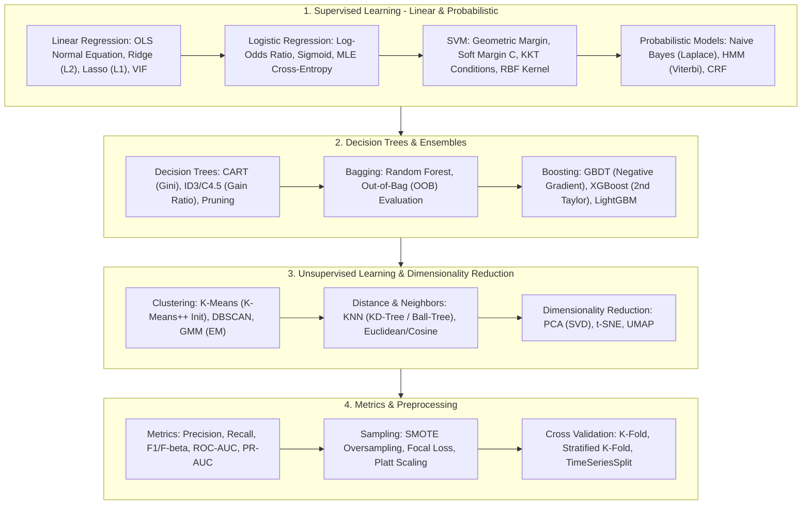
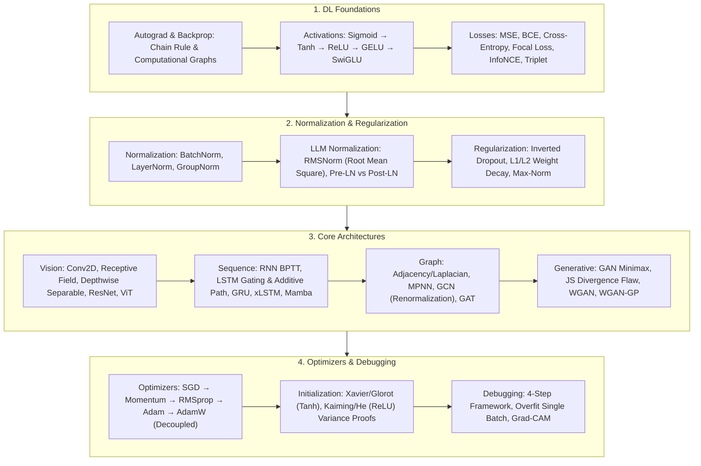
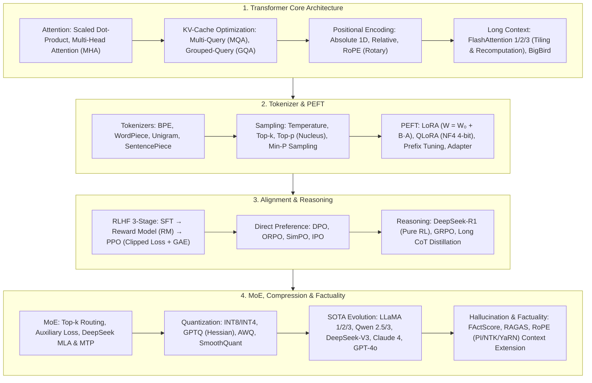
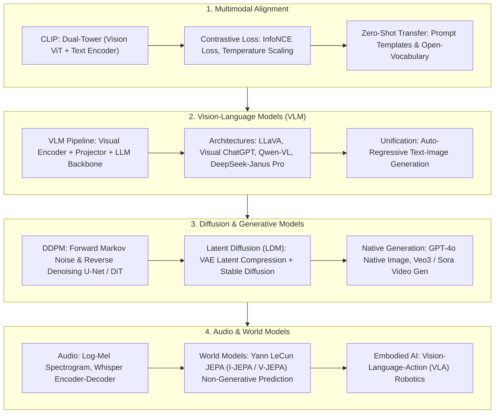
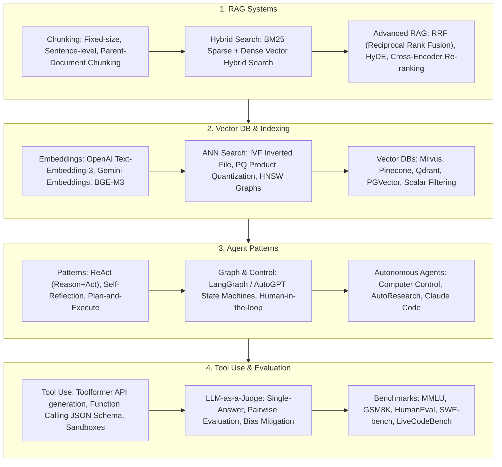
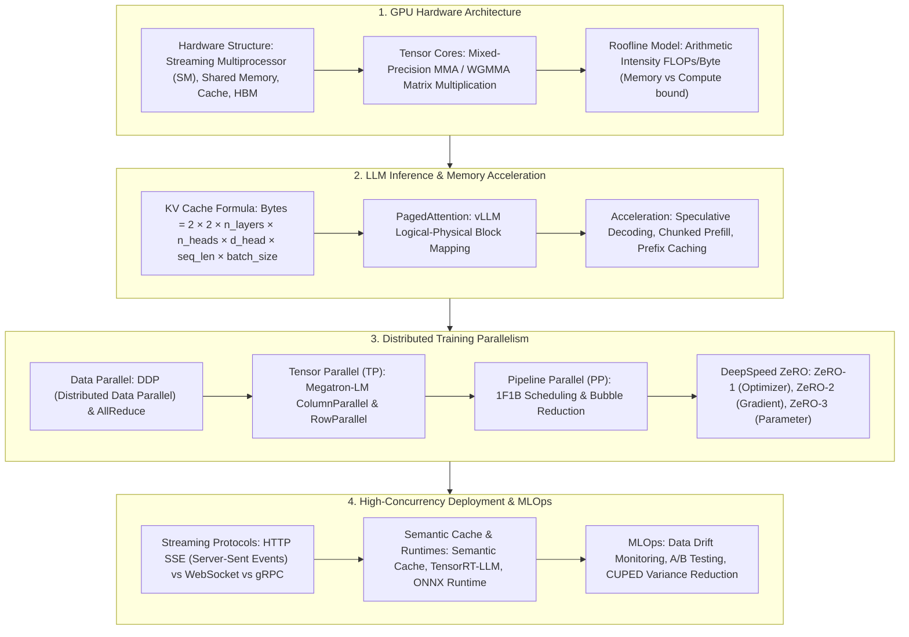
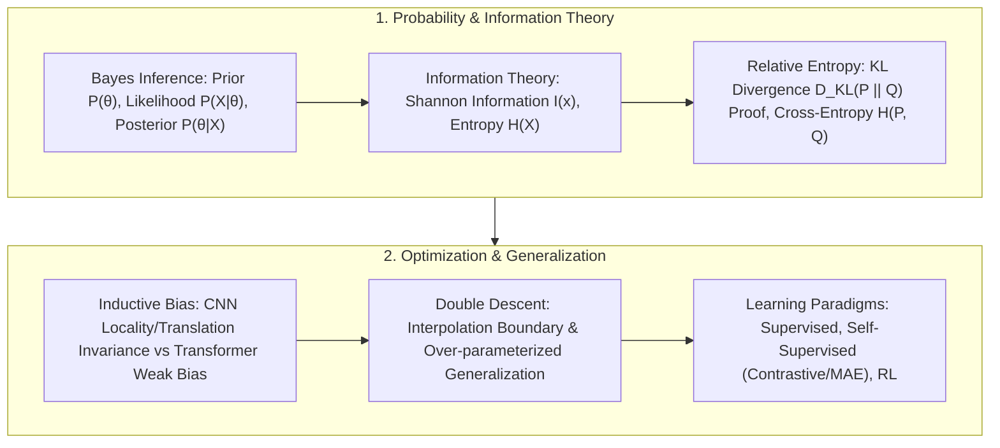

# 🌐 TalentMe AI/ML/LLM Full Knowledge Taxonomy & Architecture Graph

> **Overview & Vision**: Modern Artificial Intelligence and Large Language Models have evolved into a massive, interdisciplinary, and mathematically rigorous engineering science. From fundamental linear algebra and chi-square distributions to classical ML (Polynomial Regression, SVM), deep learning activations and self-attention, to 100B+ LLMs, multimodal generation, embodied agents, and GPU distributed parallel systems. This document serves as the master taxonomy guide for the TalentMe Tech Vault, mapping out 7 core domains with interactive flowcharts and mathematical formulas.

---

## 📊 1. Machine Learning Taxonomy

### 1.1 ML Architecture Graph

---

## 🧠 2. Deep Learning Taxonomy

### 2.1 DL Architecture Graph

---

## ⚡ 3. Large Language Models (LLM Taxonomy)

### 3.1 LLM Architecture Graph

---

## 👁️ 4. Multimodal AI & Generative Models Taxonomy

### 4.1 Multimodal Architecture Graph

---

## 🤖 5. Agentic Systems & RAG Engineering Taxonomy

### 5.1 Agentic Architecture Graph

---

## 🏗️ 6. AI System Architecture & Parallelism Taxonomy

### 6.1 System Design Architecture Graph

---

## 📐 7. AI Math Foundations & Generalization Taxonomy

### 7.1 Math Architecture Graph

