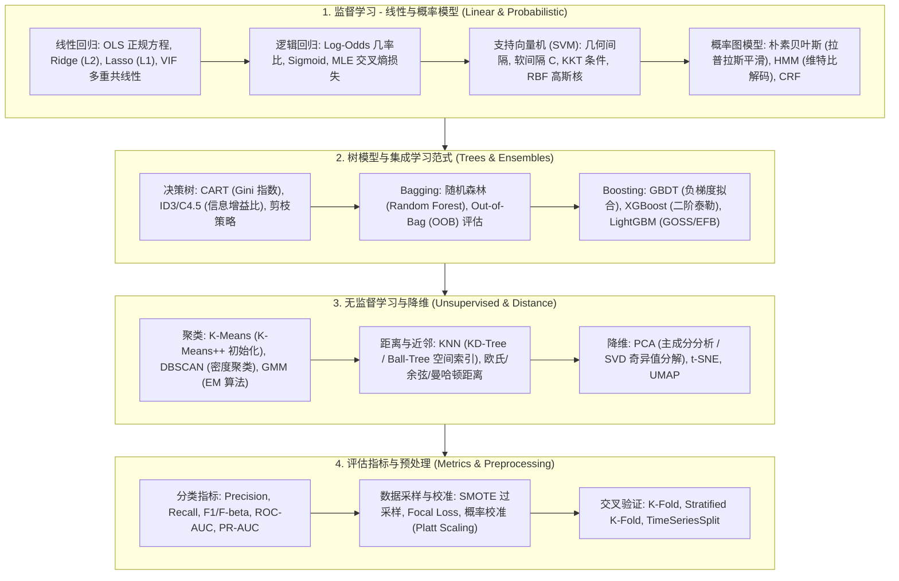
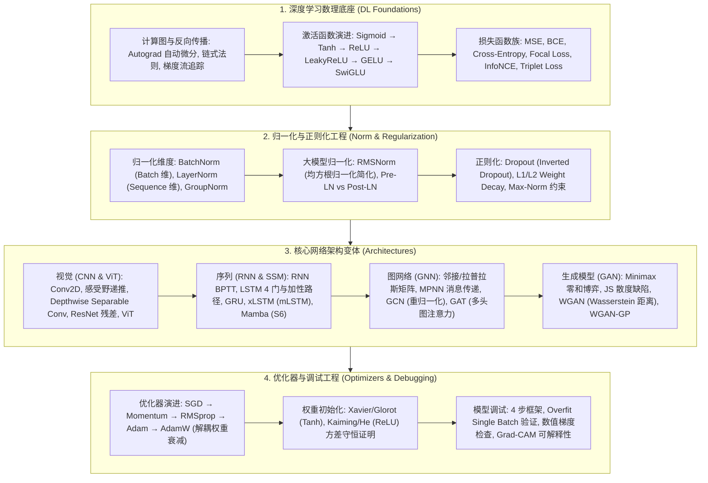
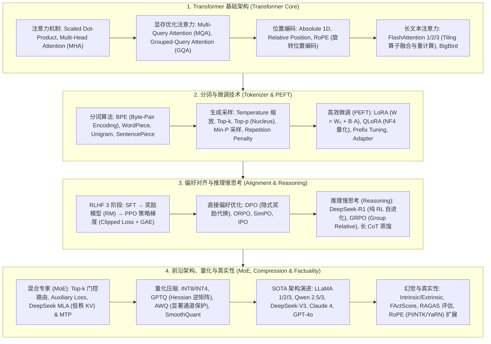
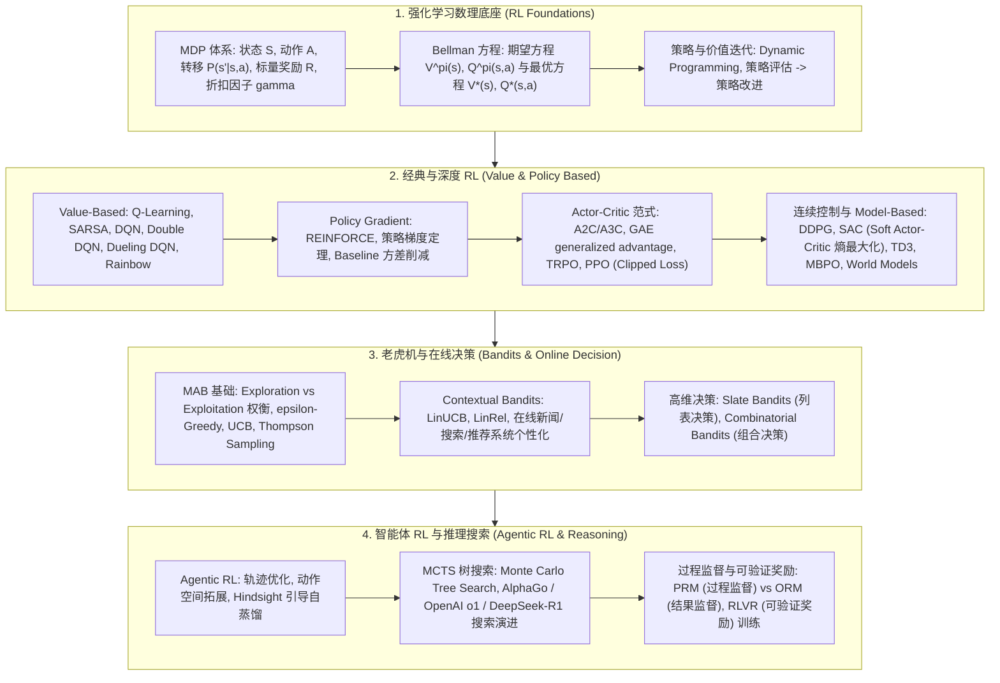
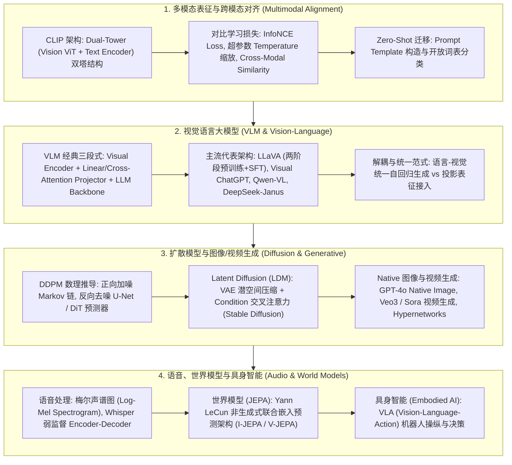
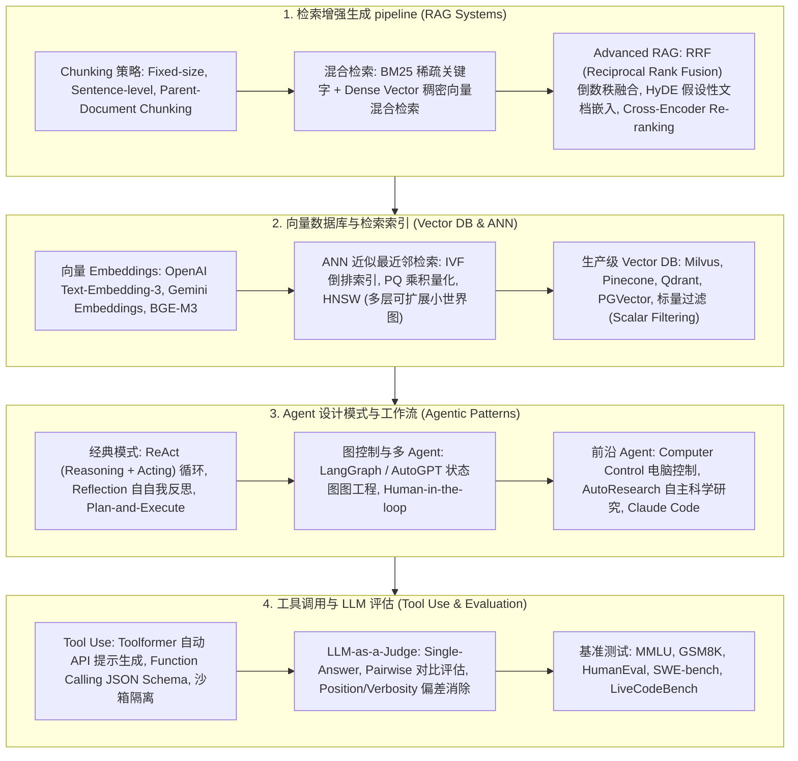
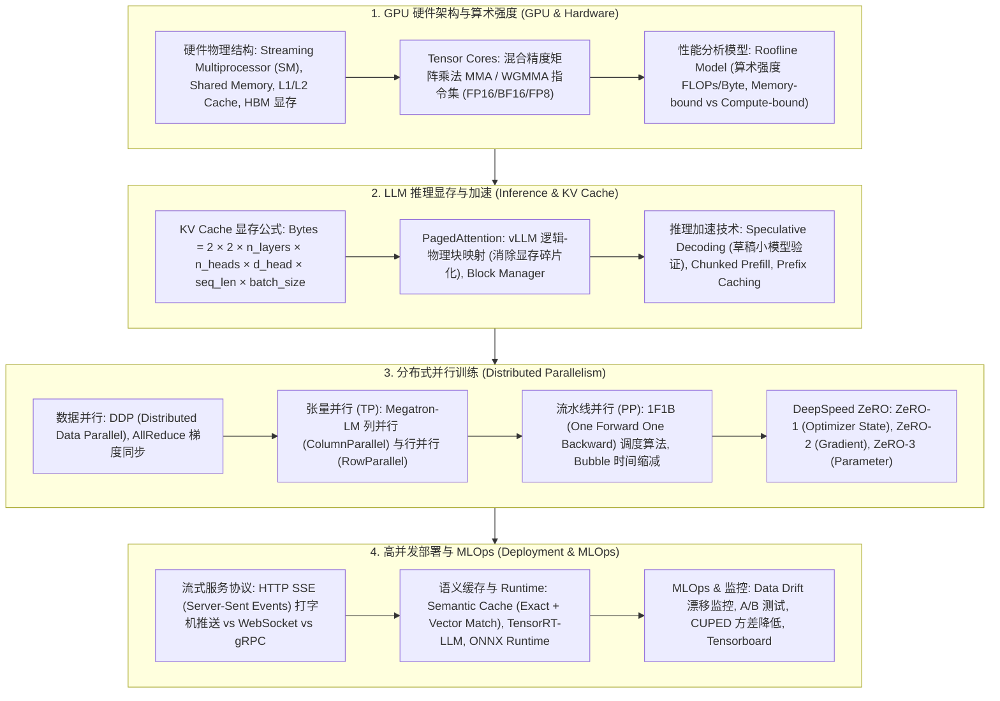
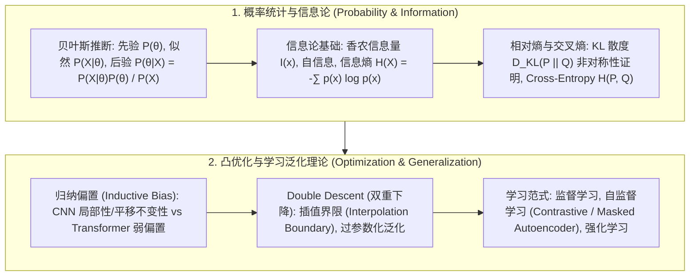

# 🌐 TalentMe AI/ML/LLM 全景技术拓扑图与知识树 (Full Taxonomy)

> **导读与全景视野**：现代人工智能与大模型技术已经演进为一个极其庞大、跨学科且数理严密的工程科学体系。从最底层的线性代数与概率卡方分布，到经典机器学习的多项式回归与 SVM，从深度学习的卷积与自注意力机制，到千亿大语言模型 (LLM)、多模态生成、具身智能 Agent 以及 GPU 分布式并行系统。本文档作为 TalentMe 前端 Tech Vault 的总纲性技术拓扑图，将 7 大核心子领域的知识图谱全量展开，为算法工程师、系统架构师与求职者提供全方位的知识盲区导航与数理索引。

---

## 📊 1. 机器学习算法与数理基础 (Machine Learning Taxonomy)

### 1.1 ML 全景结构 Mermaid 图

---

## 🧠 2. 深度学习基础与网络架构 (Deep Learning Taxonomy)

### 2.1 DL 全景结构 Mermaid 图

---

## ⚡ 3. 大语言模型体系 (Large Language Models Taxonomy)

### 3.1 LLM 全景结构 Mermaid 图

---

## 🎮 4. 强化学习与序列决策 (Reinforcement Learning Taxonomy)

### 4.1 RL 全景结构 Mermaid 图

---

## 👁️ 5. 多模态大模型与生成式 AI (Multimodal Taxonomy)

### 4.1 Multimodal 全景结构 Mermaid 图

---

## 🤖 5. 智能体系统与 RAG 工程 (Agentic & RAG Taxonomy)

### 5.1 Agentic 全景结构 Mermaid 图

---

## 🏗️ 6. AI 系统架构与分布式并行 (System Design Taxonomy)

### 6.1 System Design 全景结构 Mermaid 图

---

## 📐 7. AI 数理基础与泛化理论 (Math & Theory Taxonomy)

### 7.1 Math 全景结构 Mermaid 图

---

## 🚀 总结与全景图谱应用路线

本知识拓扑图（Taxonomy）全面覆盖了 AI 与大模型领域的全量底层概念与工程实践。无论是进行系统的基础知识复习、定位特定模态模型的计算边界，还是准备高端算法面试，都可以顺着以上 7 大 Mermaid 拓扑主干快速检索对应的深度技术指南！
