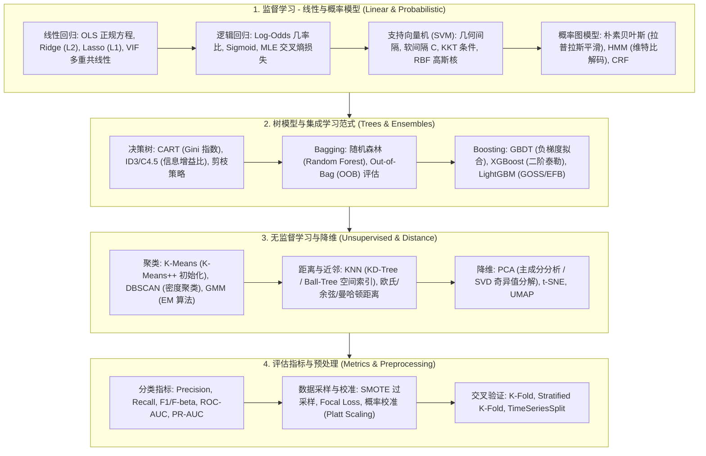
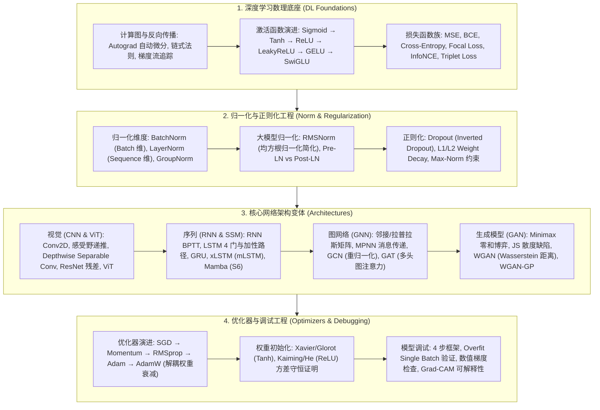
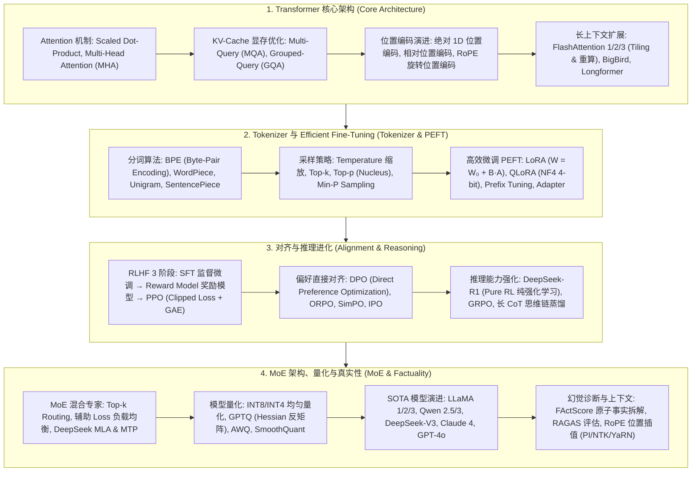
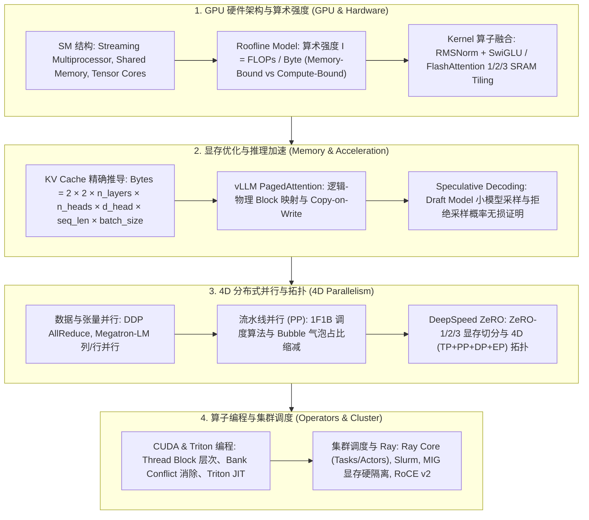
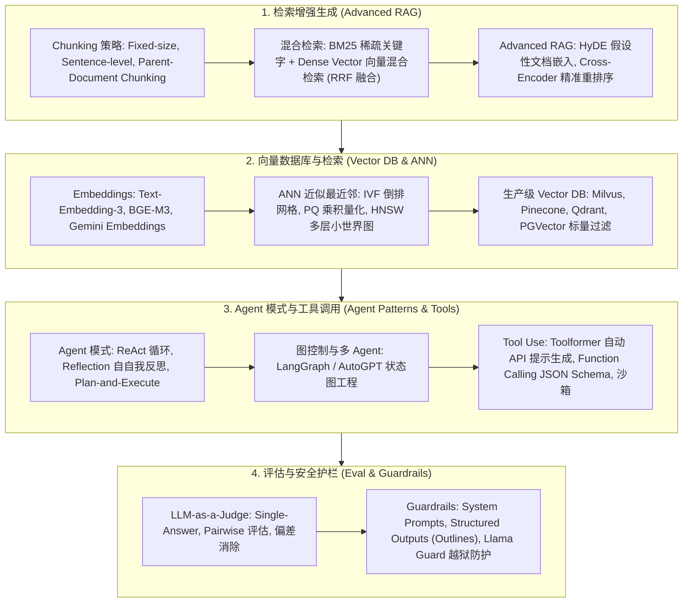
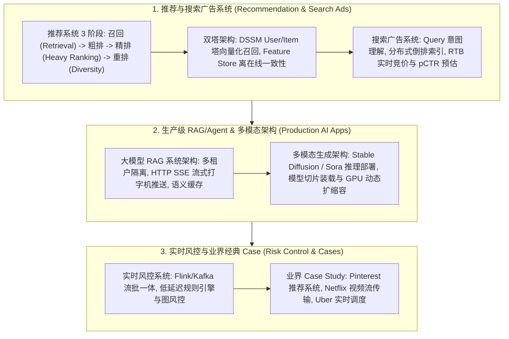
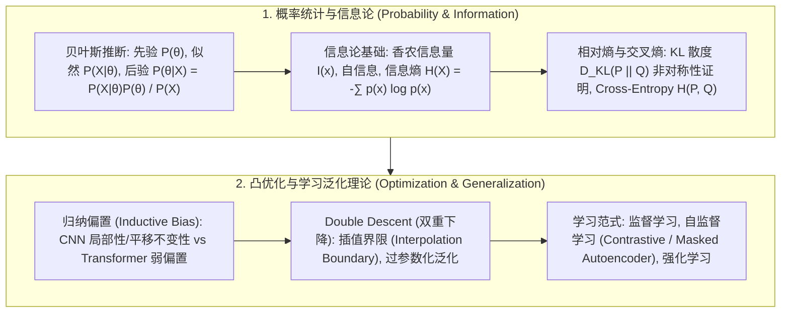

# 🌐 TalentMe AI 全景技术拓扑图与知识树 (Full Taxonomy)

> **导读与全景视野**：现代人工智能已经形成由数理基础、深度模型、算力基础设施（AI Infra）、应用工程（AI Engineering）与工业级系统案例组成的庞大体系。本文档作为 TalentMe 前端 Tech Vault 的总纲性技术拓扑图，将 9 大核心子领域的知识图谱全量展开。

---

## 📊 1. 机器学习算法与数理基础 (ML Taxonomy)

---

## 🧠 2. 深度学习基础与网络架构 (DL Taxonomy)

---

## ⚡ 3. 大语言模型体系 (LLM Taxonomy)

---

## ⚡ 4. AI 基础设施与算力工程 (AI Infra Taxonomy)

---

## 🤖 5. AI 应用工程与 Agent 架构 (AI Engineering Taxonomy)

---

## 🏗️ 6. 工业级系统设计案例 (Industry System Design Taxonomy)

---

## 📐 7. AI 数理基础与泛化理论 (Math Taxonomy)

