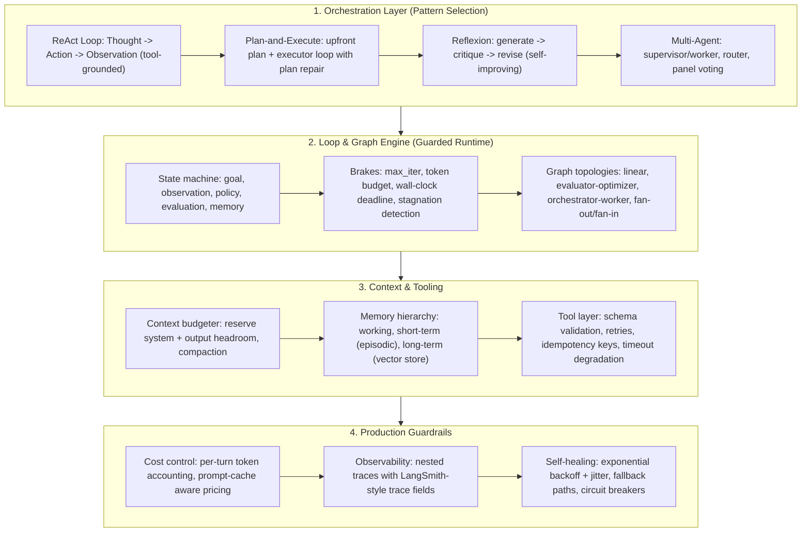

# 🤖 AIE Agent Systems in Production: Orchestration Patterns, Context Budgeting, Reliability & Observability

> **Core Executive Summary**: An agent is a loop — goal, observation, policy, action, memory — but a production agent is a *guarded* loop. This guide covers the engineering stack for shipping reliable LLM agents: orchestration patterns (ReAct, Plan-and-Execute, Reflexion, Multi-Agent), loop and graph engineering with hard termination guarantees, context engineering as finite-resource budgeting, tool-call reliability, per-turn cost and latency accounting, and LangSmith-style trace observability. The recurring theme: **bound everything — iterations, tokens, time, money — or the loop owns you.**

---

## 💡 Interactive Mermaid Architecture Flowchart



---

## 💡 Classic Interview Followups & Core Cheatsheet

* **Key Topic 1**: Compare ReAct, Plan-and-Execute, and Reflexion. How do you decide?
  * *Standard Answer*: **ReAct** interleaves thought and tool calls in one loop — flexible and transparent for open-ended tasks, but token-hungry and prone to oscillation. **Plan-and-Execute** writes a full plan upfront then runs cheap executor steps — predictable cost, but plans go stale under dynamic conditions, so plan-repair logic is mandatory. **Reflexion** adds a critic step (generate → critique → revise), improving code/writing quality at a 2-3x cost multiplier. Rule of thumb: fixed tasks use a pipeline; known subtasks use Plan-and-Execute; unknown paths use ReAct; add Reflexion where a verifier exists; prefer Multi-Agent only for genuinely parallel or isolated subtasks — coordination overhead usually exceeds the benefit.

> 💡 **Intuition**: Pattern selection is a cost × flexibility trade — ReAct is an explorer who thinks while walking (flexible but token-hungry); Plan-and-Execute is a tour group that reads the map first (cheap but maps go stale); Reflexion is 'have an editor review your draft' (higher quality, 2-3x the calls); Multi-Agent is starting a company (parallel departments, but management overhead usually eats the gains).
>
> 🎤 **30-Second Answer**: "Conclusion: fixed paths use a pipeline, known subtasks use Plan-and-Execute, unknown paths use ReAct, verifiers invite Reflexion, and Multi-Agent only for genuinely parallel or isolated work. Mechanism: ReAct interleaves thought-action-observation at high token cost with oscillation risk; Plan-and-Execute caps cost but needs plan repair; Reflexion adds a critic at a 2-3x call multiplier. Example: code generation with a test-suite verifier — Reflexion lifts pass rate from 45% to 70% in 3 iterations; with only 2 subtasks, don't use Multi-Agent — a single loop is cheaper. Key: an orchestration decision is a token-budget decision."

* **Key Topic 2**: How do you guarantee an agent loop terminates?
  * *Standard Answer*: Never rely on the model to stop — enforce a hard *triple bound*: (1) iteration cap $N_{\max}$; (2) token budget $B_t$ checked before every LLM call, preventing context overflow and runaway cost; (3) wall-clock deadline with per-call timeouts. Add **stagnation detection**: track a progress metric $m_t$ and terminate when $\Delta m = m_t - m_{t-k} < \epsilon$ for $k$ consecutive steps — an agent can be busy yet converged nowhere. Every termination path emits a structured final state with a `reason_code` (success / budget / stagnation / error) so orchestration can escalate to human, retry with another pattern, or accept the partial result.

> 💡 **Intuition**: An agent loop is a self-driving car without brakes — never trust the model to stop itself. Install three hard brakes: an iteration cap (against infinite loops), a token budget (against burning money and overflowing context), and a wall-clock deadline (against external timeouts). Then add a progress radar: an agent can be busy yet converged nowhere — stagnation detection watches for 'no real progress for k consecutive rounds'.
>
> 🎤 **30-Second Answer**: "Conclusion: a triple hard bound plus stagnation detection guarantees termination. Mechanism: iteration cap N_max kills oscillating loops; token budget B_t is checked before every LLM call; wall-clock deadline plus per-call timeouts; stagnation detection tracks a progress metric m_t and terminates when Δm < ε for k consecutive rounds. Example: a search agent capped at 30 iterations, 50k tokens, 2 wall-clock minutes — after 3 zero-progress rounds with a ToolTimeout on round 4, it returns a partial result with reason_code='stagnation' for human escalation. Every exit path emits a structured final state, never a dangling exception."

* **Key Topic 3**: Design a context budget for a long-running agent. What happens when the window fills?
  * *Standard Answer*: Treat the window as a ledger: reserve $S$ (system prompt), $T$ (tool schemas), $O_{\min}$ (output headroom); the dynamic budget is $B_t = C_{\text{ctx}} - S - T - O_{\min}$. When exhausted, compact in safe order: (1) clear tool results (highest volume, lowest value — the safest tokens to drop), (2) summarize oldest turns into a rolling digest, (3) evict non-goal context — never the goal or the latest turn. Offload durable facts to short-term memory and re-fetch long-term context on demand. The critical failure mode is silent truncation of essential state.

> 💡 **Intuition**: The context window is a desk — the system prompt is a pinned sticky note (reserved), tool schemas are frequently used tools (reserved), and output headroom is 'always keep paper to write the answer'. When the desk fills up, clean in safe order: throw away tool outputs first (biggest, least valuable), condense old turns into summaries, and only last touch the goal and the latest turn. The nightmare is panicking and throwing away the goal file — silent truncation of critical state.
>
> 🎤 **30-Second Answer**: "Conclusion: budget B_t = C_ctx − S − T − O_min; when full, compact in order: tool results → rolling summaries of old turns → non-goal context. Mechanism: tool results are highest volume and lowest value, clear them first; oldest turns become a rolling digest; the goal and latest turns are always last; durable state offloads to short/long-term memory. Example: a 128k window with 24k reserved and ~800 tokens per step fills after ~130 steps — at step 100, clear 20k of tool results, then summarize 50 turns into a 600-token digest, keeping the goal and the last 5 turns intact. Failure mode to avoid: the goal itself getting truncated — the budgeter must evict everything but the goal first."

* **Key Topic 4**: How do you make tool calls reliable in production?
  * *Standard Answer*: Four layers. (1) **Validation**: JSON-schema-validate arguments before execution and before any side effect; on schema error return a structured error and let the model self-correct. (2) **Retries**: exponential backoff + jitter, capped attempts, applied only to idempotent calls. (3) **Idempotency**: attach an idempotency key derived from the step/turn ID so a retry replays the cached result instead of duplicating the side effect. (4) **Timeout degradation**: every call gets a per-call deadline; on timeout return a structured `ToolTimeout` observation with suggested fallbacks — never an unhandled exception.

> 💡 **Intuition**: Tool-call reliability is an elevator with four safety systems — check credentials first (schema validation, so bad arguments never open the door), re-press the button with a backing-off rhythm (exponential backoff), repeated presses never double-charge (idempotency), and every ride has its own time limit (timeout degradation). The goal: no single flaky dependency may crash the whole task.
>
> 🎤 **30-Second Answer**: "Conclusion: four layers — validation, retry, idempotency, timeout degradation. Mechanism: JSON-schema validates arguments before any side effect and returns structured errors for the model to self-correct; retries with exponential backoff + jitter and capped attempts apply to idempotent calls only; non-idempotent tools (POST) carry an idempotency key so a retry replays the cached result; every call gets its own deadline and on timeout returns a ToolTimeout observation plus fallback suggestions. Example: a payment tool times out — first check the idempotency key: if it exists, return the cached result instead of charging twice; after 3 failures, degrade to a read-only balance check. Never throw unhandled exceptions."

* **Key Topic 5**: How would you observe and evaluate an agent in production?
  * *Standard Answer*: Trace every step as a nested span (LangSmith-style): `trace_id`, `parent_run_id`, `name`, `inputs`/`outputs`, `start_time`/`end_time`/`latency_ms`, `tokens` (prompt/completion/cache), `status`, `metadata`. Aggregate two families of metrics: per-step efficiency (tokens per turn, latency p50/p95, cache hit rate) and outcome quality (task success rate, reason-code distribution, human-approval rate). The failure trace is the most actionable artifact — replay the trajectory to find the exact observation that derailed the loop.

> 💡 **Intuition**: Observing an agent is like equipping the pilot with a black box — every step is logged as a nested span, so the entire flight path can be replayed afterwards. The most valuable asset isn't the success story but the failure trace: replaying 'which observation derailed the loop' beats guessing at prompt tweaks by an order of magnitude.
>
> 🎤 **30-Second Answer**: "Conclusion: log every step as a LangSmith-style nested span and aggregate two metric families — per-step efficiency and outcome quality. Mechanism: each span captures trace_id, parent_run_id, name, inputs/outputs, start/end time, latency_ms, tokens (prompt/completion/cache), status, metadata; efficiency reads tokens-per-turn, p50/p95 latency, cache hit rate; quality reads task success rate and reason-code distribution. Example: 70% task success with 40% of terminations coded 'stagnation' — replaying failure traces shows round 3's tool returned truncated JSON that spun the loop; fixing the parser lifts success to 85%. The failure trace is the primary artifact for making agents better."

---

## 📚 Section 1: Agent Orchestration Patterns

### 1.1 Pattern Comparison Table

| Pattern | Core Loop | Strengths | Failure Modes | Production Choice |
| :--- | :--- | :--- | :--- | :--- |
| **ReAct** | Thought → Action → Observation, repeated | Tool-grounded, flexible, transparent | Token burn, oscillation, hallucinated actions | Open-ended tool use, search & research |
| **Plan-and-Execute** | Plan upfront → execute steps → repair plan | Cheap steady-state, predictable cost | Stale plans, brittle replanning | Well-specified multi-step tasks |
| **Reflexion** | Generate → critique → revise + failure memory | Higher quality, self-correcting | 2-3x LLM calls, drift, over-revision | Code gen, writing, eval-revise loops |
| **Multi-Agent** | Supervisor/router fan-out to specialist agents | Parallelism, isolation, modularity | Coordination overhead, message cost, cascade failures | Parallel subtasks, role separation |

> **How to read this table**: Read each row horizontally as the four elements of a pattern — loop, strengths, failure modes, production choice. When asked 'how do you choose', quote the Production Choice column and add the trade-off: ReAct costs tokens, Reflexion costs calls, Multi-Agent costs coordination — selection is a cost account.

### 1.2 The Formal Agent Loop

Every pattern is an instance of a feedback-controlled state machine. Let $s_t = (\text{goal}, \text{observation}, \text{context}, \text{memory})$; the policy $\pi$ is the LLM, the environment $\mathcal{E}$ is the tool layer plus the outside world:

$$s_{t+1} = \mathcal{E}\Big(\text{Act}\big(\pi(s_t)\big)\Big)$$

Each ReAct iteration consumes a predictable token slice — prompt, reasoning, tool schema, result:

$$N_t = N_{\text{prompt}} + N_{\text{reason}} + N_{\text{tool}} + N_{\text{obs}}$$

Pattern choice therefore sets the *expected token trajectory* $\mathbb{E}[T \cdot N_t]$: Plan-and-Execute minimizes $T$ on stable tasks, ReAct maximizes flexibility, Reflexion multiplies $T$ by the critic passes.

> 💡 **Intuition**: Abstract the agent as a 'state machine with feedback control' — goal, observation, context, and memory are the state, the LLM is the policy, and tools plus the outside world are the environment. The point of the abstraction: pattern choice is not only an accuracy question but a **budget question** $\mathbb{E}[T \cdot N_t]$, with each round's token spend predictably split into four slices: prompt + reasoning + tool schema + observation.
>
> 🎤 **30-Second Answer**: "Conclusion: every pattern is the same feedback state machine s_{t+1} = E(Act(π(s_t))), and each round costs tokens = prompt + reasoning + tool schema + observation. Mechanism: use the formalism to compare patterns — Plan-and-Execute shortens the number of rounds T with cheaper steps, ReAct stays flexible with variable T, Reflexion multiplies T by a constant. Example: for the same 10-step task, ReAct ≈ 10 rounds × 2k tokens, Plan-and-Execute ≈ 5 × 1.5k, Reflexion ≈ 12 × 2k — a one-line cost model. Interview bonus: compute these numbers on the spot."

---

## ⚡ Section 2: Loop & Graph Engineering

### 2.1 Guarded Termination

A production loop needs hard brakes, expressible as one effective iteration ceiling:

$$T_{\max} = \min\left( N_{\max},\ \left\lfloor \frac{B_{\text{tokens}}}{N_{\text{step}}}\right\rfloor,\ \left\lfloor \frac{t_{\text{deadline}}}{t_{\text{step}}} \right\rfloor \right)$$

| Guard | Unit | Protects Against |
| :--- | :--- | :--- |
| Iteration cap $N_{\max}$ | steps | Infinite / oscillating loops |
| Token budget $B_{\text{tokens}}$ | tokens | Context overflow, runaway cost |
| Wall-clock deadline $t_{\text{deadline}}$ | seconds | SLO breaches, stuck tool calls |

> **How to read this table**: The three guards cover three ways to die — the iteration cap stops infinite loops, the token budget stops runaway cost and context overflow, the wall-clock deadline stops SLO breaches and stuck tools. In a termination interview answer, cite this table first, then add stagnation detection — that's the complete answer.

Beyond the ceilings, **stagnation detection** terminates loops that are busy but not converging, and every termination path (success, budget hit, stagnation, error) emits a structured final state with a `reason_code` so downstream orchestration can branch.

### 2.2 Graph Topologies as Structured Loops

When loops need fan-out, barriers, or multiple roles, they become graphs (LangGraph-style state machines) keeping the same guards on every cyclic region:

| Topology | Structure | Production Use Case |
| :--- | :--- | :--- |
| Linear pipeline | A → B → C | Fixed preprocessing → generation → validation |
| Evaluator-Optimizer | generator ⇄ judge | Code / writing improvement with a verifier |
| Orchestrator-Worker | O fans out, barrier, reducer aggregates | Parallel subtasks with isolated context |
| Router | classifier picks one branch | Tiered escalation, cheap vs. expensive path |
| Hierarchical | nested sub-graphs | Sub-agents with isolated context windows |

> **How to read this table**: Pick the topology by the task's structure — fixed sequences walk a linear pipeline, judged work uses evaluator-optimizer, parallel subtasks use orchestrator-worker, conditional branching uses a router. One discipline runs through all: keep probabilistic nodes (LLM calls) separate from deterministic nodes (barriers/reducers/validators), and keep the evaluator outside the thing it evaluates.

Graph discipline: separate probabilistic nodes (LLM calls) from deterministic nodes (reducers, barriers, validators), and keep the verification boundary outside the thing being verified — the evaluator must not be manipulable by the agent it judges.

> 💡 **Intuition**: Graph orchestration upgrades the loop into a structured factory line — fan out when parallel work is needed, raise a barrier when steps must synchronize, reduce when results must merge. The discipline is separating 'LLM nodes that can make things up' from 'deterministic engineering nodes we can trust': barriers and reducers are code, and the verifier must be independent of what it verifies.
>
> 🎤 **30-Second Answer**: "Conclusion: choose the graph topology by task structure — linear/evaluator-optimizer/orchestrator-worker/router/hierarchical; keep LLM nodes separate from deterministic nodes. Mechanism: fan-out, barriers, and reducers handle parallelism and aggregation; an independent evaluator prevents manipulation. Example: a code-generation task fans out 4 isolated subtasks (2k context each), waits at a barrier, merges diffs with a reducer, then a separate verifier LLM plus test cases gate the result before return. Follow-up: why can't the verifier be the same agent? — a poisoned or biased agent reinforces itself; maker/checker must be split."

---

## 🧠 Section 3: Context Engineering

### 3.1 Token Budgeting as a Resource Ledger

Context is a finite resource per call — model the window as a ledger with fixed reservations:

$$B_t = C_{\text{ctx}} - S - T - O_{\min}, \qquad C_{\text{used}} + N_t^{\text{out}} \le C_{\text{ctx}} - S - T$$

where $S$ = system prompt, $T$ = tool schemas, $O_{\min}$ = guaranteed output headroom. When $C_{\text{used}}$ approaches the ceiling, compact in safe order: clear tool results, summarize oldest turns, then evict non-goal context — never the goal or the latest turn. Long-horizon agents keep a **durable state store** so compaction never destroys recoverable state.

> 💡 **Intuition**: The context ledger = fixed reservations (system prompt S, tool schemas T, output headroom O_min) plus a dynamic budget B_t. Compaction is a safety-first eviction chain: throw out the biggest, least valuable tool results first, condense old turns into summaries, and only last touch the goal — like cleaning a desk by trashing takeout boxes, then folding old papers, and only deciding about the important files at the end. A durable state store guarantees that 'what we throw away is just the desk copy; the drawer still holds the original'.
>
> 🎤 **30-Second Answer**: "Conclusion: budget B_t = C_ctx − S − T − O_min; compaction order = tool results → rolling summaries → non-goal context. Mechanism: tool results are the biggest and least valuable so they go first; oldest turns become rolling digests; the goal and the latest turn are never touched until last; a durable state store (notes/artifacts/plan) keeps compaction recoverable. Example: a 128k window with 24k reserved at ~800 tokens per step exhausts its dynamic budget of 104k after ~130 steps — at step 100, clear 20k of tool results, compress 50 turns into a 600-token digest, leaving the goal and last 5 turns intact. Follow-up: summaries lose detail — offload high-value facts to short-term memory before summarizing."

### 3.2 Memory Hierarchy and KV-Cache Cost

| Tier | Storage | Access | Eviction Policy |
| :--- | :--- | :--- | :--- |
| Working context | In-window tokens | Direct read | Compaction / summarization |
| Short-term (episodic) | Session log (DB/Redis) | Recency query | TTL + top-K |
| Long-term (semantic) | Vector store | Similarity search | Re-ranking, decay, dedup |

> **How to read this table**: Three memory tiers = 'at hand (window) → drawer (session log) → archive (vector store)', with access speed decreasing and capacity increasing. When asked 'how would you design agent memory', walk these three tiers, then add the KV-cache point: the ceiling on working context isn't the window, it's the GPU memory.

Each call also pays a KV-cache memory price that grows with context length — the practical ceiling on working-context size:

$$\text{KV}_{\text{cache}} = 2 \times L \times H_{kv} \times N \times B \times b \quad \text{(bytes)}$$

For $L = 32$ layers, $H_{kv} = 8$ KV heads, $N = 8192$ tokens, batch $B = 4$, FP16 ($b = 2$): $2 \times 32 \times 8 \times 8192 \times 4 \times 2 \approx 33.5$ MB per request — trivial alone, but it scales linearly with batch and context length, which is why long contexts are memory-bound and **prompt caching** (reusing the prefix KV) is the first lever to pull.

> 💡 **Intuition**: The KV cache is 'what attention must remember' — every token's K and V stay resident so later tokens can query them. The formula KV = 2 × L × H_kv × N × B × b multiplies layers, heads, sequence length, batch, and precision linearly — that's the mathematical root of 'long context is memory-bound'. Prompt caching reuses the prefix KV, computing the shared opening once and reading the cache afterwards.
>
> 🎤 **30-Second Answer**: "Conclusion: KV cache = 2·L·H_kv·N·B·b bytes, growing linearly with context length, and prompt caching is the first lever. Mechanism: K/V must reside in memory per layer per head — 32 layers × 8 KV heads × 8192 tokens × batch 4 × FP16 (2B) ≈ 33.5MB per request; doubling batch or length doubles it. Example: at batch 32 with 8k context, KV is ~268MB per request — 8 concurrent requests eat 27% of an 80GB GPU before any compute. Cache hits are priced ~10x cheaper than misses, so freezing system + tool schemas as a stable prefix cuts per-turn input cost ~90% after the first call."

### 3.3 Context Injection Attack Defense

The most dangerous vulnerability: **untrusted content (web pages, emails, tool outputs) entering the context and acting as instructions** (context poisoning / prompt injection). Defenses: (1) delimit untrusted content and tell the model it is *data, never instructions*; (2) sanitize or truncate tool outputs before injection; (3) attach provenance tags so the model distinguishes trusted from external content; (4) verify high-stakes actions independently (maker/checker split) so a poisoned observation cannot silently trigger a destructive tool call.

> 💡 **Intuition**: Prompt injection is 'killing with a borrowed knife' — malicious instructions hidden in web pages, emails, or tool outputs slip into the context and get executed as commands. Defense is layered: tag untrusted content as data (tell the model explicitly it's data, never instructions), sanitize/truncate tool outputs, and require two-person review (maker/checker) for high-impact actions so a single poisoned observation can't fire a destructive tool.
>
> 🎤 **30-Second Answer**: "Conclusion: four defenses — delimit untrusted content with strong markers, sanitize/truncate tool outputs, attach provenance tags, and independently verify high-stakes actions. Mechanism: injection is untrusted content acting as instructions; markers + sanitization + provenance let the model separate data from instructions; a maker/checker split stops one poisoned observation from triggering destructive tools. Example: an agent reading email then calling 'delete all emails' — the mail's malicious instruction is wrapped in <untrusted> markers, and delete-class operations require an independent checker's confirmation. Follow-up: high-impact tools (payment/delete) must always have independent verification, never rely on a prompt declaration alone."

---

## 🔧 Section 4: Tool Reliability & Self-Healing

### 4.1 The Four-Layer Reliability Stack

| Layer | Mechanism | Failure Mode Prevented |
| :--- | :--- | :--- |
| **Validation** | JSON-schema validation of arguments before execution | Malformed calls, side effects on bad args |
| **Retry** | Exponential backoff + jitter, capped attempts | Transient network / rate-limit failures |
| **Idempotency** | Idempotency key per turn; replay returns cached result | Duplicate side effects (double charge, double send) |
| **Timeout degradation** | Per-call deadline; structured `ToolTimeout` observation | Hanging calls, SLO breaches |

> **How to read this table**: The four layers map to four failure modes — validation stops bad arguments causing side effects, retry handles transient blips, idempotency prevents duplicate side effects, timeout degradation stops a hanging call from killing the task. Answer tool-reliability questions by walking the layers top-down with one failure scenario each.

### 4.2 Exponential Backoff Math

For transient failures, schedule attempt $i$ with capped exponential backoff plus jitter to avoid thundering-herd synchronization:

$$d_i = \min\left(d_{\max},\ d_0 \cdot \alpha^{i} + \text{jitter}\right)$$

If each attempt independently fails with probability $p$, failure after $r$ retries decays geometrically:

$$P_{\text{fail}}(r) = p^{(r+1)}$$

With $p = 0.2$ and $r = 3$: $P_{\text{fail}} \approx 1.6 \times 10^{-3}$ — but retrying a *non-idempotent* call multiplies side-effect risk instead of dividing it, so idempotency keys precondition aggressive retry policies. On retry exhaustion, **degrade gracefully**: return a partial result, switch to a cheaper fallback path, or route to a human — never fail the whole task on one flaky dependency.

> 💡 **Intuition**: Exponential backoff is 'wait longer and longer after each failure' — 1s → 2s → 4s → 8s — plus jitter so clients don't resync into a thundering herd. The math is elegant: with independent failure probability p per attempt, the chance of failure after r retries is p^(r+1), decaying exponentially. But for non-idempotent calls, retrying is doubling down — which is why idempotency keys precondition aggressive retry policies.
>
> 🎤 **30-Second Answer**: "Conclusion: backoff d_i = min(d_max, d_0·α^i) + jitter, failure after r retries = p^(r+1); idempotency keys must precede retries of non-idempotent calls. Mechanism: jitter breaks synchronized retries; with p=0.2 and r=3, failure probability drops to ~1.6e-3. Example: a 429 rate limit — back off 1s→2s→4s with 10% jitter and succeed on try 3; but if the failing call is a charge endpoint, replay the cached result via its idempotency key instead of charging again on every retry. After exhaustion, degrade: partial results, a cheaper path (search-only instead of executing code), or route to a human."

---

## 💰 Section 5: Cost, Latency & Observability

### 5.1 Per-Turn Token Cost Accounting

With input price $P_{\text{in}}$ and output price $P_{\text{out}}$ per token, a run of $T$ steps costs:

$$C_{\text{run}} = \sum_{t=1}^{T} \left( N_t^{\text{in}} \cdot P_{\text{in}} + N_t^{\text{out}} \cdot P_{\text{out}} \right)$$

Two levers dominate. (1) **Prompt caching**: cache reads are priced ~10x cheaper than misses, so structuring the system prompt and tool schemas as a stable cached prefix turns the dominant term into a cache-hit price for every turn after the first. (2) **Concurrency with backpressure**: bound parallel tool calls and agent instances with a queue so bursty loops cannot blow the rate limit — or starve the fleet. Latency follows the same budget: batch independent tool calls in one step (parallel tool use), and keep the working context small since prefill time scales near-linearly with prompt length.

> 💡 **Intuition**: In the agent cost formula C_run = Σ(N_in·P_in + N_out·P_out), the dominant term is per-turn input tokens. Two levers: prompt caching drops the read price of the stable prefix (system + tool schemas) to ~1/10, and concurrency with backpressure bounds simultaneous calls with a queue so bursty loops can't blow the rate limit. Latency follows the same discipline — fire independent tool calls in parallel within a step and keep the working context lean.
>
> 🎤 **30-Second Answer**: "Conclusion: cost = Σ over turns of (input tokens × P_in + output tokens × P_out); two levers — prompt caching and concurrency with backpressure. Mechanism: cache hits price at ~10x cheaper than misses, so structuring system/tool schemas as a stable cached prefix turns the dominant term into a cache-hit price after turn one; queues bound parallel calls and agent instances. Example: a 10-step run at 2k input + 500 output tokens per step, input $3/M, output $15/M: uncached ≈ 10×(2k×3 + 0.5k×15)/1e6 = $0.135; with caching the input share drops ~90% → $0.046. Follow-up: batch independent tool calls in one step and keep context small — prefill time grows near-linearly with prompt length."

### 5.2 LangSmith-Style Trace Fields

| Trace Field | Captured Value | Diagnostic Use |
| :--- | :--- | :--- |
| `trace_id` / `parent_run_id` | Nested span hierarchy | Reconstruct the full trajectory |
| `name` | chain / agent / tool node | Step-type distribution |
| `inputs` / `outputs` | Serializable snapshots | Replay, debugging bad observations |
| `start_time` / `end_time` / `latency_ms` | Timing per node | p50/p95 latency, timeout detection |
| `tokens` | prompt / completion / cache read-write | Cost attribution per step |
| `status` | success / error / timeout | Error-rate SLO, reason-code analysis |
| `metadata` | session, tags, agent version | Grouping, A/B comparison |

> **How to read this table**: This is the 'black box for your agent' field checklist — each row answers one interview follow-up: reconstructing trajectories (trace_id/parent_run_id), locating latency (latency_ms), attributing cost (tokens), quantifying failure (status + reason codes). Evaluate two metric families together — per-step efficiency and outcome quality — and treat the failure trace as the most actionable improvement asset.

Evaluate both outcome and trajectory: task success rate, steps-per-task, tokens-per-task, terminal reason-code distribution, and the failure trace itself — the most actionable artifact for making agents better.

---

## 🐍 Section 6: Pure Numpy Implementation — Agent Loop Budget & Backoff Simulator

```python
import numpy as np


def simulate_agent_loop(
    ctx_window: int = 128_000,
    reserved: int = 24_000,          # system prompt + tool schemas + output headroom
    step_tokens_mean: float = 800.0,
    step_tokens_std: float = 250.0,
    max_iterations: int = 50,
    stagnation_threshold: int = 5,
    seed: int = 42,
) -> dict:
    rng = np.random.default_rng(seed)
    budget = ctx_window - reserved          # dynamic token budget B_t
    tokens_used = 0
    iterations = 0
    stagnation = 0
    reason = "success"

    for _ in range(1, max_iterations + 1):
        step_tokens = int(max(0.0, rng.normal(step_tokens_mean, step_tokens_std)))
        if tokens_used + step_tokens > budget:      # token budget guard
            reason = "token_budget_exhausted"
            break
        tokens_used += step_tokens
        iterations += 1

        gain = rng.random() * 0.3                   # simulated progress metric
        if gain < 0.01:
            stagnation += 1
            if stagnation >= stagnation_threshold:  # stagnation guard
                reason = "stagnation_detected"
                break
        else:
            stagnation = 0

    return {
        "iterations": iterations,
        "tokens_used": tokens_used,
        "budget": budget,
        "remaining": budget - tokens_used,
        "termination": reason,
    }


def exponential_backoff(
    attempt: int,
    base: float = 1.0,
    factor: float = 2.0,
    cap: float = 60.0,
    jitter_ratio: float = 0.1,
    seed: int = 0,
) -> float:
    """d_i = min(d_max, d_0 * alpha^i) + jitter — capped exponential backoff."""
    rng = np.random.default_rng(seed + attempt)
    delay = min(cap, base * factor ** attempt)
    return round(delay + rng.uniform(0.0, jitter_ratio * delay), 3)


if __name__ == "__main__":
    np.random.seed(42)
    result = simulate_agent_loop(step_tokens_mean=900.0)
    print("✅ Agent Loop Simulation:", result)

    # Failure probability after r retries with per-attempt failure rate p=0.2
    p = 0.2
    for r in range(5):
        print(f"Retries={r}: P_fail={p ** (r + 1):.5f}, next delay={exponential_backoff(r)}s")
```

The simulator encodes the two most important production lessons: the loop always terminates via an *explicit guard* (token budget, iteration cap, or stagnation detection), and retries always follow capped, jittered backoff — every failure path is a designed path, not a crash.

---

## 📝 Takeaways & Engineering Best Practices

1. **Pattern selection is a cost model**: pick ReAct for unknown paths, Plan-and-Execute for known subtasks, Reflexion where a verifier exists, Multi-Agent only for genuinely parallel or isolated work — the orchestration decision *is* a token-budget decision.
2. **Guarantee termination with a triple bound**: iteration cap, token budget, wall-clock deadline, plus stagnation detection — never let the model be the only reason the loop stops.
3. **Budget context as a ledger**: reserve system/tools/output headroom, compact tool results first, and offload durable state to short/long-term memory before it is lost.
4. **Make every tool call fail gracefully**: validate → retry with backoff → enforce idempotency → degrade on timeout; a flaky dependency must never kill the task.
5. **Trace everything, evaluate the trajectory**: capture LangSmith-style span fields per step, attribute cost per turn with cache-aware pricing, and treat the failure trace as the primary improvement artifact.
