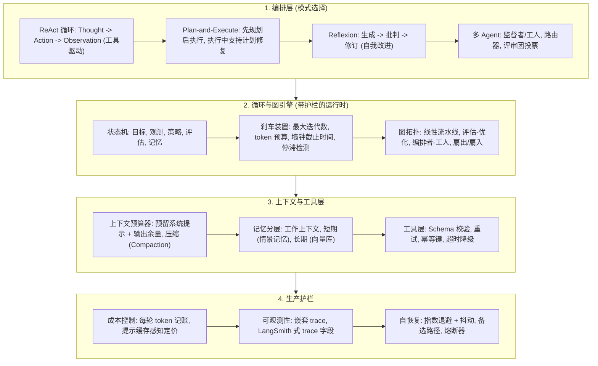

# 🤖 AIE Agent 生产系统:编排模式、上下文预算、可靠性工程与可观测性

> **核心摘要**：Agent 本质是一个循环——目标、观测、策略、行动、记忆——但生产级 Agent 是一个**带护栏的循环**。本指南覆盖 LLM Agent 上线的完整工程栈：编排模式（ReAct / Plan-and-Execute / Reflexion / 多 Agent）、具备硬终止保证的循环与图式编排工程、把上下文窗口当作有限资源做预算的上下文工程、工具调用四层可靠性（校验/重试/幂等/超时降级）、每轮 token 成本与延迟核算，以及 LangSmith 式 trace 可观测性。贯穿全篇的核心思想是：**给一切上界——迭代数、token、时间、金钱——否则循环将反噬你。**

---

## 💡 交互式 Mermaid 架构流程图



---

## 💡 经典面试追问与考点速查

* **考点 1**：对比 ReAct、Plan-and-Execute 与 Reflexion,生产环境应如何选择？
  * *标准回答*：**ReAct** 在单一循环中交替"思考-行动-观测"，对开放式、工具驱动的任务（搜索 → 推理 → 行动）最灵活，代价是 token 消耗大、可能循环振荡。**Plan-and-Execute** 先一次性生成完整计划再执行廉价步骤，成本稳定可预测，但动态环境下计划会过期，需要计划修复逻辑。**Reflexion** 增加批判者步骤（生成 → 批判 → 修订），在代码/写作任务上显著提升质量，但 LLM 调用量放大 2-3 倍。**经验法则**：任务路径固定用流水线；子任务已知用 Plan-and-Execute；路径未知用 ReAct；存在验证器时加 Reflexion；只有当子任务真正可并行或需要隔离时才上多 Agent——其协调开销往往超过收益。

> 💡 **直观理解**：编排模式选择本质是"成本 × 灵活性"的权衡——ReAct 像边想边走的探险家（灵活但烧 token）；Plan-and-Execute 像先看地图再行动的旅行团（省 token 但地图会过期）；Reflexion 像"写完后请编辑审稿"（质量高但调用翻倍）；多 Agent 像开公司（部门并行，但管理成本常常吃掉收益）。
>
> 🎤 **面试速答**："结论：路径固定用流水线，子任务已知用 Plan-and-Execute，路径未知用 ReAct，有验证器加 Reflexion，真正可并行才上多 Agent。原理：ReAct 交替思考-行动-观测，token 消耗大且可能振荡；Plan-and-Execute 先规划后执行、成本可预测但需计划修复；Reflexion 加批判者、质量高但调用放大 2-3 倍。例子：代码生成任务带测试用例验证器 → Reflexion 迭代 3 轮通过率从 45% 升到 70%；多 Agent 在只有 2 个子任务时不要用——单 Agent 循环更便宜。关键：编排决策就是 token 预算决策。"

* **考点 2**：如何保证 Agent 循环必然终止？
  * *标准回答*：绝不依赖模型自己停止，必须施加**三重硬上界**：(1) **迭代上限** $N_{\max}$；(2) **token 预算** $B_t$，每次调用前检查，防止上下文溢出与账单失控；(3) **墙钟截止时间**与每次调用的超时。在此之上加**停滞检测**：维护进度指标 $m_t$（如已解决的测试用例、匹配的事实数），当连续 $k$ 轮 $\Delta m < \epsilon$ 时升级或终止——Agent 可能"很忙但毫无进展"。每一条终止路径都必须产出结构化最终状态（部分结果 + reason 码），而不是悬空的异常。

> 💡 **直观理解**：Agent 循环像"没有刹车的自动驾驶"——绝不能指望模型自己停，必须装三道硬刹车：迭代上限（防死循环）、token 预算（防烧钱与上下文溢出）、墙钟截止（防外部超时）。再加"进度雷达"：Agent 可能很忙但毫无进展，停滞检测就是看"连续几轮有没有实质进展"。
>
> 🎤 **面试速答**："结论：三重硬上界 + 停滞检测，保证循环必然终止。原理：迭代上限 N_max 防振荡循环；token 预算 B_t 每次调用前检查；墙钟截止时间配每次调用超时；停滞检测维护进度指标 m_t，连续 k 轮 Δm < ε 即终止。例子：搜索型 Agent 上限 30 轮、token 预算 50k、墙钟 2 分钟，某轮工具返回超时被标记 ToolTimeout，累计 3 次无进展 → 以 reason_code='stagnation' 返回部分结果并升级人工。每一条退出路径都要产出结构化最终状态，而不是抛异常。"

* **考点 3**：为长任务 Agent 设计上下文窗口预算。上下文写满时怎么办？
  * *标准回答*：把上下文窗口当作有限资源做**记账**：为系统提示 $S$、工具 schema $T$、输出余量 $O_{\min}$ 预留固定配额，动态预算为 $B_t = C_{\text{ctx}} - S - T - O_{\min}$。写满时按安全顺序压缩：(1) 先清空工具结果（体量最大、价值最低，是最安全的可丢弃 token）；(2) 将最旧轮次汇总成滚动摘要；(3) 把持久事实卸载到短期存储，只保留窗口内摘要；超出窗口的信息走长期检索按需取回。最要避免的失败模式是**静默截断关键状态**（如目标本身被截掉）——预算器必须优先淘汰非目标上下文。

> 💡 **直观理解**：上下文窗口是"办公桌"——系统提示是固定贴纸（预留），工具 schema 是常用工具（预留），输出余量是"总要留点纸写答案"。桌面满了就按安全顺序清理：先丢工具输出（最大最不值钱），再把旧轮次浓缩成摘要，最后才动目标和最近轮次。最怕的是"手忙脚乱把目标文件扔了"——静默截断关键状态。
>
> 🎤 **面试速答**："结论：预算 B_t = C_ctx − S − T − O_min，写满时按'工具结果 → 旧轮摘要 → 非目标上下文'的顺序压缩。原理：工具结果体量最大、价值最低，最先清；最旧轮次汇总成滚动摘要；目标与最近轮次永远最后动；持久状态卸载到短/长期记忆。例子：128k 窗口预留 24k，每轮约 800 token，约 130 轮后写满——第 100 轮时先清空工具结果，再对前 50 轮生成 500 token 摘要。失败模式：目标本身被截掉，Agent 会"忙着做错的事"——预算器必须保护非目标之外的一切。"

* **考点 4**：如何保证生产环境工具调用的可靠性？
  * *标准回答*：四层防线。(1) **校验**：执行前用 JSON Schema 校验参数（且必须在任何副作用之前校验），schema 错误时返回结构化校验错误让模型自我纠错，绝不执行半解析的调用。(2) **重试**：只对幂等操作重试，采用指数退避 + 抖动并限制尝试次数。(3) **幂等**：对 POST 类非幂等工具，附加由轮次/步骤 ID 派生的幂等键，重试时直接回放缓存结果，避免重复副作用。(4) **超时降级**：每次工具调用都有独立截止时间，超时返回结构化 `ToolTimeout` 观测并给出备选建议（走更便宜路径、降级为仅搜索），绝不抛出未处理异常。

> 💡 **直观理解**：工具调用可靠性像"电梯四道保险"——先查证件（schema 校验，防止参数错误就开门），失败后按退避节奏重按按钮（指数退避），重复按钮不会重复扣钱（幂等键），每趟电梯有独立到点时间（超时降级）。目标：任何单点抖动都不能让整个任务崩溃。
>
> 🎤 **面试速答**："结论：四层防线——校验、重试、幂等、超时降级。原理：JSON Schema 在副作用前校验参数，错误返回结构化信息让模型自纠；只对幂等操作重试，指数退避 + 抖动 + 限次；非幂等工具（POST）挂幂等键，重试回放缓存结果；每次调用独立截止时间，超时返回 ToolTimeout 观测 + 备选路径。例子：支付类工具超时，先查幂等键是否存在——存在就直接返回缓存结果，避免重复扣款；连续失败 3 次走降级（只读余额不发起扣款）。原则：绝不抛未处理异常。"

* **考点 5**：生产环境中如何观测与评估 Agent？
  * *标准回答*：把每一步都记录为嵌套 span（LangSmith 式）：`trace_id`、`parent_run_id`、`name`（chain/agent/tool）、`inputs`/`outputs` 快照、`start_time`/`end_time`/`latency_ms`、`tokens`（提示/补全/缓存读写）、`status`（成功/异常/超时）、`metadata`（会话 id、标签）。聚合两类指标：**单步效率**（每轮 token、每任务调用数、延迟 p50/p95、缓存命中率）与**结果质量**（任务成功率、终止 reason 码分布、人工批准率）。最有价值的资产是**失败 trace**——回放失败轨迹，看清是哪一条观测让循环跑偏，让迭代改进由数据驱动而非靠感觉。

> 💡 **直观理解**：观测 Agent 像给飞行员配黑匣子——每一步调用都记一个"带嵌套的日志卡片"（trace span），事后能完整重放整个飞行轨迹。最有价值的不是成功案例，而是失败轨迹：回放"哪一步观测让循环跑偏"，比拍脑袋调 prompt 有效十倍。
>
> 🎤 **面试速答**："结论：按 LangSmith 式嵌套 span 记录每一步，聚合单步效率与结果质量两类指标。原理：每个 span 采集 trace_id/parent_run_id/name/inputs/outputs/时间/latency_ms/tokens/status/metadata；效率指标看每轮 token、延迟 p50/p95、缓存命中率；质量指标看任务成功率、终止 reason 码分布。例子：任务成功率 70% 且 40% 终止码是 'stagnation'——回放失败 trace 发现第 3 轮工具返回了截断的 JSON 导致循环空转，修复解析器后成功率升到 85%。失败 trace 是让 Agent 变好的第一资产。"

---

## 📚 第一章:Agent 编排模式 (Orchestration Patterns)

### 1.1 四大编排模式对比表

| 模式 | 核心循环 | 优势 | 失败模式 | 生产选型 |
| :--- | :--- | :--- | :--- | :--- |
| **ReAct** | Thought → Action → Observation 循环往复 | 工具驱动、灵活、透明 | token 烧钱、振荡、幻觉行动 | 开放式工具使用、搜索与研究 |
| **Plan-and-Execute** | 先规划 → 执行步骤 → 修复计划 | 稳态成本低、成本可预测 | 计划过期、重规划脆弱 | 明确的复杂多步任务 |
| **Reflexion** | 生成 → 自我批判 → 修订 + 失败记忆 | 质量更高、自我纠错 | LLM 调用 2-3 倍、漂移、过度修订 | 代码生成、写作、评估-修订循环 |
| **多 Agent** | 监督者/路由器向专家 Agent 扇出 | 并行、隔离、模块化 | 协调开销、消息 token 成本、级联故障 | 并行子任务、角色分离 |

> **怎么读这张表**：四行横着读就是"模式 × 循环 × 优劣 × 选型"四要素。面试被问"怎么选"就报最后一列的"生产选型"并补一句权衡：ReAct 贵在 token、Reflexion 贵在调用次数、多 Agent 贵在协调——选择本质是算成本账。

### 1.2 统一形式化 Agent 循环

所有模式都是带反馈控制的状态机实例。设 $s_t = (\text{goal}, \text{observation}, \text{context}, \text{memory})$，策略 $\pi$ 为 LLM，环境 $\mathcal{E}$ 为工具层加外部世界：

$$s_{t+1} = \mathcal{E}\Big(\text{Act}\big(\pi(s_t)\big)\Big)$$

每一步 ReAct 迭代消耗可预测的 token 切片——提示 + 推理 + 工具 schema + 结果——因此单步成本核算（见第五章）必须写进循环契约：

$$N_t = N_{\text{prompt}} + N_{\text{reason}} + N_{\text{tool}} + N_{\text{obs}}$$

模式选择因此不仅决定准确率，更决定**期望 token 轨迹** $\mathbb{E}[T \cdot N_t]$：稳定任务上 Plan-and-Execute 最小化 $T$，ReAct 最大化灵活性，Reflexion 因批判轮次将 $T$ 乘以常数倍。

> 💡 **直观理解**：把 Agent 抽象成"状态机 + 反馈控制"——目标、观测、上下文、记忆是状态，LLM 是策略，工具加外部世界是环境。这个抽象的意义在于：模式选择不仅是准确率问题，更是**期望 token 消耗** $\mathbb{E}[T \cdot N_t]$ 的预算问题，每轮消耗可预测地切成四块：提示 + 推理 + 工具 schema + 观测。
>
> 🎤 **面试速答**："结论：所有编排模式都是同一个带反馈的状态机 s_{t+1} = E(Act(π(s_t)))，每轮 token = 提示 + 推理 + 工具 schema + 观测。原理：用这个统一形式化比较模式——Plan-and-Execute 缩短轮数 T 但每轮更便宜，ReAct 灵活但轮数不定，Reflexion 把 T 乘常数倍。例子：同样 10 步任务，ReAct 约 10 轮 × 2k token，Plan-and-Execute 约 5 轮 × 1.5k，Reflexion 约 12 轮 × 2k——成本模型一眼可算。面试加分：能把这四个数字现场算出来。"

---

## 📚 第二章:循环与图式编排工程 (Loop & Graph Engineering)

### 2.1 带护栏的终止机制

生产循环必须配置硬刹车，合并为一个有效迭代上限：

$$T_{\max} = \min\left( N_{\max},\ \left\lfloor \frac{B_{\text{tokens}}}{N_{\text{step}}}\right\rfloor,\ \left\lfloor \frac{t_{\text{deadline}}}{t_{\text{step}}} \right\rfloor \right)$$

三个因子各自防护一种失败模式：

| 护栏 | 单位 | 防护对象 |
| :--- | :--- | :--- |
| 迭代上限 $N_{\max}$ | 步 | 无限/振荡循环 |
| Token 预算 $B_{\text{tokens}}$ | token | 上下文溢出、成本失控 |
| 墙钟截止 $t_{\text{deadline}}$ | 秒 | 外部 SLO 违约、工具卡死 |

> **怎么读这张表**：三行护栏对应三种死法——迭代上限防"无限循环"、token 预算防"烧钱烧上下文"、墙钟截止防"外部 SLO 违约"。面试答终止题时先报这张表，再讲停滞检测，就是完整答案。

在此基础上叠加**停滞检测**：维护进度信号 $m_t$，当连续 $k$ 轮 $\Delta m = m_t - m_{t-k} < \epsilon$ 时终止——Agent 很忙但没有收敛。每条终止路径（成功、预算耗尽、停滞、异常）都必须输出带 `reason_code` 的结构化最终状态，供下游编排分支：升级人工、换模式重试、或接受部分结果。

### 2.2 图拓扑:结构化的循环

当循环需要扇出、屏障或多个角色时，升级为图（LangGraph 式状态机），且每个循环区域保留同样的护栏：

| 拓扑 | 结构 | 生产用例 |
| :--- | :--- | :--- |
| 线性流水线 | A → B → C | 固定预处理 → 生成 → 校验 |
| 评估-优化 | 生成器 ⇄ 评判器 | 带验证器的代码/写作改进 |
| 编排者-工人 | 编排者扇出,屏障,归约器聚合 | 独立上下文的并行子任务 |
| 路由器 | 分类器选一条分支 | 分级升级、便宜路径 vs 昂贵路径 |
| 分层嵌套 | 嵌套子图 | 上下文窗口隔离的子 Agent |

> **怎么读这张表**：拓扑选择看"任务的结构"——固定顺序走线性流水线，需要评判走评估-优化，并行子任务走编排者-工人，按条件分流走路由器。一句纪律贯穿：概率性节点（LLM）与确定性节点（屏障/归约器/验证器）分离，评判者必须在被评判对象之外。

图工程纪律：**把概率性节点（LLM 调用）与确定性节点（归约器、屏障、验证器）分离**，且验证边界必须位于被验证对象之外——评判者不能被它评判的 Agent 操纵。

> 💡 **直观理解**：图式编排把"循环"升级成"带结构的工厂流水线"——需要并行时扇出（fan-out）、需要齐步走时设屏障（barrier）、需要汇总时归约（reduce）。关键纪律是把"会瞎编的 LLM 节点"和"确定性可靠的工程节点"分开：屏障和归约器必须用代码实现，验证器必须独立于被验证者。
>
> 🎤 **面试速答**："结论：图拓扑按任务结构选——线性/评估-优化/编排者-工人/路由器/分层嵌套；LLM 节点与确定性节点分离。原理：扇出/屏障/归约解决并行与聚合；评判者独立于被评判对象防操纵。例子：代码生成任务，编排者扇出 4 个独立子任务（各 2k 上下文），屏障等全部完成，归约器合并差异，验证器（独立 LLM + 测试用例）把关后才返回。追问：为什么验证器不能是同一个 Agent——被投毒或偏见会自我强化，制造者/检查者必须分离。"

---

## 📚 第三章:上下文工程 (Context Engineering)

### 3.1 Token 预算:把上下文当资源账本

上下文是每次调用的有限资源。把窗口建模为带固定预留的账本：

$$B_t = C_{\text{ctx}} - S - T - O_{\min}, \qquad C_{\text{used}} + N_t^{\text{out}} \le C_{\text{ctx}} - S - T$$

其中 $S$ = 系统提示、$T$ = 工具 schema、$O_{\min}$ = 保证的输出余量。当 $C_{\text{used}}$ 逼近上限时按安全顺序压缩：(1) 清空工具结果（体量最大、价值最低）；(2) 将最旧轮次汇总为滚动摘要；(3) 淘汰非目标上下文——**目标与最近轮次永远最后动**。长任务 Agent 还应维护**持久状态存储**（笔记、产物、计划），使压缩永不销毁可恢复的状态。

> 💡 **直观理解**：上下文账本 = 固定预留（系统提示 S、工具 schema T、输出余量 O_min）+ 动态预算 B_t。写满时的压缩顺序是一条"安全优先"的淘汰链：先扔最大最不值钱的工具结果，再把旧轮次浓缩成摘要，最后才动目标——就像收拾桌面先扔外卖盒，再叠旧文件，最后才决定是否移动重要文件。持久状态存储保证"扔掉的只是桌面上的副本，抽屉里还有原件"。
>
> 🎤 **面试速答**："结论：预算 B_t = C_ctx − S − T − O_min；压缩顺序 = 工具结果 → 旧轮摘要 → 非目标上下文。原理：工具结果体量最大、价值最低最先清；最旧轮次滚动摘要化；目标与最近轮次永远最后动；持久状态存储（笔记/产物/计划）让压缩可恢复。例子：128k 窗口、预留 24k、每轮 800 token → 动态预算 104k，约 130 轮写满；第 100 轮触发压缩：先清 20k 工具结果，再把 50 轮历史压成 600 token 摘要，目标与最近 5 轮不动。追问：摘要会丢细节——高价值事实先卸载到短期记忆再摘要。"

### 3.2 记忆分层与 KV 缓存成本

| 层级 | 存储介质 | 访问方式 | 淘汰策略 |
| :--- | :--- | :--- | :--- |
| 工作上下文 | 窗口内 token | 直接读取 | 压缩 / 摘要化 |
| 短期（情景记忆） | 会话日志（DB/Redis） | 按近期性查询 | TTL + Top-K |
| 长期（语义记忆） | 向量库 | 相似度检索 | 重排序、衰减、去重 |

> **怎么读这张表**：三层记忆 = "手边（窗口）→ 抽屉（会话日志）→ 档案库（向量库）"，访问速度从快到慢、容量从小到大。面试被问"Agent 记忆怎么设计"就按这张表分层讲，再补一句 KV 缓存成本：长上下文的天花板不是窗口而是显存。

每次调用还承担随上下文长度增长的 KV 缓存内存成本——这是 Agent "工作上下文"容量的实际天花板：

$$\text{KV}_{\text{cache}} = 2 \times L \times H_{kv} \times N \times B \times b \quad \text{(字节)}$$

以 $L = 32$ 层、$H_{kv} = 8$ 个 KV 头、$N = 8192$ token、批大小 $B = 4$、FP16（$b = 2$）为例：$2 \times 32 \times 8 \times 8192 \times 4 \times 2 \approx 33.5$ MB/请求——单请求微不足道，但随长度与批大小线性放大，这正是长上下文是内存瓶颈的原因；**提示缓存**（复用前缀 KV）因此是第一根要拉的杠杆。

> 💡 **直观理解**：KV 缓存是"注意力要记住的内容"——每个 token 的 K、V 都要缓存供后续 token 查询。公式 KV = 2 × L × H_kv × N × B × b 里，层数、头数、序列长、批大小、精度全部线性相乘，这就是"长上下文是内存瓶颈"的数学根源。复用前缀的提示缓存 = 只算一次开头，后续直接读缓存。
>
> 🎤 **面试速答**："结论：KV 缓存 = 2·L·H_kv·N·B·b 字节，随上下文长度线性增长，提示缓存复用前缀 KV 是第一杠杆。原理：每层每头的 K/V 都要驻留显存，32 层 × 8 KV 头 × 8192 token × batch 4 × FP16(2B) ≈ 33.5MB/请求；batch 与长度翻倍就翻倍。例子：batch 32、8k 上下文时 KV 约 268MB/请求，8 个并发请求就把 80GB 显存吃 27%——长上下文 Agent 在显存上先死。提示缓存命中读价约 1/10，把 system + 工具 schema 固定成前缀后每轮省 90% 输入成本。"

### 3.3 上下文注入攻击防护

生产环境最危险的漏洞：**不可信内容（网页、邮件、工具输出）进入上下文后充当指令**（上下文投毒 / 提示注入）。防御措施：(1) 用强标记界定不可信内容并明确告知模型它是*数据而非指令*；(2) 注入前对工具输出做清洗或截断；(3) 携带来源标签（provenance），让模型区分受信任系统内容与外部内容；(4) 对高影响动作做独立验证（制造者/检查者分离），使被投毒的观测无法静默触发破坏性工具调用。

> 💡 **直观理解**：提示注入是"借刀杀人"——网页/邮件/工具输出里的恶意指令混进上下文，模型会把它当指令执行。防御分层：先给不可信内容贴"数据标签"（明确告知模型这是数据不是指令），再对工具输出做清洗截断，最后对高影响动作设置"双人复核"（制造者/检查者分离），让被投毒的观测无法独自触发破坏性操作。
>
> 🎤 **面试速答**："结论：四层防御——强标记界定不可信内容、输出清洗截断、来源标签（provenance）、高影响动作独立验证。原理：注入的本质是不可信内容进入上下文后充当指令；标记 + 清洗 + 来源追踪让模型区分数据与指令；maker/checker 分离使单一被投毒观测无法触发破坏性工具。例子：Agent 读邮件后执行'调用 send_email 删除全部邮件'——邮件里的恶意指令被 <untrusted> 标记包裹，且 delete 类操作需要独立检查器确认。追问：高影响工具（支付/删除）必须走独立验证，不能只靠 prompt 声明。"

---

## 📚 第四章:工具可靠性与自恢复 (Tool Reliability & Self-Healing)

### 4.1 四层可靠性栈

| 层 | 机制 | 防护的失败模式 |
| :--- | :--- | :--- |
| **校验** | 执行前 JSON Schema 校验参数 | 畸形调用、坏参数引发副作用 |
| **重试** | 指数退避 + 抖动,限制次数 | 瞬时网络/限流故障 |
| **幂等** | 每轮幂等键,重放返回缓存结果 | 重复副作用（重复扣费、重复发送） |
| **超时降级** | 每次调用截止时间,结构化 `ToolTimeout` 观测 | 调用挂死、SLO 违约 |

> **怎么读这张表**：四层对应四种失败模式——校验防"坏参数闯祸"、重试防"瞬时抖动"、幂等防"重复副作用"、超时降级防"挂死拖垮任务"。面试答工具可靠性题就按这四层从上往下讲，每一层配一个失败场景就是完整答案。

### 4.2 指数退避数学

对瞬时故障，第 $i$ 次尝试使用带上限的指数退避加抖动，避免惊群同步：

$$d_i = \min\left(d_{\max},\ d_0 \cdot \alpha^{i} + \text{jitter}\right)$$

若每次尝试独立失败概率为 $p$，则 $r$ 次重试后的失败概率呈几何衰减：

$$P_{\text{fail}}(r) = p^{(r+1)}$$

当 $p = 0.2$、$r = 3$ 时，$P_{\text{fail}} \approx 1.6 \times 10^{-3}$——但对**非幂等**调用重试会成倍放大副作用风险，所以幂等键是激进重试策略的前置条件。重试耗尽后**优雅降级**：返回部分结果、切换更便宜的备选工具路径（如只搜索不执行代码）、或升级人工——绝不让单个抖动依赖拖垮整个任务。

> 💡 **直观理解**：指数退避是"失败后越等越久再试"——1s → 2s → 4s → 8s，加抖动防止所有客户端同步重试形成"惊群"。数学上很漂亮：每次失败概率 p 独立，重试 r 次后整体失败概率是 p^(r+1)，指数衰减。但对非幂等调用，重试是在"加倍赌注"——所以幂等键是激进重试的前置条件。
>
> 🎤 **面试速答**："结论：退避 d_i = min(d_max, d_0·α^i) + jitter，重试 r 次后失败率 p^(r+1)；非幂等调用必须先有幂等键。原理：抖动打散同步重试防惊群；p=0.2、r=3 时失败率降到约 1.6×10⁻³。例子：API 限流 429，退避 1s→2s→4s+10% 抖动，3 次后成功；若失败的是扣费接口，必须带幂等键重放缓存结果，否则每重试一次就多扣一笔。耗尽后优雅降级：返回部分结果、切更便宜路径（只搜索不执行代码）、或升级人工。"

---

## 📚 第五章:成本、延迟与可观测性 (Cost, Latency & Observability)

### 5.1 每轮 Token 成本核算

设输入单价 $P_{\text{in}}$、输出单价 $P_{\text{out}}$（每 token），一次 $T$ 步运行的成本为：

$$C_{\text{run}} = \sum_{t=1}^{T} \left( N_t^{\text{in}} \cdot P_{\text{in}} + N_t^{\text{out}} \cdot P_{\text{out}} \right)$$

两个杠杆主导总成本。(1) **提示缓存**：缓存命中的读价格约为未命中的 1/10，把系统提示与工具 schema 结构化为稳定缓存前缀后，首轮之后的支配项从 $N_t^{\text{in}} \cdot P_{\text{in}}$ 变成缓存命中价。(2) **并发 + 背压**：用队列限制并行工具调用与 Agent 实例数，防止突发循环打爆 API 限流——也防止单个 Agent 退避饿死整个集群。延迟同理：单步内并行发起独立工具调用（并行工具使用），并保持工作上下文精简——prefill 时间随提示长度近线性增长。

> 💡 **直观理解**：Agent 成本公式 C_run = Σ(N_in·P_in + N_out·P_out) 里，支配项是"每轮的输入 token"。两个杠杆：提示缓存把稳定前缀（system + 工具 schema）的读价降到约 1/10；并发 + 背压用队列限制同时进行的调用，防止突发循环打爆限流。延迟同理——并行发独立工具调用，且保持工作上下文精简。
>
> 🎤 **面试速答**："结论：成本 = 每轮输入输出 token 计价之和；两个杠杆——提示缓存 + 并发背压。原理：缓存命中读价约未命中 1/10，把 system/工具 schema 做成稳定缓存前缀后，首轮之后的支配项从全价输入变成缓存命中价；队列背压防止突发循环打爆 API 限流。例子：10 步任务、每步 2k 输入 + 500 输出，输入 $3/M、输出 $15/M：无缓存 ≈ 10×(2k×3 + 0.5k×15)/1e6 = $0.135；缓存后输入约省 90% → $0.046。追问：单步内并行发起独立工具调用（parallel tool use），prefill 时间随提示长度近线性增长，所以上下文要精简。"

### 5.2 LangSmith 式 Trace 字段速查

| Trace 字段 | 采集内容 | 诊断用途 |
| :--- | :--- | :--- |
| `trace_id` / `parent_run_id` | 嵌套 span 层级 | 重建完整轨迹 |
| `name` | chain / agent / tool 节点 | 步骤类型分布 |
| `inputs` / `outputs` | 可序列化快照 | 回放、调试错误观测 |
| `start_time` / `end_time` / `latency_ms` | 每节点耗时 | p50/p95 延迟、超时检测 |
| `tokens` | 提示/补全/缓存读写 | 单步成本归因 |
| `status` | 成功 / 异常 / 超时 | 错误率 SLO、reason 码分析 |
| `metadata` | 会话、标签、Agent 版本 | 分组、A/B 对比 |

> **怎么读这张表**：这是"给 Agent 装黑匣子"的字段清单——每列回答一个面试追问：怎么重建轨迹（trace_id/parent_run_id）、怎么定位延迟（latency_ms）、怎么归因成本（tokens）、怎么量化失败（status + reason 码）。评估时两类指标并重：单步效率 + 结果质量，失败 trace 是最可操作的改进资产。

评估 Agent 要同时评分**结果与轨迹**：任务成功率、每任务步数、每任务 token 数、终止 reason 码分布，以及失败 trace 本身——这是让 Agent 变好的最可操作的单一资产。

---

## 🐍 Pure Numpy 实现:Agent 循环预算与退避模拟器

```python
import numpy as np


def simulate_agent_loop(
    ctx_window: int = 128_000,
    reserved: int = 24_000,          # 系统提示 + 工具 schema + 输出余量
    step_tokens_mean: float = 800.0,
    step_tokens_std: float = 250.0,
    max_iterations: int = 50,
    stagnation_threshold: int = 5,
    seed: int = 42,
) -> dict:
    rng = np.random.default_rng(seed)
    budget = ctx_window - reserved          # 动态 token 预算 B_t
    tokens_used = 0
    iterations = 0
    stagnation = 0
    reason = "success"

    for _ in range(1, max_iterations + 1):
        step_tokens = int(max(0.0, rng.normal(step_tokens_mean, step_tokens_std)))
        if tokens_used + step_tokens > budget:      # token 预算护栏
            reason = "token_budget_exhausted"
            break
        tokens_used += step_tokens
        iterations += 1

        gain = rng.random() * 0.3                   # 模拟进度指标 m_t
        if gain < 0.01:
            stagnation += 1
            if stagnation >= stagnation_threshold:  # 停滞检测护栏
                reason = "stagnation_detected"
                break
        else:
            stagnation = 0

    return {
        "iterations": iterations,
        "tokens_used": tokens_used,
        "budget": budget,
        "remaining": budget - tokens_used,
        "termination": reason,
    }


def exponential_backoff(
    attempt: int,
    base: float = 1.0,
    factor: float = 2.0,
    cap: float = 60.0,
    jitter_ratio: float = 0.1,
    seed: int = 0,
) -> float:
    """d_i = min(d_max, d_0 * alpha^i) + jitter —— 带抖动与上限的指数退避。"""
    rng = np.random.default_rng(seed + attempt)
    delay = min(cap, base * factor ** attempt)
    return round(delay + rng.uniform(0.0, jitter_ratio * delay), 3)


if __name__ == "__main__":
    np.random.seed(42)
    result = simulate_agent_loop(step_tokens_mean=900.0)
    print("✅ Agent 循环模拟结果:", result)

    # 单次失败率 p=0.2 时,r 次重试后的失败概率
    p = 0.2
    for r in range(5):
        print(f"重试 {r} 次: P_fail={p ** (r + 1):.5f}, 下次退避延迟={exponential_backoff(r)}s")
```

模拟器编码了生产环境两条最重要的教训：循环必然通过**显式护栏**终止（token 预算、迭代上限或停滞检测），重试永远遵循**有上限、带抖动**的退避——每一条失败路径都是设计出来的路径,而不是一次崩溃。

---

## 📝 总结与学习路线

1. **模式选择即成本模型**：未知路径选 ReAct，已知子任务选 Plan-and-Execute，存在验证器时加 Reflexion，真正可并行或需隔离才上多 Agent——编排决策本质上就是 token 预算决策。
2. **用三重上界保证终止**：迭代上限、token 预算、墙钟截止时间，外加停滞检测——绝不让模型成为循环停止的唯一理由。
3. **把上下文当账本管理**：预留系统/工具/输出余量，先压缩工具结果，将持久状态卸载到短/长期记忆后再淘汰。
4. **让每次工具调用优雅失败**：校验 → 退避重试 → 强制幂等 → 超时降级；一个抖动依赖绝不能杀死整个任务。
5. **全量 trace,评估轨迹**：按 LangSmith 式 span 字段逐步骤采集，用缓存感知定价归因每轮成本，把失败 trace 作为产品改进的第一手资产。
