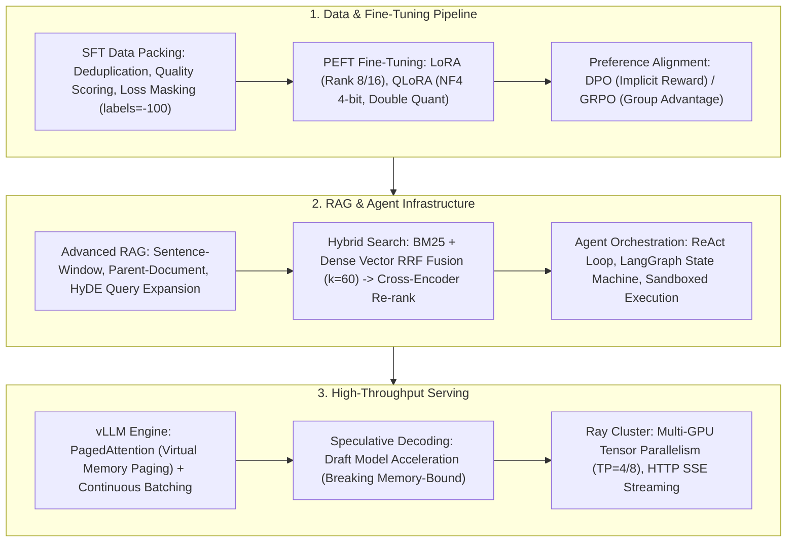
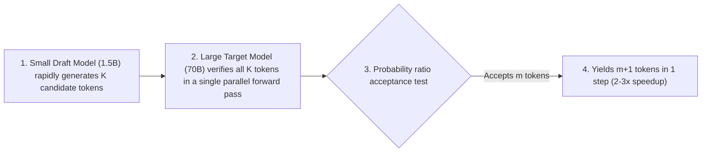

# 🌐 AIE Core Cheatsheet: SFT, LoRA, RAG & Agent Interview Map

> **Executive Summary**: The AI / LLM Systems Engineer (AIE) role spans model fine-tuning, retrieval engineering, agentic orchestration, and high-throughput serving systems. This cheatsheet deconstructs six essential modules: AIE vs. MLE competency matrices, SFT Data Packing with Loss Masking, LoRA/QLoRA VRAM budgeting, Advanced RAG architectures, Speculative Decoding, and production vLLM clusters.

---

## 💡 Interactive Mermaid Architecture



---

## Chapter 1: AIE vs. MLE Competency Matrix

| Dimension | Traditional MLE (Machine Learning Engineer) | AIE (LLM Systems Engineer) |
| :--- | :--- | :--- |
| **Model Core** | GBDT (XGBoost/LightGBM), DSSM Two-Tower, CNN | LLM (Decoder-Only Transformer), MoE |
| **Feature/Data** | Tabular Feature Stores, One-Hot, Entity Embeddings | Prompt Engineering, SFT Data Packing, Synthetic Data |
| **Fine-Tuning** | Hyperparameter Grid Search, Cross-Validation | LoRA / QLoRA, DPO / GRPO Alignment |
| **Serving** | C++ LibTorch / ONNX / Redis | vLLM, TensorRT-LLM, Ray Serve Clusters |

---

## Chapter 2: Pure Python Prompt Formatting Operator

```python
def pure_python_format_system_prompt(user_query: str, retrieved_docs: list) -> str:
    context = "\n".join([f"[{i+1}] {doc}" for i, doc in enumerate(retrieved_docs)])
    return (
        f"System: You are an expert AI assistant. Answer the user query strictly based on the context below.\n"
        f"Context:\n{context}\n\n"
        f"User Query: {user_query}\n"
        f"Answer:"
    )

if __name__ == "__main__":
    docs = ["Paris is the capital of France.", "Population is 2.1 Million."]
    print("✅ Formatted Prompt:\n", pure_python_format_system_prompt("What is the capital of France?", docs))
```

---

## Chapter 3: Advanced RAG Architecture

* **Sentence-Window Retrieval**: Index individual sentences for semantic precision; expand with $\pm 3$ surrounding sentences upon retrieval before feeding to the LLM context.
* **Parent-Document Indexing**: Index smaller chunks (200 tokens) in the vector store; return their full parent document chunks (2000 tokens) to the LLM.
* **Hypothetical Document Embeddings (HyDE)**: Prompt the LLM to hallucinate a tentative answer; vectorize this answer to search real documents, bridging query-document distributional mismatch.

---

## Chapter 4: Speculative Decoding & Overcoming the Memory Wall

Autoregressive token generation is strictly **Memory-Bound**: generating 1 token requires streaming all model weights from HBM to SRAM.



Acceptance probability: $\alpha = \min\left( 1, \frac{p(x)}{q(x)} \right)$. This mathematically guarantees exact target distribution equivalence with **zero loss in generation fidelity**.

```python
import numpy as np

def pure_python_speculative_verification(p_target: list[float], q_draft: list[float]) -> int:
    accepted = 0
    for p, q in zip(p_target, q_draft):
        ratio = p / q if q > 0 else 0.0
        if ratio >= 1.0 or np.random.rand() < ratio:
            accepted += 1
        else:
            break
    return accepted

if __name__ == "__main__":
    np.random.seed(42)
    print("✅ Speculative Accepted Count:", pure_python_speculative_verification([0.8, 0.7, 0.6, 0.1], [0.75, 0.65, 0.55, 0.4]))
```
