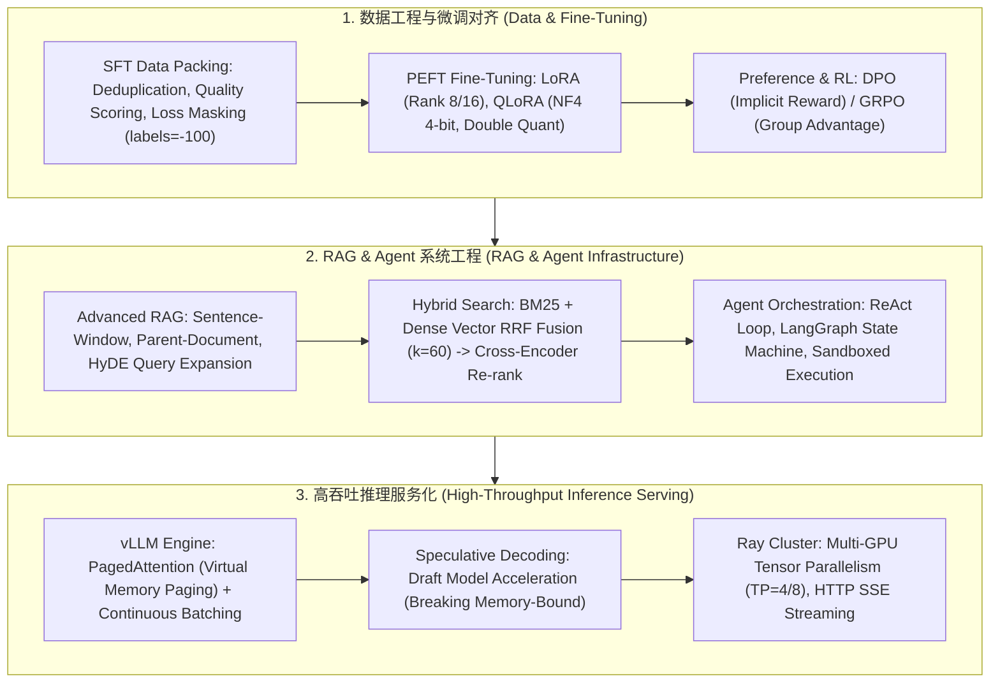
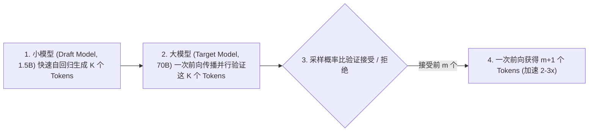

# 🌐 AIE 大模型系统工程师核心地图：SFT/LoRA/RAG/Agent 面试必考

> **核心摘要**：大模型系统工程师（AI / LLM Systems Engineer, AIE）是当前 AI 工业界最火热的工程岗位。AIE 的技术栈横跨算法微调、系统架构、检索工程与推理基础设施。本核心地图全景拆解 AIE 岗位最高频的六大知识模块：AIE vs MLE 能力矩阵、SFT 数据工程与 Loss Masking、LoRA/QLoRA 显存精算、Advanced RAG 检索流水线、投机采样 Speculative Decoding 以及 vLLM 生产化推理集群。

---

## 💡 交互式 Mermaid 架构流程图



---

## 第一章：AIE 核心能力模型与 SFT/LoRA 微调

### 1.1 AIE vs MLE 能力对比

| 考察维度 | 传统 MLE (Machine Learning Engineer) | AIE (LLM Systems Engineer) |
| :--- | :--- | :--- |
| **模型核心** | GBDT (LightGBM/XGBoost), 双塔 DSSM, CNN | LLM (Decoder-Only Transformer), MoE |
| **特征/数据** | Tabular 特征工程, One-Hot, Feature Store | Prompt Engineering, SFT Data Packing |
| **微调对齐** | 超参数网格搜索, Cross-Validation | LoRA / QLoRA, DPO / GRPO 偏好对齐 |
| **Serving 架构** | C++ LibTorch / ONNX / Redis | vLLM, TensorRT-LLM, Ray Serve |

> **怎么读这张表**：横向一行就是两种岗位的本质差异——MLE 的战场在"特征与统计"，AIE 的战场在"模型本身与推理系统"。面试被问"为什么转 AIE / AIE 和 MLE 区别"时，按行讲：模型核心（GBDT vs LLM）、数据（特征工程 vs Prompt/Packing）、微调（网格搜索 vs LoRA/DPO）、Serving（Redis vs vLLM/Ray）四组对比就是完整答案。

---

## 第二章：Pure Python System Prompt 格式化算子

Prompt 格式化的核心是"把检索到的文档变成模型可以直接消费的结构化上下文"——编号列表让模型能引用具体文档，System 指令明确"只依据上下文回答"，从源头降低幻觉与上下文投毒风险。这是 RAG 上线前最便宜也最容易被忽略的一环。

```python
def pure_python_format_system_prompt(user_query: str, retrieved_docs: list) -> str:
    context = "\n".join([f"[{i+1}] {doc}" for i, doc in enumerate(retrieved_docs)])
    return (
        f"System: You are an expert AI assistant. Answer the user query strictly based on the context below.\n"
        f"Context:\n{context}\n\n"
        f"User Query: {user_query}\n"
        f"Answer:"
    )

if __name__ == "__main__":
    docs = ["Paris is the capital of France.", "Population is 2.1 Million."]
    prompt = pure_python_format_system_prompt("What is the capital of France?", docs)
    print("✅ 格式化 Prompt 结果:\n", prompt)
```

---

## 第三章：企业级 Advanced RAG 检索调优技术体系

### 1. 块切分进阶策略 (Advanced Chunking)
* **句子窗口检索 (Sentence-Window Retrieval)**：向量索引仅对单句（如 50 tokens）构建嵌入以保证语义纯度；检索命中后，向 LLM 上下文注入该句子前后各 3 句的完整上下文窗口。
* **父子文档检索 (Parent-Document Retriever)**：将长文档切分为大块（父块，如 2000 tokens）和小块（子块，如 200 tokens）。向量数据库仅存储子块的索引，检索命中子块后自动映射并返回其父块给 LLM。

### 2. 假想文档生成 (HyDE - Hypothetical Document Embeddings)
对于抽象复杂查询，直接用 Query 做向量检索容易与文档空间脱节。**HyDE 流程**：
1. 先让 LLM 根据 Query 生成一篇“假想解答（Hypothetical Answer）”（即使包含事实幻觉，其语言结构和术语分布与目标语料高度同构）；
2. 使用该假想解答的 Embedding 向量去检索真实语料库，显著提升召回相关度！

---

## 第四章：投机采样 (Speculative Decoding) 与自回归加速

### 1. 自回归解码的“内存带宽瓶颈 (Memory-Bound)”
* **Prefill 阶段 (输入处理)**：所有 Prompt Tokens 同时送入 GPU，属于**算力受限（Compute-Bound）**，GPU 算力利用率高达 80%+。
* **Decode 阶段 (自回归生成)**：每生成 1 个 Token，必须将数十 GB 的模型完整权重从显存（HBM）读取到计算单元（SRAM）一次，运算量极小但带宽拉满，属于**显存带宽受限（Memory-Bound）**！

### 2. 投机采样算法核心机制



设小模型预测序列为 $(\tilde{x}_1, \dots, \tilde{x}_K)$。大模型只需**单次并行前向计算**即可同时获得大模型对这 $K$ 个位置的真实概率分布 $p(x)$。根据接受概率：
$$\alpha = \min\left( 1, \frac{p(x)}{q(x)} \right)$$
进行采样验证。该算法**在数学上严格证明与直接从大模型采样具备完全相同的概率分布（零精度损失）**，端到端推理速度提升 **2~3 倍**！

```python
def pure_python_speculative_verification(
    p_target: list[float],
    q_draft: list[float]
) -> int:
    """
    极简投机采样验证逻辑: 返回连续接受的 Token 数量
    """
    accepted_count = 0
    for p, q in zip(p_target, q_draft):
        ratio = p / q if q > 0 else 0.0
        # 简化模拟：若目标模型概率高于草稿模型，直接接受
        if ratio >= 1.0 or np.random.rand() < ratio:
            accepted_count += 1
        else:
            break
    return accepted_count

if __name__ == "__main__":
    np.random.seed(42)
    p_target = [0.8, 0.7, 0.6, 0.1]
    q_draft  = [0.75, 0.65, 0.55, 0.4]
    acc = pure_python_speculative_verification(p_target, q_draft)
    print("✅ 投机采样本次接受 Token 数:", acc)
```

---

## 第五章：5 大高频面试考点与标准解答

### 考点 1：AIE 岗位与传统 MLE 岗位在考察重点和能力模型上有何本质区别？
* **标准回答**：传统 MLE 侧重于特征工程、统计建模（如 GBDT/双塔模型）以及 CTR/pCVR 预估；而 AIE 侧重于基座大模型的二次开发，包括 SFT 数据 Packing、LoRA 参数调优、DPO 偏好对齐、RAG 检索架构与高并发 vLLM 推理部署！

### 考点 2：在大模型 SFT 微调过程中，遇到 Loss 震荡或 Catastrophic Forgetting 如何解决？
* **标准回答**：按 10%-20% 比例混入通用指令数据；降低 Learning Rate（SFT 通常在 1e-5 ~ 2e-5），增加 Warmup Ratio (0.03)；对 Prompt 部分进行 Loss Masking（设置 labels=-100），仅对 Response 部分计算 Cross-Entropy 梯度！

### 考点 3：剖析 LoRA (Low-Rank Adaptation) 微调的矩阵乘法与显存节省原理？
* **标准回答**：冻结预训练权重 $W_0 (d \times k)$，引入低秩分解矩阵 $A (r \times k)$ 与 $B (d \times r)$；优化器状态从占用 $2 \times d \times k$ 骤降至 $2 \times r \times (d+k)$，显存需求降低 70%+！

### 考点 4：如何设计并调优企业级 RAG 系统的 Chunking 策略与 Hybrid Search (BM25 + Dense) RRF 融合？
* **标准回答**：采用父子文档切分或句子窗口策略；结合 BM25 词法检索（捕获实体与型号）与 Dense 语义检索，利用 RRF ($k=60$) 融合后经 Cross-Encoder 二阶段重排截取 Top-5 送入 LLM。
