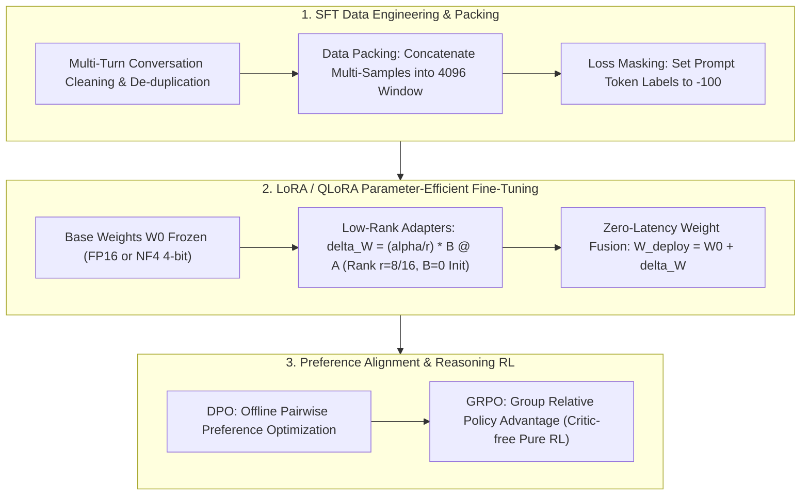

# 🌐 AIE Fine-Tuning Guide: Enterprise SFT, LoRA & DPO Alignment

> **Executive Summary**: LLM fine-tuning and alignment empower AI Engineers (AIE) to transform foundation models into domain-specific reasoning engines. In production workflows, teams face three hurdles: padding compute waste in variable-length batches, severe VRAM bottlenecks during full fine-tuning, and instability in reinforcement learning from human feedback. This guide presents the Data Packing algorithm, LoRA/QLoRA VRAM budgeting, zero-latency weight fusion, DPO mechanics, and GRPO alignment.

---

## 💡 Interactive Mermaid Architecture



---

## Chapter 1: SFT Data Packing & Loss Masking

Variable-length samples padded to 4096 tokens waste up to **80% of training compute on non-informative padding tokens**.

### 1. Data Packing
Concatenate short conversation samples into a unified 4096-token sequence separated by `<eos>` tokens. Apply a block-diagonal 2D Attention Mask so tokens attend only within their respective sample boundaries.

### 2. Loss Masking
Set labels of System and User prompt tokens to `-100`. Cross-Entropy loss computation is evaluated **exclusively on response tokens**, ensuring the model specializes in generating answers rather than memorizing prompt prefixes.

---

## Chapter 2: Pure Python DPO Loss Operator

```python
import numpy as np

def pure_python_dpo_loss(policy_win_logp: float, policy_lose_logp: float, ref_win_logp: float, ref_lose_logp: float, beta: float = 0.1) -> float:
    pi_logr = policy_win_logp - policy_lose_logp
    ref_logr = ref_win_logp - ref_lose_logp
    logits = beta * (pi_logr - ref_logr)
    return float(-np.log(1.0 / (1.0 + np.exp(-logits))))

if __name__ == "__main__":
    print("✅ DPO Loss:", round(pure_python_dpo_loss(-1.2, -2.5, -1.5, -2.2), 4))
```

---

## Chapter 3: LoRA & QLoRA Mathematical Formulations

Pre-trained LLM weight updates reside within a **low intrinsic dimension**:
$$h = W_0 x + \Delta W x = W_0 x + \frac{\alpha}{r} (B \cdot A) x$$
where $A \in \mathbb{R}^{r \times k}$ and $B \in \mathbb{R}^{d \times r}$ with rank $r \ll \min(d, k)$.

* **Initialization**: $A \sim \mathcal{N}(0, \sigma^2)$ is Gaussian-initialized; $B = 0$ is strictly zero-initialized.
  This guarantees $\Delta W = B \cdot A = 0$ at step 0, preserving initial foundation model representations seamlessly.

### QLoRA Innovations
1. **NF4 (NormalFloat4)**: Information-theoretically optimal quantiles for normal distributions.
2. **Double Quantization**: Compresses quantization constants, saving 0.37 bits/param.
3. **Paged Optimizers**: Mitigates gradient allocation memory spikes via CPU paging.

---

## Chapter 4: Zero-Latency Serving: LoRA Weight Merging

In online inference serving, dynamic branch execution adds two matrix multiplications per token. Fuse adapter parameters into the frozen base weights prior to export:
$$W_{\text{deploy}} = W_0 + \frac{\alpha}{r} (B \cdot A)$$

```python
import numpy as np

def pure_python_lora_merge(W0: np.ndarray, A: np.ndarray, B: np.ndarray, r: int, alpha: float) -> np.ndarray:
    scale = alpha / r
    return W0 + scale * np.matmul(B, A)

if __name__ == "__main__":
    np.random.seed(42)
    W0 = np.random.randn(8, 8)
    A = np.random.randn(2, 8)
    B = np.random.randn(8, 2)
    W_fused = pure_python_lora_merge(W0, A, B, r=2, alpha=4.0)
    print("✅ LoRA Merged Output Validated.")
```

---

## Chapter 5: GRPO (Group Relative Policy Optimization)

PPO loads 4 models concurrently (Actor, Critic, Reference, Reward). **GRPO eliminates the Critic entirely**.
For query $q$, sample $G$ outputs $\{o_1, \dots, o_G\}$ and score via rule-based rewards:
$$A_i = \frac{r_i - \text{mean}(\{r_1, \dots, r_G\})}{\text{std}(\{r_1, \dots, r_G\})}$$
This cuts training VRAM by $>50\%$, freeing resources for long chain-of-thought exploration.
