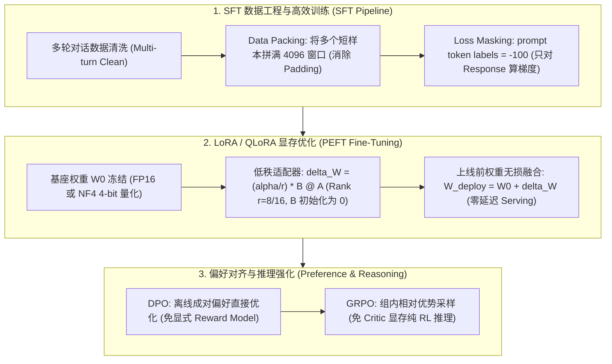

# 🌐 AIE 实战指南：企业级 SFT、LoRA 微调与 DPO/RLHF 偏好对齐落地

> **核心摘要**：大模型微调与对齐是 AI 工程师（AIE）将开源基座模型落地为垂类业务专家的核心技能。在工业实践中，微调面临三大挑战：训练数据长短不一导致 Padding 算力巨大浪费、显存不足导致全量微调代价高昂、以及强化学习对齐训练极度不稳定。本指南系统剖析 Data Packing 算法、Loss Masking、LoRA/QLoRA 显存精算、Adapter 权重无损合并、DPO 闭式实现与 GRPO 纯 RL 对齐。

---

## 💡 交互式 Mermaid 架构流程图



---

## 第一章：SFT 预处理 Packing 算法与 Loss Masking

在实际大模型微调中，将多个短 Conversation 样本使用 `<eos>` 连接拼接为一条长度刚好为 4096 的 Sequence；在 Cross-Entropy 损失计算时，将 System Prompt 和 User Prompt 的对应 Label 设置为 `-100`，保证模型**只学习生成高质量 Response，避免破坏 prompt 的语义理解**！

> 💡 **直观理解**：Packing 是"拼车"——把一堆短对话拼满一整车（4096 token），不再为每个样本单独开一趟车（padding 白算）；Loss Masking 是"只批改答案"——prompt 的标签设为 -100 不计损失，模型只学"怎么答"，不学"怎么复述题"。
>
> 🎤 **面试速答**："结论：Packing 用 <eos> 拼接短样本填满窗口消除 padding 浪费，Loss Masking 让梯度只来自 Response。原理：padding token 的注意力被 mask 掉后前向/反向仍在计算，浪费约 30-50% 算力；Packing 把多个样本拼到 4096 窗口，Attention Mask 隔离跨样本注意力，训练吞吐提升 2-3 倍。例子：100 条平均 512 token 的样本，naive 训练 100 次 4096 长度前向（其中 87% 是 pad）；Packing 只需约 13 次前向。追问：为什么 prompt 置 -100——否则模型学着预测 prompt 的下一个词，语义理解被带偏。"

---

## 第二章：Pure Python DPO 损失计算算子

DPO 的核心洞察：**奖励函数可以写成策略与参考策略的对数概率比**，代入 Bradley-Terry 偏好模型后直接得到闭式损失，无需训练显式 Reward Model。代码里 `pi_logr - ref_logr` 就是"当前策略觉得赢家比输家好多少"减去"参考策略觉得好多少"——差距越大越好，sigmoid 后取负对数就是该对的损失。

```python
import numpy as np

def pure_python_dpo_loss(policy_win_logp: float, policy_lose_logp: float, ref_win_logp: float, ref_lose_logp: float, beta: float = 0.1) -> float:
    pi_logr = policy_win_logp - policy_lose_logp
    ref_logr = ref_win_logp - ref_lose_logp
    logits = beta * (pi_logr - ref_logr)
    return float(-np.log(1.0 / (1.0 + np.exp(-logits))))

if __name__ == "__main__":
    loss = pure_python_dpo_loss(-1.2, -2.5, -1.5, -2.2)
    print("✅ DPO 损失计算值:", round(loss, 4))
```

> 💡 **直观理解**：DPO 不训练裁判（Reward Model），而是让模型自己"照镜子"——把当前策略和微调前的参考策略对同一对答案的打分差比出来：如果当前策略更喜欢被人类偏好的答案，损失就小。β 是"奖惩力度"旋钮，β 越大越要拉开赢家与输家的差距。
>
> 🎤 **面试速答**："结论：DPO 用策略-参考策略对数概率比代替显式奖励，直接优化偏好数据。原理：奖励隐含在 log π/π_ref 中，代入 Bradley-Terry 后 L = −log σ(β·(log π(y_w|x) − log π(y_l|x) − log π_ref(y_w|x) + log π_ref(y_l|x)))。例子：示例数据 -1.2 vs -2.5（policy 认为赢家比输家好 1.3 nats），参考策略只差 0.7——β=0.1 时 logits=0.06，损失约 0.66，梯度推动策略更偏好转答案。追问：β 是温度参数，越大越好胜差越大但过拟合风险升高。"

---

## 第三章：LoRA 与 QLoRA 底层原理与显存精算

全量微调 70B 模型需要更新全部权重、优化器状态（Adam 动量与二阶矩）与梯度，显存需求高达 $70\text{B} \times 16\text{ bytes} \approx 1120\text{ GB}$（至少 16 张 80GB A100）。

### 1. LoRA (Low-Rank Adaptation) 数学原理
Aghajanyan 等人证明预训练语言模型具有极低的**内在秩（Intrinsic Rank）**。LoRA 冻结原始权重 $W_0 \in \mathbb{R}^{d \times k}$，仅训练低秩旁路分解矩阵：
$$h = W_0 x + \Delta W x = W_0 x + \frac{\alpha}{r} (B \cdot A) x$$
其中 $A \in \mathbb{R}^{r \times k}, B \in \mathbb{R}^{d \times r}$，秩 $r \ll \min(d, k)$（通常 $r=8$ 或 $16$）。

* **初始化铁律**：$A \sim \mathcal{N}(0, \sigma^2)$ 使用高斯随机初始化，$B = 0$ 严格全零初始化！
  **数学保证**：在训练开始的第 0 步，$\Delta W = B \cdot A = 0$，模型输出完全等于冻结的原模型，训练平滑无突变。

### 2. QLoRA 核心技术三大件
1. **NF4 (NormalFloat4) 数据类型**：基于正态分布的分位数构建，在理论上达到 4-bit 信息论最优。
2. **双重量化 (Double Quantization)**：对一阶量化常数进行二阶 8-bit 量化，每参数进一步节省 0.37 bits 显存。
3. **分页优化器 (Paged Optimizers)**：利用 CUDA Unified Memory，在显存瞬时峰值时自动换入换出至 CPU 内存，防止 OOM 崩溃。

### 显存需求全景对比表 (7B / 70B 模型)

| 微调方式 | 7B 模型训练显存 | 70B 模型训练显存 | 可训练参数比例 | 训练精度保留率 |
|---|---|---|---|---|
| **全量微调 (Full FT, Adam)** | 112 GB (2x 80GB A100) | 1,120 GB (16x 80GB A100) | 100% | 100% (基准) |
| **LoRA (FP16 Base, r=16)** | 18 GB (1x 24GB RTX 4090) | 160 GB (2x 80GB A100) | ~0.1% | 99.2% |
| **QLoRA (NF4 4-bit Base, r=16)** | **6.5 GB (1x 消费级 GPU)** | **48 GB (1x 80GB A100)** | ~0.1% | 98.8% |

---

## 第四章：零延迟上线：LoRA Adapter 权重无损合并 (Weight Merging)

若在生产推理服务中动态保留旁路分支：$y = W_0 x + \frac{\alpha}{r} B(Ax)$，每次前向传播必须多做两次矩阵乘法，导致首字延迟与吞吐下降 15%~30%。

### 权重无损融合 (Weight Fusion)
由于矩阵乘法满足线性分配律，在部署前直接将 Adapter 矩阵加权合并入基座权重：
$$W_{\text{deploy}} = W_0 + \frac{\alpha}{r} (B \cdot A)$$
合并后生成单一完整的权重文件，直接丢入 vLLM / TensorRT-LLM 运行，**获得零额外延迟、零额外显存的满血推理性能**！

```python
import numpy as np

def pure_python_lora_merge(
    W0: np.ndarray,
    A: np.ndarray,
    B: np.ndarray,
    r: int,
    alpha: float
) -> np.ndarray:
    """
    Pure Python LoRA 权重无损合并算子
    """
    scale = alpha / r
    delta_W = scale * np.matmul(B, A)
    W_deploy = W0 + delta_W
    return W_deploy

if __name__ == "__main__":
    np.random.seed(42)
    d_out, d_in, rank = 8, 8, 2
    W0 = np.random.randn(d_out, d_in)
    A = np.random.randn(rank, d_in)
    B = np.random.randn(d_out, rank)
    
    W_merged = pure_python_lora_merge(W0, A, B, r=rank, alpha=4.0)
    
    # 验证线性等价性: (W0 + delta_W) * x == W0*x + delta_W*x
    x = np.random.randn(d_in)
    y_direct = np.dot(W_merged, x)
    y_branch = np.dot(W0, x) + (4.0 / rank) * np.dot(B, np.dot(A, x))
    
    diff = np.max(np.abs(y_direct - y_branch))
    print("✅ 权重合并前后输出最大绝对误差:", diff)  # < 1e-15
```

---

## 第五章：GRPO (Group Relative Policy Optimization) 纯 RL 对齐机制

传统 PPO 需要载入 4 个大模型：
1. **Actor 策略模型**（需要训练与梯度更新）
2. **Reference 参考模型**（冻结，计算 KL 散度）
3. **Reward 奖励模型**（冻结，打分）
4. **Critic 价值模型**（需要训练，估计状态基线 $V(s)$）

**GRPO 的根本革新在于彻底消除了 Critic 模型**。
对每个 Query 输入 $q$，Actor 策略并发采样生成一组 $G$ 个候选回答 $\{o_1, o_2, \dots, o_G\}$，直接通过确定性规则奖励（如数学题代码编译通过、正确答案匹配）计算这组回答的得分 $\{r_1, r_2, \dots, r_G\}$。组内优势函数为：
$$A_i = \frac{r_i - \text{mean}(\{r_1, \dots, r_G\})}{\text{std}(\{r_1, \dots, r_G\})}$$

**显存节省超 50%，支持将全部显存用于超长上下文思维链（Long CoT）训练**！
