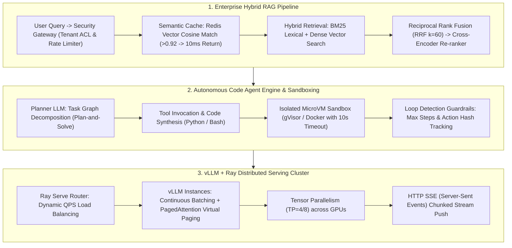

# 🌐 AIE LLM System Design Guide: Production RAG, Agent & Serving

> **Executive Summary**: LLM System Design is the central evaluation for AI Application Architects and Senior AI Engineers. Unlike traditional distributed systems, LLM architectures grapple with distinct engineering constraints: KV Cache VRAM memory walls, non-deterministic execution sandboxing, low-latency hybrid knowledge retrieval, and real-time streaming throughput. This guide deconstructs enterprise multi-tenant RAG, autonomous Code Agent state machines, and vLLM PagedAttention VRAM budgeting.

---

## 💡 Interactive Mermaid Architecture



---

## Chapter 1: Enterprise Multi-Tenant RAG Architecture

1. **Multi-Tenant ACL Isolation**: Enforce scalar hard filters in vector stores (Milvus / PGVector) at query time: `tenant_id == x AND dept_id IN (...)`.
2. **Semantic Caching**: Store question embeddings in Redis. If vector cosine similarity exceeds 0.92, return cached responses directly, reducing latency from 3s to 10ms.

---

## Chapter 2: Pure Python LLM Router

```python
def pure_python_llm_router(query: str) -> str:
    if "code" in query.lower() or "python" in query.lower():
        return "DeepSeek-R1 / CodeLLaMA"
    return "GPT-4o / Qwen-2.5"

if __name__ == "__main__":
    print("✅ Routing Target:", pure_python_llm_router("Write a Python script for RAG"))
```

---

## Chapter 3: Hybrid Retrieval & Reciprocal Rank Fusion (RRF)

Dense embeddings often struggle with exact product codes, error strings, and domain-specific acronyms. Hybrid retrieval combines BM25 keyword matching with dense semantic embeddings.

### RRF Mathematical Scoring
$$\text{RRF Score}(d \in D) = \sum_{m \in M} \frac{1}{k + r_m(d)}$$
where $k=60$ acts as a rank-smoothing constant.

```python
def pure_python_rrf_fusion(
    bm25_ranks: list[str],
    vector_ranks: list[str],
    k: int = 60,
    top_n: int = 5
) -> list[tuple[str, float]]:
    scores: dict[str, float] = {}
    
    for rank, doc_id in enumerate(bm25_ranks, start=1):
        scores[doc_id] = scores.get(doc_id, 0.0) + (1.0 / (k + rank))
        
    for rank, doc_id in enumerate(vector_ranks, start=1):
        scores[doc_id] = scores.get(doc_id, 0.0) + (1.0 / (k + rank))
        
    ranked_docs = sorted(scores.items(), key=lambda item: item[1], reverse=True)
    return ranked_docs[:top_n]

if __name__ == "__main__":
    bm25 = ["doc_A", "doc_B", "doc_C", "doc_D"]
    vector = ["doc_C", "doc_A", "doc_E", "doc_B"]
    print("✅ Fused RRF Ranks:", pure_python_rrf_fusion(bm25, vector))
```

---

## Chapter 4: Autonomous Code Agent State Machine & Sandboxing

### Loop Prevention Guardrails
1. **Max Steps**: Hard terminate at $\le 15$ iterations.
2. **Token Budgeting**: Cap aggregate conversation history at 30k tokens.
3. **Action Hash Deduplication**: Maintain a hash set of recent tool calls `hash(tool, args)`. Three consecutive identical failures trigger an immediate breakout exception.

### Sandboxed Execution Architecture
* **gVisor / Firecracker MicroVMs**: Intercept syscalls in user-space to block container breakout exploits.
* **Network Egress Blacklisting**: Restrict sandbox outbound network traffic to authorized internal package registries only.
* **Ephemeral Workspaces**: Mount read-only root filesystems with ephemeral `/tmp/workspace` directories destroyed upon container exit.

---

## Chapter 5: vLLM PagedAttention & Exact VRAM Calculus

### PagedAttention
Traditional PyTorch inference pre-allocates contiguous memory for maximum sequence lengths, suffering **60-80% internal memory fragmentation**. PagedAttention partitions KV Cache into fixed-size physical blocks (e.g., 16 tokens/block), boosting memory utilization to **>96%** and doubling concurrency.

### VRAM Calculus for 70B Model ($P=70\text{B}$, Batch $B=32$, Context $L=4096$, $N_{\text{layers}}=80$, $N_{\text{kv\_heads}}=8$, $d_{\text{head}}=128$):
1. **Model Weights (BF16)**: $70 \times 10^9 \times 2\text{ bytes} \approx 140\text{ GB}$.
2. **KV Cache per Token**: $2 \times 80 \times 8 \times 128 \times 2\text{ bytes} \approx 0.328\text{ MB}$.
3. **Total KV Cache for Concurrency 32**: $32 \times 4096 \times 0.328\text{ MB} \approx 43\text{ GB}$.
4. **Total VRAM Requirement**: $140\text{ GB} + 43\text{ GB} + 10\text{ GB (Activation)} \approx 193\text{ GB}$.
   $\implies$ Requires **4x 80GB A100/H100 GPUs (TP=4)** for production stability.
