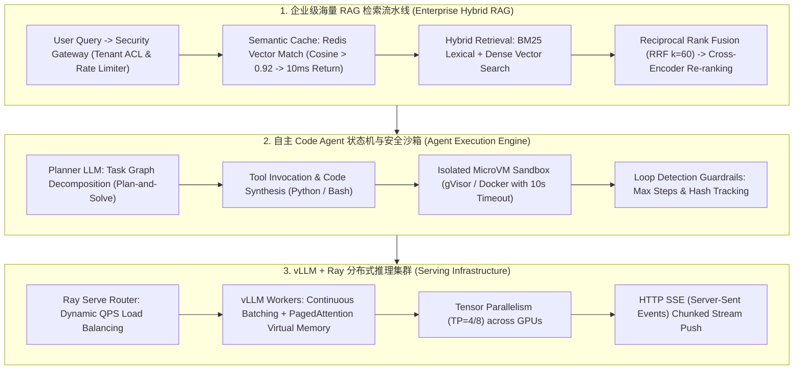
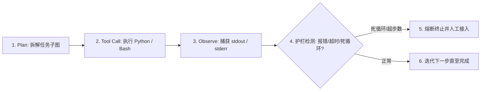

# 🌐 AIE 大模型系统设计：千万级 RAG、Code Agent 与推理服务架构

> **核心摘要**：大模型系统设计（LLM System Design）是 AI 应用架构师与 AIE 资深工程师面试的核心考核关卡。与传统分布式系统相比，大模型系统面临四大独特挑战：长上下文吞吐与显存墙瓶颈、非确定性生成的安全沙箱隔离、海量知识库高精度混合召回、以及端到端秒级流式响应。本指南深度拆解企业级多租户 RAG 架构、自主 Code Agent 状态机、vLLM PagedAttention 显存精算与 Pure Python 生产级算子。

---

## 💡 交互式 Mermaid 架构流程图



---

## 第一章：千万级文档企业级 RAG 系统架构设计

大模型在企业落地中，RAG 系统的难点在于**海量文档高精度检索、多租户安全隔离与低延迟 Serving**：
1. **多租户 ACL 隔离**：向量数据库（Milvus / PGVector）必须在向量 Search 阶段添加标量硬过滤 `tenant_id == x AND dept_id IN (...)`；
2. **Semantic Cache 语义缓存**：引入 Redis + Vector Cosine 相似度匹配。高频重复问题可跳过 LLM 生成，延迟从 3s 骤降至 10ms！

> 💡 **直观理解**：企业 RAG 的两个难点是"检索要准"和"租户要隔离"。语义缓存是"记忆力"——同样的问题答过一次就记住，下次直接复读答案（向量余弦 >0.92 判定语义相同），把 3 秒的 LLM 生成省成 10ms 的查缓存。多租户隔离是"每个人只看得到自己公司的文档"——向量检索时硬过滤 tenant_id，而不是事后过滤结果。
>
> 🎤 **面试速答**："结论：企业 RAG 三大件——多租户 ACL 硬过滤、语义缓存、混合检索 + 重排。原理：向量库在 search 阶段加标量过滤 tenant_id == x AND dept_id IN(...)，从源头隔离；Redis + 向量余弦 >0.92 命中缓存直接返回；BM25 + 稠密向量 RRF 融合再 cross-encoder 重排。例子：1 亿文档、1 万租户，检索链路 100ms 内：向量检索 30ms + 重排 20ms + LLM 生成 2.5s；高频问题命中缓存后总延迟 10ms，服务成本降 90%。追问：缓存一致性——文档更新时按 doc_id 失效缓存或版本号对比。"

---

## 第二章：Pure Python LLM 路由器评估算子

LLM 路由（Router）的核心思想：**不是所有请求都需要最强的模型**——代码题给代码模型（DeepSeek-R1/CodeLLaMA），通用题给通用模型（GPT-4o/Qwen）。这是成本与延迟的第一层优化：把 30% 的请求分流到便宜模型，账单立刻下降。生产级路由器会用分类模型或语义规则而非简单的关键字判断。

```python
def pure_python_llm_router(query: str) -> str:
    if "code" in query.lower() or "python" in query.lower():
        return "DeepSeek-R1 / CodeLLaMA"
    return "GPT-4o / Qwen-2.5"

if __name__ == "__main__":
    print("✅ 路由分配结果:", pure_python_llm_router("Write a Python script for RAG"))
```

> 💡 **直观理解**：路由器像"分诊台"——先判断"这是哪类病"，再送去对应科室。代码题送代码专家、通用问答送通用模型，避免杀鸡用牛刀。生产级路由用分类模型判断意图 + 置信度阈值（低于阈值走最贵最稳的模型兜底），而不是简单的关键字匹配。
>
> 🎤 **面试速答**："结论：路由 = 意图分类 → 分流到最优性价比模型。原理：不同模型在代码/数学/通用对话上各有擅长且价格差 10 倍以上，路由让 70% 请求走便宜模型、30% 走强模型，质量不掉、账单大降。例子：'Write a Python script' 含 'code/python' → 送 DeepSeek-R1/CodeLLaMA；'Explain quantum computing' → 送 GPT-4o。追问：路由本身也是延迟——分类模型推理 <5ms 可接受；路由错误要兜底：低置信度走最稳模型并记录重路由。"

---

## 第三章：混合检索与 RRF (Reciprocal Rank Fusion) 深度融合

单纯依赖向量检索（Dense Embedding）容易在**专有名词、唯一错误码、产品型号（如 iPhone 15 Pro Max 256G、HTTP 502）**上出现严重语义泛化失真。工业界统一采用 **BM25 稀疏检索 + 稠密向量检索的混合召回架构**。

### 1. 倒数排名融合 (RRF) 数学公式
RRF 属于无参数的排序融合算法，不依赖各检索通道输出分数的绝对尺度，只根据文档在各通道中的相对排位（Rank）进行融合打分：
$$\text{RRF Score}(d \in D) = \sum_{m \in M} \frac{1}{k + r_m(d)}$$
其中 $M$ 为检索通道集合（如 $M = \{\text{BM25}, \text{Dense}\}$），$r_m(d)$ 为文档 $d$ 在通道 $m$ 中的排序名次（从 1 开始），平滑常数 $k$ 工业界标准设为 $60$（防止排名前列的文档权重过分主导）。

### 2. 二阶段 Cross-Encoder 重排 (Re-ranking)
* **召回阶段 (Recall)**：BM25 召回 Top 100 + 向量检索召回 Top 100 $\implies$ RRF 融合输出 Top 50。
* **重排阶段 (Rerank)**：使用 BGE-Reranker / Cohere Rerank，将 `(Query, Document)` 拼接后送入完整的 Cross-Encoder 进行全交互自注意力打分，截取最高分 Top 5 送入 LLM 上下文。

```python
def pure_python_rrf_fusion(
    bm25_ranks: list[str],
    vector_ranks: list[str],
    k: int = 60,
    top_n: int = 5
) -> list[tuple[str, float]]:
    """
    Pure Python 倒数排名融合算法 (RRF)
    """
    scores: dict[str, float] = {}
    
    # BM25 通道打分
    for rank, doc_id in enumerate(bm25_ranks, start=1):
        scores[doc_id] = scores.get(doc_id, 0.0) + (1.0 / (k + rank))
        
    # Vector 通道打分
    for rank, doc_id in enumerate(vector_ranks, start=1):
        scores[doc_id] = scores.get(doc_id, 0.0) + (1.0 / (k + rank))
        
    # 按综合得分降序排序
    ranked_docs = sorted(scores.items(), key=lambda item: item[1], reverse=True)
    return ranked_docs[:top_n]

if __name__ == "__main__":
    bm25 = ["doc_A", "doc_B", "doc_C", "doc_D"]
    vector = ["doc_C", "doc_A", "doc_E", "doc_B"]
    fused = pure_python_rrf_fusion(bm25, vector)
    print("✅ RRF 混合重排结果:", fused)
```

---

## 第四章：自主 Code Agent 状态机与死循环熔断护栏

在构建 Devin / Cursor 类的自主代码智能体时，最核心的工程挑战是**Agent 状态死循环、幻觉执行与主机逃逸安全风险**。



### 1. 三重死循环防爆硬护栏
1. **最大步数熔断 (Max Steps)**：单次任务严禁超过 15 轮迭代。
2. **Token 预算熔断 (Token Budget)**：单会话累积 Token 超过 30,000 时强制截断并生成总结。
3. **状态动作哈希去重 (Action Hash Tracking)**：记录历史工具调用的 `hash(tool_name + args)`。若连续 3 次尝试完全相同的无效命令，立即强行中断并要求反思改换策略。

### 2. 生产级安全沙箱隔离方案 (gVisor / MicroVM)
* **网络隔离 (Network Egress Control)**：沙箱默认关闭公网访问，仅白名单放行受限内部包源。
* **文件系统隔离**：挂载只读根目录（Read-only rootfs），工作区仅允许在 `/tmp/workspace` 读写，进程销毁后自动格式化擦除。
* **系统调用拦截**：采用 Google gVisor 或 AWS Firecracker，通过用户态内核拦截敏感 syscall（如 `ptrace`, `mount`），杜绝容器逃逸。

---

## 第五章：vLLM PagedAttention 核心原理与显存精算

大模型推理服务化中最核心的瓶颈是 **KV Cache 显存占用**。在传统 PyTorch 推理中，显存必须为每个请求预先分配最大可能长度（如 4096）的连续物理内存，导致高达 **60%~80% 的内部显存碎片（Memory Fragmentation）**！

### 1. PagedAttention 虚拟内存分页机制
借鉴操作系统虚拟内存分页思想，PagedAttention 将 KV Cache 切分为固定大小的 **物理块（Physical Blocks，如每个 Block 存 16 个 Tokens）**：
* 逻辑上连续的 Token 序列可以映射到物理上离散不连续的 GPU 显存块中。
* 显存按需分配，零内部碎片，显存利用率由传统架构的 20% 飙升至 **96% 以上**，吞吐量提升 2~4 倍！

### 2. 70B 大模型推理显存精确算力公式

设模型参数量为 $P = 70\text{B}$，并发 Batch Size 为 $B = 32$，上下文长度 $L = 4096$，层数 $N_{\text{layers}} = 80$，KV 头数 $N_{\text{kv\_heads}} = 8$，每个头的维度 $d_{\text{head}} = 128$。

1. **模型权重显存 (FP16/BF16)**：
   $$M_{\text{weights}} = 70 \times 10^9 \times 2\text{ bytes} \approx 140\text{ GB}$$
2. **单 Token 的 KV Cache 显存开销**（包含 Key 与 Value 两个矩阵，每元素 2 bytes）：
   $$M_{\text{kv\_per\_token}} = 2 \times N_{\text{layers}} \times N_{\text{kv\_heads}} \times d_{\text{head}} \times 2\text{ bytes} = 2 \times 80 \times 8 \times 128 \times 2 = 327,680\text{ bytes} \approx 0.328\text{ MB}$$
3. **并发状态下 KV Cache 总显存**：
   $$M_{\text{kv\_total}} = B \times L \times M_{\text{kv\_per\_token}} = 32 \times 4096 \times 0.328\text{ MB} \approx 42.99\text{ GB}$$
4. **总显存需求**：$140\text{ GB} + 43\text{ GB} + 10\text{ GB (激活值与系统预留)} \approx 193\text{ GB}$。
   **部署选型**：至少需要 **4 张 80GB A100/H100（TP=4，总显存 320GB）** 即可满血稳定支持高并发服务！

---

## 第六章：5 大高频系统设计面试考点与标准解答

### 考点 1：如何设计一个支持 10 万并发用户同时在线的 AI Coding Agent 服务架构？
* **标准回答**：采用四层解耦架构：
  1. **接入层**：WebSocket / HTTP SSE 实现低延迟打字机流式长连接推送，首字延迟（TTFT）控制在 200ms 内。
  2. **调度层**：基于 LangGraph 编排 Agent 状态机，维护短期会话上下文与 Redis 状态持久化。
  3. **执行层**：构建基于 gVisor 的轻量无状态沙箱容器池，实施 10s 硬超时与网络出站白名单。
  4. **模型层**：后端部署 vLLM + Ray Serve 集群，开启 Tensor Parallelism (TP=4) 与连续批处理（Continuous Batching），按实时队列深度弹性扩缩容。
