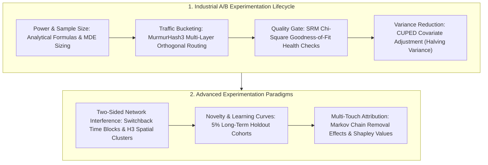

# 🌐 DS A/B Testing Case Studies: CUPED, SRM Checks & Attribution

> **Executive Summary**: A/B testing is the gold standard for data-driven product decisions. In real-world enterprise environments, data scientists face three critical bottlenecks: high variance requiring massive sample sizes, Sample Ratio Mismatch (SRM) invalidating traffic randomization, and network interference violating SUTVA in two-sided marketplaces. This guide dives deep into Microsoft's CUPED variance reduction mathematics, SRM diagnostic frameworks, Switchback experiments, and production case studies from Netflix, Uber, and Meta.

---

## 💡 Interactive Mermaid Architecture



---

## Chapter 1: CUPED Variance Reduction Mathematical Derivation

Let $\tilde{Y} = Y - \theta (X - \mathbb{E}[X])$ be the adjusted metric:
$$\text{Var}(\tilde{Y}) = \text{Var}(Y) + \theta^2 \text{Var}(X) - 2\theta \text{Cov}(Y, X)$$

Taking the first derivative with respect to $\theta$ and setting it to 0:
$$\frac{\partial \text{Var}(\tilde{Y})}{\partial \theta} = 2\theta \text{Var}(X) - 2\text{Cov}(Y, X) = 0 \implies \theta^* = \frac{\text{Cov}(Y, X)}{\text{Var}(X)}$$

Substituting $\theta^*$ back into the variance expression:
$$\text{Var}(\tilde{Y}^*) = \text{Var}(Y) \left( 1 - \frac{\text{Cov}(Y,X)^2}{\text{Var}(Y)\text{Var}(X)} \right) = \text{Var}(Y) (1 - \rho^2)$$

When correlation $\rho = 0.7$, variance reduces to $1 - 0.7^2 = 51\%$, effectively **cutting required sample size in half** or enabling detection of much smaller Minimum Detectable Effects (MDE).

---

## Chapter 2: Pure Python CUPED Implementation

```python
import numpy as np

def pure_python_cuped_adjust(y: np.ndarray, x: np.ndarray) -> np.ndarray:
    cov_xy = np.cov(y, x)[0, 1]
    var_x = np.var(x, ddof=1)
    theta = cov_xy / var_x
    return y - theta * (x - np.mean(x))

if __name__ == "__main__":
    y_raw = np.array([10.0, 12.0, 11.0, 15.0, 9.0])
    x_pre = np.array([9.5, 11.8, 10.8, 14.5, 8.8])
    y_adj = pure_python_cuped_adjust(y_raw, x_pre)
    print("✅ Raw Variance:", round(float(np.var(y_raw)), 4), "-> CUPED Variance:", round(float(np.var(y_adj)), 4))
```

---

## Chapter 3: Sample Ratio Mismatch (SRM) Chi-Square Diagnostics

SRM occurs when the observed sample ratio differs significantly from the expected allocation ratio (e.g., $50\% : 50\%$).
Even a seemingly minor deviation ($N_T = 49,000$ vs $N_C = 51,000$ in 100k users) yields $\chi^2 = 40 \implies p < 10^{-9}$.

### Why Never Interpret Results Under SRM?
SRM signals non-random selection bias. For instance, if a feature crash causes low-end mobile devices to drop out from the treatment group, the surviving treatment sample will appear deceptively high in average spend!

### SRM Diagnostic Funnel
1. **Frontend Latency & Redirect Dropouts**: Slower treatment page load triggers bounce before tracking fires.
2. **Post-Treatment Condition Triggering**: Filtering users after variant exposure rather than at the assignment boundary.
3. **Bot Traffic Contamination**: Web crawlers bypassing randomization cookies.
4. **ETL Pipeline Inconsistencies**: Deduplication keys dropping valid treatment logs.

```python
import scipy.stats as stats

def check_srm_chi_square(observed_treat: int, observed_ctrl: int, expected_ratio: float = 0.5) -> dict:
    total = observed_treat + observed_ctrl
    exp_treat = total * expected_ratio
    exp_ctrl = total * (1.0 - expected_ratio)
    
    chi2_stat = ((observed_treat - exp_treat)**2 / exp_treat) + ((observed_ctrl - exp_ctrl)**2 / exp_ctrl)
    p_value = 1.0 - stats.chi2.cdf(chi2_stat, df=1)
    
    is_srm = p_value < 0.001
    return {
        "chi2_stat": float(chi2_stat),
        "p_value": float(p_value),
        "has_srm": bool(is_srm),
        "verdict": "❌ Severe SRM detected - invalidate experiment!" if is_srm else "✅ Randomization healthy"
    }

if __name__ == "__main__":
    print("SRM Check:", check_srm_chi_square(49000, 51000))
```

---

## Chapter 4: Network Interference & Switchback Experimentation

In two-sided marketplaces (Uber, DoorDash, Airbnb), treatment demand competes directly for shared supply, violating SUTVA:
* Treatment passengers with promo discounts consume driver capacity, forcing control passengers to experience surge pricing and longer wait times.
* Standard user-level A/B testing overestimates treatment lift by treating cannibalized control demand as new incremental volume.

### Switchback Testing Solution
Randomize treatment conditions over **time windows across the entire market**:
* **Washout Periods**: Introduce a 10-15 minute buffer between switching algorithm variants to flush residual orders.
* **Cluster Robust Standard Errors**: Compute inference clustered at the time-window level to prevent false statistical significance.

---

## Chapter 5: Novelty Effects & Long-Term Holdout Cohorts

Early metric spikes often reflect curiosity rather than sticky utility. Maintain a **5% long-term holdout cohort** over 3-6 months to assess true steady-state retention and lifetime value (LTV).

---

## Chapter 6: Production Case Studies

* **Netflix Interleaving**: Blending recommendation variants into a single ranked carousel to increase sensitivity by $100\times$.
* **Uber Spatial H3 Clustering**: Partitioning geographic regions into hexagonal clusters to isolate cross-boundary driver spillovers.
