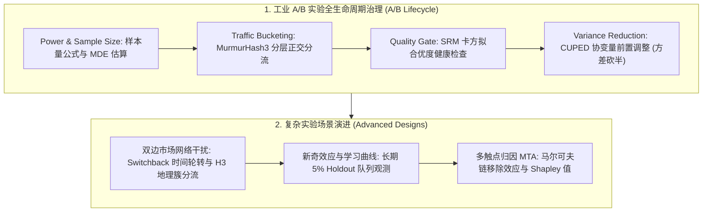
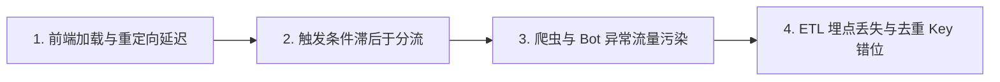
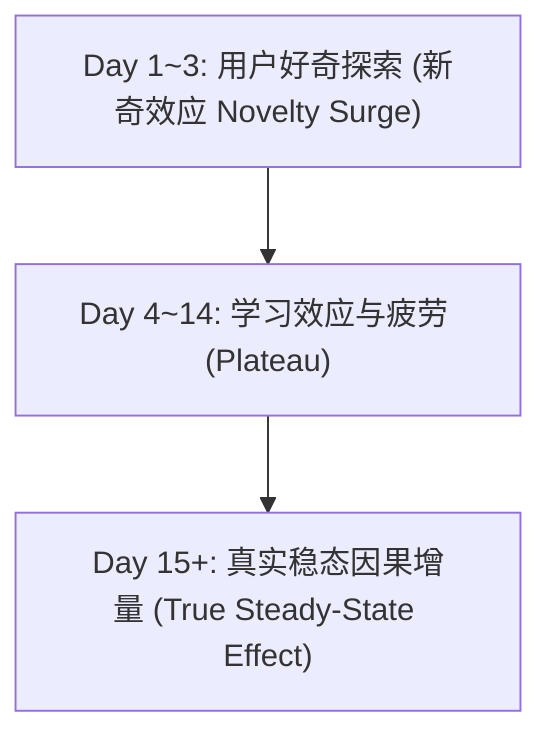

# 🌐 DS A/B 测试 Case Studies：CUPED 方差降低、SRM 检查与商业归因

> **核心摘要**：A/B 测试是现代数据驱动企业的黄金决策支柱。然而在工业实际场景中，数据科学家面临三大核心挑战：样本方差大导致灵敏度不足、分流失衡（SRM）导致实验无效、以及双边市场溢出效应（Network Interference）违背独立性假设。本指南深入剖析微软 CUPED 方差缩减技术、SRM 卡方排查机制、双边市场 Switchback 设计与 Netflix/Uber 工业级 Case Studies。

---

## 💡 交互式 Mermaid 架构流程图



---

## 第一章：CUPED 方差降低数学推导

引入调整指标 $\tilde{Y} = Y - \theta (X - \mathbb{E}[X])$，对其求方差：
$$\text{Var}(\tilde{Y}) = \text{Var}(Y) + \theta^2 \text{Var}(X) - 2\theta \text{Cov}(Y, X)$$

对 $\theta$ 求一阶导数并令其为 0：
$$\frac{\partial \text{Var}(\tilde{Y})}{\partial \theta} = 2\theta \text{Var}(X) - 2\text{Cov}(Y, X) = 0 \implies \theta^* = \frac{\text{Cov}(Y, X)}{\text{Var}(X)}$$

将最优解 $\theta^*$ 代回方差公式：
$$\text{Var}(\tilde{Y}^*) = \text{Var}(Y) \left( 1 - \frac{\text{Cov}(Y,X)^2}{\text{Var}(Y)\text{Var}(X)} \right) = \text{Var}(Y) (1 - \rho^2)$$

其中 $\rho = \text{Corr}(Y, X)$ 为实验前协变量 $X$ 与实验期指标 $Y$ 的皮尔逊相关系数。
当 $\rho = 0.7$ 时，方差直接降低至 $1 - 0.7^2 = 51\%$，相当于**实验所需样本量缩减一半**，或在相同周期内检测更微小的效应（MDE 显著缩小）！

> 💡 **直观理解**: CUPED 像"用期中成绩预测期末":实验前 7 天指标(X)与实验期指标(Y)强相关,把"本来就能预测到的部分"扣掉,剩下的残差方差才需要样本量去分辨。θ 的最优值就是回归系数 Cov/Var——线性投影的最优斜率;ρ=0.7 时残差方差 = (1−0.49) = 51%,方差砍半。
>
> 🎤 **面试速答**: "结论:调整指标 Y−θ(X−E[X]),θ*=Cov(Y,X)/Var(X),方差降至 (1−ρ²)。原理:期望不变(无偏),方差因减掉可解释部分而收缩;θ 是 Y 对 X 的最优线性系数。举个例子:ρ=0.7 → 方差 51%,同样样本量下置信区间收窄约 30%,相当于'流量白送一倍'——2 周实验可能 1 周出结论。"

---

## 第二章：Pure Python CUPED 调整后指标计算算子

实现三步:算协方差、算 θ、构造调整后指标。注意代码用 `ddof=1` 与 `np.cov` 的 1/(n−1) 保持一致;θ 本身也是估计量、带噪声,样本量大时才稳定。

```python
import numpy as np

def pure_python_cuped_adjust(y: np.ndarray, x: np.ndarray) -> np.ndarray:
    cov_xy = np.cov(y, x)[0, 1]
    var_x = np.var(x, ddof=1)
    theta = cov_xy / var_x
    return y - theta * (x - np.mean(x))

if __name__ == "__main__":
    y_raw = np.array([10.0, 12.0, 11.0, 15.0, 9.0])
    x_pre = np.array([9.5, 11.8, 10.8, 14.5, 8.8])
    y_adj = pure_python_cuped_adjust(y_raw, x_pre)
    print("✅ 原始方差:", round(float(np.var(y_raw)), 4), "-> CUPED 调整后方差:", round(float(np.var(y_adj)), 4))
```

> 💡 **直观理解**: 数字版演示:Y=[10,12,11,15,9] 与 X=[9.5,11.8,10.8,14.5,8.8] 几乎完全同步(ρ≈0.998),θ≈1.03——把 X 的"预测值"扣掉后,残差方差从 5.30 掉到约 0.02,个体噪声被几乎全部消除。现实数据不会有这么完美的协变量,但原理一致:扣得越多,实验越灵敏。
>
> 🎤 **面试速答**: "结论:CUPED 三步——算 θ=Cov/Var、构造 Y−θ(X−E[X])、用残差做检验。原理:协变量 X 解释的方差从指标中移除,均值不变,估计保持无偏。举个例子:这个示例数据 ρ≈0.998,方差从 5.30 降到 0.02;真实场景 ρ=0.7 时方差降 51%,等同样本量翻倍、实验时长减半。"

---

## 第三章：样本比例失衡 (Sample Ratio Mismatch - SRM) 卡方排查

**SRM 是所有 A/B 实验的第一道质检红线**。当预设实验分流比为 $1:1$（各 $50\%$），但实际观测样本量为 $N_T = 49,000$ 与 $N_C = 51,000$（总计 10 万）时，看似仅偏差 $1\%$，实际上卡方拟合优度检验：
$$\chi^2 = \frac{(49000 - 50000)^2}{50000} + \frac{(51000 - 50000)^2}{50000} = 20 + 20 = 40 \gg 10.83 \implies p < 10^{-9}$$

### 1. 为什么出现 SRM 时严禁解读均值结果？
SRM 意味着处理组和对照组的样本生成机制发生了**非随机系统性选择偏误 (Selection Bias)**。例如：新算法由于页面崩溃导致低端机型用户流失，幸存留在处理组的都是高端机高价值用户，造成处理组人均消费“虚高”的假象！

### 2. 工业界 SRM 排查 4 步漏斗



```python
import scipy.stats as stats

def check_srm_chi_square(observed_treat: int, observed_ctrl: int, expected_ratio: float = 0.5) -> dict:
    total = observed_treat + observed_ctrl
    exp_treat = total * expected_ratio
    exp_ctrl = total * (1.0 - expected_ratio)
    
    chi2_stat = ((observed_treat - exp_treat)**2 / exp_treat) + ((observed_ctrl - exp_ctrl)**2 / exp_ctrl)
    p_value = 1.0 - stats.chi2.cdf(chi2_stat, df=1)
    
    is_srm = p_value < 0.001  # 严苛质检阈值
    return {
        "chi2_stat": float(chi2_stat),
        "p_value": float(p_value),
        "has_srm": bool(is_srm),
        "verdict": "❌ SRM 严重失衡，实验结果作废！" if is_srm else "✅ 分流健康无 SRM"
    }

if __name__ == "__main__":
    res = check_srm_chi_square(49000, 51000)
    print("SRM 质检:", res)
```

---

## 第四章：双边市场网络溢出与 Switchback 实验设计

在 Uber、滴滴、美团等双边市场中，标准用户级 A/B 实验会发生严重的**SUTVA 溢出效应（Network Spillover）**：
* 当处理组乘客享受大额打车优惠券时，会迅速抢占周围有限的运力，导致对照组乘客遭遇“无车可用 / 溢价上涨”，对照组指标被严重拉低。
* 结果：实验高估了优惠券的真实净增量（把从对照组抢夺的存量误当成了新增量）。

### 1. 时间轮转实验 (Switchback Testing)

将同一个城市划分为连续的时间窗（如每个窗口 30 分钟），按时间块随机切换全城为 Treatment 模式或 Control 模式：

```
[00:00 - 00:30]: Treatment (全城开算法 A)
[00:30 - 01:00]: Washout Period (10分钟缓冲期，释放滞留订单)
[01:00 - 01:30]: Control (全城开算法 B)
```

* **缓冲期 (Washout Period)**：必须在每次切换之间预留 10~15 分钟，防止上个周期的遗留供需影响当前周期。
* **聚类标准误校正 (Cluster Standard Errors)**：样本的独立随机单元是“时间块（Time Slot）”而非单个订单，必须以时间块为聚类单位计算稳健标准误，否则 $p$-value 会极度虚高。

---

## 第五章：新奇效应 (Novelty Effect) 与长期保留对照组

当推出全新 UI 或重构推荐流时，指标往往在前 3 天暴涨，随后持续回落。



### 治理方案：5% 长期保留对照组 (Long-term Holdout)
为核心产品功能保留 5% 用户常年不开启新特性，进行长达 3~6 个月的留存率、LTV 与粘性追踪，排除一切短期虚假繁荣。

---

## 第六章：工业级四大经典 Case Studies 精粹

### Case 1: Netflix 封面海报动态推荐 Interleaving 测试
* **挑战**：为每个用户推荐最吸睛的剧集海报，传统 A/B 实验每次只能测 1 张海报，需要耗费数月。
* **方案**：采用 **Interleaving 交叉重叠测试**，在同一个推荐列表内混合插入算法 A 与算法 B 的海报，统计单用户在同屏下的点击偏好，实验灵敏度提升 100 倍。

### Case 2: Uber 动态定价中的地理网格簇实验 (H3 Cluster Randomization)
* **方案**：利用 Uber 开源的 H3 六边形地理网格系统，将物理距离相近的网格聚类为一个大簇（Cluster），按簇进行实验分流，最大限度物理隔离司机 cross-boundary 溢出。
