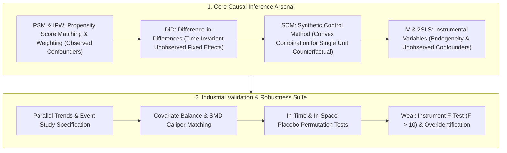
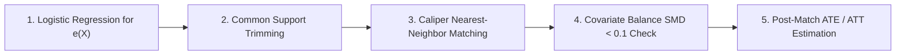
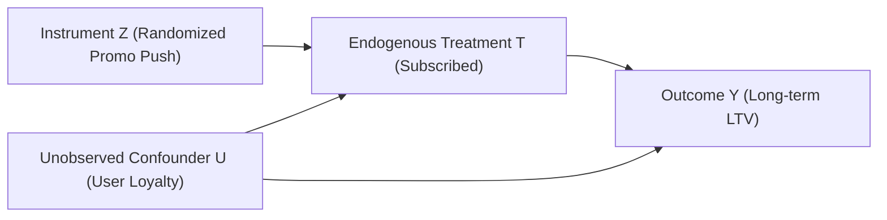

# 🌐 DS Causal Inference: PSM, Difference-in-Differences & Synthetic Control

> **Executive Summary**: Causal inference separates senior Data Scientists and Product Analysts from junior data query roles. In real-world tech systems, ethical constraints, spillover dynamics, and marketplace network effects frequently prohibit randomized controlled trials (A/B testing). This guide systematically explores Rubin's Potential Outcomes framework, Pearl's Causal DAGs, Propensity Score Matching (PSM), Difference-in-Differences (DiD), Synthetic Control (SCM), and Instrumental Variables (2SLS) with mathematical derivations and pure Python implementations.

---

## 💡 Interactive Mermaid Architecture



---

## Chapter 1: DiD Theory and the Parallel Trends Assumption

Difference-in-Differences (DiD) estimates the net causal effect by comparing the pre-post changes across treatment and control groups:
$$\text{ATE} = (\bar{Y}_{T, \text{post}} - \bar{Y}_{T, \text{pre}}) - (\bar{Y}_{C, \text{post}} - \bar{Y}_{C, \text{pre}})$$

Its fundamental lifeline is the **Parallel Trends Assumption**: in the absence of treatment, the average outcome of the treatment group would have evolved parallel to that of the control group.

The Two-Way Fixed Effects (TWFE) regression is parameterized as:
$$Y_{it} = \alpha_i + \lambda_t + \beta D_{it} + \epsilon_{it}$$
where $\alpha_i$ absorbs individual time-invariant heterogeneity, $\lambda_t$ absorbs macro temporal shocks, $D_{it} = \text{Treat}_i \times \text{Post}_t$, and $\beta$ captures the causal Average Treatment Effect (ATE).

> 💡 **Intuitive Understanding**: DiD performs a "double subtraction": first computing the within-unit change (canceling baseline differences), then computing the across-group delta (canceling macroeconomic trends).
>
> 🎤 **Interview Pitch**: "DiD identifies causality through dual subtractions under parallel trends: $\text{ATE} = (T_{\text{post}} - T_{\text{pre}}) - (C_{\text{post}} - C_{\text{pre}})$. When pre-trends diverge, Event Study specifications diagnose anticipation or differential growth paths."

---

## Chapter 2: Pure Python DiD Estimator

```python
def pure_python_did_estimate(y_treat_post: float, y_treat_pre: float, y_ctrl_post: float, y_ctrl_pre: float) -> float:
    delta_treat = y_treat_post - y_treat_pre
    delta_ctrl = y_ctrl_post - y_ctrl_pre
    return delta_treat - delta_ctrl

if __name__ == "__main__":
    ate = pure_python_did_estimate(15.0, 10.0, 11.0, 9.0)
    print("✅ DiD Causal ATE Estimate:", ate)  # (15-10) - (11-9) = 5 - 2 = 3.0
```

---

## Chapter 3: Rubin Potential Outcomes & Pearl's Causal DAGs

Causal inference is the science of uncovering missing **Counterfactuals**. For any unit $i$:
* $Y_i(1)$: Potential outcome under treatment ($T=1$).
* $Y_i(0)$: Potential outcome under control ($T=0$).

The Fundamental Problem of Causal Inference: we only observe $Y_i = T_i Y_i(1) + (1-T_i) Y_i(0)$. One of the potential outcomes is always unobservable.

### 1. Three Core Identifiability Assumptions

1. **SUTVA (Stable Unit Treatment Value Assumption)**: No cross-unit interference and no hidden variations of treatments.
2. **Unconfoundedness (Conditional Ignorability)**: $(Y(1), Y(0)) \perp T \mid X$. Given covariates $X$, treatment assignment is as good as random.
3. **Positivity (Common Support / Overlap)**: $0 < P(T=1 \mid X) < 1$ for all support points of $X$.

### 2. Causal DAGs and the Backdoor Criterion

* **Chain ($X \to M \to Y$)**: Conditioning on mediator $M$ blocks causal flow from $X$ to $Y$.
* **Fork / Confounder ($X \leftarrow C \to Y$)**: Common cause $C$ induces spurious correlation. **Must condition on $C$** to block the backdoor path.
* **Collider ($X \to C \leftarrow Y$)**: Common effect $C$ blocks paths by default; **conditioning on collider $C$ erroneously opens a spurious dependency** (Berkson's bias).

**Backdoor Criterion**: A covariate set $Z$ identifies the causal effect if: (1) no node in $Z$ is a descendant of $T$; (2) $Z$ blocks every backdoor path between $T$ and $Y$.
$$P(Y \mid do(T=t)) = \sum_z P(Y \mid T=t, Z=z) P(Z=z)$$

---

## Chapter 4: PSM & Doubly Robust Estimation (AIPW)

High-dimensional covariates create the curse of dimensionality. Rosenbaum & Rubin proved the **Propensity Score Theorem**:
$$e(X) = P(T=1 \mid X) \implies (Y(1), Y(0)) \perp T \mid e(X)$$

### 1. PSM Production Workflow



1. **Score Estimation**: Train Logistic Regression / GBDT to predict probability $e(X)$.
2. **Common Support Trimming**: Discard treatment units with $e(X) > 0.95$ and control units with $e(X) < 0.05$.
3. **Caliper Matching**: Restrict matches within distance threshold $\text{Caliper} \le 0.2 \sigma_{\text{logit}(e)}$.
4. **Balance Verification**: Compute Standardized Mean Difference (SMD). Balance is achieved when $\text{SMD} < 0.1$ across all features.

### 2. Augmented Inverse Probability Weighting (AIPW)

$$\hat{\tau}_{\text{AIPW}} = \frac{1}{N} \sum_{i=1}^N \left[ \left( \hat{\mu}_1(X_i) + \frac{T_i (Y_i - \hat{\mu}_1(X_i))}{\hat{e}(X_i)} \right) - \left( \hat{\mu}_0(X_i) + \frac{(1-T_i)(Y_i - \hat{\mu}_0(X_i))}{1-\hat{e}(X_i)} \right) \right]$$

**Doubly Robust Guarantee**: If *either* the outcome model $\mu(X)$ *or* the propensity score model $e(X)$ is correctly specified, $\hat{\tau}_{\text{AIPW}}$ is an unbiased and asymptotically normal estimator.

```python
import numpy as np

def pure_python_psm_nearest_neighbor(
    X_treat: np.ndarray, y_treat: np.ndarray,
    X_ctrl: np.ndarray, y_ctrl: np.ndarray,
    caliper: float = 0.05
) -> dict:
    ps_treat = 1.0 / (1.0 + np.exp(-X_treat.mean(axis=1)))
    ps_ctrl = 1.0 / (1.0 + np.exp(-X_ctrl.mean(axis=1)))

    matched_treat_y = []
    matched_ctrl_y = []

    for i, p_t in enumerate(ps_treat):
        diffs = np.abs(ps_ctrl - p_t)
        best_idx = np.argmin(diffs)
        if diffs[best_idx] <= caliper:
            matched_treat_y.append(y_treat[i])
            matched_ctrl_y.append(y_ctrl[best_idx])

    att = np.mean(matched_treat_y) - np.mean(matched_ctrl_y)
    return {
        "matched_pairs": len(matched_treat_y),
        "ATT_estimate": float(att),
        "mean_treat": float(np.mean(matched_treat_y)),
        "mean_ctrl": float(np.mean(matched_ctrl_y))
    }

if __name__ == "__main__":
    np.random.seed(42)
    Xt = np.random.randn(100, 3) + 0.5
    Xc = np.random.randn(300, 3)
    yt = Xt.sum(axis=1) + 2.5 + np.random.randn(100) * 0.2
    yc = Xc.sum(axis=1) + np.random.randn(300) * 0.2

    res = pure_python_psm_nearest_neighbor(Xt, yt, Xc, yc)
    print("✅ PSM Result:", res)
```

---

## Chapter 5: Synthetic Control Method (SCM)

When policies occur at an aggregate unit level (single city, country, or app platform), Synthetic Control (SCM) models the counterfactual trajectory via a **convex combination of untreated donor pool units**:
$$W^* = \arg\min_W (X_1 - X_0 W)^T V (X_1 - X_0 W) \quad \text{s.t.} \quad w_j \ge 0, \sum w_j = 1$$

Dynamic causal treatment effect:
$$\hat{\tau}_{1t} = Y_{1t} - \sum_{j=2}^{J+1} w_j^* Y_{jt}, \quad \forall t > T_0$$

### Placebo Permutation Testing
Run placebo trials on each donor pool unit iteratively. Evaluate the Post/Pre RMSPE ratio:
$$\text{RMSPE Ratio} = \frac{\text{RMSPE}_{\text{post}}}{\text{RMSPE}_{\text{pre}}}$$
Significance is attained if the treated unit ranks at the extreme top percentile of the empirical permutation distribution ($p = 1/(J+1) < 0.05$).

---

## Chapter 6: Instrumental Variables (IV) & 2SLS

When unobserved confounders $U$ induce endogeneity, Ordinary Least Squares (OLS) produces severe bias. Instrumental variable $Z$ breaks endogeneity.



### Core Assumptions
1. **Instrument Relevance**: $\text{Cov}(Z, T) \neq 0$. First-stage $F$-statistic must exceed 10 ($F > 10$) to rule out weak instruments.
2. **Exclusion Restriction**: $Z$ affects $Y$ solely through $T$, meaning $Z \perp Y \mid (T, U)$.

### Two-Stage Least Squares (2SLS)
* **Stage 1**: $T = \gamma_0 + \gamma_1 Z + \gamma_2 X + v \implies \hat{T}$
* **Stage 2**: $Y = \beta_0 + \beta_{\text{IV}} \hat{T} + \beta_2 X + \epsilon$

The Wald Estimator identifies the **Local Average Treatment Effect (LATE)** for the complier subpopulation:
$$\beta_{\text{IV}} = \frac{\text{Cov}(Y, Z)}{\text{Cov}(T, Z)} = \frac{\bar{Y}_{Z=1} - \bar{Y}_{Z=0}}{\bar{T}_{Z=1} - \bar{T}_{Z=0}}$$

```python
def pure_python_wald_iv_estimate(y_z1: float, y_z0: float, t_z1: float, t_z0: float) -> float:
    numerator = y_z1 - y_z0
    denominator = t_z1 - t_z0
    if abs(denominator) < 1e-8:
        raise ValueError("Weak instrument: first-stage uptake delta is near 0.")
    return numerator / denominator

if __name__ == "__main__":
    late = pure_python_wald_iv_estimate(120.0, 80.0, 0.6, 0.2)
    print("✅ 2SLS LATE Estimate:", late)  # 100.0
```

---

## Chapter 7: Causal Method Selection Decision Tree

```mermaid
graph TD
    Q0{"Can you run a randomized A/B test?"}
    Q0 -->|Yes| A0["Randomized Controlled Trial (RCT) + CUPED"]
    Q0 -->|No| Q1{"Is there an explicit cutoff score / threshold?"}
    
    Q1 -->|Yes| M1["Regression Discontinuity Design (RDD)"]
    Q1 -->|No| Q2{"Is treatment applied to an aggregate region or individual users?"}
    
    Q2 -->|Single Region / Full Rollout| M2["Synthetic Control (SCM) or CausalImpact"]
    Q2 -->|Multiple Panel Units over Time| Q3{"Do you have pre/post longitudinal panel data?"}
    
    Q3 -->|Yes| M3["Difference-in-Differences (DiD) + Event Study"]
    Q3 -->|No (Cross-Sectional Only)| Q4{"Are there severe unobserved confounders?"}
    
    Q4 -->|Unobserved Confounders Exist| M4["Exogenous Shocks & Instrumental Variables (IV / 2SLS)"]
    Q4 -->|All Confounders are Observed| M5["PSM Matching / IPW Weighting / Doubly Robust (AIPW)"]
```
