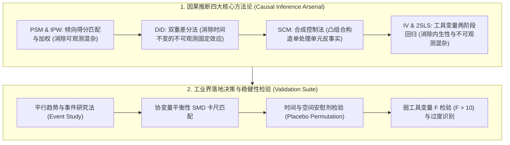
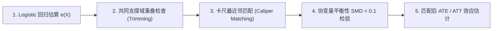
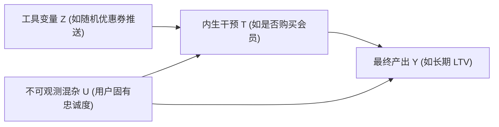

# 🌐 DS 因果推断实战：PSM 倾向得分匹配、DiD 双重差分与 Synthetic Control

> **核心摘要**：因果推断（Causal Inference）是数据科学家（DS）与产品分析师（PA）拉开核心竞争力的分水岭。在工业级业务中，由于商业伦理、溢出效应或全量上线等限制，往往无法进行标准随机对照试验（A/B Test）。本指南系统剖析 Rubin 潜在结果模型、Pearl 因果图 DAG、PSM 倾向得分匹配、DiD 双重差分、合成控制法 SCM 以及工具变量 2SLS，结合数理闭式解与生产级 Python 算子，构建从理论到落地的完备体系。

---

## 💡 交互式 Mermaid 架构流程图



---

## 第一章：DiD (双重差分法) 理论与平行趋势假设

DiD 核心在于估计处理组与对照组在处理前后的变化差值：
$$\text{ATE} = (\bar{Y}_{T, \text{post}} - \bar{Y}_{T, \text{pre}}) - (\bar{Y}_{C, \text{post}} - \bar{Y}_{C, \text{pre}})$$

其命脉在于**平行趋势假设 (Parallel Trends Assumption)**：即在没有处理发生的前提下，处理组与对照组的时间趋势保持平行。

双向固定效应回归方程（TWFE）表示为：
$$Y_{it} = \alpha_i + \lambda_t + \beta D_{it} + \epsilon_{it}$$
其中 $\alpha_i$ 为个体固定效应（消除个体固有差异），$\lambda_t$ 为时间固定效应（消除全大盘共同时间波动），$D_{it} = \text{Treat}_i \times \text{Post}_t$ 为交互处理虚拟变量，$\beta$ 即为待估计的真实因果效应 ATE。

> 💡 **直观理解**: DiD 是"双重减法":先各算各的"前后差"(消除个体固有水平),再算两组"前后差之差"(消除共同时间趋势——市场、季节、大盘)。平行趋势假设就是"如果没有政策,两组本会走一样的路";它无法直接验证,只能靠画前趋势图和安慰剂检验间接支持——这就是面试常考的"假设不可直接检验"问题。
>
> 🎤 **面试速答**: "结论:ATE = (处理组后−前) − (对照组后−前),靠平行趋势假设识别因果。原理:前后差去掉个体差异,双差去掉共同趋势,剩余即政策效应;如果两组在政策前就走势不同,双差会高估或低估。举个例子:处理组 10→15(Δ=+5),对照组 9→11(Δ=+2),ATE=+3;若只看事后 15 vs 11 会得到 +4——把两组原有差异混进了效应。"

---

## 第二章：Pure Python DiD 双重差分估算算子

DiD 估计量就是一行代码——两次减法;真正的复杂度在假设与推断:平行趋势是否成立、标准误是否按聚类估计、政策前趋势有没有差异(事件研究法检验)。

```python
def pure_python_did_estimate(y_treat_post: float, y_treat_pre: float, y_ctrl_post: float, y_ctrl_pre: float) -> float:
    delta_treat = y_treat_post - y_treat_pre
    delta_ctrl = y_ctrl_post - y_ctrl_pre
    return delta_treat - delta_ctrl

if __name__ == "__main__":
    ate = pure_python_did_estimate(15.0, 10.0, 11.0, 9.0)
    print("✅ DiD 因果效应估计值 ATE:", ate)
```

> 💡 **直观理解**: 四个数字、两次减法,但每一步都有身份:Δ_treat 是"政策组的自身变化",Δ_ctrl 是"同期没有政策的对照变化"——后者是"如果没政策,处理组会怎样"的替身。两次减法 = 一次取自身变化 + 一次扣掉背景变化;计算简单,难的是让"替身"可信。
>
> 🎤 **面试速答**: "结论:DiD 是双差估计:ATE=(T后−T前)−(C后−C前),算出 3。原理:差分消个体固定效应,双差消时间趋势,剩下政策因果效应;标准误要按聚类(州/店)估计,否则过度自信。举个例子:10→15 vs 9→11,ATE=+3;若平行趋势存疑,用事件研究法画出每期差分,看政策前是否平坦、政策后是否跳变——前趋势不平坦,DiD 结论就要打折。"

---

## 第三章：Rubin 潜在结果框架与 Pearl 因果图 DAG

因果推断的本质是寻找**反事实 (Counterfactual)**。对于个体 $i$，定义潜在结果：
* $Y_i(1)$：个体 $i$ 接受干预（$T=1$）时的潜在产出。
* $Y_i(0)$：个体 $i$ 未接受干预（$T=0$）时的潜在产出。

实际观测值 $Y_i = T_i Y_i(1) + (1-T_i) Y_i(0)$。因果推断的根本难题（Fundamental Problem of Causal Inference）在于：**对于任何一个个体，我们永远只能观测到 $Y_i(1)$ 或 $Y_i(0)$ 中的一个，另一个即为缺失的反事实。**

### 1. 核心可识别性三大假设 (Identifiability Assumptions)

1. **SUTVA (Stable Unit Treatment Value Assumption)**：
   - 互不干扰性：个体 $i$ 的潜在结果不受其他个体干预分配的影响。
   - 版本一致性：干预 $T=1$ 不存在多种不同剂量的隐式变体。
2. **条件独立性 / 无混杂假设 (Unconfoundedness / Ignorability)**：
   - 给定协变量 $X$ 时，潜在结果与干预分配独立：$(Y(1), Y(0)) \perp T \mid X$。
3. **重叠性 / 共同支撑域 (Overlap / Positivity)**：
   - 对于所有协变量 $X$，接受干预的概率严格介于 0 和 1 之间：$0 < P(T=1 \mid X) < 1$。

### 2. Pearl 因果图与后门准则 (Backdoor Criterion)

因果图（Causal DAG）通过有向无环图刻画变量间的生成因果机制。三个基本拓扑单元决定了变量间的条件独立性（$d$-分离）：
* **链式结构 (Chain, $X \to M \to Y$)**：控制中介变量 $M$ 会阻断 $X \to Y$ 的因果传递。
* **分叉结构 (Fork, $X \leftarrow C \to Y$)**：共同原因 $C$ 引入伪相关（混杂）。**必须控制 $C$** 以阻断后门路径。
* **对撞结构 (Collider, $X \to C \leftarrow Y$)**：共同结果 $C$ 默认阻断路径；若**错误控制对撞变量 $C$**，会意外打开伪相关通道（Berkson 悖论）。

**后门准则定理**：若变量集合 $Z$ 满足：(1) $Z$ 中不包含 $T$ 的后代节点；(2) $Z$ 阻断了 $T$ 到 $Y$ 的所有后门路径，则因果效应可通过在 $Z$ 上进行条件调整实现非参数因果识别：
$$P(Y \mid do(T=t)) = \sum_z P(Y \mid T=t, Z=z) P(Z=z)$$

---

## 第四章：PSM 倾向得分匹配与双重稳健估计 (AIPW)

当混杂变量维度很高（维数灾难）导致无法直接在多维空间 $X$ 上精确匹配时，Rosenbaum & Rubin 证明了**倾向得分定理 (Propensity Score Theorem)**：
$$e(X) = P(T=1 \mid X) \implies (Y(1), Y(0)) \perp T \mid e(X)$$

只需将高维协变量压缩为一维标量 $e(X) \in (0, 1)$，在倾向得分维度上进行匹配即可完全平衡两组协变量分布！

### 1. PSM 工业级实战 5 步流水线



1. **得分估计**：使用 Logistic 回归或 GBDT 预测倾向得分 $e(X) = \sigma(\beta^T X)$。
2. **共同支撑域截断**：剔除对照组得分过低与处理组得分过高的样本（通常裁剪 $e(X) < 0.05$ 或 $e(X) > 0.95$）。
3. **卡尺匹配**：设定匹配距离阈值（卡尺 $\text{Caliper} \le 0.2 \sigma_{\text{logit}(e)}$），防止过远劣质样本强行配对。
4. **平衡性检验**：计算标准化均值差（Standardized Mean Difference, SMD）：
   $$\text{SMD} = \frac{|\bar{X}_T - \bar{X}_C|}{\sqrt{(s_T^2 + s_C^2)/2}}$$
   匹配后所有协变量的 $\text{SMD} < 0.1$ 视为平衡达标。

### 2. 双重稳健估计器 (Augmented IPW / AIPW)

逆概率加权（IPW）对极端倾向得分极度敏感。**双重稳健估计器 (AIPW)** 结合了产出回归模型 $\hat{\mu}_1(X), \hat{\mu}_0(X)$ 与倾向得分模型 $\hat{e}(X)$：
$$\hat{\tau}_{\text{AIPW}} = \frac{1}{N} \sum_{i=1}^N \left[ \left( \hat{\mu}_1(X_i) + \frac{T_i (Y_i - \hat{\mu}_1(X_i))}{\hat{e}(X_i)} \right) - \left( \hat{\mu}_0(X_i) + \frac{(1-T_i)(Y_i - \hat{\mu}_0(X_i))}{1-\hat{e}(X_i)} \right) \right]$$

**核心性质（双保险）**：只要产出模型 $\mu(X)$ 或倾向得分模型 $e(X)$ 中**任意一个指定正确**，$\hat{\tau}_{\text{AIPW}}$ 就是无偏且渐近正态的无偏估计量！

```python
import numpy as np

def pure_python_psm_nearest_neighbor(
    X_treat: np.ndarray, y_treat: np.ndarray,
    X_ctrl: np.ndarray, y_ctrl: np.ndarray,
    caliper: float = 0.05
) -> dict:
    """
    极简 Pure Python 倾向得分卡尺最近邻匹配算法
    """
    # 模拟估算的一维倾向得分
    ps_treat = 1.0 / (1.0 + np.exp(-X_treat.mean(axis=1)))
    ps_ctrl = 1.0 / (1.0 + np.exp(-X_ctrl.mean(axis=1)))

    matched_treat_y = []
    matched_ctrl_y = []

    for i, p_t in enumerate(ps_treat):
        diffs = np.abs(ps_ctrl - p_t)
        best_idx = np.argmin(diffs)
        if diffs[best_idx] <= caliper:
            matched_treat_y.append(y_treat[i])
            matched_ctrl_y.append(y_ctrl[best_idx])

    att = np.mean(matched_treat_y) - np.mean(matched_ctrl_y)
    return {
        "matched_pairs": len(matched_treat_y),
        "ATT_estimate": float(att),
        "mean_treat": float(np.mean(matched_treat_y)),
        "mean_ctrl": float(np.mean(matched_ctrl_y))
    }

if __name__ == "__main__":
    np.random.seed(42)
    Xt = np.random.randn(100, 3) + 0.5
    Xc = np.random.randn(300, 3)
    yt = Xt.sum(axis=1) + 2.5 + np.random.randn(100) * 0.2  # 真实效应 ~2.5
    yc = Xc.sum(axis=1) + np.random.randn(300) * 0.2

    res = pure_python_psm_nearest_neighbor(Xt, yt, Xc, yc)
    print("✅ PSM 最近邻匹配结果:", res)
```

---

## 第五章：合成控制法 (Synthetic Control Method - SCM) 与反事实构造

当政策干预发生在**单个大单位**（如一个省份、一个国家、全量 App 核心页面），无法找到单个完美的对照组时，Abadie 等人提出的**合成控制法 (SCM)** 通过供体池（Donor Pool）中未受干预的多个对照单元的**凸组合 (Convex Combination)**，合成出一个完美的虚拟反事实单元！

### 1. 凸优化目标函数

设目标处理单元为 $1$，供体池包含 $J$ 个对照单元。寻找权重向量 $W^* = (w_2, \dots, w_{J+1})^T$ 满足：
$$W^* = \arg\min_W (X_1 - X_0 W)^T V (X_1 - X_0 W) \quad \text{s.t.} \quad w_j \ge 0, \sum_{j=2}^{J+1} w_j = 1$$
其中 $X_1$ 为处理单元在干预前的特征向量，$X_0$ 为供体池特征矩阵，$V$ 为特征重要性对称半正定对角阵。

在干预发生后（$t > T_0$），真实观测值与合成反事实之差即为动态因果效应：
$$\hat{\tau}_{1t} = Y_{1t} - \sum_{j=2}^{J+1} w_j^* Y_{jt}$$

### 2. 安慰剂检验 (Placebo Permutation Test)

由于 SCM 只有 1 个处理单元，无法计算标准的大样本渐近 $p$-value。工业界统一采用**空间安慰剂检验 (In-Space Placebo)**：
1. 依次将供体池中的每一个未受干预对照单元假设为“虚拟处理单元”，用其余单元拟合合成控制。
2. 比较真实处理单元在政策后的均方预测误差比值（Post-Pre RMSPE）：
   $$\text{RMSPE Ratio} = \frac{\text{RMSPE}_{\text{post}}}{\text{RMSPE}_{\text{pre}}}$$
3. 若真实处理单元的 RMSPE Ratio 排名位于所有供体池最顶端（如前 5%），则证明因果效应显著（$p = 1 / (J+1) < 0.05$）。

---

## 第六章：工具变量法 (Instrumental Variables) 与两阶段回归 (2SLS)

当存在**无法观测的混杂变量 $U$**（如用户未记录的自驱力、商业偏好）导致干预变量 $T$ 与误差项相关（内生性 Endogeneity）时，普通回归 OLS 会严重失真。此时必须引入**工具变量 $Z$**。



### 1. 工具变量必须满足的两大铁律

1. **相关性条件 (Relevance)**：工具变量 $Z$ 必须强力驱动干预变量 $T$，即 $\text{Cov}(Z, T) \neq 0$。一阶段回归 $F$ 统计量必须大于 10（$F > 10$），否则为弱工具变量。
2. **排他性约束 (Exclusion Restriction)**：工具变量 $Z$ 只能通过干预变量 $T$ 间接影响产出 $Y$，绝对不能有直达路径，且不能与混杂项 $U$ 相关：$Z \perp Y \mid (T, U)$。

### 2. 两阶段最小二乘法 (2SLS) 严格推导

* **第一阶段 (Stage 1)**：用工具变量 $Z$ 与外生协变量 $X$ 回归拟合干预变量 $T$，提取外生外生变化部分 $\hat{T}$：
  $$T = \gamma_0 + \gamma_1 Z + \gamma_2 X + v \implies \hat{T}$$
* **第二阶段 (Stage 2)**：用预测值 $\hat{T}$ 替换内生变量 $T$ 估计产出 $Y$：
  $$Y = \beta_0 + \beta_{\text{IV}} \hat{T} + \beta_2 X + \epsilon$$

对于单工具变量无协变量场景，Wald 估计量可写为两组斜率之商：
$$\beta_{\text{IV}} = \frac{\text{Cov}(Y, Z)}{\text{Cov}(T, Z)} = \frac{\bar{Y}_{Z=1} - \bar{Y}_{Z=0}}{\bar{T}_{Z=1} - \bar{T}_{Z=0}}$$

它估计的是**局部平均处理效应 (Local Average Treatment Effect, LATE)**：即仅针对那些受工具变量激励而改变决策的“依从者（Compliers）”群体的因果效应！

```python
def pure_python_wald_iv_estimate(
    y_z1: float, y_z0: float,
    t_z1: float, t_z0: float
) -> float:
    """
    Wald 工具变量估计量
    """
    numerator = y_z1 - y_z0     # Intention-to-Treat on Outcome (ITT_Y)
    denominator = t_z1 - t_z0   # Compliance rate (ITT_T)
    if abs(denominator) < 1e-8:
        raise ValueError("弱工具变量：一阶段接受率差异接近 0！")
    return numerator / denominator

if __name__ == "__main__":
    # 模拟：随机发优惠券 Z=1 vs Z=0
    # 优惠券组人均消费 Y=120, 买会员比例 T=0.6
    # 未发券组人均消费 Y=80, 买会员比例 T=0.2
    late = pure_python_wald_iv_estimate(120.0, 80.0, 0.6, 0.2)
    print("✅ 工具变量 2SLS LATE 估计值:", late)  # (120-80)/(0.6-0.2) = 40/0.4 = 100.0
```

---

## 第七章：因果推断工业落地决策树与面试真题精粹

在工业实际业务场景中，如何选择最优的因果评估方案？请参考以下金标准决策树：

```mermaid
graph TD
    Q0{"能否进行随机 A/B 实验？"}
    Q0 -->|能| A0["标准 A/B 测试 (RCT) + CUPED 方差缩减"]
    Q0 -->|不能| Q1{"是否存在明确的政策准入硬门槛 / 连续评分？"}
    
    Q1 -->|是 (如信用分>=650准入)| M1["断点回归 (RDD)"]
    Q1 -->|否| Q2{"干预发生在单个大区域还是海量个体？"}
    
    Q2 -->|单个大区域/全量上线| M2["合成控制法 (SCM) 或 CausalImpact"]
    Q2 -->|海量多时段个体| Q3{"是否拥有干预前后的面板时间序列？"}
    
    Q3 -->|是| M3["双重差分法 (DiD) + 事件研究法"]
    Q3 -->|否 (仅横截面数据)| Q4{"是否存在强烈的不可观测遗漏混杂？"}
    
    Q4 -->|存在不可观测混杂| M4["寻找外生事件构造工具变量 (IV / 2SLS)"]
    Q4 -->|所有混杂均可观测记录| M5["PSM 匹配 / 逆概率加权 IPW / 双重稳健 AIPW"]
```

### 🎤 工业级面试高频追问与标准解答

#### Q1: 在做 DiD 时，如果事件研究法发现政策实施前几个周期的系数显著不为 0，该如何处理？
> **标准答题框架**：
> 1. **结论**：政策前系数显著不为 0 意味着**平行趋势假设被直接证伪**，标准 DiD 估计量存在严重偏误。
> 2. **根因归因**：通常由“预期效应（Anticipation Effect）”或处理组自身固有的非平行自驱增长导致。
> 3. **解决方案**：
>    - 采用合成双重差分（Synthetic DiD / SDID），引入单位权重与时间权重校准前趋势。
>    - 结合 PSM 进行倾向得分匹配（PSM-DiD），先用特征匹配出平行趋势更稳健的对照样本。
>    - 若存在预期效应，将干预时间点前移至政策宣布期。

#### Q2: 为什么工业界越来越推崇双重稳健估计器 (AIPW) 而不是单独使用 PSM 或 OLS？
> **标准答题框架**：
> 1. **单模型的脆弱性**：单独使用 Logistic 估算倾向得分进行 IPW 加权，若得分接近 0 或 1 会导致权重爆炸，估计方差极大；单独使用 OLS 线性回归，若真实产出曲面高度非线性，模型设定误差会导致严重偏误。
> 2. **双重稳健的优势**：AIPW 将回归模型的残差通过倾向得分进行二重校正。只要**倾向得分模型**或**条件期望产出模型**中任何一个指定正确，整体因果估计就具备无偏一致性，极大幅度降低了模型设定风险。
