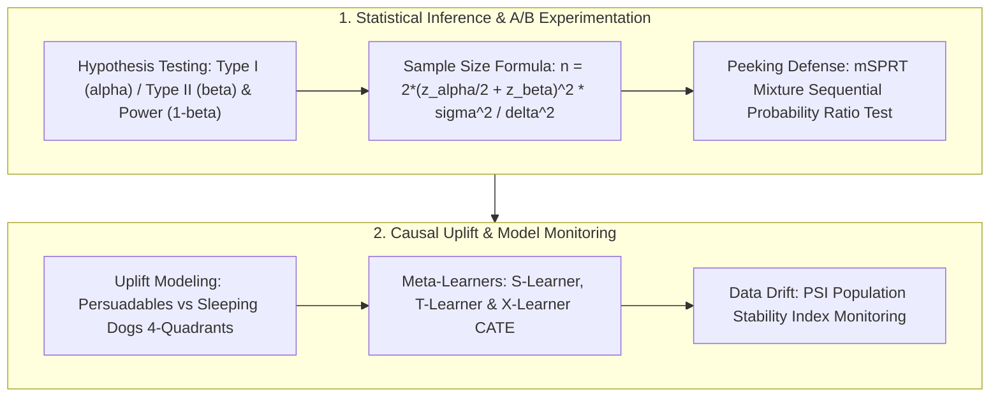

# 🌐 DS Core Cheatsheet: Causal Inference, A/B Testing & Drift

> **Executive Summary**: The fundamental mandate of a Data Scientist (DS) is to drive business growth through rigorous statistical inference, causal identification, and experimentation. This cheatsheet deconstructs five high-frequency interview pillars: sample size algebra and MDE sizing, continuous peeking mitigation via mSPRT, Uplift heterogeneous causal effect modeling (S/T/X-Learners), CUPED variance reduction, and PSI data drift monitoring.

---

## 💡 Interactive Mermaid Architecture



---

## Chapter 1: Statistical Foundations of Data Science

The core mission of a Data Scientist is to guide executive decisions using **unbiased statistical estimation and causal reasoning**.

---

## Chapter 2: Pure Python PSI Data Drift Calculator

PSI measures how much a feature's distribution has shifted from baseline.
Rule of thumb: **$\text{PSI} < 0.1$ stable; $0.1 \le \text{PSI} \le 0.25$ moderate shift; $\text{PSI} > 0.25$ severe drift (retrain model)**.

```python
import numpy as np

def pure_python_psi(actual: np.ndarray, expected: np.ndarray, bins: int = 5) -> float:
    quantiles = np.linspace(0, 100, bins + 1)
    bin_edges = np.percentile(expected, quantiles)
    
    act_counts, _ = np.histogram(actual, bins=bin_edges)
    exp_counts, _ = np.histogram(expected, bins=bin_edges)
    
    act_pct = np.maximum(act_counts / len(actual), 1e-4)
    exp_pct = np.maximum(exp_counts / len(expected), 1e-4)
    
    return float(np.sum((act_pct - exp_pct) * np.log(act_pct / exp_pct)))

if __name__ == "__main__":
    b1 = np.random.normal(0, 1, 1000)
    b2 = np.random.normal(0.2, 1, 1000)
    print("✅ PSI Value:", round(pure_python_psi(b2, b1), 4))
```

---

## Chapter 3: Analytical Derivation of A/B Sample Size Formula

Let sample sizes for both groups be $n$, with variances $\sigma^2$ and true difference $\delta = \mu_T - \mu_C$ (Minimum Detectable Effect, MDE).

Standardized test statistic:
$$Z = \frac{\bar{Y}_T - \bar{Y}_C}{\sqrt{\frac{2\sigma^2}{n}}}$$

1. Under $H_0: \delta = 0$, the rejection threshold is $z_{\alpha/2} \sqrt{\frac{2\sigma^2}{n}}$.
2. Under $H_1: \delta = \text{MDE}$, we require statistical power $1-\beta$:
   $$\delta - z_{\alpha/2} \sqrt{\frac{2\sigma^2}{n}} = z_\beta \sqrt{\frac{2\sigma^2}{n}} \implies \delta = (z_{\alpha/2} + z_\beta) \sqrt{\frac{2\sigma^2}{n}}$$

Squaring both sides yields the canonical **two-sample mean sample size formula**:
$$n = \frac{2 (z_{\alpha/2} + z_\beta)^2 \sigma^2}{\delta^2}$$

For binomial conversion rates (proportions from $p_1$ to $p_2$):
$$n \approx \frac{2 (z_{\alpha/2} + z_\beta)^2 \bar{p}(1-\bar{p})}{(p_1 - p_2)^2}$$

```python
def pure_python_ab_sample_size(
    p_baseline: float,
    mde_relative: float = 0.05,
    alpha: float = 0.05,
    power: float = 0.80
) -> int:
    import scipy.stats as stats
    z_alpha = stats.norm.ppf(1.0 - alpha / 2.0)
    z_beta = stats.norm.ppf(power)
    
    p2 = p_baseline * (1.0 + mde_relative)
    p_bar = (p_baseline + p2) / 2.0
    delta = abs(p2 - p_baseline)
    
    var_term = 2.0 * p_bar * (1.0 - p_bar)
    n = (z_alpha + z_beta)**2 * var_term / (delta**2)
    return int(np.ceil(n))

if __name__ == "__main__":
    print("✅ Required Sample Size per Variant:", pure_python_ab_sample_size(0.05, 0.05))
```

---

## Chapter 4: Continuous Peeking & mSPRT Sequential Testing

Checking $p$-values daily and stopping early inflates false positives from $5\%$ to $>30\%$ due to the Law of the Iterated Logarithm.

### Solution: Mixture Sequential Probability Ratio Test (mSPRT)
$$\Lambda_n = \int \prod_{i=1}^n \frac{f(Y_i \mid \theta)}{f(Y_i \mid 0)} dH(\theta)$$
By martingale optional stopping theorems, checking $\Lambda_n > 1/\alpha$ allows **continuous early stopping anytime while guaranteeing total false positive rate $\le \alpha$**.

---

## Chapter 5: Uplift Modeling & CATE (Conditional Average Treatment Effects)

Uplift models predict individual incremental lift: $\tau(X) = \mathbb{E}[Y(1) - Y(0) \mid X]$.

### User Segmentation Quadrants
1. **Persuadables ($\tau > 0$)**: Buy only if targeted $\to$ **Primary Marketing Target**.
2. **Sure Things ($\tau = 0$)**: Buy regardless $\to$ **Save Budget**.
3. **Sleeping Dogs ($\tau < 0$)**: Unsubscribe if targeted $\to$ **Never Touch**.
4. **Lost Causes ($\tau = 0$)**: Never buy regardless $\to$ **Do Not Target**.

### Meta-Learners Comparison
* **S-Learner**: Single model $Y = f(X, T)$. Prone to regularization bias shrinking $\tau(X) \to 0$.
* **T-Learner**: Two separate models $\mu_1(X), \mu_0(X)$. Can overfit when $N_T \ll N_C$.
* **X-Learner**: Two-stage imputed counterfactual residuals. **Gold standard for imbalanced treatment cohorts**.
