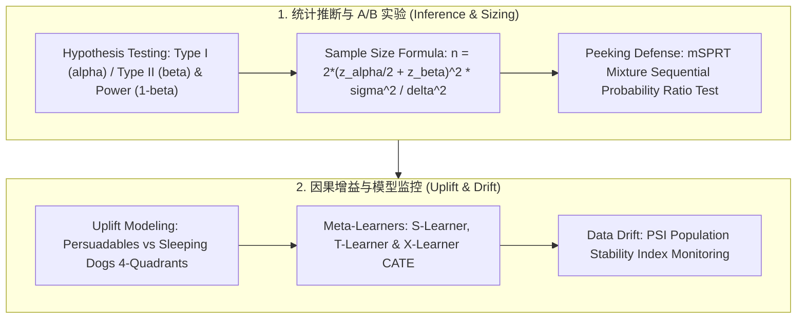
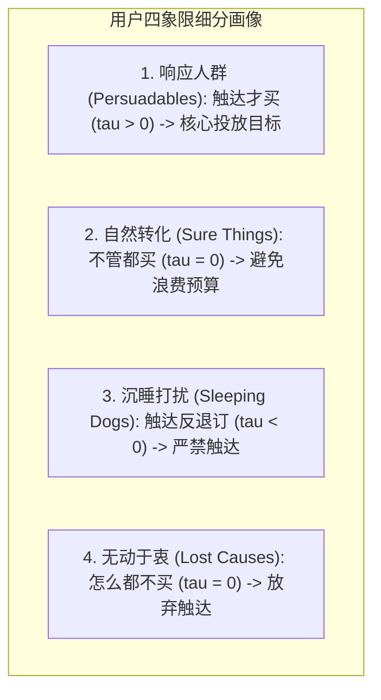

# 🌐 DS 核心知识地图：因果推断、A/B 测试与 Data Drift

> **核心摘要**：数据科学家（Data Scientist）的核心使命在于运用严格的统计推断、因果识别与实验科学驱动商业增长。本速查全景拆解 DS 面试中最高频的五大硬核模块：假设检验与样本量闭式推导、连续偷窥与 mSPRT 序贯检验、Uplift 异质增益模型（S/T/X-Learner）、CUPED 方差缩减以及 PSI 数据漂移监控。

---

## 💡 交互式 Mermaid 架构流程图



---

## 第一章：DS 核心知识体系与统计严密性

DS (Data Scientist) 岗位核心在于**用严格的统计推断（Statistical Inference）与因果分析指导企业决策**。

> 💡 **直观理解**: DS 面试的核心是"统计严谨性讲故事":任何一个决策都要能回答'凭什么因果归因、误差多大、会不会是噪声'。A/B 是因果金标准,PSM/DiD/合成控制是随机化不可行时的备胎,PSI 是模型上线后的守门员——三块拼成 DS 的完整闭环。
>
> 🎤 **面试速答**: "结论:DS 用统计推断与因果分析指导决策,能随机化就 A/B,不能就上观察性方法,上线后监控漂移。原理:A/B 通过随机化切断混杂;PSM/DiD 在无法随机化时用设计代替随机;PSI 量化分布漂移决定是否重训。举个例子:改推荐排序可以 A/B;但'发券是否提高复购'有选择偏差(活跃用户才领券),得用 DiD 对比领券用户与对照组的前后差。"

---

## 第二章：Pure Python PSI 数据漂移计算算子

PSI 衡量"上线前后特征分布偏移多少":把期望分布按分位数切成 5 桶,逐桶比较实际占比与期望占比,加权求和得到一个数。行业经验阈值:**PSI < 0.1 无漂移;0.1–0.25 需关注;> 0.25 严重漂移,必须处理**。

```python
import numpy as np

def pure_python_psi(actual: np.ndarray, expected: np.ndarray, bins: int = 5) -> float:
    quantiles = np.linspace(0, 100, bins + 1)
    bin_edges = np.percentile(expected, quantiles)
    
    act_counts, _ = np.histogram(actual, bins=bin_edges)
    exp_counts, _ = np.histogram(expected, bins=bin_edges)
    
    act_pct = np.maximum(act_counts / len(actual), 1e-4)
    exp_pct = np.maximum(exp_counts / len(expected), 1e-4)
    
    return float(np.sum((act_pct - exp_pct) * np.log(act_pct / exp_pct)))

if __name__ == "__main__":
    b1 = np.random.normal(0, 1, 1000)
    b2 = np.random.normal(0.2, 1, 1000)
    print("✅ 计算得到 PSI 值:", round(pure_python_psi(b2, b1), 4))
```

> 💡 **直观理解**: PSI 是分布的"体检报告":把历史分布按分位数切成 5 个桶,看现在每个桶里的人数占比漂了多少,加权求和得到一个数。它本质是"分桶版 KL 散度":占比比值越偏离 1,漂移越大;桶内人数为 0 时用 1e-4 兜底,避免 log(0) 爆炸。均值平移 0.2σ 时 PSI 约 0.04(安全),平移 0.5σ 时约 0.17(需关注)。
>
> 🎤 **面试速答**: "结论:PSI = Σ(实际占比 − 期望占比)·ln(实际/期望),<0.1 安全,>0.25 严重。原理:按期望分布分位切桶后比较桶占比,本质是离散 KL 散度,对分布整体偏移敏感、对桶内形状不敏感。举个例子:特征均值从 0 漂到 0.2σ,PSI ≈ 0.04,不告警;漂到 0.5σ,PSI ≈ 0.17,触发关注——先查特征源是否变更,再决定重训。"

---

## 第三章：双样本 A/B 测试样本量公式严格代数推导

设两组样本量均为 $n$，均值为 $\mu_T, \mu_C$，方差均为 $\sigma^2$。设两组真实差异为 $\delta = \mu_T - \mu_C$（最小可检测效应 MDE）。

构建检验统计量 $Z$：
$$Z = \frac{\bar{Y}_T - \bar{Y}_C}{\sqrt{\frac{2\sigma^2}{n}}}$$

1. **在原假设 $H_0: \delta = 0$ 下**：拒绝域为 $|Z| > z_{\alpha/2}$，即 $\bar{Y}_T - \bar{Y}_C > z_{\alpha/2} \sqrt{\frac{2\sigma^2}{n}}$。
2. **在备择假设 $H_1: \delta = \text{MDE}$ 下**：要求检出率（统计功效）达到 $1-\beta$：
   $$P_{H_1}\left( \bar{Y}_T - \bar{Y}_C > z_{\alpha/2} \sqrt{\frac{2\sigma^2}{n}} \right) \ge 1 - \beta$$
   标准化后得到临界点等式：
   $$\delta - z_{\alpha/2} \sqrt{\frac{2\sigma^2}{n}} = z_\beta \sqrt{\frac{2\sigma^2}{n}} \implies \delta = (z_{\alpha/2} + z_\beta) \sqrt{\frac{2\sigma^2}{n}}$$

两侧平方并移项，得出**双样本均值检验最小样本量公式**：
$$n = \frac{2 (z_{\alpha/2} + z_\beta)^2 \sigma^2}{\delta^2}$$

对于比例检验（如点击率 CTR 从 $p_1$ 提升到 $p_2$），方差替换为伯努利方差 $\bar{p}(1-\bar{p})$：
$$n \approx \frac{2 (z_{\alpha/2} + z_\beta)^2 \bar{p}(1-\bar{p})}{(p_1 - p_2)^2}$$

```python
def pure_python_ab_sample_size(
    p_baseline: float,
    mde_relative: float = 0.05,
    alpha: float = 0.05,
    power: float = 0.80
) -> int:
    """
    单组所需最小样本量估算
    """
    import scipy.stats as stats
    z_alpha = stats.norm.ppf(1.0 - alpha / 2.0)  # 1.96 for alpha=0.05
    z_beta = stats.norm.ppf(power)               # 0.84 for power=0.80
    
    p2 = p_baseline * (1.0 + mde_relative)
    p_bar = (p_baseline + p2) / 2.0
    delta = abs(p2 - p_baseline)
    
    var_term = 2.0 * p_bar * (1.0 - p_bar)
    n = (z_alpha + z_beta)**2 * var_term / (delta**2)
    return int(np.ceil(n))

if __name__ == "__main__":
    # 基线点击率 5%, 希望检测出 5% 相对提升 (0.05 -> 0.0525)
    sample_needed = pure_python_ab_sample_size(0.05, 0.05)
    print("✅ 单组所需最小样本量:", sample_needed)  # 约 125,000 / 组
```

---

## 第四章：连续偷窥 (Peeking) 与 mSPRT 序贯检验

在日常业务中，产品经理习惯“每天看一眼 $p$-value，只要 $p < 0.05$ 就立刻提前上线”。
* **数学危害**：由于随机游走的重对数律（Law of the Iterated Logarithm），即使没有真实效应，指标波动在时间序列上穿越临界值的概率高达 $30\%\sim 40\%$（假阳性严重膨胀）。

### 解决方案：混合序贯检验 (mSPRT)
基于鞅论（Martingale），对历史数据累积似然比进行正态混合加权：
$$\Lambda_n = \int \prod_{i=1}^n \frac{f(Y_i \mid \theta)}{f(Y_i \mid 0)} dH(\theta)$$
设置动态拒绝边界 $A = 1/\alpha$。只要 $\Lambda_n > 1/\alpha$，即可在**任意时间点安全提前终止实验**，同时将全周期总体假阳性率严格控制在 $\alpha \le 5\%$ 之下！

---

## 第五章：Uplift 增益建模与异质因果效应 (CATE)

标准 ML 预测用户购买概率 $P(Y=1 \mid X)$，但高概率用户不等于需要被营销的用户。**Uplift 建模旨在预测个体因果增益 $\tau(X) = \mathbb{E}[Y(1) - Y(0) \mid X]$**。



### 元学习器算法对比 (Meta-Learners)

| 学习器架构 | 建模机制 | 优势场景 | 局限与劣势 |
|---|---|---|---|
| **S-Learner** | 单一模型：将干预 $T$ 作为普通特征输入 $Y = f(X, T)$ | 简单直接，可复用现有回归器 | 树模型容易忽略弱干预信号，$\tau(X)$ 偏向于 0 |
| **T-Learner** | 双模型：分别拟合 $\mu_1(X) = f_1(X)$ 与 $\mu_0(X) = f_0(X)$ | 不受特征挤压，各自独立拟合 | 无法共享公共表征，当 $N_T \ll N_C$ 时小样本过拟合 |
| **X-Learner** | 两阶段插值：先拟合 $\mu_0, \mu_1$，计算交叉残差 $D_1, D_0$，再加权融合 | **处理组与对照组严重样本不平衡时 SOTA** | 计算复杂度高（需训练 4 个子模型） |

---

## 第六章：5 大高频面试考点与标准解答

### 考点 1：在在线 A/B 测试中，如果发现了 SRM (Sample Ratio Mismatch)，应该如何用卡方检验进行诊断？
* **标准回答**：计算观察频次与期望频次的卡方统计量 $\chi^2 = \sum \frac{(O_i - E_i)^2}{E_i}$；如果 $p < 0.001$，说明存在严重 SRM，往往由分流 Bug 或重定向延迟引起，该实验数据必须废弃！
* **为什么是卡方**：流量分配是实验的"效度地基"——SRM 意味着两桶的组成不再可比，估计量在未知方向偏置。

### 考点 2：如何设计北极星指标 (North Star Metric) 与 Guardrail 护栏指标？
* **标准回答**：北极星指标衡量核心用户价值与商业变现的乘积（如 DAU 时长、总交易 GMV）；护栏指标（Guardrails）负责安全兜底，包含：(1) 技术性能（P99 延迟、Crash 率）；(2) 商业生态（负反馈率、退订率）；(3) 体验平衡（召回覆盖度、曝光基尼系数）。任何实验只有在**护栏指标未被显著击穿的前提下**，北极星指标正向才准许全量发布。
