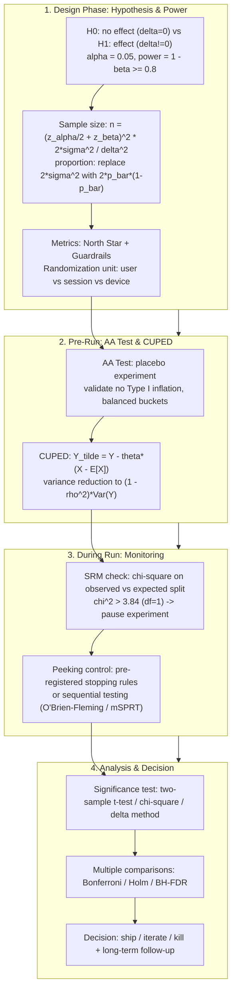

# DS Statistics & Experiment Design: Hypothesis Testing, Sample Size, Multiple Comparisons, SRM & CUPED

> **Core Executive Summary**: Randomized online experiments are the gold standard for causal product decisions, and DS interviews almost always probe the statistics beneath them. This guide covers the full pipeline — hypothesis setup (H₀/H₁), power = 1 − β, sample size formulas, multiple-comparison corrections (Bonferroni/Holm/BH-FDR), p-hacking and peeking, SRM, AA tests, randomization and interference, metric hierarchies, CUPED, and test selection — with formulas and a pure Numpy implementation.

---

## 💡 Interactive Mermaid Architecture Flowchart



---

## 💡 Classic Interview Followups & Core Cheatsheet

* **Key Topic 1**: Derive the sample size formula for two means and explain how each parameter affects $n$.
  * *Standard Answer*: Under H₀ the mean difference is $\mathcal{N}(0, 2\sigma^2/n)$; under H₁ it is $\mathcal{N}(\delta, 2\sigma^2/n)$. Requiring rejection probabilities $\alpha$ (H₀) and $1 - \beta$ (H₁) gives
    $$n = \frac{(z_{\alpha/2} + z_{\beta})^2 \cdot 2\sigma^2}{\delta^2}$$
    with $z_{\alpha/2} = 1.96$ and $z_{\beta} = 0.84$ (80% power). $\delta$ is squared in the denominator: halving the MDE quadruples $n$; tightening $\alpha$ to 0.01 adds ~70%; doubling the variance doubles $n$.

> 🎤 **Interview answer**: "Conclusion: n = (z_{α/2}+z_β)²·2σ²/δ² per group. Why: we demand a rejection probability of α under H₀ and power 1−β under H₁ — the two distributions give up z standard deviations each, and δ sits squared in the denominator, making it the biggest lever. Example: a 10%→12% conversion lift at α=0.05 and 80% power needs 3,838 users per group; halving δ to 1pp quadruples n to about 15,000."

* **Key Topic 2**: Compare Bonferroni, Holm, and Benjamini–Hochberg. When do you control FWER instead of FDR?
  * *Standard Answer*: For $m$ hypotheses, **Bonferroni** rejects $p_{(i)} \le \alpha/m$, controlling the family-wise error rate but crushing power. **Holm** (step-down) rejects $p_{(i)} \le \alpha/(m - i + 1)$ with strictly more power. **Benjamini–Hochberg** controls the false discovery rate, rejecting all $p_{(i)} \le (i/m)\cdot\alpha$ — most powerful, but a controlled fraction of discoveries are false. Use FWER for confirmatory, high-stakes decisions; FDR for exploratory sweeps.

> 🎤 **Interview answer**: "Conclusion: control FWER (Bonferroni/Holm) for confirmatory tests, FDR (BH) for exploratory sweeps. Why: Bonferroni's α/m threshold is the most conservative and hurts power; Holm relaxes stepwise while keeping FWER; BH allows a controlled fraction of false discoveries to recover recall. Example: 20 segment sub-tests uncorrected inflate the family-wise error to 64%; Bonferroni pushes the threshold to 0.0025 and multiplies sample requirements — so FWER is reserved for primary metrics, BH for scans."

* **Key Topic 3**: What is SRM (Sample Ratio Mismatch)? How do you detect and debug it?
  * *Standard Answer*: SRM means the actual traffic split deviates from the plan (e.g., 50/50 planned, 48/52 observed). With expected counts $E_i$, compute $\chi^2 = \sum_i (O_i - E_i)^2 / E_i$ on $df = 1$; above 3.84 ($\alpha = 0.05$) is a flag, and the estimator is biased in an unknown direction — pause and debug. Checklist: randomization code changed mid-test, caching/redirects dropping users from one bucket, bots bypassing assignment, duplicated or lost logging, cookie or device-ID resets, timezone/sampling bugs, overlapping experiments.

> 🎤 **Interview answer**: "Conclusion: SRM is actual traffic split deviating from the plan; χ² > 3.84 (df=1) flags it and you pause. Why: allocation is the validity foundation — a 48/52 actual split means the estimator is biased in an unknown direction, so no significance result can be trusted. Example: planned 50/50, observed 4780/5220 → χ² = (220²/5000)×2 ≈ 19.4 ≫ 3.84; debug order: randomization code redeployed mid-test → cache/CDN dropping a bucket → duplicated or lost instrumentation."

* **Key Topic 4**: Derive CUPED and prove the variance reduction.
  * *Standard Answer*: Let $\tilde{Y} = Y - \theta (X - \mathbb{E}[X])$ with a pre-experiment covariate $X$. Since $\mathbb{E}[\tilde{Y}] = \mathbb{E}[Y]$, the estimator stays unbiased. Minimizing $\text{Var}(\tilde{Y}) = \text{Var}(Y) + \theta^2\text{Var}(X) - 2\theta\,\text{Cov}(Y,X)$ yields
    $$\theta^* = \frac{\text{Cov}(Y,X)}{\text{Var}(X)}, \qquad \text{Var}(\tilde{Y}) = (1 - \rho^2)\,\text{Var}(Y)$$
    At $\rho = 0.7$ the variance drops to 51% — nearly halving the required sample size or test duration.

> 🎤 **Interview answer**: "Conclusion: CUPED removes the variance explained by a pre-experiment covariate; θ* = Cov/Var, variance drops to (1−ρ²). Why: the adjusted metric Y − θ(X − E[X]) keeps its expectation (unbiased), and at the optimal θ the covariance term and the θ² term trade off optimally, leaving only residual variance. Example: ρ=0.7 → 51% variance — the CI narrows ~30% at the same sample size, turning a 2-week experiment into 1; below ρ=0.3, CUPED is not worth the machinery."

* **Key Topic 5**: What is the peeking problem, and how do sequential tests fix it?
  * *Standard Answer*: Under H₀, p-values are uniform, so every snapshot has a ~5% chance of false significance; repeated peeking inflates the effective $\alpha$ multiplicatively — four weekly checks can push Type I error above 20%. Fixes: pre-register sample size and analysis date; group-sequential designs that spend $\alpha$ across looks (O'Brien–Fleming); or always-valid continuous monitoring (mSPRT / AGILE).

> 🎤 **Interview answer**: "Conclusion: peeking inflates the effective α; fix it with pre-registration or sequential testing. Why: under H₀ the p-value is uniform, so each look has a ~5% false-positive rate and k looks inflate it to ≈ 1−(0.95)^k. Example: checking weekly for 4 weeks pushes the false-positive rate to ~19%, past 22% by week 5; 'we looked, it's 0.049, ship it' is meaningless under peeking — O'Brien–Fleming boundaries keep early thresholds around 0.001 and only relax to nominal levels at the end."

---

## 📚 Section 1: Hypothesis Testing Fundamentals & Power Analysis

### 1.1 The Decision Framework: H₀, H₁ and the Two Errors

Every experiment tests $H_0: \delta = 0$ (no effect) against $H_1: \delta \neq 0$. This decision table is the foundation of every follow-up — rows are "your decision," columns are "how the world really is," and the two diagonals are the two error types vs. the correct decisions:

| Decision \ Truth | $H_0$ true (no effect) | $H_1$ true (real effect) |
| :--- | :--- | :--- |
| **Reject $H_0$** (ship change) | Type I error (false positive), prob. $\alpha$ | Correct decision — **power** $= 1 - \beta$ |
| **Fail to reject $H_0$** (keep baseline) | Correct decision, prob. $1 - \alpha$ | Type II error (false negative), prob. $\beta$ |

$\alpha$ is set by the experimenter (0.05 typical, 0.01 for high-stakes); $\beta$ follows from $\alpha$, effect size, $n$ and variance — the two are linked, and both fall only when data grows.

> 📊 **How to read this table**: Memorize it cell by cell: top-right (real effect + you reject) = power 1−β; bottom-left (no effect + you reject) = false positive α — 80% of interview questions revolve around those two cells; the diagonal cells are correct decisions, frequently ignored but equally grist for follow-ups.

> 💡 **Intuition**: α and β are two kinds of injustice: α convicts an innocent (shipping an ineffective change), β lets a culprit go (missing a real effect). The only way to reduce both is more data — which is exactly why the sample size formula exists.
>
> 🎤 **Interview answer**: "Conclusion: α is the false-positive rate, 1−β is power, and the two are coupled through n. Why: α is set by the experimenter; β is derived from α, effect size, variance, and n — with n fixed, tightening α raises β. Example: moving α from 0.05 to 0.01 (2.58 vs 1.96) adds ~70% to the sample size to keep power."

### 1.2 Statistical Power

$$\text{Power} = 1 - \beta = P(\text{reject } H_0 \mid H_1 \text{ is true})$$

Power is the probability of detecting a real effect of size $\delta$; convention targets $\ge 0.8$. Power rises with $n$ and $\delta$ and falls as $\sigma^2$ grows. Underpowered tests are the most common silent failure — a "no significant difference" from a low-power experiment is nearly uninformative. Run power analysis *before* the experiment, never after.

> 💡 **Intuition**: Power is "does the detector ring when the truth is present?" At 0.8, a real effect still has a 20% chance of wasting the run; a low-power 'not significant' is like measuring room temperature with a thermometer — no fever reading doesn't mean no fever, it means the instrument is too weak.
>
> 🎤 **Interview answer**: "Conclusion: power = 1−β = the probability of detecting a real effect of size δ; the industry standard is ≥ 0.8. Why: power rises with n and δ, falls as variance grows — compute it before, never explain afterwards. Example: 200 users trying to detect a 1% conversion lift gives power around 0.3 — the 'not significant' verdict would just mislead the decision; compute sample size first."

---

## ⚡ Section 2: Sample Size Calculation (Means & Proportions)

### 2.1 Comparing Two Means

For a continuous metric with per-group variance $\sigma^2$:

$$n_{\text{per group}} = \frac{(z_{\alpha/2} + z_{\beta})^2 \cdot 2\sigma^2}{\delta^2}$$

The effect is detected when the signal-to-noise ratio $\delta / \sqrt{2\sigma^2/n}$ clears $z_{\alpha/2} + z_{\beta}$ standard deviations under the null.

> 💡 **Intuition**: The numerator is "the budget α and β each give up in z standard deviations"; the denominator is "the gap we want to resolve." Bigger numerator (stricter/higher power) or smaller denominator (smaller MDE) means more users. Mental math: z₁.₉₆ + z₀.₈₄ = 2.8, squared ≈ 7.84.
>
> 🎤 **Interview answer**: "Conclusion: n = (z_{α/2}+z_β)²·2σ²/δ² — δ sits squared in the denominator, the most expensive knob. Why: detection is making the signal δ clear the α+β-standard-deviation threshold over the noise √(2σ²/n). Example: halving the MDE quadruples n; doubling variance doubles n; α 0.05→0.01 multiplies n by ~1.7 — these three scaling rules are the standard mental-math questions."

### 2.2 Comparing Two Proportions

For Bernoulli metrics (conversion, CTR), $\sigma^2 = p(1-p)$ with pooled rate $\bar{p} = (p_1 + p_2)/2$:

$$n = \frac{(z_{\alpha/2} + z_{\beta})^2 \cdot 2\bar{p}(1-\bar{p})}{\delta^2}$$

| Metric type | Variance term | Sample size per group |
| :--- | :--- | :--- |
| Continuous (revenue, session time) | $2\sigma^2$ | $n = (z_{\alpha/2} + z_{\beta})^2 \cdot 2\sigma^2 / \delta^2$ |
| Proportion (conversion, CTR) | $2\bar{p}(1-\bar{p})$ | $n = (z_{\alpha/2} + z_{\beta})^2 \cdot 2\bar{p}(1-\bar{p}) / \delta^2$ |

Since $p(1-p)$ peaks at $p = 0.5$, low base rates (CTR, 3-day retention) demand far more traffic for the same absolute lift.

> 📊 **How to read this table**: The two rows differ only in the variance term — continuous uses 2σ², proportion uses 2p̄(1−p̄); everything else is identical. Copy the formula "half-and-half," but be ready to explain why the proportion variance is p(1−p): that is just the Bernoulli variance.

> 💡 **Intuition**: Bernoulli variance is tied to the base rate: p(1−p) is largest at p=0.5, so for a fixed *absolute* lift a 50% baseline actually needs the most traffic. Low base rates are expensive for a different reason: a meaningful *relative* lift translates to a tiny absolute δ — a 10% relative lift at a 10% baseline is only 1pp, while at a 50% baseline it is 5pp.
>
> 🎤 **Interview answer**: "Conclusion: proportion sample size = (z_{α/2}+z_β)²·2p̄(1−p̄)/δ². Why: Bernoulli variance p(1−p) peaks at 0.5; low-base-rate metrics are expensive because the same relative lift shrinks the absolute δ. Example: 10%→12% (2pp absolute) needs 3,838 per group; for a 10% relative lift, a 10% baseline needs ~15,000 per group (δ=1pp) while a 50% baseline needs only ~1,600 (δ=5pp) — a 10× gap."

### 2.3 Worked Numerical Example

Baseline $p_1 = 10\%$, minimum detectable lift $\delta = 2$ pp (10% → 12%), $\alpha = 0.05$, power 0.8:

$$n = \frac{(1.96 + 0.84)^2 \cdot 2 \cdot 0.11 \cdot 0.89}{(0.02)^2} \approx 3{,}838 \text{ users per group}$$

At 10k daily users split 50/50 that is ~8 days; at 1k daily users, over two months — triggering a design rethink (larger MDE, CUPED, or a more sensitive metric).

> 💡 **Intuition**: 3,838 is a number worth memorizing — it is the canonical answer for "10%→12%, α=0.05, power 0.8," used both in whiteboard math and to sanity-check code. The calendar-time translation is the real decision input: ~8 days at 10k daily users split 50/50; over two months at 1k — beyond acceptable duration, redesign.
>
> 🎤 **Interview answer**: "Conclusion: 10%→12% needs about 3,838 users per group. Why: plug p̄=0.11, δ=0.02 into 7.84·2p̄(1−p̄)/δ². Example: at 10k daily users split 50/50 that's 7–8 days; at 1k daily users it's 2 months — then enlarge the MDE, add CUPED, or switch to a more sensitive metric. Compute the calendar days before you launch."

---

## 🌀 Section 3: Multiple Comparisons, p-Hacking & Peeking

### 3.1 FWER vs FDR

Testing $m$ hypotheses inflates the chance of at least one false positive: $\text{FWER} = 1 - (1-\alpha)^m \approx m\alpha$. Two control philosophies:

| Method | Reject $H_{0(i)}$ when | Controls | Power characteristics |
| :--- | :--- | :--- | :--- |
| **Bonferroni** | $p_{(i)} \le \alpha/m$ | FWER | Over-conservative; power collapses with large $m$ |
| **Holm (step-down)** | $p_{(i)} \le \alpha/(m - i + 1)$ | FWER | Strictly more powerful than Bonferroni |
| **Benjamini–Hochberg** | $p_{(i)} \le (i/m)\cdot\alpha$ | FDR | Most powerful; allows a controlled fraction of false discoveries |

> 📊 **How to read this table**: Watch the third column, "Controls" — Bonferroni/Holm control FWER (probability of at least one false positive), BH controls FDR (fraction of false discoveries among discoveries); power increases left to right at the cost of more "forgiveness," and that trade-off is the core of the selection question.

> 💡 **Intuition**: Controlling FWER is "class discipline": one cheater and everyone retakes the exam — strict but hurts the innocent; controlling FDR is "spot checks": 5% false positives are allowed in, but most discoveries are guaranteed real — right for screening candidates, wrong for life-or-death calls.
>
> 🎤 **Interview answer**: "Conclusion: FWER (Bonferroni/Holm) for confirmatory tests, FDR (BH) for exploratory sweeps. Why: FWER = 1−(1−α)^m ≈ mα; Bonferroni's α/m is strictest, Holm relaxes stepwise while keeping FWER, BH rejects the prefix with p ≤ (i/m)α. Example: 20 segment tests uncorrected → 64% family-wise error; BH only rejects the prefix — a few false discoveries allowed in exchange for many true ones."

### 3.2 The Peeking Problem

The p-value is a random variable — uniform under H₀ — so *any* snapshot has a ~5% chance of significance; unlimited peeking drives the effective Type I error toward 1. This is the statistical core of p-hacking: stopping when significant, extending when not, or "just one more week" all inflate false positives beyond nominal $\alpha$.

> 💡 **Intuition**: Peeking is like flipping a coin repeatedly looking for heads — each flip (each data look) has a 5% chance of faking "significance," and 20 flips almost guarantee one — but that is the coin's luck, not the experiment's effect. Because the p-value is uniform under H₀, a snapshot at any moment can lie.
>
> 🎤 **Interview answer**: "Conclusion: peeking inflates the effective α; fix with pre-registration or sequential testing. Why: under H₀, p ~ Uniform(0,1), each look has a 5% false-positive rate, k looks ≈ 1−(0.95)^k, and unlimited peeking approaches 1. Example: weekly looks for 4 weeks → ~19% false-positive rate; 'it's 0.049, let's ship' is meaningless after peeking — pre-register, or switch to a sequential design."

### 3.3 Anti-Peeking Tooling

Pre-register the sample size and analysis date before launch. For flexibility, use group-sequential designs (O'Brien–Fleming) or always-valid continuous monitoring (mSPRT / AGILE). Never act on "we looked, it's 0.049, let's ship" — that threshold is meaningless under peeking.

> 💡 **Intuition**: Sequential designs are "α paid in installments": every peek spends some of the α budget, and once it's spent you can't look — O'Brien–Fleming spends almost nothing early (extremely conservative boundaries) and approaches nominal levels only at the end; mSPRT instead budgets α uniformly over time so any moment is "always valid" to look.
>
> 🎤 **Interview answer**: "Conclusion: pre-register stopping rules, or use O'Brien–Fleming / mSPRT for legitimate early stopping. Why: α is allocated across the looks so the total family-wise error stays at the nominal level. Example: with 5 planned interim analyses, the first boundary is around 0.00001 and only the last approaches 0.05 — early stopping demands much stronger evidence."

---

## ⚡ Section 4: Experiment Validity, Infrastructure & Variance Reduction

### 4.1 SRM Detection & Debugging

With $N$ users and a planned 50/50 split, expected counts are $E_i = N/2$. The SRM test is a chi-square goodness-of-fit:

$$\chi^2 = \sum_{i} \frac{(O_i - E_i)^2}{E_i}, \qquad df = 1, \quad \chi^2_{0.05,1} = 3.84$$

Above 3.84, pause and debug: randomization code changed mid-test, caching/CDN dropping users from one bucket, bots bypassing assignment, duplicated or lost logging, cookie or device-ID changes, timezone/sampling bugs, overlapping experiments. SRM is a *validity* failure — with a 48/52 actual split, no significance result can be trusted.

> 💡 **Intuition**: SRM is an ECG anomaly on the experiment: the traffic went into the wrong buckets, so every metric that follows is being read off a noisy trace. The χ² test asks: is this imbalance larger than pure random fluctuation? For 10k users in a 50/50 split, random fluctuation is only ~5000±50 (1σ) — a deviation of 220 is a 4+ sigma systemic event.
>
> 🎤 **Interview answer**: "Conclusion: χ² > 3.84 (df=1) flags SRM — pause, then debug. Why: χ² = Σ(O−E)²/E; SRM means the estimator is biased in an unknown direction, so no metric interpretation survives. Example: 4780/5220 → χ² ≈ 19.4, far past the critical value; first priority: was the randomization code redeployed mid-test, then cache/CDN dropping a bucket, then duplicated or lost instrumentation."

### 4.2 AA Tests

An AA test runs the machinery with no treatment: both arms identical. It validates that observed Type I error is near nominal $\alpha$, buckets are balanced, and instrumentation is clean — cheap insurance against silently corrupted experiments.

> 💡 **Intuition**: An AA test is a placebo experiment: both arms get sugar pills, so if you still detect "significant differences," the measuring instruments (assignment/instrumentation) are lying. A few days of AA before the real test is the cheapest insurance you can buy.
>
> 🎤 **Interview answer**: "Conclusion: AA validates the assignment and instrumentation pipeline; repeated AA should show significance about 5% of the time. Why: with no treatment in either arm, any systematic difference comes from infrastructure, not the product. Example: 3 of 20 AA runs significant (15%) means Type I inflation — check duplicated instrumentation or uneven assignment first; otherwise the real experiment starts already compromised."

### 4.3 Randomization Units & Interference

The unit must match the causal mechanism: user-level for personalization, session-level for UI, device-level for mobile. The key assumption is SUTVA — a unit's outcome depends only on its own treatment. **Network effects** violate it: in social products, marketplaces, or ads, treatment users change control users' experience (a friend shares a feature; a seller's price change reaches buyers in both groups), diluting or even flipping the estimate. Mitigations: cluster randomization, network-aware estimators, or exposure analysis (at the cost of selection bias).

> 💡 **Intuition**: SUTVA says "your outcome depends only on your own treatment" — but in social networks, your friend's experiment changes your experience, like a classmate's cough in the exam room. Choosing the wrong unit (user-level for a UI experiment) or having network effects dilutes or even flips the estimate, and the estimator is no longer trustworthy.
>
> 🎤 **Interview answer**: "Conclusion: the randomization unit must match the causal mechanism; network effects violate SUTVA, so use cluster randomization or network-aware estimators. Why: when treated users change control users' experience, control is no longer a 'no-treatment' baseline and the delta gets diluted or reversed. Example: a ride-hailing price experiment randomized by user — treated drivers changing pickup behavior alters control users' wait times; cluster-randomize by city/region instead, or use exposure analysis (accepting renewed selection bias)."

### 4.4 Metric Hierarchy: North Star, Guardrails, Short vs Long Term

| Metric type | Role | Examples |
| :--- | :--- | :--- |
| **North star** (primary) | The one number the experiment is designed to move | GMV, active-day engagement, signups |
| **Guardrail** | Must not regress while optimizing the primary | latency, crash rate, privacy, retention |
| **Long-term** (lagging) | Validates that short-term gains persist | D30 retention, LTV, trust |

Never judge an experiment by the primary metric alone: short-term proxies (clicks) can contradict long-term value, and a primary win with a guardrail regression is a different decision than one without.

> 📊 **How to read this table**: Three rows, three time scales and three responsibilities — the north star decides ship/kill, guardrails decide "up, but is it worth it?", long-term decides "does the short-term win persist"; any 'how do you choose metrics' answer should cite this triangle or risk a follow-up.

> 💡 **Intuition**: The north star is the steering wheel, guardrails are the brakes, and the long-term metric is the rear-view mirror. Steering alone crashes: clicks up but engagement quality down, or retention collapsing after day 7 — every launch decision should clear all three gates.
>
> 🎤 **Interview answer**: "Conclusion: primary + guardrails + long-term metrics, always judged together. Why: short-term proxies can contradict long-term value, and a guardrail regression means winning the battle but losing the war. Example: a recommendation test with clicks +5% but D7 retention −2% must be killed; only if guardrails hold and D30 confirms +3% do you ship."

### 4.5 CUPED Variance Reduction

$$\tilde{Y} = Y - \theta (X - \mathbb{E}[X]), \quad \theta^* = \frac{\text{Cov}(Y,X)}{\text{Var}(X)} \implies \text{Var}(\tilde{Y}) = (1 - \rho^2)\text{Var}(Y)$$

The covariate $X$ removes the portion of metric variance it explains without touching bias; at $\rho = 0.7$ the variance halves — like doubling the experiment for free. Variants: stratify by $X$, use multiple covariates, or combine with the delta method for ratio metrics.

> 💡 **Intuition**: CUPED is "regress on the midterm": use pre-experiment history (X) to predict how each user will perform during the experiment, and subtract the predictable part — with Y and X strongly correlated (ρ=0.7), variance drops by half and traffic is effectively doubled for free. One trap: the covariate must be pre-experiment; using in-experiment data introduces bias.
>
> 🎤 **Interview answer**: "Conclusion: θ* = Cov(Y,X)/Var(X), adjusted variance (1−ρ²)·Var(Y). Why: Y − θ(X − E[X]) keeps its expectation, and the optimal θ makes the covariance and θ² terms trade off optimally; the covariate must come from before the experiment. Example: ρ=0.7 → 51% variance — the CI narrows ~30% at the same sample size, or sample size halves at fixed power. Shrink variance before inflating traffic."

### 4.6 Choosing the Significance Test

| Scenario | Test |
| :--- | :--- |
| Continuous metric, 2 groups | two-sample t-test (Welch for unequal variance) |
| Binary metric, 2 groups | chi-square / two-proportion z-test |
| Ratio metric (revenue/user) | delta method / bootstrap |
| Repeated peeking / early stop | sequential test (mSPRT, O'Brien–Fleming) |
| A/B/n with corrections | ANOVA + post-hoc pairwise with Holm/BH |

> 📊 **How to read this table**: The first column holds "scenario keywords," the second the matching test — when asked 'which test for this metric?', name the scenario keyword first, then the test, and the answer is complete; the last row is the reminder that A/B/n is ANOVA plus pairwise corrections, not a pile of t-tests.

> 💡 **Intuition**: Choosing a test is matching "metric shape × analysis needs": continuous → t, binary → chi-square, per-user revenue (a ratio) → delta method, repeated looks → sequential. Choosing wrong is like measuring height with a bathroom scale — tool and problem mismatch.
>
> 🎤 **Interview answer**: "Conclusion: two-sample t for continuous (Welch for unequal variance), chi-square/z for binary, delta method for ratios, sequential tests when peeking, ANOVA + pairwise corrections for A/B/n. Why: the test must match the metric distribution and sampling mechanism. Example: per-user GMV is a ratio metric — a plain t-test underestimates the variance, use the delta method instead; with 5× variance asymmetry, Welch beats Student."

---

## 🐍 Pure Numpy Implementation

```python
import numpy as np

def sample_size_means(delta: float, sigma: float, alpha: float = 0.05, power: float = 0.8) -> int:
    """Per-group sample size for a two-sample test on continuous metrics."""
    z_alpha2, z_beta = 1.96, 0.84  # alpha=0.05 two-tailed; power=0.8
    n = (z_alpha2 + z_beta) ** 2 * 2 * sigma ** 2 / delta ** 2
    return int(np.ceil(n))

def sample_size_proportion(p1: float, p2: float, alpha: float = 0.05, power: float = 0.8) -> int:
    """Per-group sample size for binary (proportion) metrics."""
    z_alpha2, z_beta = 1.96, 0.84
    p_bar = (p1 + p2) / 2
    n = (z_alpha2 + z_beta) ** 2 * 2 * p_bar * (1 - p_bar) / (p1 - p2) ** 2
    return int(np.ceil(n))

def benjamini_hochberg(pvals: np.ndarray, alpha: float = 0.05) -> np.ndarray:
    """BH FDR correction: returns boolean rejection flags."""
    pvals = np.asarray(pvals, dtype=float)
    m = len(pvals)
    order = np.argsort(pvals)
    below = pvals[order] <= (np.arange(1, m + 1) / m) * alpha
    if not below.any():
        return np.zeros(m, dtype=bool)
    max_idx = int(np.max(np.where(below)[0]))
    reject = np.zeros(m, dtype=bool)
    reject[order[:max_idx + 1]] = True
    return reject

def srm_chi2(observed: np.ndarray, expected: np.ndarray) -> float:
    """SRM chi-square statistic: observed vs planned traffic split."""
    obs = np.asarray(observed, dtype=float)
    exp = np.asarray(expected, dtype=float)
    return float(np.sum((obs - exp) ** 2 / exp))

def cuped_adjust(y: np.ndarray, x: np.ndarray) -> np.ndarray:
    """CUPED-adjusted metric: Y - theta*(X - E[X]), theta = Cov(Y,X)/Var(X)."""
    cov_yx = np.cov(y, x)[0, 1]
    var_x = np.var(x, ddof=1)
    theta = cov_yx / var_x
    return y - theta * (x - np.mean(x))

if __name__ == "__main__":
    print("Means sample size (delta=2, sigma=10):", sample_size_means(2.0, 10.0))      # 392
    print("Prop sample size (10% -> 12%):", sample_size_proportion(0.10, 0.12))         # 3838
    pvals = np.array([0.001, 0.02, 0.04, 0.06, 0.30])
    print("BH rejects:", benjamini_hochberg(pvals))                                     # [T, T, F, F, F]
    chi2 = srm_chi2(np.array([4780, 5220]), np.array([5000, 5000]))
    print(f"SRM chi2 = {chi2:.2f} (critical 3.84 at df=1, alpha=0.05)")                 # 19.36 -> flag!
    y = np.array([10.0, 12.0, 11.0, 15.0, 9.0]); x = np.array([9.5, 11.8, 10.8, 14.5, 8.8])
    y_adj = cuped_adjust(y, x)
    print("CUPED var:", round(np.var(y, ddof=1), 3), "->", round(np.var(y_adj, ddof=1), 3))
```

---

## 📝 Takeaways & Engineering Best Practices

1. **Plan before you run**: fix $\alpha$, power $\ge 0.8$, and MDE up front; pre-register metrics, segments, and stopping rules.
2. **Trust but verify infrastructure**: run an AA test first; monitor SRM daily and pause on $\chi^2 > 3.84$; treat any mid-test instrumentation change as a validity incident.
3. **Never peek at nominal α**: pre-registered analysis dates, O'Brien–Fleming designs, or always-valid sequential tests (mSPRT) when early stopping matters.
4. **Correct for multiplicity deliberately**: FWER (Bonferroni/Holm) for confirmatory primary metrics, FDR (Benjamini–Hochberg) for exploratory sweeps — and state which one you used.
5. **Shrink variance before inflating traffic**: CUPED with a correlated covariate ($\rho \ge 0.5$) often saves weeks of runtime; choose the randomization unit to match the causal mechanism.
