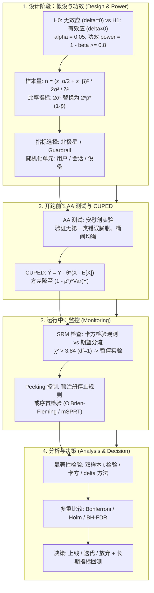

# DS 统计与实验设计：假设检验、功效分析、样本量计算、多重比较、SRM 与 CUPED 全景全解

> **核心摘要**：随机化线上实验是产品因果决策的金标准，DS 面试几乎必考其背后的统计学。本指南完整串起实验全链路：假设设定 (H₀/H₁)、α/β 权衡与功效 power = 1−β、均值与比率两类样本量公式、多重比较校正 (Bonferroni/Holm/FDR-BH)、p-hacking 与 peeking 问题、SRM 检测与排查、AA 测试、随机化单元与网络干扰、北极星/guardrail 指标体系、CUPED 方差缩减推导与显著性检验工具选型 (t 检验/卡方/序贯检验)，每个环节均配公式与 Pure Numpy 实现。

---

## 💡 交互式 Mermaid 架构流程图



---

## 💡 经典面试追问与考点速查

* **考点 1**：推导双均值比较的样本量公式，并说明各参数如何影响 $n$？
  * *标准回答*：H₀ 下样本均值差服从 $\mathcal{N}(0, 2\sigma^2/n)$，H₁ 下为 $\mathcal{N}(\delta, 2\sigma^2/n)$。要求 H₀ 下拒绝概率为 $\alpha$、H₁ 下为 $1-\beta$，联立得到：
    $$n = \frac{(z_{\alpha/2} + z_{\beta})^2 \cdot 2\sigma^2}{\delta^2}$$
    其中 $z_{\alpha/2}=1.96$（双侧 $\alpha=0.05$）、$z_{\beta}=0.84$（$\beta=0.2$）。最小可检测效应 (MDE) $\delta$ 在分母上平方——MDE 减半，样本量翻 4 倍；$\alpha$ 从 0.05 收紧到 0.01（2.58）样本量约增 70%；方差翻倍，样本量翻倍。

> 🎤 **面试速答**: "结论:n = (z_{α/2}+z_β)²·2σ²/δ²,每桶用户数。原理:要求 H₀ 下错拒概率 α、H₁ 下检出力 1−β,两个分布各让出 z 个标准差;δ 在分母平方,是最大杠杆。举个例子:10%→12% 转化提升、α=0.05、功效 0.8,需要每桶 3838 人;δ 从 2pp 减半到 1pp,样本量×4,从 3838 涨到约 1.5 万。"
* **考点 2**：Bonferroni、Holm 与 Benjamini-Hochberg 三种校正有何区别？何时控制 FWER 而非 FDR？
  * *标准回答*：对 $m$ 个假设，**Bonferroni** 拒绝 $p_{(i)} \le \alpha/m$，控制家族错误率 (FWER) 但功率损失严重。**Holm** 为逐步下降法：p 值升序排序后，仅当 $p_{(i)} \le \alpha/(m-i+1)$ 才拒绝；同样控制 FWER 且功率严格优于 Bonferroni，且拒绝集绝不超集。**Benjamini-Hochberg** 控制错误发现率 (FDR)，拒绝所有 $p_{(i)} \le (i/m)\cdot\alpha$。验证性、高 stakes 场景（如主指标）用 FWER；探索性多假设场景（指标/分群扫描）用 FDR，允许受控比例的错误发现以换取召回。

> 🎤 **面试速答**: "结论:验证性场景控 FWER(Bonferroni/Holm),探索性扫描控 FDR(BH)。原理:Bonferroni 阈值 α/m 最保守但伤功率,Holm 逐步放松仍保 FWER 且功率更高,BH 允许受控比例的假发现换召回。举个例子:m=20 个分群跑 20 个检验,不校正族错误率 64%;Bonferroni 阈值压到 0.0025,样本量要求剧增——所以主指标才配用 FWER,扫描用 BH。"
* **考点 3**：什么是 SRM？如何检测并排查根因？
  * *标准回答*：SRM 指实际流量分配偏离计划分流（如计划 50/50 但实际 48/52）。总流量 $N$、期望桶量 $E_i$ 下计算卡方统计量 $\chi^2 = \sum_i (O_i - E_i)^2/E_i$，$df=1$ 时临界值 3.84（$\alpha=0.05$）——超限即告警。SRM 意味着估计量在未知方向上有偏，实验结论不可信，必须暂停。排查清单：随机化代码中途变更、缓存/CDN 重定向丢桶、机器人流量绕过分配、埋点事件重复或丢失、cookie/设备 ID 重置导致换组、时区与抽样 bug、与其他实验交叉干扰。

> 🎤 **面试速答**: "结论:SRM 是实际分流偏离计划,χ²>3.84(df=1) 即告警、先暂停实验。原理:流量分配是效度地基——48/52 的实际分流意味着估计量在未知方向偏置,任何显著性都不可信。举个例子:计划 50/50、观察 4780/5220,χ²=(220²/5000)×2≈19.4 ≫ 3.84;排查顺序:随机化代码是否中途重发版 → 缓存/CDN 丢桶 → 埋点重复或丢失。"
* **考点 4**：推导 CUPED 并证明方差缩减。
  * *标准回答*：定义调整后指标 $\tilde{Y} = Y - \theta (X - \mathbb{E}[X])$，$X$ 为实验前协变量（如基线 7 日指标）。由于 $\mathbb{E}[\tilde{Y}] = \mathbb{E}[Y]$，估计保持无偏。对 $\text{Var}(\tilde{Y}) = \text{Var}(Y) + \theta^2\text{Var}(X) - 2\theta\text{Cov}(Y,X)$ 求 $\theta$ 极小值：
    $$\theta^* = \frac{\text{Cov}(Y,X)}{\text{Var}(X)}, \qquad \text{Var}(\tilde{Y}) = (1 - \rho^2)\,\text{Var}(Y)$$
    相关系数 $\rho = 0.7$ 时方差降至 51%，相当于样本量或实验时长近乎减半。

> 🎤 **面试速答**: "结论:CUPED 用实验前协变量削掉可解释方差,θ*=Cov/Var,方差降至 (1−ρ²)。原理:调整指标 Y−θ(X−E[X]) 期望不变(无偏),方差中协方差项与 θ² 项此消彼长,最优 θ 下残差只剩 (1−ρ²)Var(Y)。举个例子:ρ=0.7 → 方差 51%,同样样本量置信区间收窄约 30%,实验 2 周变 1 周;ρ<0.3 时收益有限,不值得上 CUPED。"
* **考点 5**：什么是 peeking 问题？序贯检验如何修复？
  * *标准回答*：H₀ 下 p 值服从均匀分布，任意中间快照都有约 5% 假阳性概率；反复偷看 (peeking) 会使有效 $\alpha$ 成倍膨胀——每周看一次、连看 4 周，真实第一类错误可超过 20%。修复方案：(1) 预注册样本量与分析日期，开跑后不再看数据；(2) 分组序贯设计按阶段"花费" α（如 O'Brien–Fleming 边界：早期边界极保守、后期接近名义水平）；(3) 持续监控用恒有效推断 (mSPRT/AGILE)，把误差按时间预算而非按每次查看预算。

> 🎤 **面试速答**: "结论:peeking 使有效 α 膨胀,修法是预注册或序贯检验。原理:H₀ 下 p 值均匀分布,每次查看 5% 假阳率,看 k 次后假阳率 ≈ 1−(0.95)^k。举个例子:每周看一次连看 4 周,假阳率 ≈ 19%、第 5 周超 22%;'看了 3 次,0.049,上吧'这个 0.049 没有意义——O'Brien–Fleming 边界把早期阈值压到 0.001 级别,后期才放宽到名义水平。"

---

## 📚 第一章：假设检验基础与功效分析 (Hypothesis Testing & Power Analysis)

### 1.1 决策框架：H₀、H₁ 与两类错误

每个实验都在检验原假设 $H_0: \delta = 0$（无效应）与备择假设 $H_1: \delta \neq 0$（有效应）。下面的决策表是所有追问的地基——行是"你怎么决策",列是"世界真实如何",两条对角线分别对应两类错误与正确决策：

| 决策 \ 真实情况 | $H_0$ 为真（无效应） | $H_1$ 为真（有效应） |
| :--- | :--- | :--- |
| **拒绝 $H_0$**（上线改动） | 第一类错误（假阳性），概率 $\alpha$ | 正确决策 —— **功效** $= 1 - \beta$ |
| **不拒绝 $H_0$**（维持基线） | 正确决策，概率 $1 - \alpha$ | 第二类错误（假阴性），概率 $\beta$ |

$\alpha$ 由实验者设定（常规 0.05，高风险改动 0.01）。$\beta$ 是派生量：固定 $n$ 与效应量时，压低 $\alpha$ 会抬高 $\beta$ —— 两者通过样本量相连，想同时降低只能增加数据。

> 📊 **怎么读这张表**: 按"行×列"四个格子记:右上角(有效应且拒绝)= 功效 1−β,左下角(无效应却拒绝)= 假阳性 α——面试题 80% 围绕这两个格子的权衡展开;对角线格子则是"正确决策",常被忽略但同样会被追问。

> 💡 **直观理解**: α 和 β 是两种"冤枉":α 是冤枉了好人(把无效改动当有效上线),β 是放走坏人(真有效果没检出)。想同时少冤枉,只能多招兵(样本量)——这正是样本量公式存在的理由。
>
> 🎤 **面试速答**: "结论:α 是假阳性、1−β 是功效,两者通过 n 相连。原理:α 由实验者设定,β 由 α、效应量、方差与 n 派生;固定 n 时压低 α 必然抬高 β。举个例子:高风险改动把 α 从 0.05 收紧到 0.01(2.58 vs 1.96),功效不变时样本量约增 70%。"

### 1.2 统计功效 (Statistical Power)

$$\text{Power} = 1 - \beta = P(\text{拒绝 } H_0 \mid H_1 \text{ 为真})$$

功效是"真实效应 $\delta$ 存在时成功检出的概率"。行业惯例要求功效 $\ge 0.8$（即 $\beta \le 0.2$）。功效随 $n$ 与 $\delta$ 增大而上升，随方差 $\sigma^2$ 与更严格的 $\alpha$ 而下降。**功效不足是最常见的隐性失败**：功效不足实验得出"无显著差异"几乎不提供信息——那更可能是假阴性而非真实无效应。务必在实验前做功效分析，绝不在事后用低功效做解释。

> 💡 **直观理解**: 功效是"真相在场时,检测器响不响"。0.8 意味着真有效果的实验有 20% 概率白跑;低功效实验的'无显著差异'像用体温计测室温:没显示发烧不代表没发烧,只代表温度计不够准。
>
> 🎤 **面试速答**: "结论:功效 = 1−β = 真有效应时检出的概率,行业标准 ≥0.8。原理:功效随 n 与 δ 上升、随方差 σ² 上升而下降,事前算、事后不解释。举个例子:200 人想检出 1% 的转化提升,功效可能只有 0.3——跑完报'不显著'只会误导决策,应该先算样本量再说。"

---

## ⚡ 第二章：样本量计算（均值与比率）

### 2.1 双均值比较

对连续指标（每桶方差 $\sigma^2$）：

$$n_{\text{每桶}} = \frac{(z_{\alpha/2} + z_{\beta})^2 \cdot 2\sigma^2}{\delta^2}$$

直觉：当信噪比 $\delta / \sqrt{2\sigma^2/n}$ 越过原假设分布下 $z_{\alpha/2} + z_{\beta}$ 个标准差时才可检出。每个参数对应一个旋钮：MDE 越小、α 越严、功效越高，都要求更多用户。

> 💡 **直观理解**: 公式分子是"α 与 β 各让出 z 个标准差的预算",分母是"要分辨的差距";分子越大(更严格/更高功效)、分母越小(更小的 MDE),用户数越多。手算记忆:z₁.₉₆ + z₀.₈₄ = 2.8,平方约 7.84。
>
> 🎤 **面试速答**: "结论:n = (z_{α/2}+z_β)²·2σ²/δ²,δ 在分母平方,是最贵的旋钮。原理:检测本质是让信号 δ 越过噪声 √(2σ²/n) 下的 α+β 个标准差门槛。举个例子:MDE 减半 → n×4;方差×2 → n×2;α 0.05→0.01 → n×1.7——这三个缩放关系是手算题的常客。"

### 2.2 双比率比较

对伯努利指标（转化率、CTR），$\sigma^2 = p(1-p)$，用合并比率 $\bar{p} = (p_1 + p_2)/2$：

$$n = \frac{(z_{\alpha/2} + z_{\beta})^2 \cdot 2\bar{p}(1-\bar{p})}{\delta^2}$$

| 指标类型 | 方差项 | 每桶样本量 |
| :--- | :--- | :--- |
| 连续型（收入、会话时长） | $2\sigma^2$ | $n = (z_{\alpha/2} + z_{\beta})^2 \cdot 2\sigma^2 / \delta^2$ |
| 比率型（转化率、CTR） | $2\bar{p}(1-\bar{p})$ | $n = (z_{\alpha/2} + z_{\beta})^2 \cdot 2\bar{p}(1-\bar{p}) / \delta^2$ |

注意 $p(1-p)$ 在 $p = 0.5$ 处取最大：检测相同**绝对**提升，10% 基线的流量需求远高于 50% 基线。这正是点击率、3 日留存等低基线指标让实验变得昂贵的原因。

> 📊 **怎么读这张表**: 两行只有方差项不同——连续型用 2σ²、比率型用 2p̄(1−p̄),其余结构完全一样。面试时公式"对半抄",但要说清比率型方差为何是 p(1−p):Bernoulli 方差就是 p(1−p)。

> 💡 **直观理解**: 伯努利指标的方差天然跟基数挂钩:方差 p(1−p) 在 p=0.5 处最大,所以**固定绝对提升**时 50% 基线需要的流量最多;低基线指标真正昂贵的原因是"有意义的相对提升换算成绝对 δ 很小"——10% 基线要 10% 相对提升只有 1pp,50% 基线同样是 10% 相对提升却有 5pp。
>
> 🎤 **面试速答**: "结论:比率样本量 = (z_{α/2}+z_β)²·2p̄(1−p̄)/δ²。原理:Bernoulli 方差 p(1−p) 在 p=0.5 最大;低基线指标贵,是因为同样的相对提升折成绝对 δ 很小。举个例子:10%→12%(绝对 2pp)每桶 3838 人;要 10% 相对提升,10% 基线需约 1.5 万人/桶(δ=1pp),50% 基线只需约 1600 人/桶(δ=5pp)——差了近 10 倍。"

### 2.3 数值手算示例

基线转化率 $p_1 = 10\%$，最小可检测提升 $\delta = 2$ 个百分点（10% → 12%），$\alpha = 0.05$，功效 0.8：

$$n = \frac{(1.96 + 0.84)^2 \cdot 2 \cdot 0.11 \cdot 0.89}{(0.02)^2} = \frac{7.84 \times 0.1958}{0.0004} \approx 3{,}838 \text{ 用户/桶}$$

若平台日活 1 万、50/50 分流，需要约 7-8 天曝光；若日活只有 1 千则需要两个多月——通常会触发设计重审：放大 MDE、引入 CUPED、或换更敏感的指标。

> 💡 **直观理解**: 3838 这个数字值得背下来——它是"10%→12%、α=0.05、功效 0.8"的标准答案,面试手算与校验代码都用它。换算成日历时间才是真正的决策输入:1 万日活 50/50 分流约 8 天;1 千日活两个多月,超时可接受范围就必须重审设计。
>
> 🎤 **面试速答**: "结论:10%→12% 需要每桶约 3838 人。原理:把 p̄=0.11、δ=0.02 代入 7.84·2p̄(1−p̄)/δ²。举个例子:1 万日活 50/50 分流需 7-8 天;日活 1 千则 2 个月,此时该放大 MDE、上 CUPED,或换更敏感的指标——先算天数再开跑。"

---

## 🌀 第三章：多重比较、p-hacking 与 Peeking

### 3.1 FWER 与 FDR

同时检验 $m$ 个假设（多指标、多分群、多变体）时，至少出现一个假阳性的概率膨胀：$\text{FWER} = 1 - (1-\alpha)^m \approx m\alpha$。两种控制哲学：

| 方法 | 拒绝条件 | 控制目标 | 功效特点 |
| :--- | :--- | :--- | :--- |
| **Bonferroni** | $p_{(i)} \le \alpha/m$ | FWER | 过于保守，$m$ 大时功效崩塌 |
| **Holm（逐步下降）** | $p_{(i)} \le \alpha/(m - i + 1)$ | FWER | 严格优于 Bonferroni |
| **Benjamini–Hochberg** | $p_{(i)} \le (i/m)\cdot\alpha$ | FDR | 功效最高，允许受控比例的错误发现 |

> 📊 **怎么读这张表**: 关键在第三列"控制目标"——Bonferroni/Holm 控 FWER(至少一个假阳性的概率),BH 控 FDR(假发现占所有发现的比例);功效从左到右递增,代价是"宽恕度"递增,这就是选型权衡的核心。

> 💡 **直观理解**: 控 FWER 像"全班纪律":一个人作弊就全盘重考——严但伤无辜;控 FDR 像"抽查":允许 5% 的假阳性混进来,但保证大部分发现是真的——适合筛选候选,不适合定生死。
>
> 🎤 **面试速答**: "结论:验证性用 FWER(Bonferroni/Holm),探索性用 FDR(BH)。原理:FWER = 1−(1−α)^m ≈ mα;Bonferroni 阈值 α/m 最严,Holm 逐步放松但保住 FWER,BH 按排名阈值 (i/m)α。举个例子:m=20 个分群扫描,不校正族错误率 64%,BH 只拒 p≤(i/20)·0.05 的前缀——允许少量假发现在,换回大量真发现。"

### 3.2 Peeking 问题

p 值是随机变量，H₀ 下在 [0,1] 均匀分布，因此**任意**时刻快照都有约 5% 的"显著"概率。反复偷看会复合放大：无限次查看时有效第一类错误趋近 1。这是 p-hacking 的统计学内核——显著就停、不显著就加人、"再来一周"，都会把假阳性推到名义 α 之上。

> 💡 **直观理解**: 偷看就像反复抛硬币找正面——每次抛(看一次数据)都有 5% 概率假装看到"显著",抛 20 次几乎必中一次,但那是硬币的运气,不是实验的效果。H₀ 下 p 值均匀分布,意味着任何时点的快照都可能说谎。
>
> 🎤 **面试速答**: "结论:peeking 使有效 α 膨胀,修法是预注册或序贯检验。原理:H₀ 下 p~Uniform(0,1),每次查看 5% 假阳率,看 k 次后假阳率 ≈ 1−(0.95)^k,无限偷看趋近 1。举个例子:每周看一次连看 4 周,假阳率约 19%;'0.049,上吧'在偷看前提下没有意义——先预注册,或改用序贯设计。"

### 3.3 反 Peeking 工具

开跑前预注册样本量与分析日期。需要灵活性时，用分组序贯设计（O'Brien–Fleming：早期边界极保守、后期接近名义水平）或恒有效连续监控（mSPRT/AGILE/序贯概率比检验），在严格控制误差的前提下允许提前停止。永远不要"看了数据，0.049，上吧"——该阈值在偷看前提下毫无意义。

> 💡 **直观理解**: 序贯设计的本质是"把 α 预算分期付款":每次偷看都要花掉一部分 α,花完就没得看——O'Brien–Fleming 前期极保守(几乎不花),后期接近名义水平;mSPRT 则把 α 按时间均匀预算,任意时刻都能"恒有效"地看。
>
> 🎤 **面试速答**: "结论:预注册停止规则,或 O'Brien–Fleming/mSPRT 支持合法提前停止。原理:把 α 在多次查看之间分配,保证总族错误率不超名义值。举个例子:计划 5 次中期分析,第一次的显著性阈值约 0.00001,最后一次才接近 0.05——早停必须拿出强得多的证据。"

---

## ⚡ 第四章：实验可信度、基础设施与方差缩减

### 4.1 SRM 检测与排查

计划 50/50 分流、总用户 $N$ 时，期望桶量 $E_i = N/2$。SRM 检验即卡方拟合优度：

$$\chi^2 = \sum_{i} \frac{(O_i - E_i)^2}{E_i}, \qquad df = 1, \quad \chi^2_{0.05,1} = 3.84$$

$\chi^2 > 3.84$ 时先暂停实验再排查，未排除前不解读任何指标：(1) 随机化代码中途变更或重发版；(2) 缓存/CDN/重定向使某桶丢量；(3) 机器人/爬虫流量绕过分配；(4) 埋点重复或丢失；(5) cookie/设备 ID 变更导致用户换组；(6) 时区、日期区间或抽样 bug；(7) 其他实验改变入组条件。SRM 是**效度**失败：实际 48/52 的分流下，任何显著性结论都不可信。

> 💡 **直观理解**: SRM 是实验的"心电图异常"——流量分错了桶,后面所有指标都是在杂音上读心电图。χ² 检验问的是:观测桶量与期望桶量的偏差,大过纯随机波动的概率有多大?1 万人的 50/50 分流,随机波动只有约 5000±50(1σ),偏差 220 就是 4 个标准差以上的系统事件。
>
> 🎤 **面试速答**: "结论:χ²>3.84(df=1) 即 SRM 告警,先暂停后排查。原理:χ²=Σ(O−E)²/E,SRM 意味着估计量在未知方向偏置,任何指标解读作废。举个例子:4780/5220 → χ²≈19.4,远超临界值;排查第一优先:随机化代码是否中途重发版,其次缓存/CDN 丢桶、埋点重复丢失。"

### 4.2 AA 测试

AA 测试是两臂完全相同（无处理）的实验，用来验证：(1) 在计划样本量下观测第一类错误率接近名义 α（重复 AA 大约 5% 的显著性属正常波动）；(2) 各桶在协变量上均衡；(3) 埋点与日志管线干净。AA 是廉价的保险——在真实实验被静默污染前先暴露管线 bug。

> 💡 **直观理解**: AA 是"安慰剂实验":两桶都吃糖豆,如果还能检出"显著差异",说明测量仪器(分流/埋点)在撒谎。正式实验前花几天跑 AA,是性价比最高的保险。
>
> 🎤 **面试速答**: "结论:AA 验证分流与埋点管线,重复 AA 的显著性应约 5%。原理:两桶无处理,任何系统性差异都来自基础设施而非产品。举个例子:20 次 AA 检出 3 次显著(15%),说明第一类错误膨胀——先查埋点重复或分流不均,再上真实实验,否则真实实验的结论从起点就不可信。"

### 4.3 随机化单元与干扰（SUTVA / 网络效应）

随机化单元必须与效应的作用机制匹配：个性化用用户级、UI 用会话级、移动端功能用设备级。核心假设是 SUTVA——单元结果只取决于自身处理。违背主要来自**网络效应**：社交产品、双边市场、广告系统中，处理组用户会改变对照组用户的体验（如处理组好友分享了新功能；卖家的价格改动同时影响两组买家）。症状：效应被稀释甚至估出负效应，方差膨胀。缓解：按社区/地域做聚类随机化、网络感知估计量、或曝光分析（注意会重新引入选择偏差）。

> 💡 **直观理解**: SUTVA 假设"你的结果只取决于你的处理"——但社交网络里,朋友的实验会影响你的体验,像考场里同桌咳嗽传染你。单元选错(用户级做 UI 实验)或网络效应存在时,效应被稀释甚至反号,估计量不再可信。
>
> 🎤 **面试速答**: "结论:随机化单元要匹配因果机制;网络效应违反 SUTVA,用聚类随机化或网络感知估计量。原理:处理组影响对照组时,对照组不再是'无处理'基准,差值被稀释或反转。举个例子:网约车调价实验按用户随机,处理组司机的接单变化会改变对照组乘客的等待时间——应按城市/区域聚类随机,或用曝光分析(但要注意重新引入选择偏差)。"

### 4.4 指标选择：北极星、Guardrail、长短周期

| 指标类型 | 作用 | 示例 |
| :--- | :--- | :--- |
| **北极星（主指标）** | 实验设计要推动的唯一定义数字 | GMV、活跃天、注册量 |
| **Guardrail（护栏）** | 优化主指标时绝不能回退 | 延迟、崩溃率、隐私、留存 |
| **长期（滞后）** | 上线后验证短期增益是否持久 | D30 留存、LTV、信任度 |

绝不可只看主指标下结论：短期代理指标（点击）可能与长期价值（互动质量）相悖；主指标涨但护栏指标崩，与两者齐涨是完全不同的决策。

> 📊 **怎么读这张表**: 三行对应三种时间尺度与三种责任——北极星决定上线与否,护栏决定"涨了但值不值",长期指标决定"短赢是否长赢";面试答"指标怎么选"必引这三角色,缺一个都会被追问。

> 💡 **直观理解**: 北极星是方向盘,护栏是刹车,长期指标是后视镜。只看方向盘会翻车:点击涨但互动质量崩,或 7 天后留存崩塌——每个上线决策都该过这三道关。
>
> 🎤 **面试速答**: "结论:主指标+护栏+长期指标三位一体。原理:短期代理可能与长期价值相悖,护栏崩了等于赢了战争输了战役。举个例子:推荐实验点击 +5% 但 D7 留存 −2%,必须放弃;若护栏无恙、D30 验证 +3%,才敢全量——决策永远看组合,不看单数。"

### 4.5 CUPED 方差缩减

$$\tilde{Y} = Y - \theta (X - \mathbb{E}[X]), \quad \theta^* = \frac{\text{Cov}(Y,X)}{\text{Var}(X)} \implies \text{Var}(\tilde{Y}) = (1 - \rho^2)\text{Var}(Y)$$

用实验前协变量 $X$（基线指标或用户属性）剔掉指标中能被 $X$ 解释的方差，不引入任何偏差。$\rho = 0.7$ 时方差减半——相当于白得双倍实验流量。变体：按 $X$ 分层（桶级）、多协变量 ML 调整、与 delta 方法结合处理比率指标。

> 💡 **直观理解**: CUPED 是"预考成绩回归":用实验前历史数据(X)预测用户实验期间的表现,把能解释的方差扣除——同一批用户的 Y 与 X 强相关(ρ=0.7)时,扣完方差剩一半,相当于流量白送一倍。注意:只用实验前协变量,绝不能用实验期间的数据,否则会引入偏差。
>
> 🎤 **面试速答**: "结论:θ*=Cov(Y,X)/Var(X),调整后方差 (1−ρ²)Var(Y)。原理:Y−θ(X−E[X]) 期望不变,θ 的最优选择让方差中协方差项与 θ² 项最优抵消;协变量必须来自实验前。举个例子:ρ=0.7 → 方差 51%,同样样本量置信区间收窄约 30%,或样本量减半保功效——这就是'先减方差,再堆流量'。"

### 4.6 显著性检验工具选型

| 场景 | 检验方法 |
| :--- | :--- |
| 连续指标、两组 | 双样本 t 检验（方差不齐用 Welch） |
| 二元指标、两组 | 卡方 / 双比率 z 检验 |
| 比率指标（人均收入） | delta 方法 / bootstrap |
| 反复偷看 / 提前停止 | 序贯检验（mSPRT、O'Brien–Fleming） |
| A/B/n 多组校正 | ANOVA + 事后两两比较（Holm/BH 校正） |

> 📊 **怎么读这张表**: 第一列是"场景关键词",第二列是"对应检验"——面试被问"这个指标用什么检验",先报场景关键词再报检验名,答案就完整;末行提醒:A/B/n 不是逐个 t 检验,而是 ANOVA 加两两校正。

> 💡 **直观理解**: 选检验 = 匹配"指标形态 × 分析需求":连续看 t,二值看卡方,人均收入这种比率看 delta 方法,反复看数据就换序贯——选错检验就像用体重秤量身高,工具与问题不匹配。
>
> 🎤 **面试速答**: "结论:连续双样本 t 检验(Welch 防方差不齐),二值卡方/z,比率 delta 方法,重复偷看序贯,多组 ANOVA+两两校正。原理:检验必须匹配指标分布与抽样机制。举个例子:人均 GMV 是比率指标,直接 t 检验低估方差,应改用 delta 方法;两组方差差 5 倍时 Welch t 比 Student t 稳健得多。"

---

## 🐍 Pure Numpy 实现

```python
import numpy as np

def sample_size_means(delta: float, sigma: float, alpha: float = 0.05, power: float = 0.8) -> int:
    """连续指标双样本检验的每桶样本量。"""
    z_alpha2, z_beta = 1.96, 0.84  # alpha=0.05 双侧; 功效 0.8
    n = (z_alpha2 + z_beta) ** 2 * 2 * sigma ** 2 / delta ** 2
    return int(np.ceil(n))

def sample_size_proportion(p1: float, p2: float, alpha: float = 0.05, power: float = 0.8) -> int:
    """二元（比率）指标的每桶样本量。"""
    z_alpha2, z_beta = 1.96, 0.84
    p_bar = (p1 + p2) / 2
    n = (z_alpha2 + z_beta) ** 2 * 2 * p_bar * (1 - p_bar) / (p1 - p2) ** 2
    return int(np.ceil(n))

def benjamini_hochberg(pvals: np.ndarray, alpha: float = 0.05) -> np.ndarray:
    """BH FDR 校正：返回布尔拒绝标记。"""
    pvals = np.asarray(pvals, dtype=float)
    m = len(pvals)
    order = np.argsort(pvals)
    below = pvals[order] <= (np.arange(1, m + 1) / m) * alpha
    if not below.any():
        return np.zeros(m, dtype=bool)
    max_idx = int(np.max(np.where(below)[0]))
    reject = np.zeros(m, dtype=bool)
    reject[order[:max_idx + 1]] = True
    return reject

def srm_chi2(observed: np.ndarray, expected: np.ndarray) -> float:
    """SRM 卡方统计量：观测 vs 计划流量分配。"""
    obs = np.asarray(observed, dtype=float)
    exp = np.asarray(expected, dtype=float)
    return float(np.sum((obs - exp) ** 2 / exp))

def cuped_adjust(y: np.ndarray, x: np.ndarray) -> np.ndarray:
    """CUPED 调整指标: Y - θ*(X - E[X]), θ = Cov(Y,X)/Var(X)。"""
    cov_yx = np.cov(y, x)[0, 1]
    var_x = np.var(x, ddof=1)
    theta = cov_yx / var_x
    return y - theta * (x - np.mean(x))

if __name__ == "__main__":
    print("均值样本量 (δ=2, σ=10):", sample_size_means(2.0, 10.0))        # 392
    print("比率样本量 (10% -> 12%):", sample_size_proportion(0.10, 0.12))  # 3838
    pvals = np.array([0.001, 0.02, 0.04, 0.06, 0.30])
    print("BH 拒绝标记:", benjamini_hochberg(pvals))                        # [T, T, F, F, F]
    chi2 = srm_chi2(np.array([4780, 5220]), np.array([5000, 5000]))
    print(f"SRM χ² = {chi2:.2f} (临界值 3.84, df=1, α=0.05)")               # 19.36 -> 触发告警!
    y = np.array([10.0, 12.0, 11.0, 15.0, 9.0]); x = np.array([9.5, 11.8, 10.8, 14.5, 8.8])
    y_adj = cuped_adjust(y, x)
    print("CUPED 方差:", round(np.var(y, ddof=1), 3), "->", round(np.var(y_adj, ddof=1), 3))
```

---

## 📝 总结与学习路线

1. **先计划再开跑**：开跑前定好 $\alpha$、功效 $\ge 0.8$ 与 MDE，用均值/比率公式算样本量并换算成日历天数；预注册指标、分群与停止规则。
2. **验证基础设施**：正式实验前先跑 AA 测试；实验期间每日监控 SRM，$\chi^2 > 3.84$ 即暂停；任何埋点/随机化代码变更都按效度事故处理。
3. **绝不在名义 α 下偷看**：使用预注册分析日期、O'Brien–Fleming 分组序贯设计，或恒有效序贯检验（mSPRT）支持提前停止。
4. **有意识地做多重比较校正**：验证性主指标用 FWER（Bonferroni/Holm），探索性扫描用 FDR（Benjamini–Hochberg），并明确说明用了哪一种。
5. **先减方差，再堆流量**：CUPED 借助高相关实验前协变量（$\rho \ge 0.5$）常常能省下数周时长；同时按因果机制选对随机化单元，防住网络干扰。
