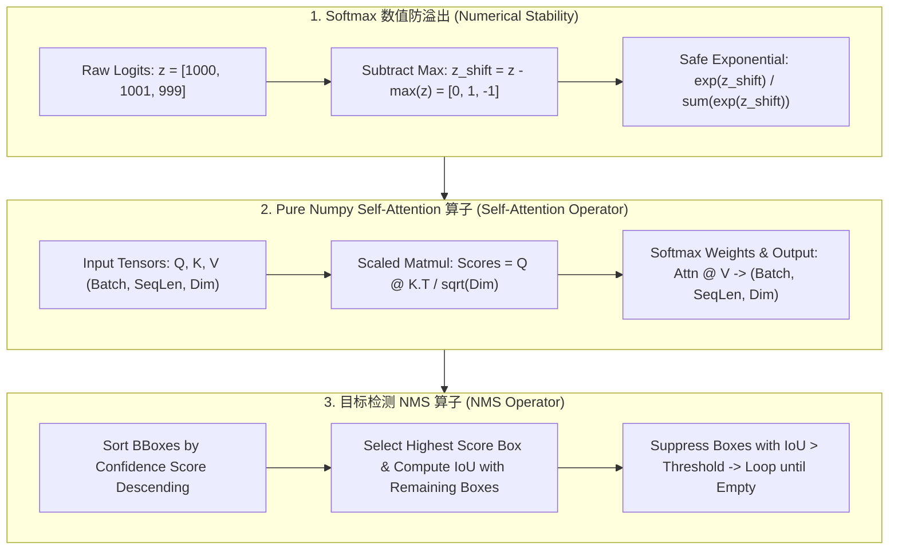

# 🌐 MLE Coding & Algo Prep: Zero-to-One ML Operators in Pure Numpy

> **核心摘要**：Exhaustive technical deep dive into Pure Numpy handwritten ML operators for live coding interviews.

---

## 💡 交互式 Mermaid 架构流程图



---

## 第一章：数值稳定性与基础机器学习算子

### 1.1 Softmax 数值防溢出技巧

在计算 Softmax 时，直接计算 $e^{z_i}$ 极其危险。当 $z_i = 1000$ 时，$e^{1000}$ 会直接触发 `inf`（上溢）；当 $z_i = -1000$ 时，$e^{-1000}$ 会变为 0（下溢并在后续 log 中触发 `-inf`）。

**数学防溢出恒等式**：
$$\text{Softmax}(z)_i = \frac{e^{z_i - \max(z)}}{\sum_j e^{z_j - \max(z)}}$$

通过减去向量最大值 $c = \max(z)$，指数项指数被压制在 $(-\infty, 0]$ 之间，完全消除了上溢风险！

> 💡 **Intuition**: Softmax divides numerator and denominator by the same $e^{c}$ — the value is unchanged, so subtracting the max is free numerical gymnastics. Turning the largest logit into 0 bounds every exponential in $[0, 1]$: no `inf`, no `nan`, and any later `log` is safe too.
>
> 🎤 **30-Second Answer**: "Conclusion: subtract max(z) before exp — mathematically identical, numerically safe. Mechanism: Softmax(z)_i = e^{z_i−c}/∑e^{z_j−c}, same function value but all exponents land in (0,1]. Example: z=[1000, 1001, 999] — e^{1001} is literally inf; subtract 1001 → z'=[−1, 0, −2] → weights [0.09, 0.245, 0.033], exactly what the naive version would give. Bonus: with log-softmax, subtract before taking log to avoid log(0) = −inf."

---

## 第二章：Pure Numpy 核心算子手写实战

### 2.1 逻辑回归 (Logistic Regression) 梯度下降手写

Understand the three steps first: loss → gradient → update. The model computes $z = Xw + b$, pushes it through sigmoid into $(0,1)$ to get the prediction $\hat{y}$, and cross-entropy measures the gap to the true label. The elegant part: **cross-entropy + sigmoid has a gradient that equals exactly the residual** $\hat{y} - y$ — the `dw = X.T @ (y_pred - y) / n` line comes from that clean cancellation. The core training loop below is only 3 lines — narrating "what this does" while writing beats silent memorization.

```python
import numpy as np

class PureNumpyLogisticRegression:
    def __init__(self, lr: float = 0.01, iters: int = 1000):
        self.lr = lr
        self.iters = iters
        self.w = None
        self.b = None

    def sigmoid(self, z: np.ndarray) -> np.ndarray:
        z_clipped = np.clip(z, -500, 500)
        return 1.0 / (1.0 + np.exp(-z_clipped))

    def fit(self, X: np.ndarray, y: np.ndarray):
        n_samples, n_features = X.shape
        self.w = np.zeros(n_features)
        self.b = 0.0

        for _ in range(self.iters):
            linear_model = np.dot(X, self.w) + self.b
            y_pred = self.sigmoid(linear_model)

            dw = (1.0 / n_samples) * np.dot(X.T, (y_pred - y))
            db = (1.0 / n_samples) * np.sum(y_pred - y)

            self.w -= self.lr * dw
            self.b -= self.lr * db

if __name__ == "__main__":
    X_test = np.array([[1.0, 2.0], [2.0, 3.0], [3.0, 1.0]])
    y_test = np.array([0, 1, 1])
    model = PureNumpyLogisticRegression()
    model.fit(X_test, y_test)
    print("✅ 逻辑回归训练完成，权重 w:", model.w)
```

> 💡 **Intuition**: Logistic regression is "linear scoring + probabilization" — compute a linear score z, then map it to a probability with sigmoid. Every gradient step asks "how wrong is the prediction" (the residual $\hat{y}-y$) and pushes that error back onto the weights weighted by feature values. The classic handwritten bug is shape: `dw` must match `w` (n_features).
>
> 🎤 **30-Second Answer**: "Conclusion: three steps — forward predict, compute residual, update weights. Mechanism: differentiating cross-entropy through sigmoid cancels the sigmoid derivative against the 1/ŷ term, leaving dL/dw = Xᵀ(ŷ−y)/n — that's the `dw = X.T @ (y_pred - y) / n` line. Example: with 3 samples and 2 features, X is (3,2), w is (2,), so `dw` must be (2,) — transposing to (3,) is the classic first-interview bug. lr=0.01 for 1000 iterations converges fine; clip z to ±500 in sigmoid to prevent overflow."

---

### 2.2 Scaled Dot-Product Self-Attention 手写

Self-Attention in one sentence: **each token uses its Query to attend to other tokens' Keys, then aggregates their Values weighted by attention**. Q asks "what am I looking for", K says "what I have", V is "my content". The $\frac{1}{\sqrt{d_k}}$ scaling prevents dot products from exploding as the dimension grows — with $d_k=64$ dot products reach magnitude ~8 and softmax gradients shrink; dividing by $\sqrt{d_k}$ pulls them back into a healthy range. `scores = Q @ K^T / sqrt(d_k)` is the one core line of the entire mechanism.

```python
import numpy as np

def pure_numpy_self_attention(Q: np.ndarray, K: np.ndarray, V: np.ndarray) -> np.ndarray:
    d_k = Q.shape[-1]
    scores = np.matmul(Q, K.transpose(0, 2, 1)) / np.sqrt(d_k)
    
    # Softmax 数值防溢出
    scores_max = np.max(scores, axis=-1, keepdims=True)
    exp_scores = np.exp(scores - scores_max)
    attn_weights = exp_scores / np.sum(exp_scores, axis=-1, keepdims=True)
    
    return np.matmul(attn_weights, V)

if __name__ == "__main__":
    q = k = v = np.random.randn(2, 4, 8)
    out = pure_numpy_self_attention(q, k, v)
    print("✅ Self-Attention 输出 Shape:", out.shape)
```

> 💡 **Intuition**: Attention is class-wide voting — each student (token) asks "who is most relevant to me" (Q·K dot product), votes are normalized into weights (softmax), then everyone's speech (V) is aggregated by those weights. Dividing by $\sqrt{d_k}$ is the volume knob: higher dimensions produce larger dot products, so we scale to stop softmax from saturating into a one-hot.
>
> 🎤 **30-Second Answer**: "Conclusion: Self-Attention = Q·Kᵀ/√d_k → softmax → weighted V, four steps. Mechanism: Q, K, V are linear projections of the same input X; (B,S,D) Q matmul'd with K transposed over the last two axes gives the (B,S,S) similarity matrix; scaling, softmax over the last axis, then multiply by V recovers (B,S,D). Example: Q, K, V of shape (2,4,8) — batch 2, seq 4, dim 8 — scores are (2,4,4), output is (2,4,8). Follow-ups: masks must be applied before softmax (pad positions set to −inf); with d_k=8 the dot-product scale is √8≈2.8, so ÷√d_k≈2.83 keeps it mild."

---

### 2.3 目标检测 NMS (Non-Maximum Suppression) 算子

NMS solves "one object detected by dozens of overlapping boxes": detectors emit many high-confidence boxes around the same target. The strategy is "the strongest stays, the ones in the way vanish" — take the highest-confidence box, delete every box whose IoU with it exceeds the threshold, then repeat on the survivors. IoU (Intersection over Union) measures overlap: intersection area divided by union area; IoU=1 means identical boxes, IoU=0 means no overlap.

```python
import numpy as np

def pure_numpy_nms(boxes: np.ndarray, scores: np.ndarray, iou_threshold: float = 0.5) -> list:
    x1 = boxes[:, 0]
    y1 = boxes[:, 1]
    x2 = boxes[:, 2]
    y2 = boxes[:, 3]
    areas = (x2 - x1) * (y2 - y1)

    order = scores.argsort()[::-1]
    keep = []

    while order.size > 0:
        i = order[0]
        keep.append(i)

        xx1 = np.maximum(x1[i], x1[order[1:]])
        yy1 = np.maximum(y1[i], y1[order[1:]])
        xx2 = np.minimum(x2[i], x2[order[1:]])
        yy2 = np.minimum(y2[i], y2[order[1:]])

        w = np.maximum(0.0, xx2 - xx1)
        h = np.maximum(0.0, yy2 - yy1)
        inter = w * h

        iou = inter / (areas[i] + areas[order[1:]] - inter)
        inds = np.where(iou <= iou_threshold)[0]
        order = order[inds + 1]

    return keep

if __name__ == "__main__":
    b_test = np.array([[10, 10, 50, 50], [12, 12, 48, 48], [100, 100, 200, 200]])
    s_test = np.array([0.9, 0.8, 0.95])
    print("✅ NMS 选中的框索引:", pure_numpy_nms(b_test, s_test, 0.5))
```

> 💡 **Intuition**: NMS is jungle law — the highest-confidence box is the boss; every box with IoU > threshold (default 0.5) is treated as its duplicate and deleted; survivors compete for the next boss, until none remain. The vectorized `np.maximum/minimum` trick computes intersections against all remaining boxes in one pass — the complexity selling point in a live-coding interview.
>
> 🎤 **30-Second Answer**: "Conclusion: process boxes by descending confidence, keeping only those with IoU ≤ threshold against already-kept boxes. Mechanism: take the top-scoring box, compute intersections vectorized via `np.maximum(x1[i], x1[rest])` / `np.minimum(x2[i], x2[rest])`, IoU = inter / (area_i + area_rest − inter); suppress everything above 0.5. Example: boxes [10,10,50,50] and [12,12,48,48] overlap at IoU≈0.86 > 0.5 — the 0.95-scored box wins, the 0.8 one is dropped; [100,100,200,200] has IoU 0 with both, so it's kept. Output: indices [2, 0]. Complexity: O(n log n) sorting, O(n²) suppression but fully vectorizable."

---

## 第三章：5 大高频手写考点与标准解答

### 考点 1：如何在手写 Softmax 时防止由于 exp(x) 数值过大导致的上溢与下溢？
* **标准回答**：减去向量中的最大值 m = max(x)。根据指数缩放性质，指数项被压制在小于等于 0 之间，彻底消除了上溢的风险！

> 🎤 **30-Second Answer**: "Conclusion: subtract the max before softmax — mathematically unchanged, numerically safe. Mechanism: dividing numerator and denominator by e^max does not change the probabilities, but bounds the largest exponent at 0, so no exp can overflow. Example: logits=[1000, 1001, 999] → subtract 1001 → [−1, 0, −2] → softmax [0.09, 0.245, 0.033], identical to the naive computation. For log-softmax, subtract before taking log to avoid log(0) = −inf."

### 考点 2：请使用 Pure Numpy 手写 Scaled Dot-Product Self-Attention，并准确说明 Tensor Shape 变化？
* **标准回答**：输入 Q, K, V Shape 为 (B, S, D)；Q @ K.T 矩阵乘法后 Shape 变为 (B, S, S)；除以 sqrt(D) 并进行 axis=-1 的 Softmax 归一化生成注意力权重矩阵 (B, S, S)；最后与 V 相乘恢复 (B, S, D)。

> 🎤 **30-Second Answer**: "Conclusion: four steps — Q@Kᵀ, ÷√d_k, softmax, ×V — shapes go (B,S,D) → (B,S,S) → (B,S,D). Mechanism: Q and K's transpose are matmul'd over the last two axes (in numpy, `K.transpose(0, 2, 1)`), giving the relevance of every position to every position; ÷√d_k keeps dot products from exploding with dimension; softmax normalizes along the last axis; multiplying by V weights the content. Example: B=2, S=4, D=8 → scores (2,4,4), attn (2,4,4), output (2,4,8). Follow-up: why ÷√d_k — dot-product variance grows with d_k and softmax saturates to one-hot; scaling keeps gradients healthy."

### 考点 3：手写逻辑回归梯度更新公式的推导步骤？
* **标准回答**：交叉熵损失 L = - [y ln y_hat + (1-y) ln (1-y_hat)]。利用 sig'(z) = sig(z)(1-sig(z)) 链式法则求导得 dL/dw = X^T (y_hat - y)。

> 🎤 **30-Second Answer**: "Conclusion: dL/dw = Xᵀ(ŷ − y)/n — the gradient is the residual projected into feature space. Mechanism: expanding the chain rule, the 1/ŷ term from cross-entropy cancels against the ŷ(1−ŷ) from the sigmoid derivative, leaving just (ŷ − y) — that is why the logistic regression gradient 'equals the residual', the prettiest step in the derivation. Example: X is (n, d), (ŷ−y) is (n,), so Xᵀ times the residual is (d,) — average over n and you get the steepest descent direction. Narrating forward → residual → update while writing is the full-score move."
