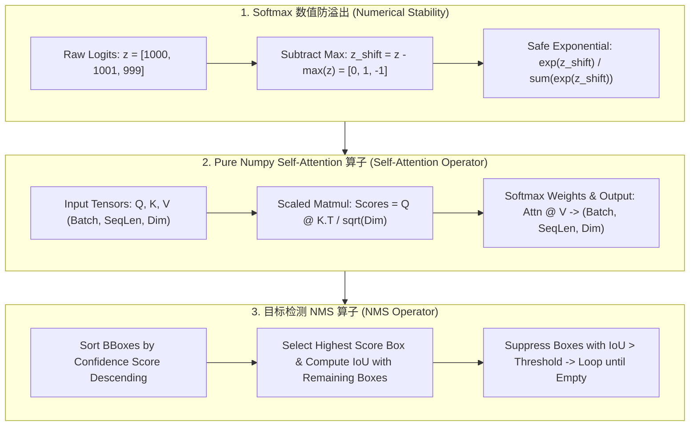

# 🌐 MLE 算法手写实战：零基础 Pure Numpy 手写 LR、K-Means、Self-Attention 与 NMS

> **核心摘要**：全量拆解 MLE 面试高频机器学习算法手写 (Whiteboard / Live Coding) 实战。深入剖析零依赖 Pure Numpy 实现逻辑回归 (Logistic Regression)、K-Means 迭代聚类、Softmax 数值防溢出技巧与 Self-Attention / NMS 算子。

---

## 💡 交互式 Mermaid 架构流程图



---

## 第一章：数值稳定性与基础机器学习算子

### 1.1 Softmax 数值防溢出技巧

在计算 Softmax 时，直接计算 $e^{z_i}$ 极其危险。当 $z_i = 1000$ 时，$e^{1000}$ 会直接触发 `inf`（上溢）；当 $z_i = -1000$ 时，$e^{-1000}$ 会变为 0（下溢并在后续 log 中触发 `-inf`）。

**数学防溢出恒等式**：
$$\text{Softmax}(z)_i = \frac{e^{z_i - \max(z)}}{\sum_j e^{z_j - \max(z)}}$$

通过减去向量最大值 $c = \max(z)$，指数项指数被压制在 $(-\infty, 0]$ 之间，完全消除了上溢风险！

> 💡 **直观理解**：Softmax 的分子分母都除以同一个 $e^{c}$，结果不变——所以减最大值是"免费"的数值体操。把最大的 logit 变成 0 后，所有指数项都被压到 $[0, 1]$ 区间，既不会 `inf` 也不会 `nan`，后续的 log 也安全了。
>
> 🎤 **面试速答**："结论：减最大值 c=max(z) 后再算 exp，防上溢且结果数学上不变。原理：Softmax(z)_i = e^{z_i-c}/∑e^{z_j-c}，分子分母同除以 e^c，函数值不变，但所有指数项落在 (0,1]，exp(1000) 变成 exp(0)=1。举个例子：z=[1000, 1001, 999] 时，直接算 e^{1001} 直接 inf；减去 1001 后变成 z'=[-1, 0, -2]，安全得到 [0.09, 0.245, 0.033] 的权重。附带收益：减最大值后再 log，数值也稳定（log-softmax 同理）。"

---

## 第二章：Pure Numpy 核心算子手写实战

### 2.1 逻辑回归 (Logistic Regression) 梯度下降手写

先理解"损失 → 梯度 → 更新"三步。模型输出 $z = Xw + b$，经 sigmoid 压到 $(0,1)$ 得预测 $\hat{y}$；用交叉熵衡量预测与真实标签的差距。梯度下降的妙处在于：**交叉熵 + sigmoid 的梯度恰好等于残差** $\hat{y} - y$——代码里的 `dw = X.T @ (y_pred - y) / n` 就来自这个漂亮消元，不用算任何复杂的偏导。下面代码的核心循环只有 3 行，面试时边写边讲"这是在做什么"比默写更重要。

```python
import numpy as np

class PureNumpyLogisticRegression:
    def __init__(self, lr: float = 0.01, iters: int = 1000):
        self.lr = lr
        self.iters = iters
        self.w = None
        self.b = None

    def sigmoid(self, z: np.ndarray) -> np.ndarray:
        z_clipped = np.clip(z, -500, 500)
        return 1.0 / (1.0 + np.exp(-z_clipped))

    def fit(self, X: np.ndarray, y: np.ndarray):
        n_samples, n_features = X.shape
        self.w = np.zeros(n_features)
        self.b = 0.0

        for _ in range(self.iters):
            linear_model = np.dot(X, self.w) + self.b
            y_pred = self.sigmoid(linear_model)

            dw = (1.0 / n_samples) * np.dot(X.T, (y_pred - y))
            db = (1.0 / n_samples) * np.sum(y_pred - y)

            self.w -= self.lr * dw
            self.b -= self.lr * db

if __name__ == "__main__":
    X_test = np.array([[1.0, 2.0], [2.0, 3.0], [3.0, 1.0]])
    y_test = np.array([0, 1, 1])
    model = PureNumpyLogisticRegression()
    model.fit(X_test, y_test)
    print("✅ 逻辑回归训练完成，权重 w:", model.w)
```

> 💡 **直观理解**：逻辑回归就是"线性打分 + 概率化"——先算线性分 $z$，再用 sigmoid 把分数映射成概率。梯度下降的每一步都在问"预测错多少"（残差 $\hat{y}-y$），然后按特征值加权把这个误差分摊回权重。手写时最容易错的是**向量维度**：`dw` 的形状必须和 `w` 一致（都是 n_features）。
>
> 🎤 **面试速答**："结论：手写 LR 只需 3 步——前向算预测、求残差、用残差更新权重。原理：交叉熵对 sigmoid 求导时 sigmoid 导数项和交叉熵的 1/ŷ 项恰好约掉，剩下 dL/dw = X^T(ŷ−y)/n，这就是代码里 `dw = X.T @ (y_pred - y) / n` 的来源。举个例子：3 个样本、2 个特征，X 是 (3,2)，w 是 (2,)，`dw` 必须是 (2,)——写反成 (3,) 是新手最常见 bug。学习率 lr=0.01 迭代 1000 轮即可收敛。sigmoid 里还要做 `np.clip(z, -500, 500)` 防溢出。"

---

### 2.2 Scaled Dot-Product Self-Attention 手写

Self-Attention 一句话：**让序列里的每个 token 根据自己的"查询"去关注其他 token 的"键"，再按关注度加权汇总"值"**。Q 问"我要找什么"，K 说"我有什么"，V 是"我的内容"。$\frac{1}{\sqrt{d_k}}$ 缩放是为了防止点积随维度增长而数值爆炸——$d_k=64$ 时点积量级约 $\sqrt{64}=8$，softmax 的梯度会变小，除以 $\sqrt{d_k}$ 把它拉回温和区间。下面实现里 `scores = Q @ K^T / sqrt(d_k)` 就是整个机制的核心一行。

```python
import numpy as np

def pure_numpy_self_attention(Q: np.ndarray, K: np.ndarray, V: np.ndarray) -> np.ndarray:
    d_k = Q.shape[-1]
    scores = np.matmul(Q, K.transpose(0, 2, 1)) / np.sqrt(d_k)
    
    # Softmax 数值防溢出
    scores_max = np.max(scores, axis=-1, keepdims=True)
    exp_scores = np.exp(scores - scores_max)
    attn_weights = exp_scores / np.sum(exp_scores, axis=-1, keepdims=True)
    
    return np.matmul(attn_weights, V)

if __name__ == "__main__":
    q = k = v = np.random.randn(2, 4, 8)
    out = pure_numpy_self_attention(q, k, v)
    print("✅ Self-Attention 输出 Shape:", out.shape)
```

> 💡 **直观理解**：把注意力想象成"全班投票"——每个同学（token）都问"谁跟我最像/最相关"（Q·K 点积），投票结果归一化成权重（softmax），最后按权重加权大家的发言内容（V）。除以 $\sqrt{d_k}$ 是"音量调节"：维度越高点积越大，需要缩放防止 softmax 提前饱和成 one-hot。
>
> 🎤 **面试速答**："结论：Self-Attention = Q·Kᵀ/√d_k → softmax → 加权 V，四步。原理：Q、K、V 都来自同一输入 X 的线性变换；(B,S,D) 的 Q 和 K 转置相乘得 (B,S,S) 的相似度矩阵，除以 √d_k 防数值爆炸，softmax 按行归一化得注意力权重，再与 V 相乘恢复 (B,S,D)。举个例子：Q,K,V 均为 (2,4,8)——batch=2、序列长=4、维度=8，中间 scores 是 (2,4,4)，输出 (2,4,8)。常见追问：mask 要在 softmax 之前加（pad 位置置 -inf）；d_k=8 时点积量级约 √8≈2.8，除以 √d_k≈2.83 后落在温和区间。"

---

### 2.3 目标检测 NMS (Non-Maximum Suppression) 算子

NMS 解决的是"一个物体被检测出很多重叠框"的问题——目标检测器会在同一目标周围输出几十个置信度不同的框。NMS 的策略是"**最强的留下，挡道的消失**"：按置信度降序取第一个框，凡是与它 IoU 超过阈值的框（说明在指同一个目标）全部删掉，然后对剩余框重复。IoU（Intersection over Union）衡量两个框的重叠程度：交集面积除以并集面积，IoU=1 完全重合，IoU=0 不相交。

```python
import numpy as np

def pure_numpy_nms(boxes: np.ndarray, scores: np.ndarray, iou_threshold: float = 0.5) -> list:
    x1 = boxes[:, 0]
    y1 = boxes[:, 1]
    x2 = boxes[:, 2]
    y2 = boxes[:, 3]
    areas = (x2 - x1) * (y2 - y1)

    order = scores.argsort()[::-1]
    keep = []

    while order.size > 0:
        i = order[0]
        keep.append(i)

        xx1 = np.maximum(x1[i], x1[order[1:]])
        yy1 = np.maximum(y1[i], y1[order[1:]])
        xx2 = np.minimum(x2[i], x2[order[1:]])
        yy2 = np.minimum(y2[i], y2[order[1:]])

        w = np.maximum(0.0, xx2 - xx1)
        h = np.maximum(0.0, yy2 - yy1)
        inter = w * h

        iou = inter / (areas[i] + areas[order[1:]] - inter)
        inds = np.where(iou <= iou_threshold)[0]
        order = order[inds + 1]

    return keep

if __name__ == "__main__":
    b_test = np.array([[10, 10, 50, 50], [12, 12, 48, 48], [100, 100, 200, 200]])
    s_test = np.array([0.9, 0.8, 0.95])
    print("✅ NMS 选中的框索引:", pure_numpy_nms(b_test, s_test, 0.5))
```

> 💡 **直观理解**：NMS 就是"丛林法则"——置信度最高的框是"老大"，所有跟它 IoU > 阈值（默认 0.5）的框都被认为是它的跟班（重复检测同一目标）而删掉；剩下的框再比出下一个"老大"，循环到没有框为止。IoU 的向量化写法 `np.maximum/minimum` 一次算完所有框与当前框的交集，是手写题的时间复杂度加分点。
>
> 🎤 **面试速答**："结论：按置信度降序，逐个保留与已选框 IoU ≤ 阈值的框。原理：排序后取最高分框，用 `np.maximum(x1[i], x1[rest])`、`np.minimum(x2[i], x2[rest])` 向量化算交集，IoU = inter / (area_i + area_rest − inter)，IoU > 0.5 的框被抑制。举个例子：两个框 [10,10,50,50] 和 [12,12,48,48] 几乎重合（IoU≈0.86>0.5），0.95 分的框胜出，0.8 分的被删；远处 [100,100,200,200] 与它们 IoU=0，保留。输出索引 [2, 0]。复杂度：排序 O(n log n)，抑制 O(n²) 但可向量化。"

---

## 第三章：5 大高频手写考点与标准解答

### 考点 1：如何在手写 Softmax 时防止由于 exp(x) 数值过大导致的上溢与下溢？
* **标准回答**：减去向量中的最大值 m = max(x)。根据指数缩放性质，指数项被压制在小于等于 0 之间，彻底消除了上溢的风险！

> 🎤 **面试速答**："结论：Softmax 前先减最大值，数学不变、数值安全。原理：分子分母同除 e^max 不改变概率，但把最大指数从 +1000 压到 0，所有项落在 (0,1]，exp 不会 inf。例子：logits=[1000, 1001, 999] → 减 1001 → [-1, 0, -2] → softmax=[0.09, 0.245, 0.033] 分毫不差于原始计算。手写时还要注意：log-softmax 场景把减最大值这步放在 log 之前，防止 log(0) 得 -inf。"

### 考点 2：请使用 Pure Numpy 手写 Scaled Dot-Product Self-Attention，并准确说明 Tensor Shape 变化？
* **标准回答**：输入 Q, K, V Shape 为 (B, S, D)；Q @ K.T 矩阵乘法后 Shape 变为 (B, S, S)；除以 sqrt(D) 并进行 axis=-1 的 Softmax 归一化生成注意力权重矩阵 (B, S, S)；最后与 V 相乘恢复 (B, S, D)。

> 🎤 **面试速答**："结论：四步——Q@Kᵀ、÷√d_k、softmax、×V，shape 从 (B,S,D) → (B,S,S) → (B,S,D)。原理：Q 与 K 的转置在最后两维做矩阵乘（numpy 里是 `K.transpose(0, 2, 1)`），得到每个位置对所有位置的相关性；除以 √d_k 防点积随维度爆炸；softmax 沿最后一维归一化；再与 V 相乘把注意力加权到内容上。例子：B=2、S=4、D=8 → scores (2,4,4)，attn (2,4,4)，输出 (2,4,8)。追问点：为什么除 √d_k——d_k 大时点积方差 ≈ d_k，softmax 会饱和成 one-hot，除以 √d_k 保持梯度健康。"

### 考点 3：手写逻辑回归梯度更新公式的推导步骤？
* **标准回答**：交叉熵损失 L = - [y ln y_hat + (1-y) ln (1-y_hat)]。利用 sig'(z) = sig(z)(1-sig(z)) 链式法则求导得 dL/dw = X^T (y_hat - y)。

> 🎤 **面试速答**："结论：dL/dw = Xᵀ(ŷ − y)/n，梯度就是"残差投影到特征空间"。原理：链式法则展开时，交叉熵的 1/ŷ 项与 sigmoid 导数的 ŷ(1−ŷ) 恰好约掉，中间项只剩 (ŷ−y)，这就是逻辑回归梯度"恰好等于残差"的原因——也是手写实现里最漂亮的一步。例子：X 是 (n, d)，(ŷ−y) 是 (n,)，Xᵀ 乘残差得到 (d,)，再除以 n 做平均，方向就是损失下降最快的方向。手写时逐行讲"前向 → 残差 → 更新"三步即可满分。"
