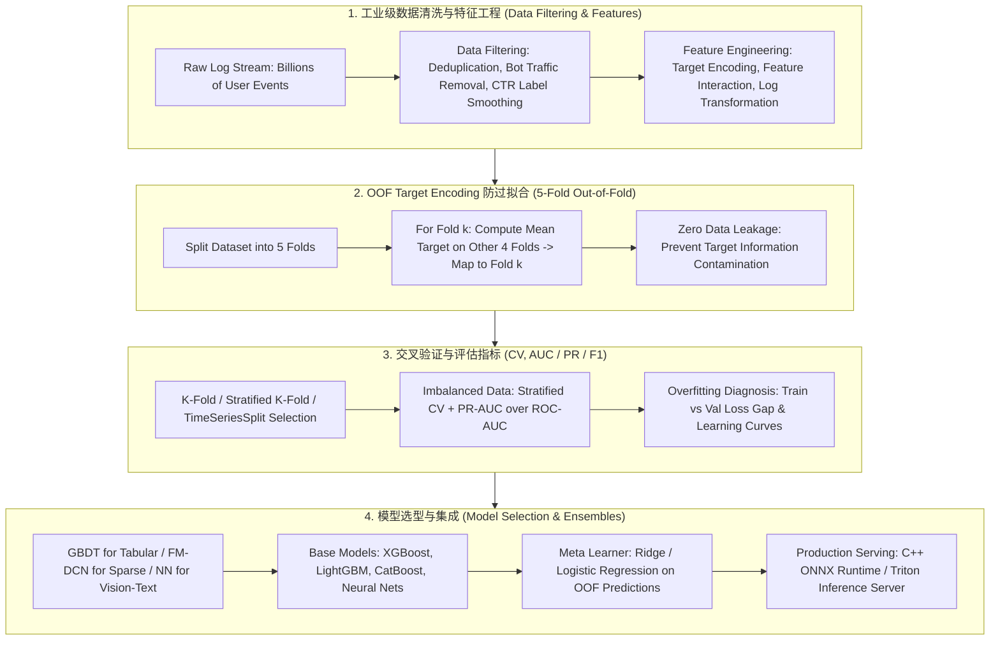

# 🌐 MLE Core Cheatsheet: High-Frequency Q&A, Competitions & Pinterest

> **Core Executive Summary**: The MLE interview core is a closed loop of recurring topics — **regularization & bias-variance, overfitting diagnosis, feature engineering, evaluation metrics (AUC / PR / F1), class imbalance, vanishing gradients, cross-validation, model selection, and ensemble methods**. In production (e.g., Pinterest-scale recommenders) they form one pipeline: filter trillion-scale logs, engineer leakage-safe Target Encoding features, cross-validate rigorously, and stack heterogeneous base models. This cheatsheet answers the highest-frequency questions with standard answers, formulas, and quick-reference tables.

---

## 💡 Interactive Mermaid Interview Knowledge Map



---

## ⚡ High-Frequency Interview Q&A 考点速查

### 考点 1: How does regularization work, and how does it relate to the bias-variance tradeoff?

* **Standard Answer**: L2 (Ridge) adds $\lambda \sum w_i^2$, shrinking weights smoothly; L1 (Lasso) adds $\lambda \sum |w_i|$, zeroing small weights for feature selection. Both raise bias slightly but cut variance more; the right response depends on the error source:

$$E[(f - \hat{f})^2] = \underbrace{\text{Bias}^2}_{\text{underfit}} + \underbrace{\text{Variance}}_{\text{overfit}} + \sigma^2$$

High train error → bias-dominated → add capacity; low train error with a wide val gap → variance-dominated → regularize, simplify, or add data.

> 💡 **Intuition**: Regularization is a tax on weights — L2 taxes quadratically, so big weights get hit hardest and everything shrinks smoothly; L1 taxes linearly, so tiny weights give up and go to exactly zero. Smaller weights mean a smoother decision boundary and a model that can't memorize noise.
>
> 🎤 **30-Second Answer**: "Conclusion: L1 gives sparse feature selection, L2 gives smooth shrinkage; both trade a little bias for a big variance cut. Mechanism: L2 adds λ∑w², penalizing large weights most; L1 adds λ∑|w|, zeroing small weights. Example: with λ=0.1, L2 squeezes a weight from 2.0 to about 1.8, while L1 zeroes a 0.05 weight outright. Pick L1 for high-dimensional sparsity, L2 for general robustness — or Elastic Net for both."

### 考点 2: How do you diagnose overfitting, and what are the countermeasures?

* **Standard Answer**: Diagnose via the train/validation gap, learning curves (val error rising while train error falls), and weight norms. Countermeasures in interview order: (1) more data or augmentation; (2) regularize (L1/L2, dropout, early stopping); (3) cut capacity (fewer layers/trees, lower `max_depth`); (4) remove noisy features; (5) bagging.

> 💡 **Intuition**: Overfitting is a student who memorizes the textbook word-for-word — perfect on training questions, fails on a new exam. The train-val gap is the distance between memorizing and understanding.
>
> 🎤 **30-Second Answer**: "Conclusion: low train error with a high, widening val gap means overfitting. Mechanism: excess capacity lets the model memorize training noise as if it were structure. Diagnose with three tools: the train-val gap, learning curves (val error rising while train error falls), and weight norms. Fix in order: more data/augmentation → regularize (L2/dropout/early stopping) → cut capacity (fewer layers, lower max_depth) → drop noisy features → bagging. Example: a GBDT at train AUC 0.99 but val AUC 0.92 — drop max_depth from 10 to 6 and the gap typically narrows fast."

### 考点 3: How do industrial recommender systems perform Data Filtering on trillion-scale raw logs?

* **Standard Answer**: Filter bot traffic (over ~20 clicks/sec is machine-driven); drop mis-tap clicks with dwell time < 1 second from positive labels; deduplicate repeated events; smooth CTR labels with $\hat{p} = \frac{clicks + \alpha}{impressions + \alpha + \beta}$; use soft negative sampling to balance positives/negatives.

> 💡 **Intuition**: Trillion-scale logs are mostly junk — bots, mis-taps, duplicate events. Cleaning is gold panning: cheap rules wash away the silt first, then small-sample statistics get pulled back toward a prior. Bayesian smoothing is the prior: a 1-click/1-impression CTR should not stay 100%.
>
> 🎤 **30-Second Answer**: "Conclusion: filter machine traffic and noisy labels, then smooth small-sample statistics. Mechanism: bots (>20 clicks/sec) and mis-taps (dwell < 1s) are not real intent and poison labels; duplicate events need dedup. Bayesian smoothing p̂=(clicks+α)/(impressions+α+β) pulls extreme CTRs toward the prior — e.g., 1/1 becomes ~3% instead of 100% when the global CTR is 3%. Soft negative sampling balances the ratio without hard cutoffs. Core: clean before training — never let the model digest noise."

### 考点 4: When should you use ROC-AUC vs PR-AUC vs F1?

* **Standard Answer**: ROC-AUC is threshold-independent and stable to class balance but optimistic on rare positives; PR-AUC isolates precision-recall on the positive class, so prefer it for imbalanced tasks (fraud, anomaly, CTR). F1 = $2PR/(P+R)$ is a point metric at one threshold. Rule of thumb: imbalance > 10:1 → report PR-AUC and tuned-threshold F1.

> 💡 **Intuition**: ROC plots TPR vs FPR, and FPR's denominator is all negatives — when negatives are 99% of the data, FPR is tiny no matter what, so AUC looks great. PR-AUC puts the spotlight only on the rare positive class: precision is hit rate, recall is catch rate, i.e., how well you find things inside that 1%. F1 is a single snapshot at one operating point.
>
> 🎤 **30-Second Answer**: "Conclusion: past 10:1 imbalance, report PR-AUC, not ROC-AUC. Mechanism: ROC's FPR is dominated by the huge negative class, hiding poor performance on positives; PR-AUC conditions on predictions and its random baseline collapses to N⁺/(N⁺+N⁻) as imbalance grows. F1 is a point metric for committing to one threshold. Example: on 1:1000 fraud data, ROC-AUC can read 0.95 while PR-AUC is 0.1 — PR-AUC is the truthful number. Rule: report PR-AUC, then F1 at a tuned threshold."

### 考点 5: Bias-variance style problem: the model systematically mis-predicts a subgroup — what is wrong?

* **Standard Answer**: Two failure families. **Bias error**: the model is too weak to learn the subgroup's pattern — if subgroup train and val error are both high, add subgroup features or capacity. **Data bias**: label noise or selection bias — reweight, resample, or relabel before touching the model. Check feature distribution shift between train and production as the tie-breaker.

> 💡 **Intuition**: A model that systematically fails one subgroup has one of two root causes: it never had enough of that subgroup's data (bias error), or the data itself is lying — mislabeled or selection-biased (data bias). Decide whether to fix the model or fix the data first.
>
> 🎤 **30-Second Answer**: "Conclusion: first classify — capacity problem or data problem. Mechanism: if subgroup train and val error are both high, the model never learned the pattern: add subgroup features or capacity. If labels look suspicious or the subgroup was undersampled, it's data bias: reweight, resample, relabel before touching the model. Example: a model with 20% recall on elderly users turns out to have only 500 samples for them, 30% mislabeled — relabel, don't deepen the network. Use train-vs-production feature shift as the tie-breaker."

### 考点 6: How do you handle class imbalance?

* **Standard Answer**: Three layers. Data: undersample the majority, SMOTE the minority, or soft negative sampling. Loss: class weights ($w_{minor} = N_{maj}/N_{min}$) or focal loss $\mathcal{L} = -\alpha(1-p_t)^\gamma \log p_t$. Decision: tune the threshold on the PR-curve, never assume 0.5. Measure progress with stratified CV and PR-AUC.

> 💡 **Intuition**: With 1:999 data, predicting 'negative' for everything scores 99.9% accuracy — but the business cares about that 0.1%. You have to tilt resources at three levels at once: the data distribution, the loss's gradient allocation, and the decision threshold.
>
> 🎤 **30-Second Answer**: "Conclusion: attack imbalance at three layers — data, loss, decision. Mechanism: undersampling/SMOTE reshape the distribution; class weights and focal loss reweight gradients (focal loss down-weights already-correct samples so training focuses on the hard minority tail); the threshold is tuned on the PR curve, never assumed at 0.5. Example: on 1:1000 fraud data with class weight w_minor = N_maj/N_min = 1000, moving the threshold from 0.5 to 0.1 lifts recall from 30% to 70% while precision drops only 5%. Measure everything with Stratified CV + PR-AUC."

### 考点 7: How do you fix vanishing/exploding gradients in deep networks?

* **Standard Answer**: ReLU family instead of sigmoid/tanh in hidden layers; He (ReLU) / Xavier (sigmoid) initialization so per-layer variance stays ~1; BatchNorm/LayerNorm re-centers pre-activations and allows higher learning rates; residual connections give gradients a direct highway; gradient clipping ($\|g\|_2 \le \tau$, e.g. 1.0) stabilizes exploding gradients, especially in RNN/LSTM.

> 💡 **Intuition**: Backprop is a relay race carrying the signal from the last layer backward. Sigmoid's max derivative is 0.25, so after dozens of layers the baton fades out — vanishing gradients; with too-large initialization the signal snowballs — exploding gradients. ReLU's derivative is 0 or 1, so signals pass through untouched, and residual connections are a highway for the gradient.
>
> 🎤 **30-Second Answer**: "Conclusion: five fixes — ReLU-family activations, proper init, normalization, residuals, gradient clipping. Mechanism: sigmoid's 0.25 derivative ceiling makes products decay exponentially (vanishing); He/Xavier init keeps per-layer variance near 1 so signals neither amplify nor die; BatchNorm re-centers pre-activations and allows bigger learning rates; residuals give gradients a direct path; clipping ||g||₂≤τ (e.g., 1.0) tames explosions, mandatory for RNN/LSTM. Example: a 10-layer sigmoid net scales gradients to ~0.25¹⁰ ≈ 1e-6 — dead; ReLU + He init trains 50 layers fine."

### 考点 8: How do you prevent Data Leakage, and how does OOF Target Encoding work?

* **Standard Answer**: Every scaler, imputer, and encoder must `fit` on the `train_fold` only and `transform` validation/test — full-dataset stats leak target information. Timestamped data must never use random K-Fold: split with `train_time < val_time < test_time` (TimeSeriesSplit). For high-cardinality categories, use 5-Fold OOF Target Encoding: split into $K=5$ folds; for fold $k$, compute the per-category mean target $\bar{y}_c$ on the other 4 folds and map it into fold $k$; the test set uses the average over all 5 folds. Self-loop leakage is structurally impossible.

> 💡 **Intuition**: Data leakage is peeking at the answer key during an exam. Fitting a scaler/encoder on the full dataset is equivalent to validation folds seeing statistics computed on themselves — offline metrics inflate and production crashes. OOF Target Encoding is 'only the other 4 folds get to vote': a sample's own label never enters its own feature.
>
> 🎤 **30-Second Answer**: "Conclusion: every scaler/imputer/encoder fits on train_fold only; OOF Target Encoding structurally kills the self-loop. Mechanism: split training into K=5 folds; for fold k, compute the per-category mean ȳ_c on the other 4 folds and map it back — a sample's own label never touches its own feature; test uses the smoothed average over all 5 folds. Example: the encoding for City='SF' is computed from SF samples in the other 4 folds only; fold k's SF rows never see their own y. Temporal data must never use random K-Fold: split with train_time < val_time < test_time (TimeSeriesSplit)."

### 考点 9: How does cross-validation fail silently, and how do you pick the right splitter?

* **Standard Answer**: Random K-Fold on time series leaks the future into the past (inflated offline metrics, collapsed A/B). Stratified K-Fold preserves class proportions; GroupKFold keeps same-user/same-merchant samples together. Rules: no random split on temporal data, no unstratified split on imbalanced data, no ungrouped split on grouped data — otherwise the validation metric is a lie.

> 💡 **Intuition**: Random K-Fold on time series is letting the model see the future — offline AUC 0.98, then the A/B crashes, because in the real world the future never exists yet. And when grouped data is split without grouping, the same user or merchant appears in both train and validation, so the model is scored on entities it has already met.
>
> 🎤 **30-Second Answer**: "Conclusion: three silent failures — random splitting on temporal data, unstratified splitting on imbalanced data, ungrouped splitting on grouped data. Mechanism: temporal leakage inflates offline metrics and collapses A/B tests; Stratified K-Fold preserves class ratios per fold; GroupKFold keeps same-group samples together. Example: if the same user appears in train and validation, the model memorizes user IDs instead of generalizing — val AUC looks great, cold-start users fail. Iron rule: if any of the three holds, the validation metric is a lie."

### 考点 10: How do you choose a model family in production?

* **Standard Answer**: By data modality. **Tabular**: GBDT (LightGBM / XGBoost / CatBoost) still beats deep models on axis-aligned table nonlinearities, missing-value tolerance, and interpretability (SHAP). **Sparse IDs** (User/Item/Tag one-hots in ads & recsys): FM / DCN-v2 / DeepFM — trees over-split sparse features and blow up tree depth. **Vision/text**: CNNs and Transformers. Latency budgets (Triton/ONNX) can overrule accuracy.

> 💡 **Intuition**: Tabular data is a warehouse of discrete shelves — GBDT's axis-aligned splits match it naturally; high-cardinality sparse IDs are millions of switches of which only a few are on at once — trees over-split them, while FM/DeepFM capture crosses via vector inner products; vision/text/sequences are the NN's home turf. Pick a family by data modality plus latency budget.
>
> 🎤 **30-Second Answer**: "Conclusion: choose the model family by data modality. Mechanism: tabular → GBDT (LightGBM/XGBoost/CatBoost) for axis-aligned nonlinearities, native missing-value tolerance, and SHAP interpretability; sparse IDs (ads/recsys) → FM/DCN-v2/DeepFM — trees over-split sparse features and blow up depth; vision/text → CNN/Transformer. Example: with 1B User-ID one-hots, tree depth runs away, while DeepFM's embedding layer compresses every ID into a 64-d dense vector. Final call: millisecond latency budgets (Triton/ONNX) can overrule pure accuracy."

### 考点 11: Dissect Model Stacking's 5-Fold training flow and the Meta-Learner strategy.

* **Standard Answer**: Layer 1: $K=5$ structurally heterogeneous base models (XGBoost, LightGBM, CatBoost, NN) each produce out-of-fold predictions; test predictions are fold-wise averages. Layer 2: the meta-learner trains on concatenated OOF predictions and must be a **strongly regularized simple linear model (Ridge / Logistic Regression)** — a tree meta-learner overfits the few OOF columns.

> 💡 **Intuition**: Stacking is a panel of specialists — each base model (XGBoost/LightGBM/CatBoost/NN) independently reviews the case, and a chief physician (the linear meta-learner) merges their verdicts. The meta layer sees only a handful of OOF scores; with that little information, a complex model just memorizes noise, so a strongly regularized linear model is mandatory.
>
> 🎤 **30-Second Answer**: "Conclusion: layer 1 generates OOF predictions from heterogeneous base models, layer 2 trains a regularized linear meta-learner (Ridge/LogReg). Mechanism: each base model runs its own 5-fold CV to produce out-of-fold predictions, with test predictions averaged across folds — this kills within-fold overfitting; the meta input is only K OOF columns, so a tree meta-learner memorizes noise. Example: 4 base models → 4 OOF feature columns → Ridge with α=1.0 → ~0.5 AUC points over the best single model online. Canonical base set: XGBoost + LightGBM + CatBoost + 1-2 NNs."

### 考点 12 (Bonus): How does CUPED reduce A/B test sample size?

* **Standard Answer**: CUPED regresses the experiment metric $Y$ on pre-experiment covariates $X$ and evaluates the adjusted metric $\tilde{Y} = Y - \theta(X - E[X])$, with $\theta = \frac{Cov(X,Y)}{Var(X)}$. Variance shrinks to $Var(\tilde{Y}) = Var(Y)(1 - \rho^2)$ — typically 50%+ fewer samples and shorter experiments at the same statistical power.

> 💡 **Intuition**: Most A/B noise comes from user differences — heavy users convert anyway. CUPED estimates each user's baseline from pre-experiment history and subtracts it, comparing 'who improved more' instead of 'who has the higher absolute level'. Less variance means fewer samples needed.
>
> 🎤 **30-Second Answer**: "Conclusion: CUPED regresses out pre-experiment covariates to shrink metric variance by 50%+. Mechanism: evaluate Ỹ = Y − θ(X − E[X]) with θ = Cov(X,Y)/Var(X); variance falls to Var(Ỹ) = Var(Y)(1 − ρ²), where ρ is the covariate-outcome correlation. Example: in a signup experiment using 7-day pre-experiment activity as the covariate, ρ=0.6 cuts variance to 0.64×, saving ~36% of samples; ρ=0.8 saves 64%. Iron rule: covariates must be fixed before the experiment starts, or the correction itself introduces bias."

---

## 📐 Quick-Reference Formula & Metric Sheet

| Topic | Formula / Rule | Interview Takeaway |
| :--- | :--- | :--- |
| Bias-variance | $E[(f-\hat{f})^2] = \text{Bias}^2 + \text{Var} + \sigma^2$ | Train err high: bias; wide val gap: variance |
| L2 / L1 | $L_2: + \lambda \sum w_i^2$；$L_1: + \lambda \sum \|w_i\|$ | L1 sparse selection, L2 smooth shrink |
| F1 | $F_1 = \frac{2PR}{P+R}$ | Point metric at one threshold |
| PR vs ROC | PR: precision-recall; ROC: TPR vs FPR | Imbalance > 10:1 → PR-AUC |
| Focal loss | $\mathcal{L} = -\alpha (1-p_t)^\gamma \log p_t$ | Down-weights easy negatives |
| Label smoothing | $\hat{p} = \frac{clicks + \alpha}{impressions + \alpha + \beta}$ | CTR noise suppression |
| OOF encoding | $\bar{y}_c^{(k)} = \text{mean}(y \mid c, \text{folds} \neq k)$ | Zero self-loop leakage |
| CUPED | $Var(\tilde{Y}) = Var(Y)(1-\rho^2)$ | ~50% sample savings |
| Gradient clipping | $\|g\|_2 \le \tau$ | Exploding-gradient stabilizer |
| TimeSeriesSplit | $train_{t} < val_{t'} < test_{t''}$ | Never random K-Fold on time |

> **How to read this table**: When asked 'when do I use which', the third column is the one-sentence interview answer. Memorize the three most-tested contrasts first: imbalance → PR-AUC, time series → never random K-Fold, L1 vs L2 → sparsity vs shrinkage. Expand from there.

## 🧭 Model Selection & Ensemble Cheatsheet

| Family | Method | Strength | Weakness | Typical Use |
| :--- | :--- | :--- | :--- | :--- |
| **Bagging** | Random Forest (parallel trees, bootstrap) | Low variance, robust, parallel | Limited depth | Baseline, anomaly detection |
| **Boosting** | GBDT / LightGBM / XGBoost (sequential residual fitting) | SOTA tabular, missing-value native | Sensitive to noise | Ranking, CTR, Kaggle |
| **Stacking** | Heterogeneous bases + linear meta-learner | Best single-model performance | Complexity, leakage risk | Winning comps, production ensembles |
| **Deep on sparse** | FM / DeepFM / DCN-v2 | Cross-feature generalization | Interpretability cost | Recsys / ads serving |

> **How to read this table**: Work backwards from the 'Typical Use' column — see the scenario, then map it to the family. The most-tested contrast is Boosting vs Stacking: one model → Boosting (sequential residual fitting); merging several models → Stacking (heterogeneous bases + linear meta-learner). Remember Bagging as the low-variance robust baseline.

---

## 🐍 Pure Python Feature Cross Operator

```python
import numpy as np

def pure_python_feature_cross(cat_feat1: list, cat_feat2: list) -> list:
    return [f"{f1}_{f2}" for f1, f2 in zip(cat_feat1, cat_feat2)]

if __name__ == "__main__":
    gender = ["Male", "Female", "Male", "Female"]
    device = ["iOS", "Android", "Android", "iOS"]
    crossed = pure_python_feature_cross(gender, device)
    print("✅ Feature Cross Result:", crossed)
```

---

## 🚀 Key Takeaways & Best Practices

1. **Leakage is the #1 interview trap and #1 production killer**: every transform `fit` on train folds only; time-series data never gets random K-Fold.
2. **Choose the metric before the model**: imbalanced targets → stratified CV + PR-AUC + tuned threshold, never raw accuracy.
3. **Match the family to the modality**: GBDT for tabular, FM/DeepFM for sparse IDs, NN for vision/text — then stack heterogeneously with a regularized linear meta-learner.
4. **Diagnose before you tune**: use the bias-variance decomposition to decide between more data, more capacity, and more regularization.
