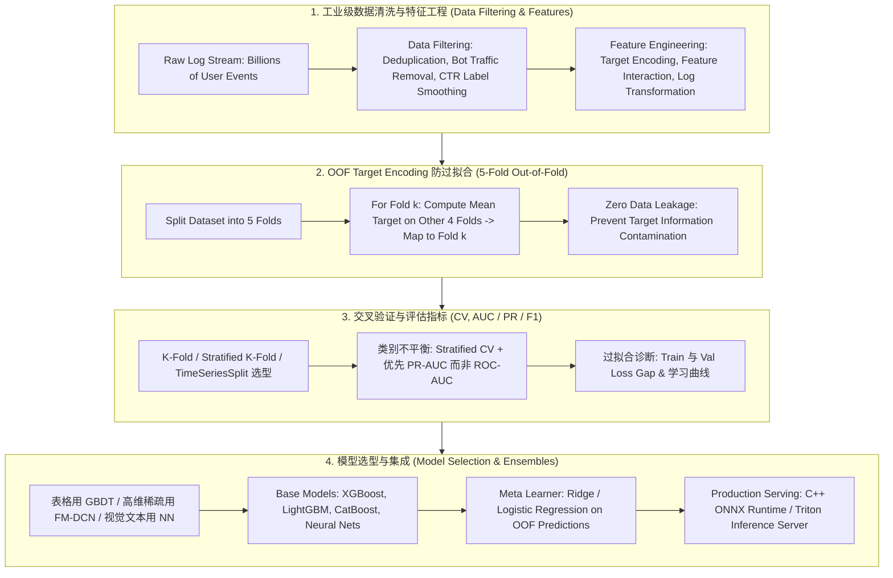

# 🌐 MLE 机器学习工程师核心地图：高频八股、竞赛经验与 Pinterest 案例

> **核心摘要**：MLE 面试核心是一套高频复现的知识点闭环——**正则化与偏差方差权衡、过拟合诊断、特征工程、评估指标 (AUC / PR / F1)、类别不平衡、梯度消失、交叉验证、模型选型与集成方法**。在生产落地（如 Pinterest 规模推荐系统）中，它们汇成一条流水线：过滤万亿级原始日志 → 以无穿越的 Target Encoding 做特征工程 → 严格交叉验证 → 异构基模型 Stacking。本速查表以标准回答 + 公式 + 速查表的形式覆盖最高频考点。

---

## 💡 交互式 Mermaid 面试知识点地图



---

## ⚡ 高频考点速查与标准解答

### 考点 1：L1 / L2 正则化如何工作？与偏差方差权衡有什么关系？
* **标准回答**：L2 (Ridge) 在损失上加入 $\lambda \sum w_i^2$，平滑收缩权重但不产生稀疏；L1 (Lasso) 加入 $\lambda \sum |w_i|$，把小幅权重精确压为 0，天然做特征选择。正则化轻微提升偏差但大幅削减方差，总误差取决于模型在偏差-方差曲线上的位置。误差分解为

$$E[(f - \hat{f})^2] = \underbrace{\text{Bias}^2}_{\text{欠拟合}} + \underbrace{\text{Variance}}_{\text{过拟合}} + \sigma^2$$

训练误差高 → 偏差主导 → 加容量或加特征；训练误差低但验证误差高 → 方差主导 → 正则化、简化或加数据。

> 💡 **直观理解**：正则化就是给权重"上税"——L2 像按平方收税，越大的权重罚得越狠，于是所有权重被平滑压小；L1 像收固定税，小权重交了税干脆归零。权重变小 → 输出对输入的敏感度下降、决策边界变平滑，模型不再死记训练点，对噪声输入更稳。
>
> 🎤 **面试速答**："结论：L1 压出稀疏做特征选择，L2 平滑收缩防过拟合，两者都以轻微偏差换大幅方差下降。原理：L2 加 λ∑w²，大权重受罚更重，权重整体缩小；L1 加 λ∑|w|，小权重被精确压成 0。举个例子：λ=0.1 时，L2 会把权重从 2.0 压到约 1.8；而 L1 会把 0.05 的小权重直接清零。选型：高维稀疏要特征选择用 L1，只求稳健防过拟合用 L2，也可以 Elastic Net 两掺。"

### 考点 2：如何诊断过拟合？应对手段有哪些？
* **标准回答**：通过训练/验证误差 Gap、学习曲线（训练误差下降而验证误差反弹）与权重范数诊断。标准答题顺序：(1) 加数据 / 数据增强；(2) 正则化（L1/L2、Dropout、Early Stopping）；(3) 降低模型容量（减少层数/树数、限制 `max_depth`）；(4) 特征筛选去除噪声特征；(5) 用 Bagging 式集成平均掉方差。

> 💡 **直观理解**：过拟合就像学生把课本逐字背下来——训练题全对，换一套卷子就崩。train-val Gap 就是"背课本"与"真理解"之间的距离：Gap 越大，死记硬背的成分越多。
>
> 🎤 **面试速答**："结论：训练误差低但验证误差高、Gap 扩大，就是过拟合。原理：模型容量过剩，把训练集噪声也当规律记下来，换数据就失效。诊断三件套：train-val Gap、学习曲线（训练下降而验证反弹）、权重范数。修复按序：加数据/增强 → 正则化（L2/Dropout/早停）→ 减容量（砍层数、降 max_depth）→ 去噪声特征 → Bagging 平均。例子：GBDT 的 train AUC=0.99 而 val AUC=0.92 时，先把 max_depth 从 10 降到 6、加大 min_child_samples，Gap 通常明显收窄。"

### 考点 3：工业级推荐系统如何在万亿级原始数据中进行 Data Filtering (数据清洗与噪声过滤)？
* **标准回答**：过滤 1 秒点击 > 20 次的机器人流量；停留时间 < 1 秒的误触点击剔除出正样本；对重复事件去重；用贝叶斯平滑 $\hat{p} = \frac{clicks + \alpha}{impressions + \alpha + \beta}$ 平滑 CTR 标签，抑制极端 0/1 噪声；采用软负采样（Soft Negative Sampling）平衡正负样本比例而非硬截断。

> 💡 **直观理解**：万亿级日志里大部分是"垃圾"——机器人、误触、重复事件。清洗就像淘金：先用便宜规则冲走泥沙，再把小样本的极端统计拉回全局先验。贝叶斯平滑就是给"1 次曝光 1 次点击"这种小样本 CTR 一个先验，避免模型被噪声标签带偏。
>
> 🎤 **面试速答**："结论：清洗目标是剔除机器流量与噪声标签，并平滑小样本统计。原理：机器人（>20 次点击/秒）和误触（停留 <1 秒）不是真实意图，留着会污染正负标签；重复事件导致同一行为重复计数，需去重。贝叶斯平滑 p̂=(clicks+α)/(impressions+α+β) 把 CTR 拉回先验——例如 1/1 的 CTR 会被压向 10 万曝光下的 3%，而不是保留 100%。软负采样平衡正负比而不是硬性丢弃。核心：先清洗再训练，别让模型消化噪声。"

### 考点 4：ROC-AUC、PR-AUC 与 F1 分别何时使用？
* **标准回答**：ROC-AUC 与阈值无关、对类别比例变化稳定，但在稀有正类上过于乐观；PR-AUC 聚焦正类上的精确率-召回率行为，因此**类别不平衡任务（反欺诈、异常检测、CTR）必须看 PR-AUC**。F1 = $2PR/(P+R)$ 是单阈值点指标，用于必须承诺唯一工作点的时候。经验法则：不平衡比 > 10:1 → 报告 PR-AUC 与调优阈值后的 F1，而非 ROC-AUC。

> 💡 **直观理解**：ROC 画的是 TPR vs FPR，而 FPR 的分母是全部负类——负类占 99% 时，分母巨大，FPR 怎么都很小，AUC 自然虚高。PR 把聚光灯只打在稀有正类上：精确率=命中率、召回率=捞出率，直接反映"在这 1% 里找东西"的能力。F1 则是"只许选一个工作点"时的单点快照。
>
> 🎤 **面试速答**："结论：不平衡 > 10:1 时看 PR-AUC，不看 ROC-AUC。原理：ROC 的 FPR 分母被海量负类主导，正类做得再差也看不出来；PR-AUC 以预测为条件直接度量正类，随机基线会随不平衡坍缩到 N⁺/(N⁺+N⁻)。F1 是单阈值点指标，用于必须承诺唯一工作点的时候。例子：1:1000 的反欺诈数据上，ROC-AUC 可能高达 0.95，但 PR-AUC 只有 0.1——后者才是真实能力。铁律：先报 PR-AUC，再调阈值报 F1。"

### 考点 5：偏差类问题——模型系统性错判某个子群体，如何定位？
* **标准回答**：区分两类失败。(1) **偏差误差**：模型容量不足，子群体模式学不到——分组查看损失，若子群体训练与验证误差都高，则补充该群体的特征或容量；(2) **数据偏差**：标签噪声或样本选择偏差——该群体被欠采样或误标注，先修数据流水线（加权、重采样、重标注）再动模型。最后用该群体特征的训练/生产分布漂移作为判定胜负手。

> 💡 **直观理解**：模型对某个子群体"脸盲"有两种根源：要么它能力不够（没见过足够多该群体的样本），要么数据本身在骗它（标签标错或样本选择有偏）。先分清是"模型不行"还是"数据不行"，修复方向完全不同。
>
> 🎤 **面试速答**："结论：先分清楚是容量不足（偏差误差）还是数据问题（数据偏差）。原理：分组看损失——子群体训练与验证误差都高 → 模型没学会，补该群体的特征或容量；子群体标签可疑或样本欠采样 → 数据偏差，先修数据流水线（加权、重采样、重标注）再动模型。例子：模型在老年用户上召回率只有 20%，检查发现该群体仅 500 条样本且 30% 标注错误——正确动作是重标注，而不是加深网络。最后用该群体特征的训练/生产分布漂移做胜负手。"

### 考点 6：如何处理类别不平衡？
* **标准回答**：三层解法。数据层：随机欠采样多数类、SMOTE 过采样少数类或软负采样；损失层：类权重（$w_{minor} = N_{maj}/N_{min}$）、Focal Loss $\mathcal{L} = -\alpha(1-p_t)^\gamma \log p_t$ 压低易分负样本权重；决策层：在 PR 曲线上调优判决阈值，绝不默认 0.5。全程用 Stratified CV 与 PR-AUC 度量进展。

> 💡 **直观理解**：1:999 的数据里，模型只要"全猜负类"就有 99.9% 的准确率——但业务要的是那 0.1% 的少数类。所以要同时从三层倾斜资源：改数据分布、改损失梯度配比、改判决阈值，缺一不可。
>
> 🎤 **面试速答**："结论：数据层、损失层、决策层三层协同。原理：欠采样/SMOTE 改变样本分布；类权重与 Focal Loss 重配梯度——Focal Loss 压低已分对样本的权重，把火力集中到难分少数类；阈值在 PR 曲线上调优，绝不默认 0.5。例子：1:1000 的欺诈数据，类权重设 w_minor=N_maj/N_min=1000，阈值从 0.5 调到 0.1 后召回率从 30% 升到 70%，精确率只降 5%。度量全程用 Stratified CV + PR-AUC。"

### 考点 7：如何解决深层网络的梯度消失/梯度爆炸？
* **标准回答**：激活函数：隐层用 ReLU 族替代 sigmoid/tanh；初始化：He（ReLU）/ Xavier（sigmoid/tanh）初始化使逐层方差保持 ~1；归一化：BatchNorm/LayerNorm 重定心预激活并允许更高学习率；结构：残差连接给梯度一条直达高速路；稳定器：梯度裁剪（$\|g\|_2 \le \tau$，如 1.0）应对爆炸，尤其是 RNN/LSTM 训练。

> 💡 **直观理解**：反向传播是从最后一层往回"接力传信号"。sigmoid 导数最大只有 0.25，几十层连乘下来信号像接力棒越传越弱——梯度消失；初始化权重太大时，信号越传越强——梯度爆炸。ReLU 的导数恒为 0 或 1，信号可以无损穿过；残差连接相当于给梯度修了条高速公路直达浅层。
>
> 🎤 **面试速答**："结论：换 ReLU 族激活 + 正确初始化 + 归一化 + 残差 + 梯度裁剪，五件套。原理：sigmoid 导数上限 0.25，连乘后指数衰减导致消失；He/Xavier 初始化让逐层方差保持约 1，信号既不放大也不缩小；BatchNorm 重定心预激活并允许更高学习率；残差让梯度有直达路径；梯度裁剪 ||g||₂≤τ（如 1.0）防爆炸，RNN/LSTM 必配。例子：10 层 sigmoid 网络梯度约缩到 0.25¹⁰≈1e-6，基本消失；换 ReLU + He 初始化后 50 层也能稳定训练。"

### 考点 8：在 Kaggle 竞赛和工业界落地中，如何防止 Data Leakage？OOF Target Encoding 的步骤？
* **标准回答**：所有 Feature Scaler、Imputer、Encoder 必须在交叉验证的 `train_fold` 上 `fit`，并在 `val_fold` 上 `transform`——在全量数据集上计算统计量即为目标穿越；带时间戳的数据严禁随机 K-Fold，必须按 `train_time < val_time < test_time` 割裂（TimeSeriesSplit）。高基数类别特征（City、Merchant ID）采用 5-Fold OOF Target Encoding：将训练集切分为 $K=5$ 个互斥 Fold；对第 $k$ 个 Fold，用其余 4 个 Fold 计算每个类别 $c$ 的平均 Target $\bar{y}_c$ 并映射回第 $k$ 个 Fold；测试集使用全部 5 个 Fold 的加权平均。样本自身目标参与自身特征计算的自环渗漏在结构上被消除。

> 💡 **直观理解**：数据穿越等于"考试时偷看答案"。在全量数据上 fit 缩放器/编码器，等价于验证折看到了由全体样本（包括它自己）算出的统计量——离线指标虚高，上线必翻车。OOF Target Encoding 就是"只让其他 4 个折的同学投票"，自己的标签永远不参与自己特征的构造。
>
> 🎤 **面试速答**："结论：一切 Scaler/Imputer/Encoder 只在 train_fold 上 fit；OOF Target Encoding 从结构上消灭自环泄漏。原理：把训练集切成 K=5 折，对第 k 折只用其余 4 折计算类别均值 ȳ_c 再映射回来，样本自身标签永远不进入自身特征；测试集用全量 5 折的平滑加权均值。例子：类别 City='SF' 的编码值由其他 4 折中 SF 样本的 y 均值决定，第 k 折内的 SF 样本完全看不到自己的标签。时序数据严禁随机 K-Fold，必须 train_time < val_time < test_time（TimeSeriesSplit）。"

### 考点 9：交叉验证如何静默失败？如何选择正确的分割器？
* **标准回答**：时间序列上使用随机 K-Fold 会把未来泄漏进过去（离线指标虚高、线上 A/B 崩盘）；分类任务用 Stratified K-Fold 保持类别比例；分组数据（同一用户/商家）用 GroupKFold，保证模型验证时看不到本组目标的特征信息。选择铁律：**时序数据不随机分割、不平衡数据不无分层分割、分组数据不无分组分割**，否则验证指标就是谎言。

> 💡 **直观理解**：随机 K-Fold 切时序数据，等于让模型"预知未来"——离线 AUC 0.98，上线直接崩，因为现实世界里它永远看不到未来。分组数据不分组切，同一用户/商户的数据同时出现在训练和验证里，模型在验证时"见过"这些实体，指标自然虚高。
>
> 🎤 **面试速答**："结论：三种静默失败——时序随机切、不平衡不分层、分组不分组。原理：时序泄漏未来，指标虚高、A/B 崩盘；Stratified K-Fold 保持每折类别比例；GroupKFold 保证同一组样本不跨折。例子：同一用户在 train 和 val 都有行为，模型记住的是用户 ID 而不是泛化规律，val AUC 高但冷启动用户上一塌糊涂。铁律：时序不随机、不平衡不无分层、分组不无分组——否则验证指标就是谎言。"

### 考点 10：生产环境如何选择模型家族？
* **标准回答**：按数据模态决策。**表格数据**：GBDT（LightGBM / XGBoost / CatBoost）仍对深度学习保持压倒性优势——轴平行超平面分割天然拟合表格特征的非线性与离散分位数、对缺失值天然免疫、可解释性极强（Feature Importance / SHAP）；**高维稀疏数据**（推荐/广告中的 User ID、Item ID、Tag 独热特征）：推荐 FM / DCN-v2 / DeepFM——树模型在极高维稀疏特征上易产生失衡分割导致过拟合与树深度暴涨；**视觉/文本/序列**：CNN、Transformer 与注意力架构。毫秒级 Serving 延迟预算（Triton / ONNX）可在最终选型上压倒精度。

> 💡 **直观理解**：表格数据像"分格子的货架"，GBDT 的轴平行分割天然契合货架上的离散分位数；高维稀疏 ID 特征像"千万个开关、每次只开几个"，树模型会为每个开关疯狂分裂，而 FM/DeepFM 用向量内积隐式捕捉交叉；图像文本序列则是 NN 的主场。选家族 = 数据模态 + 延迟预算。
>
> 🎤 **面试速答**："结论：按数据模态选模型家族。原理：表格 → GBDT（LightGBM/XGBoost/CatBoost），轴平行分割拟合表格非线性、天然免疫缺失值、SHAP 可解释；高维稀疏 ID（推荐/广告）→ FM/DCN-v2/DeepFM，树在稀疏特征上易失衡分割导致过拟合和树深暴涨；视觉/文本/序列 → CNN/Transformer。例子：推荐场景 10 亿 User ID one-hot，树模型树深会失控，DeepFM 的 embedding 层把每个 ID 压成 64 维稠密向量。最后，毫秒级延迟预算（Triton/ONNX）可以压倒精度做最终选型。"

### 考点 11：剖析 Model Stacking 的 5-Fold Cross-Validation 训练流程与 Meta-Learner 选型策略？
* **标准回答**：第一层用 5 个结构异构的 Base Models（XGBoost、LightGBM、CatBoost、NN）各自内部 5-Fold 生成 OOF 预测，测试集预测为各 Fold 均值；第二层 Meta-Learner 在拼接的 OOF 预测上训练，**必须选用带强正则的简单线性模型（Ridge / Logistic Regression）**——在少量 OOF 列上使用复杂树模型会过拟合并摧毁泛化。

> 💡 **直观理解**：Stacking 像"专家会诊"——每位专家（XGBoost/LightGBM/CatBoost/NN）独立看片给出结论，再由主治医生（线性 meta-learner）综合结论做最终诊断。meta 层输入只有几个 OOF 分数，信息量很小，用复杂树模型会把这几个数的噪声都背下来，所以必须用带强正则的线性模型。
>
> 🎤 **面试速答**："结论：第一层异构基模型出 OOF 预测，第二层用正则线性模型（Ridge/LogReg）学融合。原理：每个基模型内部 5-Fold 生成 OOF 预测，测试集预测取各折均值，杜绝同折过拟合；meta-learner 的输入只有 K 列 OOF 分数，树模型会记住 OOF 上的噪声。例子：4 个基模型 → 拼接成 4 列 OOF 特征，用 Ridge（α=1.0）训练 meta 层，线上 AUC 比最优单模型高约 0.5 个百分点。选型顺序：XGBoost/LightGBM/CatBoost 三件套打底，再加 1-2 个 NN。"

### 考点 12：如何使用 CUPED 方差降低方法缩减 A/B 测试所需的样本量与实验时间？
* **标准回答**：利用实验前历史协变量 $X$ 回归修正实验期指标 $\tilde{Y} = Y - \theta (X - \mathbb{E}[X])$，其中 $\theta = \frac{Cov(X,Y)}{Var(X)}$。指标方差按实验前后相关系数平方缩减 $Var(\tilde{Y}) = Var(Y) (1 - \rho^2)$，在相同统计功效下节约 50%+ 样本量与实验周期。

> 💡 **直观理解**：A/B 实验的噪音大多来自用户本身的差异——高活跃用户本来就容易转化。CUPED 用实验前的历史数据算每个人的"基线水平"再减去它，就像比较"谁进步得多"而不是"谁绝对水平高"，方差大幅下降，样本量需求跟着下降。
>
> 🎤 **面试速答**："结论：CUPED 用实验前协变量压缩指标方差，可节约 50%+ 样本量与实验时长。原理：对实验期指标做协变量回归修正 Ỹ = Y − θ(X − E[X])，θ = Cov(X,Y)/Var(X)，方差缩减为 Var(Ỹ) = Var(Y)(1 − ρ²)，ρ 是协变量与结果的相关系数。例子：注册实验中用实验前 7 天活跃度作协变量，ρ=0.6 时方差降到 0.64 倍，同功效下样本量节约约 36%；ρ=0.8 时节约 64%。铁律：协变量必须在实验开始前确定，否则修正本身会引入偏差。"

---

## 📐 速查公式表

| 主题 | 公式 / 规则 | 面试要点 |
| :--- | :--- | :--- |
| 偏差方差 | $E[(f-\hat{f})^2] = \text{Bias}^2 + \text{Var} + \sigma^2$ | 训练误差高→偏差；验证 Gap 大→方差 |
| L2 / L1 | $L_2: + \lambda \sum w_i^2$；$L_1: + \lambda \sum \|w_i\|$ | L1 稀疏选特征，L2 平滑收缩 |
| F1 | $F_1 = \frac{2PR}{P+R}$ | 单一阈值点指标 |
| PR vs ROC | PR: $P \cdot R$ 曲线；ROC: TPR vs FPR | 不平衡 > 10:1 → PR-AUC |
| Focal Loss | $\mathcal{L} = -\alpha (1-p_t)^\gamma \log p_t$ | 压低易分负样本权重 |
| 标签平滑 | $\hat{p} = \frac{clicks + \alpha}{impressions + \alpha + \beta}$ | 抑制 CTR 极端 0/1 噪声 |
| OOF 编码 | $\bar{y}_c^{(k)} = \text{mean}(y \mid c, \text{folds} \neq k)$ | 零自环泄漏 |
| CUPED | $Var(\tilde{Y}) = Var(Y)(1-\rho^2)$ | 约 50% 样本量节省 |
| 梯度裁剪 | $\|g\|_2 \le \tau$ | 梯度爆炸稳定器 |
| 时间分割 | $train_{t} < val_{t'} < test_{t''}$ | 时序数据严禁随机 K-Fold |

> **怎么读这张表**：面试被追问"什么时候用哪个"时，第三列的"面试要点"就是一句话答案。最常考的三组对比：不平衡 → PR-AUC、时序 → 不随机 K-Fold、L1 vs L2 → 稀疏 vs 收缩。先把这三行背熟，其余按需扩展。

## 🧭 模型选型与集成速查表

| 家族 | 方法 | 优势 | 劣势 | 典型场景 |
| :--- | :--- | :--- | :--- | :--- |
| **Bagging** | Random Forest（并行树 + 自助采样） | 低方差、稳健、可并行 | 表达能力有限 | 基线、异常检测 |
| **Boosting** | GBDT / LightGBM / XGBoost（串行拟合残差） | 表格数据 SOTA、缺失值天然 | 对噪声/离群点敏感 | 排序、CTR、Kaggle |
| **Stacking** | 异构基模型 + 线性 Meta-Learner | 单模型性能上限 | 复杂度与泄漏风险 | 竞赛夺金、生产集成 |
| **稀疏深度学习** | FM / DeepFM / DCN-v2 | 交叉特征泛化强 | 可解释性成本 | 推荐 / 广告 Serving |

> **怎么读这张表**：从"典型场景"列反推记忆——先看场景再对号入座家族。面试最常考的对比是 **Boosting vs Stacking**：单模型选 Boosting（串行拟合残差）、融合多个模型才上 Stacking（异构基模型 + 线性 meta）；再补一个 Bagging 作为"低方差稳健基线"。

---

## 🐍 Pure Python 竞赛级特征交叉算子

```python
import numpy as np

def pure_python_feature_cross(cat_feat1: list, cat_feat2: list) -> list:
    return [f"{f1}_{f2}" for f1, f2 in zip(cat_feat1, cat_feat2)]

if __name__ == "__main__":
    gender = ["Male", "Female", "Male", "Female"]
    device = ["iOS", "Android", "Android", "iOS"]
    crossed = pure_python_feature_cross(gender, device)
    print("✅ 特征交叉结果:", crossed)
```

---

## 🚀 核心要点与最佳实践

1. **穿越是头号面试陷阱与头号生产杀手**：一切 Transform 只在 `train_fold` 上 `fit`；时序数据绝不使用随机 K-Fold。
2. **先选指标再选模型**：类别不平衡 → Stratified CV + PR-AUC + 调优阈值，绝不裸看 Accuracy。
3. **模型家族与数据模态匹配**：表格用 GBDT、稀疏 ID 用 FM/DeepFM、视觉文本用 NN——再用正则化线性 Meta-Learner 异构堆叠。
4. **先诊断再调参**：用偏差-方差分解决定是加数据、加容量还是加正则。
