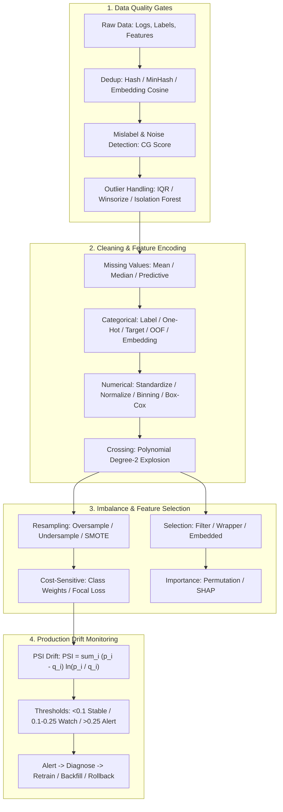

# 🌐 MLE Data & Feature Engineering: Quality Pipelines, Categorical Encoding, Imbalance, Selection & Drift Detection

> **Core Executive Summary**: Model performance is decided before training starts — by data quality and feature engineering. This guide covers the full MLE data pipeline: the four data-quality threats (mislabeling, noise, duplication, outliers), missing-value imputation, categorical encoding (Label / One-Hot / Target / OOF / Embedding) with leakage prevention, numerical transformations (standardization, normalization, binning, Box-Cox), polynomial crossing and its explosion, class-imbalance handling (resampling, SMOTE, cost-sensitive learning, metrics), feature selection (filter / wrapper / embedded) with permutation importance and SHAP, and production drift monitoring with PSI.

---

## 💡 Interactive Mermaid Architecture Flowchart



---

## 💡 Classic Interview Followups & Core Cheatsheet

* **Key Topic 1**: Walk through your end-to-end data quality pipeline. How do you detect mislabeled, noisy, and duplicated samples?
  * *Standard Answer*: Layered pipeline — cheap heuristics first, expensive checks last. (1) **Deduplication**: exact duplicates via SHA-1 hashing; near-duplicates via MinHash or embedding cosine similarity > 0.9. (2) **Mislabel detection**: flag low-confidence ensemble disagreements or high Complexity Gap scores, then audit a stratified sample with humans. (3) **Noise and outliers**: IQR rule, z-scores, or Isolation Forest, then remove, winsorize, or down-weight. Every transform fits on training data only, and dedup also runs against validation/test sets to prevent contamination.

> 💡 **Intuition**: A quality pipeline is airport security — cheap checks first, expensive ones last. Hashing is an ID check (milliseconds), embedding similarity is facial recognition (expensive but catches near-duplicates), and human audit is the baggage inspection (costliest, sampled only).
>
> 🎤 **30-Second Answer**: "Conclusion: a layered pipeline — cheap heuristics up front, expensive checks last. Mechanism: exact duplicates via SHA-1; near-duplicates via MinHash or embedding cosine > 0.9; mislabels flagged by low-confidence ensemble disagreements or high Complexity Gap scores, then stratified human audit; noise/outliers via IQR, z-score, or Isolation Forest, then remove, winsorize, or down-weight by impact. Example: 1M log rows — SHA-1 dedup first cuts 20% duplicates; embeddings then catch near-duplicate paraphrases. Iron rule: every transform fits on train only; dedup also applies to validation/test."

* **Key Topic 2**: Compare mean, median, and model-based predictive imputation. When would you prefer each?
  * *Standard Answer*: Mean imputation $\hat{x}_i = \frac{1}{n} \sum_j x_j$ is fastest but shrinks variance and ignores correlations; median is robust to outliers but equally ignores structure; predictive imputation (KNN / MICE / GBDT) preserves correlations with the lowest bias but must be **fitted inside each CV fold** — otherwise validation leaks into training. Always add a missingness indicator; never impute with full-dataset statistics before splitting.

> 💡 **Intuition**: Mean imputation is "substituting the class average for a missing exam score" — fast, but drags everyone toward the mean and wipes out individual variance; the median is immune to extreme scores; predictive imputation is "guessing the missing score from classmates' scores" — keeps correlations, costs more. Missingness itself can carry signal, so add an indicator column and let the model learn it.
>
> 🎤 **30-Second Answer**: "Conclusion: cheap statistics (median for skewed, mean for symmetric) when missingness is low and random; predictive imputation when missingness correlates with other features; always add a missingness indicator. Mechanism: mean shrinks variance and ignores correlations; median is robust but still structure-blind; predictive (KNN/MICE/GBDT) has the lowest bias but must be fitted inside each CV fold. Example: income missing 30% and correlated with education — GBDT-regress it from the other 5 features and gain ~2 AUC points over mean imputation. Iron rule: full-dataset imputation before splitting is the most silent leakage there is."

* **Key Topic 3**: Explain OOF Target Encoding and why it prevents target leakage. How does it compare with One-Hot for high-cardinality features?
  * *Standard Answer*: Target encoding uses $\bar{y}_c = \frac{1}{n_c} \sum_{i \in c} y_i$; naive use lets a sample's own label pollute its own feature. OOF splits training into $K$ folds and encodes fold $k$ from the other folds only: $\bar{y}_c^{(k)} = \text{mean}(y \mid c, \text{folds} \neq k)$, structurally eliminating the self-loop; test uses global smoothed statistics $\hat{y}_c = \frac{n_c \bar{y}_c + \lambda p}{n_c + \lambda}$. One-Hot needs $K$ columns and explodes for high cardinality (e.g., 10M merchant IDs); OOF keeps one column with signal.

> 💡 **Intuition**: Target encoding translates a category into "how often samples of this category were positive historically" — 'city=Shanghai' becomes a single number. But the naive version cheats: a sample's own label contributes to its own feature (the self-loop), so the model memorizes the answer key. OOF means "only the other 4 folds vote": your label never enters your own feature.
>
> 🎤 **30-Second Answer**: "Conclusion: high-cardinality categories → OOF Target Encoding — one column instead of K, structurally leakage-free. Mechanism: for fold k, compute the per-category mean ȳ_c^(k) on the other K−1 folds and map it back; test uses smoothed global stats ŷ_c = (n_c·ȳ_c + λp)/(n_c + λ). Example: 10M merchant IDs would need 10M one-hot columns but a single OOF column with full CTR signal. Follow-up: rare categories get unstable statistics, so smoothing (λ=20) pulls them toward the global prior instead of extreme 0/1."

* **Key Topic 4**: How do you handle extreme class imbalance such as 1:1000 fraud data? Compare resampling, SMOTE, and cost-sensitive learning.
  * *Standard Answer*: Three layers. **Data**: undersampling (cheap, lossy) or SMOTE interpolation $x_{\text{new}} = x_i + \delta \cdot (x_{\text{nn}} - x_i)$, $\delta \sim U(0,1)$. **Loss**: class weights $w_c = \frac{N}{n_c}$; Focal Loss $\mathcal{L} = -\alpha (1 - p_t)^\gamma \log p_t$ down-weights easy samples. **Decision**: tune the threshold on the PR curve, never 0.5. Metrics: PR-AUC and MCC, not accuracy; always Stratified CV.

> 💡 **Intuition**: At 1:1000, predicting 'not fraud' for everything scores 99.9% accuracy — accuracy is a decoration. SMOTE's idea is "synthesize new minority samples by interpolating between a minority point and its neighbors", like breeding a rare species; focal loss's idea is "don't review questions you already got right — focus on the wrong ones".
>
> 🎤 **30-Second Answer**: "Conclusion: three layers — data (undersampling/SMOTE), loss (class weights/focal loss), decision (threshold on the PR curve); switch metrics to PR-AUC + MCC. Mechanism: SMOTE interpolates x_new = x_i + δ(x_nn − x_i), δ~U(0,1); class weights w_c = N/n_c; focal loss down-weights easy samples; never default to threshold 0.5. Example: on 1:1000 fraud, SMOTE up to 50k positives plus weight 1000 plus threshold 0.1 lifts recall from 30% to 70% at only 5% precision cost. Always Stratified CV and PR-AUC for progress."

* **Key Topic 5**: What is PSI and how would you build a feature drift monitoring system in production?
  * *Standard Answer*: PSI measures distribution shift between a reference (training) window and the current window: $\text{PSI} = \sum_{i=1}^{B} (p_i - q_i) \ln \frac{p_i}{q_i}$ over $B$ bins. PSI < 0.1 stable; 0.1–0.25 investigate; > 0.25 alert. Production: a daily job computing per-feature PSI (fixed reference vs. rolling window) with dashboard alerts, plus the same machinery for label/score drift; on alert, drill down, then backfill, retrain, or roll back.

> 💡 **Intuition**: PSI quantifies 'how different two distributions look' — slice the training-period and current-period values of a feature into 10 buckets each and compare the share of people in every bucket. If 'city=Shanghai' drifts from 30% to 50%, PSI jumps. It's a thermometer: <0.1 normal, 0.1–0.25 low fever, >0.25 high fever that needs action.
>
> 🎤 **30-Second Answer**: "Conclusion: monitor every feature with per-feature PSI; thresholds <0.1 stable, 0.1–0.25 investigate, >0.25 alert. Mechanism: PSI = Σ(p_i − q_i)·ln(p_i/q_i) over 10 decile bins comparing reference vs rolling window; on alert, drill down per feature, then backfill, retrain, or roll back. Example: a risk model's 'device fingerprint' feature jumps from PSI 0.05 to 0.6 — investigation shows scrapers changed their User-Agent: pure covariate shift, retrain on fresh data. Caveat: PSI is univariate — pair it with model-based detectors for multivariate drift."

---

## 📚 Section 1: Data Quality & Cleaning Pipeline

### 1.1 The Four Data Quality Threats

| Threat | Detection Signal | Typical Treatment |
| :--- | :--- | :--- |
| **Mislabeled** | Low ensemble confidence, high CG score, human audit | Relabel, drop, or down-weight |
| **Noisy** | Outlier statistics, entropy $H(x) = -\sum_i p_i \log p_i$ | Filter, winsorize, or smooth |
| **Duplicated** | SHA-1 hash; MinHash; embedding cosine $> 0.9$ | Deduplicate, keep canonical copy |
| **Outlier** | IQR rule, z-score, Isolation Forest | Winsorize or remove after impact check |

> **How to read this table**: Memorize the three columns as one complete answer chain — threat → detection signal → treatment. The most-tested contrast is Duplicated vs Outlier: dedup relies on hashing/similarity, outliers on distribution statistics.

Duplicates silently inflate dataset size and bias offline metrics; label noise forces the model to memorize noise instead of structure, wasting exactly the capacity that scaling laws would otherwise convert into accuracy.

> 💡 **Intuition**: The four threats each hit a different weakness — duplicates quietly inflate the dataset and distort class ratios; mislabels make the model spend capacity memorizing wrong answers; noise turns coincidence into learned rules; outliers spoil distance-based models (kNN/linear) like one bad apple. Detection costs rise from millisecond hashing to human audit, so the pipeline must be 'cheap first, expensive last'.
>
> 🎤 **30-Second Answer**: "Conclusion: four threats — mislabel, noise, duplication, outlier — handled by a layered pipeline. Mechanism: duplicates via SHA-1/MinHash/embedding cosine; mislabels via ensemble disagreement + CG scores then stratified human audit; noise via entropy/perplexity then filter or smooth; outliers via IQR/z-score/Isolation Forest then remove or winsorize by impact. Example: embedding cosine > 0.9 flags near-duplicate news headlines (keep one); Isolation Forest marks 2% of 10M rows as outliers — check impact before winsorizing. Iron rule: every transform fits on training data only."

### 1.2 Missing Value Imputation Strategy Comparison

| Strategy | Mechanism | Pros | Cons |
| :--- | :--- | :--- | :--- |
| **Mean** | $\hat{x}_i = \frac{1}{n}\sum_j x_j$ | Fastest | Shrinks variance, ignores correlations, skewed bias |
| **Median** | $\text{median}(x)$ | Robust to outliers | Still ignores structure |
| **Predictive** | KNN / MICE / GBDT regression | Captures correlations, lowest bias | Expensive; must fit inside each CV fold |

> **How to read this table**: Read down the cost column — mean → median → predictive, cost increases while bias decreases; when asked 'which to choose when', answer along this gradient. The words 'must fit inside each CV fold' are the single most important phrase in the table.

Default order: cheap statistics (median for skewed, mean for symmetric) when missingness is low and random; predictive imputation when missingness correlates with other features; **always** add a missingness indicator so the model learns the missing pattern itself.

> 💡 **Intuition**: Missingness has three personalities — missing completely at random (MCAR, anything works), missing at random (MAR, correlated with other features), and missing not at random (MNAR, correlated with the missing value itself). What you impute depends on why it's missing — that's where predictive imputation and the indicator column earn their keep.
>
> 🎤 **30-Second Answer**: "Conclusion: cheap statistics for low/random missingness, predictive imputation when it correlates with other features, and always a missingness indicator. Mechanism: mean shrinks variance and ignores correlations; median survives outliers but ignores structure; predictive preserves correlations with the lowest bias but must fit inside each CV fold. Example: income 30% missing and correlated with education — GBDT-regress income from the other 5 features and gain ~2 AUC points; add an is_missing column so the model can learn that missing-income users churn more. Iron rule: never impute on full data before splitting."

### 1.3 Outlier Handling

The IQR rule flags $x$ when $x < Q_1 - 1.5 \cdot \text{IQR}$ or $x > Q_3 + 1.5 \cdot \text{IQR}$, with $\text{IQR} = Q_3 - Q_1$. Options: remove (only if provably erroneous), **winsorize** by clipping to the $q$ / $(1-q)$ percentiles, or use a **robust scaler** $\frac{x - \text{median}}{\text{IQR}}$. Trees barely care about outliers; linear models, neural nets, and kNN care enormously — check the model family first.

> 💡 **Intuition**: Outlier handling starts by asking 'does the model fear outliers?' — trees split on orderings, so a 100k outlier among 100s barely matters; but linear models and kNN compute means and distances, and one 100k can tilt the whole line. The IQR rule flags anything beyond 1.5 box-lengths past the 25th/75th percentile.
>
> 🎤 **30-Second Answer**: "Conclusion: confirm the model family before touching outliers. Mechanism: IQR flags x < Q1 − 1.5·IQR or x > Q3 + 1.5·IQR; options: delete only if provably erroneous, winsorize to the q/(1−q) percentiles, or use a robust scaler (x−median)/IQR so the transform itself resists outliers. Example: 99% of transaction amounts are 0–500, one is 50,000 — the linear model tilts; winsorize to the 99th percentile (~1,200) and it stabilizes; feed the same column to LightGBM and you can ignore it entirely."

---

## 📚 Section 2: Feature Encoding & Transformation

### 2.1 Categorical Encoding Comparison

| Method | Mechanism | Pros | Cons |
| :--- | :--- | :--- | :--- |
| **Label** | $c \mapsto \text{integer}$ | Tiny memory | Imposes fake ordinality |
| **One-Hot** | $c \mapsto \mathbf{e}_k \in \{0,1\}^K$ | No ordinal bias | $K$ columns; high-cardinality explosion |
| **Target** | $\bar{y}_c = \frac{1}{n_c}\sum_{i \in c} y_i$ | Compact, powerful | Severe leakage without OOF |
| **OOF Target** | $\bar{y}_c^{(k)} = \text{mean}(y \mid c, \text{folds} \neq k)$ | Leakage-free by construction | Needs careful CV + smoothing |
| **Embedding** | $c \mapsto \text{Lookup}(W_c)$ | Dense, generalizes | Needs NN training |

> **How to read this table**: Read each row horizontally as one logic chain — mechanism → pros → cons. Memory anchors: Label imposes fake ordinality (apple > banana > orange is nonsense), One-Hot explodes at high cardinality, Target leaks without OOF, Embedding is the most powerful but needs training. The default interview answer for high cardinality + tabular is OOF Target.

Golden rule: any statistic (imputer, scaler, encoder) fits on `train_fold` and applies to `val_fold` only — computing it on the full dataset before splitting is target leakage, the #1 interview trap and the #1 production killer.

> 💡 **Intuition**: Encoding is 'translating categories into a language the model understands'. One-Hot is flipping switches by index — but 10M merchants means 10M switches; Target encoding is 'how often is this category positive historically' — compact but easy to cheat; OOF is 'only the other 4 folds vote', structurally killing the cheat.
>
> 🎤 **30-Second Answer**: "Conclusion: pick the encoder by cardinality and model — Label for low-cardinality ordinal, One-Hot for low-cardinality nominal, OOF Target for high-cardinality tabular, Embedding for deep models. Mechanism: Label imposes fake order; One-Hot explodes to K columns; naive Target leaks via the self-loop; OOF computes ȳ_c^(k) on the other folds only. Example: 200 countries are fine as 200 one-hot columns; 10M merchant IDs need OOF Target or Embedding. Iron rule: every statistic fits on train_fold and transforms val_fold only."

### 2.2 Numerical Feature Transformations

* **Standardization**: $z = \frac{x - \mu}{\sigma}$ — zero mean, unit variance; default for linear models, SVM, kNN, nets.
* **Min-Max Normalization**: $x' = \frac{x - x_{\min}}{x_{\max} - x_{\min}}$ — bounds to $[0,1]$, outlier-sensitive.
* **Binning**: equal-width / equal-frequency / quantile; helps linear models approximate nonlinearity, adds nothing for trees.
* **Box-Cox**: $y^{(\lambda)} = \frac{x^{\lambda} - 1}{\lambda}$ for $\lambda \neq 0$, $y^{(0)} = \ln x$; $\lambda$ by MLE. The log transform is the standard fix for right-skewed CTR / price / count features.

> 💡 **Intuition**: Transforms make data look the way the model likes it. Linear models want features of comparable scale without long tails — standardization is a common ruler (z-scores), Box-Cox straightens right-skewed tails toward the middle. Trees only care about split ordering, so these transforms do nothing for them.
>
> 🎤 **30-Second Answer**: "Conclusion: distance-based models (linear/SVM/kNN/NN) need standardization; right-skewed features need log/Box-Cox; trees need neither. Mechanism: standardization z=(x−μ)/σ unifies scales so no feature dominates distances and gradients; Box-Cox y^(λ)=(x^λ−1)/λ picks λ by MLE to maximize normality, λ=0 being the log. Example: income with skewness 8.7 drops to 0.3 after log; kNN gains ~3 AUC points. Counter-example: LightGBM scores the same with or without standardization. Caveat: Min-Max is outlier-sensitive — prefer robust scaling."

### 2.3 Feature Crossing & Polynomial Features

Linear models are linear-in-parameters, not linear-in-features: basis expansion $\phi(x) = [1, x_1, x_2, x_1^2, x_2^2, x_1 x_2]^T$ keeps $y = w^T \phi(x)$ OLS-solvable while adding curvature and interactions. The price is **combinatorial explosion**: degree $p$ over $d$ features yields $\binom{d + p}{p}$ terms — degree 2 over 100 features gives 5,151 columns. Control: cross only curated high-value pairs (e.g., `user × item`), cap degree at 2, or let trees / factorization machines find interactions implicitly.

> 💡 **Intuition**: Feature crossing is 1+1>2 — 'male' and 'sneakers' are weak alone but strong together. Polynomial expansion is the brute-force enumeration of all combinations, and it explodes: degree-2 over 100 features yields C(102,2)=5,151 columns. Industry practice is to cross only curated pairs or let the model learn interactions implicitly.
>
> 🎤 **30-Second Answer**: "Conclusion: curate crossings instead of enumerating them — linear models build them explicitly, trees/FMs learn them implicitly. Mechanism: basis expansion φ(x)=[1,x1,x2,x1²,x2²,x1x2] keeps y=wᵀφ(x) linear-solvable, but degree p over d features yields C(d+p, p) terms. Example: 100 features × degree 2 = 5,151 columns — slow and overfit-prone; instead cross only business-critical pairs like user×item, or use an FM so factor interactions emerge during training. Follow-up: DeepFM's FM layer learns degree-2 crosses via inner products; DCN learns higher-order crosses via cross layers."

---

## 📚 Section 3: Imbalance, Feature Selection & Production Drift

### 3.1 Class Imbalance: Three-Layer Attack

* **Data**: random oversampling (overfitting risk), random undersampling (cheap but lossy), and **SMOTE**, which synthesizes $x_{\text{new}} = x_i + \delta \cdot (x_{\text{nn}} - x_i)$, $\delta \sim U(0,1)$; variants (Borderline-SMOTE, SMOTE-Tomek) target the decision boundary.
* **Loss**: class weights $w_c = \frac{N}{n_c}$; Focal Loss $\mathcal{L} = -\alpha(1 - p_t)^\gamma \log p_t$ down-weights easy samples so training focuses on the hard minority tail.
* **Metrics**: accuracy is meaningless at 1:1000 — use **PR-AUC** (sensitive to the rare positive class), F1 at a tuned threshold, and MCC; ROC-AUC is misleadingly optimistic on rare classes. Always Stratified CV.

> 💡 **Intuition**: At 1:999, predicting 'majority class' for everything scores 99.9% — so the first battlefield of imbalance is the metric, not the model. The three-layer attack is like three forces: data changes the troop ratio (sampling), loss changes the rewards (weights/focal), decision changes the pass line (threshold).
>
> 🎤 **30-Second Answer**: "Conclusion: three layers — data, loss, decision — and switch metrics to PR-AUC. Mechanism: SMOTE interpolates x_new = x_i + δ(x_nn − x_i); class weights w_c = N/n_c and focal loss rebalance gradients; the threshold is tuned on the PR curve, never 0.5. Example: on 1:1000 fraud, SMOTE + weight 1000 + threshold 0.1 lifts recall from 30% to 70% at only 5% precision cost. Follow-up: ROC-AUC can read 0.95 while PR-AUC is 0.1 at 1:1000 — that's why PR-AUC + MCC measure progress, inside Stratified CV."

### 3.2 Feature Selection & Feature Importance

| Family | Methods | Pros | Cons |
| :--- | :--- | :--- | :--- |
| **Filter** | Correlation, mutual information, variance threshold | Fast, model-free | Ignores interactions |
| **Wrapper** | Forward/backward selection, RFE | Optimizes the target metric | Expensive, overfit-prone |
| **Embedded** | L1 (Lasso), tree split importance | Built into training | Trees bias toward high cardinality |

> **How to read this table**: Memorize by increasing computational cost — Filter (one statistics pass) < Embedded (built into training) < Wrapper (repeated training). Frequent interview point: prefer permutation importance over native tree importance — native counts split frequency, permutation measures true predictive contribution.

Embedded L1 solves $\min_w \|y - Xw\|^2 + \lambda \|w\|_1$, driving weak weights to zero. Prefer **permutation importance** — shuffle feature $j$ and measure the drop $\text{PI}_j = \mathcal{M}(D) - \frac{1}{K}\sum_k \mathcal{M}(D_j^{(k)})$ — over raw tree importances: it reflects predictive contribution, not split frequency. **SHAP** adds local per-prediction attribution, which audits and debugging workflows consume.

> 💡 **Intuition**: Feature importance answers 'does this feature matter?' — but native tree importance counts split frequency, and frequent splitting is not true contribution (high-cardinality features win by default). Permutation importance runs the brute-force experiment 'shuffle the feature and see how much score drops': big drop → genuinely important. SHAP goes further and attributes a per-sample contribution ledger.
>
> 🎤 **30-Second Answer**: "Conclusion: three families — Filter (fast, ignores interactions), Wrapper (direct but expensive), Embedded (efficient but cardinality-biased); prefer permutation importance + SHAP for importance. Mechanism: permutation importance shuffles feature j and measures the metric drop PI_j = M(D) − (1/K)ΣM(D_j^(k)); SHAP adds per-prediction attribution. Example: a high-cardinality ID is split 10,000 times by the tree yet shuffling it barely moves the metric — drop it; 'days since last purchase' splits only 200 times but AUC falls 8 points when shuffled — keep it. Audit workflows consume SHAP's local explanations."

### 3.3 Drift Monitoring with PSI

$$\text{PSI} = \sum_{i=1}^{B} (p_i - q_i) \cdot \ln \frac{p_i}{q_i}$$

where $p_i$ is the reference (training) proportion and $q_i$ the current production proportion in bin $i$ (commonly 10 decile bins).

| PSI Range | Interpretation | Action |
| :--- | :--- | :--- |
| $\text{PSI} < 0.1$ | Stable | None |
| $0.1 \le \text{PSI} < 0.25$ | Moderate shift | Drill-down investigation |
| $\text{PSI} \ge 0.25$ | Severe drift | Alert → diagnose → retrain / backfill / rollback |

> **How to read this table**: The three thresholds are a must-memorize interview answer — below 0.1 relax, 0.1–0.25 investigate, above 0.25 act. Pair the ranges with the Action column to narrate the full loop: alert → diagnose → retrain/backfill/rollback — that's the skeleton of a complete drift-monitoring answer.

Production: a daily job computes per-feature PSI (fixed reference vs. rolling window); thresholds trigger alerts, and the same machinery monitors score and label distributions. PSI is univariate — pair it with model-based detectors to catch multivariate drift.

> 💡 **Intuition**: PSI is a thermometer — it measures per-feature distribution shift: 30% Shanghai at training vs 50% now feeds into the formula and rings. But a thermometer diagnoses fever, not the disease — you also need the doctor: model-based detectors that catch correlations drifting together.
>
> 🎤 **30-Second Answer**: "Conclusion: per-feature PSI + alert thresholds + model-level detectors — a three-layer monitoring stack. Mechanism: PSI = Σ(p_i − q_i)·ln(p_i/q_i) compares a fixed reference window against a rolling window over 10 decile bins; <0.1 stable, 0.1–0.25 investigate, >0.25 alert. Example: the recommender's 'user city' feature climbs from PSI 0.04 to 0.31 three months after launch — drill-down shows a new app version broke the tracking and city is missing at scale: backfill the data, don't retrain the model. Caveat: two features can each be stable while their correlation breaks — PSI can't see it; model-based detectors can."

---

## 🐍 Pure Numpy Implementation: OOF Target Encoding

```python
import numpy as np

def oof_target_encoding(cat, y, n_folds=5, smoothing=20.0, seed=42):
    """Pure Numpy 5-fold Out-of-Fold Target Encoding (leakage-free).
    For fold k, category statistics are computed ONLY on the other folds
    and mapped back, so a sample's own label never enters its own feature.
    Returns train_encoded (per-row OOF values) and enc_test (global mapping).
    """
    n = len(y)
    rng = np.random.RandomState(seed)
    fold = rng.permutation(n) % n_folds
    prior = float(y.mean())
    n_cat = int(cat.max()) + 1
    train_encoded = np.zeros(n)

    for k in range(n_folds):
        trn_mask = fold != k
        val_mask = fold == k
        cat_trn = cat[trn_mask]
        counts = np.bincount(cat_trn, minlength=n_cat)
        sums = np.bincount(cat_trn, weights=y[trn_mask], minlength=n_cat)
        means = sums / np.maximum(counts, 1)
        shrink = counts / (counts + smoothing)      # smooth toward prior
        enc = shrink * means + (1.0 - shrink) * prior
        train_encoded[val_mask] = enc[cat[val_mask]]

    counts = np.bincount(cat, minlength=n_cat)      # global mapping for test
    sums = np.bincount(cat, weights=y, minlength=n_cat)
    means = sums / np.maximum(counts, 1)
    shrink = counts / (counts + smoothing)
    enc_test = shrink * means + (1.0 - shrink) * prior
    return train_encoded, enc_test


if __name__ == "__main__":
    rng = np.random.RandomState(7)
    n = 1000
    cat = rng.randint(0, 50, size=n)                # 50 categories (high cardinality)
    y = ((rng.rand(n) + 0.3 * (cat % 3 == 0)) > 0.5).astype(float)

    enc_train, enc_test = oof_target_encoding(cat, y, n_folds=5, smoothing=20)
    assert not np.isnan(enc_train).any()
    assert np.max(np.abs(enc_train - y)) > 0.1      # smoothed, not the raw label
    print("Pure Numpy OOF Target Encoding Complete!")
    print("Train encoded shape:", enc_train.shape)
    print("Global encoding of category 7: %.4f" % enc_test[7])
```

---

## 📝 Takeaways & Engineering Best Practices

1. **Quality gates precede modeling**: dedup, mislabel audit, and outlier treatment are cheap compared to the model capacity they waste.
2. **Leakage is the #1 trap**: every imputer, scaler, and encoder fits inside CV folds only; OOF Target Encoding is the canonical fix for high-cardinality categories.
3. **Match transforms to model family**: trees need almost no preprocessing; linear models need scaling; heavy skew needs Box-Cox/log; interactions should be curated, not enumerated.
4. **Imbalance is a metric problem first**: switch to PR-AUC + MCC, use Stratified CV, then choose resampling, SMOTE, or cost-sensitive losses.
5. **Assume drift, monitor daily**: PSI on every feature with alert thresholds, so the model fails loudly and early instead of silently degrading.
