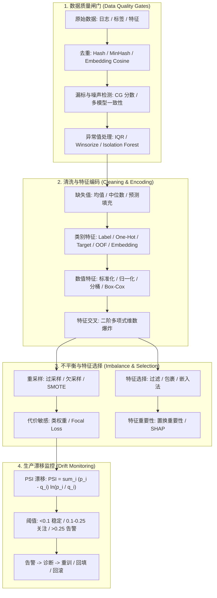

# 🌐 MLE 数据与特征工程：质量管线、编码策略、不平衡处理、特征选择与漂移检测

> **核心摘要**：模型的性能在训练开始之前就已注定——它由数据质量与特征工程决定。本指南覆盖 MLE 数据管线的完整闭环：数据质量四大威胁（漏标、噪声、重复、异常值）与清洗管线、缺失值填充策略对比、类别特征编码（Label / One-Hot / Target / OOF / Embedding）与防泄漏、数值特征变换（标准化、归一化、分桶、Box-Cox）、多项式特征交叉与维数爆炸、类别不平衡处理（重采样、SMOTE、代价敏感学习、指标选型）、特征选择（过滤 / 包裹 / 嵌入法）与置换重要性 / SHAP、以及生产环境基于 PSI 的漂移监控。

---

## 💡 交互式 Mermaid 架构流程图



---

## 💡 经典面试追问与考点速查

### 考点 1：请完整描述你的数据质量管线：如何发现并处理漏标、噪声与重复样本？
* **标准回答**：采用分层管线——便宜启发式在前、昂贵检查在后。(1) **去重**：精确重复用 SHA-1 哈希；近似重复用 MinHash/SimHash 或嵌入余弦相似度 $\cos(\mathbf{e}_i, \mathbf{e}_j) = \frac{\mathbf{e}_i \cdot \mathbf{e}_j}{\|\mathbf{e}_i\|\|\mathbf{e}_j\|} > 0.9$。(2) **漏标检测**：训练集成模型，对交叉预测不一致且置信度低的样本标记可疑，或用 Complexity Gap (CG) 等标签噪声分数筛查，最后按分层抽样交人工审核。(3) **噪声与异常值**：IQR 规则、z-score 或 Isolation Forest 定位后，在删除、截尾 (Winsorize) 与降权之间按影响面决策。核心原则：所有变换只在训练集上拟合，且去重需同时针对验证/测试集，防止污染。

> 💡 **直观理解**：数据质量管线像机场安检——便宜的检查在前、昂贵的检查在后。哈希去重是"查身份证"（几毫秒），嵌入相似度是"人脸比对"（贵但能抓近似重复），人工审核是最后的"开箱检查"（最贵，只抽检）。
>
> 🎤 **面试速答**："结论：分层管线——便宜启发式在前，昂贵检查在后。原理：精确重复用 SHA-1 哈希，近似重复用 MinHash/嵌入余弦 >0.9；漏标用集成交叉预测不一致 + CG 分数筛查，分层抽样交人工；噪声异常用 IQR/z-score/Isolation Forest 定位后按影响面删除、截尾或降权。例子：100 万条日志，SHA-1 去重先砍掉 20% 重复；再对剩余样本跑嵌入相似度找近似重复。铁律：所有变换只在训练集拟合，去重同时作用于验证/测试集。"

### 考点 2：均值/中位数/基于模型预测填充缺失值各有什么优劣？何时选哪种？
* **标准回答**：均值填充 $\hat{x}_i = \frac{1}{n} \sum_j x_j$ 最快但收缩方差、忽略特征相关性且在偏态分布下扭曲分布；中位数对异常值稳健但同样忽略结构；预测填充（KNN、MICE 或用 GBDT 以其余特征回归缺失列）保留相关性、偏差最低，但成本高，且**必须放在每个交叉验证折内拟合**，否则验证信息泄漏进训练。任何情况下都建议附加一列缺失指示位 (Missingness Indicator)，让模型自己学习"缺失"模式；严禁在切分前于全量数据上计算填充统计量。

> 💡 **直观理解**：均值填充像"全班平均分代替缺考成绩"——快，但把所有人都拉向平均值，抹掉了个体差异（收缩方差）；中位数对满分/零分这种极端值免疫；预测填充像"根据同桌的成绩猜缺考分"，保留了相关性但贵。缺失本身可能携带信息——所以加一个"是否缺失"的指示列让模型自己学。
>
> 🎤 **面试速答**："结论：低缺失随机缺失用统计量（偏态中位数、对称均值），缺失与其它特征相关时用预测填充，永远附加缺失指示列。原理：均值填充最快但收缩方差、忽略相关；中位数稳健但同样忽略结构；预测填充（KNN/MICE/GBDT）偏差最低但必须**在每折内拟合**，否则验证信息泄漏。例子：收入特征 30% 缺失且与教育程度相关，用 GBDT 以其余特征回归填充，比均值填充的模型 AUC 高 2 个点。铁律：切分前全量计算填充统计量 = 最隐蔽的数据泄漏。"

### 考点 3：解释 OOF Target Encoding 的原理及为何能防止目标泄漏？高基数类别下它与 One-Hot 如何取舍？
* **标准回答**：Target Encoding 将类别 $c$ 替换为该类别内目标均值 $\bar{y}_c = \frac{1}{n_c} \sum_{i \in c} y_i$。朴素实现下样本自身标签参与自身特征，构成极端自环泄漏。OOF (Out-of-Fold) 编码把训练集切为 $K$ 折，对第 $k$ 折只用其余 $K-1$ 折计算 $\bar{y}_c^{(k)} = \text{mean}(y \mid c, \text{folds} \neq k)$ 再映射回来，从结构上消除自环。测试集使用全量平滑统计 $\hat{y}_c = \frac{n_c \bar{y}_c + \lambda p}{n_c + \lambda}$（$p$ 为先验、$\lambda$ 为平滑系数）。One-Hot 需要 $K$ 列，面对 1000 万级 Merchant ID 等超高基数特征维度爆炸；OOF Target Encoding 只占一列且保留信号。

> 💡 **直观理解**：Target Encoding 把"类别"翻译成"这类样本历史上有多大概率是正类"——例如"城市=上海"直接变成一个数。但朴素版本是作弊：自己的标签参与了自身特征的计算（自环泄漏），模型会直接背下答案。OOF 就是"让其他 4 折的同伴投票"，自己的标签永不参与自己特征的构造。
>
> 🎤 **面试速答**："结论：高基数类别用 OOF Target Encoding——一列代替 K 列，结构上无泄漏。原理：对第 k 折只用其余 K−1 折计算类别均值 ȳ_c^(k) 再映射回来，测试集用平滑统计 ŷ_c = (n_c·ȳ_c + λp)/(n_c + λ)（p 先验、λ 平滑系数）。例子：1,000 万 Merchant ID 用 One-Hot 要 1000 万列，OOF 只有 1 列且保留 CTR 信号。追问点：稀有类别 n_c 小时统计不稳，平滑系数 λ=20 把它拉回全局先验，防止小样本类别被编码成极端 0/1。"

### 考点 4：面对 1:1000 的极端不平衡（如反欺诈），如何选择重采样、SMOTE 与代价敏感学习？
* **标准回答**：三层协同攻击。**数据层**：随机欠采样丢弃多数类（便宜但损失信息）；SMOTE 在少数类样本与其 k 近邻之间线性插值生成合成样本 $x_{\text{new}} = x_i + \delta \cdot (x_{\text{nn}} - x_i)$，$\delta \sim U(0,1)$。**损失层**：类权重 $w_c = \frac{N}{n_c}$ 抬高稀有类贡献；Focal Loss $\mathcal{L} = -\alpha (1 - p_t)^\gamma \log p_t$ 压低易分样本权重，把训练火力集中到困难少数类。**决策层**：绝不默认阈值 0.5，而是在 PR 曲线上调优判决阈值。指标必须从 Accuracy 切换为 PR-AUC 与 MCC，并全程使用 Stratified CV。

> 💡 **直观理解**：1:1000 的数据里，全猜"不是欺诈"就 99.9% 准——Accuracy 是摆设。SMOTE 的直觉是"在少数类样本和它的近邻之间捏造新样本"（线性插值），像给稀有品种"繁殖"；Focal Loss 的直觉是"已经答对的题不复习，专攻错题"。
>
> 🎤 **面试速答**："结论：数据层（欠采样/SMOTE）+ 损失层（类权重/Focal Loss）+ 决策层（PR 曲线上调阈值）三层协同。原理：SMOTE 在 x_i 与近邻 x_nn 之间插值 x_new = x_i + δ(x_nn − x_i)，δ~U(0,1)；类权重 w_c = N/n_c 抬高稀有类梯度；Focal Loss 压低易分样本权重；阈值绝不默认 0.5。例子：1:1000 欺诈，SMOTE 把正类从 1000 条扩到 5 万条，配合 w=1000 的类权重与阈值 0.1，召回率从 30% 到 70% 而精确率只降 5%。度量：PR-AUC + MCC + Stratified CV。"

### 考点 5：什么是 PSI？如何搭建生产环境的特征漂移监控体系？
* **标准回答**：Population Stability Index (群体稳定性指数) 度量特征分布在参考窗口（训练期）与当前生产窗口之间的偏移程度。将特征划分为 $B$ 个分箱后计算 $\text{PSI} = \sum_{i=1}^{B} (p_i - q_i) \ln \frac{p_i}{q_i}$（$p_i$、$q_i$ 分别为当前与参考比例）。PSI < 0.1 稳定；0.1–0.25 需排查；> 0.25 触发告警。生产设计：每日批处理任务计算每个特征的 PSI（固定参考窗 vs 滚动窗），阈值触发告警接入监控大盘，同一套机制同时监控分数分布与标签分布；告警后按特征下钻诊断，决定回填、重训或回滚。

> 💡 **直观理解**：PSI 是"两个分布长得像不像"的量化——把训练期和当前期的特征各切成 10 格，比较每一格的人群占比差了多少。特征从"上海 30%"漂移到"上海 50%"，PSI 就会飙升。它像体温计：<0.1 正常，0.1–0.25 低烧，>0.25 高烧必须处理。
>
> 🎤 **面试速答**："结论：用 PSI 逐特征监控分布漂移，阈值 <0.1 稳定、0.1–0.25 排查、>0.25 告警。原理：PSI = Σ(p_i − q_i)·ln(p_i/q_i)，p 参考期比例、q 当前期比例，10 个分位箱；告警后下钻诊断决定回填/重训/回滚。例子：风控模型上线后"设备指纹"特征 PSI 从 0.05 涨到 0.6，排查发现爬虫改了 User-Agent——特征分布变了但标签关系没变，属数据漂移，重训即可。注意：PSI 是单变量检查，需配合基于模型的检测器抓多变量协同漂移。"

---

## 📚 第一章：数据质量与清洗管线 (Data Quality & Cleaning Pipeline)

### 1.1 数据质量的四大威胁

| 威胁 | 检测信号 | 典型处理 |
| :--- | :--- | :--- |
| **漏标 (Mislabeled)** | 集成置信度低、CG 分数高、人工审核 | 重标注、删除或降权；Confidence Learning |
| **噪声 (Noisy)** | 异常统计、信息熵 $H(x) = -\sum_i p_i \log p_i$、困惑度 | 过滤、截尾或平滑 |
| **重复 (Duplicated)** | SHA-1 精确哈希；MinHash/SimHash；嵌入余弦 $> 0.9$ | 去重保留规范副本或降权 |
| **异常值 (Outlier)** | IQR 规则、z-score、Isolation Forest | 先评估影响再删除或截尾 |

> **怎么读这张表**：竖着背"威胁 → 信号 → 处理"三列是一套完整答案；面试时按"检测信号"列讲方法、按"典型处理"列讲落地。最常考的对比是 **重复 vs 异常值**：重复靠哈希/相似度，异常靠统计分布。

重复样本会悄悄膨胀数据集规模、扭曲类别分布并污染离线指标；漏标迫使模型用容量去记忆噪声而非学习结构，恰好浪费了扩展定律本可转化为精度的算力。

> 💡 **直观理解**：四大威胁各打一个弱点——重复样本偷偷把数据集"灌水"，让类别分布失真；漏标让模型拿容量去背错误答案；噪声让模型把巧合当规律；异常值在距离类模型（kNN/线性）里一颗老鼠屎坏一锅汤。检测成本从毫秒级哈希到人工审核逐级上升，所以管线要"便宜在前、昂贵在后"。
>
> 🎤 **面试速答**："结论：四大威胁——漏标、噪声、重复、异常值，用分层管线处理。原理：重复用 SHA-1/MinHash/嵌入余弦检测；漏标用集成交叉预测 + CG 分数筛查后人工抽审；噪声用熵/困惑度定位后过滤或平滑；异常值用 IQR/z-score/Isolation Forest 定位后按影响面删除或截尾。例子：嵌入余弦 >0.9 判定近似重复（两句同义新闻标题只留一条）；Isolation Forest 从 1,000 万样本里标出 2% 异常，先看影响面再决定是否 Winsorize。核心原则：所有变换只在训练集上拟合。"

### 1.2 缺失值填充策略对比

| 策略 | 机制 | 优势 | 劣势 |
| :--- | :--- | :--- | :--- |
| **均值填充** | $\hat{x}_i = \frac{1}{n}\sum_j x_j$ | 最快、最简单 | 收缩方差、忽略相关、偏态下失真 |
| **中位数填充** | $\text{median}(x)$ | 对异常值稳健 | 同样忽略相关性与结构 |
| **预测填充** | KNN / MICE / GBDT 用其余特征回归缺失列 | 保留相关性、偏差最低 | 成本高；有泄漏风险——必须在每折内拟合 |

> **怎么读这张表**：沿"成本"列从低到高读——均值 → 中位数 → 预测填充，成本递增、偏差递减；面试回答"何时选哪种"就按这个梯度选。左下角"必须在每折内拟合"是全表最重要的一个词。

工业界默认顺序：缺失率低且随机时用廉价统计量（偏态用中位数、对称用均值）；缺失与其它特征相关、缺失本身携带信息时用预测填充；**始终**附加缺失指示列，让模型自行学习"缺失"模式。严禁在切分前于全量数据上计算填充统计量——这是最隐蔽的数据泄漏形式。

> 💡 **直观理解**：缺失值有三种"人设"——随机失踪（MCAR，填谁都行）、看脸失踪（MAR，和其他特征相关）、不看脸失踪（MNAR，和缺失本身相关）。填什么取决于缺失"为什么发生"，这就是预测填充和缺失指示列的用武之地。
>
> 🎤 **面试速答**："结论：低缺失随机缺失用廉价统计量，与其它特征相关用预测填充，永远附加缺失指示列。原理：均值填充把分布压向均值、忽略相关性；中位数对异常稳健但同样忽略结构；预测填充保留相关性、偏差最低，但必须在每个 CV 折内拟合。例子：收入缺失 30% 且与教育程度相关，用 GBDT 以其余 5 个特征回归收入，比均值填充 AUC 高约 2 个点；再加一列 is_missing 让模型学到"收入缺失的用户更容易流失"。铁律：切分前全量计算填充统计量是最隐蔽的数据泄漏。"

### 1.3 异常值处理

经典 IQR 规则：当 $x < Q_1 - 1.5 \cdot \text{IQR}$ 或 $x > Q_3 + 1.5 \cdot \text{IQR}$ 时标记为异常值，其中 $\text{IQR} = Q_3 - Q_1$。处理选项：仅当可证明是错误数据时删除；**截尾 (Winsorize)**——裁剪到 $q$ 与 $(1-q)$ 分位数限制影响力；或使用**稳健缩放器** $\frac{x - \text{median}}{\text{IQR}}$ 使变换本身抗异常。树模型几乎不受异常值影响，而线性模型、神经网络与 kNN 对异常值极其敏感——动手做异常值手术前先确认模型家族。

> 💡 **直观理解**：异常值处理要先问"模型怕不怕"——树模型按分裂点工作，一个 10 万和一群 100 差别不大；但线性模型/kNN 算距离和均值，一个 10 万能把整条线拉歪。IQR 的 1.5 倍规则就是"把离群 25% 分位点 1.5 倍箱距以外的点标出来"。
>
> 🎤 **面试速答**："结论：先确认模型家族，再做异常值手术。原理：IQR 规则 x < Q1 − 1.5·IQR 或 x > Q3 + 1.5·IQR 标记异常；选项：证明是错误数据才删、Winsorize 截尾到 q/(1−q) 分位、或用稳健缩放 (x−median)/IQR 让变换本身抗异常。例子：交易金额 99% 在 0–500 元，一条 50,000 元——线性模型会被拉偏，Winsorize 到 99 分位（约 1,200 元）后模型恢复稳定；同一个特征喂 LightGBM 则完全不用管。原则：删除只用于可证明的错误数据。"

---

## 📚 第二章：特征编码与数值变换 (Feature Encoding & Transformation)

### 2.1 类别特征编码对比

| 方法 | 机制 | 优势 | 劣势 |
| :--- | :--- | :--- | :--- |
| **Label 编码** | $c \mapsto \text{整数}$ | 内存占用极小 | 强加虚假的序数关系 |
| **One-Hot** | $c \mapsto \mathbf{e}_k \in \{0,1\}^K$ | 无序偏置、线性模型友好 | $K$ 列；高基数下稀疏爆炸 |
| **Target 编码** | $\bar{y}_c = \frac{1}{n_c}\sum_{i \in c} y_i$ | 紧凑、预测力强 | 无 OOF 机制时严重泄漏 |
| **OOF Target** | $\bar{y}_c^{(k)} = \text{mean}(y \mid c, \text{folds} \neq k)$ | 结构上无泄漏 | 需要严谨 CV；稀有类别需平滑 |
| **Embedding** | $c \mapsto \text{Lookup}(W_c)$，$W$ 端到端学习 | 稠密、对未见 ID 有泛化 | 需要训练神经网络与调参 |

> **怎么读这张表**：横着读"机制 → 优劣"是一条完整逻辑链。记忆锚点：Label 强加序数（苹果>香蕉>橙子是胡扯）、One-Hot 高基数爆炸、Target 有泄漏需 OOF 救场、Embedding 最强但要训练。面试主推 **OOF Target** 作为高基数 + 表格模型的默认解。

铁律贯穿始终：任何统计量（填充器、缩放器、编码器）都必须在 `train_fold` 上 `fit`、仅在 `val_fold` 上 `transform`——在切分前于全量数据上计算就是目标泄漏，这是面试第一大陷阱，也是生产第一大杀手。

> 💡 **直观理解**：编码的本质是"把类别翻译成模型听得懂的语言"。One-Hot 是"按编号开开关"——但 1,000 万个商户就有 1,000 万个开关；Target 编码是"这个类别历史上有多大概率正类"——紧凑但容易作弊；OOF 就是"只让其他 4 折投票"，结构上消灭作弊。
>
> 🎤 **面试速答**："结论：编码选型看基数与模型——低基数有序用 Label、低基数无序用 One-Hot、高基数表格模型用 OOF Target、深度模型用 Embedding。原理：Label 强加序数关系；One-Hot 列数=类别数，高基数稀疏爆炸；Target 一列但朴素实现有自环泄漏；OOF 用其他折算均值 ȳ_c^(k) 消除自环。例子：国家（200 类）用 One-Hot 200 列没问题，Merchant ID（1,000 万类）必须 OOF Target 或 Embedding。铁律：任何统计量只在 train_fold 上 fit。"

### 2.2 数值特征变换

* **标准化 (Standardization)**：$z = \frac{x - \mu}{\sigma}$——无界、零均值、单位方差；线性模型、SVM、kNN、神经网络的默认选择。
* **Min-Max 归一化**：$x' = \frac{x - x_{\min}}{x_{\max} - x_{\min}}$——压缩到 $[0, 1]$，但对异常值敏感。
* **分桶 (Binning)**：等宽、等频或分位数分桶，帮助线性模型逼近非线性；树模型内部天然离散化，分桶对它们通常无增益。
* **Box-Cox / 幂变换**：对严格为正的偏态特征，$y^{(\lambda)} = \frac{x^{\lambda} - 1}{\lambda}$（$\lambda \neq 0$），$y^{(0)} = \ln x$；$\lambda$ 由极大似然选定以最大化正态性。对数变换（$\lambda = 0$）是 CTR、价格、计数等右偏分布最常用的一招。

> 💡 **直观理解**：变换的本质是"让数据长成模型喜欢的样子"。线性模型喜欢"每个特征方差量级差不多、没有长尾"——标准化是"统一尺子"（z 分），Box-Cox 是"把右偏的长尾巴往中间捋直"。而树模型只关心分裂点顺序，这些变换对它几乎无意义。
>
> 🎤 **面试速答**："结论：距离类模型（线性/SVM/kNN/NN）需要标准化，右偏特征用对数/Box-Cox，树模型不需要预处理。原理：标准化 z=(x−μ)/σ 让特征同尺度，否则量级大的特征主导距离与梯度；Box-Cox y^(λ)=(x^λ−1)/λ 由 MLE 选 λ 最大化正态性，λ=0 即对数变换。例子：收入特征偏态系数 8.7，log 变换后降到 0.3，kNN 的 AUC 提升 3 个点。反例：LightGBM 对同一特征做不做标准化结果几乎一样。注意 Min-Max 对异常值敏感，改用稳健缩放。"

### 2.3 特征交叉与多项式特征

线性模型"参数线性"但"特征不必线性"：基函数扩展 $\phi(x) = [1, x_1, x_2, x_1^2, x_2^2, x_1 x_2]^T$ 后，$y = w^T \phi(x)$ 依旧可用 OLS 求解，同时捕捉曲率与交互。代价是**组合爆炸**：$d$ 个特征做 $p$ 阶多项式会生成 $\binom{d + p}{p}$ 项——100 个特征的二阶多项式产生 5,151 列。控制手段：只对少量高价值组合做交叉（如 `user × item` 类别交叉）、度数封顶为 2，或干脆让树模型 / 因子分解机隐式学习交互，而非全部物化。

> 💡 **直观理解**：特征交叉是"1+1>2"——"男性"和"运动鞋"单独看都没用，组合起来是强信号。多项式展开就是穷举所有组合，代价是组合爆炸：100 个特征的二阶多项式有 C(102,2)=5,151 列。工业界的做法是"只交叉精挑的组合"或"让模型隐式学习交互"。
>
> 🎤 **面试速答**："结论：交叉特征要精选而非穷举——线性模型显式造、树/FM 隐式学。原理：基函数扩展 φ(x)=[1,x1,x2,x1²,x2²,x1x2] 后 y=wᵀφ(x) 仍是线性可解，但 d 个特征 p 阶多项式生成 C(d+p, p) 项。例子：100 个特征二阶多项式 = 5,151 列，训练慢且过拟合；只对 user×item 这种业务高价值组合做交叉，或直接上 FM 让因子交互自动学。追问：DeepFM 的 FM 层正是用内积学二阶交叉，DCN 用跨网络学高阶交叉。"

---

## 📚 第三章：不平衡处理、特征选择与生产监控

### 3.1 类别不平衡：三层攻击

* **数据层**：随机过采样（复制导致过拟合风险）、随机欠采样（便宜但丢信号）、**SMOTE** 沿样本到某近邻的线段插值生成合成样本 $x_{\text{new}} = x_i + \delta \cdot (x_{\text{nn}} - x_i)$，$\delta \sim U(0,1)$；变体（Borderline-SMOTE、SMOTE-Tomek）针对决策边界优化。
* **损失层**：类权重 $w_c = \frac{N}{n_c}$ 重平衡目标函数；Focal Loss $\mathcal{L} = -\alpha(1 - p_t)^\gamma \log p_t$ 压低置信正确样本的权重，让训练集中到困难的少数类尾部。
* **决策与指标层**：1:1000 下 Accuracy 毫无意义——改用对稀有正类敏感的 **PR-AUC**、调优阈值后的 F1 与 MCC；ROC-AUC 在稀有类上过于乐观。全程配合 Stratified CV。

> 💡 **直观理解**：1:999 的数据里"全猜多数类"就是 99.9% 准——所以不平衡的第一战场不是模型而是指标。三层攻击像三路兵马：数据层改兵员比例（采样），损失层改奖惩（类权重/Focal Loss），决策层改过关线（阈值）。
>
> 🎤 **面试速答**："结论：数据层 + 损失层 + 决策层三层协同，指标切 PR-AUC。原理：SMOTE 在 x_i 与近邻 x_nn 间插值 x_new = x_i + δ(x_nn − x_i)；类权重 w_c=N/n_c 与 Focal Loss 重配梯度；阈值在 PR 曲线上调优。例子：1:1000 欺诈数据，SMOTE 合成正类 + 类权重 1000 + 阈值从 0.5 调到 0.1，召回率 30%→70%、精确率只降 5%。追问：ROC-AUC 在 1:1000 下可能 0.95 但 PR-AUC 只有 0.1，前者虚高——所以全程用 PR-AUC + MCC 度量。"

### 3.2 特征选择与特征重要性

| 家族 | 方法 | 优势 | 劣势 |
| :--- | :--- | :--- | :--- |
| **过滤法 (Filter)** | 相关系数、互信息、方差阈值 | 快、与模型无关 | 忽略特征交互 |
| **包裹法 (Wrapper)** | 前向/后向选择、RFE | 直接优化目标指标 | 计算昂贵、易过拟合 |
| **嵌入法 (Embedded)** | L1 (Lasso) 稀疏化、树分裂重要性 | 训练内建、高效 | 树模型偏向高基数特征 |

> **怎么读这张表**：按"计算成本"从低到高记忆——Filter（跑一遍统计）< Embedded（训练自带）< Wrapper（反复训练）。面试常考点：为什么优先置换重要性而非树原生重要性——原生重要性看分裂频次，置换重要性看真实预测贡献。

嵌入法 L1 求解 $\min_w \|y - Xw\|^2 + \lambda \|w\|_1$，把小权重精确压为 0，天然完成自动特征选择。需要重要性时，优先**置换重要性**——打乱特征 $j$ 的取值并度量指标下降 $\text{PI}_j = \mathcal{M}(D) - \frac{1}{K}\sum_k \mathcal{M}(D_j^{(k)})$——而非原始树重要性，因为它反映真实预测贡献而非分裂频次。**SHAP** 在其上叠加逐样本局部归因，是审计与调试工作流真正消费的东西。

> 💡 **直观理解**：特征重要性回答"这个特征有没有用"——但树原生重要性看的是"它被分裂了多少次"，高频分裂不等于真贡献（高基数特征天然占便宜）。置换重要性是"把特征打乱再看掉多少分"的暴力实验：打乱后分数暴跌 → 真重要。SHAP 在此基础上再给每个样本算一笔"贡献账"。
>
> 🎤 **面试速答**："结论：三族方法——Filter 快但忽略交互、Wrapper 直接但贵、Embedded 高效但树偏向高基数；重要性优先用置换重要性 + SHAP。原理：置换重要性打乱特征 j 后度量指标下降 PI_j = M(D) − (1/K)ΣM(D_j^(k))，反映真实预测贡献；SHAP 是逐样本局部归因。例子：高基数 ID 特征在树里被分裂 1 万次、置换后指标几乎不掉——删掉它；而"距上次购买天数"只分裂 200 次但置换后 AUC 掉 8 个点——它是真功臣。审计工作流消费的是 SHAP 的逐样本解释。"

### 3.3 漂移检测与 PSI

$$\text{PSI} = \sum_{i=1}^{B} (p_i - q_i) \cdot \ln \frac{p_i}{q_i}$$

其中 $p_i$ 为参考（训练期）比例、$q_i$ 为当前生产比例在第 $i$ 个分箱（常用 10 个分位箱）中的取值。

| PSI 区间 | 含义 | 动作 |
| :--- | :--- | :--- |
| $\text{PSI} < 0.1$ | 稳定 | 无需处理 |
| $0.1 \le \text{PSI} < 0.25$ | 中度偏移 | 分段下钻排查 |
| $\text{PSI} \ge 0.25$ | 严重漂移 | 告警 → 诊断 → 重训 / 回填 / 回滚 |

> **怎么读这张表**：这是面试必背的三档阈值——0.1 以下安心、0.1–0.25 排查、0.25 以上动手。配合"动作"列讲出完整闭环：告警 → 诊断 → 重训/回填/回滚，就是一道完整漂移监控题的答案骨架。

生产实现：每日批处理任务计算每个特征在固定参考窗与滚动窗之间的 PSI，阈值触发告警接入监控大盘，同一机制同时监控分数分布与标签分布。PSI 是单变量检查——需配合基于模型的漂移检测器，才能捕捉单变量检查漏掉的多变量协同漂移。

> 💡 **直观理解**：PSI 像"体温计"——量单特征的分布偏移：训练期 30% 上海 vs 现在 50% 上海，差值算进公式就会报警。但体温计只能量发烧不能诊断病因，所以要配"医生"——基于模型的检测器抓特征之间的协同漂移。
>
> 🎤 **面试速答**："结论：逐特征 PSI + 阈值告警 + 模型级检测器，三层监控体系。原理：PSI = Σ(p_i − q_i)·ln(p_i/q_i) 比较参考窗与滚动窗的比例，10 分位箱；<0.1 稳定、0.1–0.25 排查、>0.25 告警。例子：推荐模型上线 3 个月，"用户城市"特征 PSI 从 0.04 涨到 0.31，下钻发现新版本 App 改了埋点导致城市字段缺失率飙升——回填数据而非重训。追问：PSI 是单变量检查，两个特征各自稳定但相关性破裂时它看不见，需模型级漂移检测兜底。"

---

## 🐍 Pure Numpy 实现：OOF Target Encoding

```python
import numpy as np

def oof_target_encoding(cat, y, n_folds=5, smoothing=20.0, seed=42):
    """Pure Numpy 5 折 Out-of-Fold Target Encoding（无泄漏）。

    对第 k 折，类别统计量只在其余 n_folds - 1 折上计算并映射回来，
    样本自身标签永远不会参与自身特征值的计算。返回：
      train_encoded : 训练集每一行的 OOF 编码值
      enc_test      : 全量平滑后的全局映射 (cat_id -> value)，用于测试/推理
    """
    n = len(y)
    rng = np.random.RandomState(seed)
    fold = rng.permutation(n) % n_folds          # 每个样本的折号
    prior = float(y.mean())                      # 全局目标均值
    n_cat = int(cat.max()) + 1
    train_encoded = np.zeros(n)

    for k in range(n_folds):
        trn_mask = fold != k
        val_mask = fold == k
        cat_trn = cat[trn_mask]

        counts = np.bincount(cat_trn, minlength=n_cat)
        sums = np.bincount(cat_trn, weights=y[trn_mask], minlength=n_cat)
        means = sums / np.maximum(counts, 1)
        shrink = counts / (counts + smoothing)   # 向先验平滑
        enc = shrink * means + (1.0 - shrink) * prior
        train_encoded[val_mask] = enc[cat[val_mask]]

    # 全量平滑编码，供测试集使用（仅在训练行上拟合）
    counts = np.bincount(cat, minlength=n_cat)
    sums = np.bincount(cat, weights=y, minlength=n_cat)
    means = sums / np.maximum(counts, 1)
    shrink = counts / (counts + smoothing)
    enc_test = shrink * means + (1.0 - shrink) * prior
    return train_encoded, enc_test


if __name__ == "__main__":
    rng = np.random.RandomState(7)
    n = 1000
    cat = rng.randint(0, 50, size=n)             # 50 个类别（高基数）
    y = ((rng.rand(n) + 0.3 * (cat % 3 == 0)) > 0.5).astype(float)

    enc_train, enc_test = oof_target_encoding(cat, y, n_folds=5, smoothing=20)
    assert not np.isnan(enc_train).any()
    assert np.max(np.abs(enc_train - y)) > 0.1   # 平滑后不等于原始标签
    print("Pure Numpy OOF Target Encoding Complete!")
    print("Train encoded shape:", enc_train.shape)
    print("Global encoding of category 7: %.4f" % enc_test[7])
```

---

## 📝 总结与学习路线

1. **质量闸门先行**：去重（哈希 + MinHash）、漏标审核、异常值处理成本远低于它们所浪费的模型容量；噪声消耗的正是扩展定律本可转化为精度的算力。
2. **泄漏是第一大陷阱**：一切 Imputer、Scaler、Encoder 只能在 CV 折内拟合；OOF Target Encoding 是高基数类别特征的规范解法。
3. **变换匹配模型家族**：树模型几乎不需要预处理；线性模型需要缩放；重度偏态需要 Box-Cox/对数变换；交互特征要精选而非穷举。
4. **不平衡先换指标**：切到 PR-AUC + MCC、使用 Stratified CV，再决定重采样、SMOTE 或代价敏感损失。
5. **默认漂移会发生，逐日监控**：对每个特征计算 PSI 并配置告警阈值，让模型响亮而尽早地失败，而不是悄然退化。
