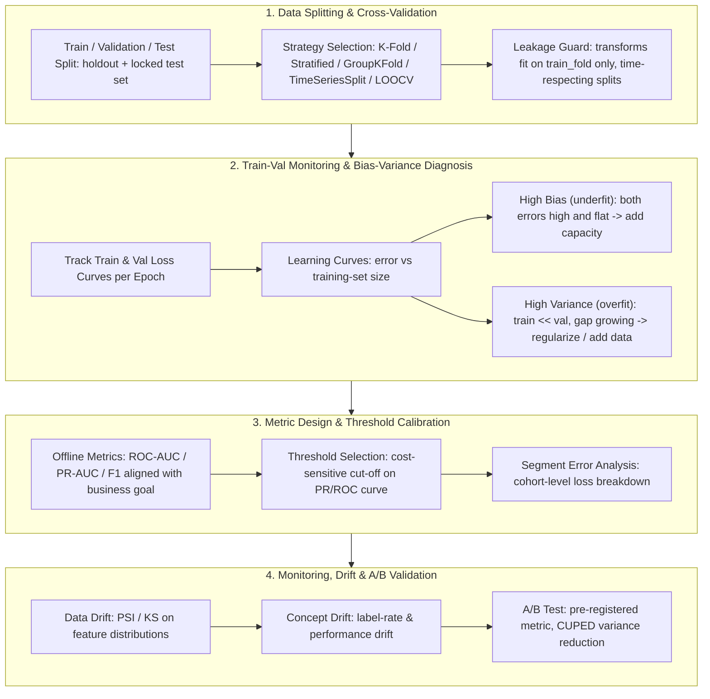

# 🔍 MLE Model Evaluation & Debugging Engineering: CV Strategies, Data Leakage, Bias-Variance Diagnosis, Drift & A/B Validation

> **Core Executive Summary**: A model is only as good as the evaluation loop that validates it. This guide builds the complete evaluation-and-debugging engineering pipeline for MLE interviews and production: how to split data and choose the right cross-validation strategy (K-Fold vs Stratified vs GroupKFold vs TimeSeriesSplit vs LOOCV), how data leakage silently inflates every offline metric, how to systematically diagnose high bias vs high variance from train/val loss curves and learning curves, how to reconcile offline metrics with business metrics (PR vs ROC, threshold selection), and finally how to monitor production models for data/concept drift and validate every launch with an A/B test.

---

## 💡 Interactive Mermaid Architecture Flowchart



---

## 💡 Classic Interview Followups & Core Cheatsheet

* **Key Topic 1**: Compare K-Fold, Stratified K-Fold, GroupKFold, TimeSeriesSplit, and Leave-One-Out CV — which scenarios call for each?
  * *Standard Answer*: K-Fold randomly partitions data into $K$ equal folds, giving a low-bias, low-variance error estimate but breaking temporal order. Stratified K-Fold preserves class ratios per fold — mandatory for imbalanced classification. GroupKFold keeps all samples of the same group (user, merchant, image) inside one fold, preventing group-level leakage. TimeSeriesSplit respects $t_{\text{train}} < t_{\text{val}}$ with an expanding window — the only valid choice for temporal data. LOOCV trains on $n-1$ samples, near-unbiased but $\mathcal{O}(n)$ training cost and high variance for correlated data. Selection rule: temporal data never random, imbalanced data never unstratified, grouped data never ungrouped.

> 💡 **Intuition**: Choosing a CV strategy is about simulating the real-world exam environment — random splits on time series let the model 'see the future'; unstratified splits on imbalanced data can give a validation fold with zero positives; ungrouped splits on grouped data 'leak the exam' when the same user appears in both train and validation. Pick the wrong splitter and the offline metric is a self-deceiving drill.
>
> 🎤 **30-Second Answer**: "Conclusion: five strategies, five scenarios — K-Fold for i.i.d., Stratified for imbalanced, GroupKFold for grouped, TimeSeriesSplit for temporal, LOOCV for tiny data. Mechanism: Stratified preserves class ratios per fold; GroupKFold keeps groups intact; TimeSeriesSplit enforces t_train < t_val; LOOCV is near-unbiased but needs n fits. Example: on 1:1000 fraud data, random K-Fold can hand a fold zero positives and the metric swings wildly — Stratified K-Fold stabilizes it immediately. Iron rule: temporal never random, imbalanced never unstratified, grouped never ungrouped."

* **Key Topic 2**: Both train and validation error high vs train error low but validation error high — how do the diagnoses and fixes differ?
  * *Standard Answer*: The two patterns are opposite ends of the bias-variance spectrum. **High bias (underfitting)**: both curves plateau high and converge. Fixes: more features/capacity, longer training, fewer constraints — the model lacks expressiveness. **High variance (overfitting)**: train error keeps dropping while validation error rises or plateaus with a widening gap. Fixes: regularization, more data, dropout, early stopping, feature pruning. Learning curves disambiguate: if train error rises and val error falls as training size grows, the model is variance-dominated.

> 💡 **Intuition**: Bias and variance are 'not learning enough' vs 'memorizing too hard' — both curves high and flat means the model can't learn (underfit, like an unprepared student); train hugging zero with val high means it memorized the answers (overfit). Learning curves act as the prescription test: if val error keeps dropping as data grows, you're missing data; if both curves refuse to move, you're missing capacity.
>
> 🎤 **30-Second Answer**: "Conclusion: both curves high and flat = high bias → add capacity/features; train low and val high with a widening gap = high variance → regularize or add data. Mechanism: generalization error = Bias² + Variance + σ²; learning curves disambiguate — train error rising and val error falling as n grows means variance-dominated, so more data is the fix. Example: a GBDT at train AUC 0.99 / val 0.88 — tripling the data lifts val to 0.93, confirming variance-dominated; if the curves had refused to move, the move would be more features or a bigger model. Diagnose before you tune."

* **Key Topic 3**: What are the common types of data leakage, and how do you prevent them in cross-validation?
  * *Standard Answer*: Three families: (1) **target leakage** — a feature encodes information only known after the prediction event (e.g., a "days since last purchase" feature built from future labels); (2) **pipeline leakage** — scalers, imputers, and encoders `fit` on the full dataset, so validation folds see statistics computed on themselves (OOF target encoding structurally kills the self-loop); (3) **temporal leakage** — random K-Fold on time-series lets the model peek into the future. Prevention is structural: every transform is fitted inside the training fold only; splits respect groups and time; features are audited for causality before release.

> 💡 **Intuition**: Leakage has three MOs — target leakage 'knows the answer early' (features built from future information, e.g., a 'days since last purchase' feature computed from the purchase itself); pipeline leakage 'the exam proctor reads out the class average' (statistics computed on the full dataset so validation folds see themselves); temporal leakage 'peeking at tomorrow's paper' (random K-Fold on time series).
>
> 🎤 **30-Second Answer**: "Conclusion: three leakage families — target, pipeline, temporal — prevented structurally, not by luck. Mechanism: target leakage is a feature encoding info unknowable at prediction time; pipeline leakage is fitting scalers/imputers/encoders on full data (OOF encoding structurally kills the self-loop); temporal leakage is random K-Fold on time series. Example: building 'days since last purchase' from the purchase event itself gives offline AUC 0.99 and a production crash — the feature doesn't exist at scoring time. Fix: transforms fit inside train folds, splits respect groups and time, features are causality-audited before release."

* **Key Topic 4**: Why is PR-AUC preferred over ROC-AUC under class imbalance, and how do you pick the threshold?
  * *Standard Answer*: ROC-AUC plots TPR vs FPR, and FPR's denominator is dominated by the huge negative class, so AUC stays high even when the model destroys the rare positive class. PR-AUC conditions on predictions, measuring precision-recall on positives directly; its random baseline collapses to $\frac{N^+}{N^+ + N^-}$ as imbalance grows. Under >10:1 imbalance, report PR-AUC. Threshold selection is a cost problem: choose $\tau$ minimizing expected cost $\text{Cost}(\tau) = c_{FP} \cdot \text{FPR}(\tau) \cdot N^{-} + c_{FN} \cdot \text{FNR}(\tau) \cdot N^{+}$ — never default to 0.5.

> 💡 **Intuition**: ROC plots TPR vs FPR, and FPR's denominator is the huge negative class — at 99% negatives, FPR is tiny no matter what, so AUC inflates. PR-AUC puts the spotlight on positives; its random baseline collapses as imbalance grows. Threshold selection is a cost problem: letting a fraudster through (FN) and blocking an innocent customer (FP) have different prices — plug both into the formula and take the minimum, don't guess 0.5.
>
> 🎤 **30-Second Answer**: "Conclusion: past 10:1 imbalance report PR-AUC; the threshold is a cost optimization, never a 0.5 default. Mechanism: ROC's FPR is dominated by negatives, hiding bad performance on the rare class; PR-AUC measures precision-recall on positives directly. Optimal τ minimizes Cost(τ) = c_FP·FPR·N⁻ + c_FN·FNR·N⁺. Example: fraud where a missed fraud costs $1,000 and a false block costs $10 — a 100:1 cost ratio pushes the threshold to ~0.05, lifting recall from 30% to 75% while cutting total cost ~40%."

* **Key Topic 5**: Offline metrics look great but online performance degrades — how do you debug this? How do you distinguish concept drift from data drift, and where does A/B testing fit?
  * *Standard Answer*: First check the **val-test gap**: if the validation estimate was optimistic (leakage, wrong split, tiny validation set), the offline number was never real — re-audit the pipeline before touching the model. Then check **serving-training skew**: feature distribution shift at serving vs training (PSI / KS), label distribution shift (**concept drift**, $P(y|X)$ changed) vs input shift (**data drift**, $P(X)$ changed). Data drift → retrain on fresh data; concept drift → the input-output relationship itself changed, requiring re-labeling or model redesign. Finally, A/B testing is the only proof of business value — pre-register the metric, use CUPED for variance reduction.

> 💡 **Intuition**: Great offline, bad online is 'perfect on practice exams, failing the real one' — first check whether the practice paper itself was broken (val-test gap: leakage, bad split, tiny validation set), then whether the exam room differs from the practice room (serving-training skew). Distribution shift means 'the question style changed' (data drift); a changed label relationship means 'the syllabus changed' (concept drift).
>
> 🎤 **30-Second Answer**: "Conclusion: audit the val-test gap first, then distinguish data drift from concept drift, then prove value with an A/B test. Mechanism: data drift is P(X) changing (detect via PSI/KS) → retrain on fresh data; concept drift is P(y|X) changing (detect via label-rate shift) → relabel or redesign; an optimistic offline number usually comes from leakage or a broken split — fix the pipeline first. Example: a model's 'user city' feature jumps from PSI 0.05 to 0.6 — a new app version broke tracking, backfill and retrain; during COVID, the relationship 'willingness to travel → spend' itself changed — that's concept drift, collect new labels. Then A/B: pre-registered metrics + CUPED."

---

## 📚 Section 1: Data Splitting & Cross-Validation Strategies

### 1.1 The Role of the Three-Way Split

Always reserve three sets: **train** (fit the model), **validation** (model selection, hyperparameters, early stopping), and **test** (final, unbiased report, touched at most a few times). The test set must be locked: every decision made from test scores leaks test information into model selection, so repeated evaluation on test is itself a subtle form of leakage.

> 💡 **Intuition**: The three-way split is like practice tests, mock exams, and the college entrance exam — train is your daily practice, validation is the mock used to pick strategy and tune hyperparameters, test is the final exam reserved for the unbiased report (touch it at most a few times). Every decision made from test scores leaks test information into model selection.
>
> 🎤 **30-Second Answer**: "Conclusion: train fits, validation selects, test reports — and the test set must stay locked. Mechanism: validation drives hyperparameters/early stopping/model choice; test is touched only at the end. Example: evaluating on the same test set 50 times and keeping the best result overfits the report to the validation process — the final number is optimistic. Correct habit: lock the test set and tune with nested CV."

### 1.2 Cross-Validation Strategy Comparison

| Strategy | Split Logic | Bias / Variance | Valid When | Common Pitfall |
| :--- | :--- | :--- | :--- | :--- |
| **K-Fold** | Random $K$ equal folds | Low bias, moderate variance | i.i.d. data, ample size | Breaks temporal order |
| **Stratified K-Fold** | Class ratios preserved per fold | Same, balanced folds | Imbalanced classification | Pointless if leakage exists |
| **GroupKFold** | Groups never split across folds | Higher bias per fold | User/item/group-level data | Forgetting the `groups` parameter |
| **TimeSeriesSplit** | Expanding window, $t_{\text{train}} < t_{\text{val}}$ | Bias grows on short series | Any temporal data | Using `shuffle=True` |
| **LOOCV** | One sample held out per iteration | Low bias, high variance, $\mathcal{O}(n)$ fits | Small data (< few hundred) | Correlated samples inflate estimate |

> **How to read this table**: Start with the 'Split Logic' column to understand what each strategy does, then read 'Valid When' + 'Common Pitfall' horizontally. The three most-tested rows are Stratified (imbalance), TimeSeriesSplit (temporal), and GroupKFold (grouped) — whose classic pitfalls are hidden leakage, accidental `shuffle=True`, and forgetting the `groups` parameter.

The $K$-fold CV error estimate for model $\mathcal{A}$:

$$\widehat{\text{Err}}_{\text{CV}} = \frac{1}{K} \sum_{k=1}^{K} \frac{1}{|D_k|} \sum_{i \in D_k} \mathcal{L}\left(y_i, \hat{f}^{-k}(x_i)\right)$$

where $\hat{f}^{-k}$ is trained without fold $D_k$, and LOOCV is the special case $K = n$. Cross-validation is for **model checking, not model building** — after model selection, retrain the chosen model on all available data.

> 💡 **Intuition**: CV is a trial class, not a final exam — after the trial picks the best course, the real enrollment retrains on all data. Tuning repeatedly on the same validation set overfits the validation set itself; nested CV is 'a mock exam on top of the trial', ensuring the chosen model didn't get lucky on the validation fold.
>
> 🎤 **30-Second Answer**: "Conclusion: CV checks and selects models; the final model retrains on the full dataset; nested CV protects against overfitting the validation set. Mechanism: in nested CV the outer folds select the model while the inner folds tune hyperparameters, so the generalization estimate never touches tuning information. Example: outer 5-fold × inner 5-fold tuning max_depth — the outer fold's validation score comes from data the inner tuning never saw, giving an honest estimate. Often-missed point: the K models trained during CV are never used for real prediction."

---

## 📚 Section 2: Systematic Diagnosis of High Bias vs High Variance

### 2.1 The Two-Curve Diagnostic

The core debugging loop monitors training loss and validation loss every epoch. Decompose the gap:

$$\text{Err}_{\text{generalization}} = \underbrace{\text{Bias}^2}_{\text{both curves high}} + \underbrace{\text{Variance}}_{\text{train} \ll \text{val}} + \sigma^2$$

**Learning curves** (error vs training-set size) resolve ambiguity: variance-dominated models show train error rising and val error falling as $n$ grows — more data is the fix; bias-dominated models show both curves flat and high — adding data alone will not help.

> 💡 **Intuition**: The two-curve diagnostic is a stethoscope — train and validation loss are two heartbeats. Both high and parallel means the heart is weak (underfit); train flat on the floor with val climbing means the heart races (overfit). Learning curves validate the prescription: val dropping as data grows means you're short on data; curves refusing to move means you're short on capacity.
>
> 🎤 **30-Second Answer**: "Conclusion: both high and flat = bias-dominated → add capacity/features; train low, val high = variance-dominated → regularize or add data. Mechanism: generalization error = Bias² + Variance + σ² — both curves high means Bias² dominates, a wide gap means Variance dominates; learning curves disambiguate: train error rising and val error falling as n grows means more data works. Example: GBDT train AUC 0.99 / val 0.88; tripling the data lifts val to 0.93 — variance-dominated confirmed; if the curves had stayed flat, the answer would be more features, not more data."

### 2.2 Symptom-to-Action Decision Table

| Observation | Diagnosis | Debugging Action |
| :--- | :--- | :--- |
| Train & val error both high, flat | High bias (underfit) | Add features/capacity, more epochs, remove regularization |
| Train error near 0, val error high, gap growing | High variance (overfit) | Regularize, more data, early stop, simplify model |
| **Train-val gap small but val-test gap large** | Validation set overfit / split too small | Nested CV, larger or repeated validation splits |
| Train loss > val loss | Dropout/augmentation only in training; or leaky val split | Compare with dropout disabled; re-audit split |
| Error high on one segment/cohort | Segment underrepresentation or label noise | Cohort error analysis, rebalance, relabel |

> **How to read this table**: This is a symptom → diagnosis → action decision table; answer debugging questions by walking one row end to end. The row worth memorizing is the third: **small train-val gap but large val-test gap = overfitting the validation set** — the most easily missed silent failure mode.

### 2.3 Error Analysis & Cohort Debugging

Treat the dataset as several populations, not one: compute loss per segment (device, country, user tier) and per error type from the confusion matrix. If a segment is underrepresented in training, add data; if well-represented but still failing, inspect label noise; if it fails only in production, check drift. Sanity-first practice: before any tuning, overfit a single minibatch to near-zero loss to prove the architecture and data pipeline are bug-free.

> 💡 **Intuition**: Error analysis treats the dataset as several small worlds, not one — compute loss per segment (device, country, user tier) like a doctor checking departments one by one. The sanity check is 'prove the machine can turn first': force the model to drive a single batch's loss to near zero; if it can't, the algorithm or data pipeline has a bug and tuning is wasted time.
>
> 🎤 **30-Second Answer**: "Conclusion: cohort error analysis locates who fails; the sanity check proves the model can learn at all. Mechanism: per-cohort loss + confusion-matrix error breakdown; underrepresented cohorts → add data; well-represented but failing → inspect label noise; failing only in production → check drift. Example: overall AUC 0.92 but Android-segment AUC only 0.60 — investigation shows 40% missing features for Android users; fixing that lifts it to 0.88. Sanity: before any tuning, drive a single minibatch to loss ≈ 0 — eliminates 90% of pipeline bugs within an hour."

---

## 📚 Section 3: Evaluation Metric Design & Threshold Calibration

### 3.1 Offline Metrics vs Business Metrics

Offline metrics (AUC, F1) are proxies; business metrics (GMV, cost per acquisition, revenue lift) are ground truth. Every MLE project must define the metric map: which offline metric best predicts which business outcome, and pick a single-number optimization target for model comparison.

| Task | Offline Metric | Business Proxy | Operating Point |
| :--- | :--- | :--- | :--- |
| Fraud detection (rare positives) | PR-AUC | $Loss_{FN}$ vs $Loss_{FP}$ | Cost-sensitive $\tau$ |
| Ranking / retrieval | NDCG@k, mAP | CTR, engagement | Cut at position k |
| Churn prediction | ROC-AUC + calibration | Retention lift | Business margin |

> **How to read this table**: Each row is the skeleton of a metric-design interview answer — task → offline metric → business proxy → operating point. The core message: offline metrics are proxies, business metrics are truth — AUC can be high while GMV doesn't move. Interview bonus: explain how each row's operating point is decided (cost ratio for fraud, cutoff position for ranking, profit margin for churn).

### 3.2 PR vs ROC and Threshold Selection

$$\text{Precision} = \frac{TP}{TP + FP}, \qquad \text{Recall} = \frac{TP}{TP + FN}, \qquad F_1 = \frac{2PR}{P + R}$$

ROC-AUC is threshold-free and stable under class shift but optimistic under imbalance; PR-AUC focuses on the positive class and must accompany imbalanced tasks. The optimal threshold solves a cost minimization:

$$\tau^* = \arg\min_{\tau} \left[ c_{FP} \cdot \text{FPR}(\tau) \cdot N^{-} + c_{FN} \cdot \text{FNR}(\tau) \cdot N^{+} \right]$$

> 💡 **Intuition**: This formula asks 'where is the cheapest line to draw' — FP cost × people wrongly blocked plus FN cost × people wrongly let through, minimized. In fraud, letting one fraudster through costs 100× a false block, so draw the line low and err on blocking; in search ads, a slightly irrelevant result is harmless, so the line can sit higher.
>
> 🎤 **30-Second Answer**: "Conclusion: the optimal threshold is a cost-minimization problem, not a 0.5 default. Mechanism: sweep τ on the PR/ROC curve, minimizing Cost(τ) = c_FP·FPR(τ)·N⁻ + c_FN·FNR(τ)·N⁺ — the two error costs are explicitly weighted by class sizes. Example: fraud where a missed fraud costs $1,000 and a false block $10, with N⁺=1,000 frauds and N⁻=1,000,000 normal transactions — the optimal threshold lands near 0.05, lifting recall from 30% to 75% while cutting total cost ~40%."

---

## 📚 Section 4: Model Monitoring, Drift Detection & A/B Validation

### 4.1 Data Drift vs Concept Drift

- **Data drift (covariate shift)**: the input distribution $P(X)$ changes while the relationship $P(y \mid X)$ stays fixed. Detect via feature-wise PSI (population stability index) or KS tests comparing training vs serving samples:

$$\text{PSI} = \sum_i \left(p_i^{\text{new}} - p_i^{\text{ref}}\right) \cdot \ln \frac{p_i^{\text{new}}}{p_i^{\text{ref}}}, \qquad \text{PSI} < 0.1 \text{ OK},\; 0.1{-}0.25 \text{ watch},\; > 0.25 \text{ retrain}$$

- **Concept drift**: $P(y \mid X)$ changed even when inputs look identical. Detect via drifting label rates, per-segment performance monitoring, and champion-challenger runs.

> 💡 **Intuition**: The core distinction is 'inputs changed' vs 'rules changed' — data drift = P(X) changed (the question style changed; retraining on fresh data suffices); concept drift = P(y|X) changed even though inputs look identical (the syllabus changed; you need relabeling or a redesign). Detection targets: PSI/KS on features for data drift, label-rate shift and error-rate rise for concept drift.
>
> 🎤 **30-Second Answer**: "Conclusion: data drift is fixed by retraining, concept drift needs relabeling or reconstruction. Mechanism: data drift (covariate shift) — P(X) changed, P(y|X) fixed, detect with per-feature PSI or KS tests; concept drift — P(y|X) changed, detect with label-rate drift, per-segment performance monitoring, and champion-challenger runs. Example: during COVID, 'willingness to travel → spend' changed its own mapping — same inputs, different outcomes: concept drift, collect new labels. A tracking bug that shifts feature distributions is data drift: backfill and retrain."

### 4.2 A/B Testing Validation

An A/B test is the final gate — holdout metrics are estimates, not guarantees. Best practices: pre-register the metric and minimum effect size; use CUPED to shrink sample size via $\text{Var}(\tilde{Y}) = \text{Var}(Y)(1 - \rho^2)$ where $\rho$ is the correlation between the covariate and outcome; run long enough to cover weekly seasonality; guard against peeking with sequential testing.

> 💡 **Intuition**: A/B is the last gate before launch — offline metrics are estimates, real business value is only proven by experiment. CUPED's idea: most experiment noise comes from user baseline differences, so estimate each user's baseline from pre-experiment data and subtract it — less variance, fewer samples needed. Peeking at the data repeatedly to decide when to stop is treating one exam as a thousand exams; sequential testing handles it properly.
>
> 🎤 **30-Second Answer**: "Conclusion: A/B is the final gate — pre-register the metric, shrink variance with CUPED, cover weekly seasonality, and use sequential testing against peeking. Mechanism: CUPED evaluates Ỹ = Y − θ(X − E[X]), cutting variance to Var(Y)(1 − ρ²); pre-registration prevents p-hacking; sequential testing allows interim looks while controlling false positives. Example: in a CTR experiment, using 7-day pre-experiment behavior as the covariate with ρ=0.7 halves the sample-size requirement — a 2-week conclusion arrives in 1 week. Iron rules: covariates fixed before the experiment, metric pre-registered, peeking only through a sequential framework."

---

## 🐍 Pure Numpy Implementation: K-Fold Cross-Validation + Learning Curve Diagnosis

```python
import numpy as np

def ridge_fit(X, y, lam=0.1):
    # Pure Numpy closed-form ridge regression: w* = (X^T X + lambda I)^-1 X^T y
    d = X.shape[1]
    return np.linalg.solve(X.T @ X + lam * np.eye(d), X.T @ y)

def kfold_indices(n, k, seed=42):
    rng = np.random.default_rng(seed)
    idx = rng.permutation(n)
    return np.array_split(idx, k)

def learning_curve(X, y, k=5, train_fracs=(0.2, 0.4, 0.6, 0.8), lam=0.1):
    # K-fold CV evaluated at increasing training-set fractions -> diagnostic curves
    folds = kfold_indices(len(X), k)
    train_errs, val_errs = [], []
    for frac in train_fracs:
        te, ve = [], []
        for v in range(k):
            val_idx = folds[v]
            pool = np.concatenate([folds[t] for t in range(k) if t != v])
            tr_idx = pool[: max(2, int(frac * len(pool)))]
            w = ridge_fit(X[tr_idx], y[tr_idx], lam)
            te.append(np.mean((X[tr_idx] @ w - y[tr_idx]) ** 2))
            ve.append(np.mean((X[val_idx] @ w - y[val_idx]) ** 2))
        train_errs.append(np.mean(te))
        val_errs.append(np.mean(ve))
    return np.array(train_fracs), np.array(train_errs), np.array(val_errs)

if __name__ == "__main__":
    rng = np.random.default_rng(0)
    X = np.linspace(-3, 3, 150)[:, None]
    y = np.sin(X[:, 0]) + 0.1 * rng.standard_normal(len(X))
    X_poly = np.hstack([X ** i for i in range(1, 4)])  # polynomial basis expansion

    fracs, tr_err, val_err = learning_curve(X_poly, y)
    for f, t, v in zip(fracs, tr_err, val_err):
        print(f"train_frac={f:.1f}  train_err={t:.4f}  val_err={v:.4f}")

    # Reading the curves: if train_err climbs while val_err keeps falling,
    # the model is variance-dominated -> add data / increase regularization.
```

---

## 📝 Takeaways & Engineering Best Practices

1. **Pick the split before the model**: temporal data → TimeSeriesSplit; grouped data → GroupKFold; imbalanced → Stratified K-Fold; i.i.d. → K-Fold. Never mix them.
2. **Leakage is the #1 silent killer**: every transform fits inside the train fold; lock the test set; audit features for causality before release.
3. **Diagnose before tuning**: bias → add capacity; variance → add data or regularization; use learning curves and cohort error analysis instead of guesswork.
4. **Align metrics with business**: imbalanced tasks report PR-AUC; decision thresholds are cost optimization problems, not 0.5 defaults.
5. **Monitor and A/B test**: PSI/KS for data drift, label-rate checks for concept drift; validate every launch with a pre-registered A/B experiment.
