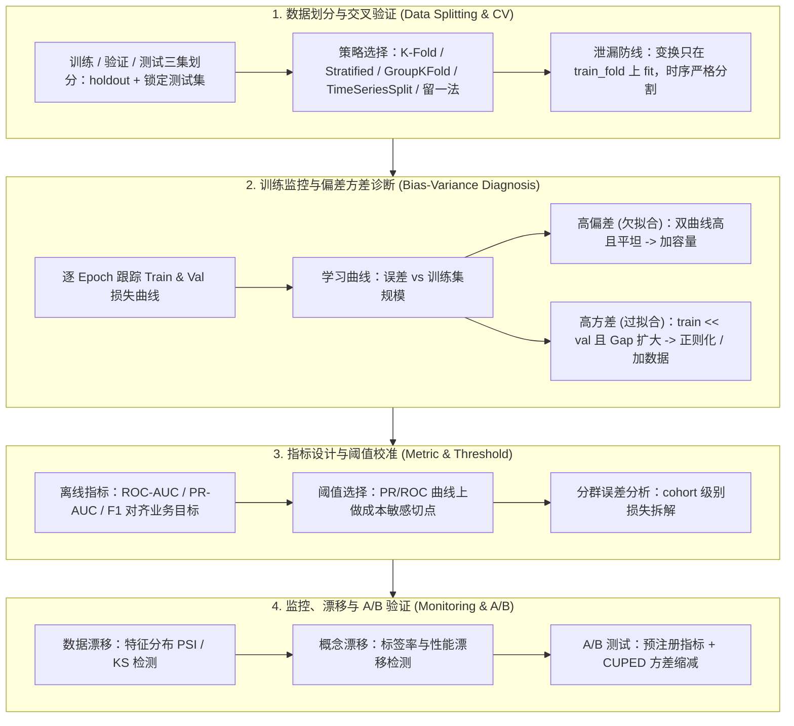

# 🔍 MLE 模型评估与调试工程：交叉验证策略、数据泄漏、偏差方差诊断、漂移检测与 A/B 验证

> **核心摘要**：模型的价值取决于验证它的评估闭环。本指南完整覆盖 MLE 面试与生产落地中的评估-调试工程链路：如何划分数据并选择正确的交叉验证策略（K-Fold / Stratified / GroupKFold / TimeSeriesSplit / 留一法）、数据泄漏如何静默地虚高每一个离线指标、如何通过 train/val 损失曲线与学习曲线系统化诊断高偏差 vs 高方差、如何对齐离线指标与业务指标（PR vs ROC、切点选择），以及如何在生产环境监控数据/概念漂移并用 A/B 测试验证每一次上线。

---

## 💡 交互式 Mermaid 架构流程图



---

## 💡 经典面试追问与考点速查

* **考点 1**：K-Fold、Stratified K-Fold、GroupKFold、TimeSeriesSplit 与留一法各适用于什么场景？
  * *标准回答*：K-Fold 将数据随机切为 $K$ 份，误差估计低偏差、适度方差，但破坏时序；Stratified K-Fold 每折保持类别比例，类别不平衡必须使用；GroupKFold 保证同一组（用户、商户、图片）的样本不跨折，杜绝组级泄漏；TimeSeriesSplit 按 $t_{\text{train}} < t_{\text{val}}$ 扩展窗口划分，是时序数据的唯一正确选择；留一法 (LOOCV) 每次只留 1 个样本，偏差最小但需训练 $n$ 次且对相关样本方差大。选型铁律：**时序不随机、不平衡不分层、分组不分组**，否则验证指标就是谎言。

> 💡 **直观理解**：CV 策略的选择本质是"模拟真实世界的考试环境"——时序数据上随机切分等于允许模型"预知未来"；不平衡数据不分层，可能整个验证折全是负类；分组数据不分组，同一用户同时在训练和验证里"泄题"。选错分割器，离线指标就是一场自欺欺人的演习。
>
> 🎤 **面试速答**："结论：五种策略对号入座——i.i.d. 用 K-Fold、不平衡用 Stratified、分组用 GroupKFold、时序用 TimeSeriesSplit、小样本用 LOOCV。原理：Stratified 每折保持类别比例；GroupKFold 同组样本不跨折；TimeSeriesSplit 保证 t_train < t_val；LOOCV 偏差最小但要训 n 次。例子：1:1000 的欺诈数据用随机 K-Fold，某折可能一个正类都没有，指标震荡到没法看——换 Stratified 后折间方差立刻稳定。铁律：时序不随机、不平衡不无分层、分组不无分组。"

* **考点 2**：训练误差与验证误差都高 vs 训练误差低但验证误差高，分别代表什么？修复手段有何不同？
  * *标准回答*：两者是偏差-方差谱的两端。**高偏差（欠拟合）**：两条曲线都高且趋于平坦收敛——模型表达力不足，应加特征/容量、延长训练、减少约束。**高方差（过拟合）**：训练误差持续下降而验证误差反弹或平台化、Gap 持续扩大——应正则化、加数据、早停、简化模型。用学习曲线消歧：随训练集增大，训练误差上升、验证误差下降 → 方差主导，加数据最有效；双曲线平坦 → 偏差主导，加数据无效。

> 💡 **直观理解**：偏差和方差是"学得够不够"与"记得太死"的两端——两条曲线都高且平坦 = 模型根本学不动（欠拟合，像没复习的学生）；训练逼近 0、验证居高不下 = 背题了（过拟合，像背答案的学生）。学习曲线用"加数据有没有用"来消歧：加数据后验证在降 → 方差主导；两条线纹丝不动 → 偏差主导。
>
> 🎤 **面试速答**："结论：双高且平坦 = 高偏差 → 加容量；train 低 val 高 Gap 扩大 = 高方差 → 正则化/加数据。原理：用学习曲线消歧——训练集增大时训练误差上升、验证误差下降 → 方差主导，加数据最有效；双曲线平坦且高 → 偏差主导，加数据无效，得加特征或容量。例子：8 万样本的 GBDT train AUC 0.99、val 0.88，把数据加到 50 万后 val 升到 0.94——方差主导实锤；反过来加数据后两条线都不动，就该加特征/加深模型。"

* **考点 3**：模型评估中的常见数据泄漏类型有哪些？如何在交叉验证中系统性防范？
  * *标准回答*：三类泄漏。(1) **目标泄漏**：特征编码了预测事件之后才可知的信息（如用未来标签构造"距上次购买天数"）；(2) **管线泄漏**：Scaler、Imputer、Encoder 在全量数据上 fit，验证折看到了由自身统计量构造的特征（OOF Target Encoding 从结构上消除自环）；(3) **时序泄漏**：时序数据用随机 K-Fold 让模型窥探未来。防范是结构性的：一切变换只在训练折内 fit，分割尊重分组与时间，特征上线前做因果审计。

> 💡 **直观理解**：数据泄漏分三种"作案手法"——目标泄漏是"提前知道了答案"（用未来信息造特征，如用购买结果算'距上次购买天数'）；管线泄漏是"监考老师念了全班平均分"（统计量在全量数据上算，验证折看到了自己）；时序泄漏是"偷看了未来的卷子"（随机 K-Fold 切时序数据）。
>
> 🎤 **面试速答**："结论：三类泄漏——目标泄漏、管线泄漏、时序泄漏，防范靠结构而非运气。原理：目标泄漏是特征编码了预测之后才可知的信息；管线泄漏是 Scaler/Imputer/Encoder 在全量数据上 fit（OOF 从结构上消灭自环）；时序泄漏是随机 K-Fold 让模型窥探未来。例子：用'当日是否购买'构造'距上次购买天数'，离线 AUC 0.99、线上崩盘——特征在预测时刻根本不存在。防范：变换只在训练折内 fit、分割尊重分组与时间、特征上线前做因果审计。"

* **考点 4**：类别不平衡时为何 PR-AUC 优于 ROC-AUC？如何选择最优阈值？
  * *标准回答*：ROC-AUC 绘制 TPR vs FPR，而 FPR 的分母被庞大的负类主导，即使模型在稀有正类上表现糟糕 AUC 依然很高；PR-AUC 以预测为条件，直接度量正类上的精确率-召回率，其随机基线随不平衡加剧坍缩到 $\frac{N^+}{N^+ + N^-}$。不平衡比 > 10:1 时必须报告 PR-AUC。阈值选择是成本问题：在 PR/ROC 曲线上最小化期望成本 $\text{Cost}(\tau) = c_{FP} \cdot \text{FPR}(\tau) \cdot N^{-} + c_{FN} \cdot \text{FNR}(\tau) \cdot N^{+}$，绝不默认 0.5。

> 💡 **直观理解**：ROC 画 TPR vs FPR，而 FPR 的分母是海量负类——负类占 99% 时 FPR 天生很小，AUC 虚高；PR 把聚光灯打在正类上，随机基线随不平衡坍缩。选阈值是成本题：放过一个欺诈（FN）和误杀一个好人（FP）代价不同，把两边代价代入公式取最小值，而不是拍脑袋用 0.5。
>
> 🎤 **面试速答**："结论：不平衡 > 10:1 报 PR-AUC；阈值是成本优化而非默认 0.5。原理：ROC 的 FPR 分母被负类主导，稀有正类做得再差也看不出来；PR-AUC 直接度量正类精确率-召回率。阈值 τ* 最小化 Cost = c_FP·FPR·N⁻ + c_FN·FNR·N⁺。例子：1:1000 欺诈，放走一笔欺诈损失 1000 元、误拦一单 10 元——成本比 100:1，阈值应压到约 0.05，召回率从 30% 升到 75%，净成本降 40%。"

* **考点 5**：离线指标很好但线上效果差，如何排查？概念漂移与数据漂移如何区分与应对？
  * *标准回答*：先查 **val-test 差距**——若验证估计本身是乐观的（泄漏、分割错误、验证集太小），离线数字从未真实，先审计管线再动模型。再查 **训练-服务偏差 (serving-training skew)**：特征分布漂移（PSI/KS 检测）属**数据漂移** $P(X)$ 变化 → 用新数据重训；标签分布变化、输入输出关系 $P(y|X)$ 改变属**概念漂移** → 需要重新标注或模型重构。最后只有 **A/B 测试**能证明业务价值：预注册指标、用 CUPED 缩减样本量。

> 💡 **直观理解**：离线好、线上差，像"模拟考满分、高考翻车"——先查是不是模拟卷本身出了错（val-test 差距：泄漏/分割错误/验证集太小），再查"考场和练习场是不是两套卷子"（训练-服务偏差）。分布变了是"题风变了"（数据漂移），标签关系变了是"考纲改了"（概念漂移）。
>
> 🎤 **面试速答**："结论：排查三步——先审计 val-test 差距，再区分数据漂移与概念漂移，最后用 A/B 验证。原理：数据漂移是 P(X) 变了（PSI/KS 检测）→ 重训；概念漂移是 P(y|X) 变了（标签率漂移检测）→ 重标注或重构；离线乐观估计往往来自泄漏或分割错误，先修管线。例子：模型上线后'用户城市'PSI 从 0.05 涨到 0.6——新版本 App 埋点坏了，回填数据重训；而疫情期间'出行意愿→消费'关系本身变了，属概念漂移，需要重新收集标签。最后 A/B：预注册指标 + CUPED 省样本。"

---

## 📚 第一章：数据划分与交叉验证策略

### 1.1 训练-验证-测试三集划分的职责

始终保留三个集合：**训练集**（拟合模型）、**验证集**（模型选择、超参调优、早停）、**测试集**（最终无偏报告，最多触碰几次）。测试集必须锁定：每次基于测试分数做决策都会把测试信息泄漏进模型选择过程，反复在测试集上评估本身就是一种隐蔽泄漏。

> 💡 **直观理解**：三集划分像"模拟考-摸底考-高考"——训练集是练习题（天天做），验证集是摸底考（用来定志愿、挑策略），测试集是高考（只有最终报告用，最多重考一两次）。每次拿测试分数调参，都等于往高考卷子里"漏题"。
>
> 🎤 **面试速答**："结论：训练拟合、验证选型、测试做最终无偏报告，测试集必须锁定。原理：验证集管超参/早停/模型选择；测试集只在最后碰几次——每次用测试分数做决策都会把测试信息泄漏进模型选择。例子：同一测试集上评估 50 次选最好的模型，最终报告的数字其实是对验证过程过拟合后的乐观估计。正确姿势：锁测试集，用嵌套 CV 做调参。"

### 1.2 交叉验证策略对比

| 策略 | 划分逻辑 | 偏差 / 方差 | 适用场景 | 常见坑 |
| :--- | :--- | :--- | :--- | :--- |
| **K-Fold** | 随机等分为 $K$ 折 | 低偏差、适度方差 | i.i.d. 数据、样本充足 | 破坏时序 |
| **Stratified K-Fold** | 每折保持类别比例 | 同左，类别均衡 | 类别不平衡分类 | 有泄漏时形同虚设 |
| **GroupKFold** | 同一组样本不跨折 | 单折偏差更高 | 用户/商户/图片级数据 | 忘了传 `groups` 参数 |
| **TimeSeriesSplit** | 扩展窗口，$t_{\text{train}} < t_{\text{val}}$ | 短序列偏差增大 | 一切时序数据 | 误开 `shuffle=True` |
| **LOOCV** | 每次留 1 个样本 | 低偏差、高方差、$\mathcal{O}(n)$ 次训练 | 小样本（数百以内） | 相关样本高估性能 |

> **怎么读这张表**：先盯"划分逻辑"列理解每种策略在做什么，再横着读"适用场景 + 常见坑"。面试最常被追问的三行：Stratified（不平衡）、TimeSeriesSplit（时序）、GroupKFold（分组）——对应的坑分别是泄漏、误开 shuffle、忘了传 groups。

$K$ 折交叉验证的误差估计，其中 $\hat{f}^{-k}$ 表示不含第 $k$ 折训练出的模型：

$$\widehat{\text{Err}}_{\text{CV}} = \frac{1}{K} \sum_{k=1}^{K} \frac{1}{|D_k|} \sum_{i \in D_k} \mathcal{L}\left(y_i, \hat{f}^{-k}(x_i)\right)$$

留一法是 $K = n$ 的特殊情形。

### 1.3 交叉验证的定位：模型检查而非模型构建

交叉验证的目标不是产出最终模型——不用 CV 中训练出的 $K$ 个实例做真实预测。它的用途是**模型检查**：选出表现更优的模型后，用全部数据重新训练最终模型。CV 选型完成后再做调参时必须警惕"在验证集上反复调参导致过拟合验证集"，此时引入**嵌套交叉验证 (Nested CV)**：外层折负责选模型，内层折负责调参，得到对最终泛化能力更诚实的估计。

> 💡 **直观理解**：CV 是"选课试听"而不是"期末考试"——试听选中最优模型后，真正上场要用全部数据重训。反复在验证集上调参本身会"过拟合验证集"，嵌套 CV 就是"试听之外再搞一次摸底考"，保证选出来的模型不是恰好蒙对验证集。
>
> 🎤 **面试速答**："结论：CV 用于模型检查与选型，选型后在全量数据上重训最终模型；调参阶段用嵌套 CV 防过拟合验证集。原理：嵌套 CV 的外层折负责选模型，内层折负责调参，测试估计不沾染任何调参信息。例子：外层 5 折 × 内层 5 折调 max_depth 时，外折的验证分数来自内层完全没见过的数据，泛化估计才诚实。面试常答漏的点：CV 训练出的 K 个模型不用于真实预测。"

---

## 📚 第二章：高偏差 vs 高方差系统化诊断

### 2.1 双曲线诊断法

核心调试闭环是每个 epoch 同时监控训练损失与验证损失。期望泛化误差的三元分解：

$$\text{Err}_{\text{泛化}} = \underbrace{\text{Bias}^2}_{\text{双曲线都高}} + \underbrace{\text{Variance}}_{\text{train} \ll \text{val}} + \sigma^2$$

**学习曲线**（误差 vs 训练集规模）负责消歧：方差主导的模型随 $n$ 增大训练误差上升、验证误差下降——加数据是正解；偏差主导的模型双曲线平坦且高——只加数据无效。

> 💡 **直观理解**：双曲线诊断像"听诊"——训练曲线和验证曲线是两条心电图。都高且平行 = 心脏没力（欠拟合）；train 贴地、val 走高 = 心脏乱跳（过拟合）。学习曲线是"处方验证"：加数据后 val 在降，说明缺的是数据；纹丝不动，说明缺的是模型容量。
>
> 🎤 **面试速答**："结论：双高且平坦 = 偏差主导（加容量/特征）；train 低 val 高 = 方差主导（正则化/加数据）。原理：泛化误差 = Bias² + Variance + σ²，双曲线都高说明 Bias² 大，Gap 大说明 Variance 大；学习曲线消歧：训练误差随 n 上升、验证误差随 n 下降 → 方差主导，加数据有效。例子：GBDT train AUC 0.99 / val 0.88，加数据到 3 倍后 val 0.93——方差主导；若加数据后 val 不动，转去加特征或换更大模型。诊断永远在调参之前。"

### 2.2 症状-诊断-动作决策表

| 观察现象 | 诊断 | 调试动作 |
| :--- | :--- | :--- |
| 训练与验证误差都高且平坦 | 高偏差（欠拟合） | 加特征/容量、延长训练、去掉正则 |
| 训练误差趋近 0，验证误差高、Gap 扩大 | 高方差（过拟合） | 正则化、加数据、早停、简化模型 |
| **train-val Gap 小但 val-test 差距大** | 过拟合验证集 / 验证集太小 | 嵌套 CV、扩大或重复验证划分 |
| 训练损失 > 验证损失 | 仅训练侧有 Dropout/数据增强，或验证集泄漏 | 关闭 Dropout 对比；重审划分 |
| 某个分群误差显著偏高 | 分群欠表示或标签噪声 | 分群误差分析、重采样、重标注 |

> **怎么读这张表**：这是"症状 → 诊断 → 动作"三步决策表，面试答调试题时按行讲完整链条。最值得背的一行是第三行：**train-val Gap 小但 val-test 差距大 = 过拟合验证集**——这是最容易被忽略的隐蔽失败模式。

### 2.3 误差分析与分群调试

把数据集当作多个总体而非一个整体：按设备、国家、用户层级等分群计算损失，并按混淆矩阵拆解错误类型。分群在训练中欠表示 → 补数据；表示充分但仍失败 → 查标签噪声；只在生产失败 → 查漂移。**健全性优先**：任何调参之前，先在单个 minibatch 上把损失过拟合到接近 0，证明架构与数据管线无 bug——这是最快发现算法错误与实验设置错误的手段。

> 💡 **直观理解**：误差分析要把数据集当"多个小世界"而不是一个整体——按设备、国家、用户层级分组看损失，像医生分科室查病。健全性检查则是"先证明机器能转"：让模型在单个 batch 上把损失压到接近 0，如果这都做不到，说明算法或数据管线有 bug，调参纯属浪费时间。
>
> 🎤 **面试速答**："结论：分群误差分析定位'谁错了'，健全性检查先证明'能学得动'。原理：按 cohort 计算损失 + 混淆矩阵拆错误类型；分群欠表示 → 补数据，表示充分仍失败 → 查标签噪声，只在生产失败 → 查漂移。例子：模型整体 AUC 0.92，但按设备分群后安卓端 AUC 只有 0.60——发现安卓用户特征缺失率 40%，补数据后升到 0.88。健全性：调参前先把单 batch 训练到 loss≈0，1 小时内可排除 90% 的管线 bug。"

---

## 📚 第三章：评估指标口径与阈值校准

### 3.1 离线指标 vs 业务指标

离线指标（AUC、F1）是代理指标；业务指标（GMV、获客成本、收入提升）才是最终真理。每个 MLE 项目都必须定义**指标地图**：哪个离线指标最能预测哪个业务结果，并为模型对比选定单一优化目标（single-number metric）。

| 任务 | 离线指标 | 业务代理指标 | 工作点 |
| :--- | :--- | :--- | :--- |
| 反欺诈（稀有正类） | PR-AUC | $Loss_{FN}$ vs $Loss_{FP}$ | 成本敏感 $\tau$ |
| 排序 / 检索 | NDCG@k、mAP | CTR、互动率 | 在第 k 位截断 |
| 流失预测 | ROC-AUC + 校准 | 留存提升 | 业务利润率 |

> **怎么读这张表**：每一行都是一道"指标设计"面试题的答案骨架——任务 → 离线指标 → 业务代理 → 工作点。核心是"离线指标只是代理，业务指标才是真理"：AUC 再高，GMV 不涨就没用。面试加分：讲出每个任务的"工作点"怎么定（反欺诈按成本比、排序按截断位、流失按利润率）。

### 3.2 PR vs ROC 与阈值选择

$$\text{Precision} = \frac{TP}{TP + FP}, \qquad \text{Recall} = \frac{TP}{TP + FN}, \qquad F_1 = \frac{2PR}{P + R}$$

ROC-AUC 与阈值无关、对类别比例变化稳定，但在不平衡下过于乐观；PR-AUC 聚焦正类，必须伴随不平衡任务使用。最优阈值是成本最小化问题：

$$\tau^* = \arg\min_{\tau} \left[ c_{FP} \cdot \text{FPR}(\tau) \cdot N^{-} + c_{FN} \cdot \text{FNR}(\tau) \cdot N^{+} \right]$$

> 💡 **直观理解**：这个公式在算"把线划在哪最省钱"——FP 代价 × 误杀人数 + FN 代价 × 漏网人数，把两个方向的损失加起来取最小值。反欺诈里漏一个骗子的损失是误拦的 100 倍，线就要划得低一点、宁可多拦；搜索广告里误推一条无关结果无所谓，线就可以高一点。
>
> 🎤 **面试速答**："结论：最优阈值是成本最小化问题，不是默认 0.5。原理：在 PR/ROC 曲线上扫 τ，最小化 Cost(τ) = c_FP·FPR(τ)·N⁻ + c_FN·FNR(τ)·N⁺，把两类错误的代价差异显式算进去。例子：欺诈拦截，漏一笔损失 1000 元、误拦一单成本 10 元，N⁺=1,000 笔欺诈、N⁻=1,000,000 笔正常——最优阈值约 0.05 而非 0.5，召回率从 30% 升到 75%，总成本降约 40%。"

---

## 📚 第四章：模型监控、漂移检测与 A/B 验证

### 4.1 数据漂移 vs 概念漂移

- **数据漂移（协变量偏移）**：输入分布 $P(X)$ 变化，而映射 $P(y \mid X)$ 不变。用特征级 PSI（总体稳定性指数）或 KS 检验对比训练样本与服务样本：

$$\text{PSI} = \sum_i \left(p_i^{\text{new}} - p_i^{\text{ref}}\right) \cdot \ln \frac{p_i^{\text{new}}}{p_i^{\text{ref}}}, \qquad \text{PSI} < 0.1 \text{ 正常},\; 0.1{-}0.25 \text{ 关注},\; > 0.25 \text{ 重训}$$

- **概念漂移**：$P(y \mid X)$ 本身改变，即使输入看似相同。通过标签率漂移、分群性能监控与 champion-challenger 对比实验检测。

| 漂移类型 | 检测对象 | 典型指标 | 应对策略 |
| :--- | :--- | :--- | :--- |
| **数据漂移** | 输入特征分布 | PSI、KS、AUC 衰减 | 补充新数据重训、特征归一化 |
| **概念漂移** | 标签率 / 输入输出关系 | 标签均值漂移、误差率上升 | 重新标注、模型重构、周期性重训 |

> **怎么读这张表**：核心是区分"输入变了"还是"规律变了"——数据漂移 = P(X) 变了（题风变了，重训即可）；概念漂移 = P(y|X) 变了（考纲改了，要重标注/重构）。面试必背的检测对象一栏：PSI/KS 对特征、标签均值漂移对关系。

### 4.2 A/B 测试验证

A/B 测试是最后一道闸门——holdout 指标只是估计值而非保证。最佳实践：预注册指标与最小效应量；用 CUPED 以 $\text{Var}(\tilde{Y}) = \text{Var}(Y)(1 - \rho^2)$ 缩减样本量（$\rho$ 为协变量与结果的相关系数）；实验时长覆盖周度季节性；用序贯检验防止反复偷看 (peeking)。

> 💡 **直观理解**：A/B 是"上线前的最后一关"——离线指标只是估算，真金白银的业务效果只有实验能证明。CUPED 的直觉：实验噪音大多来自用户基线差异，用实验前数据把"谁本来就强"算出来并减掉，方差小了样本需求就小。反复看实验数据决定要不要停，等于把一次考试当无数次考试，必须用序贯检验兜底。
>
> 🎤 **面试速答**："结论：A/B 是最终闸门，预注册指标 + CUPED 减方差 + 时长覆盖季节性 + 序贯检验防偷看。原理：CUPED 用协变量修正 Ỹ = Y − θ(X − E[X])，方差减为 Var(Y)(1−ρ²)；预注册防止 p-hacking；序贯检验允许中途查看而控制假阳性。例子：CTR 实验，用实验前 7 天行为作协变量 ρ=0.7，样本量需求减半，2 周出结论的跑 1 周。铁律：协变量必须在实验前确定，指标必须预注册，中途偷看必须走序贯框架。"

---

## 🐍 Pure Numpy 实现：K-Fold 交叉验证 + 学习曲线诊断

```python
import numpy as np

def ridge_fit(X, y, lam=0.1):
    # Pure Numpy 闭式岭回归：w* = (X^T X + lambda I)^-1 X^T y
    d = X.shape[1]
    return np.linalg.solve(X.T @ X + lam * np.eye(d), X.T @ y)

def kfold_indices(n, k, seed=42):
    rng = np.random.default_rng(seed)
    idx = rng.permutation(n)
    return np.array_split(idx, k)

def learning_curve(X, y, k=5, train_fracs=(0.2, 0.4, 0.6, 0.8), lam=0.1):
    # 在每个训练集规模分数上做 K 折 CV -> 得到诊断用学习曲线
    folds = kfold_indices(len(X), k)
    train_errs, val_errs = [], []
    for frac in train_fracs:
        te, ve = [], []
        for v in range(k):
            val_idx = folds[v]
            pool = np.concatenate([folds[t] for t in range(k) if t != v])
            tr_idx = pool[: max(2, int(frac * len(pool)))]
            w = ridge_fit(X[tr_idx], y[tr_idx], lam)
            te.append(np.mean((X[tr_idx] @ w - y[tr_idx]) ** 2))
            ve.append(np.mean((X[val_idx] @ w - y[val_idx]) ** 2))
        train_errs.append(np.mean(te))
        val_errs.append(np.mean(ve))
    return np.array(train_fracs), np.array(train_errs), np.array(val_errs)

if __name__ == "__main__":
    rng = np.random.default_rng(0)
    X = np.linspace(-3, 3, 150)[:, None]
    y = np.sin(X[:, 0]) + 0.1 * rng.standard_normal(len(X))
    X_poly = np.hstack([X ** i for i in range(1, 4)])  # 多项式基函数扩展

    fracs, tr_err, val_err = learning_curve(X_poly, y)
    for f, t, v in zip(fracs, tr_err, val_err):
        print(f"train_frac={f:.1f}  train_err={t:.4f}  val_err={v:.4f}")

    # 曲线解读：若 train_err 上升而 val_err 持续下降，
    # 说明模型方差主导 -> 加数据 / 加强正则化。
```

---

## 📝 总结与学习路线

1. **先定划分再选模型**：时序 → TimeSeriesSplit；分组 → GroupKFold；不平衡 → Stratified K-Fold；i.i.d. → K-Fold。绝不混用。
2. **泄漏是头号静默杀手**：一切变换只在训练折内 fit；测试集锁定；特征上线前做因果审计。
3. **先诊断再调参**：偏差 → 加容量；方差 → 加数据或正则化；用学习曲线与分群误差分析代替拍脑袋。
4. **指标对齐业务**：不平衡任务报告 PR-AUC；判定阈值是成本优化问题，不是 0.5 默认值。
5. **监控 + A/B 双保险**：PSI/KS 盯数据漂移、标签率盯概念漂移；每次上线用预注册的 A/B 实验验证后再放量。
