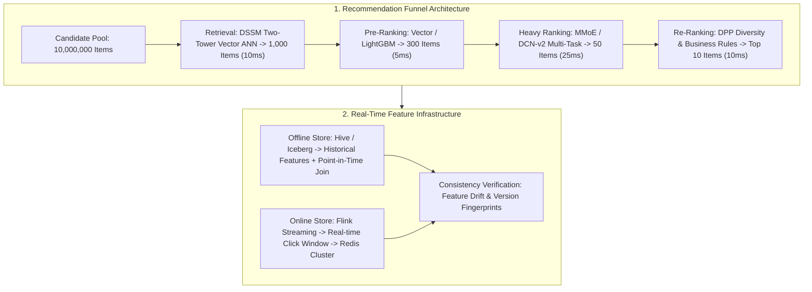

# 🌐 MLE System Design Guide: Recommendation, Search & Risk Control

> **Executive Summary**: Machine Learning System Design separates senior Machine Learning Engineers (MLE) and AI Architects from junior modelers. Candidates must demonstrate the ability to translate ambiguous business requirements into resilient, highly concurrent, and low-latency production pipelines. This guide dissects the standard 4-stage recommendation funnel (Retrieval $\to$ Pre-Ranking $\to$ Heavy Ranking $\to$ Re-Ranking), DSSM popularity debiasing, MMoE/ESMM multi-task modeling, DPP diversity selection, and real-time Feature Stores.

---

## 💡 Interactive Mermaid Architecture



---

## Chapter 1: 5-Step MLE System Design Framework

1. **Clarify Requirements (5m)**: Latency SLA (50ms), Peak QPS (100k), Scale & Hardware constraints.
2. **Metrics & Objectives (5m)**: Offline (AUC, NDCG) vs. Online business metrics (CTR, CVR, GMV).
3. **Data Pipeline & Feature Store (10m)**: Spark batch ETL + Flink real-time streaming + Point-in-Time Joins.
4. **Modeling Architecture (15m)**: 4-stage funnel design (Retrieval, Pre-Ranking, Heavy Ranking, Re-Ranking).
5. **Infra & Serving (10m)**: Triton Inference Server, Redis caching, and circuit-breaker fallbacks.

---

## Chapter 2: Pure Python Latency Budget Allocation

```python
def pure_python_latency_budget_allocation(total_budget_ms: int = 50) -> dict:
    return {
        "retrieval_ms": total_budget_ms * 0.2,
        "ranking_ms": total_budget_ms * 0.6,
        "reranking_ms": total_budget_ms * 0.2
    }

if __name__ == "__main__":
    print("✅ 50ms SLA Budget:", pure_python_latency_budget_allocation(50))
```

---

## Chapter 3: DSSM Two-Tower Retrieval & Popularity Debiasing

### In-Batch Negatives & Popularity Correction
In two-tower retrieval, In-Batch Negatives penalize popular items excessively because their sampling frequency is proportional to their marginal popularity $p_j$.
Subtract the log marginal probability from the similarity logits:
$$s(u_i, v_j) = \frac{u_i^T v_j}{\tau} - \log(p_j)$$
This removes sampling artifacts, forcing the network to learn genuine user interest representations.

---

## Chapter 4: Multi-Task Heavy Ranking (MMoE & ESMM)

### 1. MMoE (Multi-gate Mixture-of-Experts)
Replaces shared-bottom layers with $E$ experts weighted by task-specific Softmax gates:
$$y_k = h^k \left( \sum_{i=1}^E g_i^k(x) f_i(x) \right), \quad g^k(x) = \text{softmax}(W_g^k x)$$

### 2. ESMM (Entire Space Multi-Task Model)
Eliminates Sample Selection Bias (SSB) by modeling joint probability over the entire exposure space:
$$p(\text{CTCVR}) = p(\text{Click} = 1 \mid x) \times p(\text{Conversion} = 1 \mid \text{Click} = 1, x)$$

---

## Chapter 5: DPP (Determinantal Point Processes) for Diversity

To prevent recommendation echo chambers, DPP selects subsets balancing individual quality $q_i$ and inter-item similarity $S_{ij}$:
$$L_{ij} = q_i q_j S_{ij}, \quad P(Y) \propto \det(L_Y)$$

```python
import numpy as np

def pure_python_dpp_greedy(quality_scores: np.ndarray, similarity_matrix: np.ndarray, max_items: int = 2) -> list[int]:
    n = len(quality_scores)
    selected = []
    L = np.outer(quality_scores, quality_scores) * similarity_matrix
    
    for _ in range(max_items):
        best_gain, best_idx = -1.0, -1
        for candidate in range(n):
            if candidate in selected:
                continue
            current_set = selected + [candidate]
            sub_L = L[np.ix_(current_set, current_set)]
            gain = np.linalg.det(sub_L)
            if gain > best_gain:
                best_gain, best_idx = gain, candidate
        if best_idx != -1 and best_gain > 0:
            selected.append(best_idx)
        else:
            break
    return selected

if __name__ == "__main__":
    q = np.array([0.9, 0.85, 0.88, 0.4])
    S = np.array([[1.0, 0.95, 0.1, 0.0], [0.95, 1.0, 0.1, 0.0], [0.1, 0.1, 1.0, 0.0], [0.0, 0.0, 0.0, 1.0]])
    print("✅ DPP Selected Items:", pure_python_dpp_greedy(q, S, max_items=2))
```
