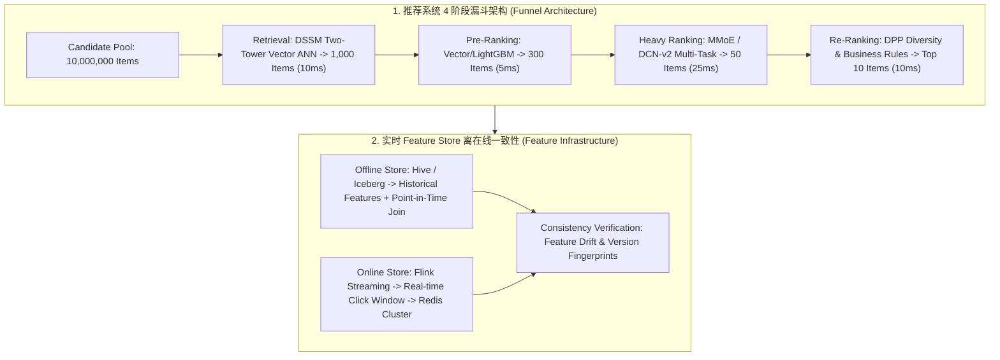

# 🌐 MLE 业务系统设计：推荐系统、搜索广告与风控架构全流程

> **核心摘要**：机器学习系统设计（ML System Design）是机器学习工程师（MLE）与算法架构师面试的分水岭。候选人需要展示将模糊业务诉求转化为高可用、高并发工业级 AI 系统的全局工程架构能力。本指南系统剖析推荐系统标准四阶段漏斗（召回-粗排-精排-重排）、双塔 DSSM 与流行度校正、MMoE/ESMM 多目标精排、DPP 行列式点过程多样性打散以及实时 Feature Store。

---

## 💡 交互式 Mermaid 架构流程图



---

## 第一章：MLE 业务系统设计 5 步响应框架

在 45 分钟 MLE System Design 面试中，掌控节奏至关重要：
1. **Clarify Requirements (5m)**：澄清 Latency SLA (50ms)、QPS 峰值 (100k)、数据规模与 Serving 资源；
2. **Metrics & Objectives (5m)**：定义离线 AUC/NDCG 与在线 CTR/CVR/GMV；
3. **Data Pipeline & Feature Store (10m)**：Spark 离线批处理与 Flink 实时特征流拼装；
4. **Modeling Architecture (15m)**：召回-精排-重排三阶段模型选型与损失函数；
5. **Infra & Serving (10m)**：ONNX / Triton 部署、Redis 缓存与降级熔断。

> 💡 **直观理解**：5 步框架本质是"先当产品经理、再当数据工程师、最后当架构师"——面试官最反感一上来就讲模型。把 45 分钟想成一顿饭：前 10 分钟澄清需求定菜单（延迟 50ms、QPS 10 万），中间 25 分钟讲数据与模型（主菜），最后 10 分钟讲部署与兜底（甜点+保险）。
>
> 🎤 **面试速答**："结论：45 分钟按 5-5-10-15-10 分配：Clarify → Metrics → Data/Feature → Modeling → Infra。原理：先澄清延迟 SLA（如 50ms）与 QPS（10 万）决定架构规模；再定离线 AUC/NDCG 与在线 CTR/GMV 指标；数据管线（Spark+Flink）与特征一致性决定成败；建模阶段按召回-精排-重排分配；最后 ONNX/Triton 部署 + Redis 缓存 + 降级熔断。例子：QPS 10 万 × 50ms = 每秒要扛 10 万次全链路调用，精排模型只能部署在 GPU/CPU 混合集群并配缓存。要点：每个阶段结束时明确输出，别让面试官猜你在想什么。"

---

## 第二章：Pure Python 业务 QPS 延迟预算分配算子

延迟预算的核心思想：**把 50ms 的 SLA 当成一份要切分的蛋糕**——谁耗时占比高就给谁更多预算。召回只做向量检索（轻），给 20%；精排跑完整模型（重），给 60%；重排只做多样性打散（轻），给 20%。预算分配先于架构设计：先算清每阶段的毫秒配额，才知道该用什么量级的模型。

```python
def pure_python_latency_budget_allocation(total_budget_ms: int = 50) -> dict:
    return {
        "retrieval_ms": total_budget_ms * 0.2,
        "ranking_ms": total_budget_ms * 0.6,
        "reranking_ms": total_budget_ms * 0.2
    }

if __name__ == "__main__":
    print("✅ 50ms SLA 延迟分配:", pure_python_latency_budget_allocation(50))
```

> 💡 **直观理解**：50ms 的 SLA 要拆成三块蛋糕——召回 10ms、精排 30ms、重排 10ms。精排拿到最大份额是因为它跑最重的模型（DCN-v2/MMoE 全量特征），召回只做向量检索，重排只做规则打散。预算分配是"谁最重谁拿最多"。
>
> 🎤 **面试速答**："结论：50ms = 召回 10ms + 精排 30ms + 重排 10ms（20%/60%/20%）。原理：延迟预算按阶段计算量分配——召回是浅层向量检索（DSSM），精排是全量特征深度模型，重排是 DPP 多样性或规则。例子：QPS 10 万时，精排 30ms 意味着每秒 10 万次深度模型推理，必须 GPU/多机分摊；重排 10ms 只够跑轻量规则与 DPP 采样。追问：预算超了先砍哪？——先砍重排规则，再降精排候选数 1000→500，最后才动召回。"

---

## 第三章：双塔 DSSM 召回与流行度负采样校正

召回阶段的核心目标是**以极低计算开销（<10ms）从千万级候选池中检索出最相关的 Top-1000 候选集**。

### 1. 双塔架构与 In-Batch Negatives 损失
* **User 塔**：输入用户静态特征、实时长短期行为序列，经过深度网络输出 $d$ 维向量 $u \in \mathbb{R}^d$。
* **Item 塔**：输入物品类目、文本、多模态 Embedding，输出 $d$ 维向量 $v \in \mathbb{R}^d$。

训练采用 Batch 内负采样（In-Batch Negatives），基于对比学习 InfoNCE 损失：
$$\mathcal{L}_{\text{InfoNCE}} = -\frac{1}{B} \sum_{i=1}^B \log \frac{\exp(u_i^T v_i / \tau)}{\sum_{j=1}^B \exp(u_i^T v_j / \tau)}$$

### 2. 流行度偏差 (Popularity Bias) 严格校正
在 In-Batch 负采样中，高频热门物品被作为负样本抽中的概率正比于其出现频率 $p_j$。如果不做修正，模型会严重惩罚热门物品，导致头部优质内容无法被召回。
**Google 修正方案**：在 Logits 计算时减去物品边缘被抽中概率的对数：
$$s(u_i, v_j) = \frac{u_i^T v_j}{\tau} - \log(p_j)$$
使得模型只学习用户与物品的真实意图偏好，消除由于采样机制引入的伪关联！

---

## 第四章：多目标精排体系 (MMoE & ESMM 全空间建模)

精排阶段从千级别候选集中精确预估用户多维行为概率（点击率 pCTR、转化率 pCVR、完播率 pFinish）。

### 1. MMoE (Multi-gate Mixture-of-Experts) 解决任务冲突
传统 Shared-Bottom 结构在任务相关性低时会产生负迁移（Negative Transfer）。MMoE 引入 $E$ 个共享 Expert 专家网络与针对每个任务 $k$ 专属的 Softmax 门控网络：
$$y_k = h^k \left( \sum_{i=1}^E g_i^k(x) f_i(x) \right), \quad g^k(x) = \text{softmax}(W_g^k x)$$
不同任务可以自适应分配各专家的权重，优雅化解“点击高但转化低”的业务冲突。

### 2. ESMM (Entire Space Multi-Task Model) 解决样本选择偏差 (SSB)
在传统 CVR 建模中，训练只在“有点击”的样本空间进行，但线上预估必须面向“全曝光”空间，导致严重的**样本选择偏差（SSB）与数据稀疏性（Data Sparsity）**。
ESMM 引入全空间联合概率分解：
$$p(\text{CTCVR}) = p(\text{Click} = 1, \text{Conversion} = 1 \mid x) = p(\text{Click} = 1 \mid x) \times p(\text{Conversion} = 1 \mid \text{Click} = 1, x)$$
在整个曝光空间 $\mathcal{D}$ 上同时训练 CTR 与 CTCVR 两个子任务，CVR 隐式推导，彻底根除选择偏差！

---

## 第五章：重排阶段：行列式点过程 (DPP) 多样性打散

如果 Top-10 推荐列表全部挤满了同质化的高点击内容（如全是手机），用户会迅速产生审美疲劳。**行列式点过程 (DPP)** 在数学上提供了兼顾相关度与多样性的最优选集方案。

定义半正定核矩阵 $L \in \mathbb{R}^{N \times N}$：
$$L_{ij} = q_i q_j S_{ij}$$
其中 $q_i \in \mathbb{R}^+$ 为精排输出的相关度质量得分，$S_{ij} \in [-1, 1]$ 为物品 $i$ 与 $j$ 的内容相似度矩阵。选出的子集 $Y$ 的概率正比于主子式行列式：
$$P(Y) \propto \det(L_Y)$$
* 行列式几何意义：由特征向量张成的超平行多面体体积。如果两件商品高度相似（$S_{ij} \to 1$），向量线性相关，体积为 0（概率为 0，不被共同选中）；既保证单体高质量（$q_i$ 大），又保证空间夹角大（多样性高）。

```python
import numpy as np

def pure_python_dpp_greedy(quality_scores: np.ndarray, similarity_matrix: np.ndarray, max_items: int = 3) -> list[int]:
    """
    极简贪心 DPP 多样性选择算法
    """
    n = len(quality_scores)
    selected = []
    
    # 构造核矩阵 L = diag(q) * S * diag(q)
    L = np.outer(quality_scores, quality_scores) * similarity_matrix
    
    for _ in range(max_items):
        best_gain = -1.0
        best_idx = -1
        
        for candidate in range(n):
            if candidate in selected:
                continue
            current_set = selected + [candidate]
            sub_L = L[np.ix_(current_set, current_set)]
            gain = np.linalg.det(sub_L)
            if gain > best_gain:
                best_gain = gain
                best_idx = candidate
                
        if best_idx != -1 and best_gain > 0:
            selected.append(best_idx)
        else:
            break
            
    return selected

if __name__ == "__main__":
    q = np.array([0.9, 0.85, 0.88, 0.4])  # 质量得分
    # 物品 0 与物品 1 高度同质化 (相似度 0.95)
    S = np.array([
        [1.0, 0.95, 0.1, 0.0],
        [0.95, 1.0, 0.1, 0.0],
        [0.1, 0.1, 1.0, 0.0],
        [0.0, 0.0, 0.0, 1.0]
    ])
    chosen = pure_python_dpp_greedy(q, S, max_items=2)
    print("✅ DPP 贪心选择的最优多样性索引组合:", chosen)  # 选中 0 和 2, 自动跳过 1
```

---

## 第六章：5 大高频系统设计面试考点与标准解答

### 考点 1：推荐系统如何从千万级候选集过滤到 Top-K 输出？说明各阶段 QPS 与 Latency 预算？
* **标准回答**：采用四阶段漏斗：
  1. 召回阶段：千万级 $\to$ 1,000 个（10ms，双塔 ANN 检索）；
  2. 粗排阶段：1,000 个 $\to$ 300 个（5ms，轻量交叉模型）；
  3. 精排阶段：300 个 $\to$ 50 个（25ms，MMoE/DCN-v2 深度多目标打分）；
  4. 重排阶段：50 个 $\to$ Top 10（10ms，DPP 多样性打散 + 强插/去重业务规则）。总耗时控制在 50ms 以内！
