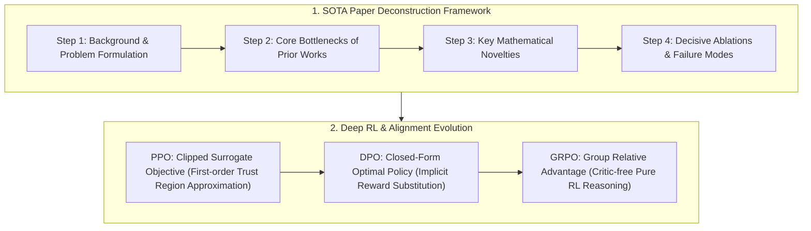

# 🌐 RS Core Cheatsheet: Top 30 Papers Breakdown & Deep RL

> **Executive Summary**: Technical interviews for Research Scientist (RS) roles evaluate first-principles mathematical rigor, analytical loss derivations, generalization bounds, and model failure modes. This cheatsheet deconstructs the RS core knowledge map: the 4-step paper breakdown framework, a structured matrix of the Top 30 milestone papers, analytical derivation of DPO implicit reward substitution, PPO clipped objective dynamics, and Pure Python implementations.

---

## 💡 Interactive Mermaid Architecture



---

## Chapter 1: The RS Core Mindset & 4-Step Paper Breakdown

RS interviews evaluate whether you can **reason like the author of a pioneering breakthrough**.

```
1. Problem Formulation: Concrete mathematical objective and scope
2. Physical Bottleneck: Fundamental scaling limits of prior paradigms
3. Algorithmic Novelty: Mathematical transformation and loss redesign
4. Decisive Ablations: Knockout experiments and out-of-distribution failure modes
```

---

## Chapter 2: Pure Python PPO Clipped Loss Operator

```python
import numpy as np

def pure_python_ppo_clipped_loss(ratios: np.ndarray, advantages: np.ndarray, clip_eps: float = 0.2) -> float:
    surr1 = ratios * advantages
    surr2 = np.clip(ratios, 1.0 - clip_eps, 1.0 + clip_eps) * advantages
    return float(-np.mean(np.minimum(surr1, surr2)))

if __name__ == "__main__":
    r = np.array([0.9, 1.15, 1.3])
    adv = np.array([0.5, -0.4, 0.8])
    print("✅ PPO Clipped Loss:", round(pure_python_ppo_clipped_loss(r, adv), 4))
```

---

## Chapter 3: DPO Closed-Form Optimal Policy & Implicit Reward Derivation

Consider the KL-regularized RLHF objective:
$$\max_{\pi} \mathbb{E}_{x \sim \mathcal{D}, y \sim \pi(y|x)} [r(x, y)] - \beta \mathbb{D}_{\text{KL}}(\pi(y|x) \parallel \pi_{\text{ref}}(y|x))$$

Expanding the KL divergence:
$$\max_{\pi} \sum_y \pi(y|x) \left( r(x, y) - \beta \log \frac{\pi(y|x)}{\pi_{\text{ref}}(y|x)} \right) = \max_{\pi} -\beta \sum_y \pi(y|x) \log \left( \frac{\pi(y|x)}{\frac{1}{Z(x)} \pi_{\text{ref}}(y|x) \exp(\frac{1}{\beta} r(x, y))} \right) + \beta \log Z(x)$$
where partition function $Z(x) = \sum_y \pi_{\text{ref}}(y|x) \exp\left( \frac{1}{\beta} r(x, y) \right)$.

This is equivalent to minimizing the KL divergence to a Gibbs distribution. The global optimum is achieved when the distributions match, yielding the **closed-form optimal policy**:
$$\pi^*(y|x) = \frac{1}{Z(x)} \pi_{\text{ref}}(y|x) \exp\left( \frac{1}{\beta} r(x, y) \right)$$

Taking logarithms and rearranging terms:
$$r(x, y) = \beta \log \frac{\pi^*(y|x)}{\pi_{\text{ref}}(y|x)} + \beta \log Z(x)$$

Substituting this implicit reward expression into the Bradley-Terry preference model $P(y_w \succ y_l \mid x) = \sigma(r(x, y_w) - r(x, y_l))$, the partition constant $\beta \log Z(x)$ **cancels out completely**:
$$\mathcal{L}_{\text{DPO}}(\theta) = -\mathbb{E}_{(x, y_w, y_l) \sim \mathcal{D}} \left[ \log \sigma \left( \beta \log \frac{\pi_\theta(y_w \mid x)}{\pi_{\text{ref}}(y_w \mid x)} - \beta \log \frac{\pi_\theta(y_l \mid x)}{\pi_{\text{ref}}(y_l \mid x)} \right) \right]$$

```python
def pure_python_dpo_loss(
    pi_yw: float, pi_yl: float,
    ref_yw: float, ref_yl: float,
    beta: float = 0.1
) -> float:
    log_ratio_w = np.log(pi_yw) - np.log(ref_yw)
    log_ratio_l = np.log(pi_yl) - np.log(ref_yl)
    implicit_logit = beta * (log_ratio_w - log_ratio_l)
    prob_win = 1.0 / (1.0 + np.exp(-implicit_logit))
    return float(-np.log(prob_win))

if __name__ == "__main__":
    print("✅ DPO Loss:", round(pure_python_dpo_loss(0.8, 0.2, 0.4, 0.4, beta=0.1), 4))
```

---

## Chapter 4: Milestone Papers Taxonomy (Top 30 Works)

* **Architecture**: *Attention Is All You Need (2017)*, *FlashAttention-1/2 (2022/2023)*, *DeepSeek-V3 MLA (2024)*.
* **Scaling**: *Chinchilla (2022)*, *DeepSeek-R1 (2025)*, *Kaplan Scaling Laws (2020)*.
* **Alignment**: *InstructGPT (2022)*, *DPO (2023)*, *GRPO (2024)*.
* **Diffusion & Generation**: *DDPM (2020)*, *Flow Matching (2023)*, *DiT / Sora (2023/2024)*.
