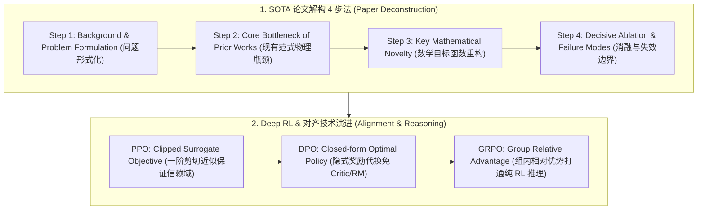

# 🌐 RS 核心知识地图：顶会必读 30 篇论文解构与深度强化学习 Deep RL

> **核心摘要**：算法研究科学家（Research Scientist, RS）岗位的技术面试深度远超普通工程开发。面试官深究每一篇 SOTA 论文背后的第一性原理、损失函数的解析推导、泛化界的数学保证以及模型的失效边界。本速查全景拆解 RS 岗位核心知识地图：SOTA 论文解构四步法、顶会必读 30 篇里程碑论文脉络、DPO 闭式隐式奖励严格推导、PPO 剪切目标以及 Pure Python 算子实现。

---

## 💡 交互式 Mermaid 架构流程图



---

## 第一章：RS 岗位核心八股与 30 篇必读论文框架

RS 岗位的面试高度依赖对经典与 SOTA 论文的深刻理解（如 Transformer, FlashAttention, LLaMA, DeepSeek-V3/R1）。面试官深究**为什么作者选择这个 Loss、参数设置背后的数学洞察以及模型的失效边界（Failure Modes）**。

> 💡 **直观理解**: RS 面试考的不是"这篇论文做了什么",而是"你能否像作者一样思考"。论文拆解 4 步法就是一条思维流水线:先定义问题(Background/Formulation),再指出旧方法卡在哪(Bottleneck),然后亮出你的数学手术刀(Novelty),最后用消融证明不是运气(Ablation)——面试官按这条线追问,就是在看你每个环节有没有自己的判断。
>
> 🎤 **面试速答**: "结论:我按 4 步框架拆解任何论文——问题定义、旧方法瓶颈、核心创新、消融验证。原理:每篇好论文都是'旧方法失效→新机制补位→证据链闭合'的完整叙事,只讲模型不讲失败模式会被追问到死。举个例子:FlashAttention 的瓶颈是注意力矩阵 O(N²) 显存,创新是分块 softmax + 在线重标定,消融报告不同序列长度下的 FLOPs 与真实加速——这 4 步缺一不可。"

---

## 第二章：Pure Python PPO Clipped Loss 算子

PPO 用**裁剪的概率比**控制每次更新别走太远:概率比 $r = \pi_{new}/\pi_{old}$ 超过 $[1-\varepsilon, 1+\varepsilon]$ 时收益被截断,策略只能小步挪。代码里 `min(surr1, surr2)` 正是"想贪的都被剪住"的数学表达——取两者较小值,惩罚只紧不松。

```python
import numpy as np

def pure_python_ppo_clipped_loss(ratios: np.ndarray, advantages: np.ndarray, clip_eps: float = 0.2) -> float:
    surr1 = ratios * advantages
    surr2 = np.clip(ratios, 1.0 - clip_eps, 1.0 + clip_eps) * advantages
    return float(-np.mean(np.minimum(surr1, surr2)))

if __name__ == "__main__":
    r = np.array([0.9, 1.15, 1.3])
    adv = np.array([0.5, -0.4, 0.8])
    print("✅ PPO Clipped Loss:", round(pure_python_ppo_clipped_loss(r, adv), 4))
```

> 💡 **直观理解**: 概率比 r 就是"新策略比旧策略更想要这个动作多少倍"。advantage 为正(好动作)时想放大 r,为负(坏动作)时想缩小 r;clip 到 ±20% 相当于给每一步更新装了限速器——旧策略还没走太远,新策略不许飞。`min` 取两者较小值,保证"往回收"永远比"往外冲"优先。
>
> 🎤 **面试速答**: "结论:PPO 把概率比裁剪到 [1−ε, 1+ε],更新过猛时收益不再增长。原理:TRPO 用 KL 约束保证单调改进但二阶求解昂贵,PPO 用裁剪实现一阶可微的近似约束——当 ratio=1.3、advantage=0.8 时,clipped 项 1.2×0.8 < 1.3×0.8,取 min 后超出部分被截断。举个例子:r=[0.9, 1.15, 1.3]、adv=[0.5, −0.4, 0.8],只有超出 1±0.2 的项被剪,其余正常流动——这也是面试常让手算的最小例子。"

---

## 第三章：DPO 闭式最优策略与隐式奖励函数严格推导

在带 KL 散度约束的 RLHF 目标函数中：
$$\max_{\pi} \mathbb{E}_{x \sim \mathcal{D}, y \sim \pi(y|x)} [r(x, y)] - \beta \mathbb{D}_{\text{KL}}(\pi(y|x) \parallel \pi_{\text{ref}}(y|x))$$

展开 KL 散度：
$$\max_{\pi} \sum_y \pi(y|x) \left( r(x, y) - \beta \log \frac{\pi(y|x)}{\pi_{\text{ref}}(y|x)} \right) = \max_{\pi} -\beta \sum_y \pi(y|x) \log \left( \frac{\pi(y|x)}{\frac{1}{Z(x)} \pi_{\text{ref}}(y|x) \exp(\frac{1}{\beta} r(x, y))} \right) + \beta \log Z(x)$$
其中配分函数 $Z(x) = \sum_y \pi_{\text{ref}}(y|x) \exp\left( \frac{1}{\beta} r(x, y) \right)$。

上式等价于最小化 $\pi(y|x)$ 与吉布斯分布之间的 KL 散度。当且仅当两者完全一致时取得全局极大值，得出**闭式最优策略**：
$$\pi^*(y|x) = \frac{1}{Z(x)} \pi_{\text{ref}}(y|x) \exp\left( \frac{1}{\beta} r(x, y) \right)$$

两侧取对数移项，反解出**真实隐式奖励函数**：
$$r(x, y) = \beta \log \frac{\pi^*(y|x)}{\pi_{\text{ref}}(y|x)} + \beta \log Z(x)$$

将隐式奖励代入 Bradley-Terry 偏好模型 $P(y_w \succ y_l \mid x) = \sigma(r(x, y_w) - r(x, y_l))$，配分项 $\beta \log Z(x)$ 在两项相减时**完美抵消**！由此得出无需显式训练 Reward Model 的 **DPO 损失函数**：
$$\mathcal{L}_{\text{DPO}}(\theta) = -\mathbb{E}_{(x, y_w, y_l) \sim \mathcal{D}} \left[ \log \sigma \left( \beta \log \frac{\pi_\theta(y_w \mid x)}{\pi_{\text{ref}}(y_w \mid x)} - \beta \log \frac{\pi_\theta(y_l \mid x)}{\pi_{\text{ref}}(y_l \mid x)} \right) \right]$$

```python
def pure_python_dpo_loss(
    pi_yw: float, pi_yl: float,
    ref_yw: float, ref_yl: float,
    beta: float = 0.1
) -> float:
    """
    Pure Python DPO 损失与隐式胜率计算
    """
    log_ratio_w = np.log(pi_yw) - np.log(ref_yw)
    log_ratio_l = np.log(pi_yl) - np.log(ref_yl)
    
    implicit_logit = beta * (log_ratio_w - log_ratio_l)
    prob_win = 1.0 / (1.0 + np.exp(-implicit_logit))
    
    loss = -np.log(prob_win)
    return float(loss)

if __name__ == "__main__":
    # 当策略模型更偏好获胜样本 yw 时 (pi_yw / ref_yw > pi_yl / ref_yl)
    loss = pure_python_dpo_loss(0.8, 0.2, 0.4, 0.4, beta=0.1)
    print("✅ DPO Loss:", round(loss, 4))
```

---

## 第四章：顶会必读 30 篇里程碑论文演进图谱 (Top 30 Papers)

| 领域分类 | 核心代表作 (Paper & Year) | 根本数学突破 (Core Novelty) | 面试高频必问点 |
|---|---|---|---|
| **1. 基础架构** | **Transformer (2017)** | 自注意力机制消解 RNN 时序依赖，实现 $O(1)$ 路径并行 | 多头注意力为何优于单头？Softmax 除以 $\sqrt{d_k}$ 的方差推导 |
| | **FlashAttention-1/2 (2022/2023)** | Tiling 分块 Softmax 在线更新，消除 $O(N^2)$ HBM 读写 | SRAM 显存局部性、在线 Softmax 统计量迭代公式 |
| | **DeepSeek-V3 / Multi-Head Latent (2024)** | MLA 低秩联合压缩 KV Cache，MoE 64 路由专家 | 压缩矩阵吸收性质、无辅助损失负载均衡策略 |
| **2. 缩放定律** | **Chinchilla (2022)** | 算力最优分配：Token 数量与参数量等比例扩展 ($D \approx 20N$) | 为什么 Kaplan 的定律会低估 Token 数量？ |
| | **DeepSeek-R1 (2025)** | 纯 RL 涌现长思维链与自我纠错（Aha moment） | GRPO 组内优势消除 Critic 显存、冷启动数据占比 |
| **3. 对齐与微调** | **InstructGPT / PPO (2022)** | SFT $\to$ RM $\to$ PPO 三阶段强化学习对齐范式 | Reward Model 的 OOD 过度优化与 KL 散度约束机制 |
| | **DPO (2023)** | 隐式奖励代换，将 RLHF 等价转化为二分类交叉熵 | DPO 的闭式解推导、为什么不需要估计配分函数 $Z(x)$？ |
| **4. 扩散与世界模型**| **DDPM (2020) & Flow Matching (2023)** | 将朗之万逆扩散转化为均方误差去噪回归；线性向量场 ODE | 评分匹配 Score Matching 与 DDIM 确定性采样 |
| | **DiT / Sora (2023/2024)** | 将 U-Net 骨干网络替换为 Transformer，实现视觉 Scale | AdaLN 条件注入机制、时空 Patch 编码 |
