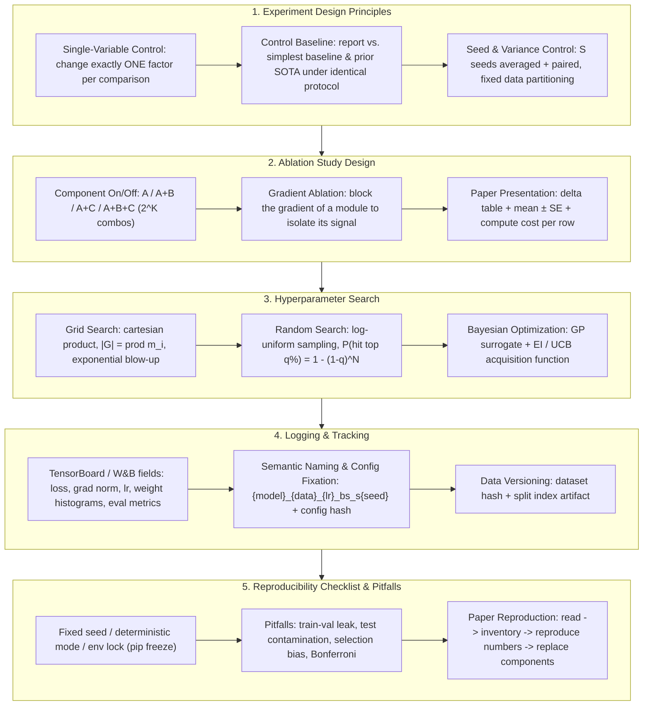

# 🔬 RS Experiment Design & Reproducible Research: Ablations, Seed Control, Hyperparameter Search & the Full Reproducibility Checklist

> **Core Executive Summary**: In Research Scientist (RS) interviews — and in research itself — the difference between a credible paper and an irreproducible one is almost never the model; it is the experiment design. This guide covers the three principles of experiment design (single-variable control, control baselines, and variance control through multi-seed averaging with fixed data partitioning), ablation study conventions (component on/off, gradient ablations, and standard table presentation), hyperparameter search strategies (grid vs. random vs. Bayesian, with budget allocation math), logging discipline (TensorBoard/W&B field checklists, semantic experiment naming, config fixation), the full reproducibility checklist (fixed seeds, data versions, deterministic mode, environment locking), and the classic pitfalls (train-validation leakage, test set contamination, selection bias, and Bonferroni correction). It closes with a Pure Numpy grid-search + multi-seed aggregation implementation and a paper reproduction workflow.

---

## 💡 Interactive Mermaid Architecture Flowchart



---

## 💡 Classic Interview Followups & Core Cheatsheet

* **Key Topic 1**: How do you control randomness when comparing two model variants, and why is a single-seed comparison unreliable?
  * *Standard Answer*: Training is stochastic in initialization, data order, and hardware nondeterminism, so one seed is a single draw from a noisy distribution whose standard error usually exceeds the 0.5%–1% gains papers report. The protocol: (1) fix one global data split shared by all variants; (2) run every variant on the **same** S seeds (paired design); (3) report mean $\pm$ standard error: $\widehat{\text{SE}} = s_m / \sqrt{S}$. Because seeds are shared, the variance of the pairwise difference shrinks by $2\text{Cov}(\bar{m}_A, \bar{m}_B)$, so paired comparison resolves small deltas with far fewer runs.

> 🎤 **Interview answer**: "Conclusion: single-seed comparison is unreliable; run every variant on the same S seeds and report mean ± standard error. Why: training is random in initialization, data order, and hardware nondeterminism, so one seed is a single draw whose SE usually exceeds the claimed 0.5–1% gains; shared seeds shrink the delta variance via −2Cov. Example: with 5 seeds, a 0.6% delta at SE 0.2% is about 3 SEs — claimable; the same 0.6% on a single seed is one coin flip."

* **Key Topic 2**: Design an ablation study for a paper with three novel components; what configurations must you run, and how is the table presented?
  * *Standard Answer*: With components $B, C, D$ on baseline $A$, run a **cumulative chain** $A \to A{+}B \to A{+}B{+}C \to A{+}B{+}C{+}D$ plus a **removal chain** from the full model (Full$-$B, Full$-$C, Full$-$D), so every component gets an individual attribution delta. Every row uses the identical protocol: same seeds, split, training budget, and optimizer schedule. Present multi-seed mean $\pm$ std per configuration with a delta column, plus compute cost (FLOPs / params) per row so reviewers can judge efficiency vs. gain.

> 🎤 **Interview answer**: "Conclusion: for three new components, run a cumulative chain plus a removal chain, every row under the identical protocol, reporting mean ± std with a delta column. Why: the cumulative chain shows incremental gains, the removal chain isolates each component's marginal value in the full model; without protocol consistency the deltas mean nothing. Example: baseline 85.2 → full 87.0, Full−B 86.3 → B contributes +0.7, with FLOPs per row so reviewers can judge whether it's worth it."

* **Key Topic 3**: Compare grid search, random search, and Bayesian optimization under a fixed compute budget.
  * *Standard Answer*: Grid search evaluates the full cartesian product $|\mathcal{G}| = \prod_i m_i$, which grows exponentially and wastes budget on irrelevant dimensions; it is only sensible for tiny discrete spaces. Random search samples configurations i.i.d. from priors ($\lambda^{(i)} \sim p(\lambda)$) — with $N$ trials, $P(\text{hit top } q\%) = 1 - (1-q)^N$, so 60 random trials give >95% probability of touching the top 5% region, and each trial tests every dimension. Bayesian optimization fits a surrogate (Gaussian process) to the history and picks the next point by an acquisition function such as Expected Improvement $\alpha_{EI}(\theta) = \mathbb{E}[\max(f_{best} - f(\theta), 0)]$ (closed form: $(f_{best} - \mu)\Phi(z) + \sigma\phi(z)$). Rule of thumb: random search for large/noisy spaces; Bayesian for few expensive evaluations (LLM fine-tuning); grid only for tiny discrete spaces.

> 🎤 **Interview answer**: "Conclusion: random search by default, Bayesian for expensive evaluations, grid only for tiny discrete spaces. Why: grid budget is devoured exponentially by irrelevant dimensions; 60 random trials have ~95% probability of touching the top-5% region; Bayesian picks points sequentially via a GP surrogate + EI acquisition. Example: 10 hyperparameters at 10 values each is 10 billion grid runs; random search needs 60 — that's the Bergstra & Bengio argument in one line."

* **Key Topic 4**: Your model reports 90.1% test accuracy after trying 200 hyperparameter configurations. Why is this number likely inflated, and how do you correct it?
  * *Standard Answer*: This is **selection bias**: choosing the best of many trials overfits the validation distribution, and the expected maximum of $N$ noisy draws overestimates the true optimum — for i.i.d. Gaussian metrics with noise $\sigma$, $\mathbb{E}[\max_i m_i] \approx \mu + \sigma\sqrt{2\ln N}$ (with $N=200, \sigma=1\%$, inflation $\approx 3.3\%$). The test number for the selected config inherits this inflation. Corrections: (1) hold out a **final test set touched exactly once**; (2) use nested cross-validation so selection and evaluation never share data; (3) report multi-seed mean $\pm$ SE of the selected config, not the single best draw; (4) state the selection procedure transparently.

> 🎤 **Interview answer**: "Conclusion: picking the best of 200 trials inflates the reported number. Why: the expected max of N noisy draws overestimates the true optimum — E[max] ≈ μ + σ√(2 ln N), about +3.3% at N=200, σ=1%. Example: a config whose true ability is 87% can report above 90% after 200 tries — hold out a test set touched exactly once and report the multi-seed mean ± SE of the selected config."

* **Key Topic 5**: Walk through the full workflow of reproducing a published paper's numbers.
  * *Standard Answer*: Step 1 — **Read**: extract the exact protocol (data split, preprocessing, augmentation, seeds, schedule, budget). Step 2 — **Inventory**: enumerate every unspecified hyperparameter (framework defaults like warmup, EMA, weight decay, eval protocol). Step 3 — **Reproduce within tolerance**: a match within a few standard deviations counts as success; if not, sweep the inventory (the unstated default is usually the culprit). Step 4 — **Component replacement**: swap one module at a time (attention, loss, scheduler) into your codebase and measure the delta — turning the paper's claim into your own baseline.

> 🎤 **Interview answer**: "Conclusion: reproduction is a four-step workflow — read, inventory, reproduce within tolerance, replace components. Why: framework defaults (EMA, warmup, weight decay) are the biggest hidden variables; sweep the hypothesis list first, and component replacement turns the paper's claim into a baseline you trust. Example: off by 1.5% — changing the unspecified warmup ratio from 0 to 0.06 fixed it; usually it's a default, not the paper lying."

---

## 📚 Section 1: Experiment Design Principles & Variance Control

### 1.1 The Three Principles of Experiment Design

Three disciplines: change one variable at a time, always have a control, and measure noise by seeds. Their common enemy is "false attribution" — mistaking data volume, luck, or evaluation asymmetry for a method's gain.

| Principle | Requirement | Violation Consequence |
| :--- | :--- | :--- |
| **Single-variable control** | Change exactly one factor per comparison | Confounded results: the gain cannot be attributed to the component |
| **Control baseline** | Report vs. the simplest baseline & prior SOTA under an identical protocol | Gains may come from data, budget, or evaluation, not from your method |
| **Variance control** | $S \ge 3$ seeds per config, averaged; identical data splits | A single seed's noise (often > 1%) dominates a claimed 0.5% gain |

> 📊 **How to read this table**: Focus on the third column, "Violation Consequence" — every row pairs a violation with an interview ambush (confounding, fake gains, noise swamping the claim). Recite those three consequences and the skeleton of any experiment-design answer is set.

> 💡 **Intuition**: Single-variable control is like a cooking comparison — change only the soy sauce if you want to know the taste difference comes from the soy sauce; variance control is like averaging three temperature readings instead of trusting one — a single 37.2°C could be measurement error.
>
> 🎤 **Interview answer**: "Conclusion: three principles — single-variable control, control baselines, variance control. Why: changing multiple factors at once blocks attribution; protocol-mismatched gains may be data or budget luck; single-seed noise often exceeds the claimed 0.5%. Example: if you report A+module vs A but silently switched the optimizer, the interviewer will ask 'is the gain from the module or the optimizer?' — change one thing per experiment."

### 1.2 Seed Control & Multi-Seed Aggregation

Let $m_s$ be the metric (e.g., validation accuracy) on seed $s$. The aggregated estimate is the mean with a standard error:

$$\hat{\mu} = \frac{1}{S}\sum_{s=1}^{S} m_s, \qquad \widehat{\text{SE}} = \frac{1}{\sqrt{S}} \sqrt{\frac{1}{S-1}\sum_{s=1}^{S} (m_s - \hat{\mu})^2}$$

A $95\%$ confidence interval (normality assumed) is $\hat{\mu} \pm t_{0.975, S-1} \cdot \widehat{\text{SE}}$. The rule: **report a delta only if it exceeds roughly $2 \times \widehat{\text{SE}}$ of the difference**. For pairwise comparisons use a paired design (same seeds for both variants) — the variance of the difference $\bar{d} = \bar{m}_A - \bar{m}_B$ is:

$$\text{Var}(\bar{d}) = \text{Var}(\bar{m}_A) + \text{Var}(\bar{m}_B) - 2\,\text{Cov}(\bar{m}_A, \bar{m}_B)$$

Shared seeds make $\text{Cov} > 0$, shrinking the noise of the delta and letting small but real improvements surface with fewer runs.

> 💡 **Intuition**: Multi-seed averaging is like a track meet — one run is weather and form noise; repeated runs reveal true level. Paired design (shared seeds) is letting both athletes race on the same track on the same day: weather cancels out of the difference, leaving only skill.
>
> 🎤 **Interview answer**: "Conclusion: report mean ± SE, and claim a delta only if it exceeds roughly 2×SE of the difference. Why: SE = s/√S, and under a paired design Var(delta) = Var(A) + Var(B) − 2Cov; shared seeds make Cov > 0 and compress the noise. Example: over 5 seeds, A=86.0±0.2 and B=86.6±0.2 — a 0.6 delta at ~2× the delta SE is claimable; the same 0.6% from single seeds means nothing."

### 1.3 Fixed Data Partitioning & Control Baselines

Partition the dataset **once** at the start (by index or hash) and store the split indices as a versioned artifact; never resample per experiment, or the split itself becomes a noise source. Use group/id-aware splitting when samples share a source (same session, same user) to avoid group leakage. The control baseline must run under the identical protocol — same seeds, schedule, and metric — otherwise the "improvement" is an artifact of evaluation asymmetry.

> 💡 **Intuition**: Partition the data once, like printing one version of the exam — re-sampling per experiment is like giving a new exam every round, mixing exam-difficulty noise into the students' scores. Group-aware splitting is "classmates may not sit in two rooms": samples from the same user/session stay together so information cannot sneak across groups.
>
> 🎤 **Interview answer**: "Conclusion: split the data once, at the start, by index or hash, and version the split artifact; split by group when samples share a source. Why: re-sampling makes the split itself a noise source, and the baseline must run under the identical protocol. Example: if 100 sessions of the same user are randomly cut into train and val, the model is evaluated on users it has seen — inflated validation that collapses at launch."

---

## 📚 Section 2: Ablation Study Design

### 2.1 Component On/Off Ablations

For $K$ novel components on baseline $A$, the pragmatic minimum is a cumulative chain plus a removal chain. The ablation table is the paper's "attribution ledger": each component answers "how much does adding it earn, how much does removing it cost":

| Configuration | Components | Multi-Seed Result | Delta vs. Prev |
| :--- | :--- | :--- | :--- |
| Baseline A | — | $85.2 \pm 0.4$ | — |
| A + B | $+$ component B | $86.1 \pm 0.3$ | $+0.9$ |
| A + C | $+$ component C | $86.4 \pm 0.4$ | $+1.2$ |
| A + B + C (full) | all three | $87.0 \pm 0.4$ | $+0.6$ |
| Full $-$ B | B off | $86.3 \pm 0.3$ | contribution of B $= +0.7$ |
| Full $-$ C | C off | $86.0 \pm 0.4$ | contribution of C $= +1.0$ |

The removal chain is the more honest attribution: it shows each component's marginal value in the context of the full model.

> 📊 **How to read this table**: Read the vertical cumulative chain (A→A+B→A+B+C) to check "more is better," then the horizontal removal chain (Full−B / Full−C) for each component's independent contribution. Note the removal deltas (+0.7/+1.0) do not equal the cumulative deltas (+0.9/+1.2) — components interact, and that discrepancy is a favorite interview point.

> 💡 **Intuition**: The cumulative chain asks "how much value does adding give"; the removal chain asks "how necessary is it." B gains +0.9 when added but removing it from the full model only costs +0.7, meaning part of B's contribution overlaps C — the two directions tell different stories, which is exactly why you report both.
>
> 🎤 **Interview answer**: "Conclusion: ablations use a cumulative chain plus a removal chain so every component gets an independent attribution delta, with identical protocol per row. Why: the removal chain shows marginal value in the context of the full model — more honest than additive gains; same seeds, budget, and compute cost per row. Example: baseline 85.2 → full 87.0, Full−C 86.0 means C contributes +1.0; if removing C only cost 0.2, C's value is questionable."

### 2.2 Gradient Ablation

When a component cannot be removed structurally (e.g., it is embedded in a loss term), two ablations isolate its role: **forward-pass ablation** (replace the module with a pass-through, keeping gradient flow) tests whether its output matters; **gradient ablation** (keep the forward pass, zero the component's gradient or detach it) tests whether its learning signal matters. The difference partitions the contribution into "representation effect" vs. "optimization effect".

> 💡 **Intuition**: A module has two ways of "existing" — its output (forward) and its learning signal (gradient). Forward ablation asks "is its output useful?"; gradient ablation asks "is the signal it learns useful?"; the gap between the two splits a black-box attribution in half.
>
> 🎤 **Interview answer**: "Conclusion: when a component can't be removed structurally, separate 'representation effect' from 'optimization effect' via forward vs. gradient ablation. Why: forward ablation replaces the module with a pass-through while keeping gradients; gradient ablation keeps the forward pass and zeros or detaches the gradient. Example: a regularizer embedded in the loss can't be deleted — detach its gradient and watch the metric: the bigger the drop, the more the optimization signal matters."

### 2.3 How to Present Ablations in Papers

Every row: same seeds, split, budget, and metric; report mean $\pm$ std, not a single run; include compute cost (FLOPs, params, runtime); run ablations on the **validation** set and touch the **test** set exactly once; state the selection protocol. A common failure mode is a "hot" seed for your method and a "cold" one for baselines.

> 💡 **Intuition**: The ablation table is the evidence chain handed to reviewers — every row is the same interrogation under the same conditions. Handing your method a "hot" seed and baselines a "cold" one is a referee blowing for the home team; it is one of the most common sources of the reproducibility crisis.
>
> 🎤 **Interview answer**: "Conclusion: same seeds, split, budget, and metric per row; report mean ± std, run ablations on validation and touch test exactly once. Why: protocol mismatch makes any delta unattributable, and seed discretion can flip conclusions. Example: baseline seeds 85.0/85.4/85.8 vs. method 85.9/86.0/86.1 — cherry-picking the best single runs claims +1.1%, the multi-seed means differ by only +0.6%; two very different stories."

---

## 📚 Section 3: Hyperparameter Search

### 3.1 Grid vs. Random vs. Bayesian Optimization

| Aspect | Grid Search | Random Search | Bayesian Optimization |
| :--- | :--- | :--- | :--- |
| Evaluation set | Cartesian product, $|\mathcal{G}| = \prod_i m_i$ | $N$ i.i.d. samples $\lambda^{(i)} \sim p(\lambda)$ | Sequential, adaptively chosen |
| Uses history? | No | No | Yes — GP posterior + acquisition |
| Key assumption | Systematic coverage matters | Only a few dims matter | Objective is smooth, evaluations few |
| Learning rate handling | Fixed grid (often uniform) | Log-uniform $\eta \sim \text{LogUniform}$ | Log-space GP kernel |
| Best when | Tiny discrete spaces | Large/noisy spaces, moderate budget | Few expensive trials (e.g., LLM fine-tuning) |
| Overhead per trial | Minimal | Minimal | Surrogate fit + acquisition optimization |

> 📊 **How to read this table**: Watch the "Learning rate handling" and "Best when" rows — grid gives LR fixed uniform values, random uses log-uniform, Bayesian uses a log-space GP kernel. That is the watershed for how each method treats hyperparameter scale, and the detail interviewers love.

> 💡 **Intuition**: Grid search dials through a phone book — systematic but not smart; random search fires buckshot — every shot covers all dimensions; Bayesian optimization is a guided hunter — past impact points (acquisition function) decide the next shot. When the budget is tight, buckshot and a guide both beat the phone book.
>
> 🎤 **Interview answer**: "Conclusion: random search by default, Bayesian for expensive evaluations, grid only for tiny discrete spaces. Why: grid budget is split exponentially across dimensions; random search covers every dimension per trial — 60 trials give ~95% odds of touching the top 5% region; Bayesian learns from history via GP + EI. Example: 8 hyperparameters at 20 values each is 20 billion grid runs; random search does it in 60 — exponential vs. constant."

### 3.2 Budget Allocation: Why Random Search Beats Grid

In high-dimensional hyperparameter spaces, only a small subset of dimensions typically matters for performance. Grid search wastes its budget re-testing irrelevant dimensions: with $m_i$ values per dimension it only covers each dimension with $\sqrt[N]{}$-grade resolution. Random search, in contrast, tests a new value of **every** hyperparameter on each trial; if only a few dimensions matter, it explores them far more densely. The hit-rate math: after $N$ independent trials, the probability that at least one trial lands in the top $q$ quantile of the relevant region is:

$$P(\text{hit top } q\%) = 1 - (1 - q)^N$$

With $N = 60$, $1 - (0.95)^{60} \approx 0.954$: better than 95% confidence of touching the top 5% region, which grid search on the same budget cannot guarantee (Bergstra & Bengio, 2012).

> 💡 **Intuition**: In high dimensions only a handful of dimensions (learning rate, batch size) usually decide success, yet grid pays the same salary to every dimension — including irrelevant ones. Random search re-rolls every dimension each trial, so the chance of hitting the critical ones compounds; that is the 1−(1−q)^N math.
>
> 🎤 **Interview answer**: "Conclusion: random search beats grid because the budget lands on the dimensions that matter. Why: P(hit top q%) = 1−(1−q)^N — at N=60, q=5%, that's ~95.4%, which grid cannot guarantee on the same budget. Example: a 10-dim space where only 2 dims matter: grid with 10⁶ trials tests 3 values per important dim; random with 10⁶ trials tests 10⁶ different values per important dim — coverage density is not even close."

### 3.3 Sensitive Hyperparameters & Log-Scale Sampling

Learning rate and other multiplicative hyperparameters should be sampled **log-uniformly** rather than uniformly:

$$\log \eta \sim \mathcal{U}(\log 10^{-6},\ \log 10^{-1}) \iff \eta \sim \text{LogUniform}(10^{-6}, 10^{-1})$$

Sensitivity checklist: learning rate, warmup steps, weight decay, batch size (correlated with LR — scale by the linear rule $\eta_B = \eta_0 \sqrt{B / B_0}$), dropout, gradient clipping, and scheduler settings. A warm-up LR range test (linearly increasing LR over a few hundred steps) locates the right order of magnitude in one short run; treat it as a pre-search gate.

> 💡 **Intuition**: Learning rate is a volume knob — perception is multiplicative, not additive: going 0.001 → 0.01 is a "10× louder" experience; 0.05 → 0.06 is imperceptible. Uniform sampling over 0–0.1 wastes budget on intervals you can't hear; log-uniform gives each order of magnitude (1e-4, 1e-3, 1e-2) equal trials — matching the knob's real sensitivity.
>
> 🎤 **Interview answer**: "Conclusion: sample multiplicative hyperparameters like LR log-uniformly, and run a warm-up LR range test before the real search. Why: their sensitive ranges span orders of magnitude; a range test ramps LR linearly over a few hundred steps and the loss blow-up point marks the upper bound. Example: the range test shows LR works in 1e-4–1e-3, so sample 20 times in that interval — far better hit rate than uniform sampling over 0–0.1."

---

## 📚 Section 4: Logging, Tracking & the Reproducibility Checklist

### 4.1 TensorBoard / W&B Field Checklist

| Category | Must-Log Fields |
| :--- | :--- |
| **Optimization** | train loss, val loss, gradient norm, LR (warmup + schedule), weight norm, momentum/beta |
| **Data** | epoch, batch size, sample count, dataset hash/version, split-id artifact |
| **Model** | task metrics per split, per-class metrics, calibration (ECE), weight/gradient histograms |
| **Context** | full config dict, seed(s), GPU/TPU type, framework/env fingerprint, git commit, timestamp |

> 📊 **How to read this table**: The four rows map to four "post-mortem" scenes — gradient norm diagnoses divergence, data hash localizes leakage, histograms reveal weight decay, git commit pins the code. If asked "what's the minimum to log?", answer "at least one field per category."

> 💡 **Intuition**: Logging is the experiment's black box. Training diverged, metrics drifted, results won't reproduce — the box always holds an explanation; missing records is a crash with no flight data: undiagnosable and indefensible.
>
> 🎤 **Interview answer**: "Conclusion: at least one field per category — optimization (loss/grad norm/LR), data (epoch/hash/split), model (metrics/histograms), context (config/seed/git). Why: divergence is diagnosed via grad norm, reproduction via config hash and commit, leakage via data hash. Example: val loss oscillating with exploding grad norm points straight to the optimizer, not the data — no logging, and you guess in the dark."

### 4.2 Experiment Naming & Config Fixation

Name runs semantically so a table row maps to a run id: `{model}_{dataset}_{lr}_{bs}_{seed}`, e.g. `vit_tiny_cifar10_lr3e-4_bs256_s42`. Persist a JSON/YAML config with **every** field, including assumed defaults (attention dropout, Adam betas, warmup, eval protocol). The config hash is the fingerprint: same hash + frozen code = same result. In W&B, diff runs by config hash; never trust a run without a saved config.

> 💡 **Intuition**: Semantic naming lets every table row resolve to a run ID — `vit_tiny_cifar10_lr3e-4_bs256_s42` is readable at a glance; the config hash is the run's digital fingerprint — same hash + same code = same result; a run without a saved config has no birth certificate.
>
> 🎤 **Interview answer**: "Conclusion: semantic naming plus full config persistence; the config hash is the fingerprint. Why: assumed defaults (attention dropout, Adam betas, warmup) never survive otherwise, and config-hash diffing finds discrepancies in seconds. Example: two runs differing only by seed — one glance at names and configs locates them; an old run with no config is untraceable no matter how good its number is."

### 4.3 The Reproducibility Checklist

1. **Fixed seeds everywhere**: `random.seed(0)`, `np.random.seed(0)`, `torch.manual_seed(0)`, `torch.cuda.manual_seed_all(0)`, and seed dataloader workers.
2. **Deterministic mode**: `torch.use_deterministic_algorithms(True)` / `cudnn.deterministic = True` (accept the speed penalty; document nondeterministic ops).
3. **Data versioning**: hash the dataset and the split indices; log both.
4. **Environment locking**: `pip freeze` / `conda env export`, record CUDA/cuDNN versions, commit `requirements-lock.txt`.
5. **Config fixation**: the run's config JSON + code commit hash are part of the result, not an afterthought.

> 💡 **Intuition**: Reproducibility means making "random" replayable: seeds lock sampling, deterministic mode locks operators, data versioning locks inputs, environment locks dependencies, config locks hyperparameters — lose any one of the five locks and luck sneaks back into the results.
>
> 🎤 **Interview answer**: "Conclusion: five locks — full-chain seeds, deterministic mode, data versioning, environment locking, config fixation. Why: nondeterminism comes from sampling, operators, and dependencies; lock all three sources. Example: a colleague's run is off by 2% — check pip freeze first; usually a numpy/CUDA version drift, not a code bug."

### 4.4 Common Pitfalls

- **Train-val leakage**: fitting preprocessing (standardization, PCA) on the full data **before** the split, or fitting it on val+test combined — the val/test statistics leak into training and inflate results.
- **Test set contamination**: tuning hyperparameters on the test set, or re-running the test set after model changes; the test set must be touched exactly once, at the very end.
- **Selection bias**: trying 200 configs and reporting the best draw. The expected max of $N$ i.i.d. draws overestimates the optimum: $\mathbb{E}[\max_i m_i] \approx \mu + \sigma \sqrt{2 \ln N}$; with $N = 200$ and $\sigma = 1\%$ that is roughly $+3.3\%$ of fantasy. Fix: hold out a final test set, use nested CV, report multi-seed mean of the selected config.
- **Multiple comparisons (Bonferroni)**: testing $k$ hypotheses at $\alpha = 0.05$ inflates the family-wise error rate to $1 - (1-0.05)^k$ (≈ 64% for $k = 20$). Apply Bonferroni with the corrected threshold $\alpha' = \alpha / k$, or report corrected p-values.

> 💡 **Intuition**: All four pitfalls are "information smuggling": fitting preprocessing on full data lets val statistics leak into training; re-running the test set leaks the answer to the model; picking the best run treats noise as signal; multiple testing guarantees a lucky coin — flip 20 coins and one will show heads.
>
> 🎤 **Interview answer**: "Conclusion: four pitfalls — train-val leakage, test contamination, selection bias, multiple comparisons; the fixes are fit-after-split, touch test once, nested CV + multi-seed mean, and Bonferroni/Holm/BH. Why: leakage and contamination cross partition boundaries, selection bias swaps max for mean, multiplicity inflates α. Example: best-of-200 inflates by ~3.3% at σ=1%; 20 hypotheses uncorrected give a 64% family-wise error rate."

### 4.5 The Paper Reproduction Workflow

1. **Read**: extract the exact protocol — data split, preprocessing, augmentation, seeds, schedule, total compute budget.
2. **Inventory**: enumerate every unspecified hyperparameter (framework defaults are the usual hidden variables: warmup, EMA decay, weight decay, evaluation protocol) and form a hypothesis list.
3. **Reproduce within tolerance**: a match within a few standard errors of the paper's metric is a success; if it fails, sweep the inventory — the unstated default is almost always the culprit.
4. **Component replacement**: swap one module at a time (attention, loss, scheduler, optimizer) into your codebase and measure the delta; this converts the paper's claim into your own trusted baseline.

> 💡 **Intuition**: Reproduction is not "running the code" — it is "protocol archaeology": the defaults the paper never mentions are behind most discrepancies. Component replacement is like testing a recipe ingredient by ingredient in your own kitchen — turning "allegedly delicious" into "verified delicious."
>
> 🎤 **Interview answer**: "Conclusion: read → inventory → reproduce within tolerance → replace components. Why: framework defaults (warmup/EMA/weight decay) are the hidden variables; sweep the hypothesis list first — within a few SEs counts as success — then swap one module at a time and measure the delta. Example: 1.5% off; changing the unspecified warmup ratio from 0 to 0.06 closed the gap — usually a default, not the paper lying."

---

## 🐍 Pure Numpy Implementation: Grid Search + Multi-Seed Aggregation

```python
import numpy as np

def toy_val_metric(theta: float, seed: int, noise_scale: float = 0.8) -> float:
    """Toy oracle: true optimum at theta=2.0; outcome is noisy per seed."""
    local = np.random.default_rng(seed)
    return -(theta - 2.0) ** 2 + noise_scale * local.standard_normal()

def evaluate_config(theta: float, seeds) -> tuple:
    """One hyperparameter config over S seeds -> (mean, standard error)."""
    scores = np.array([toy_val_metric(theta, s) for s in seeds])
    return float(scores.mean()), float(scores.std(ddof=1) / np.sqrt(len(scores)))

def grid_search_with_seed_aggregation(grid, seeds, top_k: int = 3) -> dict:
    results = {}
    for theta in grid:                                  # outer loop: hyperparams
        results[theta] = evaluate_config(theta, seeds)  # inner: S-seed aggregation
    ranked = sorted(results.items(), key=lambda kv: -kv[1][0])  # rank by mean
    return {
        "best_theta": ranked[0][0],
        "best_mean": ranked[0][1][0],
        "best_se": ranked[0][1][1],
        "top_k": [(t, mean, se) for t, (mean, se) in ranked[:top_k]],
        "all": results,
    }

if __name__ == "__main__":
    grid = np.round(np.arange(0.0, 4.01, 0.25), 2)   # 17 configs
    seeds = list(range(5))                            # 5 seeds each -> 85 runs
    out = grid_search_with_seed_aggregation(grid, seeds)
    print("✅ Grid Search + Multi-Seed Aggregation Complete!")
    print(f"Best theta = {out['best_theta']:.2f} "
          f"(val = {out['best_mean']:+.3f} ± {out['best_se']:.3f})")
    print("Top-3 ranked by mean:")
    for t, m, se in out["top_k"]:
        print(f"  theta={t:5.2f}  val = {m:+.3f} ± {se:.3f}")
```

Watch the noise: the top-1 config by **mean** can differ from the top-1 of any single seed, and the standard error belongs next to every claimed delta — beating the baseline by less than $2 \times \widehat{\text{SE}}$ is a coin flip, not a result.

---

## 📝 Takeaways & Engineering Best Practices

1. **Always multi-seed**: report mean $\pm$ SE over $\ge 3$–5 seeds, paired across variants; a single-seed 0.5% gain is noise, not a result.
2. **One experiment, one changed variable**: without single-variable control, the ablation table cannot be attributed to your components.
3. **Touch the test set exactly once**: tune on validation, freeze the config, then evaluate on test; use nested CV or a fresh split if you must re-select.
4. **Search by budget, not by hope**: random search with log-uniform priors as the default, Bayesian optimization for expensive evaluations, grid only for tiny discrete spaces.
5. **Log everything, freeze everything**: config hash + data version + env lock + deterministic mode are the reproducibility contract; name runs semantically so every table row maps to a run id.
6. **Correct for selection**: whenever you pick the best of $N$ trials, report the selection procedure and validate the final choice on untouched data.
