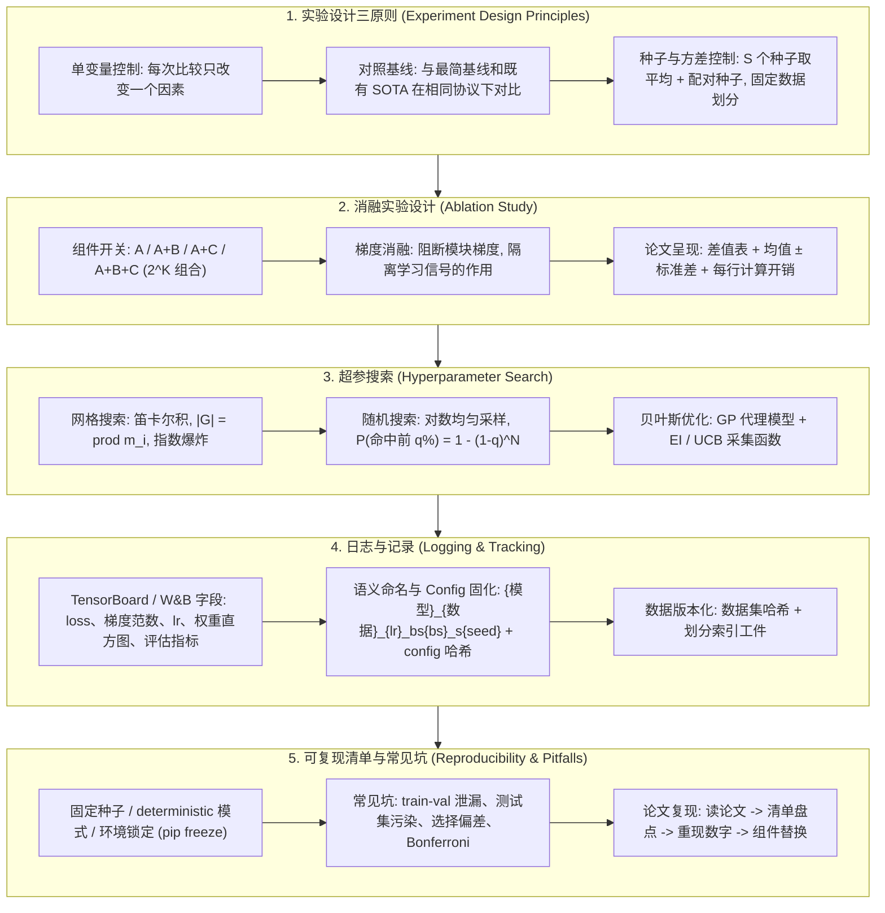

# 🔬 RS 实验设计与可复现研究：消融实验、种子控制、超参搜索与可复现性全景全解

> **核心摘要**：在 RS (Research Scientist) 面试与真实科研中，一篇论文可信与否的分水岭几乎从来不是模型本身，而是实验设计。本指南完整覆盖实验设计三原则（单变量控制、对照基线、多种子平均与固定数据划分的方差控制）、消融实验规范（组件开关、梯度消融、论文呈现）、超参搜索（网格/随机/贝叶斯对比与预算分配数学）、日志纪律（TensorBoard/W&B 字段清单、语义化命名、Config 固化）、完整可复现清单（固定种子、数据版本、deterministic 模式、环境锁定），以及 Train-Val 泄漏、测试集污染、多次试验选最优的选择偏差、Bonferroni 多重比较等常见坑。最后给出 Pure Numpy 网格搜索 + 多种子聚合实现与论文复现 4 步流程。

---

## 💡 交互式 Mermaid 架构流程图



---

## 💡 经典面试追问与考点速查

* **考点 1**：比较两个模型变体时如何控制随机性？为什么单种子比较不可靠，多种子平均具体怎么做？
  * *标准回答*：训练在初始化、数据顺序与硬件非确定性上都是随机的，单种子只是从噪声分布中抽了一次样——单次运行的标准误通常大于论文声称的 0.5%–1% 提升。规范做法是：(1) 固定全局统一的数据划分，所有变体共享；(2) 每个变体在**相同的 S 个种子**上运行（配对设计）；(3) 报告均值 ± 标准误 $\widehat{\text{SE}} = s_m / \sqrt{S}$。由于种子共享，配对差的方差 $\text{Var}(\bar{m}_A - \bar{m}_B)$ 会因协方差项 $2\text{Cov}(\bar{m}_A, \bar{m}_B)$ 而收缩，用更少的运行次数就能分辨出小差异。否则"胜出"的变体可能只是抽到了幸运种子。

> 🎤 **面试速答**: "结论:单种子比较不可靠,多个变体在相同 S 个种子上跑、报均值±标准误。原理:训练在初始化/数据顺序/硬件上都随机,单次结果是噪声分布的一次抽样,其标准误常超过论文声称的 0.5% 提升;共享种子让配对差方差里出现 −2Cov 项,噪声被压缩。举个例子:5 个种子下差值 0.6%、SE 0.2%,约 3 倍 SE 可以宣称;单种子 0.6% 只是抛了一次硬币。"
* **考点 2**：论文包含三个新组件，如何设计消融实验？必须运行哪些配置组合，表格如何呈现？
  * *标准回答*：设基线为 $A$、新组件为 $B, C, D$，严格设计是完整的 $2^K$ 格；务实的最少配置是**累加链** $A \to A{+}B \to A{+}B{+}C \to A{+}B{+}C{+}D$ 加上从完整模型出发的**移除链**（Full$-$B、Full$-$C、Full$-$D），让每个组件都有独立的归因差值。每一行必须协议一致：相同种子、相同划分、相同训练预算、相同优化器与调度器。表格展示多种子均值 ± 标准差 + 差值列，并附每行的计算开销（FLOPs/参数量），让审稿人能权衡效率与收益。

> 🎤 **面试速答**: "结论:三个新组件用累加链加移除链,每行协议一致、报均值±std加差值列。原理:累加链看'逐步加'的贡献,移除链从完整模型往回摘,每个组件都有独立归因差值;协议不一致(种子/预算/调度)时差值毫无意义。举个例子:基线 85.2 → 完整 87.0,Full−B 86.3 说明 B 的边际贡献 +0.7,再附每行 FLOPs 让审稿人判断值不值。"
* **考点 3**：对比网格搜索、随机搜索与贝叶斯优化：固定算力预算下，各自什么时候最合适？
  * *标准回答*：网格搜索评估完整的笛卡尔积 $|\mathcal{G}| = \prod_i m_i$，随维度指数爆炸，并把预算浪费在不重要的维度上，只适合极小的离散空间。随机搜索从先验独立采样（$\lambda^{(i)} \sim p(\lambda)$），$N$ 次试验命中前 $q\%$ 区域的概率为 $1 - (1-q)^N$，60 次随机试验即可达到 >95% 命中前 5% 区域，且每次试验都覆盖所有维度。贝叶斯优化用高斯过程代理历史并依据采集函数（如期望提升 $\alpha_{EI}(\theta) = \mathbb{E}[\max(f_{best} - f(\theta), 0)]$，GP 下有闭式解 $(f_{best} - \mu)\Phi(z) + \sigma\phi(z)$）序贯选点。经验法则：大而嘈杂的空间用随机搜索；评估昂贵（如 LLM 微调）用贝叶斯；只有小离散空间才用网格。

> 🎤 **面试速答**: "结论:默认随机搜索,评估昂贵用贝叶斯,极小离散空间才用网格。原理:网格预算被无关维度指数瓜分;随机搜索每次试验覆盖所有维度,60 次试验有约 95% 概率触及前 5% 区域;贝叶斯用 GP 代理+EI 采集函数序贯选点。举个例子:10 维超参、每维 10 个取值,网格要 100 亿次评估,随机 60 次就够——这就是 Bergstra & Bengio 的经典结论。"
* **考点 4**：你尝试了 200 组超参后得到 90.1% 的测试准确率，为什么这个数字很可能被高估？如何修正？
  * *标准回答*：这是**选择偏差 (Selection Bias)**：从多次试验中挑最优会过拟合验证集分布，$N$ 次噪声抽样的期望最大值系统性高估真实最优值——对均值为 $\mu$、噪声 $\sigma$ 的高斯指标，$\mathbb{E}[\max_i m_i] \approx \mu + \sigma\sqrt{2\ln N}$（$N=200, \sigma=1\%$ 时虚高约 3.3%）。修正方法：(1) 预留**只碰一次的最终测试集**，所有选择完成后再评估；(2) 使用嵌套交叉验证，让选择与评估永不共享数据；(3) 报告所选配置的多种子均值 ± 标准误而非单次最优值；(4) 透明汇报选择过程（试验次数、选择准则）。

> 🎤 **面试速答**: "结论:200 次试验里挑最优,90.1% 大概率虚高。原理:从 N 个噪声抽样里取最大,期望值系统性上偏:E[max] ≈ μ + σ√(2lnN),N=200、σ=1% 时虚高约 3.3%。举个例子:真实能力 87% 的配置,试 200 次后最优很可能报到 90% 以上——必须预留只碰一次的最终测试集,并报所选配置的多种子均值±标准误。"
* **考点 5**：完整描述从读论文到重现数字再到组件替换的论文复现流程。
  * *标准回答*：第一步**读**：提取精确协议（数据划分、预处理、增广、种子、调度、总预算）。第二步**清单盘点**：枚举所有未指明的超参（框架默认值如 warmup、EMA、权重衰减、评估协议），建立嫌疑列表。第三步**容忍范围内重现**：同一指标下差几个标准误以内即算匹配；不匹配就按清单自上而下扫描——未说明的默认值几乎总是元凶。第四步**组件替换**：把论文的模块（注意力、损失、调度器）逐一换入自己的代码库并测量差值，把论文的声称转化为自己可信的基线。

> 🎤 **面试速答**: "结论:复现流程四步——读协议、盘点未声明超参、容忍范围内重现、逐个替换组件。原理:框架默认值(EMA、warmup、权重衰减)是最大隐藏变量,差几个标准误先扫嫌疑清单;组件替换把论文声称变成自己的可信基线。举个例子:复现时差 1.5%,把论文没写的 warmup 比例从 0 调到 0.06 后对上了——多数时候是默认值问题,而不是论文撒谎。"

---

## 📚 第一章：实验设计原则与方差控制

### 1.1 实验设计三原则

实验设计的三大纪律:一次只改一个变量、永远有对照、噪声按种子量度。三者的共同敌人是"伪归因"——把数据量、运气或评估差异误算成方法红利。

| 原则 | 要求 | 违背后果 |
| :--- | :--- | :--- |
| **单变量控制** | 每次比较只改变一个因素 | 结果混杂，增益无法归因于具体组件 |
| **对照基线** | 与最简基线及既有 SOTA 在同一协议下对比 | 增益可能来自数据、预算或评估方式而非方法本身 |
| **方差控制** | 每配置 $S \ge 3$ 个种子取平均；划分固定 | 单种子噪声（常 >1%）压过声称的 0.5% 提升 |

> 📊 **怎么读这张表**: 重点看第三列"违背后果"——每一条都对应一个面试追问(混杂、伪提升、噪声压过声称),能背出这三条,实验设计题的骨架就立住了。

> 💡 **直观理解**: 单变量控制像做菜对比试验——只换酱油才能判断味道变化来自酱油;方差控制像用多次测量代替单次体温读数——一次 37.2°C 可能是误差,三次平均才敢下结论。

> 🎤 **面试速答**: "结论:实验设计三原则是单变量控制、对照基线、方差控制。原理:一次改多个因素无法归因;协议不一致的提升可能是数据或预算红利;单种子噪声常大于声称的 0.5% 提升。举个例子:报告 A+模块 vs A 时若顺手换了优化器,面试官会直接追问'提升来自模块还是优化器'——所以一次只动一个变量。"

### 1.2 种子控制与多种子聚合

设 $m_s$ 为种子 $s$ 上的指标（如验证准确率），聚合估计为均值加标准误：

$$\hat{\mu} = \frac{1}{S}\sum_{s=1}^{S} m_s, \qquad \widehat{\text{SE}} = \frac{1}{\sqrt{S}} \sqrt{\frac{1}{S-1}\sum_{s=1}^{S} (m_s - \hat{\mu})^2}$$

正态假设下的 $95\%$ 置信区间为 $\hat{\mu} \pm t_{0.975, S-1} \cdot \widehat{\text{SE}}$。铁律：**只有当差值超过约 $2 \times \widehat{\text{SE}}$ 时才声称有效果**。成对比较必须采用配对设计（两个变体共用相同种子），因为差值 $\bar{d} = \bar{m}_A - \bar{m}_B$ 的方差为：

$$\text{Var}(\bar{d}) = \text{Var}(\bar{m}_A) + \text{Var}(\bar{m}_B) - 2\,\text{Cov}(\bar{m}_A, \bar{m}_B)$$

共享种子使 $\text{Cov} > 0$，差值的噪声被压缩，少量运行即可分辨出真实的小幅提升。

> 💡 **直观理解**: 多种子平均像体育比赛取多次成绩——单次成绩含天气、状态噪声,多次平均才反映真实水平;配对设计(共用种子)则是让两位选手在同一场地同一天比赛,差值里天气被消掉,只剩水平差。
>
> 🎤 **面试速答**: "结论:报告均值±标准误,差值超过约 2×SE 才可信。原理:SE = s/√S,配对设计下差值方差 = Var(A)+Var(B)−2Cov,共享种子让 Cov>0、噪声收缩。举个例子:5 个种子下 A=86.0±0.2、B=86.6±0.2,差值 0.6 约是差 SE 的 2 倍以上,可以宣称;同一个 0.6% 若只跑单种子,就什么都不是。"

### 1.3 固定数据划分与对照基线

数据集**只在开始时划分一次**（按索引或哈希），划分索引作为版本化工件（如 `split_v3.npy`）存储；绝不可每次实验重新采样，否则划分本身成为新的噪声源。当样本存在同源关系（同一会话、同一用户）时必须按组/按 ID 划分，避免组间泄漏。对照基线必须在完全相同的协议下运行——相同种子、相同调度、相同指标——否则"提升"只是评估不对称的伪影。

> 💡 **直观理解**: 数据只切一次,就像试卷只印一版——每次实验重新采样等于每轮考试换试卷,考生(模型)面对的不确定性里混进了试卷差异。按组划分则是"同班同学不许分到两个考场":同一用户/会话的样本放一起,防止信息在组间偷渡。
>
> 🎤 **面试速答**: "结论:数据只在开始时划分一次并版本化,有同源样本按组划分,基线用相同协议。原理:每次重采样让划分本身变成噪声源,按索引或哈希切分并把 split 文件存档,实验才能相互比较。举个例子:同一用户 100 次会话若被随机切进 train/val,模型等于在'见过'的用户上评估——验证集虚高,上线即露馅。"

---

## 📚 第二章：消融实验设计

### 2.1 组件开关消融 (Component On/Off)

设基线 $A$ 上有 $K$ 个新组件，严格设计是完整的 $2^K$ 格；务实的最少配置是**累加链 + 移除链**。消融表是论文的"归因账本":每个组件单独回答"加它值多少、减它掉多少":

| 配置 | 组件 | 多种子结果 | 相对上一行差值 |
| :--- | :--- | :--- | :--- |
| 基线 A | — | $85.2 \pm 0.4$ | — |
| A + B | $+$ 组件 B | $86.1 \pm 0.3$ | $+0.9$ |
| A + C | $+$ 组件 C | $86.4 \pm 0.4$ | $+1.2$ |
| A + B + C (完整) | 三者全开 | $87.0 \pm 0.4$ | $+0.6$ |
| Full $-$ B | 关掉 B | $86.3 \pm 0.3$ | B 的贡献 $= +0.7$ |
| Full $-$ C | 关掉 C | $86.0 \pm 0.4$ | C 的贡献 $= +1.0$ |

移除链是更诚实的归因：它展示每个组件在完整模型语境下的边际价值。

> 📊 **怎么读这张表**: 先看纵向累加链(A→A+B→A+B+C)验证"越加越好",再看横向移除链(Full−B / Full−C)读出每个组件的独立贡献。注意移除链差值(+0.7/+1.0)不等于累加链增量(+0.9/+1.2)——组件间有交互,这正是面试常挖的对比点。

> 💡 **直观理解**: 累加链是"做加法问价值",移除链是"做减法问必需性"。B 累加时 +0.9、完整模型里拿掉只掉 +0.7,说明 B 的部分贡献被 C 覆盖——组件有冗余时两个方向讲出不同故事,所以报告两个方向才是完整归因。
>
> 🎤 **面试速答**: "结论:消融用累加链+移除链,让每个组件有独立归因差值,每行协议一致。原理:移除链展示组件在完整模型语境下的边际价值,比单独加法更诚实;同种子同预算,附计算开销。举个例子:基线 85.2 → 完整 87.0,Full−C 86.0 说明 C 贡献 +1.0;若去掉 C 只掉 0.2,就该质疑 C 的论文价值。"

### 2.2 梯度消融 (Gradient Ablation)

当组件无法从结构上移除（如嵌入在损失项中）时，用两种消融区分其角色：**前向消融**（把模块替换为恒等 pass-through、保留梯度流）检验组件的输出是否重要；**梯度消融**（保留前向传播、将该组件的梯度置零，或用 detach 计算损失）检验学习信号是否重要。两者效果之差把组件贡献分解为"表征效应"与"优化效应"——这正是 RS 面试官深挖的分析层次。

> 💡 **直观理解**: 同一个模块有两种"存在方式"——输出存在(前向)与学习信号存在(梯度)。前向消融问"它的输出有没有用",梯度消融问"它学到的信号有没有用";两者之差把黑盒归因拆成两半。
>
> 🎤 **面试速答**: "结论:组件拿不掉时,用前向消融与梯度消融拆开'表征效应'和'优化效应'。原理:前向消融把模块换成恒等映射、保留梯度流,检验输出重要性;梯度消融保留前向、把梯度置零或 detach,检验学习信号重要性。举个例子:loss 里嵌入的正则项没法删,就 detach 它的梯度再看指标——掉得越多,说明优化信号越关键。"

### 2.3 论文中的呈现规范

每一行：相同种子、相同划分、相同训练预算、相同指标；报告均值 ± 标准差而非单次运行；附每配置计算开销（FLOPs、参数量、运行时间）；消融在**验证集**上进行，最终模型对**测试集**只测一次；显式说明选择协议，让读者能判断显著性。常见失败模式：给自家方法选"热"种子、给基线选"冷"种子。

> 💡 **直观理解**: 消融表是给审稿人的"证据链",每行都是同一条件下的拷问;给自家方法配"热种子"、给基线配"冷种子",等于裁判吹黑哨——这是复现危机最常见的来源之一。
>
> 🎤 **面试速答**: "结论:每行同种子同预算同指标,报均值±标准差,消融在验证集、测试集只碰一次。原理:协议不一致时任何差值都无法归因;选择种子的自由裁量能让结论翻转。举个例子:基线 3 种子 85.0/85.4/85.8、方法 85.9/86.0/86.1——取最优单次可吹 +1.1%,多种子均值只差 +0.6%,两个故事完全不一样。"

---

## 📚 第三章：超参搜索

### 3.1 网格 vs 随机 vs 贝叶斯优化

| 维度 | 网格搜索 | 随机搜索 | 贝叶斯优化 |
| :--- | :--- | :--- | :--- |
| 评估集合 | 笛卡尔积，$|\mathcal{G}| = \prod_i m_i$ | $N$ 次独立采样 $\lambda^{(i)} \sim p(\lambda)$ | 序贯自适应选点 |
| 是否利用历史 | 否 | 否 | 是 — GP 后验 + 采集函数 |
| 关键假设 | 系统性覆盖有意义 | 只有少数维度起作用 | 目标函数平滑、评估次数少 |
| 学习率处理 | 固定网格（常为均匀） | 对数均匀 $\eta \sim \text{LogUniform}$ | 对数空间 GP 核 |
| 最适用场景 | 极小离散空间 | 大而嘈杂的空间、中等预算 | 评估昂贵（如 LLM 微调） |
| 单次开销 | 极小 | 极小 | 代理拟合 + 采集函数优化 |

> 📊 **怎么读这张表**: 注意"学习率处理"与"最适用场景"两行——网格给学习率固定均匀值、随机给对数均匀采样、贝叶斯在对数空间用 GP 核,这是三种方法对待超参尺度差异的分水岭,也是面试最爱问的细节。

> 💡 **直观理解**: 网格像按电话簿逐行拨打——系统性但不聪明;随机像往靶场撒霰弹——每一发都覆盖全部维度;贝叶斯像有向导的猎人——根据历史弹着点(采集函数)决定下一枪打哪。预算紧张时,霰弹和向导都远胜电话簿。
>
> 🎤 **面试速答**: "结论:默认随机搜索,评估昂贵用贝叶斯,极小离散空间才用网格。原理:网格预算被维度指数瓜分;随机搜索 60 次试验约 95% 概率触及前 5% 区域;贝叶斯用 GP+EI 在历史中学习。举个例子:8 个超参、每维 20 个取值,网格要 200 亿次评估,随机 60 次即可——指数与常数的差距。"

### 3.2 搜索预算分配：为什么随机搜索优于网格

高维超参空间中，通常只有少数维度对性能起关键作用。网格搜索把预算浪费在重复测试无关维度上：每维 $m_i$ 个取值，预算被维度指数瓜分。随机搜索则每次试验都为**每个**超参取新值，若只有少数维度重要，其在这些维度上的覆盖密度远超网格。命中率数学：$N$ 次独立试验至少一次落入相关区域前 $q$ 分位的概率为：

$$P(\text{命中前 } q\%) = 1 - (1 - q)^N$$

$N = 60$ 时 $1 - (0.95)^{60} \approx 0.954$——即超过 95% 概率触及前 5% 区域，同预算下的网格搜索无法保证这一点。这是 Bergstra & Bengio (2012) 的经典论证，也是随机搜索至今仍是强默认基线的原因。

> 💡 **直观理解**: 高维空间里真正决定成败的常常只有 2-3 个维度(学习率、批大小),网格却把预算平均撒给每个维度——等于给无关维度发同样的工资;随机搜索每次试验全维度换新值,命中关键维度的机会被反复叠加,1−(1−q)^N 的数学就是这么来的。
>
> 🎤 **面试速答**: "结论:随机搜索优于网格,因为预算都花在关键维度上。原理:P(命中前 q%) = 1−(1−q)^N,N=60、q=5% 时约 95.4%,网格同预算无法保证。举个例子:10 维空间只有 2 维重要,网格 10⁶ 次试验在重要维度上只测 3 个值,随机 10⁶ 次在重要维度上测 10⁶ 个不同值——覆盖密度天差地别。"

### 3.3 敏感超参与对数尺度采样

学习率等乘法性超参应**对数均匀**采样而非均匀采样：

$$\log \eta \sim \mathcal{U}(\log 10^{-6},\ \log 10^{-1}) \iff \eta \sim \text{LogUniform}(10^{-6}, 10^{-1})$$

敏感度清单：学习率、warmup 步数、权重衰减、批大小（与学习率相关——按线性缩放规则 $\eta_B = \eta_0 \sqrt{B / B_0}$ 联动）、dropout、梯度裁剪、调度器设置。正式烧预算之前，先跑一次 warm-up LR range test（几百步内线性增大学习率）在单次短运行中定位学习率数量级，把它当作预搜索闸门。

> 💡 **直观理解**: 学习率像音量旋钮——响度的感知是乘法不是加法:从 0.001 调到 0.01 是"放大 10 倍"的体验,从 0.05 调到 0.06 几乎无感。均匀采样 0~0.1 会把预算大片浪费在听不出差别的区间,对数均匀则让每个数量级(1e-4/1e-3/1e-2)各分到同等试验数——匹配旋钮的真实敏感度。
>
> 🎤 **面试速答**: "结论:学习率等敏感超参用对数均匀采样,正式搜索前先跑 LR range test 定位数量级。原理:乘法性超参的敏感区间跨数量级,均匀采样把预算花在无关区间;range test 几百步线性抬升学习率,看 loss 开始发散的位置确定上限。举个例子:range test 发现学习率在 1e-4~1e-3 有效,就在该区间对数采样 20 次,命中率远高于在 0~0.1 上均匀采样。"

---

## 📚 第四章：日志记录与可复现清单

### 4.1 TensorBoard / W&B 字段清单

| 类别 | 必记字段 |
| :--- | :--- |
| **优化过程** | train loss、val loss、梯度范数、LR（含 warmup 与调度）、权重范数、momentum/beta |
| **数据** | epoch、批大小、样本数、数据集哈希/版本、划分索引工件 |
| **模型** | 各划分的任务指标、分类别指标、校准 (ECE)、权重/梯度直方图 |
| **上下文** | 完整 config 字典、种子、GPU/TPU 型号、框架/环境指纹、git commit、时间戳 |

> 📊 **怎么读这张表**: 四行对应四个"事后追责"场景——梯度范数诊断不收敛、数据哈希定位泄漏、直方图看权重退化、git commit 锁定代码。面试若问"日志最少记什么",答"四类各至少一个"即可。

> 💡 **直观理解**: 日志是实验的"黑匣子"。训练崩了、指标飘了、结果复现不出来,黑匣子里一定有一项能解释;缺记录等于飞机坠毁后没有飞行数据——无法诊断,也无法辩护。
>
> 🎤 **面试速答**: "结论:每类至少记一个字段:优化(loss/梯度范数/LR)、数据(epoch/哈希/划分)、模型(指标/直方图)、上下文(config/种子/git)。原理:不收敛查梯度范数,复现不了查 config 哈希与代码 commit,泄漏查数据哈希。举个例子:val loss 震荡但 grad norm 爆炸,就能秒定位是梯度问题而非数据问题。"

### 4.2 实验命名与 Config 固化

语义化命名让表格的每一行都能映射到运行 ID：`{模型}_{数据集}_{lr}_{bs}_{seed}`，如 `vit_tiny_cifar10_lr3e-4_bs256_s42`。持久化包含**所有**字段的 JSON/YAML 配置——包括你认为是默认值的字段（attention dropout、Adam betas、epsilon、warmup、评估协议）。Config 哈希即指纹：相同哈希 + 冻结代码 = 相同结果。在 W&B 中按 config 哈希 diff 实验；没有保存 config 的运行一律不可信。

> 💡 **直观理解**: 语义化命名让表格每一行都能"按名索骥"找到运行 ID——`vit_tiny_cifar10_lr3e-4_bs256_s42` 一眼可读;config 哈希是运行的数字指纹,同哈希+同代码=同结果;没存 config 的运行等于没有出生证明。
>
> 🎤 **面试速答**: "结论:语义化命名 + 全量 config 持久化,config 哈希即指纹。原理:默认值(attention dropout、Adam betas、warmup)不存就永远无法复现,按 config 哈希 diff 实验。举个例子:两个实验只差 seed,名字与 config 一对比 5 秒定位;没存 config 的老运行,再好的结果也无法追溯。"

### 4.3 可复现性检查清单

1. **全链路固定种子**：`random.seed(0)`、`np.random.seed(0)`、`torch.manual_seed(0)`、`torch.cuda.manual_seed_all(0)`，并固定 dataloader worker 种子。
2. **Deterministic 模式**：`torch.use_deterministic_algorithms(True)` / `cudnn.deterministic = True`（接受速度代价）；显式记录非确定性算子（部分 CUDA kernel）。
3. **数据版本化**：对数据集与划分索引分别做哈希并记录。
4. **环境锁定**：`pip freeze` / `conda env export`，记录 CUDA/cuDNN 版本，提交 `requirements-lock.txt`。
5. **Config 固化**：运行的 config JSON + 代码 commit 哈希是结果的一部分，而非事后补充。

> 💡 **直观理解**: 可复现 = 让"随机"变"可重放":种子锁住采样、deterministic 锁住算子、数据版本锁住输入、环境锁住依赖、config 锁住超参——五把锁缺一把,运气就会偷偷溜进结果。
>
> 🎤 **面试速答**: "结论:五件套——全链路种子、deterministic 模式、数据版本化、环境锁定、config 固化。原理:非确定性来自采样、算子与依赖三个源头,逐个锁死才能复现。举个例子:复现同事实验差 2%,先查 pip freeze——大概率是 numpy/CUDA 版本漂移,而不是代码问题。"

### 4.4 常见坑：泄漏、污染、选择偏差与多重比较

- **Train-Val 泄漏**：在划分**之前**用全量数据拟合预处理（标准化、PCA），或在 val+test 合并数据上拟合——val/test 的统计量渗入训练，虚增结果。
- **测试集污染**：用测试集调超参，或改模型后反复测测试集；测试集必须**只碰一次**，放在最后。
- **选择偏差**：试了 200 组配置只报最优的一次。$N$ 次独立采样的期望最大值高估最优值：$\mathbb{E}[\max_i m_i] \approx \mu + \sigma \sqrt{2 \ln N}$；$N=200, \sigma=1\%$ 时虚高约 $+3.3\%$。修正：预留最终测试集、嵌套交叉验证、报所选配置的多种子均值。
- **多重比较 (Bonferroni)**：在 $\alpha = 0.05$ 下检验 $k$ 个假设，族错误率膨胀为 $1 - (1-0.05)^k$（$k=20$ 时约 64%）。应用 Bonferroni 将阈值校正为 $\alpha' = \alpha / k$，或报告校正后 p 值——RS 候选人应当能脱口而出。

> 💡 **直观理解**: 四个坑的共同点是"信息偷渡":预处理在全量数据上拟合 = val 的统计量渗进训练;反复测测试集 = 答案提前泄漏给模型;挑最优 = 噪声被当成信号;多次检验 = 抛 20 次硬币总有一次正面。每个坑都可以用一个"被考官追问就露馅"的场景记住。
>
> 🎤 **面试速答**: "结论:四大坑——train-val 泄漏、测试集污染、选择偏差、多重比较;修正:拟合前切分、测试集只碰一次、嵌套 CV+多种子均值、Bonferroni/Holm/BH。原理:泄漏与污染让信息穿越划分边界,选择偏差让 max 取代 mean,多重检验让 α 膨胀。举个例子:200 组配置挑最优,σ=1% 时虚高 3.3%;k=20 个假设不校正,族错误率 64%。"

### 4.5 论文复现流程

1. **读**：提取精确协议——数据划分、预处理、增广、种子、调度、总计算预算。
2. **清单盘点**：枚举所有未指明的超参（框架默认值是最常见的隐藏变量：warmup、EMA 衰减、权重衰减、评估协议），建立嫌疑列表。
3. **容忍范围内重现**：与论文指标差几个标准误以内即算匹配；失败则按清单自上而下扫描——未说明的默认值几乎总是元凶。
4. **组件替换**：把论文的模块（注意力、损失、调度器、优化器）逐一换入自己的代码库并测量差值，把论文的声称转化为自己可信的基线。

> 💡 **直观理解**: 复现不是"跑通代码",而是"协议考古"——论文没写的默认值才是绝大多数差异的元凶;组件替换则像把别人的菜谱逐条试进自家厨房,把"据说好吃"变成"我验证过好吃"。
>
> 🎤 **面试速答**: "结论:读→盘点→重现→替换四步。原理:框架默认值(warmup/EMA/权重衰减)是隐藏变量,先扫嫌疑清单,差几个标准误内算成功;组件逐个换入并测差值。举个例子:差 1.5% 复现不出来,把没写的 warmup 比例从 0 调到 0.06 就对上了——多数时候是默认值问题,不是论文撒谎。"

---

## 🐍 Pure Numpy 实现：网格搜索 + 多种子聚合

```python
import numpy as np

def toy_val_metric(theta: float, seed: int, noise_scale: float = 0.8) -> float:
    """玩具 oracle: 真实最优在 theta=2.0, 每个种子的结果带噪声。"""
    local = np.random.default_rng(seed)
    return -(theta - 2.0) ** 2 + noise_scale * local.standard_normal()

def evaluate_config(theta: float, seeds) -> tuple:
    """单个超参配置在 S 个种子上运行 -> (均值, 标准误)。"""
    scores = np.array([toy_val_metric(theta, s) for s in seeds])
    return float(scores.mean()), float(scores.std(ddof=1) / np.sqrt(len(scores)))

def grid_search_with_seed_aggregation(grid, seeds, top_k: int = 3) -> dict:
    results = {}
    for theta in grid:                                  # 外层循环: 超参数
        results[theta] = evaluate_config(theta, seeds)  # 内层: S 种子聚合
    ranked = sorted(results.items(), key=lambda kv: -kv[1][0])  # 按均值排序
    return {
        "best_theta": ranked[0][0],
        "best_mean": ranked[0][1][0],
        "best_se": ranked[0][1][1],
        "top_k": [(t, mean, se) for t, (mean, se) in ranked[:top_k]],
        "all": results,
    }

if __name__ == "__main__":
    grid = np.round(np.arange(0.0, 4.01, 0.25), 2)   # 17 个配置
    seeds = list(range(5))                            # 每配置 5 个种子 -> 85 次运行
    out = grid_search_with_seed_aggregation(grid, seeds)
    print("✅ 网格搜索 + 多种子聚合完成!")
    print(f"最优 theta = {out['best_theta']:.2f} "
          f"(val = {out['best_mean']:+.3f} ± {out['best_se']:.3f})")
    print("按均值排序 Top-3:")
    for t, m, se in out["top_k"]:
        print(f"  theta={t:5.2f}  val = {m:+.3f} ± {se:.3f}")
```

注意其中的噪声动力学：按**均值**排名的 Top-1 配置可能与任意单种子的 Top-1 不同，而标准误才是每个声称差值旁边必须报出的数字——均值领先基线不到 $2 \times \widehat{\text{SE}}$ 的配置不是结果，只是抛硬币。

---

## 📝 总结与学习路线

1. **多种子纪律**：所有实验报告均值 ± 标准误（$\ge 3$–5 个种子、变体间配对）；单种子 0.5% 的提升是噪声而非结论。
2. **单变量控制**：一次只改一个因素，否则消融表无法归因于你的组件。
3. **测试集只碰一次**：验证集调参、冻结配置、最后测测试集；需要重新选择时使用嵌套交叉验证或全新划分。
4. **按预算搜索而非按直觉搜索**：默认随机搜索 + 对数均匀先验，评估昂贵时升级贝叶斯优化，网格只留给极小离散空间。
5. **日志与固化**：config 哈希 + 数据版本 + 环境锁定 + deterministic 模式即可复现契约；语义化命名让表格行映射到运行 ID。
6. **校正选择偏差**：任何"从 N 次试验里挑最优"的结论都要说明选择过程，并用未触碰过的数据验证最终选择。
