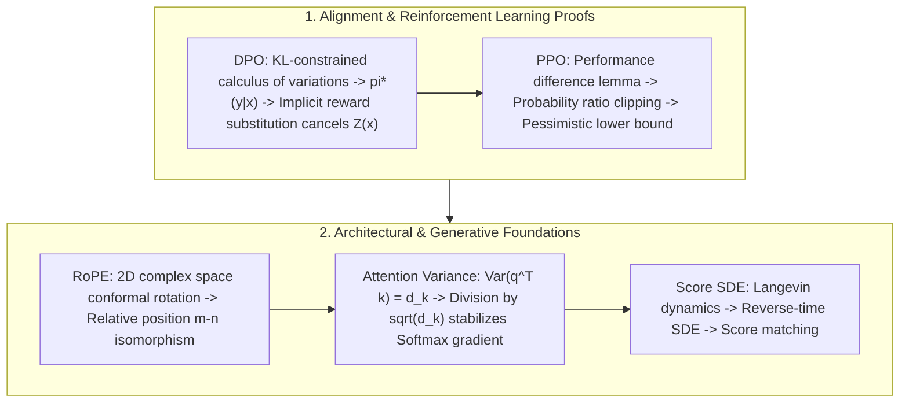

# 🌐 RS Math Proofs: PPO Clipped Loss, DPO Closed-Form & RoPE Matrix

> **Executive Summary**: Whiteboard math interviews for Research Scientist (RS) positions test your ability to derive closed-form optimal estimators, optimization bounds, and probabilistic invariants from first principles without external libraries. This guide compiles gold-standard proofs: DPO closed-form implicit reward derivation, PPO clipped pessimistic lower bound, RoPE complex inner product isomorphism, Attention scaling variance, and Score SDE reverse diffusion dynamics.

---

## 💡 Interactive Mermaid Architecture



---

## Chapter 1: DPO Closed-Form Optimal Policy & Implicit Reward Proof

### 1.1 Variational Derivation of Optimal Policy
Consider the KL-regularized RLHF objective:
$$\max_{\pi} \mathbb{E}_{x \sim \mathcal{D}, y \sim \pi(y|x)} [r(x, y)] - \beta \mathbb{D}_{\text{KL}}(\pi(y|x) \parallel \pi_{\text{ref}}(y|x))$$

For any given input $x$:
$$\max_{\pi} \sum_y \pi(y|x) \left( r(x, y) - \beta \log \frac{\pi(y|x)}{\pi_{\text{ref}}(y|x)} \right) = \max_{\pi} -\beta \sum_y \pi(y|x) \log \left( \frac{\pi(y|x)}{\pi_{\text{ref}}(y|x) \exp\left( \frac{1}{\beta} r(x, y) \right)} \right)$$

Define the partition function $Z(x) = \sum_y \pi_{\text{ref}}(y|x) \exp\left( \frac{1}{\beta} r(x, y) \right)$:
$$= \max_{\pi} -\beta \mathbb{D}_{\text{KL}} \left( \pi(y|x) \,\Big\|\, \frac{1}{Z(x)} \pi_{\text{ref}}(y|x) \exp\left( \frac{1}{\beta} r(x, y) \right) \right) + \beta \log Z(x)$$

Since $\mathbb{D}_{\text{KL}} \ge 0$ with equality iff the distributions are identical, the **unique optimal policy** is:
$$\pi^*(y|x) = \frac{1}{Z(x)} \pi_{\text{ref}}(y|x) \exp\left( \frac{1}{\beta} r(x, y) \right)$$

### 1.2 Implicit Reward Substitution & Partition Function Cancellation
Taking natural logarithms:
$$r(x, y) = \beta \log \frac{\pi^*(y|x)}{\pi_{\text{ref}}(y|x)} + \beta \log Z(x)$$

Substitute into the Bradley-Terry model $P(y_w \succ y_l \mid x) = \sigma(r(x, y_w) - r(x, y_l))$:
$$r(x, y_w) - r(x, y_l) = \beta \log \frac{\pi^*(y_w|x)}{\pi_{\text{ref}}(y_w|x)} - \beta \log \frac{\pi^*(y_l|x)}{\pi_{\text{ref}}(y_l|x)}$$

The partition constant $\beta \log Z(x)$ cancels out cleanly, yielding the **DPO Loss Function**:
$$\mathcal{L}_{\text{DPO}}(\theta) = -\mathbb{E}_{(x, y_w, y_l) \sim \mathcal{D}} \left[ \log \sigma \left( \beta \log \frac{\pi_\theta(y_w \mid x)}{\pi_{\text{ref}}(y_w \mid x)} - \beta \log \frac{\pi_\theta(y_l \mid x)}{\pi_{\text{ref}}(y_l \mid x)} \right) \right]$$

---

## Chapter 2: PPO Clipped Objective & Pessimistic Lower Bound

Under the Kakade-Langford performance difference lemma:
$$\eta(\pi_\theta) - \eta(\pi_{\text{old}}) = \mathbb{E}_{s \sim \rho_{\pi_\theta}, a \sim \pi_\theta} [A^{\pi_{\text{old}}}(s, a)]$$

PPO defines the clipped surrogate objective:
$$L^{\text{CLIP}}(\theta) = \mathbb{E}_t \left[ \min\left( r_t(\theta) \hat{A}_t, \, \text{clip}(r_t(\theta), 1-\epsilon, 1+\epsilon) \hat{A}_t \right) \right]$$

* **When Advantage $\hat{A}_t > 0$ (Positive outcome)**: If $r_t(\theta) > 1+\epsilon$, $\min(r_t \hat{A}_t, (1+\epsilon)\hat{A}_t) = (1+\epsilon)\hat{A}_t$, zeroing out the gradient and preventing destructive over-updates.
* **When Advantage $\hat{A}_t < 0$ (Negative outcome)**: If $r_t(\theta) > 1+\epsilon$, the clipped term $(1+\epsilon)\hat{A}_t$ is less negative than $r_t \hat{A}_t$. The $\min$ operator preserves $r_t \hat{A}_t$, exerting strong negative gradients to penalize bad actions.

This constructs a **pessimistic lower bound** that ensures monotonic policy improvement without requiring second-order Hessian inversions.

---

## Chapter 3: RoPE Complex Inner Product Isomorphism

Goal: Find mappings $f(q, m)$ and $f(k, n)$ such that $\langle f(q, m), f(k, n) \rangle = g(q, k, m-n)$.

In 2D complex space, using polar forms $q = \|q\| e^{i\theta_q}$ and $f(q, m) = \|q\| e^{i(\theta_q + \phi(m))}$:
$$f(q, m) f(k, n)^* = \|q\| \|k\| e^{i(\theta_q - \theta_k + \phi(m) - \phi(n))}$$

To ensure dependence strictly on $m-n$, the phase function must satisfy $\phi(m) - \phi(n) = \phi(m-n) \implies \phi(m) = m\theta$.
In matrix form:
$$R_m = \begin{bmatrix} \cos(m\theta) & -\sin(m\theta) \\ \sin(m\theta) & \cos(m\theta) \end{bmatrix}$$
Since $R_m^T R_m = I$, the transformation is orthogonal and preserves vector norms: $\|R_m q\|_2 = \|q\|_2$.

```python
import numpy as np

def pure_python_rope_rotation(x: np.ndarray, m: int, theta: float = 10000.0) -> np.ndarray:
    d = len(x)
    freqs = 1.0 / (theta ** (np.arange(0, d, 2) / d))
    angles = m * freqs
    cos_a, sin_a = np.cos(angles), np.sin(angles)
    
    x_rotated = np.zeros_like(x)
    for i in range(d // 2):
        x_rotated[2*i] = x[2*i] * cos_a[i] - x[2*i+1] * sin_a[i]
        x_rotated[2*i+1] = x[2*i] * sin_a[i] + x[2*i+1] * cos_a[i]
    return x_rotated

if __name__ == "__main__":
    vec = np.array([1.0, 2.0, 3.0, 4.0])
    print("✅ RoPE Vector (m=1):", pure_python_rope_rotation(vec, m=1))
```

---

## Chapter 4: Self-Attention Scaling Factor $\frac{1}{\sqrt{d_k}}$ Variance Proof

Assume independent components $q_i, k_i \sim \mathcal{N}(0, 1)$ for $i \in \{1, \dots, d_k\}$:
$$\mathbb{E}[q_i] = \mathbb{E}[k_i] = 0, \quad \text{Var}(q_i) = \text{Var}(k_i) = 1$$

For the dot product $S = q^T k = \sum_{i=1}^{d_k} q_i k_i$:
$$\mathbb{E}[S] = \sum_{i=1}^{d_k} \mathbb{E}[q_i]\mathbb{E}[k_i] = 0$$
$$\text{Var}(S) = \sum_{i=1}^{d_k} \text{Var}(q_i k_i) = \sum_{i=1}^{d_k} \mathbb{E}[q_i^2]\mathbb{E}[k_i^2] = \sum_{i=1}^{d_k} 1 \cdot 1 = d_k$$

Without scaling, variance grows linearly with feature dimension $d_k$, pushing Softmax inputs into vanishing gradient saturation regions. Dividing by $\sqrt{d_k}$ normalizes the variance to $\text{Var}(S / \sqrt{d_k}) = d_k / d_k = 1$.
